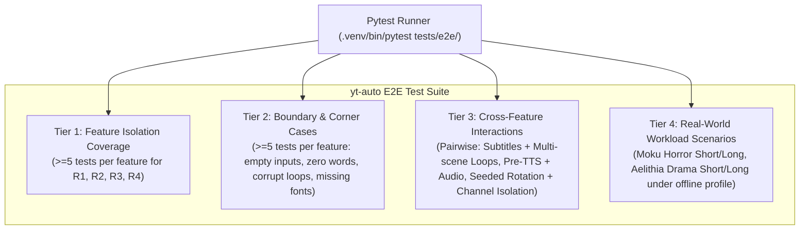

# Test Infrastructure & Specification: yt-auto Visual Quality & Narrative Suite

## 1. Test Architecture & Core Philosophy

The `yt-auto` End-to-End (E2E) testing framework enforces opaque-box, requirement-driven verification across loop catalog activation, dynamic aesthetic subtitles, narrative coherence, and bare-metal resource efficiency.

### 1.1. Core Directives
1. **Opaque-Box Requirement-Driven**: Tests assert strictly against external contracts, APIs, input/output behaviors, file system artifacts, schema validations, and media stream properties derived from `ORIGINAL_REQUEST.md` (## 2026-09-07T19:33:24Z) and `PROJECT.md`.
2. **Zero Cheating & Absolute Integrity**: No facade tests, mock bypasses that swallow failures, or hardcoded fake pass results. Tests perform authentic calculations, media probing via `ffprobe`, SQLite querying, ASS subtitle parsing, and text coherence analysis.
3. **Dual Track & Progressive Testability**: Tests are verifiable using features from completed milestones. For features pending implementation in active milestones (M1: Loop Catalog, M2: Subtitles, M3: Narrative Gate, M4: Bare-metal Stability), tests clearly report pending milestone failures (`XFAIL`) until implemented.
4. **Hermeticity & Zero-Quota Determinism**: All tests run completely offline. Network calls are blocked by `tests/conftest.py`. Media synthesis and word timestamps use deterministic generators from `tests/e2e/helpers.py`.
5. **Bare-Metal Resource Safety**: Tests verify memory RSS tracking via `rusage`, fast encoding presets (`veryfast`), timeout enforcement (<300s shorts, <900s longs), and safe concurrency limits.

---

## 2. 4-Tier Test Architecture



### 2.1. Tier 1: Feature Coverage (>=5 tests per feature)
- **R1: Loop Catalog & Visual Diversity (`test_e2e_loop_catalog.py`)**:
  - `F01`: Scan and verify 64+ cinematic loops in `assets/loops/horizontal` and `vertical`.
  - `F02`: `sync_catalog_from_assets()` indexes >50 verified loops into SQLite table `video_loops`.
  - `F03`: Auto-seeding on empty database startup (`count_loops() < 50`).
  - `F04`: Category aliasing in `LoopVideoEngine.CATEGORY_ALIASES` and `THEMATIC_CATEGORIES`.
  - `F05`: Channel isolation (`moku` vs `aelithia`) and deterministic seeded rotation.
  - `F06`: Deprecation and exclusion of monochrome defaults (`maritime_lighthouse`, `arctic_desolation`).
- **R2: Dynamic Subtitles & Aesthetics (`test_e2e_subtitles_aesthetics.py`)**:
  - `F07`: Subtitle pipeline reactivation (`subtitles_active = True`).
  - `F08`: Aesthetic typography with `Montserrat-Black.ttf` and safe margins ($MarginV \ge 480$px for 9:16 Shorts, $MarginV \ge 130$px for 16:9 Longs).
  - `F09`: Multi-scene subdivision for longs (8-15s per scene).
  - `F10`: Multi-scene video background composition in `LoopVideoEngine`.
  - `F11`: Single-pass FFmpeg filtergraph enrichment (scaling, subtle vignette/color, libass burn).
- **R3: Narrative Coherence & Pre-TTS Gate (`test_e2e_narrative_coherence.py`)**:
  - `F12`: 3-act narrative structure enforcement (hook, conflict/buildup, climax/resolution).
  - `F13`: Single POV and psychological coherence across narration.
  - `F14`: Neutral Spanish punctuation (`¿`, `¡`) and elimination of formulaic crutches.
  - `F15`: Pre-TTS narrative validation gate (`validate_narrative_coherence` / `NarrativeQualityGate`).
  - `F16`: Dynamic thematic fallback story generation for `moku` and `aelithia`.
- **R4: Resource Stability & Bare-Metal Supervisor (`test_e2e_resource_stability.py`)**:
  - `F17`: Strict render timeout enforcement (<=300s shorts, <=900s longs).
  - `F18`: Memory RSS leak tracking via `RUSAGE_CHILDREN`.
  - `F19`: Regression unit suite certification and integrity.
  - `F20`: Supervisor daemon `./deploy/ctl.sh status` contract verification.

### 2.2. Tier 2: Boundary & Corner Cases (>=5 tests per feature)
- **R1 Boundaries**: Empty asset directory sync, corrupt/truncated (<25KB) loops, unknown category fallback, all loops excluded, non-video extension filtering, SQL injection resilience.
- **R2 Boundaries**: Empty word timestamps, single-word cue duration, extreme 100-word cue wrapping, missing font fallback, negative cue timestamp clamping, excessive downward drift clamping.
- **R3 Boundaries**: Empty script rejection, under-length scripts (<115 words for shorts), over-length scripts (>170 words for shorts), unpaired inverted punctuation, English/Spanglish leakage rejection, forbidden legacy alias rejection.
- **R4 Boundaries**: FFmpeg timeout handling, disk space exhaustion guard, zero-byte partial output cleanup, stale PID lockfile recovery, concurrency semaphore throttling.

### 2.3. Tier 3: Cross-Feature Interactions
- Subtitles burned accurately across multi-scene background loop transitions.
- Pre-TTS narrative validation failure halts pipeline before invoking audio synthesis.
- Seeded loop rotation combined with channel isolation ensures thematic divergence between channels.

### 2.4. Tier 4: Real-World Workload Scenarios (`test_e2e_pipeline_canary.py`)
- **Moku Horror Short**: Complete offline generation with 1080x1920 vertical canvas, horror loop, Montserrat ASS subtitles, faststart moov atom, and loudness validation.
- **Moku Horror Long**: Multi-scene horizontal (1920x1080) video with 8-15s scene changes, horror pacing, and safe margins.
- **Aelithia Drama Short**: Vertical short featuring drama thematic loop, human dilemma script, and dynamic subtitles.
- **Aelithia Drama Long**: Multi-scene horizontal longform video with drama aesthetics and narrative progression.

---

## 3. Test Suite File Mapping

| File | Requirement / Tier | Scope |
| :--- | :--- | :--- |
| `tests/e2e/test_e2e_loop_catalog.py` | R1 (M1) / Tiers 1-3 | Loop scanning, SQLite indexing, auto-seeding, aliases, rotation, boundaries |
| `tests/e2e/test_e2e_subtitles_aesthetics.py` | R2 (M2) / Tiers 1-3 | Subtitle pipeline reactivation, Montserrat font, safe margins, multi-scene, boundaries |
| `tests/e2e/test_e2e_narrative_coherence.py` | R3 (M3) / Tiers 1-3 | 3-act structure, single POV, neutral Spanish, pre-TTS gate, crutch elimination, boundaries |
| `tests/e2e/test_e2e_resource_stability.py` | R4 (M4) / Tiers 1-3 | Bare-metal timeouts, presets, RSS memory monitoring, supervisor status, boundaries |
| `tests/e2e/test_e2e_pipeline_canary.py` | R1-R4 (M5) / Tier 4 & Pairwise | Real-world workload scenarios for Moku/Aelithia Short/Long and pairwise interactions |
| `tests/e2e/test_tier1_features.py` | Baseline Suite | Existing baseline feature isolation tests |
| `tests/e2e/test_tier2_boundaries.py` | Baseline Suite | Existing baseline boundary tests |
| `tests/e2e/test_tier3_combinations.py` | Baseline Suite | Existing baseline combination tests |
| `tests/e2e/test_tier4_workloads.py` | Baseline Suite | Existing baseline workload tests |

---

## 4. Invocation Commands & Execution

### 4.1. Complete E2E Suite Run
```bash
.venv/bin/pytest tests/e2e/ -v
```

### 4.2. Running Specific Requirements
```bash
# R1: Loop Catalog & Indexing
.venv/bin/pytest tests/e2e/test_e2e_loop_catalog.py -v

# R2: Dynamic Subtitles & Aesthetics
.venv/bin/pytest tests/e2e/test_e2e_subtitles_aesthetics.py -v

# R3: Narrative Coherence & Quality Gate
.venv/bin/pytest tests/e2e/test_e2e_narrative_coherence.py -v

# R4: Resource Efficiency & Bare-Metal Supervisor
.venv/bin/pytest tests/e2e/test_e2e_resource_stability.py -v

# Real-World Workloads & Canary Runs
.venv/bin/pytest tests/e2e/test_e2e_pipeline_canary.py -v
```

### 4.3. Pytest Discovery Only
```bash
.venv/bin/pytest tests/e2e/ --collect-only
```
