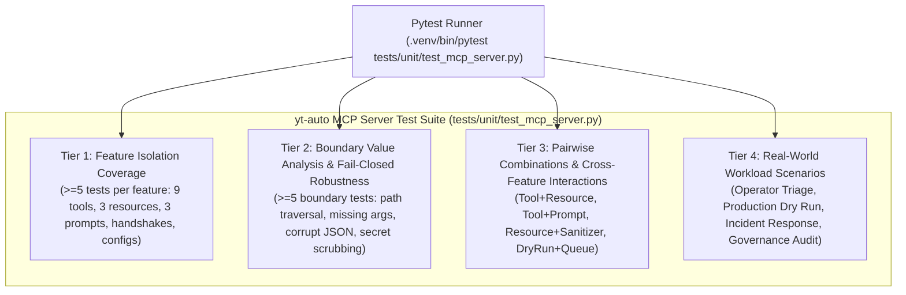

# Test Infrastructure & Specification: yt-auto MCP Server Suite

## 1. Test Architecture & Core Philosophy

The `yt-auto` Model Context Protocol (MCP) server test suite enforces opaque-box, requirement-driven verification across all tools, resources, prompts, lifecycle transports, fail-closed security mechanisms, and client configurations.

### 1.1. Core Directives
1. **Opaque-Box Requirement-Driven**: Tests assert strictly against external contracts, schemas, input/output behaviors, protocol representations, and security boundaries defined in `ORIGINAL_REQUEST.md` (## 2026-09-19T00:32:27Z) and `PROJECT.md`.
2. **Deterministic Offline Execution & Zero Quota**: All tests run strictly offline under the global `offline_provider_guard` in `tests/conftest.py`. External network connections and cloud API calls are blocked. Tools execute in synthetic test or dry-run modes with zero quota consumption.
3. **Synchronous Harness with Asyncio Wrapping**: Tests are written as standard synchronous `pytest` functions that wrap asynchronous MCP SDK calls using `asyncio.run()` (e.g. `asyncio.run(server.call_tool(...))`). This provides deterministic loop management under `tests/conftest.py` without third-party async test runner flakiness.
4. **Fail-Closed Security & Sanitization**: Absolute zero credential leakage in error messages, payload dumps, or logging. Secrets, tokens, and sensitive file paths (`cookies_path`, `youtube_token_path`) are verified to be masked (`[REDACTED]`) or converted to boolean presence flags.
5. **Inviolable Governance & Resource Ceilings**: Testing verifies adherence to project governance: peak resource usage strictly within **≤ 2 CPU Cores** and **≤ 2.0 GiB RAM**, zero Playwright/browser dependencies outside session fallback in `src/youtube/`, and zero resurrected legacy architecture docs (`docs/architecture/0*.md`).

---

## 2. 4-Tier Test Architecture



### 2.1. Tier 1: Feature Coverage (>=5 tests per feature)
- **Protocol Handshakes & Server Lifecycle**:
  - Server factory instantiation (`create_mcp_server()`).
  - Server metadata validation (`name == "yt-auto"`, `version == "2.2.0"`).
  - Tools listing handshake (`server.list_tools()`).
  - Resources listing handshake (`server.list_resources()` / `server.list_resource_templates()`).
  - Prompts listing handshake (`server.list_prompts()`).
- **Tool 1: `system_preflight`**:
  - Happy path preflight execution for channel `moku`.
  - Happy path preflight execution for channel `aelithia`.
  - Disk headroom inspection and reporting.
  - Return contract validation (`ok: bool`, `youtube: dict`, `drive: dict`, `cookies: dict`).
  - Strict absence of raw credential file paths in output.
- **Tool 2: `list_lanes`**:
  - Listing all configured production lanes (6 canonical lanes).
  - Filter by channel `moku`.
  - Filter by channel `aelithia`.
  - Enabled status and cadence structure presence.
  - Resolved voice profile and visual pipeline validation.
- **Tool 3: `get_lane_info`**:
  - Query existing short lane `moku-scp-shorts`.
  - Query existing long lane `moku-horror-long`.
  - Query existing drama lane `aelithia-drama-shorts`.
  - Validation of duration bounds (`min_sec`, `target_sec`, `max_sec`).
  - Validation of word limits and background audio configuration.
- **Tool 4: `query_loop_catalog`**:
  - Query loops without filter (returns up to limit).
  - Query loops filtered by orientation (`horizontal` vs `vertical`).
  - Query loops filtered by category (`horror`, `drama`, etc.).
  - Query loops filtered by channel compatibility.
  - Pagination / limit boundary enforcement.
- **Tool 5: `audit_loop_catalog`**:
  - Audit database loop records against filesystem.
  - Verified loops count returned.
  - Quality metrics validation (`longest_black_seconds`, `perceptual_luminance`).
  - Broken / missing loop detection and cleanup reporting.
  - Fail-closed reporting on database inconsistencies.
- **Tool 6: `run_pipeline_dry_run`**:
  - Execution with valid short lane and synthetic topic.
  - Execution with valid long lane and synthetic topic.
  - Verification of zero external quota consumption (`offline_provider_guard`).
  - Stream-copy validation flag verification.
  - Execution summary and timing result return.
- **Tool 7: `get_system_status`**:
  - Full system status retrieval.
  - Story queue counters (`PENDING`, `PROCESSING`, `COMPLETED`, `FAILED`).
  - Lock status and daemon process inspection (`_is_daemon_running`).
  - Disk free headroom calculation.
  - Heartbeat age and log file size estimation.
- **Tool 8: `manage_queue`**:
  - Action `list` returns current stories queue.
  - Action `pause` on channel `moku` with reason.
  - Action `resume` on channel `moku`.
  - Action `sweep` triggers pending review approvals.
  - Return structure confirms status changes.
- **Tool 9: `verify_integrity`**:
  - Execution in development mode returns health report.
  - Invariant checks summary (worktrees, docs, browser policy, anti-bloat).
  - Anti-regression test suite status.
  - Verification exit code evaluation.
  - Execution duration logging.
- **Resource 1: `channels://{channel_name}/config`**:
  - Read resource for channel `moku`.
  - Read resource for channel `aelithia`.
  - Verification of `ChannelConfig.public_dict()` schema.
  - Exclusion of `cookies_path` and `youtube_token_path`.
  - Inclusion of `cookies_available` and `youtube_token_available` booleans.
- **Resource 2: `lanes://catalog`**:
  - Read resource returns valid JSON.
  - Version specification present (`version == 1`).
  - Defaults present (`fps`, `language`).
  - Lanes list containing all 6 configured production lanes.
  - Content MIME type `application/json`.
- **Resource 3: `system://health`**:
  - Read resource returns system health metrics.
  - Disk headroom information.
  - Daemon status string.
  - Story queue depth summary.
  - Content MIME type `application/json`.
- **Prompts (`preflight_diagnostics`, `channel_incident_analysis`, `video_qa_review`)**:
  - Prompt listing contains all 3 canonical operational prompts.
  - `preflight_diagnostics` returns structured user prompt with diagnostic steps.
  - `channel_incident_analysis` incorporates target channel and error details.
  - `video_qa_review` includes 10-stage pipeline QA checklist.
  - Return type conforms to `GetPromptResult` with `PromptMessage` instances.
- **Sanitizer & Client Configuration**:
  - Recursive string, dictionary, and list secret sanitization.
  - Secret patterns masked with `[REDACTED]`.
  - Client config `mcp_config.json` parsing and command validation.
  - Client config `.mcp.json.example` structure validation.
  - Transport configuration parameters (`stdio`).

### 2.2. Tier 2: Boundary & Corner Cases (>=5 boundary tests)
- **B01: Unknown / Malformed Tool Calling**: Invoking nonexistent tool names raises `ToolError` or fail-closed error.
- **B02: Invalid Argument Schemas**: Missing required arguments, wrong types (e.g. integer instead of string lane ID).
- **B03: Path Traversal & Injection**: Arguments containing `../../etc/passwd`, shell metacharacters (`; rm -rf /`, `&&`), or malicious channel names are rejected.
- **B04: Nonexistent Resources & Templates**: Reading invalid URIs (`channels://invalid/config`, `unknown://uri`) raises `ResourceNotFoundError`.
- **B05: Unknown Prompts**: Getting nonexistent prompt names raises `ValueError` or fail-closed exception.
- **B06: Credential Scrubbing Verification**: Payloads containing synthetic OAuth tokens (`ya29.synthetic...`), API keys (`AIzaSy...`), cookies (`SSID=...`), or Bearer headers are rigorously scrubbed to `[REDACTED]`.
- **B07: Empty Database & Resource Edge Cases**: Running catalog tools or status tools against empty or locked SQLite databases fails gracefully with clear error descriptions.

### 2.3. Tier 3: Cross-Feature Combinations & Pairwise
- **P01: Tool `list_lanes` & Resource `lanes://catalog` Parity**: Every lane returned by `list_lanes` matches the entries in `lanes://catalog`.
- **P02: Tool `system_preflight` & Resource `channels://{channel}/config` Consistency**: Credential availability booleans in channel config align with preflight verification.
- **P03: Prompt `preflight_diagnostics` & Tool `system_preflight` Alignment**: The prompt instructions explicitly guide the operator to invoke `system_preflight`.
- **P04: Tool `run_pipeline_dry_run` & Tool `get_system_status`**: Pipeline dry run execution updates or preserves queue integrity without polluting production tables.
- **P05: Resource `system://health` & Tool `get_system_status` Parity**: Health metrics in `system://health` reflect the status numbers reported by `get_system_status`.

### 2.4. Tier 4: Real-World Application Scenarios
- **S01: Operator Preflight & Channel Health Triage**:
  Sequence: Initialize -> list_tools -> read system health -> execute preflight diagnostics prompt -> execute system_preflight -> read channel config.
- **S02: Production Dry Run & Catalog Verification**:
  Sequence: Query loop catalog for compatible assets -> inspect lane specifications -> run pipeline dry run -> verify queue state.
- **S03: Incident Response & Emergency Channel Pause/Resume**:
  Sequence: Inspect system status -> detect failure -> get incident analysis prompt -> pause channel -> inspect queue -> resume channel.
- **S04: Repository Governance & Integrity Audit**:
  Sequence: Execute `verify_integrity` tool -> audit loop catalog -> validate client configuration templates.

---

## 3. Coverage Thresholds & Quality SLAs

| Metric | Target Threshold | Verification Method |
| :--- | :--- | :--- |
| **Tier 1 Feature Coverage** | ≥ 5 tests per feature (Tools 1-9, Resources 1-3, Prompts 1-3, Handshake, Sanitizer, Configs) | `pytest tests/unit/test_mcp_server.py -k "tier1"` |
| **Tier 2 Boundary Tests** | ≥ 5 boundary/corner tests per feature category | `pytest tests/unit/test_mcp_server.py -k "tier2"` |
| **Tier 3 Pairwise Combinations** | Complete pairwise interactions for tools, resources, and prompts | `pytest tests/unit/test_mcp_server.py -k "tier3"` |
| **Tier 4 Real-World Scenarios** | 4 complete operational workflows | `pytest tests/unit/test_mcp_server.py -k "tier4"` |
| **Execution Performance** | Full test suite executes in < 30 seconds | `pytest tests/unit/test_mcp_server.py --durations=10` |
| **Resource Ceiling** | ≤ 2 CPU cores, ≤ 2.0 GiB peak RAM | Measured via `resource.getrusage` |
| **Credential Scrubbing** | 100% masking of sensitive tokens (`[REDACTED]`) and zero leaked secret paths | Assertions across all payloads and error strings |
| **Offline Hermeticity** | 100% zero external network requests | Enforced by `tests/conftest.py` |

---

## 4. Execution Commands

### 4.1. Complete Suite Execution
```bash
.venv/bin/pytest tests/unit/test_mcp_server.py -v
```

### 4.2. Running by Tier
```bash
# Tier 1: Feature Isolation Coverage
.venv/bin/pytest tests/unit/test_mcp_server.py -k "tier1" -v

# Tier 2: Boundary & Corner Cases
.venv/bin/pytest tests/unit/test_mcp_server.py -k "tier2" -v

# Tier 3: Pairwise Combinations
.venv/bin/pytest tests/unit/test_mcp_server.py -k "tier3" -v

# Tier 4: Real-World Application Scenarios
.venv/bin/pytest tests/unit/test_mcp_server.py -k "tier4" -v
```

### 4.3. Test Collection Check
```bash
.venv/bin/pytest tests/unit/test_mcp_server.py --collect-only
```
