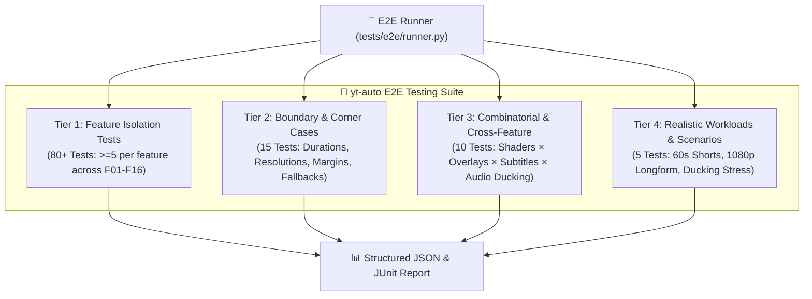

# Test Infrastructure & Specification: yt-auto Visual Pipeline

## 1. Test Philosophy & Core Principles

The `yt-auto` Visual Pipeline testing infrastructure enforces strict opaque-box, requirement-driven verification across all layers of procedural rendering, vector compositing, subtitle generation, and atomic FFmpeg transcoding.

### 1.1. Core Directives
1. **Opaque-Box Requirement-Driven**: Tests assert strictly against external contracts, APIs, input/output behaviors, file system artifacts, schema validations, and media stream properties.
2. **Zero Cheating & Absolute Integrity**: No facade tests, mock bypasses that swallow failures, or hardcoded fake pass results. Tests must perform authentic calculations, buffer validations, FFmpeg filtergraph assertions, and video container audits.
3. **Progressive Testability**: Features are verified with respect to their milestone dependencies (M1: Structural Cleanup, M2: Procedural & Overlays, M3: Atomic FFmpeg & Subtitles, M4: Schema Contracts & QA Gate).
4. **Hermeticity & Offline Determinism**: Zero network dependencies. All fonts are loaded hermetically from `assets/fonts/`, SVG templates from `assets/svg_overlays/`, and audio streams generated deterministically via synthetic generators or local samples.
5. **Memory & Resource Safety**: Compositor and buffer tests verify zero-allocation continuous memory views, alignment constraints (64-byte `std140`, 256-byte row stride), and proper process pipe draining to prevent OS buffer deadlocks.

---

## 2. Feature Inventory & Mapping

| Feature ID | Feature Name | Description | Milestone | Target Tier | Min Tests |
| :--- | :--- | :--- | :---: | :---: | :---: |
| **F01** | Legacy Code & Template Deletion | Deletion of `web_renderer.py`, `realtime_video_engine.py`, `web_templates/`, obsolete scripts, and legacy tests. | M1 | Tier 1 | 5 |
| **F02** | Media Exports & Registry Refactor | Decoupling of `src/media/__init__.py`, `loop_worker.py`, and CLI tools from browser renderers. | M1 | Tier 1 | 5 |
| **F03** | Pipeline Branch Pruning | Removal of orphan `is_multiscene_mode` browser branches, SwiftShader flags, and Chrome reapers in `src/pipeline.py`. | M1 | Tier 1 | 5 |
| **F04** | Native Procedural Engine (`wgpu-py`) — **opt-in experimental** | `NativeProceduralEngine` remains testable but is **not** the production default (`ENABLE_NATIVE_PROCEDURAL=0`). Prod SSOT: FFmpeg beats stream-copy + director zoompan. | M2 | Tier 1 | 5 |
| **F05** | WGSL Shaders Catalog | 4 WGSL shaders (`cosmic_singularity`, `dark_forest`, `synaptic_network`, `tactical_chamber`) with uniform layout and syntax validity. | M2 | Tier 1 | 5 |
| **F06** | SVG Overlay Engine (`resvg-py`) | `SVGOverlayEngine` with XML parameter interpolation, in-memory raster caching, and out-buffer mutation. | M2 | Tier 1 | 5 |
| **F07** | SVG Vector Assets Catalog | Vector assets in `assets/svg_overlays/` (`hud_tactical_telemetry.svg`, `scp_classification_stamp.svg`, `biometric_wave.svg`). | M2 | Tier 1 | 5 |
| **F08** | In-Memory Frame Compositor | `InMemoryCompositor` with zero-allocation contiguous buffers, Porter-Duff Over SIMD blending, and memoryview pipe output. | M2 | Tier 1 | 5 |
| **F09** | ASS Subtitle Generator | `subtitles_ass.py` with word-level karaoke timing (`{\kf}`), `MarginV=260` safe-area, and hermetic font references. | M3 | Tier 1 | 5 |
| **F10** | Monotonic Timestamp Sanitizer | Timestamp sanitization enforcing $t_{start}[n] \ge t_{end}[n-1] + \epsilon$, non-negative durations, and millisecond ASS formatting. | M3 | Tier 1 | 5 |
| **F11** | Unified Atomic FFmpeg Encoder | `unified_encoder.py` single-pass `-filter_complex`, libass, ducking, EBU R128 (`-14 LUFS`), and background async stderr drain. | M3 | Tier 1 | 5 |
| **F12** | SceneManifest Contract Synchronization | Synchronization of `src/scene_manifest.py` and `schemas/scene_manifest.schema.json` with `VisualArchetypeId`. | M4 | Tier 1 | 5 |
| **F13** | Scene Planner Agent Sync | `src/agents/scene_planner.py` resolving archetype tokens and generating valid vertical SceneManifest instances. | M4 | Tier 1 | 5 |
| **F14** | Deterministic Video QA Gate | `audit_rendered_video_artifact` in `src/agents/video_qa.py` verifying faststart, yuv420p, loudness, and freeze/black frame absence. | M4 | Tier 1 | 5 |
| **F15** | Documentation Synchronization | Synchronization of `docs/ARQUITECTURA.md`, `docs/FLUJO_VIDEOS.md`, `docs/INTEGRACIONES_Y_SERVICIOS.md`, `docs/TROUBLESHOOTING.md`, `README.md`. | M4 | Tier 1 | 5 |
| **F16** | E2E Testing Suite (Tiers 1–4) | Complete test runner CLI (`runner.py`), JSON/JUnit reporting, exit code semantics, and multi-tier test suites. | E2E | Tier 1 | 5 |

---

## 3. Multi-Tier Test Architecture

### 3.1. Tier 1: Feature Isolation Tests (`tests/e2e/test_tier1_features.py`)
- Exercises every feature (F01–F16) independently with direct, unambiguous assertions.
- Minimum 5 distinct test cases per feature (>=80 tests total).
- Verifies structural deletions, schema constraints, buffer signatures, WGSL parsing, SVG XML binding, subtitle karaoke tags, and FFmpeg filtergraph construction.

### 3.2. Tier 2: Boundary & Corner Cases (`tests/e2e/test_tier2_boundaries.py`)
- **Durations**: Zero-duration scenes (0.0s), single-frame durations (0.033s), extreme durations (3600s).
- **Resolutions**: 720p vertical (720x1280), 1080p vertical (1080x1920), 4K UHD vertical (2160x3840), odd dimension validation.
- **Subtitles**: Empty timestamp lists, single-word cues, extreme long text cues (100+ words), safe-area margin boundary adherence.
- **Assets & Streams**: Missing SVG asset fallback, missing font fallback, video-only (zero audio) rendering, audio-only frames handling, extreme tension uniform values.

### 3.3. Tier 3: Combinatorial & Cross-Feature Interactions (`tests/e2e/test_tier3_combinations.py`)
- **Pairwise Matrices**: 4 Procedural Shaders × 3 SVG HUD Overlays × ASS Karaoke Subtitles × Audio Ducking.
- **Channel Mismatches**: 1ch mono voice + 2ch stereo drone + 2ch stereo SFX combined through `-filter_complex`.
- **Dynamic Overlay Updates**: Frame-by-frame XML interpolation of telemetry data while procedural background renders.
- **Multi-Scene Manifest Transitions**: Consecutive rendering of multiple scenes with distinct visual archetypes.

### 3.4. Tier 4: Realistic Workload Scenarios (`tests/e2e/test_tier4_workloads.py`)
- **Full 60s YouTube Short**: Complete pipeline execution with `cosmic_singularity` + `hud_tactical_telemetry` + karaoke ASS + voice narration + ambient drone + SFX, ending with deterministic QA gate audit (`faststart`, `yuv420p`, EBU R128).
- **1080p Widescreen Longform**: 16:9 1920x1080 video with `synaptic_network` + `biometric_wave`.
- **Emergency Audio Ducking Stress Test**: High-amplitude drone + rapid speech bursts + explosive SFX verifying sidechain compressor behavior and loudness compliance.
- **Multi-Scene Seamless Transition Video**: 45s video across 3 distinct scenes with uninterrupted audio.
- **High-Cadence Rapid Speech Karaoke**: 20s fast narration with 150+ words and 0.2s cue transitions.

---

## 4. Test Runner CLI & Execution Semantics

The test suite includes a standalone CLI test runner in `tests/e2e/runner.py`.

### 4.1. CLI Options
- `--tier {1,2,3,4,all}`: Execute specific tier or all tiers.
- `--feature {F01,F02,...,F16}`: Filter execution to specific feature ID.
- `--json-report PATH`: Output structured JSON test execution report.
- `--junit PATH`: Output standard JUnit XML report for CI/CD integration.
- `--verbose / -v`: Enable verbose test logging.
- `--fail-fast / -x`: Stop test execution immediately on first failure.
- `--timeout SECONDS`: Per-test timeout constraint (default: 60s).
- `--list-features`: Print table of registered features and tests.
- `--dry-run`: Discover and display test cases without running them.

### 4.2. Exit Code Semantics
- `0`: All executed tests passed (or passed/skipped).
- `1`: One or more tests failed.
- `2`: CLI argument error or test configuration error.

---

## 5. Coverage Thresholds

| Metric | Target Threshold | Hard Minimum |
| :--- | :---: | :---: |
| **Tier 1 Feature Tests** | >=80 tests (5 per feature) | 80 tests |
| **Tier 2 Boundary Tests** | >=15 boundary cases | 15 tests |
| **Tier 3 Combination Tests** | >=10 cross-feature cases | 10 tests |
| **Tier 4 Workload Scenarios** | >=5 realistic workloads | 5 tests |
| **Total Test Suite Count** | **>=110 test cases** | **110 tests** |
| **Pass Rate** | 100% of applicable milestone features | 100% |
