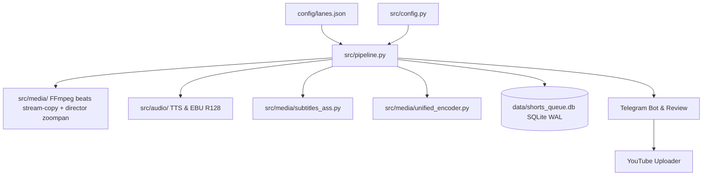

# Arquitectura del Sistema — yt-auto

> **Estado:** REPOSITORIO / OFICIAL  
> **Última actualización:** 2026-09  

Arquitectura modular, persistencia atómica en SQLite WAL, catálogo de assets offline y política de ejecución del sistema basada en carriles editoriales (`config/lanes.json`).

---

## 1. Diagrama de Arquitectura General

---

## 2. Carriles Editoriales de Producción (Lanes & `config/lanes.json`)

El sistema opera con cuatro carriles (`LaneProfile`) autodirigidos por cadencia intercalada:

| Carril | Canal | Formato | Cadencia | Especificaciones |
|---|---|---|---|---|
| `moku-scp-shorts` | Moku | 9:16 (`1080x1920`) | 1 c/10m (offset 0s, 6/h) | Anomalías SCP, 60–180s (180–320 palabras), subtítulos ASS Karaoke. |
| `aelithia-drama-shorts` | Aelithia | 9:16 (`1080x1920`) | 1 c/10m (offset 300s, 6/h) | Dilemas morales y AITA, 60–180s (180–320 palabras), intercalado c/5m. |
| `moku-horror-long` | Moku | 16:9 (`1920x1080`) | 1 c/60m (offset 0s, 1/h) | Creepypastas/terror, multihistoria ≥2600 palabras, duración ≥600s. |
| `aelithia-aita-long` | Aelithia | 16:9 (`1920x1080`) | 1 c/60m (offset 1800s, 1/h) | Drama familiar/relaciones, ≥2600 palabras, ≥600s, intercalado c/30m. |

- **Cadencia Agregada Global**: 12 Shorts/h (1 cada 5 min alternando canales) y 2 Videos Largos/h (1 cada 30 min alternando canales). Cero límites artificiales de duración por video; duración natural según narración TTS.

---

## 3. Persistencia Atómica y Concurrencia (SQLite WAL & Lane Leases)

Gestionada en `src/core/repository.py` y `src/db.py`:
- **Modo WAL (`journal_mode=WAL`)**: Permite lecturas simultáneas concurrentes sin bloquear escrituras.
- **Configuración de Bloqueos**: `PRAGMA busy_timeout=15000`, claves foráneas activadas y leases transaccionales con `BEGIN IMMEDIATE`.
- **Leases por Carril (`lane_leases`)**: Permite la ejecución concurrente no conflictiva de múltiples carriles sobre el mismo canal (ej. `moku-scp-shorts` y `moku-horror-long` en paralelo).
- **Deduplicación Aislada**: Huellas SHA-256 y SimHash 64-bit por canal en la tabla `content_fingerprints`. Lo encolado o publicado en un canal no afecta a otros.

---

## 4. Catálogo de Assets Offline

1. **Catálogo de Loops Continuos**: `assets/videos/shorts/` (vertical 9:16) y `assets/videos/longs/` (horizontal 16:9), resueltos de forma desacoplada y neutral vía `LoopVideoEngine.resolve_continuous_loop`.
2. **Assets de Catálogo y Manifiesto Maestro**: `assets/loops/bank_manifest.json` y `assets/loops/.gitkeep` (métricas visuales certificadas y precomputadas para bypass de decodificación en QA). Política: [visual-assets-policy.md](visual-assets-policy.md).
3. **Plantillas de miniatura**: `assets/thumbnails/templates/` (bases limpias; texto/HUD solo en composición).
4. **Identidad Visual y Marcas de Agua**: `assets/branding/`.
5. **Música y Efectos**: `assets/music/` por género narrativo (terror, drama, suspenso).
6. **Tipografías**: `assets/fonts/Montserrat-Black.ttf` para renderizado ASS y portadas.

---

## 5. Arnés Antigravity Multi-Agente (Agents 1–6)

El sistema implementa una arquitectura desacoplada de 6 agentes orquestados con contratos JSON Schema Draft-07 y respaldados por el CLI `agy` (`gemini-3.8-flash-high`):

1. **Agent 1: `CinematicScriptCuratorAgent` (`schemas/script_curator.schema.json`)**:
   - Generación de guion con curva de retención psicológica (Hook 0-3s, Premisa 3-15s, Desarrollo 15-45s, Clímax/Resolución 45-60s).
   - Safe Area awareness vertical y horizontal.
2. **Agent 2: `ArtDirectorMoodAgent` (`schemas/art_director.schema.json`)**:
   - Selección de paleta cromática Rec.709, atmósfera lumínica volumétrica y dinámicas de partículas.
3. **Agent 3: `ScenePlannerCompositorAgent` (`schemas/scene_manifest.schema.json`)**:
   - Compilación del manifiesto de composición multi-escena canónico `SceneManifestV2` (arquetipos de catálogo FFmpeg/híbrido, overlays, pacing). Los agentes emiten JSON; el motor de media decide píxeles.
4. **Agent 4: `VisualAudioQAAuditorAgent` (`schemas/video_qa.schema.json`)**:
   - Auditoría forense automatizada: EBU R128 (-14.0 ± 1.0 LUFS para Shorts, -16.0 LUFS para Longform), True Peak (-1.0 dBTP), correlación estéreo y umbrales de luminancia/congelamiento.
5. **Agent 5: `ImageAuditorAgent` (`schemas/image_auditor.schema.json`)**:
   - **Política Anti-Filler**: 100% de fondos y sujetos animados deben venir del catálogo/loops FFmpeg o del compositor híbrido (Ken Burns `zoompan`); **no** del hot path WebGPU. Prohíbe terminantemente fotos de stock estáticas (`DISCARDED_GENERIC_FILLER`).
   - Autoriza exclusivamente logotipos de marca o emblemas institucionales oficiales (`APPROVED_REFERENCE`) para proyección en insignias overlay no invasivas (SVG / `resvg-py`).
6. **Agent 6: `SeoOptimizerAgent` (`schemas/seo_metadata.schema.json`)**:
   - Fórmulas algorítmicas de retención: 3 títulos virales para A/B testing, descripción con marcas de tiempo formateadas, tags optimizados, hashtags virales, comentario fijado para disparar interacción comunitaria y blueprints de miniaturas.

---

## 6. Detección Escénica (Arquetipos y Categorías de Catálogo)

Ubicado en `src/core/scenic_detector.py` y `src/narrative/archetypes.py`, clasifica el tema hacia categorías canónicas del catálogo (`assets/loops/` y `data/loop_catalog.db`). El pipeline es 100% basado en assets pre-renderizados (cero shaders/WebGL). Categorías canónicas: `classified_terminal`, `dark_forest`, `dark_ambient`, `cosmic_horror`, `tactical_chamber`, `horror`, `drama`. Asimismo, selecciona el estilo de subtítulo ASS (`tiktok_bounce`, `vertical_lift`, `karaoke_glow`, `cinematic_fade`). Subtítulos activos con ASS + **libass** en FFmpeg.

---

## 7. Programación y AutoPilot 24/7 (`src/core/autopilot.py`)

- Servicio desatendido para producción continua día y noche.
- Cola de rotación temática con tópicos de alta demanda algorítmica.
- Activación, detención y consulta de métricas de rendimiento en tiempo de ejecución.

---

## 8. Bot Interactivo de Telegram (`src/telegram/interactive_bot.py`)

- **Comandos**: `/start`, `/help`, `/status`, `/create`, `/shorts`, `/long`, `/seo`, `/jobs`, `/autopilot`, `/latest`.
- **Botones en Línea (Inline Keyboards)**: Inspección de guiones completos, subtítulos SRT, metadatos SEO, auditoría de imágenes anti-filler y cambio de estado de AutoPilot.
- Transporte dual: Soporta subidas directas `file:///` con tiempo 0-copy en servidores locales de Bot API, y multiparte con compresión proxy inteligente para servidores en la nube.

---

## 9. Políticas Arquitectónicas Anti-Regresión (REG-01 a REG-13)

El sistema impone invariantes arquitectónicos nativos verificados automáticamente en CI/pytest:
- **Pipeline 100% Basado en Assets (Zero Procedural/Math Video)**: Erradicación total de `wgpu`, shaders WGSL, `src/media/_legacy/`, `proc_engine.py`, bucles de frames con Pillow y filtros sintéticos matemáticos (`lavfi_palettes`). Los videos se componen exclusivamente mediante:
  1. `LoopVideoEngine`: Catálogo de loops maestros H.264 con concat demuxer stream-copy (`-c:v copy`), logrando ~0% uso de CPU en codificación de video.
  2. `HybridVideoEngine`: Efecto Ken Burns nativo en FFmpeg (`zoompan`) sobre imágenes fijas 2K/4K reales.
  3. Overlays PNG pre-renderizados en `assets/overlays/static/` y animaciones alpha en `assets/overlays/motion/`.
- **Fail-Closed Temprano**: Si cualquier categoría o escena carece de asset físico en disco, el pipeline lanza `CatalogAssetNotFoundError` inmediatamente.
- **Tipografía Vectorizada y Overlays Dinámicos**: Rasterización SVG de alto rendimiento vía `resvg-py`.
- **Subtítulos Nativos Atómicos (`libass`)**: Generación directa de archivos `.ass` con temporización karaoke (`{\kf}`) y márgenes de seguridad para UI móvil (`MarginV >= 240px`), integrados nativamente en la cadena de filtros de FFmpeg.
- **Transcodificación Atómica en Pase Único**: Pipeline unificado de FFmpeg (`-filter_complex`) con drenaje asíncrono de flujo `stderr` para evitar bloqueos por buffers de tubería del SO.

