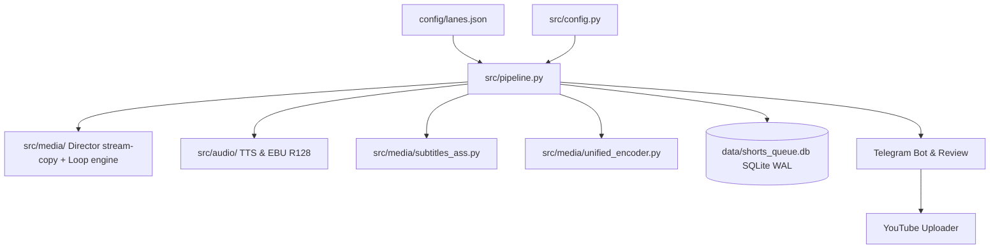

# Arquitectura del Sistema — yt-auto

> **Estado:** REPOSITORIO / OFICIAL | **Actualización:** 2026-09 | Arquitectura modular, persistencia SQLite WAL y carriles editoriales (`config/lanes.json`).

## 1. Diagrama de Arquitectura General

## 2. Carriles Editoriales de Producción (Lanes & `config/lanes.json`)

El sistema opera con 6 carriles canónicos declarados en `config/lanes.json` con cadencia intercalada:

| Carril | Canal | Formato | Tipo Historia | Estado | Especificación |
|---|---|---|---|---|---|
| `horror-scp-shorts` | `horror` | 9:16 (`1080x1920`) | `scp` | Activo | Anomalías SCP, 60–180s, ASS Karaoke, stream-copy. |
| `horror-horror-long` | `horror` | 16:9 (`1920x1080`) | `horror` | Activo | Creepypastas/terror, multi-acto (4–8 actos), stream-copy concat. |
| `drama-drama-shorts` | `drama` | 9:16 (`1080x1920`) | `reddit_aita` | Activo | Dilemas morales y AITA, 60–180s, ASS Karaoke, stream-copy. |
| `drama-aita-long` | `drama` | 16:9 (`1920x1080`) | `reddit_aita` | Activo | Historias de relaciones, multi-acto (4–8 actos), stream-copy concat. |
| `scifi-singularity-shorts` | `scifi` | 9:16 (`1080x1920`) | `scifi` | Preconfigurado | Distopías y singularidad, 9:16 vertical, catálogo SciFi. |
| `scifi-singularity-long` | `scifi` | 16:9 (`1920x1080`) | `scifi` | Preconfigurado | Hard sci-fi y especulación, 16:9 horizontal, multi-acto. |

- **Cadencia Agregada Global**: 12 Shorts/h (1 c/5m alternando) y 2 Videos Largos/h (1 c/30m alternando). Duración natural según narración TTS.

## 3. Persistencia Atómica y Concurrencia (SQLite WAL & Lane Leases)

Gestionada en `src/core/repository.py` y `src/db.py`:
- **Modo WAL (`journal_mode=WAL`)**: Lecturas concurrentes sin bloquear escrituras; `PRAGMA busy_timeout=15000` y claves foráneas activas.
- **Leases por Carril (`lane_leases`)**: Transacciones con `BEGIN IMMEDIATE` para ejecución paralela aislada entre carriles.
- **Deduplicación Aislada**: Huellas SHA-256 y SimHash 64-bit por canal en `content_fingerprints`.

## 4. Catálogo de Assets Offline

1. **Loops Continuos**: `assets/videos/shorts/` (9:16) y `assets/videos/longs/` (16:9), resueltos vía `LoopVideoEngine.resolve_continuous_loop`.
2. **Manifiesto de Catálogo**: `assets/loops/bank_manifest.json` con métricas visuales precomputadas para QA rápido ([visual-assets-policy.md](visual-assets-policy.md)).
3. **Miniaturas y Recursos**: `assets/thumbnails/templates/`, branding en `assets/branding/`, música en `assets/music/` y tipografía `assets/fonts/Montserrat-Black.ttf`.

## 5. Arnés Antigravity Multi-Agente (`src/agents/`)

Arquitectura desacoplada de 6 módulos canónicos respaldados por `ProgrammaticAgent` y streaming Gemini:
- **`src/agents/base_agent.py`**: `ProgrammaticAgent`, `CircuitBreaker`, transporte `AgyStreamClient` y control `AgentSaturationError`.
- **`src/agents/story_director.py`**: `StoryDirectorAgent` (curación y pacing) y `StoryInvestigatorAgent` (extracción y tensión).
- **`src/agents/atmospheric_director.py`**: `AtmosphericDirectorAgent` (clasificación visual de atmósfera y arquetipos de catálogo).
- **`src/agents/seo_optimizer.py`**: `SeoOptimizerAgent` (packaging algorítmico, títulos virales A/B, descripción formateada y hashtags).
- **`src/agents/video_qa.py`**: `VideoQAAgent` (auditoría automatizada de luminancia, detección de black frames y control perceptual).
- **`src/agents/translator.py`**: `TranslatorAgent` (adaptación cultural y traducción multi-locale de guiones).

## 6. Detección Escénica y Estilos de Subtítulo

Ubicado en `src/core/scenic_detector.py` y `src/narrative/archetypes.py`: clasifica temas a categorías canónicas (`dark_ambient`, `cosmic_horror`, `horror`, `drama`, `tactical_chamber`). Subtítulos activos con ASS + `libass` en FFmpeg (`tiktok_bounce`, `vertical_lift`, `karaoke_glow`, `cinematic_fade`).

## 7. Programación y AutoPilot 24/7 (`src/core/autopilot.py`)

Servicio desatendido para producción continua día y noche con rotación temática de alta demanda y telemetría de rendimiento en tiempo de ejecución.

## 8. Bot Interactivo de Telegram (`src/telegram/interactive_bot.py`)

- **Comandos**: `/start`, `/help`, `/status`, `/create`, `/shorts`, `/long`, `/seo`, `/jobs`, `/autopilot`, `/latest`.
- **Inline Keyboards**: Inspección de guiones, subtítulos SRT/ASS, metadatos SEO y gestión de colas de renderizado.
- **Transporte dual**: Soporta subidas locales `file:///` con tiempo 0-copy y multipart proxy para servidores remotos.

## 9. Políticas Arquitectónicas Anti-Regresión (REG-01 a REG-14)

Invariantes arquitectónicos verificados automáticamente en la suite de pruebas (`tests/unit/test_anti_regression_guardrails.py`):
- **100% Basado en Assets**: Cero `wgpu`, shaders WGSL, Pillow frame loops o filtros procedurales. Solo stream-copy (`-c:v copy`), Ken Burns `zoompan` y overlays PNG/SVG.
- **Fail-Closed Temprano**: Lanza `CatalogAssetNotFoundError` si falta cualquier asset físico requerido en disco.
- **Subtítulos y Formatos**: ASS karaoke (`{\kf}`) con margen móvil inferior (`MarginV >= 240px`); muxing suave `mov_text` en stream-copy horizontal/vertical.
- **Transcodificación Atómica de Pase Único**: FFmpeg unificado con drenaje asíncrono de `stderr` y límite estricto de recursos ($\le 2$ Cores, $\le 2.0$ GiB RAM, $\le 45$s).
