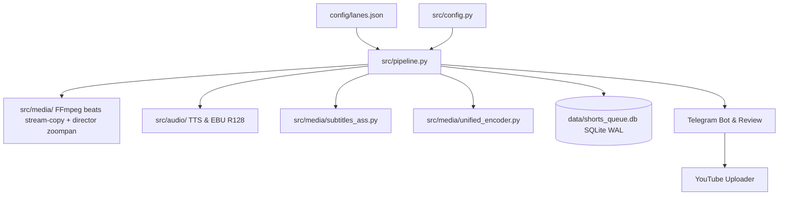

# Arquitectura del Sistema — yt-auto

> **Estado:** REPOSITORIO / OFICIAL  
> **Última actualización:** 2026-09  

Arquitectura modular, persistencia atómica en SQLite WAL, catálogo de assets offline y política de ejecución del sistema basada en carriles editoriales (`config/lanes.json`).

---

## 1. Diagrama de Arquitectura General

---

## 2. Carriles Editoriales de Producción (Lanes & `config/lanes.json`)

El sistema sustituye las banderas de formato manuales por **carriles de producción (`LaneProfile`)** autodirigidos por cadencia y configuración:

1. **`moku-scp-shorts` (Shorts Verticales 9:16)**:
   - Formato vertical `1080x1920` @30fps con `LoopVideoEngine`.
   - Subtítulos ASS Karaoke en franja segura inferior (`MarginV 240-250` sobre `1080x1920`).
   - Duración adaptativa 60–180s (objetivo canónico 150s con re-condensación de guion si excede).
   - Ingestión multi-fuente: subreddits SCP (`r/SCP`, `r/SCPDeclassified`) y SCP Wiki scraper (`src/scraper_scp.py`) con atribución CC BY-SA 3.0.
2. **`moku-horror-long` (Horizontal 16:9)**:
   - Formato apaisado `1920x1080` @30fps con video loop continuo.
   - Compilación multihistoria automática hasta superar presupuesto de palabras (≥2600 palabras) y duración mínima de ≥600s.
3. **`aelithia-aita-long` (Horizontal 16:9)**:
   - Formato apaisado `1920x1080` @30fps con compilación multihistoria de relatos AITA / relaciones.
   - Filtrado temático estricto vía `src/core/topic_filter.py` para garantizar relevancia editorial.

---

## 3. Persistencia Atómica y Concurrencia (SQLite WAL & Lane Leases)

Gestionada en `src/core/repository.py` y `src/db.py`:
- **Modo WAL (`journal_mode=WAL`)**: Permite lecturas simultáneas concurrentes sin bloquear escrituras.
- **Configuración de Bloqueos**: `PRAGMA busy_timeout=15000`, claves foráneas activadas y leases transaccionales con `BEGIN IMMEDIATE`.
- **Leases por Carril (`lane_leases`)**: Permite la ejecución concurrente no conflictiva de múltiples carriles sobre el mismo canal (ej. `moku-scp-shorts` y `moku-horror-long` en paralelo).
- **Deduplicación Aislada**: Huellas SHA-256 y SimHash 64-bit por canal en la tabla `content_fingerprints`. Lo encolado o publicado en un canal no afecta a otros.

---

## 4. Catálogo de Assets Offline

1. **Catálogo de Loops Atmosféricos**: `assets/loops/{cosmic_horror,dark_ambient,dark_forest,monsters,space_abyss}/`.
2. **Banco Temático de Canal**: `assets/visual_bank/{moku,aelithia}/{scenery,ambient_gifs,overlays}` — `scenery` = fondos limpios (sin texto horneado); title cards mal clasificados → `_quarantine_title_cards/`. Política: [visual-assets-policy.md](visual-assets-policy.md).
3. **Plantillas de miniatura**: `assets/thumbnails/templates/` (bases limpias; texto/HUD solo en composición).
4. **Identidad Visual y Marcas de Agua**: `assets/branding/`.
5. **Música y Efectos**: `assets/music/` por género narrativo (terror, drama, suspenso).
6. **Tipografías**: `assets/fonts/Montserrat-Black.ttf` para renderizado ASS y portadas.

---

## 5. Arnés Antigravity Multi-Agente (Agents 1–6)

El sistema implementa una arquitectura desacoplada de 6 agentes orquestados con contratos JSON Schema Draft-07 y respaldados por el CLI `agy` (`gemini-3.8-flash-high`):

1. **Agent 1: `CinematicScriptCuratorAgent` (`schemas/script_curator.schema.json`)**:
   - Generación de guion con curva de retención psicológica (Hook 0-3s, Premisa 3-15s, Desarrollo 15-45s, Clímax/Resolución 45-60s).
   - Safe Area awareness vertical y horizontal.
2. **Agent 2: `ArtDirectorMoodAgent` (`schemas/art_director.schema.json`)**:
   - Selección de paleta cromática Rec.709, atmósfera lumínica volumétrica y dinámicas de partículas.
3. **Agent 3: `ScenePlannerCompositorAgent` (`schemas/scene_manifest.schema.json`)**:
   - Compilación del manifiesto de composición multi-escena canónico `SceneManifestV2` (arquetipos de catálogo FFmpeg/híbrido, overlays, pacing). Los agentes emiten JSON; el motor de media decide píxeles.
4. **Agent 4: `VisualAudioQAAuditorAgent` (`schemas/video_qa.schema.json`)**:
   - Auditoría forense automatizada: EBU R128 (-14.0 ± 1.0 LUFS para Shorts, -16.0 LUFS para Longform), True Peak (-1.0 dBTP), correlación estéreo y umbrales de luminancia/congelamiento.
5. **Agent 5: `ImageAuditorAgent` (`schemas/image_auditor.schema.json`)**:
   - **Política Anti-Filler**: 100% de fondos y sujetos animados deben venir del catálogo/loops FFmpeg o del compositor híbrido (Ken Burns `zoompan`); **no** del hot path WebGPU. Prohíbe terminantemente fotos de stock estáticas (`DISCARDED_GENERIC_FILLER`).
   - Autoriza exclusivamente logotipos de marca o emblemas institucionales oficiales (`APPROVED_REFERENCE`) para proyección en insignias overlay no invasivas (SVG / `resvg-py`).
6. **Agent 6: `SeoOptimizerAgent` (`schemas/seo_metadata.schema.json`)**:
   - Fórmulas algorítmicas de retención: 3 títulos virales para A/B testing, descripción con marcas de tiempo formateadas, tags optimizados, hashtags virales, comentario fijado para disparar interacción comunitaria y blueprints de miniaturas.

---

## 6. Detección Escénica (Arquetipos de Catálogo)

Ubicado en `src/core/scenic_detector.py`, clasifica el tema hacia arquetipos canónicos usados por el catálogo FFmpeg / `ProceduralVideoEngine` (sin importar `wgpu` ni `NativeProceduralEngine` en el hot path). No usa Canvas, Three.js ni WebGL de navegador. Arquetipos canónicos (`VALID_ARCHETYPES`):
- `tactical_chamber`: Túneles, búnkeres, contención y pasillos industriales.
- `dark_forest`: Bosques, niebla y caminos nocturnos.
- `arctic_desolation`: Nieve, ventisca y tundra.
- `cosmic_singularity`: Espacio profundo y singularidades.
- `arcade_vector_flight`: Vuelo vectorial retro / asteroides.
- `parkour_runner`: Recorrido isométrico tipo parkour.
- `cozy_hearth`: Interior cálido / confesiones domésticas.
- `synaptic_network`: Redes neuronales e introspección.
- `maritime_lighthouse`: Faro, costa y tormenta marina.

Asimismo, selecciona el estilo de subtítulo óptimo (`tiktok_bounce`, `vertical_lift`, `karaoke_glow`, `cinematic_fade`, entre otros). Los subtítulos activos se queman con ASS + **libass** en FFmpeg.

---

## 7. Programación y AutoPilot 24/7 (`src/core/autopilot.py`)

- Servicio desatendido para producción continua día y noche.
- Cola de rotación temática con tópicos de alta demanda algorítmica.
- Activación, detención y consulta de métricas de rendimiento en tiempo de ejecución.

---

## 8. Bot Interactivo de Telegram (`src/telegram/interactive_bot.py`)

- **Comandos**: `/start`, `/help`, `/status`, `/create`, `/shorts`, `/long`, `/seo`, `/jobs`, `/autopilot`, `/latest`.
- **Botones en Línea (Inline Keyboards)**: Inspección de guiones completos, subtítulos SRT, metadatos SEO, auditoría de imágenes anti-filler y cambio de estado de AutoPilot.
- Transporte dual: Soporta subidas directas `file:///` con tiempo 0-copy en servidores locales de Bot API, y multiparte con compresión proxy inteligente para servidores en la nube.

---

## 9. Políticas Arquitectónicas Anti-Regresión (REG-01 a REG-09)

El sistema impone invariantes arquitectónicos nativos verificados automáticamente en CI/pytest:
- **Renderizado FFmpeg SSOT (Teología v2.4.0)**: beats = concat demuxer + `-c:v copy`; director = `zoompan` (hybrid) + `DIRECTOR_SINGLE_PASS` stream-copy/concat para bucles procedurales (default on; elimina N re-encodes). `xfade` real en `MultiActVideoRenderer`; en `MultiSceneCompositor` solo con `DIRECTOR_XFADE=1`. `ENABLE_NATIVE_PROCEDURAL` default off; `native_procedural`/shaders viven quarantined en `src/media/_legacy` (no SSOT; FFmpeg + Pillow thumbs).
- **Tipografía Vectorizada y Overlays Dinámicos**: Rasterización SVG de alto rendimiento vía `resvg-py` y composición de overlays con técnica zero-copy.
- **Subtítulos Nativos Atómicos (`libass`)**: Generación directa de archivos `.ass` con temporización karaoke (`{\kf}`) y márgenes de seguridad para UI móvil (`MarginV >= 240px`), integrados nativamente en la cadena de filtros de FFmpeg.
- **Transcodificación Atómica en Pase Único**: Pipeline unificado de FFmpeg (`-filter_complex`) con drenaje asíncrono de flujo `stderr` para evitar bloqueos por buffers de tubería del SO.
- **Compositor de Memoria Determinista**: Reutilización estricta de buffers contiguos de NumPy preasignados ($\le 140$ MB RAM) para garantizar ausencia de fugas de memoria y rendimiento predecible en streaming de frames.

