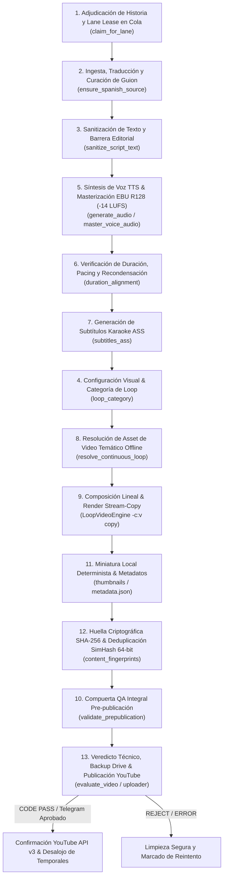

# Flujo de Producción y Publicación (13 Etapas Canónicas)

> **Estado:** REPOSITORIO / OFICIAL  
> **Última actualización:** 2026-09  

Ciclo de vida completo del pipeline de producción multi-carril orquestado en `src/pipeline.py`.

---

## 1. Diagrama del Pipeline de Ejecución Real

---

## 2. Descripción de las 13 Etapas Canónicas

| # | Etapa Canónica | Componente Principal | Descripción de Operación |
|---|---|---|---|
| 1 | Adjudicación y Lease | `src/core/repository.py` | Adquisición atómica por carril (`claim_for_lane`) desde SQLite (`shorts_queue.db`) con TTL para permitir concurrencia segura entre carriles. |
| 2 | Ingesta y Curación | `src/pipeline.py`, `src/curators/` | Traducción pre-curación en un solo paso (`ensure_spanish_source`) y adaptación al presupuesto de palabras del carril (`words_min`, `words_max`). |
| 3 | Sanitización Editorial | `src/sanitizer.py` | Eliminación estricta de prompt leaks, metadatos espurios, preámbulos y elementos editoriales prohibidos antes de la síntesis. |
| 5 | Síntesis TTS y Audio | `lib/tts.py`, `src/audio/mixer.py` | Generación de locución con Edge-TTS, pre-chequeo WPM, masterización EBU R128 unificada a `-14.0 LUFS` (TP ≤ -1.5 dBTP) y auto-ducking musical. |
| 6 | Alineación de Duración | `src/pipeline.py` | Pacing y re-condensación quirúrgica del guion si excede el techo del carril (`duration_max_sec`), o auto-expansión en formatos largos. |
| 7 | Subtítulos Karaoke ASS | `src/media/subtitles_ass.py` | Generación de subtítulos ASS palabra por palabra en resolución nativa (`1080x1920` vertical o `1920x1080` horizontal). Cumplen franja segura `MarginV 240-250`. |
| 4 | Configuración Visual | `src/pipeline.py`, `config/lanes.json` | Determinación de categoría temática de loop (`cosmic_horror`, `dark_ambient`, `dark_forest`, `monsters`, `space_abyss`, `scp`, `drama_aita`). |
| 8 | Resolución de Assets | `src/core/catalog.py`, `src/media/loop_engine.py` | Selección determinista de loop maestro desde el catálogo offline (`assets/videos/`). Soporta perfiles H.264 `Main` y `High` para garantizar Stream-Copy. |
| 9 | Composición y Render | `src/media/loop_engine.py` | Composición ultrarrápida FFmpeg: Stream-Copy de video (`-c:v copy`), multiplexación de audio masterizado y libass. Tiempo de render ≤ 3s en hot path. |
| 11 | Miniatura y Metadatos | `src/media/thumbnails/`, `src/branding.py` | Generación local determinista de portada con branding mediante PIL/SVG y generación de `metadata.json` estructurado. |
| 12 | Deduplicación Criptográfica | `src/core/repository.py`, `src/db.py` | Registro de huella SHA-256 y SimHash 64-bit unificado con caché LRU para evitar duplicación semántica en tiempo $O(1)$. |
| 10 | Compuerta QA Integral | `lib/qa_gatekeeper.py`, `src/core/quality.py` | Validación pre-publicación exhaustiva: verificación de contenedor, decodificación, ventana de loudness `[-15.5, -12.5] LUFS`, y detección de frames negros. |
| 13 | Veredicto y Publicación | `src/core/verdict.py`, `src/youtube/uploader.py` | Veredicto técnico offline (reutilizando auditoría visual de Etapa 10 sin volcado redundante de PNGs), backup a Google Drive y publicación a YouTube API v3. |

---

## 3. Política de Subtítulos y Estética Audiovisual

- **Subtítulos Incrustados (Hardburned)**: Desactivados por defecto en producción (`subtitles_active = False`). El canal prioriza una estética cinematográfica inmersiva limpia, donde la atención se centra en la atmósfera del video y el texto en pantalla queda reservado exclusivamente a las miniaturas.
- **Generación y Verificación ASS**: El pipeline genera y valida siempre el archivo `.ass` en la Etapa 7 para permitir auditoría de sincronía A/V y compatibilidad con carriles experimentales donde se active la incrustación (`subtitles_active = True`).
- **Presupuesto de Rendimiento**: Hot path limitado a $\le 2$ Cores CPU y $\le 2$ GB RAM mediante Stream-Copy (`-c:v copy`), pre-compilación de expresiones regulares y eliminación de volcados innecesarios de frames.
