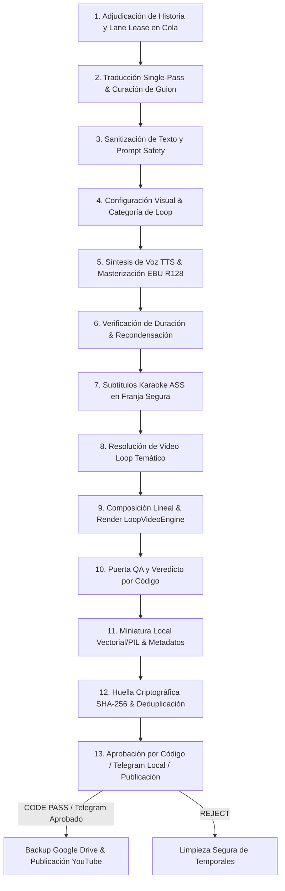

# Flujo de Producción y Publicación (13 Etapas Canónicas)

> **Estado:** REPOSITORIO / OFICIAL  
> **Última actualización:** 2026-08  

Ciclo de vida completo del pipeline de producción multi-carril orquestado en `src/pipeline.py`.

---

## 1. Diagrama del Pipeline

---

## 2. Descripción de las 13 Etapas Canónicas

| # | Etapa | Componente Principal | Descripción de Operación |
|---|---|---|---|
| 1 | Adjudicación y Lease | `src/core/repository.py` | Adquisición atómica por carril (`claim_for_lane`) desde SQLite (`shorts_queue.db`) con TTL para permitir concurrencia short/longform. |
| 2 | Traducción y Curación | `src/pipeline.py`, `src/curators/` | Traducción pre-curación en un solo paso (`ensure_spanish_source`) y adaptación al presupuesto de palabras del carril (`words_min`, `words_max`). |
| 3 | Sanitización de Texto | `src/sanitizer.py` | Eliminación estricta de prompt leaks, metadatos espurios y caracteres no permitidos antes de la síntesis. |
| 4 | Configuración Visual | `src/pipeline.py`, `config/lanes.json` | Determinación de categoría temática de loop (`cosmic_horror`, `dark_ambient`, `dark_forest`, `monsters`, `space_abyss`, `scp`, `drama_aita`). |
| 5 | Síntesis TTS y Audio | `lib/tts.py` | Edge-TTS según perfil de voz del carril (`config/voice_profiles.json`), normalización EBU R128 (-14 LUFS, TP ≤ -1.5 dBTP) y auto-ducking musical. |
| 6 | Verificación de Duración | `src/pipeline.py` | Re-condensación de guion si excede el techo del carril o auto-expansión multihistoria en formatos largos. |
| 7 | Subtítulos Karaoke ASS | `src/subtitles.py` | Generación ASS palabra por palabra en resolución nativa (`1080x1920` vertical con `MarginV 240-250` o `1920x1080` horizontal). |
| 8 | Resolución de Assets | `src/core/catalog.py`, `src/media/loop_engine.py` | Selección de video maestro pre-renderizado desde el catálogo offline (`assets/loops/` y `data/loop_catalog.db`) o imagen fija real. Fail-closed con `CatalogAssetNotFoundError` si el asset no existe. Cero generación WebGL o procedural. |
| 9 | Composición y Render | `src/media/loop_engine.py`, `src/media/compositor.py` | Composición nativa en FFmpeg: concat demuxer stream-copy (`-c:v copy`) sobre loops o Ken Burns nativo (`zoompan`), ducking de audio y subtítulos incrustados con libass. |

| 10 | Veredicto por Código | `src/core/code_review_verdict.py` | Evaluación determinista offline: integridad de contenedor, decodificación, compuertas QA estrictas (LUFS, freeze, sync A/V) y ROI. |
| 11 | Miniatura y Metadatos | `src/thumbnail.py`, `src/branding.py` | Generación local determinista de portada con branding mediante PIL/SVG y archivo estructurado `metadata.json`. |
| 12 | Deduplicación Criptográfica | `src/core/repository.py` | Huella SHA-256 y SimHash 64-bit para evitar duplicación semántica y temática cross-canal. |
| 13 | Revisión y Publicación | `review`, `src/drive.py`, `src/youtube_uploader.py` | Aprobación automática vía código (`code_approve`) con fallback a Telegram (2 GB zero-copy `file:///`) → Respaldo Drive y YouTube API v3. |
