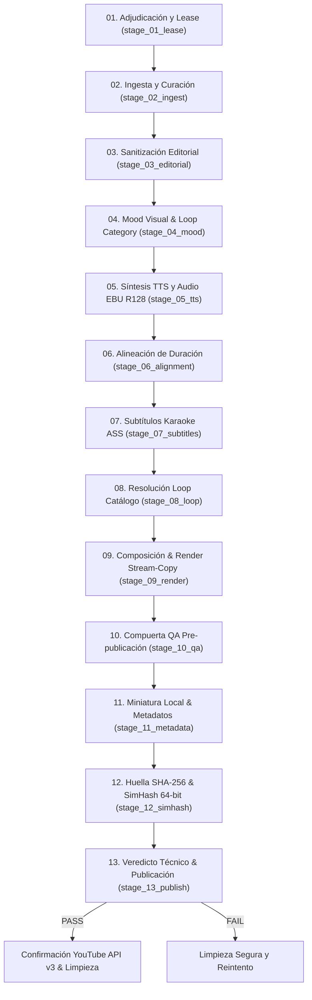

# Flujo de Producción y Publicación (13 Etapas Canónicas)

> **Estado:** REPOSITORIO / OFICIAL | **Actualización:** 2026-09 | Ciclo de vida orquestado en `src/pipeline/stages/` (01–13).

## 1. Diagrama del Pipeline de Ejecución Secuencial

## 2. Especificación de Etapas Canónicas

| # | Etapa Canónica | Módulo (`src/pipeline/stages/`) | Descripción de Operación |
|---|---|---|---|
| 01 | Adjudicación y Lease | `stage_01_lease.py` | Adquisición atómica por carril con TTL en SQLite (`shorts_queue.db`) con `BEGIN IMMEDIATE`. |
| 02 | Ingesta y Curación | `stage_02_ingest.py` | Traducción pre-curación (`ensure_spanish_source`) y ajuste al presupuesto de palabras. |
| 03 | Sanitización Editorial | `stage_03_editorial.py` | Barrera anti prompt-leaks, metadatos espurios y caracteres no permitidos. |
| 04 | Mood Visual & Categoría | `stage_04_mood.py` | Clasificación temática hacia categorías canónicas (`dark_ambient`, `cosmic_horror`, etc.). |
| 05 | Síntesis TTS y Audio | `stage_05_tts.py` | Locución Edge-TTS, control WPM, masterización EBU R128 (-14 LUFS, TP ≤ -1.5 dBTP) y sidechain. |
| 06 | Alineación de Duración | `stage_06_alignment.py` | Pacing y recondensación si se excede el techo del carril (`duration_max_sec`), o expansión. |
| 07 | Subtítulos Karaoke ASS | `stage_07_subtitles.py` | Generación ASS palabra por palabra (`1080x1920` o `1920x1080`) con `MarginV >= 240`. |
| 08 | Resolución Loop Catálogo | `stage_08_loop.py` | Selección determinista de loop maestro desde catálogo offline para Stream-Copy. |
| 09 | Composición & Render | `stage_09_render.py` | Ensamble FFmpeg stream-copy (`-c:v copy`) y soft muxing `mov_text`. Rendimiento ≤ 3s (Shorts). |
| 10 | Compuerta QA Integral | `stage_10_qa.py` | Validación pre-publicación: contenedor, audio `[-15.5, -12.5] LUFS`, y black frames. |
| 11 | Miniatura Local & Meta | `stage_11_metadata.py` | Generación local determinista de portada con branding y compilación de `metadata.json`. |
| 12 | Deduplicación Cripto | `stage_12_simhash.py` | Huella SHA-256 y SimHash 64-bit con caché LRU para evitar duplicados en $O(1)$. |
| 13 | Veredicto y Publicación | `stage_13_publish.py` | Veredicto técnico offline, backup en Google Drive y subida por YouTube API v3. |

## 3. Políticas Audiovisuales y Rendimiento

- **Subtítulos Incrustados**: Desactivados por defecto (`subtitles_active = False`) para preservar estética visual pura; soft muxing `mov_text` siempre activo en contenedor.
- **Presupuesto de Rendimiento**: Hot path limitado a $\le 2$ Cores CPU y $\le 2.0$ GiB RAM mediante Stream-Copy (`-c:v copy`) y bypass de transcodificación.
