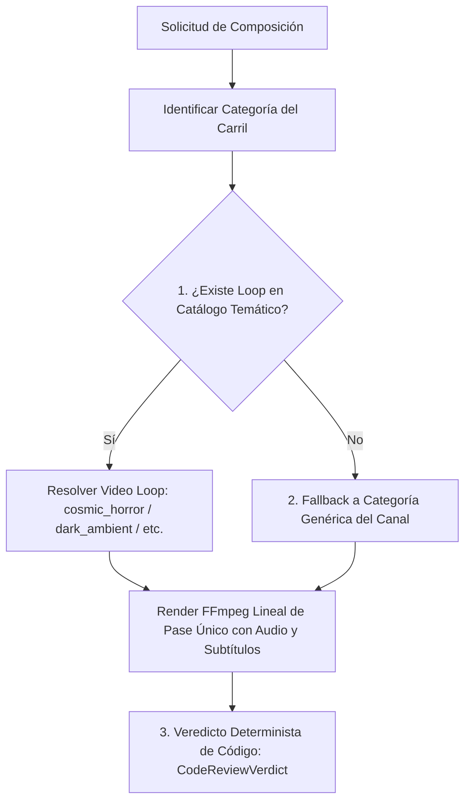

# Pipeline Visual Multi-Canal, Calidad y Rendimiento

> **Estado:** OFICIAL / PRODUCCIÓN  
> **Última actualización:** 2026-09  

Especificaciones de renderizado audiovisual, perfiles por canal y directivas de calidad para `yt-auto`.

---

## 1. Especificaciones Técnicas por Formato

### YouTube Shorts (9:16)
- **Dimensiones**: Master `1080x1920` @30fps · Render rápido de prueba `768x1360` @30fps.
- **Motor Visual**: `LoopVideoEngine` con video loop temático continuo (`assets/loops/`).
- **Códec de Video**: Ensamble stream-copy (`-c:v copy`) directo vía concat demuxer (`ffconcat 1.0`), logrando renderizado sub-segundo con uso mínimo de CPU/RAM; fallback a H.264 (`libx264`, `crf=21`, `preset=veryfast`) solo si las dimensiones no coinciden.
- **Audio**: AAC 192 kbps, 48 kHz estéreo, masterizado a EBU R128 (`loudnorm=I=-14:LRA=11:TP=-1.5`) con ducking musical a `-18 dB`.
- **Subtítulos ASS Karaoke**: Sincronización palabra por palabra con resaltado activo (`&H0000FFFF`). Franja segura inferior (`MarginV 240-250` sobre `1080x1920`, libre de botones de la interfaz de Shorts).
- **Duración Natural**: 60–180s determinada de forma orgánica por el ritmo TTS (180–320 palabras), sin cortes artificiales.

### Videos Largos / Longform (16:9)
- **Dimensiones**: Master Full HD `1920x1080` @30fps · Estándar `1280x720` @30fps.
- **Motor Visual**: `LoopVideoEngine` horizontal continuo con stream-copy (`-c:v copy`).
- **Duración**: ≥600s (10+ min), compilando relatos secuenciales o documentales lore profundos (≥2,600 palabras) sin límite artificial superior.

---

## 2. Resolución de Video en Loop Atmosférico

1. **Catálogo de Loops (`assets/loops/`)**: Colección de videos atmosféricos continuos organizados por categoría (`cosmic_horror`, `dark_ambient`, `dark_forest`, `monsters`, `space_abyss`).
2. **Renderizado de Pase Único**: FFmpeg aplica `stream_loop` con audio ducking y subtítulos ASS en una sola invocación, minimizando consumo de CPU/RAM.
3. **Control de Calidad Determinista**: `MediaIntegrityVerifier` + `QAGatekeeper` validan sincronización, volumen y contenedor sin incurrir en costos de visión por IA.

---

## 3. Miniaturas y Portadas Deterministas

- **Generación Local con Plantillas (`src/thumbnail.py`)**: Renderizado vectorial/PIL directo con branding del canal (`assets/branding/`). Cero llamadas externas a modelos generativos de imagen.
- **Formato y Dimensiones**: `1080x1920` (Shorts) y `1280x720` / `1920x1080` (Longform) con contraste optimizado y tipografía legible (`Montserrat-Black.ttf`).
- **Texto / badges / HUD**: solo en el path de miniaturas sobre bases limpias en `assets/thumbnails/templates/` — no reutilizar title cards pre-horneadas como fondo de video.

Clasificación scenery vs title cards: [visual-assets-policy.md](visual-assets-policy.md). Catálogo CI vs prod: [POLITICA_CATALOGO_CI.md](POLITICA_CATALOGO_CI.md).
