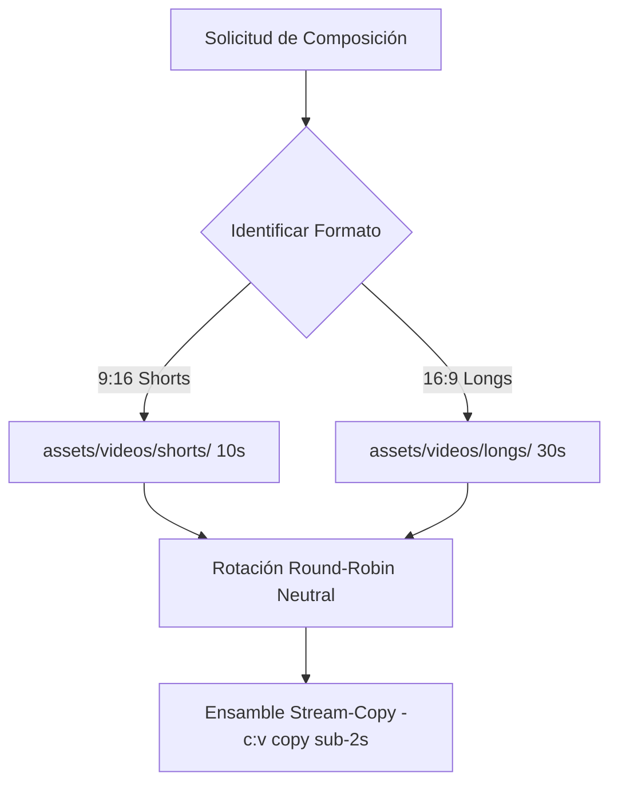

# Pipeline Visual Multi-Canal, Calidad y Rendimiento

> **Estado:** OFICIAL / PRODUCCIÓN  
> **Última actualización:** 2026-09  

Especificaciones de renderizado audiovisual, perfiles por canal y directivas de calidad para `yt-auto`.

---

## 1. Especificaciones Técnicas por Formato

### YouTube Shorts (9:16)
- **Dimensiones**: Master `1080x1920` @30fps.
- **Motor Visual**: `LoopVideoEngine` con clip único continuo de 10s (`assets/videos/shorts/`) repetido sin fisuras.
- **Códec de Video**: Ensamble directo stream-copy (`-c:v copy`) vía concat demuxer (`ffconcat 1.0`), ejecución ultra-rápida (<2s) y consumo casi nulo de CPU/RAM.
- **Audio**: AAC 192 kbps, 48 kHz estéreo, masterizado a EBU R128 (`loudnorm=I=-14:LRA=11:TP=-1.5`) con ducking musical a `-18 dB`.
- **Subtítulos**: Muxing directo (`mov_text`), franja segura inferior (`MarginV >= 240`).
- **Duración Natural**: 60–180s determinada de forma orgánica por el TTS.

### Videos Largos / Longform (16:9)
- **Dimensiones**: Master Full HD `1920x1080` @30fps.
- **Motor Visual**: `LoopVideoEngine` con clip único continuo de 30s (`assets/videos/longs/`) repetido sin fisuras.
- **Códec de Video**: Ensamble stream-copy (`-c:v copy`) directo vía concat demuxer (<2s).
- **Duración**: ≥600s (10+ min) cubriendo el audio completo sin límites artificiales.

---

## 2. Resolución de Loop Continuo y Neutralidad Multi-Canal

1. **Clip Único Continuo**: Repetido sin fisuras para cubrir la totalidad de la narración de audio.
2. **Neutralidad Multi-Canal**: Rotación round-robin o no-repetitiva entre los `.mp4` disponibles en el directorio, completamente desacoplada de nombres de canales.
3. **Salvaguarda Fail-Fast**: Si el directorio (`assets/videos/shorts/` o `assets/videos/longs/`) está vacío, se eleva `CatalogAssetNotFoundError` con instrucciones claras para depositar los archivos.

---

## 3. Generación de Portadas en Tiempo Real Guiada por Prompts

- **Modelo Smart-Prompt**: Portadas generadas en tiempo real por agentes en el arnés SDK local usando inteligencia dinámica y prompts (estilo Claroscuro de alto CTR, hook viral de 3-5 palabras, sujeto focal misterioso), sin extracción de fotogramas de video ni bancos estáticos.
- **Bases Limpias**: Plantillas maestras de alto CTR preservadas en `assets/thumbnails/templates/`.

Clasificación scenery vs title cards: [visual-assets-policy.md](visual-assets-policy.md). Catálogo CI vs prod: [POLITICA_CATALOGO_CI.md](POLITICA_CATALOGO_CI.md).
