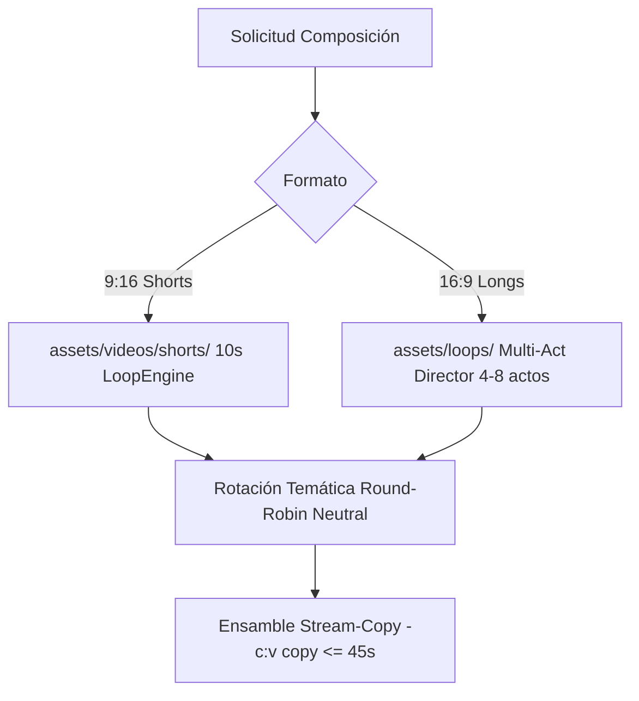

# Pipeline Visual Multi-Canal, Calidad y Rendimiento

> **Estado:** OFICIAL / PRODUCCIÓN | **Actualización:** 2026-09 | Renderizado audiovisual y directivas de calidad (`yt-auto`).

## 1. Especificaciones Técnicas por Formato

### YouTube Shorts (9:16)
- **Motor Visual**: `LoopVideoEngine` con clip continuo de 10s (`assets/videos/shorts/`) en `1080x1920` @30fps.
- **Códec & Ensamble**: Stream-copy (`-c:v copy`) vía concat demuxer (<2s). Audio AAC 192kbps masterizado EBU R128 (-14 LUFS, TP ≤ -1.5 dBTP) con sidechain -18 dB.
- **Subtítulos**: Muxing suave (`mov_text`) en contenedor MP4 con franja segura inferior (`MarginV >= 240`).

### Videos Largos / Longform (16:9)
- **Arquitectura Director**: Multi-Act Director (`src/media/director_assembly.py`, [DIRECTOR_SINGLE_PASS.md](DIRECTOR_SINGLE_PASS.md)).
- **Pacing Multi-Acto**: Estructuración de 4 a 8 actos narrativos con curva de tensión y selección temática desde `assets/loops/` con fallback por módulo.
- **Ensamble Stream-Copy**: Concat demuxer (`-c:v copy`) para segmentos homogéneos (geometría `1920x1080`, códec H.264, pixel format y time base).
- **Gobernanza de Rendimiento**: Techo de turnaround $\le 45$s bajo presupuesto estricto de $\le 2$ CPU Cores y $\le 2.0$ GiB RAM.

## 2. Resolución de Loops y Neutralidad Multi-Canal

- **Neutralidad Multi-Canal**: Rotación desacoplada de nombres de canal entre los `.mp4` disponibles.
- **Salvaguarda Fail-Fast**: Si no hay loops requeridos, se eleva `CatalogAssetNotFoundError` inmediatamente.

## 3. Generación de Portadas y Directivas

- **Modelo Smart-Prompt**: Portadas generadas con estilo Claroscuro de alto CTR y plantillas en `assets/thumbnails/templates/`.
- **Políticas de Assets**: Scenery vs title cards: [visual-assets-policy.md](visual-assets-policy.md). Catálogo CI vs producción: [POLITICA_CATALOGO_CI.md](POLITICA_CATALOGO_CI.md).
