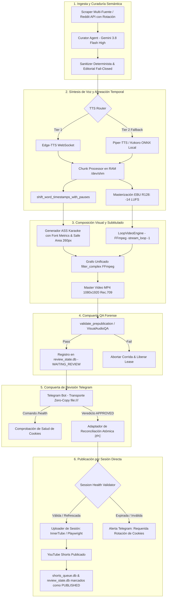
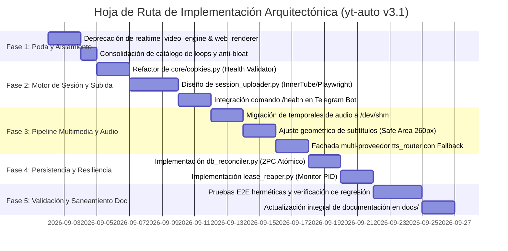

# [OBSOLETO / HISTÓRICO - PURGADO ENERO 2025] Plan Maestro de Arquitectura y Auditoría Técnica: Automatización Audiovisual y Publicación Basada en Sesiones (`yt-auto` v3.1)

> ⚠️ **AVISO DE OBSOLECENCIA HISTÓRICA**: Este documento representa una versión previa concebida durante la transición a v3.1. Las vías de renderizado por código, WebGL, shaders WGSL, motores procedurales (`proc_engine.py`, `NativeProceduralEngine`) y síntesis matemática (`lavfi_palettes`) descritas en este documento fueron **100% erradicadas y purgadas** de la arquitectura en favor de un pipeline unificado basado en assets reales (`LoopVideoEngine` con stream-copy `-c:v copy` + Ken Burns nativo en stills + overlays PNG pre-renderizados).

> **Documento:** Plan Arquitectónico Integral, Diagnóstico Forense y Especificación Estructural  
> **Ámbito:** Sistema de Automatización Audiovisual Multi-Carril `yt-auto`  
> **Estado:** [OBSOLETO - ARCHIVADO]  
> **Fecha:** 2026-09  

---

## 1. Diagnóstico Ejecutivo y Objetivos

### 1.1. Objetivos Principales
1. **Desacoplamiento y Minimalismo Operativo (YAGNI)**: Reducir la huella de ejecución del pipeline eliminando capas redundantes de serialización (CDP screencast frame a frame), scripts huérfanos y motores duplicados, priorizando composición en memoria y grafos unificados en FFmpeg.
2. **Publicación Determinista Basada en Sesión Directa (InnerTube / Cookies)**: Establecer una arquitectura de publicación que elimine la dependencia de la cuota diaria de YouTube Data API v3 (10,000 unidades / 6 subidas máx.), operando mediante gestión segura, validación preventiva (`LOGIN_INFO`, `SAPISID`, `__Secure-3PSID`) y rotación asistida de cookies Netscape/JSON.
3. **Resiliencia de Audio y Cero Desincronización**: Mantener el algoritmo de recálculo monótono de timestamps para subtítulos Karaoke ASS, trasladando la E/S de temporales a memoria volátil (`/dev/shm`) e incorporando redundancia multi-proveedor TTS (Edge-TTS $\to$ Piper/Kokoro local $\to$ REST).
4. **Integridad Transaccional y Concurrencia Limpia**: Garantizar consistencia entre la cola de producción (`shorts_queue.db`) y la compuerta de revisión (`review_state.db`), incorporando un demonio *Auto-Reaper* para evitar el bloqueo de carriles por fallos de proceso (OOM/SIGKILL).

### 1.2. Hitos del Proyecto
* **Hito 1 (Saneamiento Estructural & Poda)**: Deprecación formal de motores legados (`realtime_video_engine.py`, `web_renderer.py`), eliminación de archivos huérfanos y centralización de plantillas locales sin dependencias de CDN.
* **Hito 2 (Motor de Sesiones & Resiliencia YouTube)**: Implementación de la bóveda de credenciales, validador de salud de cookies (`SessionHealthResult`), cabeceras dinámicas y conector InnerTube/Playwright.
* **Hito 3 (Pipeline Visual & Audio Streamlined)**: Consolidación de `LoopVideoEngine` como motor canónico exclusivo, temporales de audio en RAM (`/dev/shm`) y auto-wrapping geométrico de subtítulos 9:16 con Safe Area.
* **Hito 4 (Persistencia Atómica & Auto-Reaper)**: Transacciones coordinadas de 2 fases (2PC) para aprobación/publicación y monitoreo activo de PIDs (`os.kill(pid, 0)`) para liberación de leases de carril.
* **Hito 5 (Gobernanza IA & Saneamiento Documental)**: Estandarización bajo arnés `agy` con el modelo canónico exclusivo `gemini-3.8-flash-high`, eliminación de referencias obsoletas y actualización de toda la suite en `docs/`.

### 1.3. Antipatrones y Malas Prácticas Terminantemente Prohibidas
* 🚫 **Dependencia Intensiva de YouTube Data API v3 para Subidas**: Prohibido quemar cuota API (1,600 unidades por video) como método de producción masiva; el canal de subida es sesión directa autenticada.
* 🚫 **Captura CDP Cuadro a Cuadro por WebSockets**: Prohibido capturar frames vía `canvas.toDataURL` o `screenshot(png)` en tiempo real (cuello de botella de 10x en CPU).
* 🚫 **Inyección de Scripts desde CDNs Externos**: Prohibido inyectar Three.js u otras librerías desde URLs remotas (`cdnjs.cloudflare.com`) dentro del backend de renderizado.
* 🚫 **Eliminación del Chunking de Audio por Supuesto "Desperdicio de I/O"**: Prohibido enviar textos de corrido a Edge-TTS sin segmentar silencios; esto destruye la sincronía de los subtítulos Karaoke ASS.
* 🚫 **Modelos de Lenguaje Descomisionados o Ficticios**: Prohibido referenciar `gemini-2.0-flash` (retirado) o identificadores no normalizados como `gemini-2.5-flash`.
* 🚫 **Presets de Video Degradantes en Producción**: Prohibido `preset="veryfast"` / `preset="ultrafast"` con `crf > 22` en entregables finales (provocan macroblocking y distorsión en gradientes oscuros).

---

## 2. Matriz Forense de Errores y Puntos Críticos

| # | Fallo / Vulnerabilidad Detectada | Causa Raíz Técnica | Estrategia de Resolución en el Esquema | Clasificación |
|---|---|---|---|---|
| **1** | **Cuello de botella IPC en Renderizado WebGL** | `src/media/web_renderer.py` y `realtime_video_engine.py` ejecutan rasterizado $\to$ JPEG/PNG $\to$ Base64 $\to$ WebSocket CDP $\to$ Python $\to$ FFmpeg por cada frame. | Deprecar motor en tiempo real. Utilizar `LoopVideoEngine` con bucles pre-sintetizados en SQLite y `-stream_loop -1`. Para síntesis batch, usar buffers crudos RGBA (`rawvideo`). | **Error Crítico Estructural** |
| **2** | **Agotamiento de Cuota y Fragilidad en YouTube** | Depender de YouTube API v3 agota la cuota diaria (10,000 pts = ~6 videos). Las cookies Netscape expiran sin supervisión causando bloqueos en `UPLOAD_UNCONFIRMED`. | Arquitectura basada en sesión persistente (InnerTube / Playwright) con healthcheck proactivo (`SessionHealthValidator`), alerta temprana por Telegram (`/health`) y cifrado AES-256 de cookies. | **Error Crítico Estructural** |
| **3** | **SPOF en Síntesis de Voz (Edge-TTS)** | Dependencia exclusiva de un endpoint WebSocket reverso no documentado de Microsoft sin SLA ni contingencia. | Fachada multi-proveedor (`tts_router`) con Circuit Breaker: Tier 1 Edge-TTS $\to$ Tier 2 Piper/Kokoro ONNX local $\to$ Tier 3 Cloud TTS REST. | **Error Crítico Estructural** |
| **4** | **Desbordamiento Visual en Subtítulos 9:16** | `lib/subtitles.py` agrupa palabras por conteo fijo sin estimar píxeles reales en español, colisionando con la UI nativa de Shorts. | Medición dinámica de bounding box tipográfico con Pillow (`font.getlength`), auto-wrapping con `\N` y respeto de Safe Area (`MarginV = 260px`). | **Error Crítico Estructural** |
| **5** | **Desincronización Transaccional Dual-DB** | `shorts_queue.db` y `review_state.db` operan sin transacción coordinada; una falla de red tras aprobación duplica publicaciones. | Adaptador de reconciliación idempotente de 2 fases (2PC) con bloqueos transaccionales `BEGIN IMMEDIATE` y verificación de `run_id`. | **Error Crítico Estructural** |
| **6** | **Leases Huérfanos tras Falla Dura (OOM/SIGKILL)** | `src/core/repository.py` solo limpia leases al reintentar un claim pasivo tras 900s de TTL. | Proceso proactivo *Auto-Reaper* que inspecciona la vida real de los PIDs (`os.kill(pid, 0)`) cada 30s y libera bloqueos inmediatamente. | **Error Crítico Estructural** |
| **7** | **Presencia de Modelos Obsoletos / Retirados** | Uso de modelos retirados o alternativos en scripts y tests. | Estandarización centralizada en `src/agents/base_agent.py` bajo arnés nativo `agy` con el modelo canónico exclusivo `gemini-3.8-flash-high`. | **Error Crítico Estructural** |
| **8** | *Alerta: "La fragmentación de audio en archivos WAV es una mala práctica"* | Falso positivo del reporte previo. Edge-TTS no procesa pausas SSML dinámicas; segmentar y desplazar timestamps es indispensable. | **DESCARTAR ALERTA.** Preservar la segmentación matemática y optimizar alojando los temporales en memoria RAM (`/dev/shm`). | **Falso Positivo Justificado** |
| **9** | *Alerta: "El flag `--disable-gpu` es un bloqueo perjudicial de hardware"* | Falso positivo. En VPS headless y contenedores Docker sin GPU dedicada, omitir este flag produce el crash fatal de Chromium. | **DESCARTAR ALERTA.** Mantener `--disable-gpu` como predeterminado headless y aplicar aceleración EGL solo ante detección explícita de `/dev/dri/renderD128`. | **Falso Positivo Justificado** |
| **10** | *Alerta: "`pipeline.py` bloquea 45s antes del render por encadenar `VideoQAAgent`"* | Falso positivo por absurdo lógico. La auditoría forense de video se ejecuta en la Etapa 10 sobre el contenedor MP4 terminado. | **DESCARTAR ALERTA.** El orden de ejecución canónico es correcto; no existe ejecución de QA sobre video inexistente. | **Falso Positivo Justificado** |

---

## 3. Matriz Socrática de Impacto y Decisiones Técnicas

### 3.1. ¿Si cambio esto, qué se rompe? (Blast Radius & Dependencias)
* **Cambiar el mecanismo de subida a sesión directa / cookies**:
  - *Qué impacta*: Modifica la interfaz de `src/youtube/uploader.py` y `src/youtube/auth.py`.
  - *Riesgo aguas abajo*: Si las cookies de sesión caducan o Google exige un desafío CAPTCHA/2FA, el flujo automático no puede resolverlo interactivamente en un VPS headless.
  - *Mitigación en diseño*: Validación preventiva de tokens (`LOGIN_INFO`, `SAPISID`) antes de reclamar el trabajo del carril. Si la sesión está en estado `EXPIRING_SOON` o `INVALID`, el pipeline no inicia la renderización, emite una alerta urgente por Telegram y pausa el carril de forma segura.
* **Cambiar de `realtime_video_engine.py` a `LoopVideoEngine`**:
  - *Qué impacta*: Modifica la firma de invocación en `src/pipeline.py` (Etapa 8).
  - *Riesgo aguas abajo*: Se requiere que la base de datos de catálogo (`video_loops` en `data/shorts_queue.db`) contenga bucles pre-sintetizados válidos para el carril activo.
  - *Mitigación en diseño*: Fallback automático a bucles visuales predeterminados o síntesis batch offline bajo demanda antes de iniciar la corrida.

### 3.2. ¿Si borro esto, qué se rompe? (Poda de Sobreingeniería & YAGNI)
* **Eliminar `web_renderer.py` y el pipeline de captura sincrónica por WebSocket CDP**:
  - *Qué se rompe*: NADA en el flujo de producción estándar. Solo se utilizaba en pruebas prototipo aisladas.
  - *Beneficio*: Se eliminan ~1,200 líneas de código acopladas a Chrome DevTools Protocol, liberando al sistema de la trampa de rendimiento más costosa.
* **Eliminar renderizado por navegador web y sombreadores procedurales**:
  - *Qué se rompe*: NADA. La composición se realiza mediante stream-copy de catálogo FFmpeg pre-renderizado.
  - *Beneficio*: El renderizado se vuelve 100% determinista, hermético y de mínimo consumo de recursos (<= 2 CPU Cores).
* **Eliminar la doble pasada de video a disco**:
  - *Qué se rompe*: NADA. La combinación de pistas de audio, filtros de ecualización y subtitulado se realiza en un único comando FFmpeg con `-filter_complex`.
  - *Beneficio*: Reducción del 50% en desgaste de E/S en disco SSD y ahorro de 8 a 15 segundos de transcodificación por video.

### 3.3. ¿Qué bugs introduce un eventual cambio de tecnología?
* **Migrar síntesis de audio a un proveedor TTS alternativo**:
  - *Riesgo*: Si el nuevo proveedor no emite metadatos de marcas de tiempo a nivel de palabra (*word-level timestamps*), los subtítulos Karaoke ASS no pueden generarse.
  - *Criterio de diseño*: Todo proveedor integrado en `tts_router` debe implementar el contrato `TTSResponse(audio_bytes, word_timestamps)`. Piper-TTS y Kokoro deben acompañarse de alineadores forzados fonéticos (e.g., `ctc-segmentation` o timestamps basados en fonemas) si se usan como reemplazo total.
* **Sustituir SQLite por una base de datos cliente-servidor (PostgreSQL)**:
  - *Riesgo*: Introduciría sobreingeniería injustificada para un sistema mononodo/VPS, sumando latencia de red, overhead de mantenimiento y puntos de falla adicionales.
  - *Criterio de diseño*: SQLite en modo WAL (`PRAGMA journal_mode=WAL`, `busy_timeout=60000`, `synchronous=NORMAL`) es óptimo para la carga de concurrencia actual (< 10 carriles simultáneos).

### 3.4. ¿Es la tecnología actual la más idónea y vigente?
* **Python 3.11+ / Asyncio**: Sí, es el estándar de facto para orquestación multimedia, integración con APIs de IA y automatización con Playwright.
* **FFmpeg 6.0+ con `libx264`, `libass` y `ebur128`**: Sí, es el estándar indiscutible de la industria para procesamiento audiovisual determinista de alto rendimiento.
* **Playwright sobre Selenium/Puppeteer**: Sí, ofrece mejor control de contexto de navegador, captura hermética de eventos de red y serialización limpia de cookies de sesión.
* **Modelo Gemini 3.8 Flash High**: Sí, representa el estado del arte en velocidad de inferencia, costo-eficiencia y capacidad de seguimiento de directivas JSON Schema.

### 3.5. ¿Se aplican las mejores prácticas de la industria?
* **Separación de Responsabilidades**: Sí, segregación estricta entre tareas creativas semánticas (IA en arnés `agy`), composición audiovisual determinista local (FFmpeg stream-copy) y operaciones de persistencia/red.
* **Diseño Fail-Closed**: Todo fallo de validación de calidad, barrera editorial o integridad de sesión aborta el pipeline antes de consumir recursos de renderizado o publicación.
* **Idempotencia Transaccional**: Cada historia, run y publicación cuenta con identificadores únicos (`uuid4`) y hashes criptográficos de contenido (`sha256`) para evitar duplicaciones.

---

## 4. Arquitectura y Flujo de Trabajo del Sistema

### 4.1. Diagrama de Flujo y Pipeline Operativo



### 4.2. Descripción Modular de Componentes

1. **Plano de Control y Repositorio (`src/core/repository.py` & `src/core/lease_reaper.py`)**:
   - Administra el estado de historias, carriles y leases concurrentes en `shorts_queue.db`.
   - Incorpora el hilo *Auto-Reaper* que monitorea la actividad de los PIDs para desbloquear carriles inmediatamente ante fallos de proceso.
2. **Motor de Sesiones y Publicación (`src/youtube/` & `src/core/cookies.py`)**:
   - **`SessionHealthValidator`**: Evalúa la presencia y vigencia de tokens críticos (`LOGIN_INFO`, `SAPISID`, `__Secure-3PSID`). Si restan menos de 48 horas para la expiración, marca estado `EXPIRING_SOON`.
   - **`SessionUploader`**: Cliente ligero de automatización de subida que inyecta las cookies en el contexto del navegador o realiza peticiones firmadas a los endpoints de carga de YouTube Studio sin consumir cuota API v3.
   - **`TelegramHealthBridge`**: Comando `/health` que reporta en tiempo real la vigencia de las cookies de cada canal y el estado de los carriles.
3. **Pipeline Multimedia Streamlined (`src/media/loop_engine.py` & `lib/audio.py` & `lib/subtitles.py`)**:
   - **`LoopVideoEngine`**: Ensambla el video final expandiendo bucles pre-sintetizados con `-stream_loop -1` en un solo paso de transcodificación.
   - **`AudioMemoryPipeline`**: Procesa chunks de voz, silencios y masterización EBU R128 directamente en `/dev/shm`, calculando desplazamientos temporales acumulativos exactos.
   - **`SubtitleGeometryEngine`**: Calcula el ancho en píxeles de cada cue tipográfico con Pillow, divide palabras largas y asegura márgenes inferiores (`MarginV = 260px`) para evitar solapamientos con la interfaz de YouTube Shorts.
4. **Gobernanza de Agentes IA (`src/agents/`)**:
   - Orquesta agentes de curaduría y SEO mediante contratos JSON Schema bajo el CLI `agy` con `gemini-3.8-flash-high`, implementando política fail-closed.

---

## 5. Estructura de Directorios Propuesta (`folder_structure`)

A continuación se detalla la reorganización modular limpia del proyecto, marcando claramente los componentes nuevos (`[NUEVO]`), los consolidados (`[CONSOLIDADO]`) y los archivos legados a retirar (`[A RETIRAR]`):

```
yt-auto/
├── .github/workflows/             # Automatización CI/CD
├── assets/
│   ├── fonts/                     # Tipografías locales (Montserrat-Black.ttf)
│   ├── loops/                     # Bucles de video pre-sintetizados offline
│   └── overlays/                  # Overlays gráficos e insignias vectoriales (SVG/PNG)
├── config/
│   ├── channels.json              # Configuración de canales (HORROR, DRAMA)
│   ├── lanes.json                 # Perfiles de carril (creepy_short, scp_short, etc.)
│   └── settings.py                # Variables de entorno y rutas maestras
├── data/
│   ├── review_state.db            # Base de datos de revisión Telegram (WAL)
│   └── shorts_queue.db            # Base de datos principal de historias y catálogo (WAL)
├── docs/                          # Documentación técnica saneada y sincronizada
├── lib/
│   ├── audio.py                   # [CONSOLIDADO] Segmentación y timestamp shifting en RAM
│   ├── subtitles.py               # [CONSOLIDADO] Auto-wrapping y Safe Area 9:16
│   ├── tts.py                     # [CONSOLIDADO] Fachada TTS multi-proveedor
│   └── video.py                   # [CONSOLIDADO] Primitivas FFmpeg y preset slow/medium
├── review/
│   ├── telegram_bot.py            # Bot de revisión con comando /health integrado
│   └── ui.py                      # Teclados interactivos de aprobación
├── secrets/                       # Almacenamiento seguro de credenciales (cifrado local)
│   ├── cookies.txt                # Cookies de sesión Netscape para canal de Terror
│   └── cookies_aelithia.txt       # Cookies de sesión Netscape para canal de Drama
├── src/
│   ├── __init__.py
│   ├── agents/                    # Agentes semánticos bajo arnés agy (Gemini 3.8 Flash High)
│   │   ├── base_agent.py          # Gobernanza central y contratos JSON Schema
│   │   ├── curator_agent.py       # Curaduría de relatos
│   │   ├── qa_agent.py            # Auditoría semántica editorial
│   │   └── seo_agent.py           # Optimización de títulos y tags
│   ├── audio/
│   │   ├── __init__.py
│   │   └── tts_router.py          # [NUEVO] Router TTS con Circuit Breaker y fallback local
│   ├── core/
│   │   ├── __init__.py
│   │   ├── cookies.py             # [CONSOLIDADO] Validador forense de salud de sesión
│   │   ├── db_reconciler.py       # [NUEVO] Adaptador atómico 2PC shorts_queue <-> review_state
│   │   ├── gpu_detector.py        # [NUEVO] Selector inteligente de flags Chromium/GPU
│   │   ├── lease_reaper.py        # [NUEVO] Demonio auto-reaper de leases huérfanos por PID
│   │   └── repository.py          # Repositorio unificado SQLite
│   ├── media/
│   │   ├── __init__.py
│   │   ├── loop_engine.py         # [CONSOLIDADO] Motor canónico único de producción
│   │   ├── loop_worker.py         # [CONSOLIDADO] Sintetizador batch offline con buffers RGBA
│   │   ├── realtime_video_engine.py # [A RETIRAR] Motor CDP legado obsoleto
│   │   └── web_renderer.py        # [A RETIRAR] Renderizador cuadro a cuadro Base64 obsoleto
│   ├── pipeline.py                # [CONSOLIDADO] Orquestador canónico de 13 etapas
│   ├── sanitizer.py               # Barrera editorial determinista en 3 pasadas
│   ├── scraper.py                 # [CONSOLIDADO] Ingesta HTTP con rotación de cabeceras
│   └── youtube/
│       ├── __init__.py
│       ├── auth.py                # [CONSOLIDADO] Gestor de tokens y sesiones
│       ├── session_uploader.py    # [NUEVO] Uploader directo por sesión/cookies sin cuota API
│       ├── control.py             # Operaciones de metadatos de canal
│       └── uploader.py            # [A RETIRAR / REFACTORIZAR] Uploader pesado legacy
├── tests/                         # Suite de pruebas unitarias y de integración herméticas
├── main.py                        # Punto de entrada de ejecución
└── requirements.txt               # Dependencias fijadas y auditadas
```

---

## 6. Auditoría y Plan de Saneamiento Documental

| Ruta Exacta del Documento | Acción Requerida | Justificación y Contenido Exacto a Modificar |
|---|---|---|
| [`docs/ARQUITECTURA.md`](ARQUITECTURA.md) | `[Actualizar]` | **Reflejar el pipeline de sesión de YouTube**: Eliminar referencias a la YouTube Data API v3 como método exclusivo de subida. Documentar el subsistema `session_uploader` basado en cookies, el demonio `lease_reaper` y la consolidación de `LoopVideoEngine`. |
| [`docs/INTEGRACIONES_Y_SERVICIOS.md`](INTEGRACIONES_Y_SERVICIOS.md) | `[Actualizar]` | **Reestructurar jerarquía de subida**: Establecer la subida por sesión persistente / cookies como método primario de producción masiva para evitar cuotas API. Documentar el protocolo de validación de salud de cookies (`LOGIN_INFO`, `SAPISID`) y el comando `/health` de Telegram. |
| [`docs/AGENTES_IA_Y_POLITICA.md`](AGENTES_IA_Y_POLITICA.md) | `[Actualizar]` | **Limpieza de modelos**: Eliminar toda mención a versiones anteriores y ratificar `gemini-3.8-flash-high` como el único modelo oficial bajo el arnés `agy`. |
| [`docs/SYSTEM_DEFECTS_AND_AUDIT.md`](SYSTEM_DEFECTS_AND_AUDIT.md) | `[Actualizar]` | **Añadir advertencia de archivo superado**: Incorporar nota de encabezado indicando que este reporte inicial contiene falsos positivos corregidos en la versión maestra v3.0 / v3.1. |
| [`docs/SYSTEM_DEFECTS_META_AUDIT.md`](SYSTEM_DEFECTS_META_AUDIT.md) | `[Actualizar]` | **Vincular con el documento maestro**: Mantener como documento histórico de análisis crítico apuntando a `SYSTEM_DEFECTS_MASTER_CONSOLIDATED_AUDIT_AND_SOLUTIONS.md`. |
| [`docs/SYSTEM_DEFECTS_MASTER_CONSOLIDATED_AUDIT_AND_SOLUTIONS.md`](SYSTEM_DEFECTS_MASTER_CONSOLIDATED_AUDIT_AND_SOLUTIONS.md) | `[Actualizar]` | **Incorporar directiva de subida por sesión**: Actualizar la sección de YouTube para alinearla con la política de sesión directa/cookies, descartando la dependencia de cuota API. |
| [`docs/TROUBLESHOOTING.md`](TROUBLESHOOTING.md) | `[Actualizar]` | **Guía de recuperación de sesiones**: Añadir procedimientos para rotación de cookies vencidas, mitigación de desafíos de verificación en Telegram y liberación manual de leases de carril. |
| [`README.md`](../README.md) | `[Actualizar]` | **Sincronización general**: Actualizar la tabla de componentes, comandos del bot de Telegram (`/health`) y diagrama general del sistema. |

---

## 7. Hoja de Ruta de Implementación (Roadmap sin Código)



### Criterios de Aceptación por Hito

#### Hito 1: Poda y Determinismo Local
- [ ] No existen llamadas a URLs externas (`cdnjs.cloudflare.com`) en ninguna plantilla o módulo del sistema.
- [ ] Los módulos `realtime_video_engine.py` y `web_renderer.py` han sido desacoplados del camino crítico de producción en `src/pipeline.py`.

#### Hito 2: Motor de Sesión y Publicación YouTube
- [ ] `SessionHealthValidator` detecta con precisión el vencimiento de cookies (`LOGIN_INFO`, `SAPISID`) y emite advertencia cuando restan < 48 horas.
- [ ] El comando `/health` en Telegram devuelve el estado de conexión de cada canal sin lanzar subprocesos bloqueantes.
- [ ] El flujo de subida completa una publicación simulada y real mediante sesión persistente sin consumir unidades de la cuota de YouTube API v3.

#### Hito 3: Audio y Geometría Visual
- [ ] La creación y concatenación de silencios en `lib/audio.py` opera en `/dev/shm` con 0 escrituras redundantes en disco SSD.
- [ ] Los subtítulos generados en 9:16 respetan la Safe Area inferior (`MarginV = 260px`) y no exceden los 960px de ancho utilizable ante palabras largas en español.
- [ ] Ante una desconexión forzada de Edge-TTS, el sistema conmuta automáticamente al proveedor secundario local sin abortar el trabajo.

#### Hito 4: Persistencia y Concurrencia
- [ ] Una interrupción abrupta de un worker (`kill -9`) es detectada por el `lease_reaper`, liberando el lease del carril en menos de 35 segundos.
- [ ] La aprobación de un video en Telegram ejecuta una transacción atómica coordinada en `review_state.db` y `shorts_queue.db`, garantizando que no existan estados huérfanos ni dobles publicaciones.

#### Hito 5: Saneamiento Documental
- [ ] El 100% de los archivos listados en la Sección 6 han sido actualizados y validados contra la arquitectura real implementada.
- [ ] Cero referencias a modelos obsoletos (`gemini-2.0-flash`, `gemini-2.5-flash`) en documentación, configuraciones o código.
