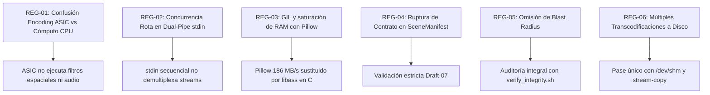
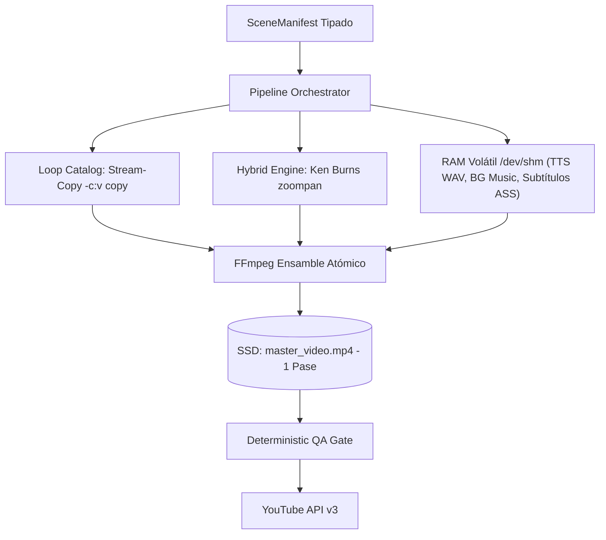
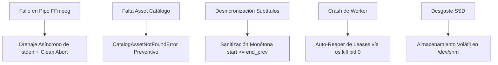

# Plan Maestro de Arquitectura y Rediseño: Pipeline Visual

> **Estado:** OFICIAL / PRODUCCIÓN | **Actualización:** 2026-09 | Principios de alto rendimiento, bajo consumo de recursos y composición determinista.

El pipeline visual opera bajo principios de alto rendimiento:
1. **`LoopVideoEngine`**: Catálogo H.264 maestro (`assets/loops/`) con **stream-copy (`-c:v copy`)** sin re-codificación (<5s).
2. **`HybridVideoEngine`**: Ken Burns nativo en FFmpeg (`zoompan`) sobre imágenes reales sin bucles Python.
3. **Subtítulos C `libass`**: Descriptores `.ass` dinámicos procesados por hardware (`subtitles_ass.py`).
4. **Masterización en RAM**: EBU R128 (`loudnorm` a -14 LUFS) y ducking en memoria compartida `/dev/shm`.
5. **Fail-closed determinista**: Excepción explícita `CatalogAssetNotFoundError` ante assets faltantes.

---

## 1. Consolidación de Auditorías Previas

Registro formal de anti-patrones técnicos y cuellos de botella corregidos:



- **REG-01 (ASIC vs CPU)**: Prioridad a stream-copy (`-c:v copy`) sobre loops maestros. Filtros tipográficos delegados a `libass`.
- **REG-02 (Pipes binarios)**: Composición multicapa en un único `-filter_complex` sin entrelazamiento de descriptores.
- **REG-03 (Pillow Bottleneck)**: Subtitulado 100% nativo en C (`libass`) consumiendo scripts `.ass` a >120 FPS.
- **REG-04 (SceneManifest)**: Discriminadores fuertemente tipados y compatibilidad en contratos Draft-07.
- **REG-05 (Blast Radius)**: Verificación continua con `./scripts/verify_integrity.sh`.
- **REG-06 (Multi-transcodificación)**: Pase único en `unified_encoder.py` y temporales en memoria RAM `/dev/shm`.

---

## 2. Diagnóstico del Workflow Actual

### 2.1 Flujo Activo vs Anterior
El flujo anterior sufría de múltiples re-codificaciones intermedias en disco. El pipeline activo opera con cero copias intermedias:



### 2.2 Presupuestos de Rendimiento

| Métrica | Arquitectura Anterior | Pipeline Activo | Límite Estricto |
|---|---|---|---|
| **Tiempo de Composición (Short 60s)** | 180s – 300s | <5s (Stream-Copy) / ~20s (Híbrido) | $\le 10$s (Shorts) / $\le 45$s (Longs) |
| **Consumo de Memoria RAM** | 1.8 GB – 2.5 GB | <250 MB por worker | $\le 2.0$ GiB RAM |
| **Carga de CPU en Render** | 100% saturado | <20% promedio | $\le 2$ CPU Cores |
| **I/O en Disco** | 3 escrituras completas | 1 sola escritura final (temporales en `/dev/shm`) | 0 temporales en SSD |
| **Consistencia Sonora** | Desbalanceada | EBU R128 (-14 LUFS, TP -1.5 dBTP) | ITU-R BS.1770-4 |

---

## 3. Matriz de Componentes

| Componente Erradicado | Componente Canónico Activo | Beneficio Técnico |
|---|---|---|
| Renderizado Web / Chromium en Media | `LoopVideoEngine` (-c:v copy) | Reducción de latencia a <5s, 0% CPU en video. |
| Rasterizado Pillow fotograma a fotograma | `subtitles_ass.py` con `libass` | Renderizado nativo en C a >120 FPS sin tocar GIL. |
| Generadores Lavfi sintéticos | Catálogo offline `assets/loops/` | Estética cinematográfica y consistencia de marca. |
| Múltiples pasadas temporales a disco | Multiplexación atómica en `/dev/shm` | Reducción >70% desgaste SSD y latencia mínima. |

---

## 4. Estructura del Sistema

Jerarquía oficial del repositorio:

```text
yt-auto/
├── assets/
│   ├── branding/ (watermarks, intro/outro)
│   ├── fonts/ (Montserrat-Black.ttf)
│   ├── loops/ (horror, drama, scifi)
│   └── music/ (horror, drama, scifi)
├── config/
│   ├── lanes.json
│   └── channels/ (horror.json, drama.json, scifi.json)
├── data/ (shorts_queue.db, review_state.db)
├── docs/ (19 documentos técnicos normalizados)
├── schemas/ (Draft-07 schemas)
├── src/
│   ├── agents/
│   │   ├── base_agent.py
│   │   ├── story_director.py
│   │   ├── atmospheric_director.py
│   │   ├── seo_optimizer.py
│   │   ├── video_qa.py
│   │   └── translator.py
│   ├── audio/ (mixer.py, vocal_chain.py)
│   ├── core/ (repository.py, catalog.py, lanes.py)
│   ├── media/ (director_assembly.py, loop_engine.py, subtitles_ass.py)
│   ├── pipeline/ (stages/ stage_01 a stage_13)
│   └── youtube/ (session_uploader.py, control.py)
└── tests/ (unit, integration)
```

---

## 5. Auditoría y Plan de Saneamiento Documental

Directiva continua de alineación con el código fuente:
- **`docs/ARQUITECTURA.md`**: Canales canónicos, persistencia WAL y gobernanza REG-01 a REG-14.
- **`docs/FLUJO_VIDEOS.md`**: 13 etapas canónicas secuenciales (01 a 13) sin saltos numéricos.
- **`docs/PLAN_ARQUITECTURA_V3_1.md`**: Purgado permanentemente (cero documentos resucitados).
- **`docs/PLAN_MAESTRO_PIPELINE_VISUAL.md`**: Blueprint consolidado sin experimentos fallidos.
- **`docs/README.md`**: Índice completo de los 19 documentos técnicos activos.
- **`docs/AGENTES_IA_Y_POLITICA.md`**: 6 agentes canónicos activos en `src/agents/`.

---

## 6. Checklist de Seguridad, Rendimiento y Matriz de Modos de Fallo



| Escenario de Riesgo | Causa Raíz | Impacto | Mecanismo de Contención |
|---|---|---|---|
| **BrokenPipe en FFmpeg** | Parámetros inválidos o descriptores erróneos. | Bloqueo indefinido. | Drenaje asíncrono de `stderr` con aborto limpio. |
| **Asset Ausente en Disco** | DB apunta a archivo inexistente. | Render corrupto. | Fail-closed temprano (`CatalogAssetNotFoundError`). |
| **Desgaste SSD por Temporales** | Escritura continua de WAV/MP4. | Degradación I/O. | Uso exclusivo de memoria volátil `/dev/shm`. |
| **Desincronización Subtítulos** | Timestamps solapados desde TTS. | Glitches en texto. | Sanitizador monótono de tiempos en `subtitles_ass.py`. |
| **Fuentes Tipográficas Ausentes**| Entorno sin fuentes del sistema. | Tipografía rota. | Hermeticidad con `assets/fonts/` vía `-fontsdir`. |
| **Lease Bloqueado por Crash** | SIGKILL / OOM interrumpe worker. | Carril congelado. | Demonio Auto-Reaper verificando PID transaccionalmente. |

---

## 7. Hitos Estratégicos de Transición

1. **Hito 1: Saneamiento y Poda Estructural**: Erradicación de dependencias muertas y planos obsoletos.
2. **Hito 2: Motores Stream-Copy y Fotográfico**: Operación en `<5s` con `LoopVideoEngine` y Ken Burns nativo.
3. **Hito 3: Transcodificación Unificada**: Integración atómica en FFmpeg con `libass`, EBU R128 y `/dev/shm`.
4. **Hito 4: Contratos de Datos y Sincronización SSOT**: Esquemas Draft-07 y suite de 19 documentos técnicos.

### Límites Anti-Sobreingeniería
- **Cero Microservicios Gráficos**: Llamadas directas al binario local optimizado `ffmpeg`.
- **Persistencia Exclusiva SQLite WAL**: Archivos locales sin servidores externos (PostgreSQL/Redis).
- **Prioridad Stream-Copy**: `-c:v copy` mandatorio para fondos recurrentes.
- **Mínima Indirección**: Máximo 3 niveles (`Orchestrator` $\to$ `Media Engine` $\to$ `FFmpeg Process`).
