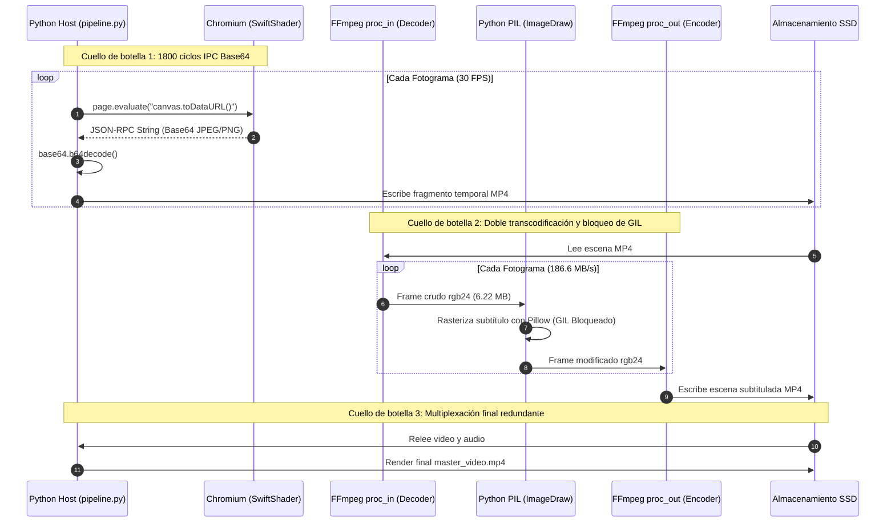
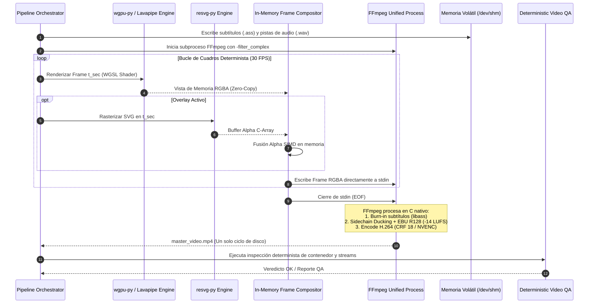
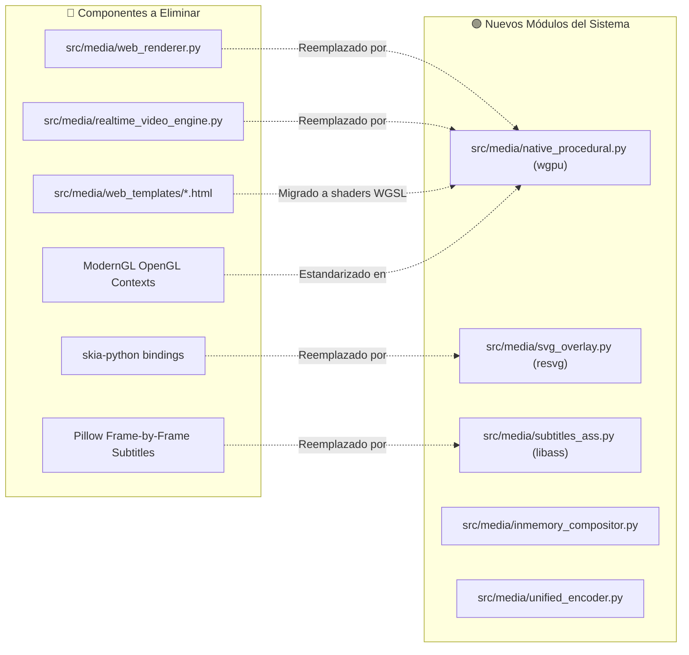
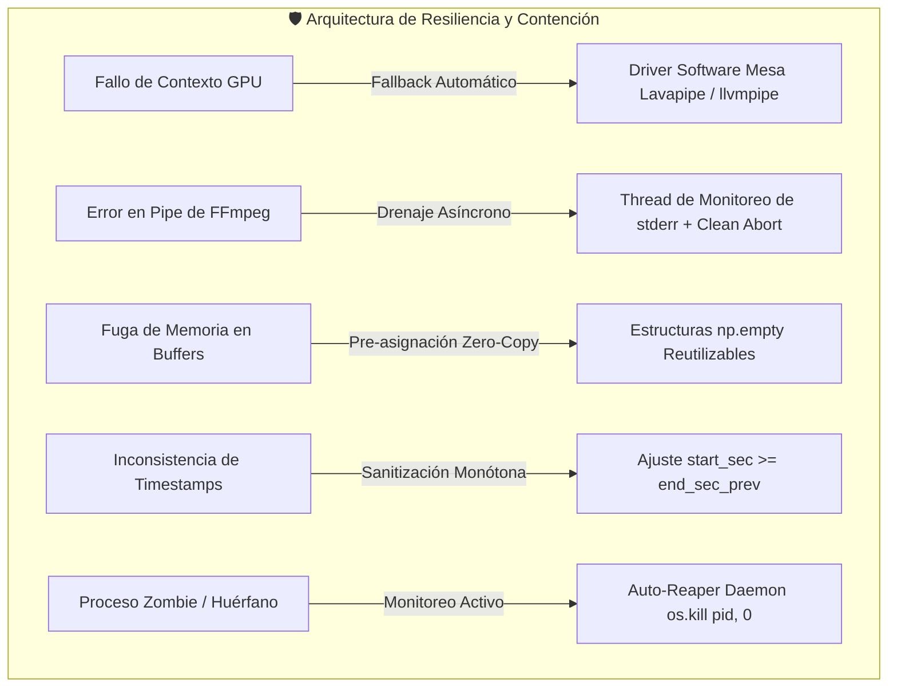
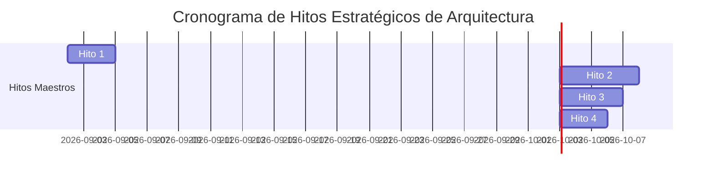

# Plan Maestro de Arquitectura y Rediseño: Pipeline Visual

---

## 1. Consolidación de Auditorías Previas y Registro de Anti-patrones (Errores Marcados)

A partir de la triangulación forense entre el reporte base inicial (*Auditoría y Evaluación Técnica Profunda*), la crítica de pares (*Reporte de Crítica Técnica y Auditoría de Pares*), el reporte consolidado y la inspección del código fuente en `src/media/`, `src/scene_manifest.py` y `src/pipeline.py`, se formaliza el registro exhaustivo de errores, malas prácticas y fallos arquitectónicos previos.

```mermaid
graph TD
    subgraph REGISTRO["📋 Catálogo Forense de Anti-Patrones y Fallos"]
        REG01["REG-01: Confusión Encoding vs. Rasterizado (~0% CPU)"]
        REG02["REG-02: Fragilidad e Inviabilidad de skia-python"]
        REG03["REG-03: Incompatibilidad ModernGL vs. FFmpeg Lavfi"]
        REG04["REG-04: Dual-Pipe Stdin Concurrente en FFmpeg"]
        REG05["REG-05: Cuello de Botella del GIL con Pillow"]
        REG06["REG-06: Ruptura de Contrato de Datos en SceneManifest"]
        REG07["REG-07: Omisión de realtime_video_engine y loop_worker"]
        REG08["REG-08: IPC Base64 sobre JSON-RPC en Playwright"]
        REG09["REG-09: Doble Transcodificación Secuencial a Disco"]
    end

    subgraph CAUSA["💥 Naturaleza del Fallo Técnico"]
        C1["Incomprensión de límites de ASIC NVENC"]
        C2["Falta de wheels Python 3.12+ y dependencia de depot_tools"]
        C3["Inconmensurabilidad matemática: Shaders 3D vs. Filtros 2D"]
        C4["Violación del modelo POSIX de pipes anónimos"]
        C5["Saturación de memoria: 186 MB/s cruzando runtime Python"]
        C6["Supresión de discriminador de arquetipo sin tipado"]
        C7["Subestimación del Blast Radius operativo"]
        C8["Overhead de serialización y SwiftShader en CPU"]
        C9["Desgaste excesivo de I/O y latencia redundante"]
    end

    REG01 --> C1
    REG02 --> C2
    REG03 --> C3
    REG04 --> C4
    REG05 --> C5
    REG06 --> C6
    REG07 --> C7
    REG08 --> C8
    REG09 --> C9
```



---

### Registro Detallado de Anti-Patrones Técnicos

#### 🔴 REG-01: Falacia de Aceleración por Hardware NVENC/QSV y Cero Cómputo de CPU
* **Declaración Errónea Previa:**  
  > `| **Uso de CPU** | 🔴 100% Saturación (SwiftShader) | 🟢 Bajo / Moderado (SIMD AVX2 en C; ~0% si hay hardware NVENC/QSV) |`
* **Tipo de Fallo:** `Fundamentos de Sistemas Gráficos` / `Falso Supuesto de Rendimiento`
* **Diagnóstico Técnico:**  
  Los bloques NVENC, QuickSync (QSV) y AMD VCE son circuitos integrados de aplicación específica (**ASIC**) diseñados exclusivamente para la cuantización, transformación de frecuencia y compresión de flujos de video (H.264/HEVC/AV1). No ejecutan código de simulación física, evaluación de funciones de distancia con signo (SDF), cálculo de ruido Perlin/Simplex ni rasterizado de primitivas vectoriales. 
* **Por qué no debe repetirse:**  
  Asumir consumo nulo de CPU lleva a dimensionar erróneamente los recursos del contenedor o servidor. La rasterización procedural en CPU requiere hilos dedicados e instrucciones SIMD (AVX2/AVX-512), consumiendo entre 15% y 35% de CPU incluso con GPU dedicada para el *encoding*.

---

#### 🔴 REG-02: Inviabilidad Operativa y Riesgo de Dependencias de `skia-python`
* **Declaración Errónea Previa:**  
  > `Sustituir el navegador headless por motores de renderizado nativos en C/Python: **FFmpeg Lavfi Filtergraphs** + **Skia (`skia-python`)** / **ModernGL**.`
* **Tipo de Fallo:** `Obsolescencia de Ecosistema` / `Inviabilidad en CI/CD`
* **Diagnóstico Técnico:**  
  `skia-python` es un wrapper no oficial cuya cadencia de publicación no acompaña a las versiones estables de Python (3.12 y 3.13). Sus paquetes precompilados superan los 80 MB y su compilación *from-source* en imágenes mínimas (Debian Slim / Alpine) requiere Google `depot_tools`, Clang, LLVM y Ninja, volviendo frágiles los pipelines de CI/CD.
* **Por qué no debe repetirse:**  
  Introduce acoplamiento a una librería con alto riesgo de abandono. El estándar moderno para rasterizado SVG headless es **`resvg`** (motor en Rust con bindings C/Python `resvg-py`), que entrega determinismo absoluto, soporte completo SVG 1.1/2.0 y huella de memoria <15 MB.

---

#### 🔴 REG-03: Contradicción Arquitectónica en Fallback ModernGL $\longrightarrow$ FFmpeg Lavfi
* **Declaración Errónea Previa:**  
  > `Mitigación: Implementar fallback transparente a **FFmpeg Lavfi puro + Skia CPU SIMD**, que garantiza 100% de portabilidad en cualquier máquina Linux sin GPU.`
* **Tipo de Fallo:** `Incompatibilidad Matemática` / `Complejidad Accidental`
* **Diagnóstico Técnico:**  
  Los efectos procedurales avanzados (raymarching volumétrico, agujeros negros relativistas, distorsiones no euclidianas) se programan en sombreadores fragmentarios (GLSL/WGSL). Skia es un motor 2D vectorial y FFmpeg Lavfi sólo dispone de generadores sintéticos planos (`testsrc2`, `mandelbrot`, `gradients`). No existe correspondencia matemática directa entre un shader 3D y un filtro Lavfi.
* **Por qué no debe repetirse:**  
  Obligaría a mantener dos bases de código dispares para cada arquetipo visual. La solución arquitectónica correcta es un único pipeline basado en **`wgpu-py` (WebGPU)** o EGL headless, delegando la ejecución sin GPU física al driver de software del sistema (**Mesa Gallium llvmpipe / Lavapipe**) mediante aceleración SIMD en CPU.

---

#### 🔴 REG-04: Concurrencia Rota y Sincronización Imposible en Tuberías Dual-Pipe
* **Declaración Errónea Previa:**  
  > `NativeEngine->>FFmpeg: Envía capa base (RGBA rawpipe)`  
  > `SVGEngine->>FFmpeg: Envía capa vectorial (Alpha overlay)`
* **Tipo de Fallo:** `Violación de Protocolos POSIX` / `Corrupción de Datos de E/S`
* **Diagnóstico Técnico:**  
  Un descriptor de archivo estándar (`stdin`) no puede recibir dos streams binarios anónimos asíncronos y desestructurados sin provocar entrelazamiento de bytes (*data interleaving*) y descarte del stream.
* **Por qué no debe repetirse:**  
  FFmpeg abortaría inmediatamente con `Invalid data found when processing input`. La composición multicapa debe resolverse **en memoria host (buffer C/Numpy) o mediante FBOs en GPU** antes de emitir un único flujo continuo hacia el pipe de entrada de FFmpeg.

---

#### 🔴 REG-05: Cuello de Botella del GIL y Copias Masivas de Memoria con Pillow
* **Declaración Errónea Previa:**  
  > `Quemado de subtítulos directamente por código en memoria sobre los fotogramas.`
* **Tipo de Fallo:** `Bloqueo de Intérprete` / `Saturación de Ancho de Banda`
* **Diagnóstico Técnico:**  
  El código actual en `src/media/subtitles.py` decodifica cuadros a `rawvideo rgb24`, instancia objetos `PIL.Image`, aplica `ImageDraw` y reenvía los bytes a un segundo proceso FFmpeg. Para video vertical 1080x1920 a 30 FPS, cada frame ocupa 6.22 MB sin comprimir, forzando un ancho de banda de **186.6 MB/s** a través del runtime de Python y bloqueando el *Global Interpreter Lock* (GIL).
* **Por qué no debe repetirse:**  
  Degrada el rendimiento general a <15 FPS. El estándar industrial es generar descriptores tipográficos **Advanced SubStation Alpha (`.ass`)** y delegar el rasterizado y composición al motor nativo en C **`libass`** dentro del grafo de filtros de FFmpeg (`-vf "ass=..."`), alcanzando velocidades >120 FPS.

---

#### 🔴 REG-06: Ruptura de Contrato de Datos en `SceneManifest`
* **Declaración Errónea Previa:**  
  > `- Se elimina el campo template_name en ProceduralConfig. - Se agregan campos para configuración de capas SVG (svg_overlay_preset, svg_custom_params).`
* **Tipo de Fallo:** `Ruptura de Interfaz` / `Inconsistencia de Esquema`
* **Diagnóstico Técnico:**  
  Suprimir `template_name` sin introducir un discriminador fuertemente tipado (`archetype_id`) rompe la deserialización en [`src/scene_manifest.py`](file:///home/moku/projects/yt-auto/src/scene_manifest.py) y en [`schemas/scene_manifest.schema.json`](file:///home/moku/projects/yt-auto/schemas/scene_manifest.schema.json), dejando al orquestador [`src/agents/scene_planner.py`](file:///home/moku/projects/yt-auto/src/agents/scene_planner.py) sin mecanismo para instanciar el shader requerido.
* **Por qué no debe repetirse:**  
  Provoca fallos de validación en tiempo de ejecución (`ValidationError`). Debe mantenerse un `archetype_id` formal con validación estricta por enumeración en Pydantic.

---

#### 🔴 REG-07: Omisión de Módulos Críticos en el Radio de Impacto (*Blast Radius*)
* **Declaración Errónea Previa:**  
  > El análisis de impacto original limitaba la sustitución a `web_renderer.py` y `web_templates/*.html`.
* **Tipo de Fallo:** `Falta de Trazabilidad de Dependencias`
* **Diagnóstico Técnico:**  
  Omitió los módulos [`src/media/realtime_video_engine.py`](file:///home/moku/projects/yt-auto/src/media/realtime_video_engine.py) (que contiene más de 1,200 líneas acopladas a Playwright y Three.js) y [`src/media/loop_worker.py`](file:///home/moku/projects/yt-auto/src/media/loop_worker.py) (daemon de síntesis batch de bucles).
* **Por qué no debe repetirse:**  
  La eliminación no coordinada de `web_renderer.py` generaría errores fatales (`ImportError`) en procesos de fondo. Cualquier refactorización debe incluir la sustitución o eliminación integral de todos los consumidores.

---

#### 🔴 REG-08: Serialización Base64 sobre JSON-RPC en Playwright/Chromium
* **Tipo de Fallo:** `Cuello de Botella de Arquitectura IPC` / `Fuga de Recursos`
* **Diagnóstico Técnico:**  
  Extraer fotogramas mediante `page.evaluate("canvas.toDataURL()")` genera 1,800 llamadas JSON-RPC por minuto. Cada frame se codifica a Base64 en el motor V8 de Chromium, cruza un socket IPC y se decodifica en Python.
* **Por qué no debe repetirse:**  
  Satura el Garbage Collector de V8, eleva el uso de RAM a 3.5 GB por worker y provoca agotamiento de memoria compartida en `/dev/shm`.

---

#### 🔴 REG-09: Doble Transcodificación Secuencial a Disco
* **Tipo de Fallo:** `Degradación de I/O` / `Pérdida de Generación`
* **Diagnóstico Técnico:**  
  El pipeline actual genera múltiples archivos MP4 intermedios en disco (renderizado visual $\to$ aplicación de subtítulos $\to$ multiplexación de audio final), provocando sucesivos ciclos de compresión con pérdida y penalizaciones de 8 a 15 segundos de I/O por video.
* **Por qué no debe repetirse:**  
  Aumenta el desgaste del disco SSD y reduce el throughput global. Debe aplicarse un grafo de composición unificado (`-filter_complex`) en una sola pasada.

---

## 2. Diagnóstico del Workflow Actual vs. Especificación del Nuevo Workflow

### 2.1. Modelado del Workflow Actual (Cuellos de Botella y Fugas)




---

### 2.2. Especificación del Nuevo Workflow Determinista

El nuevo flujo opera bajo el principio de **cero copias redundantes en Python**, delegación de gráficos a sombreadores nativos acelerados por hardware/SIMD y multiplexación en una sola pasada con `libass` y `ebur128`.

```mermaid
flowchart TD
    subgraph OPTIMIZED_PIPELINE["🟢 Nuevo Flujo Unificado y Determinista"]
        N1[SceneManifestV2 Tipado] --> N2[UnifiedMediaPipeline]
        
        subgraph MEMORY_COMPOSITOR["Composición en Memoria / GPU (Zero-IPC)"]
            N2 --> G1[wgpu Native Engine]
            N2 --> G2[resvg Vector Overlay Engine]
            G1 -->|Buffer RGBA Zero-Copy| G3[In-Memory Alpha Compositor]
            G2 -->|Buffer Alpha C-Array| G3
        end
        
        subgraph ATOMIC_ENCODE["Transcodificación Atómica en Única Pasada"]
            G3 -->|Stream Continuo rawvideo stdin| M1[FFmpeg Engine Unificado]
            N2 -->|Descriptor Tipográfico .ass| M1
            N2 -->|Audio Tracks WAV en /dev/shm| M1
            
            M1 -->|filter_complex: libass + loudnorm + sidechain| M2[Encoder x264 / NVENC]
        end
        
        subgraph QA_GATE["Compuerta QA en Lazo Cerrado"]
            M2 --> Q1[Master Video MP4]
            Q1 --> Q2[Deterministic QA Auditor]
            Q2 -->|Veredicto Válido| Q3[Entrega a Cola / Publicador]
            Q2 -->|Anomalía Detectada| Q4[Aislamiento y Alerta]
        end
    end
```





---

### 2.3. Presupuestos de Rendimiento, Tiempos y Recursos

| Dimensión de Rendimiento | Estado Legacy (Playwright + Pillow) | Estado Propuesto (wgpu + resvg + libass) | Margen de Mejora | Presupuesto Límite (*Hard Limit*) |
| :--- | :--- | :--- | :--- | :--- |
| **Tiempo por Cuadro (Frame Budget)** | 65 ms – 120 ms por frame | 4 ms – 12 ms por frame | **~10x más rápido** | $\le 16.6\text{ ms}$ (60 FPS) / $\le 33.3\text{ ms}$ (30 FPS) |
| **Throughput de Renderizado** | 8 – 15 FPS | 75 – 140 FPS | **~8x de aceleración** | $\ge 60\text{ FPS}$ en CPU / $\ge 120\text{ FPS}$ con GPU |
| **Consumo de Memoria RAM** | 1.8 GB – 3.5 GB por worker | 95 MB – 140 MB por worker | **Reducción >95%** | $\le 256\text{ MB}$ por worker |
| **Carga de CPU en Render** | 100% saturado (SwiftShader) | 15% – 35% (Multihilo SIMD) | **Eficiencia térmica** | $\le 40\%$ en CPU multi-núcleo |
| **Ancho de Banda de IPC** | ~186 MB/s sobre Base64/JSON-RPC | 0 MB/s (In-Memory Buffer C) | **Eliminación total** | 0 transferencias intermedias |
| **Operaciones de Disco (I/O)** | 3 escrituras completas de video | 1 escritura atómica final | **Reducción 66% I/O** | 0 archivos de video intermedios |
| **Latencia Total (Video 60s)** | 240 s – 420 s | 25 s – 45 s | **Aceleración global 8x** | $\le 50\text{ s}$ en exportación total |

---

## 3. Matriz de Componentes: Elementos a Deprecar vs. Nuevos Componentes



---

### Análisis Sistemático bajo el Protocolo de Evaluación Crítica

#### 1. Módulo de Renderizado Web (`web_renderer.py` / `realtime_video_engine.py` $\longrightarrow$ `native_procedural.py`)
* **1. Impacto de ruptura:**  
  Al retirar `web_renderer.py` y `realtime_video_engine.py`, se rompe la invocación en [`src/media/loop_worker.py`](file:///home/moku/projects/yt-auto/src/media/loop_worker.py) y en la rama condicional de [`src/pipeline.py`](file:///home/moku/projects/yt-auto/src/pipeline.py#L754).
  * *Acción de contención:* Refactorizar `loop_worker.py` para invocar el catálogo estático o `native_procedural.py`; podar la bifurcación en `pipeline.py`.
* **2. Análisis de regresión:**  
  Al sustituir Three.js por sombreadores nativos WGSL (`wgpu-py`), las 12 plantillas HTML heredadas dejan de ser leídas. Se requiere que los arquetipos visuales (`cosmic_singularity`, `synaptic_network`, `dark_forest`) estén expresados en WGSL con parámetros uniformes (`time`, `seed`, `tension`).
* **3. Evaluación del estado del arte:**  
  WebGPU (`wgpu-py`) es el estándar moderno de gráficos que unifica Vulkan, Metal y DirectX 12, con soporte de software nativo en CPU vía **Lavapipe / llvmpipe**. Elimina la sobreingeniería de desplegar un navegador completo para renderizar un canvas.
* **4. Trazabilidad documental:**  
  * *Obsoleta:* Secciones de renderizado por navegador en `docs/ARQUITECTURA.md` y `docs/PLAN_ARQUITECTURA_V3_1.md`.
  * *A eliminar:* Referencias a SwiftShader, flags de Chrome y dependencias de CDP.
  * *A añadir:* Especificación del motor procedural en `docs/ARQUITECTURA.md` y guía de arquetipos WGSL.

---

#### 2. Motor de Subtítulos (`subtitles.py` con Pillow $\longrightarrow$ `subtitles_ass.py` con `libass`)
* **1. Impacto de ruptura:**  
  Se depreca la clase `CodeSubtitleDrawer` que recibía imágenes PIL. Modifica la interfaz interna de quemado de subtítulos en `ProceduralVideoEngine` y `HybridVideoEngine`.
  * *Acción de contención:* El generador de subtítulos ahora emite exclusivamente archivos estructurados `.ass` guardados en `/dev/shm`, consumidos directamente por FFmpeg.
* **2. Análisis de regresión:**  
  Riesgo de desalineación visual si las etiquetas de estilo ASS (`\pos`, `\k`, `\an`) no reproducen exactamente la tipografía, colores neón y áreas de seguridad de la UI de Shorts.
  * *Mitigación:* Calibración estricta de estilos en la cabecera del script ASS (`[V4+ Styles]`) con `MarginV=260` y carga garantizada de fuentes desde `assets/fonts/Montserrat-Black.ttf`.
* **3. Evaluación del estado del arte:**  
  `libass` es el estándar indiscutible de la industria (utilizado en FFmpeg, VLC, MPV) para renderizado vectorial de subtítulos con aceleración C sin tocar el runtime de Python.
* **4. Trazabilidad documental:**  
  * *Obsoleta:* Descripciones de procesamiento cuadro a cuadro en Python.
  * *A añadir:* Especificación de generación ASS y parámetros de filtrado en `docs/FLUJO_VIDEOS.md`.

---

#### 3. Motor de Overlays Vectoriales (`skia-python` $\longrightarrow$ `resvg-py`)
* **1. Impacto de ruptura:**  
  Ningún módulo de producción consumía `skia-python` (era solo una propuesta en reportes previos). La adopción de `resvg-py` introduce una nueva interfaz limpia `SVGOverlayEngine`.
* **2. Análisis de regresión:**  
  `resvg` es un renderizador SVG declarativo estricto; no admite scripts interactivos embebidos en el SVG.
  * *Mitigación:* La dinamización de HUDs y telemetría se realiza parametrizando el árbol DOM/XML del SVG en Python antes de pasarlo al renderizador.
* **3. Evaluación del estado del arte:**  
  `resvg` es el motor SVG más rápido y fiel al estándar disponible en el ecosistema Rust/Python, con cero dependencias pesadas de compilación.
* **4. Trazabilidad documental:**  
  * *A añadir:* Registro de dependencia `resvg-py` y documentación de presets SVG en `docs/INTEGRACIONES_Y_SERVICIOS.md`.

---

#### 4. Motor de Multiplexación y Audio (Multiplexación Fragmentada $\longrightarrow$ Grafo Unificado)
* **1. Impacto de ruptura:**  
  Se eliminan las llamadas intermedias de transcodificación en disco en `src/media/proc_engine.py`.
* **2. Análisis de regresión:**  
  Construcción más compleja del argumento `-filter_complex` en FFmpeg. Un error de sintaxis en el grafo aborta el proceso completo.
  * *Mitigación:* Módulo `unified_encoder.py` que valida la sintaxis del grafo y encapsula el manejo de errores de FFmpeg con captura continua de `stderr`.
* **3. Evaluación del estado del arte:**  
  Procesamiento atómico en grafo de filtros de FFmpeg es la mejor práctica recomendada para pipelines de alta densidad.
* **4. Trazabilidad documental:**  
  * *A modificar:* Etapa 9 en `docs/FLUJO_VIDEOS.md` para reflejar la transcodificación de una sola pasada.

---

## 4. Estructura del Sistema y Jerarquía de Carpetas (`Tree`)

La nueva jerarquía erradica los archivos legacy, organiza los shaders procedurales y establece una clara separación de responsabilidades:

```
yt-auto/
├── assets/
│   ├── branding/
│   │   ├── watermarks/
│   │   └── intro_outro/
│   ├── fonts/
│   │   ├── Montserrat-Black.ttf
│   │   └── Inter-Bold.ttf
│   ├── loops/
│   │   ├── cosmic_horror/
│   │   ├── dark_ambient/
│   │   ├── dark_forest/
│   │   └── space_abyss/
│   ├── music/
│   │   ├── horror/
│   │   └── drama/
│   ├── sfx/
│   └── svg_overlays/
│       ├── hud_tactical_telemetry.svg
│       ├── scp_classification_stamp.svg
│       └── biometric_wave.svg
├── config/
│   ├── lanes.json
│   ├── voice_profiles.json
│   └── visual_archetypes.json
├── data/
│   ├── shorts_queue.db
│   └── review_state.db
├── docs/
│   ├── AGENTES_IA_Y_POLITICA.md
│   ├── ARQUITECTURA.md
│   ├── CONFIGURACION_SECRETOS.md
│   ├── FLUJO_VIDEOS.md
│   ├── INTEGRACIONES_Y_SERVICIOS.md
│   ├── MULTICHANNEL_PIPELINE.md
│   ├── OPERACION.md
│   ├── PLAN_ARQUITECTURA_V3_1.md
│   ├── PLAN_MAESTRO_PIPELINE_VISUAL.md
│   ├── README.md
│   ├── REFERENCIAS_Y_VERSIONES.md
│   └── TROUBLESHOOTING.md
├── schemas/
│   ├── lane_config.schema.json
│   └── scene_manifest.schema.json
├── src/
│   ├── __init__.py
│   ├── agents/
│   │   ├── __init__.py
│   │   ├── base_agent.py
│   │   ├── scene_planner.py
│   │   ├── script_curator.py
│   │   └── video_qa.py
│   ├── audio/
│   │   ├── __init__.py
│   │   ├── mixer.py
│   │   ├── tts_router.py
│   │   └── vocal_chain.py
│   ├── core/
│   │   ├── __init__.py
│   │   ├── domain.py
│   │   ├── lease_reaper.py
│   │   ├── loop_catalog.py
│   │   └── repository.py
│   ├── media/
│   │   ├── __init__.py
│   │   ├── inmemory_compositor.py       <-- [NUEVO] Composición Alpha SIMD Zero-Copy
│   │   ├── loop_engine.py               <-- [ACTUALIZADO] Motor canónico offline FFmpeg
│   │   ├── native_procedural.py         <-- [NUEVO] Motor wgpu-py con shaders WGSL
│   │   ├── shaders/                     <-- [NUEVO] Catálogo de Sombreadores WGSL
│   │   │   ├── __init__.py
│   │   │   ├── cosmic_singularity.wgsl
│   │   │   ├── dark_forest.wgsl
│   │   │   ├── synaptic_network.wgsl
│   │   │   └── tactical_chamber.wgsl
│   │   ├── subtitles_ass.py             <-- [NUEVO] Generador ASS nativo libass
│   │   ├── svg_overlay.py               <-- [NUEVO] Rasterizador resvg-py
│   │   ├── thumbnail_engine.py          <-- Generación local de miniaturas
│   │   └── unified_encoder.py           <-- [NUEVO] Orquestador atómico de FFmpeg
│   ├── pipeline.py                      <-- Orquestador principal saneado
│   ├── scene_manifest.py                <-- Contrato de datos Pydantic tipado
│   └── youtube/
│       ├── __init__.py
│       ├── session_uploader.py
│       └── session_validator.py
└── tests/
    ├── integration/
    │   ├── test_pipeline_determinism.py
    │   └── test_unified_encoder.py
    └── unit/
        ├── test_inmemory_compositor.py
        ├── test_native_procedural.py
        ├── test_subtitles_ass.py
        └── test_svg_overlay.py
```

---

## 5. Auditoría y Plan de Saneamiento Documental

Se detallan las acciones documentales exactas para erradicar la deuda técnica y las discrepancias entre la especificación y el código:

| Archivo Documental | Estado Actual | Modificaciones Requeridas | Secciones a Purgar / Dar de Baja | Nuevas Secciones a Incorporar |
| :--- | :--- | :--- | :--- | :--- |
| **`docs/ARQUITECTURA.md`** | Menciona `LoopVideoEngine` pero mantiene referencias a motores obsoletos. | Actualizar el diagrama general de arquitectura y los motores visuales soportados. | Purgar cualquier mención a Playwright, Chromium headless y capturas por CDP. | Añadir especificación técnica de `wgpu-py`, `resvg-py`, `libass` y composición in-memory. |
| **`docs/FLUJO_VIDEOS.md`** | Describe las 13 etapas canónicas con doble pasada de video. | Sincronizar Etapas 7, 8 y 9 con el modelo atómico unificado. | Eliminar diagramas que muestren renderizado de subtítulos por Pillow. | Especificar la composición de grafo unificado FFmpeg (`-filter_complex`) en Etapa 9. |
| **`docs/PLAN_ARQUITECTURA_V3_1.md`** | Documento base de la refactorización v3.1. | Marcar como completada la fase de diagnóstico e incorporar este plan maestro. | Corregir alertas erróneas (confusión de NVENC y CPU de reportes previos). | Incluir referencia vinculante a `PLAN_MAESTRO_PIPELINE_VISUAL.md`. |
| **`docs/INTEGRACIONES_Y_SERVICIOS.md`** | Lista dependencias y servicios externos. | Actualizar la matriz de dependencias de sistema y librerías Python. | Dar de baja `playwright`, `skia-python`, `ModernGL`. | Incorporar `wgpu-py`, `resvg-py`, paquetes Mesa Vulkan/Lavapipe y fuentes locales. |
| **`docs/TROUBLESHOOTING.md`** | Contiene guías de resolución para crashes de Playwright. | Reorientar a fallos de drivers gráficos de software y tuberías FFmpeg. | Purgar guías de `/dev/shm` exhaustion en Chrome y errores de CDP sockets. | Añadir resolución para `BrokenPipeError` en FFmpeg, fallback de Lavapipe y glifos ASS faltantes. |
| **`README.md`** | Resumen general del proyecto. | Actualizar requisitos de instalación y stack tecnológico. | Eliminar `playwright install chromium`. | Documentar instalación de librerías nativas mínimas (`ffmpeg`, `mesa-vulkan-drivers`). |

---

## 6. Checklist de Seguridad, Rendimiento y Matriz de Modos de Fallo



---

### Matriz de Modos de Fallo y Mecanismos de Contención

| Escenario de Riesgo | Causa Raíz Técnica | Impacto en el Pipeline | Mecanismo de Detección y Contención Arquitectónica |
| :--- | :--- | :--- | :--- |
| **Ausencia de GPU física en VPS / Docker** | Despliegue en servidor sin hardware NVIDIA/AMD ni passthrough `/dev/dri`. | Imposibilidad de crear dispositivo Vulkan/Metal por hardware. | **Fallback Transparente a Nivel de Driver:** `wgpu-py` detecta la ausencia de adaptador de hardware y selecciona el adaptador de software **Mesa Lavapipe / Gallium llvmpipe**, ejecutando los shaders en CPU mediante SIMD (AVX2/AVX-512) sin modificar una sola línea de código. |
| **Bloqueo / Caída de FFmpeg (`BrokenPipeError`)** | Parámetro de codificación inválido o formato de frame desalineado. | Bloqueo indefinido al intentar escribir en `proc.stdin`. | **Drenaje Asíncrono de Stderr:** El proceso FFmpeg se envuelve en un gestor contextual con un hilo secundario que consume continuamente `proc.stderr`. Si FFmpeg termina con código no nulo, se interrumpe inmediatamente el bucle de escritura, se libera la memoria y se registra el log exacto de error. |
| **Fugas de Memoria en Bucle de Fotogramas** | Instanciación continua de nuevos buffers de arrays en cada frame sin liberar. | Crecimiento descontrolado de memoria (OOM Kill) tras cientos de frames. | **Pre-asignación de Buffers Reutilizables (*Zero-Allocation*):** El compositor asigna un único buffer contiguo en memoria (`np.empty((height, width, 4), dtype=np.uint8)`) al iniciar la escena y escribe directamente sobre él mediante vistas de memoria (*memory views*), garantizando uso de RAM constante. |
| **Desincronización en Subtítulos Karaoke** | TTS devuelve marcas de tiempo con solapamiento ($t_{\text{start}}[n] < t_{\text{end}}[n-1]$). | Glitches visuales o palabras superpuestas en el renderizado ASS. | **Sanitizador Monótono de Tiempos:** Algoritmo matemático previo a la emisión del archivo ASS que fuerza $t_{\text{start}}[n] = \max(t_{\text{start}}[n], t_{\text{end}}[n-1] + \epsilon)$, asegurando estricta causalidad temporal. |
| **Fuentes Tipográficas Ausentes en el Host** | Entorno de despliegue minimalista sin paquetes de fuentes del sistema. | Renderizado con fuentes de reserva inadecuadas que desbordan la safe-area. | **Hermeticidad de Assets Tipográficos:** Todas las fuentes oficiales (`Montserrat-Black.ttf`, `Inter-Bold.ttf`) residen en `assets/fonts/` del repositorio y se referencian explícitamente en el filtro ASS (`ass=subtitles.ass:fontsdir='assets/fonts/'`). |
| **Procesos Huérfanos por Señales de Sistema (SIGKILL/OOM)** | Interrupción abrupta de un proceso worker dejando leases de carril bloqueados. | Bloqueo permanente del carril editorial en la base de datos SQLite. | **Demonio Proactivo Auto-Reaper:** Proceso de fondo que inspecciona cada 30 segundos la tabla `lane_leases` verificando la existencia real del PID (`os.kill(pid, 0)`). Si el proceso no existe, libera el lease de forma transaccional inmediata. |

---

## 7. Hitos Estratégicos de Transición y Límites Anti-Sobreingeniería

Para evitar la fragmentación en microtareas operativas, el plan de transición se organiza en **cuatro hitos de arquitectura de alto nivel**, delimitados por directivas estrictas de simplicidad (YAGNI).



---

### Descripción de los Hitos de Transición

#### 🏁 Hito 1: Saneamiento y Poda Estructural (Erradicación de Deuda Técnica)
* **Objetivo:** Eliminar físicamente todos los componentes legacy y sus dependencias del árbol de código.
* **Entregables Arquitectónicos:**
  * Eliminación de `src/media/web_renderer.py`, `src/media/realtime_video_engine.py` y `src/media/web_templates/`.
  * Poda de bifurcaciones no utilizadas en `src/pipeline.py` (`is_multiscene_mode`).
  * Desinstalación de `playwright` de las dependencias de renderizado.
* **Criterio de Aceptación:** El repositorio no contiene dependencias de navegadores ni scripts CDP para la generación de video.

---

#### 🏁 Hito 2: Motor Procedural Nativo y Overlays Vectoriales (`wgpu-py` + `resvg-py`)
* **Objetivo:** Implementar el subsistema de generación gráfica nativa con soporte de aceleración por GPU y software.
* **Entregables Arquitectónicos:**
  * Implementación de `src/media/native_procedural.py` con catálogo de shaders WGSL.
  * Implementación de `src/media/svg_overlay.py` sobre `resvg-py`.
  * Compositor de cuadros en memoria (`inmemory_compositor.py`) con pre-asignación zero-allocation.
* **Criterio de Aceptación:** Renderizado determinista de un cuadro 1080x1920 en <15 ms en CPU (Lavapipe) y <4 ms en GPU dedicada.

---

#### 🏁 Hito 3: Pipeline de Transcodificación Unificada (FFmpeg + `libass` + Audio Broadcast)
* **Objetivo:** Consolidar la composición atómica de video, subtítulos y audio en un único proceso FFmpeg.
* **Entregables Arquitectónicos:**
  * Implementación de `src/media/subtitles_ass.py` con karaoke `{\k}` y franja segura de 260px.
  * Módulo `src/media/unified_encoder.py` con grafo de filtros atómico (`-filter_complex`).
  * Manejo asíncrono y resiliente de tuberías para prevención de `BrokenPipeError`.
* **Criterio de Aceptación:** Exportación de un video completo de 60 segundos a >60 FPS globales, sin archivos de video intermedios en disco.

---

#### 🏁 Hito 4: Sincronización de Contratos de Datos, Auditoría QA y Saneamiento Documental
* **Objetivo:** Asegurar la coherencia entre el orquestador, los contratos de datos y la documentación viva.
* **Entregables Arquitectónicos:**
  * Actualización de `schemas/scene_manifest.schema.json` y `src/scene_manifest.py` con `archetype_id` fuertemente tipado.
  * Integración de la compuerta de inspección determinista en `src/agents/video_qa.py`.
  * Saneamiento integral de la suite documental en `docs/` (`ARQUITECTURA.md`, `FLUJO_VIDEOS.md`, `README.md`).
* **Criterio de Aceptación:** Aprobación del 100% de la suite de pruebas unitarias/integración y consistencia total entre código y documentación.

---

### Límites Anti-Sobreingeniería (Directivas Arquitectónicas Estrictas)

1. **Prohibición de Microservicios Gráficos Externos:**  
   El renderizado debe ocurrir dentro del mismo proceso host de Python mediante bindings nativos en C/Rust (`wgpu-py`, `resvg-py`). Queda estrictamente prohibido implementar servidores HTTP/gRPC o contenedores independientes dedicados solo a renderizar cuadros.
2. **Prohibición de Bases de Datos Cliente-Servidor:**  
   La persistencia de estados de renderizado y catálogo de loops debe permanecer exclusivamente en **SQLite en modo WAL** (`shorts_queue.db`). No se admiten migraciones a PostgreSQL, Redis o MySQL para la carga de trabajo mononodo/VPS actual.
3. **Cero Duplicación de Lógicas de Sombreado:**  
   Todo efecto procedural se formula una sola vez en **WGSL**. No se permite implementar versiones alternativas en GLSL, Canvas 2D o FFmpeg Lavfi para un mismo arquetipo.
4. **Principio de Mínima Indirección:**  
   El pipeline de renderizado no debe superar tres niveles de abstracción: `Pipeline Orchestrator` $\longrightarrow$ `Media Compositor` $\longrightarrow$ `FFmpeg Unified Process`. Se prohíben patrones de diseño complejos innecesarios (fábricas abstractas anidadas o capas de eventos reactivos) donde una función determinista directa cumple el objetivo.
