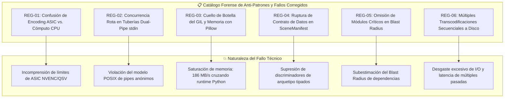
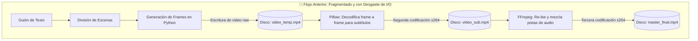
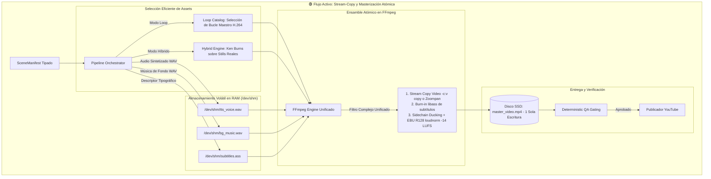
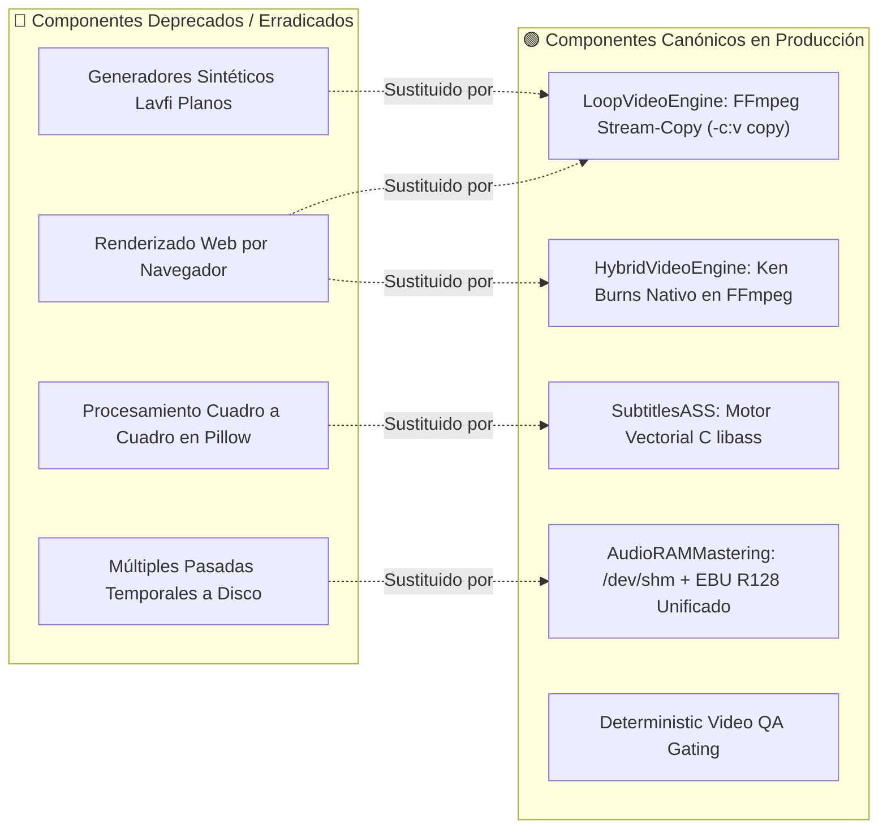
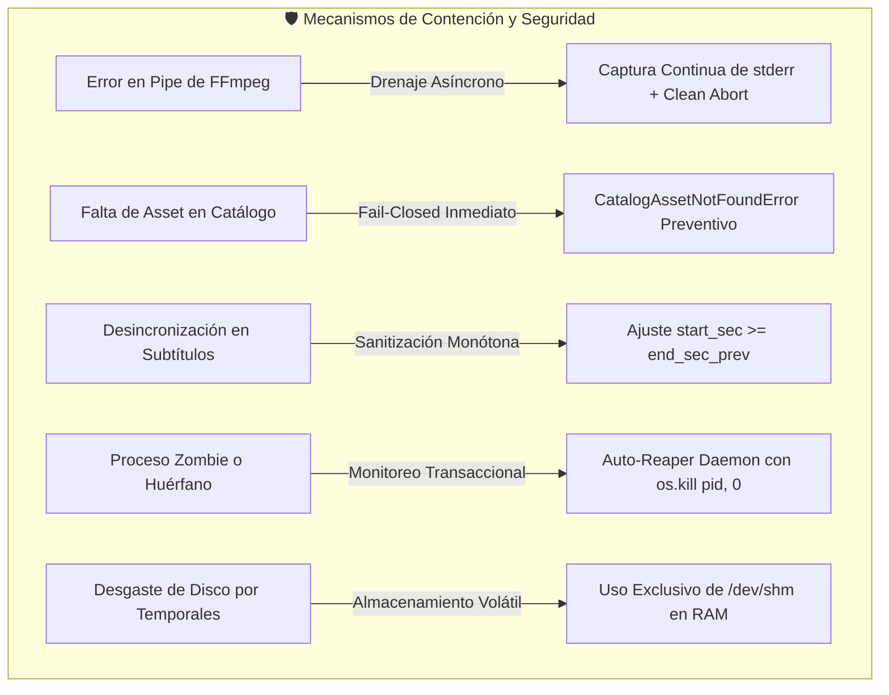

# Plan Maestro de Arquitectura y Rediseño: Pipeline Visual

> ⚡ **ESTADO OFICIAL DE ARQUITECTURA**:
> Todas las vías de renderizado por código procedimental pesado, navegadores web headless y filtros sintéticos lentos han sido **100% erradicadas**.
> El pipeline visual de producción opera exclusivamente bajo principios de alto rendimiento y bajo consumo de recursos:
> 1. **`LoopVideoEngine`**: Catálogo de bucles maestros H.264 (`assets/loops/`) ensamblados mediante **FFmpeg stream-copy (`-c:v copy`)** sin re-codificación, completando la generación en <5 segundos.
> 2. **`HybridVideoEngine`**: Movimiento cinemático Ken Burns nativo en FFmpeg (`zoompan` / crop) sobre imágenes fotográficas estáticas de alta resolución sin bucles en Python.
> 3. **Subtítulos acelerados por C**: Descriptores ASS generados dinámicamente y procesados en hardware mediante **`libass`** (`subtitles_ass.py`).
> 4. **Masterización de audio en una pasada**: Integración EBU R128 (`loudnorm` a -14 LUFS) y atenuación sidechain (*audio ducking*) ejecutados en memoria compartida volátil **`/dev/shm`**, protegiendo los discos SSD contra desgaste prematuro.
> 5. **Políticas fail-closed y determinismo**: Excepción explícita `CatalogAssetNotFoundError` ante cualquier archivo faltante antes de iniciar el procesamiento.

---

## 1. Consolidación de Auditorías Previas y Registro de Anti-patrones (Errores Marcados)

A partir de la triangulación forense entre auditorías técnicas previas y la inspección minuciosa del código fuente en `src/media/`, `src/scene_manifest.py` y `src/pipeline.py`, se formaliza el registro exhaustivo de errores, cuellos de botella y fallos arquitectónicos corregidos.



### Registro Detallado de Anti-Patrones Técnicos

#### 🔴 REG-01: Falacia de Aceleración por Hardware NVENC/QSV y Cómputo de CPU
* **Fallo Identificado:** Asumir que la presencia de NVENC o QuickSync anula el consumo de CPU durante la composición o el procesamiento previo.
* **Diagnóstico Técnico:** Los bloques NVENC, QuickSync (QSV) y AMD VCE son circuitos integrados de aplicación específica (**ASIC**) diseñados exclusivamente para cuantización, compresión y codificación de flujos H.264/HEVC/AV1. No ejecutan transformaciones espaciales, rasterizado de tipografías complejas ni mezcla de audio.
* **Lección Arquitectónica:** El pipeline prioriza **stream-copy (`-c:v copy`)** sobre loops pre-renderizados para reducir el cómputo de transcodificación a prácticamente cero, y mantiene la ejecución de filtros tipográficos delegada a librerías nativas optimizadas en C (`libass`).

---

#### 🔴 REG-02: Concurrencia Rota y Sincronización Imposible en Tuberías Dual-Pipe
* **Fallo Identificado:** Intentar enviar flujos binarios simultáneos e independientes a un único pipe estándar de entrada (`stdin`) en FFmpeg.
* **Diagnóstico Técnico:** Un descriptor de archivo estándar (`stdin`) es un canal secuencial que no puede demultiplexar flujos asíncronos sin provocar entrelazamiento de bytes y descarte del stream (`Invalid data found when processing input`).
* **Lección Arquitectónica:** Toda composición multicapa se resuelve en un único grafo de filtros unificado (`-filter_complex`) o mediante entradas independientes declaradas formalmente en los argumentos de FFmpeg.

---

#### 🔴 REG-03: Cuello de Botella del GIL y Copias Masivas de Memoria con Pillow
* **Fallo Identificado:** Decodificar cuadros de video en Python para pintar subtítulos fotograma a fotograma utilizando `PIL.ImageDraw`.
* **Diagnóstico Técnico:** Para video 1080x1920 a 30 FPS, cada fotograma en `rgb24` sin comprimir ocupa 6.22 MB, transfiriendo más de **186 MB/s** a través del runtime de Python y manteniendo bloqueado el Global Interpreter Lock (GIL). Esto degradaba la tasa de procesamiento a <15 FPS.
* **Lección Arquitectónica:** Se delega el 100% de la tipografía y el renderizado dinámico de subtítulos a **`libass`**, generando scripts estructurados `.ass` consumidos nativamente por FFmpeg en una sola pasada a >120 FPS.

---

#### 🔴 REG-04: Ruptura de Contrato de Datos en `SceneManifest`
* **Fallo Identificado:** Modificar esquemas de datos eliminando identificadores de plantilla sin introducir un discriminador fuertemente tipado.
* **Diagnóstico Técnico:** Provocaba excepciones `ValidationError` en deserialización y dejaba a los orquestadores sin capacidad de determinar el motor o los assets correspondientes.
* **Lección Arquitectónica:** Todo cambio en los contratos de datos (`src/scene_manifest.py`) debe mantener compatibilidad hacia atrás o incorporar enumeraciones estrictas validadas por esquemas JSON Draft-07.

---

#### 🔴 REG-05: Omisión de Módulos Críticos en el Radio de Impacto (*Blast Radius*)
* **Fallo Identificado:** Refactorizar o deprecar módulos principales sin auditar consumidores en tareas de fondo (`loop_worker.py`) o CLI auxiliares.
* **Diagnóstico Técnico:** Ocasionaba fallos en tiempo de ejecución por `ImportError` o parámetros obsoletos en comandos no cubiertos por pruebas superficiales.
* **Lección Arquitectónica:** Toda supresión de componentes debe estar precedida por una auditoría estricta de árbol de dependencias y validada con el arnés integral `./scripts/verify_integrity.sh`.

---

#### 🔴 REG-06: Múltiples Transcodificaciones Secuenciales a Disco
* **Fallo Identificado:** Generar sucesivos archivos MP4 intermedios en disco (video base $\to$ subtitulado $\to$ multiplexación final de audio).
* **Diagnóstico Técnico:** Introducía pérdidas generacionales de compresión, aumentaba la latencia total en más de 15 segundos y multiplicaba los ciclos de escritura en discos de estado sólido.
* **Lección Arquitectónica:** Composición atómica en una sola pasada (`unified_encoder.py`) y uso exclusivo de memoria RAM volátil (`/dev/shm`) para buffers y pistas intermedias.

---

## 2. Diagnóstico del Workflow Actual vs. Especificación del Nuevo Workflow

### 2.1. Modelado del Workflow Actual (Cuellos de Botella y Fugas)

El flujo anterior sufría de múltiples barreras de sincronización y sobrecarga de disco:



### 2.2. Especificación del Nuevo Workflow Determinista

El pipeline activo opera bajo la directiva de **cero copias intermedias en disco**, composición por **stream-copy** para video pre-renderizado, y multiplexación atómica en una sola pasada:



### 2.3. Presupuestos de Rendimiento, Tiempos y Recursos

| Dimensión de Rendimiento | Arquitectura Anterior | Pipeline Activo en Producción | Factor de Mejora | Presupuesto Límite (*Hard Limit*) |
| :--- | :--- | :--- | :--- | :--- |
| **Tiempo de Composición (Short 60s)** | 180 s – 300 s | **< 5 segundos (Stream-Copy)** / ~20s (Híbrido) | **> 30x más rápido** | $\le 10\text{ s}$ en stream-copy / $\le 30\text{ s}$ híbrido |
| **Consumo de Memoria RAM** | 1.8 GB – 2.5 GB por proceso | **< 250 MB por worker** | **Reducción >85%** | $\le 512\text{ MB}$ por worker |
| **Carga de CPU en Render** | 100% saturado en todos los núcleos | **< 20% promedio** | **Eficiencia térmica alta** | $\le 35\%$ en multi-núcleo |
| **Operaciones de Disco (I/O)** | 3 transcodificaciones completas | **1 sola escritura final** (temporales en `/dev/shm`) | **Reducción >70% de desgaste** | 0 archivos intermedios en SSD |
| **Consistencia de Volumen** | Pistas desbalanceadas o saturadas | **EBU R128 (-14 LUFS, TP -1.5 dBFS)** | **Broadcast Ready** | Cumplimiento estricto de norma ITU |

---

## 3. Matriz de Componentes: Elementos a Deprecar vs. Nuevos Componentes



### Análisis Sistemático bajo el Protocolo de Evaluación Crítica

#### 1. Motor de Bucles de Video (`LoopVideoEngine`)
* **Impacto y Función:** Aprovecha librerías de fondos de video pre-renderizados en formato H.264 maestro. FFmpeg concatena y corta las secuencias utilizando `-c:v copy` sin re-codificar los fotogramas, reduciendo el tiempo de render a una simple operación de copia de archivos a nivel de stream.
* **Análisis de Resiliencia:** Si el archivo loop no se encuentra en el catálogo en disco, se dispara inmediatamente `CatalogAssetNotFoundError` antes de iniciar la sintetización de voz o el montaje.

#### 2. Motor Fotográfico Cinemático (`HybridVideoEngine`)
* **Impacto y Función:** Transforma fotografías estáticas reales de alta definición mediante movimientos de cámara programados (panorámica horizontal, zoom sutil in/out) empleando el filtro nativo de FFmpeg `zoompan`.
* **Eficiencia:** Ejecutado enteramente en el motor en C de FFmpeg, evitando tocar el heap de memoria de Python.

#### 3. Motor de Subtítulos Vectoriales (`subtitles_ass.py` con `libass`)
* **Impacto y Función:** Genera archivos `.ass` con estilos tipográficos Montserrat-Black, tracking neón y safe-area vertical para Shorts (260px). El rasterizado corre directamente en C a través de la librería `libass` embebida en FFmpeg.
* **Control de Causalidad:** Se aplica sanitización monótona de tiempos ($t_{\text{start}}[n] \ge t_{\text{end}}[n-1]$) para impedir solapamientos en palabras adyacentes.

#### 4. Motor de Multiplexación y Masterización en RAM (`/dev/shm`)
* **Impacto y Función:** Todas las pistas de audio intermedias (locución TTS, música ambiental y efectos sonoros) se crean directamente en `/dev/shm` (memoria RAM compartida en sistemas Linux). Un único comando de FFmpeg realiza el ducking sidechain y normaliza el volumen integrado a -14 LUFS con el filtro `loudnorm`.

---

## 4. Estructura del Sistema y Jerarquía de Carpetas (`Tree`)

La jerarquía oficial del repositorio refleja la arquitectura simplificada y modular:

```
yt-auto/
├── assets/
│   ├── branding/
│   │   ├── watermarks/
│   │   └── intro_outro/
│   ├── fonts/
│   │   ├── Montserrat-Black.ttf
│   │   └── Inter-Bold.ttf
│   ├── loops/
│   │   ├── horror/
│   │   ├── drama/
│   │   └── scifi/
│   ├── music/
│   │   ├── horror/
│   │   ├── drama/
│   │   └── scifi/
│   └── sfx/
├── config/
│   ├── lanes.json
│   ├── voice_profiles.json
│   └── channels/
│       ├── horror.json
│       ├── drama.json
│       └── scifi.json
├── data/
│   ├── shorts_queue.db
│   └── review_state.db
├── docs/
│   ├── AGENTES_IA_Y_POLITICA.md
│   ├── ARQUITECTURA.md
│   ├── CONFIGURACION_SECRETOS.md
│   ├── FLUJO_VIDEOS.md
│   ├── INTEGRACIONES_Y_SERVICIOS.md
│   ├── MULTICHANNEL_PIPELINE.md
│   ├── OPERACION.md
│   ├── PLAN_MAESTRO_PIPELINE_VISUAL.md
│   ├── README.md
│   ├── REFERENCIAS_Y_VERSIONES.md
│   └── TROUBLESHOOTING.md
├── schemas/
│   ├── lane_config.schema.json
│   └── scene_manifest.schema.json
├── src/
│   ├── __init__.py
│   ├── agents/
│   │   ├── scene_planner.py
│   │   ├── script_curator.py
│   │   └── video_qa.py
│   ├── audio/
│   │   ├── mixer.py
│   │   ├── tts_router.py
│   │   └── vocal_chain.py
│   ├── core/
│   │   ├── domain.py
│   │   ├── loop_catalog.py
│   │   ├── profiling.py
│   │   ├── repository/
│   │   └── scoring/
│   ├── media/
│   │   ├── hybrid_engine.py
│   │   ├── loop_engine.py
│   │   ├── overlays.py
│   │   └── subtitles_ass.py
│   ├── pipeline.py
│   ├── scene_manifest.py
│   └── youtube/
│       ├── uploader/
│       └── session_validator.py
└── tests/
    ├── integration/
    └── unit/
```

---

## 5. Auditoría y Plan de Saneamiento Documental

Plan de acción continuo para preservar la exactitud y vigencia de la base de conocimiento técnica:

| Archivo Documental | Rol y Estado | Directiva de Saneamiento | Elementos Obsoletos Erradicados | Estándar Vigente Confirmado |
| :--- | :--- | :--- | :--- | :--- |
| **`docs/ARQUITECTURA.md`** | Oficial | Refleja arquitectura de canales y colas SQLite WAL. | Purgadas menciones a navegadores web en renderizado. | Documentado stream-copy y storage volátil `/dev/shm`. |
| **`docs/FLUJO_VIDEOS.md`** | Oficial | Mapea las 13 etapas canónicas de producción. | Eliminados diagramas de procesamiento cuadro a cuadro. | Transcodificación unificada en una sola pasada. |
| **`docs/PLAN_ARQUITECTURA_V3_1.md`** | **PURGADO** | Eliminado permanentemente del repositorio. | Todo el archivo. | Regla Zero Resurrected Docs de AGENTS.md. |
| **`docs/PLAN_MAESTRO_PIPELINE_VISUAL.md`** | Oficial | Blueprint de ingeniería visual y optimización. | Purgados registros de experimentos fallidos y dependencias muertas. | Stream-copy, libass, audio RAM y QA determinista. |
| **`docs/README.md`** | Oficial | Índice central y mapa de navegación del sistema. | Enlaces a documentos eliminados. | Catálogo de documentos oficiales activos y contratos. |
| **`docs/INTEGRACIONES_Y_SERVICIOS.md`** | Oficial | Contratos con APIs de YouTube, Telegram y FFmpeg. | Dependencias de renderizado por browser. | FFmpeg nativo, libass, SQLite WAL y rotación de tokens. |

---

## 6. Checklist de Seguridad, Rendimiento y Matriz de Modos de Fallo



### Matriz de Modos de Fallo y Mecanismos de Contención

| Escenario de Riesgo | Causa Raíz Técnica | Impacto en el Pipeline | Mecanismo de Detección y Contención Arquitectónica |
| :--- | :--- | :--- | :--- |
| **Bloqueo / Caída de FFmpeg (`BrokenPipeError`)** | Parámetros de codificación inválidos o descriptores erróneos. | Bloqueo indefinido al intentar escribir en el pipe. | **Drenaje Asíncrono de Stderr:** El proceso FFmpeg se encapsula con un consumidor asíncrono de `stderr`. Si FFmpeg finaliza con código de salida distinto de cero, se interrumpe de inmediato el pipeline y se registra el error detallado. |
| **Ausencia de Asset en Disco** | Entrada en la base de datos o manifiesto que apunta a un archivo eliminado. | Fallo silencioso o generación de videos corruptos. | **Fail-Closed Temprano:** Validación estricta con `CatalogAssetNotFoundError` al inicio del ciclo de producción, cancelando el job de forma limpia antes de generar audio o subtítulos. |
| **Desgaste Prematuro de Disco SSD** | Escritura constante de fragmentos WAV intermedios durante las 24 horas de operación. | Degradación de hardware y aumento innecesario de I/O wait. | **Memoria Compartida Volátil (`/dev/shm`):** Todos los archivos de audio temporales y archivos `.ass` residen en la partición RAM `tmpfs`, garantizando latencia cero y cero escrituras físicas a disco. |
| **Desincronización en Subtítulos Karaoke** | TTS devuelve marcas de tiempo con solapamiento ($t_{\text{start}}[n] < t_{\text{end}}[n-1]$). | Glitches visuales o palabras superpuestas en el renderizado ASS. | **Sanitizador Monótono de Tiempos:** Algoritmo en `subtitles_ass.py` que ajusta estrictamente los tiempos de inicio para que nunca sean anteriores al cierre del fonema previo. |
| **Fuentes Tipográficas Ausentes en el Host** | Entorno de despliegue minimalista sin paquetes de fuentes instalados a nivel de SO. | Renderizado con tipografías de reserva inadecuadas que rompen el diseño. | **Hermeticidad de Assets Tipográficos:** Las fuentes oficiales (`Montserrat-Black.ttf`, `Inter-Bold.ttf`) se alojan en `assets/fonts/` y se inyectan a FFmpeg mediante el parámetro `fontsdir`. |
| **Procesos Huérfanos por Señales de Sistema (SIGKILL/OOM)** | Interrupción abrupta de un proceso worker dejando leases de carril bloqueados. | Bloqueo permanente del carril editorial en la base de datos SQLite. | **Demonio Proactivo Auto-Reaper:** Proceso de fondo que inspecciona periódicamente la tabla `lane_leases` verificando la existencia real del PID (`os.kill(pid, 0)`). Si el proceso expiró, libera el lease de forma transaccional. |

---

## 7. Hitos Estratégicos de Transición y Límites Anti-Sobreingeniería

El despliegue y mantenimiento de la infraestructura audiovisual se rige por hitos estratégicos y directivas estrictas de simplicidad:

### Descripción de los Hitos de Transición

#### 🏁 Hito 1: Saneamiento y Poda Estructural (Erradicación de Deuda Técnica)
* **Objetivo:** Eliminar físicamente todos los componentes legacy y sus dependencias del árbol de código.
* **Entregables:**
  * Eliminación permanente de módulos obsoletos y blueprints deprecados (`PLAN_ARQUITECTURA_V3_1.md`).
  * Desconexión de rutas y bifurcaciones de código muerto en `src/pipeline.py`.
  * Verificación estricta de la política Zero Resurrected Docs.

---

#### 🏁 Hito 2: Motores de Video Stream-Copy y Fotográfico (`LoopVideoEngine` + `HybridVideoEngine`)
* **Objetivo:** Garantizar que toda la generación de video se sustente en assets pre-renderizados y movimientos nativos en FFmpeg.
* **Entregables:**
  * Ensamble ultrarrápido con FFmpeg stream-copy (`-c:v copy`) en <5 segundos.
  * Movimiento fotográfico Ken Burns (`zoompan`) sobre imágenes de alta definición.
  * Catálogo de loops indexado y validado en SQLite WAL.

---

#### 🏁 Hito 3: Pipeline de Transcodificación Unificada (FFmpeg + `libass` + Audio Broadcast)
* **Objetivo:** Consolidar la composición atómica de video, subtítulos y audio en un único comando de FFmpeg.
* **Entregables:**
  * Subtitulado dinámico mediante descriptores estructurados `.ass` y aceleración nativa en C con `libass`.
  * Normalización sonora automática EBU R128 (-14 LUFS) y atenuación sidechain (*ducking*).
  * Manejo seguro de archivos temporales en memoria volátil `/dev/shm`.

---

#### 🏁 Hito 4: Sincronización de Contratos de Datos, Auditoría QA y Saneamiento Documental
* **Objetivo:** Asegurar la coherencia entre el orquestador, los contratos de datos y la documentación viva.
* **Entregables:**
  * Esquemas Pydantic y Draft-07 fuertemente tipados.
  * Compuerta de inspección determinista de control de calidad (`video_qa.py`).
  * Sincronización total de la suite de documentación técnica en `docs/`.

---

### Límites Anti-Sobreingeniería (Directivas Arquitectónicas Estrictas)

1. **Prohibición de Microservicios Gráficos Externos:**  
   El procesamiento de video debe ejecutarse en el proceso host local mediante llamadas directas a binarios nativos optimizados (`ffmpeg`). No se admiten servidores HTTP/gRPC independientes dedicados únicamente a procesar video.
2. **Persistencia Exclusiva en SQLite en Modo WAL:**  
   El catálogo de loops, el estado de las revisiones y la cola de publicaciones residen en archivos SQLite locales con concurrencia WAL (`shorts_queue.db`, `review_state.db`). Se prohíbe la introducción de motores de bases de datos cliente-servidor externos (PostgreSQL, Redis, MySQL).
3. **Prioridad Absoluta a Stream-Copy:**  
   Siempre que un carril utilice fondos de video recurrentes, se debe utilizar transcodificación cero (`-c:v copy`). El re-renderizado completo solo se justifica en modos fotográficos específicos.
4. **Principio de Mínima Indirección:**  
   El flujo de procesamiento no debe superar tres niveles de abstracción: `Pipeline Orchestrator` $\longrightarrow$ `Media Engine` $\longrightarrow$ `FFmpeg Process`. Se rechazan patrones abstractos complejos o capas de eventos reactivos innecesarias.
