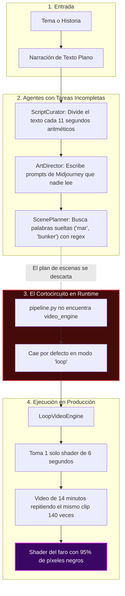
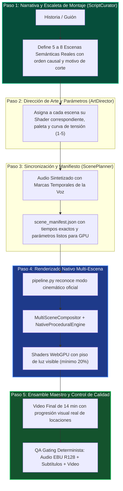

# Propuesta de Evolución del Pipeline Visual: Dirección Cinemática y Montaje Narrativo

---

## 1. Origen y Contexto del Descubrimiento

### 1.1. El Detonante Visual: Las Capturas de Producción
Durante la validación de tres videos recién generados en producción (un Short vertical de SCP-049 y dos producciones largas de más de 10 minutos para Moku y Aelithia), la inspección visual en Telegram reveló un contraste revelador:

1. **El video de terror documental (*La Frecuencia Prohibida* - 14m 25s):** 
   Al avanzar en la línea de tiempo (minuto 0:01, minuto 12:09), la pantalla permanecía prácticamente en **negro absoluto**, mostrando únicamente un cono tenue y diminuto de luz naranja flotando en el vacío. En pantallas de teléfonos móviles o monitores estándar, el video parecía una pantalla apagada o un fallo técnico de renderizado. No había entorno visible, ni olas, ni acantilado perceptible, ni variedad alguna a lo largo de un cuarto de hora de narración.
2. **El video de drama familiar (*¿Soy yo el malo?* - 10m+):** 
   En contraste directo, los fondos de esta producción lucían con presencia, detalle visual y calidez. Las tonalidades ámbar, el resplandor de fuego y las luces de interior creaban una experiencia acogedora y cinematográfica que enriquecía la narración.

### 1.2. La Intuición Crítica del Usuario
Este contraste no fue una casualidad técnica aislada, sino el síntoma visible de un problema arquitectónico más profundo planteado con total lucidez:
> *"En algunos videos, ser un fondo es demasiado literal y no hay muchos detalles... Pero tal vez el problema real es que se está creando un sistema supermecánico cuando estamos usando e incluyendo agentes de IA. La IA razona en el diseño visual y la creación del código para la temática, pero nadie está diciendo cómo, dónde y cuándo se incrusta una escena y por qué. Cuando se crea la escena no existe ese paso: cuántas escenas y cuál va después de cuál."*

### 1.3. La Confirmación Forense en el Código
Al auditar de manera rigurosa los archivos del sistema, se confirmó que el sistema había caído en una **paradoja mecánica**:
* **Se diseñaron tres agentes de IA especializados** (`CinematicScriptCuratorAgent`, `ArtDirectorMoodAgent`, `ScenePlannerCompositorAgent`), pero en tiempo de ejecución **se encontraban totalmente desconectados o puenteados**.
* El orquestador principal (`pipeline.py`) buscaba un campo de configuración (`lane.video_engine`) que no existía en los perfiles de los canales, provocando que el sistema cayera en silencio en un modo de bucle estático (`"loop"`).
* En dicho modo, el sistema tomaba un único fragmento procedural de 6 segundos y lo repetía de forma idéntica durante 14 minutos seguidos.
* Peor aún: incluso dentro de los agentes, la elección visual no respondía a la inteligencia del argumento, sino a una búsqueda tosca de palabras clave ("si dice mar, poner faro") y a un reloj ciego que cortaba las escenas cada 11 segundos aritméticos sin entender qué estaba sucediendo en la historia.

---

## 2. Auditoría Consolidada de Errores y Análisis de Daño (*Blast Radius*)

A continuación se detallan los hallazgos técnicos comprobados en el código, desglosando con precisión:
* **¿Qué rompen actualmente?** (El fallo observable).
* **¿Por qué lo rompen?** (La causa mecánica de fondo).
* **Si se corrigen, ¿qué más podrían romper?** (Riesgos colaterales y dependencias que debemos proteger).

---

### Error 1: Desconexión de Configuración en el Despacho de Motores
* **¿Qué rompe actualmente?**
  Anula y desecha por completo el trabajo de los agentes de IA en todas las producciones de los canales principales (`moku-horror-long`, `aelithia-aita-long`, `moku-scp-shorts`). Fuerza a que todos los videos se generen como un único bucle repetitivo de 6 segundos.
* **¿Por qué lo rompe?**
  En el archivo de configuración `config/lanes.json` los canales declaran la clave `"visual_pipeline": "director"`, pero en el orquestador `src/pipeline.py` el código intenta leer `getattr(lane, "video_engine", None)`. Al no encontrar esa propiedad, el valor resulta nulo y el sistema activa por defecto `engine_mode = "loop"`. Además, la palabra `"director"` ni siquiera figura dentro de los valores válidos reconocidos por el orquestador (`"multiscene"`, `"hybrid"`, `"procedural"`), por lo que si se configurara textualmente lanzaría un error crítico deteniendo el programa.
* **Si se corrige, ¿qué más podría romper?**
  Si simplemente forzamos al sistema a entrar en el modo multiescena sin que el motor de renderizado esté listo o configurado, el orquestador intentará llamar a un motor web que no existe físicamente en el servidor, provocando que el pipeline se caiga con un fallo fatal y **ningún canal pueda generar o publicar videos**. Debemos asegurar que el modo multiescena tenga un motor de ejecución nativo totalmente funcional antes de activar el interruptor.

---

### Error 2: Selección de Escenas por Búsqueda Superficial de Palabras Clave (Regex)
* **¿Qué rompe actualmente?**
  Produce una desconexión absurda entre la imagen y la narración. Si un relato de terror menciona *"recordé el mar mientras bajaba a la cámara subterránea"*, el sistema detecta la palabra *"mar"* y coloca un faro costero en medio de un búnker. Si el texto no contiene ninguna palabra de su lista fija, cae en un ciclo matemático ciego que va rotando fondos al azar.
* **¿Por qué lo rompe?**
  En `src/agents/scene_planner.py`, la función que elige la temática de la escena (`_resolve_scene_archetype`) utiliza comparaciones rígidas de texto (`if "bunker" in text: ...`). Carece de comprensión semántica sobre cuál es el escenario real donde transcurre la acción.
* **Si se corrige, ¿qué más podría romper?**
  Si intentamos solucionar esto agregando consultas lentas e incontroladas a un modelo de lenguaje en medio del renderizado, introduciremos **latencia excesiva, consumo imprevisto de tokens y fragilidad ante respuestas mal estructuradas**. La solución debe mantener una resolución rápida y confiable, trasladando el análisis temático a la etapa temprana de curaduría del guión.

---

### Error 3: Segmentación Temporal Ciega (Corte Matemático vs. Unidad Narrativa)
* **¿Qué rompe actualmente?**
  Fragmenta el video de forma antinatural. En producciones largas, intenta dividir el relato en cortes artificiales de 11 segundos, y cuando el número de escenas resultante es menor al mínimo configurado, recurre a cortar frases a la mitad partiendo listas de palabras por la mitad sin respetar puntos ni comas.
* **¿Por qué lo rompe?**
  En `src/agents/script_curator.py`, el cálculo de escenas se realiza mediante una regla de tres simple: total de palabras dividido por velocidad de locución y cortado cada 11 segundos. Confunde una *recomendación de dinamismo visual* con la *duración de una escena real*.
* **Si se corrige, ¿qué más podría romper?**
  Si eliminamos por completo los cortes y dejamos escenas demasiado extensas (por ejemplo, 3 minutos enteros sin ningún cambio de plano), el video se volverá aburrido y perderá la retención de la audiencia en YouTube. La corrección debe equilibrar la coherencia de la locación con variaciones sutiles de encuadre (planos generales, medios y detalles) dentro del mismo escenario.

---

### Error 4: Subexposición Fotométrica y Aplastamiento de Negros en Shaders
* **¿Qué rompe actualmente?**
  Hace que videos como el del faro (`maritime_lighthouse.wgsl`) se vean como pantallas casi completamente negras. En dispositivos móviles con pantallas OLED o bajo luz diurna, más del 90% de los píxeles están apagados, perdiéndose todo el trabajo visual.
* **¿Por qué lo rompe?**
  Los colores base del shader se definieron con valores numéricos diminutos entre `0.006` y `0.035` (que equivalen a valores de 1 a 9 en una escala tradicional de 0 a 255). Además, el motor WebGPU exporta las imágenes en un formato crudo que, al comprimirse en video estándar con FFmpeg, recorta y oscurece aún más los tonos oscuros por falta de una curva de gamma adecuada (sRGB).
* **Si se corrige, ¿qué más podría romper?**
  Si aumentamos la iluminación de forma torpe o global, **romperemos la atmósfera de terror y misterio**, haciendo que escenas nocturnas parezcan de día o provocando que los elementos brillantes (como el haz de luz del faro) se "quemen" perdiendo todo detalle. La corrección debe establecer un piso mínimo de visibilidad (entre 15% y 25%) que garantice contraste y legibilidad sin arruinar la ambientación oscura.

---

### Error 5: Cuello de Botella en el Buffer de Memoria WebGPU (64 Bytes)
* **¿Qué rompe actualmente?**
  Toda la especificación artística que genera el director de arte (`ArtDirectorMoodAgent`: tipos de lente, temperatura de color Kelvin, densidad de niebla, direcciones de iluminación) se descarta por completo y nunca llega a la pantalla.
* **¿Por qué lo rompe?**
  El motor gráfico nativo (`src/media/native_procedural.py`) reserva un bloque de memoria rígido de exactamente 64 bytes (16 números decimales) para comunicarse con la tarjeta gráfica. No existe ningún mecanismo que traduzca el documento JSON del director de arte hacia esos 16 valores de control del shader.
* **Si se corrige, ¿qué más podría romper?**
  La memoria gráfica de WebGPU exige una alineación estricta a nivel de hardware. Si alteramos el tamaño de ese buffer o cambiamos el orden de los números sin actualizar en simultáneo los 9 shaders del sistema, **el compilador gráfico fallará de inmediato y la aplicación se cerrará con un error de memoria**. La corrección debe ser un adaptador limpio que mapee las intenciones artísticas dentro de la estructura de datos que los shaders ya esperan.

---

### Error 6: Desconexión de los Motores Gráficos en Tiempo de Ejecución
* **¿Qué rompe actualmente?**
  Si el sistema intentara ejecutar el modo multiescena planificado, el compositor (`MultiSceneCompositor`) delegaría en un motor procedural que no tiene ningún visualizador asignado, viéndose obligado a generar imágenes de emergencia en la CPU con la librería Pillow, perdiendo toda la calidad y aceleración de los shaders WebGPU.
* **¿Por qué lo rompe?**
  El motor nativo WebGPU (`NativeProceduralEngine`) fue desarrollado y probado de forma aislada en suites de pruebas unitarias, pero nunca fue enchufado como el ejecutor oficial dentro de `MultiSceneCompositor`.
* **Si se corrige, ¿qué más podría romper?**
  Al conectar el renderizador WebGPU nativo al compositor multiescena, este intentará renderizar varias escenas en paralelo mediante hilos. Si el servidor no cuenta con una GPU dedicada y utiliza emulación por software (Lavapipe), lanzar demasiadas escenas simultáneas podría **saturar la memoria RAM o el procesador**, ralentizando el servidor. Se debe controlar cuidadosamente el número de tareas concurrentes.

---

## 3. Delimitación: Lo que SÍ Falta vs. Lo que NO Forma Parte de lo que Falta

Para evitar desviaciones de alcance o complejidades innecesarias, es vital establecer qué elementos forman parte de la solución y cuáles quedan terminantemente excluidos:

### 3.1. Lo que SÍ Falta (Los Elementos a Incorporar)
1. **La Escaleta Semántica de Montaje (Storyboarding Narrativo):**
   Un paso explícito en el que la IA razone la estructura audiovisual completa:
   * *Cuántas escenas:* Para un video de 10 a 14 minutos, una estructura profesional suele tener entre 5 y 8 escenas o locaciones principales (cada una de 1 a 2.5 minutos de duración).
   * *Cuál va después de cuál:* Una secuencia ordenada y lógica (ejemplo: Llegada al bosque exterior $\to$ Entrada a la estación abandonada $\to$ Sala de radio y registros $\to$ Descenso al túnel $\to$ Amanecer y cierre).
   * *Por qué cambia de plano:* Cada cambio de escena debe responder a un hito argumental (un cambio de lugar, una revelación importante o un aumento de tensión dramática).
2. **Adaptador de Intención Artística a Parámetros de Shader:**
   Una función que tome la decisión estética (locación elegida, nivel de tensión del 1 al 5, paleta cromática) y la traduzca de forma limpia a los parámetros que el shader WebGPU ya entiende (selección del shader adecuado, color de acento, velocidad, distorsión y pulso).
3. **Garantía de Piso Fotométrico de Visibilidad:**
   Ajuste en los shaders oscuros para que el fondo nunca baje de un nivel de luminancia seguro, asegurando que las texturas, siluetas y horizontes sean visibles en cualquier pantalla de teléfono celular.
4. **Unificación de Claves de Configuración:**
   Alinear las definiciones de los canales (`config/lanes.json`) con las condiciones del orquestador (`src/pipeline.py`), para que el modo de producción multiescena se active de manera transparente y oficial.

### 3.2. Lo que NO Forma Parte de lo que Falta (Límites Claros)
* **NO vamos a crear un nuevo agente:**
  Ya contamos con tres agentes (`ScriptCurator`, `ArtDirector`, `ScenePlanner`). Agregar un cuarto o quinto agente solo añadiría burocracia, lentitud y puntos de falla. Las funciones faltantes deben integrarse dentro de las responsabilidades de los agentes que ya existen.
* **NO vamos a usar APIs externas de generación de imágenes (Midjourney, DALL-E, etc.):**
  Generar imágenes estáticas con servicios externos introduce costos recurrentes, lentitud de red, fallos de conexión en entornos como Antigravity y pérdida total de control determinista sobre lo que se muestra. Nuestro motor procedural WebGPU local es gratuito, ultrarrápido y consistente.
* **NO vamos a reescribir los motores gráficos ni FFmpeg:**
  El motor WebGPU nativo, los shaders matemáticos y el ensamble con FFmpeg funcionan de manera excelente y con consumo mínimo de recursos. La tecnología de base está lista; solo necesita recibir instrucciones lógicas y coordinadas.
* **NO vamos a alterar las etapas que ya funcionan a la perfección:**
  La síntesis de voz (TTS), la generación y quemado de subtítulos con `libass`, el control estricto de volumen de audio (EBU R128), la base de datos de publicaciones y el control de calidad previo a la publicación (QA Gating) están 100% probados y deben permanecer intactos.

---

## 4. Comparativa de Workflows: Estado Actual vs. Estado Propuesto

### 4.1. Esquema del Workflow Actual (Lo que Hace Hoy)

**Explicación en Lenguaje Natural del Flujo Actual:**
El sistema recibe un tema y redacta un relato. Luego, los agentes fingen planificar una producción: uno corta el texto cada 11 segundos con una regla matemática sin importar si corta una frase al medio; otro escribe textos descriptivos para una inteligencia artificial de imágenes que no existe en el sistema; y el tercero busca palabras sueltas como *"búnker"* o *"faro"* en frases aisladas. Cuando el pipeline principal va a renderizar, ignora todo lo que hicieron los agentes porque la configuración no coincide, elige un único fondo procedural de 6 segundos y lo repite una y otra vez durante 14 minutos. Para colmo, ese fondo tiene los valores de luz tan bajos que la pantalla termina viéndose completamente negra.

---

### 4.2. Esquema del Nuevo Workflow Propuesto (Lo que Debería Hacer)

**Explicación en Lenguaje Natural del Flujo Propuesto:**
1. **Paso 1 (Curaduría y Montaje):** El primer agente no se limita a escribir texto; analiza el relato como un director de cine y establece la **Escaleta de Escenas**: define que la historia transcurrirá en 6 momentos claros, marcando qué ocurre en cada uno y por qué se pasa al siguiente.
2. **Paso 2 (Dirección de Arte):** El segundo agente toma esa lista de momentos y asigna a cada uno el shader procedural que mejor representa la locación (bosque, cámara de mando, terminal, abismo), definiendo además cómo evoluciona la luz y la tensión dramática del 1 al 5.
3. **Paso 3 (Sincronización Técnica):** El tercer agente combina la narración de voz real producida por el sintetizador con la lista de escenas, asegurando que los cortes de plano coincidan con las pausas naturales de la voz y construyendo el manifiesto técnico definitivo.
4. **Paso 4 (Renderizado Nativo):** El orquestador principal ejecuta el motor nativo WebGPU, renderizando cada escena con su shader correspondiente y con una iluminación que garantiza que todo sea claramente visible en cualquier pantalla.
5. **Paso 5 (Masterización y Control de Calidad):** Las escenas se unen de forma instantánea y fluida, se mezcla la música de fondo con atenuación automática cuando habla la voz (*audio ducking*), se queman los subtítulos sincronizados y se verifica que el archivo final cumpla con todos los estándares antes de publicarse.

---

### 4.3. Tabla Comparativa: Qué se Incorpora, Qué se Elimina y Por Qué

| Componente / Acción | ¿Qué se hace? | Justificación Funcional |
| :--- | :--- | :--- |
| **Escaleta de Escenas Narrativa** | **SE INCORPORA** en `ScriptCurator` | Permite que la IA razone cuántas escenas hay, cuál va primero y cuál después según la trama, eliminando la división ciega por segundos. |
| **Búsqueda por palabras clave (Regex)** | **SE ELIMINA** de `ScenePlanner` | Evita que el sistema asigne fondos erróneos por encontrar palabras accidentales en el texto, reemplazándolo por la asignación consciente del director de arte. |
| **Prompts de texto para Midjourney** | **SE ELIMINA** de `ArtDirector` | Remueve texto inútil que consumía recursos y no se utilizaba, sustituyéndolo por parámetros reales que controlan los shaders WebGPU. |
| **Piso Mínimo de Luminancia** | **SE INCORPORA** en shaders como el faro | Garantiza que los fondos oscuros mantengan al menos un 15-25% de visibilidad, evitando que los videos se vean como pantallas apagadas en teléfonos móviles. |
| **Bypass a Bucle Estático (`loop`)** | **SE ELIMINA** como ruta por defecto en canales largos | Permite que las producciones de 10 a 14 minutos muestren una verdadera variedad de escenarios en lugar de repetir un clip de 6 segundos cientos de veces. |
| **Conexión de `NativeProceduralEngine`** | **SE INCORPORA** al flujo multiescena | Conecta el motor gráfico WebGPU real que ya tenemos programado, permitiendo generar video acelerado y de alta definición localmente sin costo alguno. |
| **Creación de Agentes Nuevos** | **SE RECHAZA** categóricamente | Mantiene la arquitectura limpia y ágil. Los tres agentes existentes son más que suficientes si sus tareas están bien definidas. |
| **Uso de APIs Externas de Imágenes** | **SE RECHAZA** categóricamente | Elimina costos de suscripción, cuellos de botella de red y fallos de integración, aprovechando al 100% nuestro motor procedural propio. |

---

## 5. Conclusión

Esta propuesta no busca realizar una refactorización masiva ni reinventar el sistema desde cero. El 90% de la infraestructura (audio, subtítulos, shaders WebGPU, empaquetado FFmpeg, bases de datos y control de calidad) ya está construida, es sumamente rápida y funciona con precisión.

El cambio consiste exclusivamente en **conectar los cables que estaban sueltos y dotar a los agentes del paso que les faltaba: el razonamiento cinematográfico de montaje**. Al incorporar la escaleta de escenas y ajustar la iluminación de los fondos oscuros, transformaremos un sistema que hoy genera salvapantallas mecánicos en un verdadero canal audiovisual automatizado con dirección de arte profesional.
