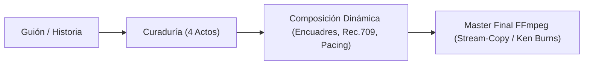
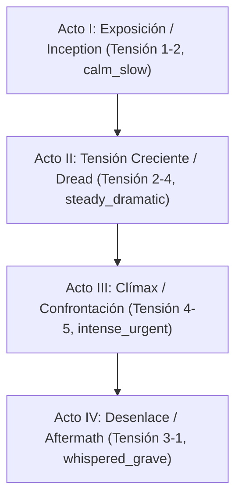
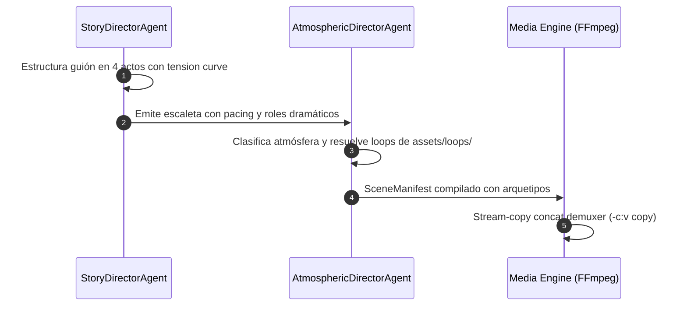

# Propuesta de Evolución del Pipeline Visual: Dirección Cinemática y Montaje Narrativo

> **Estado:** OFICIAL / ESPECIFICACIÓN ACTIVA | **Actualización:** 2026-09 | Estructura en 4 actos, montaje narrativo y control fotométrico.

## 1. Visión: Dirección Cinemática y Coherencia Narrativa

Superar la reproducción mecánica coordinando el ritmo de la narración, la iluminación ambiental y la progresión de encuadres mediante razonamiento cinematográfico temprano:

## 2. Estructura Dramática en 4 Actos y Pacing

- **Acto I (Exposición)**: Presentación de la premisa y contexto geográfico (`WIDE_ESTABLISHING`, `calm_slow`).
- **Acto II (Dread)**: Progresión del conflicto y pérdida de control (`MEDIUM_ACTION`, `tense_accelerando`).
- **Acto III (Clímax)**: Punto de máxima tensión y quiebre argumental (`CLOSEUP_TENSION`, `intense_urgent`).
- **Acto IV (Resolución)**: Consecuencias, veredicto o advertencia final (`DETAIL_REVEAL`, `whispered_grave`).

**Vocabulario de Pacing**: `calm_slow`, `steady_dramatic`, `tense_accelerando`, `intense_urgent`, `whispered_grave`.

## 3. Composición Dinámica y Reglas Fotométricas

1. **Segmentación Semántica**: Cortes coordinados con pausas naturales de oraciones TTS ($t_{\text{end}}$), nunca por segundos fijos.
2. **Encuadres Canónicos**: Alternancia de `WIDE_ESTABLISHING`, `MEDIUM_ACTION`, `CLOSEUP_TENSION` y `DETAIL_REVEAL`.
3. **Piso Fotométrico (15% - 25%)**: Sombras con texturas visibles en pantallas OLED móviles sin aplastamiento de negros; calibración Rec.709.

## 4. Colaboración de Agentes (`src/agents/`)

- **`StoryDirectorAgent` (`src/agents/story_director.py`)**: Sanitización editorial, división en 4 actos y modulación de tensión.
- **`AtmosphericDirectorAgent` (`src/agents/atmospheric_director.py`)**: Asignación de paleta Rec.709, atmósfera lumínica y selección de bucles de catálogo.
- **Media Engine (`src/media/director_assembly.py`)**: Ensamble stream-copy y muxing de subtítulos.

## 5. Delimitación de Alcance y Principios de Eficiencia (YAGNI)

- **100% Asset-Based**: Producción exclusivamente sustentada en el catálogo local (`assets/loops/`) y fotos fijas Ken Burns. Cero generación por shaders, WebGL o APIs externas lentas.
- **Límites de Rendimiento**: Gobernanza estricta de $\le 2$ Cores CPU, $\le 2.0$ GiB RAM y persistencia SQLite WAL.
