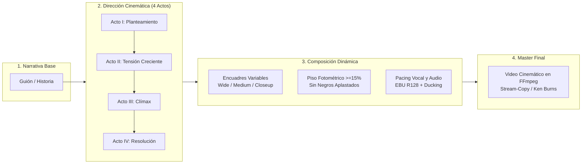
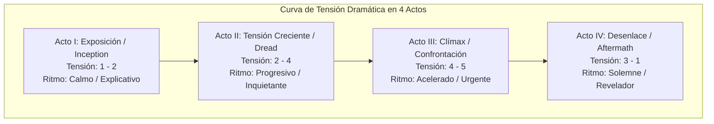
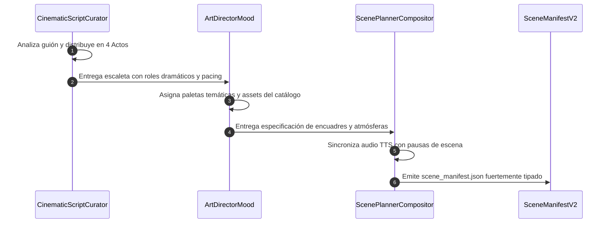

# Propuesta de Evolución del Pipeline Visual: Dirección Cinemática y Montaje Narrativo

> **ESTADO DE DISEÑO**: OFICIAL / ESPECIFICACIÓN ACTIVA  
> **Ámbito**: Dirección cinemática, estructura dramática en 4 actos, composición dinámica de escenas y control fotométrico de luminancia en canales temáticos (`horror`, `drama`, `scifi`).

---

## 1. Origen y Visión: De la Reproducción Mecánica a la Dirección Cinemática

La maduración del pipeline de `yt-auto` evidenció una necesidad técnica y artística crucial: superar la reproducción estática o puramente aritmética de fondos para dotar a las producciones de una **verdadera dirección cinemática y coherencia narrativa**.

En etapas tempranas del proyecto, la generación audiovisual corría el riesgo de caer en automatismos mecánicos:
- Desconexión temática entre el guión y el fondo visual seleccionado.
- Cortes temporales ciegos basados en reglas fijas de segundos en lugar de pausas argumentales o dramáticas.
- Aplastamiento fotométrico de sombras y negros en pantallas móviles, reduciendo la visibilidad de los detalles.

La arquitectura actual resuelve estos desafíos integrando razonamiento cinematográfico temprano dentro del ciclo de curaduría de guión (`src/curators/`), coordinando el ritmo de la narración, la iluminación ambiental y la progresión de encuadres visuales.

---

## 2. Guías Activas de Dirección Cinemática y Estructura en 4 Actos

Todo contenido producido por los canales (`horror`, `drama`, `scifi`) se estructura bajo un arco dramático en **4 Actos canónicos**. Esta segmentación asegura retención de audiencia en YouTube, coherencia emocional y una transición orgánica de la tensión argumental:

### 2.1. Definición Formal de los 4 Actos

1. **Acto I: Designación y Planteamiento Inicial (`exposition_inception`)**
   - **Nivel de Tensión:** 1 a 2 (Baja a Moderada).
   - **Función Dramática:** Presentar al protagonista, la anomalía o la premisa del conflicto sin revelar el peligro completo.
   - **Encuadres Recomendados:** Planos generales de ambientación (`WIDE_ESTABLISHING`) que fijan el contexto geográfico o institucional.
   - **Cues de Locución:** Ritmo calmo y firme (`calm_slow`, `steady_dramatic`).

2. **Acto II: Progresión del Conflicto y Dread (`rising_action_dread`)**
   - **Nivel de Tensión:** 2 a 4 (Moderada a Alta).
   - **Función Dramática:** Primeros indicios de pérdida de control, hallazgos desconcertantes, registros de incidentes o testimonios contradictorios.
   - **Encuadres Recomendados:** Planos medios y de acción (`MEDIUM_ACTION`) que muestran interacción directa con el entorno.
   - **Cues de Locución:** Incremento de cadencia y matices dramáticos (`steady_dramatic`, `tense_accelerando`).

3. **Acto III: Ruptura Crítica y Clímax (`climax_confrontation`)**
   - **Nivel de Tensión:** 4 a 5 (Punto Máximo de Tensión).
   - **Función Dramática:** Brecha de contención, confrontación directa, revelación devastadora o punto de no retorno argumental.
   - **Encuadres Recomendados:** Primeros planos dramáticos (`CLOSEUP_TENSION`) y detalles de alta carga emocional.
   - **Cues de Locución:** Locución urgente, enérgica o susurrada con alta gravedad (`intense_urgent`, `whispered_grave`).

4. **Acto IV: Consecuencias y Cierre Clasificado (`aftermath_revelation`)**
   - **Nivel de Tensión:** 3 a 1 (Descenso hacia la Resolución o Revelación Final).
   - **Función Dramática:** Evaluación de daños, veredicto ético, clausura del expediente o advertencia final inquietante al espectador.
   - **Encuadres Recomendados:** Planos de detalle o panorámicas desoladas (`DETAIL_REVEAL`, `WIDE_ESTABLISHING`).
   - **Cues de Locución:** Tono solemne y pausado (`steady_dramatic`, `whispered_grave`).

### 2.2. Vocabulario Controlado de Pacing de Audio

Para sincronizar la música ambiental, el ducking y la modulación de voz TTS, se establece el conjunto estricto de valores permitidos (`VALID_AUDIO_PACING_CUES`):
- `calm_slow`: Pausado, expositivo, introductorio.
- `steady_dramatic`: Seguro, constante, narrativo estándar.
- `tense_accelerando`: Aceleración progresiva de la tensión.
- `intense_urgent`: Rápido, apremiante, momento de clímax.
- `whispered_grave`: Tonalidad baja, confidencial o siniestra.

---

## 3. Reglas de Composición Dinámica de Escenas y Encuadre

### 3.1. Segmentación Semántica vs. Corte por Segundos

Queda terminantemente prohibido cortar escenas basándose únicamente en intervalos matemáticos rígidos (como cortes forzados cada $N$ segundos). La segmentación debe obedecer a:
1. **Unidades Semánticas de Párrafo:** Cada escena agrupa oraciones completas con sentido propio.
2. **Distribución Proporcional de Escenas:** En un video típico de 60 segundos (Short) se programan entre 3 y 5 escenas; en producciones largas (10-15 minutos) se distribuyen entre 6 y 12 escenas a lo largo de los 4 actos.
3. **Pausas Naturales de la Locución:** Los cortes visuales deben coordinarse con las marcas temporales ($t_{\text{end}}$) de oraciones completas devueltas por el sintetizador de voz.

### 3.2. Variedad de Encuadres y Tipos de Plano

Para retener la atención visual sin sobrecargar los recursos, el planificador de escenas alterna entre cuatro tipos canónicos de encuadre:
- `WIDE_ESTABLISHING`: Establece el entorno (paisaje cósmico, fachada de búnker, sala de audiencias).
- `MEDIUM_ACTION`: Enfoca el espacio inmediato de la acción o el laboratorio.
- `CLOSEUP_TENSION`: Resalta elementos focales, expresiones faciales o anomalías en primer plano.
- `DETAIL_REVEAL`: Macro-fotografía o texto legible relevante para la trama.

### 3.3. Piso Fotométrico de Visibilidad y Curva de Contraste

Para evitar que videos oscuros se perciban como pantallas apagadas en monitores con bajo brillo o dispositivos móviles con pantallas OLED bajo luz diurna:
- **Piso Mínimo de Luminancia (15% - 25%):** Los tonos más oscuros de la escena deben mantener texturas visibles, siluetas y horizontes identificables.
- **Rango Dinámico Controlado:** Los elementos luminosos (fuegos, monitores, estrellas) no deben quemar la imagen a blanco puro (255, 255, 255), preservando el detalle cromático de la temática.
- **Calibración Rec.709:** La señal de video resultante cumple con los límites estándar de emisión para evitar distorsiones en la compresión H.264 de YouTube.

---

## 4. Arquitectura de Producción: Colaboración de Agentes

El flujo de trabajo cinemático opera mediante tres roles especializados con contratos estrictos de entrada y salida:

1. **`CinematicScriptCuratorAgent` (`src/curators/`):**
   - Recibe el texto narrativo en crudo.
   - Aplica sanitización de texto (eliminando metadatos, emojis y frases cliché).
   - Divide la historia en escenas coherentes y las distribuye armónicamente en los 4 Actos según el perfil del canal.
2. **`ArtDirectorMoodAgent`:**
   - Interpreta el rol dramático de cada escena y selecciona el asset visual o bucle correspondiente del catálogo.
   - Ajusta las curvas de tensión dramática del 1 al 5 y modula la paleta cromática asociada.
3. **`ScenePlannerCompositorAgent`:**
   - Lee las marcas de tiempo exactas de la síntesis de voz (`tts_voice.wav`).
   - Sincroniza los cambios de plano con los silencios inter-oracionales.
   - Ensambla el documento final `scene_manifest.json` bajo el esquema Draft-07.

---

## 5. Delimitación de Alcance y Principios de Eficiencia (YAGNI)

Para salvaguardar la simplicidad operativa, el bajo consumo de recursos (<= 2 núcleos CPU, <= 2 GB RAM) y el determinismo del sistema:

1. **Assets Locales Pre-Renderizados:**
   Toda producción se realiza a partir de librerías locales de video (`assets/loops/`) y fotos fijas de alta resolución procesadas con Ken Burns nativo en FFmpeg. Se rechaza terminantemente depender de APIs externas de generación de imágenes en tiempo de ejecución.
2. **Cero Agentes Adicionales Innecesarios:**
   Los tres roles existentes cubren la totalidad del ciclo de montaje. No se permite la creación de nuevos agentes o capas de abstracción innecesarias.
3. **Persistencia Ligera y Concurrencia Robusta:**
   Los metadatos, estados de curaduría y telemetría de producción se almacenan exclusivamente en bases de datos SQLite en modo WAL, garantizando cero sobrecarga de red y aislamiento transaccional.
