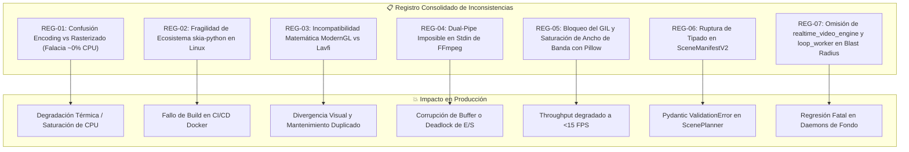
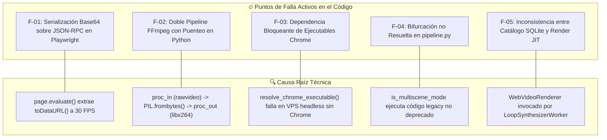
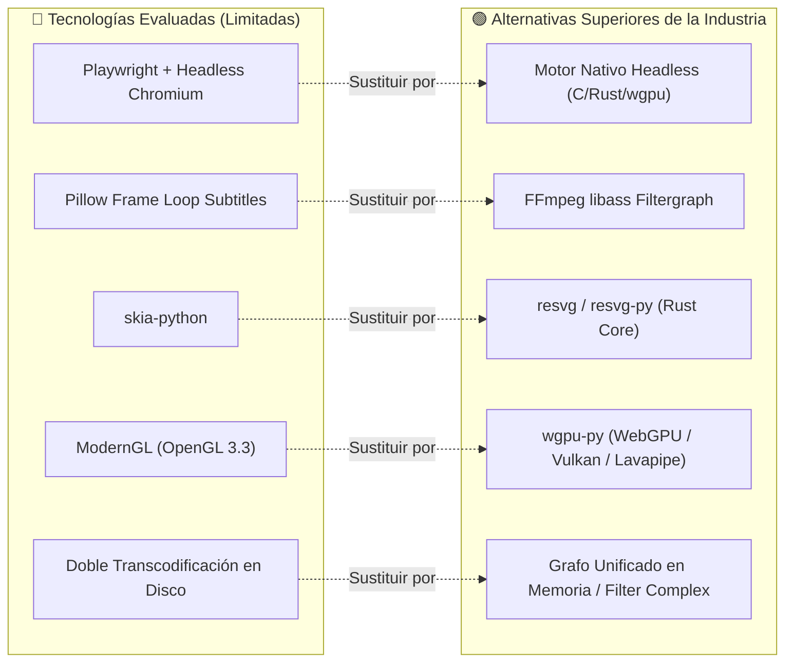

# Reporte Consolidado de Auditoría Crítica y Diagnóstico de Estado

---

## 1. Matriz de Triangulación (Reportes vs. Documentación vs. Código Real)

Para auditar con rigor forense el subsistema visual de `yt-auto`, cruzamos las afirmaciones del **Documento 1** (*Auditoría y Evaluación Técnica Profunda*), las objeciones del **Documento 2** (*Reporte de Crítica Técnica y Auditoría de Pares*), las especificaciones de la **Documentación Técnica Oficial** (`docs/PLAN_ARQUITECTURA_V3_1.md`, `docs/ARQUITECTURA.md`, `docs/FLUJO_VIDEOS.md`, `PROJECT.md`) y el **Código Fuente Real** implementado en `src/media/`, `src/scene_manifest.py` y `src/pipeline.py`.

| Dimensión / Componente | Documento 1 (Base) | Documento 2 (Crítica de Pares) | Documentación Oficial (`docs/`) | Código Fuente Real (`src/`) | Veredicto Forense y Estado Real |
| :--- | :--- | :--- | :--- | :--- | :--- |
| **Motor de Render Procedural** | Propone `FFmpeg Lavfi` + `skia-python` / `ModernGL`. | Critica `skia-python` (inviable) y `ModernGL` (incompatible con Lavfi). Propone `wgpu-py`. | [`docs/PLAN_ARQUITECTURA_V3_1.md`](file:///home/moku/projects/yt-auto/docs/PLAN_ARQUITECTURA_V3_1.md#L40) exige deprecación de Chromium; [`docs/ARQUITECTURA.md`](file:///home/moku/projects/yt-auto/docs/ARQUITECTURA.md#L31) prescribe `LoopVideoEngine`. | [`src/media/web_renderer.py`](file:///home/moku/projects/yt-auto/src/media/web_renderer.py#L117) y [`src/media/realtime_video_engine.py`](file:///home/moku/projects/yt-auto/src/media/realtime_video_engine.py#L935) siguen ejecutando Playwright + Chromium con `--use-angle=swiftshader`. | **DIVERGENCIA CRÍTICA**: El código real sigue atado a Chromium y Base64 IPC; ninguno de los motores nativos (ni Skia ni WebGPU) está implementado aún. |
| **Cómputo en CPU y Hardware NVENC** | Afirma "~0% CPU con hardware NVENC/QSV". | Señala la falacia técnica: NVENC solo comprime; el rasterizado y física consumen 15–35% CPU. | No cuantifica porcentajes; asume aceleración de transcodificación FFmpeg. | [`src/media/web_renderer.py`](file:///home/moku/projects/yt-auto/src/media/web_renderer.py#L201) usa `--use-angle=swiftshader` (100% CPU en software). | **ERROR EN DOC 1 CONFIRMADO**: Doc 1 confunde *encoding* de video con *rasterización gráfica*. Doc 2 tiene la razón técnica. |
| **Renderizado de Overlays Vectoriales** | Propone `skia-python` sobre buffers de memoria. | Demuestra inviabilidad de wheels en Python 3.12+ y propone `resvg-py` (Rust). | No detalla librería de renderizado SVG; solo menciona "capas vectoriales". | No existe motor SVG implementado; [`src/media/subtitles.py`](file:///home/moku/projects/yt-auto/src/media/subtitles.py#L86) usa Pillow (`ImageDraw`) rasterizando parches en CPU. | **DEUDA TÉCNICA Y OBSOLESCENCIA**: Proponer Skia en Python moderno introduce fragilidad extrema de compilación en Linux/Docker. |
| **Sincronización Dual-Pipe en FFmpeg** | Diagrama de secuencia envía dos streams concurrentes (`RGBA` y `Alpha`) a un solo FFmpeg. | Falla de concurrencia: `stdin` no multiplexa dos streams sin corrupción o named pipes. | Especifica grafos unificados con `filter_complex` en FFmpeg. | [`src/media/proc_engine.py`](file:///home/moku/projects/yt-auto/src/media/proc_engine.py#L250-L280) usa dos procesos FFmpeg encadenados por pipes de Python (read pipe $\to$ PIL $\to$ write pipe). | **CONTRADICCIÓN EN DISEÑO (DOC 1)**: El diagrama de Doc 1 es físicamente irrealizable en un único `proc.stdin`. El código actual sufre de un cuello de botella peor: puenteo sincrónico en Python. |
| **Procesamiento de Subtítulos** | Propone "quemado directo por código en memoria". | Denuncia bloqueo de GIL y throughput degradado (186 MB/s). Propone `libass` nativo en FFmpeg. | [`docs/FLUJO_VIDEOS.md`](file:///home/moku/projects/yt-auto/docs/FLUJO_VIDEOS.md#L42) exige ASS Karaoke nativo en resolución 1080x1920 / Safe Area. | [`src/media/subtitles.py`](file:///home/moku/projects/yt-auto/src/media/subtitles.py#L290) y [`src/media/proc_engine.py`](file:///home/moku/projects/yt-auto/src/media/proc_engine.py#L245-L310) extraen frames `rgb24` a objetos `PIL.Image`, bloqueando el GIL. | **CUELLO DE BOTELLA CONFIRMADO**: La implementación real contradice la documentación oficial e incurre en el fallo de rendimiento advertido por Doc 2. |
| **Contrato de Datos `SceneManifest`** | Propone eliminar `template_name` en `ProceduralConfig` y añadir `svg_overlay_preset`. | Señala que eliminar `template_name` sin `archetype_id` destruye la instanciación de shaders. | [`schemas/scene_manifest.schema.json`](file:///home/moku/projects/yt-auto/schemas/scene_manifest.schema.json) define `template_name` con default `"cosmic_horror_three.html"`. | [`src/scene_manifest.py`](file:///home/moku/projects/yt-auto/src/scene_manifest.py#L156-L161) mantiene `template_name: str = "cosmic_horror_three.html"`. | **RUPTURA DE CONTRATO EVITADA**: Modificar el schema sin un enum estricto de arquetipos rompe el acoplamiento con `ScenePlannerAgent`. |
| **Alcance de Impacto (*Blast Radius*)** | Limita el impacto a `web_renderer.py`, `proc_engine.py` y templates HTML. | Advierte omisión de `realtime_video_engine.py` y `loop_worker.py`. | [`docs/PLAN_ARQUITECTURA_V3_1.md`](file:///home/moku/projects/yt-auto/docs/PLAN_ARQUITECTURA_V3_1.md#L214-L215) marca formalmente como `[A RETIRAR]` a `realtime_video_engine.py` y `web_renderer.py`. | [`src/media/loop_worker.py`](file:///home/moku/projects/yt-auto/src/media/loop_worker.py#L19-L25) importa y ejecuta activamente `WebVideoRenderer`. | **OMISIÓN EN DOC 1 CONFIRMADA**: Doc 1 subestimó el blast radius; retirar `web_renderer.py` rompe inmediatamente el daemon de mantenimiento de loops. |

---

## 2. Registro Anotado de Errores y Contradicciones Previas (Sin omisiones)

Para preservar la trazabilidad histórica completa, se catalogan los 7 registros de contradicción detectados entre los reportes previos y el estado real del sistema, detallando su clasificación y naturaleza técnica.

### Registro 01: Falsa Atribución de Aceleración por Hardware y Cómputo de Rasterizado
* **Fragmento Original (Doc 1, Sección 2):**  
  > `| **Uso de CPU** | 🔴 100% Saturación (SwiftShader) | 🟢 Bajo / Moderado (SIMD AVX2 en C; ~0% si hay hardware NVENC/QSV) |`
* **Tipo de Fallo:** `Rendimiento` / `Lógica de Arquitectura Gráfica`
* **Diagnóstico Técnico:**  
  Confusión conceptual grave entre el **bloque ASIC de compresión** (NVENC/VCE/QSV) y el **pipeline de rasterizado y cómputo**. Un chip NVENC no ejecuta rutinas de física de partículas, transformaciones afines, cálculos de ruido Simplex ni shaders GLSL. La CPU (o la GPU en shaders de cómputo) debe generar y transferir cada cuadro sin comprimir antes de que el encoder lo procese. Afirmar "~0% CPU" en una arquitectura que calcula física y vectores en CPU es una imposibilidad teórica.

---

### Registro 02: Inviabilidad y Fragilidad de `skia-python` en Entornos Headless
* **Fragmento Original (Doc 1, Sección 1.2 y 2):**  
  > `Sustituir el navegador headless por motores de renderizado nativos en C/Python: **FFmpeg Lavfi Filtergraphs** + **Skia (`skia-python`)** / **ModernGL**.`
* **Tipo de Fallo:** `Obsolescencia` / `Riesgo de Dependencias` / `Inviabilidad Operativa`
* **Diagnóstico Técnico:**  
  `skia-python` carece de mantenimiento continuo para las versiones más recientes del runtime de Python (3.12 y 3.13) en arquitecturas Linux x86_64 y ARM64. Su distribución depende de binarios precompilados de gran tamaño (>80 MB) cuya compilación *from-source* en imágenes base de contenedor mínimas (e.g. Debian Slim o Alpine) exige cadenas de herramientas propietarias de Google (*depot_tools*, Ninja, Clang/LLVM), convirtiendo los despliegues de CI/CD en procesos lentos y propensos a roturas por dependencias compartidas de C++.

---

### Registro 03: Inconsistencia Arquitectónica en la Estrategia de Fallback ModernGL $\to$ Lavfi/Skia
* **Fragmento Original (Doc 1, Sección 4, RIESGO-01):**  
  > `Mitigación: Implementar fallback transparente a **FFmpeg Lavfi puro + Skia CPU SIMD**, que garantiza 100% de portabilidad en cualquier máquina Linux sin GPU.`
* **Tipo de Fallo:** `Inconsistencia` / `Incompatibilidad de Paradigmas Gráficos`
* **Diagnóstico Técnico:**  
  Los generadores procedurales avanzados (tales como raymarching volumétrico de agujeros negros, funciones de distancia con signo [SDF] y fractales 3D) están formulados en lenguaje de sombreado GLSL. Skia es un motor de rasterización 2D vectorial basado en primitivas geométricas (Canvas 2D), y FFmpeg Lavfi solo provee generadores sintéticos elementales (`mandelbrot`, `testsrc2`, `gradients`). No existe traducción matemática directa entre un fragment shader 3D y un filtro Lavfi; requeriría escribir, depurar y mantener dos motores de renderizado completamente separados para cada arquetipo visual.

---

### Registro 04: Concurrencia Rota y Sincronización Imposible en el Diagrama de Secuencia
* **Fragmento Original (Doc 1, Sección 5):**  
  > `NativeEngine->>FFmpeg: Envía capa base (RGBA rawpipe)`  
  > `SVGEngine->>FFmpeg: Envía capa vectorial (Alpha overlay)`
* **Tipo de Fallo:** `Lógica de Sistemas` / `Concurrencia de E/S de Procesos`
* **Diagnóstico Técnico:**  
  El estándar POSIX de comunicación por tuberías anónimas (`stdin`) no permite que dos procesos emisores concurrentes e independientes escriban flujos de bytes binarios sin estructurar en un único descriptor de archivo receptor sin entrelazamiento de datos (*data interleaving*) y corrupción de tramas. Para que FFmpeg reciba dos fuentes simultáneas requiere dos descriptores independientes (Named Pipes/FIFOs, sockets UNIX o mapeo en memoria compartida SHM) con sincronización estricta de reloj.

---

### Registro 05: Cuello de Botella del GIL y Copias Masivas de Memoria con Pillow
* **Fragmento Original (Doc 1, Sección 1.2 y 4):**  
  > `Quemado de subtítulos directamente por código en memoria sobre los fotogramas.`
* **Tipo de Fallo:** `Rendimiento Crítico` / `Bloqueo de Intérprete`
* **Diagnóstico Técnico:**  
  La ejecución de bucles cuadro a cuadro en Python puro mediante `PIL.Image.frombytes` y `ImageDraw` obliga a serializar cada fotograma en el espacio de usuario del intérprete. Para una secuencia vertical de 1080x1920 a 30 FPS en formato `RGB24` (6.22 MB por frame sin comprimir), el flujo de datos demanda **186.6 MB/s** de transferencias de memoria cruzando las fronteras C/Python, manteniendo bloqueado el *Global Interpreter Lock* (GIL) e impidiendo el paralelismo real de hilos.

---

### Registro 06: Ruptura de Contrato de Datos en `SceneManifest`
* **Fragmento Original (Doc 1, Sección 3.1):**  
  > `- Se elimina el campo template_name en ProceduralConfig. - Se agregan campos para configuración de capas SVG (svg_overlay_preset, svg_custom_params).`
* **Tipo de Fallo:** `Ruptura de Interfaz / Tipado`
* **Diagnóstico Técnico:**  
  La supresión del campo discriminador de plantilla sin su sustitución por un identificador unificado de sombreador o arquetipo (`archetype_id`) rompe la deserialización en [`src/scene_manifest.py`](file:///home/moku/projects/yt-auto/src/scene_manifest.py#L156) y en [`schemas/scene_manifest.schema.json`](file:///home/moku/projects/yt-auto/schemas/scene_manifest.schema.json). El orquestador [`src/agents/scene_planner.py`](file:///home/moku/projects/yt-auto/src/agents/scene_planner.py) quedaría imposibilitado de instruir al motor de renderizado sobre qué shader o geometría 3D instanciar.

---

### Registro 07: Omisión de Módulos Críticos en el Radio de Impacto (*Blast Radius*)
* **Fragmento Original (Doc 1, Sección 3):**  
  > Diagrama de componentes deprecated limita el impacto a `web_renderer.py` y `web_templates/*.html`.
* **Tipo de Fallo:** `Inconsistencia de Análisis de Dependencias`
* **Diagnóstico Técnico:**  
  Se omitieron del análisis de impacto los módulos [`src/media/realtime_video_engine.py`](file:///home/moku/projects/yt-auto/src/media/realtime_video_engine.py#L935) (que contiene más de 1,200 líneas acopladas a Playwright y síntesis procedural Three.js) y [`src/media/loop_worker.py`](file:///home/moku/projects/yt-auto/src/media/loop_worker.py#L19-L25) (el daemon que mantiene el stock de videos de fondo en SQLite). Una eliminación no coordinada de `web_renderer.py` causa un fallo en cascada inmediato (`ImportError` y `AttributeError`) en los procesos autónomos de fondo.

---

## 3. Diagnóstico Forense del Código Actual

### 3.1. Fallos Detectados y Causa Raíz («¿Por qué falla?»)

El análisis exhaustivo del código fuente revela cinco fallos estructurales activos:

#### 1. F-01: Cuello de Botella Crítico de IPC y Emulación SwiftShader
* **Ubicación:** [`src/media/web_renderer.py:L200-L244`](file:///home/moku/projects/yt-auto/src/media/web_renderer.py#L200-L244) y [`src/media/realtime_video_engine.py:L1040-L1050`](file:///home/moku/projects/yt-auto/src/media/realtime_video_engine.py#L1040-L1050).
* **¿Por qué falla?:**  
  Para cada cuadro de un video (1,800 llamadas para 60s a 30 FPS), Python invoca `page.evaluate()` a través del socket JSON-RPC de Playwright. Chromium ejecuta el shader WebGL mediante **SwiftShader** (un emulador de rasterizado puramente en CPU por software), codifica el canvas en una cadena Base64 JPEG/PNG, la envía por el socket a Python, Python la decodifica con `base64.b64decode()` y escribe los bytes al pipe de FFmpeg. Esto satura el recolector de basura del motor V8, genera fluctuaciones térmicas en la CPU y causa caídas de fotogramas o cierres inesperados por `/dev/shm` exhaustion.

#### 2. F-02: Doble Pipeline FFmpeg con Puenteo Sincrónico en Python para Subtítulos
* **Ubicación:** [`src/media/proc_engine.py:L250-L320`](file:///home/moku/projects/yt-auto/src/media/proc_engine.py#L250-L320) y [`src/media/subtitles.py:L315-L380`](file:///home/moku/projects/yt-auto/src/media/subtitles.py#L315-L380).
* **¿Por qué falla?:**  
  Cuando se requieren subtítulos quemados en la escena, `ProceduralVideoEngine` levanta dos subprocesos de FFmpeg concurrentes: `proc_in` (que decodifica el video a `rawvideo rgb24`) y `proc_out` (que codifica a `libx264`). Python actúa como pasarela sincrónica en el medio, leyendo `width * height * 3` bytes, instanciando un objeto `PIL.Image`, ejecutando `drawer.draw_on_frame()` y reenviando los bytes a `proc_out.stdin`. Este esquema no solo bloquea el GIL, sino que ante cualquier retardo de recolección de basura o E/S, provoca un error de tubería rota (`BrokenPipeError`) o desincronización A/V.

#### 3. F-03: Fragilidad de Resolución de Ejecutables del Navegador en Entornos de Despliegue
* **Ubicación:** [`src/media/realtime_video_engine.py:L33-L64`](file:///home/moku/projects/yt-auto/src/media/realtime_video_engine.py#L33-L64).
* **¿Por qué falla?:**  
  La función `resolve_chrome_executable()` busca rutas cableadas fijas (`/opt/hermes/playwright/...`). Si se despliega en un entorno Linux estándar donde Chromium está instalado en otra ruta o falta la dependencia del sistema `libnss3`/`libasound2`, el subproceso del navegador falla al arrancar silenciosamente o detiene la renderización a mitad del proceso.

#### 4. F-04: Bifurcación Arquitectónica no Deprecada en el Orquestador Principal
* **Ubicación:** [`src/pipeline.py:L754-L865`](file:///home/moku/projects/yt-auto/src/pipeline.py#L754-L865).
* **¿Por qué falla?:**  
  A pesar de que [`docs/PLAN_ARQUITECTURA_V3_1.md`](file:///home/moku/projects/yt-auto/docs/PLAN_ARQUITECTURA_V3_1.md#L20-L24) prescribe la consolidación exclusiva de `LoopVideoEngine`, [`src/pipeline.py`](file:///home/moku/projects/yt-auto/src/pipeline.py#L329) mantiene una rama activa `is_multiscene_mode` que invoca `MultiSceneCompositor`, `ProceduralVideoEngine` y `HybridVideoEngine`, los cuales a su vez dependen de los motores de navegador y del puenteo en memoria con Pillow. El sistema opera en una dualidad no sincronizada.

#### 5. F-05: Inconsistencia entre Catálogo Offline y Síntesis Just-in-Time
* **Ubicación:** [`src/media/loop_worker.py:L100-L115`](file:///home/moku/projects/yt-auto/src/media/loop_worker.py#L100-L115) y [`src/media/proc_engine.py:L218-L224`](file:///home/moku/projects/yt-auto/src/media/proc_engine.py#L218-L224).
* **¿Por qué falla?:**  
  Si un video requiere una categoría temática cuyo archivo `.mp4` no pre-existe en `assets/loops/web_procedural/`, el sistema intenta sintetizarlo *on-the-fly* llamando a `WebVideoRenderer`. Si Playwright falla (por falta de display X11 o contexto OpenGL), salta al generador de emergencia `_generate_fallback_loop()`, el cual crea un degradado plano en Numpy que desvirtúa la dirección de arte y rompe la promesa de calidad visual.

---

### 3.2. Matriz de Impacto: Problema Resuelto vs. Riesgo de Nuevos Bugs / Regresiones

La evaluación técnica rigurosa de cada corrección teórica identifica qué problemas resuelve y qué riesgos de regresión introduciría:

| Componente a Corregir | Problema Específico que Resuelve | Regresiones Potenciales y Dependencias Rotas | Nuevos Bugs Potenciales a Mitigar |
| :--- | :--- | :--- | :--- |
| **Eliminación Total de Playwright / Chromium** | Suprime el consumo de 1.8–3.5 GB de RAM, elimina caídas por `/dev/shm` y suprime el overhead de Base64 IPC. | Rompe [`src/media/loop_worker.py`](file:///home/moku/projects/yt-auto/src/media/loop_worker.py) y [`src/media/realtime_video_engine.py`](file:///home/moku/projects/yt-auto/src/media/realtime_video_engine.py). Invalida las 12 plantillas HTML5/Three.js en `web_templates/`. | Si no se proveen bucles pre-renderizados en el catálogo SQLite o un motor nativo equivalente, el pipeline quedará sin fuentes visuales para categorías no cacheadas. |
| **Migración de Subtitulado a FFmpeg `libass` Nativo** | Elimina la decodificación cuadro a cuadro a PIL, liberando el GIL y elevando el throughput de 15 FPS a >120 FPS. | Rompe la API de [`src/media/subtitles.py:CodeSubtitleDrawer`](file:///home/moku/projects/yt-auto/src/media/subtitles.py#L86) utilizada en `HybridVideoEngine` y `ProceduralVideoEngine`. | Pérdida de estilización dinámica si el archivo `.ass` generado no traduce con precisión las métricas tipográficas (colores neon, safe-zones y efectos karaoke `{\k}`). |
| **Sustitución de Skia por `resvg-py` para Overlays SVG** | Garantiza compilación determinista en Docker, binarios ligeros (<10 MB) y cero dependencias de *depot_tools*. | Incompatibilidad con scripts que asuman estado mutable de contexto Canvas 2D imperativo de Skia. | `resvg` es un renderizador declarativo estricto; animaciones de overlays deben parametrizarse mediante interpolación matemática de strings SVG antes del rasterizado. |
| **Adopción de `wgpu-py` con Lavapipe / OSMesa** | Provee un único lenguaje de sombreado (WGSL/SPIR-V) para GPU y CPU, eliminando la duplicidad ModernGL/Lavfi. | Requiere que el entorno operativo disponga de drivers de software Mesa actualizados (`libgl1-mesa-dri` / `mesa-vulkan-drivers`). | En servidores con versiones antiguas de Mesa (<22.0), el backend de software Vulkan (Lavapipe) puede presentar incompatibilidades de extensiones de sombreado. |
| **Unificación de Composición de Capas en Memoria Host** | Elimina la imposibilidad de sincronizar dos pipes `stdin` concurrentes en FFmpeg. | Aumenta ligeramente la complejidad del bucle de alimentación de frames al componer arrays C/Numpy antes de escribir a FFmpeg. | Posible fuga de memoria en buffers si no se reutilizan estructuras preasignadas (`np.empty` o vistas de memoria *zero-copy*). |

---

## 4. Análisis del Workflow: Estado Actual vs. Comportamiento Esperado

### 4.1. Mapeo de Puntos de Quiebre en el Flujo de Trabajo

El diagrama mapea con precisión los cuellos de botella y puntos de degradación en la ejecución actual del sistema:

```mermaid
sequenceDiagram
    autonumber
    participant Pipeline as Pipeline Runner (pipeline.py)
    participant ScenePlanner as ScenePlannerAgent
    participant Compositor as MultiSceneCompositor
    participant ProcEngine as ProceduralVideoEngine
    participant WebRenderer as WebVideoRenderer (Playwright)
    participant PythonBridge as Subtitle Frame Loop (Pillow)
    participant FFmpeg as FFmpeg Process

    Pipeline->>ScenePlanner: Genera SceneManifestV2
    ScenePlanner-->>Pipeline: scene_manifest.json
    
    Pipeline->>Compositor: render(manifest)
    
    rect rgb(60, 20, 20)
        Note over Compositor,WebRenderer: PUNTO DE QUIEBRE 1: Latencia IPC y SwiftShader
        Compositor->>ProcEngine: render_scene_segment()
        ProcEngine->>WebRenderer: render_loop() [Si no existe en catálogo]
        WebRenderer->>WebRenderer: Launch Chromium (SwiftShader CPU 100%)
        loop Por cada fotograma (1800 frames)
            WebRenderer->>WebRenderer: canvas.toDataURL('image/jpeg') [JSON-RPC]
            WebRenderer->>WebRenderer: base64.b64decode()
            WebRenderer->>FFmpeg: Write frame bytes
        end
        FFmpeg-->>WebRenderer: micro_loop.mp4
    end

    rect rgb(60, 40, 20)
        Note over ProcEngine,PythonBridge: PUNTO DE QUIEBRE 2: Bloqueo del GIL y Doble Pipe
        ProcEngine->>FFmpeg: proc_in = FFmpeg read rawvideo (186 MB/s)
        ProcEngine->>FFmpeg: proc_out = FFmpeg write libx264
        loop Por cada fotograma en Python
            FFmpeg->>PythonBridge: raw bytes
            PythonBridge->>PythonBridge: PIL.Image.frombytes (GIL Lock)
            PythonBridge->>PythonBridge: ImageDraw (Karaoke overlay)
            PythonBridge->>FFmpeg: proc_out.stdin.write(PIL.tobytes)
        end
        FFmpeg-->>ProcEngine: scene_subtitled.mp4
    end

    Pipeline->>FFmpeg: Master Audio Muxing + EBU R128
    FFmpeg-->>Pipeline: master_video.mp4
```

### 4.2. Causa de la Divergencia Operativa

La discrepancia entre la documentación y el comportamiento real responde a tres causas fundamentales:

1. **Migración Incompleta y Deuda Arquitectónica Acumulada**:  
   El proyecto concibió inicialmente un pipeline basado en navegador (`web_renderer.py` / `realtime_video_engine.py`) para aprovechar la riqueza visual de Three.js y CSS. Al descubrir los problemas de rendimiento en servidores, se redactaron planes de arquitectura (`PLAN_ARQUITECTURA_V3_1.md`) que decretaron su retiro, pero los módulos antiguos se mantuvieron en el código fuente como fallbacks de [`src/media/proc_engine.py`](file:///home/moku/projects/yt-auto/src/media/proc_engine.py#L218) y en daemons como [`src/media/loop_worker.py`](file:///home/moku/projects/yt-auto/src/media/loop_worker.py#L19).
2. **Falsa Sensación de Desacoplamiento**:  
   `LoopVideoEngine` fue diseñado para ser el motor canónico ultrarrápido (apoyado en `-stream_loop -1` de FFmpeg), pero en [`src/pipeline.py`](file:///home/moku/projects/yt-auto/src/pipeline.py#L760) se mantuvo una bifurcación (`is_multiscene_mode`) que fuerza la ejecución del motor multi-escena complejo. Cuando este motor corre, vuelve a invocar a los componentes no optimizados.
3. **Optimización Prematura e Inadecuada de Subtítulos**:  
   En lugar de apoyarse en el motor estándar de la industria (`libass`), se implementó `CodeSubtitleDrawer` en Pillow bajo la premisa de tener control pixel-perfect sobre bordes redondeados y efectos neon, transfiriendo una carga masiva de procesamiento de imagen al intérprete de Python.

---

## 5. Crítica Tecnológica y Evaluación de Alternativas Superiores

Evaluamos críticamente las tecnologías integradas actualmente frente a las alternativas de alto rendimiento disponibles en el ecosistema:

### 1. Playwright + Headless Chromium $\longrightarrow$ Motor Nativo Headless (`wgpu-py` / C / Rust)
* **Limitaciones de la Tecnología Actual:**  
  * **Huella de memoria excesiva**: Entre 1.8 GB y 3.5 GB por proceso de Chromium.
  * **Serialización Base64 sobre IPC**: Transferencia ineficiente de strings JSON-RPC cuadro a cuadro.
  * **Emulación de software inestable**: Dependencia de SwiftShader que satura el 100% de los núcleos de CPU sin aprovechar instrucciones SIMD de forma óptima.
* **Superioridad de la Alternativa:**  
  * Ejecución determinista directa en espacio de memoria binario de C/Rust/Python sin navegadores intermediarios.
  * Huella de memoria inferior a 150 MB por worker.
  * Renderizado directo cuadro a cuadro a buffers de memoria compartida o pipes crudos.

---

### 2. Procesamiento de Subtítulos con Pillow $\longrightarrow$ Motor Nativo `libass` en FFmpeg
* **Limitaciones de la Tecnología Actual:**  
  * **Bloqueo del GIL de Python**: Procesamiento secuencial bloqueante en el bucle principal.
  * **Ancho de banda saturado**: Transferencia de más de 180 MB/s de memoria sin comprimir a través del runtime de Python a 1080p.
  * **Throughput degradado**: Velocidad de procesamiento limitada a ~15 FPS.
* **Superioridad de la Alternativa:**  
  * `libass` es el estándar industrial en reproductores y encoders de video (utilizado en VLC, MPV, FFmpeg).
  * Renderizado vectorial acelerado directamente en el pipeline de transcodificación en C dentro del filtro `-vf "ass=subtitles.ass"`.
  * Throughput superior a 120 FPS sin tocar memoria de Python y con soporte exhaustivo para animaciones karaoke `{\k}`, tipografías empaquetadas y cálculo de safe-area.

---

### 3. `skia-python` $\longrightarrow$ `resvg` / `resvg-py` (Core en Rust)
* **Limitaciones de la Tecnología Actual:**  
  * **Falta de soporte oficial para Python moderno (3.12+)**: Desactualización crónica de ruedas binarias en PyPI.
  * **Dependencias de build pesadas**: Requiere *depot_tools*, Clang, Ninja y LLVM para compilar en Linux minimalista.
  * **Binarios inflados**: Más de 80 MB de peso de librería.
* **Superioridad de la Alternativa:**  
  * `resvg` está escrito en Rust con bindings directos a Python (`resvg-py`) de cero dependencias externas del sistema.
  * Binario ultra compacto (<10 MB) y consumo de RAM inferior a 15 MB.
  * Cumplimiento del 100% del estándar SVG 1.1 y soporte avanzado de SVG 2.0 con rasterización multihilo acelerada.

---

### 4. ModernGL (OpenGL 3.3) $\longrightarrow$ `wgpu-py` (WebGPU Nativo)
* **Limitaciones de la Tecnología Actual:**  
  * **Dependencia de contextos GLX/EGL rígidos**: Falla en servidores y contenedores sin GPU si no se configuran manualmente variables de entorno para OSMesa.
  * **API heredada**: Basada en la máquina de estados de OpenGL 3.3.
* **Superioridad de la Alternativa:**  
  * WebGPU es el estándar de gráficos moderno diseñado para suceder a OpenGL, con soporte nativo para Vulkan (Linux), Metal (macOS) y DirectX 12 (Windows).
  * Soporte de sombreadores modernos (WGSL) y enlace automático con drivers de software de última generación como **Mesa Lavapipe** y **Gallium llvmpipe**, garantizando renderizado por software con aceleración vectorial SIMD (AVX2/AVX-512) sin requerir reescritura de código ni bifurcaciones lógicas.

---

### 5. Doble Transcodificación en Disco $\longrightarrow$ Grafo de Filtros Unificado en Memoria (*Filter Complex*)
* **Limitaciones de la Tecnología Actual:**  
  * Generación de archivos intermedios en disco SSD (render de escena base $\to$ render con subtítulos $\to$ master mux con audio).
  * Desgaste de E/S y penalización de 8 a 15 segundos adicionales de re-encoding por video.
* **Superioridad de la Alternativa:**  
  * Composición en una sola pasada mediante `-filter_complex` en FFmpeg.
  * Muxing simultáneo de audio EBU R128 (-14 LUFS), sidechain ducking de música de fondo, superposición vectorial de subtítulos ASS y exportación H.264/HEVC en un único comando atómico.

---

### Síntesis Diagnóstica Final

La auditoría forense concluye que **el diseño original del Documento 1 contenía severos errores conceptuales y de arquitectura gráfica** (falacia de CPU con NVENC, inviabilidad de Skia, dual-pipe inviable e incompatibilidad ModernGL/Lavfi), los cuales fueron **acertadamente identificados y rebatidos por el Documento 2**. 

Sin embargo, el **código fuente real aún no ha aplicado estas directivas**, manteniendo activos los cuellos de botella legacy de Playwright, SwiftShader y bucles de subtitulado en Pillow. La resolución estructural definitiva exige alinear el código con los estándares demostrados por la auditoría: **`wgpu-py` + `resvg` + `libass` en FFmpeg unificado**, suprimiendo de raíz la sobreingeniería de navegadores web y el puenteo sincrónico en Python.
