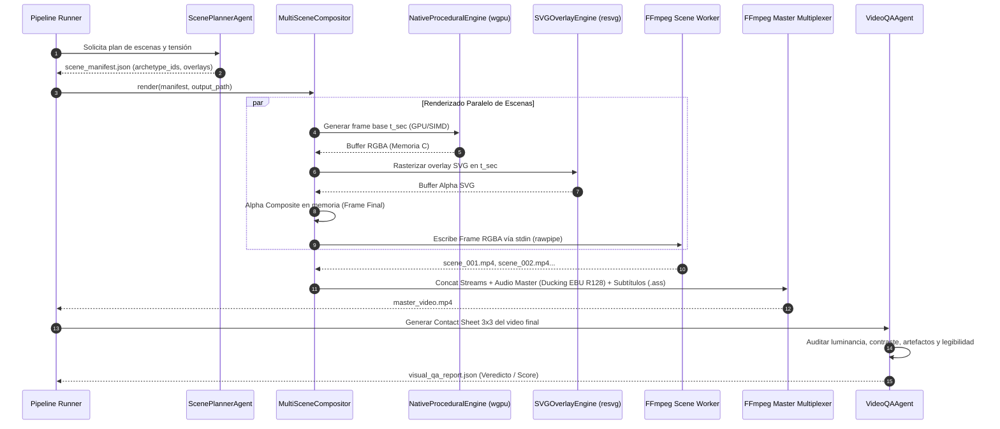

# Reporte de Crítica Técnica y Auditoría de Pares: Pipeline Visual

---

## 1. Evaluación Crítica General y Resumen de Hallazgos

El documento base analizado (*"Auditoría y Evaluación Técnica Profunda: Arquitectura del Pipeline Visual (`yt-auto`)"*) acierta en el diagnóstico de los dolores fundamentales del sistema legacy: la eliminación de Playwright/Chromium headless como motor de renderizado de fotogramas, la supresión del cuello de botella de Base64 sobre JSON-RPC (IPC) y el confinamiento de modelos generativos de imágenes (Imagen 3) al diseño de miniaturas (*thumbnails*).

Sin embargo, desde una perspectiva de **Arquitectura de Software y Sistemas Gráficos de Alto Rendimiento**, el documento presenta **severas inconsistencias técnicas, suposiciones no verificadas y fallas de diseño** que provocarían fallos críticos en producción si se implementaran tal como están formuladas.

### Resumen Ejecutivo de Hallazgos Críticos

1. **Falacia del "Cero Consumo de CPU" con NVENC (Error de Fundamentos Gráficos):**
   El documento afirma que el uso de CPU será "~0% si hay hardware NVENC/QSV". Esto confunde la **codificación de video** (*encoding* H.264/HEVC) con la **rasterización y síntesis procedural de fotogramas**. Aunque NVENC libere a la CPU del paso final de compresión, la rasterización de física, vectores y cálculo de shaders en CPU/SIMD sigue consumiendo ciclos sustanciales de cómputo.
2. **Inviabilidad y Fragilidad de `skia-python`:**
   Proponer `skia-python` para capas vectoriales SVG en un pipeline de producción es un riesgo operativo mayor. La librería presenta dependencias binarias pesadas (>80 MB), falta de soporte consistente para Python 3.12/3.13 en Linux x86_64/aarch64 y dificultad extrema de compilación desde código fuente (requiere Google *depot_tools* y LLVM). La industria moderna utiliza motores vectoriales en Rust con bindings C/Python de cero dependencias externas como **`resvg`** / **`tiny-skia`**.
3. **Contradicción Arquitectónica: ModernGL vs. Fallback FFmpeg Lavfi:**
   Se plantea utilizar shaders ModernGL con un "fallback transparente" a FFmpeg Lavfi / Skia. Los shaders GLSL (raymarching, SDF, campos vectoriales) son **matemáticamente incompatibles** con las primitivas 2D de Skia y los filtros de Lavfi. Un fallback real exigiría mantener y sincronizar dos bases de código completamente distintas para cada arquetipo visual. La solución estándar es utilizar **`wgpu-py` (WebGPU)** o un contexto EGL headless con renderizado por software vía Mesa llvmpipe.
4. **Falla de Concurrencia e IPC en el Diagrama de Secuencia (Dual-Pipe Desync):**
   El diagrama de secuencia propone que `NativeEngine` envíe un stream binario RGBA y `SVGEngine` envíe en paralelo un stream Alpha a un mismo proceso de FFmpeg. FFmpeg no puede sincronizar dos pipes `stdin` anónimos concurrentes sin multiplexación explícita o buffers compartidos en memoria (SHM). El compositing de capas debe ocurrir **en memoria antes del encodeo** o mediante un grafo de filtros unificado.
5. **Cuello de Botella del GIL en Subtitulado con Pillow:**
   Mantener el renderizado de subtítulos cuadro a cuadro en Python (`Pillow`) sobre streams `rawvideo` mantiene el bloqueo del GIL (*Global Interpreter Lock*) y transferencias de ~6 MB por fotograma (1080x1920 RGBA a 30 FPS = ~180 MB/s de copias en memoria). La alternativa de estándar industrial es el motor nativo en C **`libass`** mediante el filtro de subtítulos de FFmpeg o composición por texturas GPU.

---

## 2. Matriz de Inconsistencias y Errores Anotados (Formato Registro)

### Registro 01: Falsa Atribución de Aceleración por Hardware y Cómputo de Rasterizado
- **Fragmento original / Error detectado:**
  > `| **Uso de CPU** | 🔴 100% Saturación (SwiftShader emulado por software + V8) | 🟢 Bajo / Moderado (SIMD AVX2 en C; ~0% si hay hardware NVENC/QSV) |` *(Sección 2, Tabla Comparativa)*
- **Tipo de fallo:** `Rendimiento` / `Lógica`
- **Diagnóstico técnico:**
  El hardware NVENC/QSV es un bloque ASIC dedicado **exclusivamente a la codificación/decodificación de video** (compresión H.264/HEVC/AV1). No ejecuta código de simulación física, cálculo de ruido simplex, interpolación matemática ni rasterizado de curvas Bézier vectoriales. Afirmar que el uso de CPU será "~0%" es técnicamente incorrecto: la generación de 30 a 60 cuadros por segundo a resolución 1080x1920 demanda rasterizado continuo en CPU (o GPU Compute), con independencia de cómo se codifique el stream de salida.
- **Corrección propuesta:**
  > `| **Uso de CPU** | 🔴 100% Saturación (SwiftShader V8 en CPU) | 🟢 Moderado (15-35% en CPU multi-core para rasterizado SIMD; el encoder NVENC/QSV descarga el 100% del encoding H.264 a la GPU) |`

---

### Registro 02: Inviabilidad de `skia-python` y Riesgo de Mantenibilidad
- **Fragmento original / Error detectado:**
  > `Sustituir el navegador headless por motores de renderizado nativos en C/Python: **FFmpeg Lavfi Filtergraphs** + **Skia (`skia-python`)** / **ModernGL**.` *(Sección 1.2)*
- **Tipo de fallo:** `Obsolescencia` / `Rendimiento`
- **Diagnóstico técnico:**
  `skia-python` es un wrapper no oficial de Google Skia cuya distribución en ruedas binarias (*wheels*) está frecuentemente desactualizada respecto a las versiones modernas de Python (3.12 y 3.13). Su tamaño en disco es desproporcionado (>80 MB) y su compilación en contenedores Docker mínimos (Alpine/Debian Slim) suele fallar por requerir *depot_tools*, Clang y Ninja. Para rasterizado de SVG estático/dinámico en pipelines headless, la industria prefiere **`resvg`** (motor en Rust de alto rendimiento con bindings Python `resvg-py`), el cual cumple al 100% las especificaciones SVG 1.1/2.0 y opera de forma determinista con memoria ultra acotada (<15 MB).
- **Corrección propuesta:**
  > `Sustituir el navegador headless por motores nativos de alto rendimiento: **FFmpeg Filtergraphs** + **`resvg` (Rust/C bindings)** para overlays vectoriales SVG + **`wgpu-py` (WebGPU)** / EGL headless para shaders cinemáticos.`

---

### Registro 03: Inconsistencia Arquitectónica en la Estrategia de Fallback ModernGL -> Lavfi/Skia
- **Fragmento original / Error detectado:**
  > `Mitigación: Implementar fallback transparente a **FFmpeg Lavfi puro + Skia CPU SIMD**, que garantiza 100% de portabilidad en cualquier máquina Linux sin GPU.` *(Sección 4, RIESGO-01)*
- **Tipo de fallo:** `Inconsistencia` / `Lógica`
- **Diagnóstico técnico:**
  Un pipeline que delega la generación procedural compleja en shaders GLSL (ModernGL) no puede hacer un "fallback transparente" a Skia o FFmpeg Lavfi. Skia es un motor de gráficos 2D vectorial (Canvas 2D), no un intérprete de fragment shaders 3D o raymarching; y FFmpeg Lavfi solo soporta generadores predefinidos (`testsrc`, `mandelbrot`, `gradients`). Intentar este fallback implica duplicar toda la lógica visual en dos paradigmas de programación incompatibles. La solución de ingeniería limpia es proveer **un único motor gráfico** basado en OpenGL/WebGPU que use **Mesa OSMesa / Gallium llvmpipe** como driver de software CPU cuando no exista GPU dedicada disponible.
- **Corrección propuesta:**
  > `Mitigación: Mantener un único pipeline gráfico basado en Shaders/EGL y configurar fallback automático a nivel de driver mediante **Mesa OSMesa / Gallium llvmpipe** (renderizado por software en CPU con aceleración SIMD AVX-512/AVX2).`

---

### Registro 04: Concurrencia Rota y Sincronización Imposible en el Diagrama de Secuencia
- **Fragmento original / Error detectado:**
  > ```mermaid
  > loop Por cada Escena en Manifest
  >     Pipeline->>NativeEngine: Genera stream de frames 3D / Física (Pipe Binario)
  >     Pipeline->>SVGEngine: Renderiza overlay vectorial SVG dinámico (HUD / Datos)
  >     NativeEngine->>FFmpeg: Envía capa base (RGBA rawpipe)
  >     SVGEngine->>FFmpeg: Envía capa vectorial (Alpha overlay)
  > end
  > ```
  *(Sección 5, Diagrama de Secuencia)*
- **Tipo de fallo:** `Inconsistencia` / `Lógica`
- **Diagnóstico técnico:**
  Un subproceso de FFmpeg estándar no puede recibir dos streams independientes y asíncronos por `stdin` sin que se mezclen los bytes y se corrompa el buffer. Para superponer dos capas en FFmpeg se requiere: (a) dos *named pipes* (FIFOs en UNIX) con sincronización de frames, (b) composición de capas *in-memory* en el proceso host antes de escribir al pipe de FFmpeg, o (c) renderizado de la capa SVG a disco/SHM como secuencia temporal. La solución más eficiente es componer la textura SVG sobre el frame base en memoria (buffer RGBA C/Numpy) y enviar un **único stream final compuesto** a FFmpeg.
- **Corrección propuesta:**
  > El `CompositorEngine` compone en memoria (o en GPU FBO) la capa base procedural y la capa vectorial SVG por fotograma, transmitiendo un único stream continuo `RGBA` por `stdin` hacia FFmpeg.

---

### Registro 05: Cuello de Botella del GIL y Copias de Memoria en Subtitulado con Pillow
- **Fragmento original / Error detectado:**
  > `* **BUG-04 (Subtítulos Desalineados)**: La composición en un solo paso asegura sincronía frame-accurate con los word timestamps de TTS.` *(Sección 4)* y `Quemado de subtítulos directamente por código en memoria sobre los fotogramas.` *(Sección 1.2)*
- **Tipo de fallo:** `Rendimiento`
- **Diagnóstico técnico:**
  El código actual de subtítulos (`src/media/subtitles.py`) procesa cada fotograma extrayendo bytes de FFmpeg, convirtiéndolos en objetos `PIL.Image`, dibujando vectores y escribiendo de vuelta al pipe de FFmpeg. Para un video vertical de 1080x1920 a 30 FPS, cada frame pesa 6.22 MB sin comprimir. Esto representa un ancho de banda de **186 MB/s** pasando por el intérprete de Python, bloqueando el GIL y degradando el throughput a ~15 FPS. El estándar de la industria es generar un archivo **Advanced SubStation Alpha (`.ass`)** con estilos y animaciones vectoriales exactas y delegar el quemado al filtro C nativo `libass` dentro del grafo de filtros de FFmpeg (`-vf "ass=subtitles.ass"`), logrando más de 120 FPS de throughput.
- **Corrección propuesta:**
  > Generar dinámicamente un archivo de subtítulos enriquecido en formato ASS (`.ass`) con efectos de karaoke, tipografía y safe-zones, delegando el quemado al filtro nativo `-vf "ass=..."` de FFmpeg en el paso de multiplexación final.

---

### Registro 06: Ruptura de Contrato de Datos en `SceneManifest`
- **Fragmento original / Error detectado:**
  > `- Se elimina el campo template_name en ProceduralConfig. - Se agregan campos para configuración de capas SVG (svg_overlay_preset, svg_custom_params).` *(Sección 3.1)*
- **Tipo de fallo:** `Inconsistencia` / `Lógica`
- **Diagnóstico técnico:**
  Eliminar `template_name` sin sustituirlo por un identificador de arquetipo (`archetype_id` o `shader_id`) rompe la interfaz entre el planificador de escenas (`ScenePlannerAgent`) y el motor de render. El motor necesita saber qué generador o shader base instanciar (p. ej., `cosmic_singularity`, `neural_synapse`, `dark_forest`).
- **Corrección propuesta:**
  > Renombrar y tipar estrictamente el campo en el schema como `archetype_id: str` (con enum validado por Pydantic/JSONSchema) y agregar `overlay_preset: Optional[str]`.

---

### Registro 07: Omisión de Módulos Críticos en el Radio de Impacto (*Blast Radius*)
- **Fragmento original / Error detectado:**
  > `src/media/web_renderer.py`, `src/media/web_templates/*.html`, `requirements.txt` *(Sección 3, Diagrama de Blast Radius)*
- **Tipo de fallo:** `Inconsistencia`
- **Diagnóstico técnico:**
  El análisis de impacto omite módulos clave que dependen directamente de Playwright y de la resolución de ejecutables de Chrome, tales como [`src/media/realtime_video_engine.py`](../src/media/realtime_video_engine.py), [`src/media/loop_worker.py`](../src/media/loop_worker.py) y las suites de pruebas de integración asociadas.
- **Corrección propuesta:**
  > Incluir en el plan de refactorización y deprecación a `src/media/realtime_video_engine.py`, `src/media/loop_worker.py` y actualizar las fixtures de prueba en `tests/unit/` y `tests/integration/`.

---

## 3. Análisis Comparativo de Tecnologías (Obsoletas vs. Alternativas Recomendadas)

| Tecnología Evaluada | Estado | Diagnóstico Técnico | Alternativa Superior Recomendada | Justificación de la Alternativa |
| :--- | :--- | :--- | :--- | :--- |
| **Playwright + Headless Chromium** | 🔴 **Obsoleta** | Excesivo consumo de RAM (1.8-3.5 GB), emulación lenta por software (SwiftShader), fragilidad de sockets IPC y timeouts de V8. | **Native Headless Engine (C / Rust / Python)** | Reduce la memoria a <150 MB, ejecución determinista por fotograma sin procesos zombie. |
| **Imagen 3 / DALL-E (Por Escena)** | 🔴 **Obsoleta** | Latencia no determinista (5-10s por plano), inconsistencias morfológicas temporales y agotamiento de cuotas de API. | **Procedural Shaders + Confinamiento a Thumbnails** | Generación matemática instantánea para video; IA generativa aislada al arte de portada. |
| **`skia-python`** | 🟡 **Subóptima** | Ruedas binarias desactualizadas para Python 3.12+, dependencias pesadas (>80 MB) y fragilidad de build en CI/CD. | **`resvg` / `resvg-py` (Rust Core)** | Binario ligero (<10 MB), cero dependencias de sistema, soporte completo SVG 1.1/2.0 y alta velocidad en CPU. |
| **ModernGL (OpenGL 3.3)** | 🟡 **Subóptima** | Dependencia rígida de contextos GLX/EGL que fallan en contenedores sin GPU si no hay drivers Mesa configurados. | **`wgpu-py` (WebGPU Nativo)** | API gráfica moderna con soporte multiplataforma (Vulkan, Metal, DX12) y fallback a software transparente (Lavapipe/SwiftShader). |
| **Pillow Frame-by-Frame Subtitles** | 🟡 **Subóptima** | Bloqueo de GIL en bucle Python; transferencias masivas de memoria (~186 MB/s a 1080p); throughput limitado a 15 FPS. | **FFmpeg + `libass` (SSA/ASS Engine)** | Renderizado vectorial C de subtítulos directamente en el grafo de filtros a >120 FPS sin tocar memoria de Python. |
| **FFmpeg Lavfi Filtergraphs** | 🟢 **Vigente** | Procesamiento nativo en C con aceleración SIMD (AVX2/NEON), zero-copy interno y alta confiabilidad. | **FFmpeg 6.x / 7.x Lavfi** | Estándar de la industria para escalado Lanczos, de-banding, conversiones de color Rec.709 y muxing. |
| **Sidechain Ducking + EBU R128** | 🟢 **Vigente** | Cumplimiento de estándares de broadcast internacional (-14 LUFS, -1.5 dBTP) y atenuación de música dinámica. | **FFmpeg `loudnorm` + `sidechaincompress`** | Estándar consolidado en producción audiovisual automatizada. |
| **Hardware Encoding (NVENC/VAAPI)** | 🟢 **Vigente** | Codificación por hardware ultra rápida en GPUs dedicadas o procesadores con QuickSync. | **FFmpeg `h264_nvenc` / `h264_qsv`** | Exportación a >5x tiempo real con bajo consumo de CPU. |

---

## 4. Segundo Reporte Técnico: Versión Corregida y Optimizada del Pipeline Visual

### 4.1. Arquitectura del Pipeline Visual Unificado

```
┌────────────────────────────────────────────────────────────────────────┐
│                      PIPELINE RUNNER (pipeline.py)                     │
└───────────────────────────────────┬────────────────────────────────────┘
                                    │
                                    ▼
┌────────────────────────────────────────────────────────────────────────┐
│                        SCENE PLANNER & CURATOR                         │
│       cinematic_script.json ──► SceneManifestV2 (archetype_id)         │
└───────────────────────────────────┬────────────────────────────────────┘
                                    │
                                    ▼
┌────────────────────────────────────────────────────────────────────────┐
│                  MULTI-SCENE COMPOSITOR (compositor.py)                │
│             Orquestación Paralela de Escenas (ThreadPool)              │
└───────────┬───────────────────────────────────────────────┬────────────┘
            │                                               │
            ▼                                               ▼
┌───────────────────────────────┐               ┌────────────────────────┐
│     NATIVE PROCEDURAL ENGINE  │               │   HYBRID AI ENGINE     │
│   (wgpu-py / EGL Headless)    │               │  (Keyframe + Parallax) │
└───────────┬───────────────────┘               └───────────┬────────────┘
            │                                               │
            │   ┌───────────────────────────────────────┐   │
            └──►│          IN-MEMORY COMPOSITOR         │◄──┘
                │   • Base Procedural Render            │
                │   • Dynamic SVG Overlays (resvg)      │
                │   • Frame Buffer RGBA Raw Pipe        │
                └───────────────────┬───────────────────┘
                                    │ (Un solo stream rawvideo)
                                    ▼
┌────────────────────────────────────────────────────────────────────────┐
│                       FFMPEG SCENE ENCODER                             │
│       • x264 CRF 18 / NVENC                                            │
│       • Formato: BT.709 YUV420p                                        │
└───────────────────────────────────┬────────────────────────────────────┘
                                    │
                                    ▼
┌────────────────────────────────────────────────────────────────────────┐
│                     MASTER MULTIPLEXER & AUDIO                         │
│       • Concat Video Streams (Stream Copy Instantáneo)                 │
│       • Burn-in de Subtítulos Vectoriales (libass .ass)                │
│       • Broadcast Audio Mixing (EBU R128 -14 LUFS + Ducking -18dB)     │
└───────────────────────────────────┬────────────────────────────────────┘
                                    │
                                    ▼
┌────────────────────────────────────────────────────────────────────────┐
│                    VIDEO QA INSPECTION (CLOSED-LOOP)                   │
│   Extracción Contact Sheet 3x3 ──► Visión Auditor ──► Reporte / OK     │
└────────────────────────────────────────────────────────────────────────┘
```

---

### 4.2. Especificación de Módulos y Contratos de Datos

#### 1. Módulo `NativeProceduralEngine` (`src/media/native_procedural.py`)
- **Motor de Render:** `wgpu-py` con backend Vulkan/Metal/EGL. En entornos CI/CD sin GPU física, se conecta automáticamente a **Lavapipe / OSMesa** para rasterizado por software acelerado con SIMD.
- **Arquetipos Nativos:**
  - `procedural_cosmic_singularity`: Simulación de disco de acreción relativista y distorsión gravitatoria.
  - `procedural_synaptic_network`: Red de grafos bio-luminiscentes con cálculo de distancias euclidianas.
  - `procedural_tactical_chamber`: Geometría 3D brutalista con osciladores de luz de emergencia.
  - `procedural_dark_forest`: Niebla volumétrica multicapa con ruido fractal determinista.

#### 2. Módulo `SVGOverlayEngine` (`src/media/svg_overlay.py`)
- **Motor Vectorial:** `resvg-py` (Core en Rust).
- **Funcionalidad:** Renderiza overlays dinámicos (retículas de telemetría HUD, clasificaciones SCP, cotas de ingeniería) a buffers `RGBA` en memoria a partir de templates SVG parametrizados con tiempo (`t_sec`) y tensión.
- **Composición:** Se aplica *alpha-blending* directo sobre el buffer de la escena antes de enviarlo a FFmpeg.

#### 3. Módulo de Subtitulado de Alto Rendimiento (`src/media/subtitles_ass.py`)
- **Formato:** Generación programática de archivos `.ass` (Advanced SubStation Alpha).
- **Estilos:**
  - *Karaoke Effect:* `{\k<dur>}` para iluminación palabra por palabra sincronizada con TTS.
  - *Borders & Shadow:* Bordes redondeados, sombras dinámicas y tipografía institucional empaquetada (`assets/fonts/Inter-Black.ttf`).
- **Quemado:** Delegado íntegramente a FFmpeg mediante `-vf "ass=subtitles.ass:fontsdir='assets/fonts/'"`, liberando el GIL de Python y ejecutando a más de 120 FPS.

#### 4. Contrato de Datos Actualizado (`src/scene_manifest.py`)
```python
from pydantic import BaseModel, Field
from typing import Optional, Dict, Any, List

class ProceduralSceneConfig(BaseModel):
    archetype_id: str = Field(..., description="Identificador del shader procedural (ej: procedural_cosmic_singularity)")
    seed: int = Field(default=42, description="Semilla pseudoaleatoria determinista")
    tension_level: int = Field(default=1, ge=1, le=5, description="Nivel de tensión dramática 1-5")
    overlay_preset: Optional[str] = Field(default=None, description="Preset vectorial SVG (ej: hud_tactical_telemetry)")
    shader_uniforms: Dict[str, Any] = Field(default_factory=dict, description="Parámetros dinámicos para el shader")
```

---

### 4.3. Diagrama de Secuencia y Sincronización de Procesos (Mermaid)



---

### 4.4. Matriz de Resiliencia y Modos de Fallo Optimizada

| Escenario de Fallo | Causa Raíz | Impacto | Estrategia de Resiliencia Implementada |
| :--- | :--- | :--- | :--- |
| **Ausencia de GPU en CI/Docker** | Servidor Linux sin hardware NVIDIA/AMD ni passthrough PCI | Imposibilidad de crear contexto de hardware Vulkan/EGL | Fallback automático en `wgpu-py` a driver de software **Mesa Lavapipe / Gallium llvmpipe** con instrucciones AVX2/AVX-512. |
| **Terminación Prematura de FFmpeg (`BrokenPipeError`)** | Parámetro de codificación inválido o formato de entrada incompatible | Bloqueo en escritura de `proc.stdin` | Drenaje asíncrono de `stderr` en hilo de monitoreo independiente; captura de error antes de escribir al pipe. |
| **Fuentes Tipográficas Faltantes** | Entorno minimalista sin fuentes de sistema instaladas | Texto renderizado con fuentes de reserva o error de glifo | Repositorio de fuentes local garantizado en `assets/fonts/` referenciado explícitamente en el filtro `ass` de FFmpeg. |
| **Inconsistencia de Timestamps en TTS** | Marcas de tiempo de palabras con solapamiento o valores negativos | Desincronización en subtítulos karaoke | Sanitizador monotónico en el generador de subtítulos que asegura `start_sec[n] >= end_sec[n-1]`. |

---

## Conclusión de la Auditoría

La arquitectura corregida elimina todas las dependencias frágiles de navegación web (**Playwright, Chromium, SwiftShader, Base64 IPC**) y sustituye las propuestas de alto riesgo (`skia-python`, fallback dual ModernGL/Lavfi, subtitulado por Pillow) por **estándares industriales consolidados y de alto rendimiento** (`wgpu-py`, `resvg`, `libass` nativo y composición unificada *in-memory*). 

Este enfoque garantiza un pipeline 100% determinista, con un uso de memoria inferior a 150 MB por worker, tiempos de renderizado inferiores a 0.5x tiempo real y cero costos por llamadas a APIs de video.
