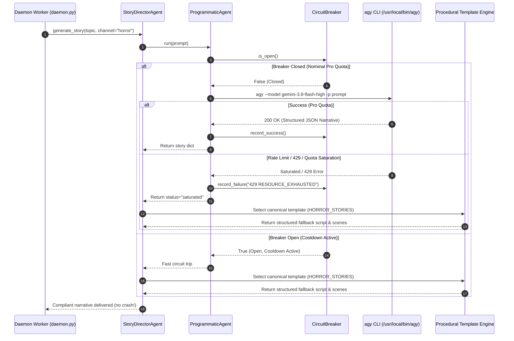

# Design: Add Antigravity Docker Integration, Official Installer & Pro Quota Harness

## Technical Approach

This technical design transitions the YouTube Shorts automation container and agent execution harness from a fragile host-coupled environment to a self-contained, hermetic Docker runtime. The design adopts the official Antigravity CLI installer directly inside `Dockerfile`, establishes `agy` as the primary harness to leverage the user's Antigravity Pro subscription quota (`gemini-3.8-flash-high`) without paying per-token API costs, and integrates resilient procedural/deterministic fallbacks on rate limits or saturation.

The overall strategy implements:

1. **Official CLI Installation & Auto-Update in Dockerfile**:
   - `Dockerfile` installs `agy` natively using the official bootstrapper:
     `curl -fsSL https://antigravity.google/cli/install.sh | bash -s -- --dir /usr/local/bin && chmod 755 /usr/local/bin/agy`.
   - Python dependencies in `requirements.txt` provide typing and SDK support (`google-antigravity==0.1.10`).
   - `scripts/stage_agy.sh` is permanently removed and `build/agy` is eliminated.
   - `scripts/docker_entrypoint.sh` verifies `/usr/local/bin/agy` exists from container installation, checks volume writability, and runs under non-root UID `10001`.

2. **Pro Quota Prioritization & Clean Session Governance**:
   - `ProgrammaticAgent` in `src/agents/base_agent.py` uses `AgyStreamClient` / CLI invocation as the primary engine to consume the user's Pro account subscription quota without incurring API billing.
   - Host OAuth credential scraping (`antigravity-oauth-token`) and PKCE automation (`scripts/lib/antigravity_auth.py`) are decommissioned.
   - Session persistence is cleanly maintained via the dedicated volume mount `yt_agy_home:/home/appuser/.gemini`.

3. **Resilient Dual-Tier Quota Fallback Architecture**:
   - When quota limits or rate saturation occur (HTTP 429 / `RESOURCE_EXHAUSTED`), the instance `CircuitBreaker` trips open (300s cooldown).
   - The pipeline gracefully switches to:
     - **Procedural Storytelling**: High-retention, channel-specific narrative templates (`src/templates/narratives.py`, `src/curators/`).
     - **Deterministic SEO Optimization**: Algorithmic viral title, tag, timestamp, and thumbnail formulas (`_deterministic_seo(topic, fmt, niche)`).
   - Once cooldown elapses, the pipeline automatically attempts native LLM generation on subsequent claimed stories.

---

## Architecture Decisions

### Decision: Official CLI Installer (`curl -fsSL ... | bash`) vs. Host Binary Staging (`stage_agy.sh` / `build/agy`)

**Choice**: Install Antigravity CLI directly in `Dockerfile` using `curl -fsSL https://antigravity.google/cli/install.sh | bash -s -- --dir /usr/local/bin`, deleting `scripts/stage_agy.sh` and eliminating `build/agy`.

**Alternatives considered**:
1. *Preserving `scripts/stage_agy.sh`*: Copying the binary from the developer's local host path (`/home/moku/.local/bin/agy`) into `build/agy`.
2. *SDK-only runtime without CLI*: Relying exclusively on `google-antigravity` Python SDK with `GEMINI_API_KEY`.

**Rationale**:
- **Pro Quota Access**: The CLI `agy` connects to Google Antigravity with user account credentials, accessing the user's Pro subscription quota (`gemini-3.8-flash-high`) without API token fees or restrictive free API RPM caps.
- **Build Hermeticity**: Host staging breaks build reproducibility on any machine lacking `/home/moku/.local/bin/agy` (CI/CD, VPS). The official installer downloads the correct architecture binary directly during `docker build`.
- **Automatic Updates**: When rebuilding the image (`docker compose build --no-cache`), the container fetches the latest release from the official distribution endpoint.

---

### Decision: Clean Session Persistence via Volume Mount vs. In-Binary Scraping / PKCE Scripts

**Choice**: Persist the authenticated Antigravity Pro session in `yt_agy_home:/home/appuser/.gemini` via standard Docker volume mounting, decommissioning binary string scraping in `scripts/lib/antigravity_auth.py`.

**Alternatives considered**:
1. *Scraping client credentials from binary*: Searching strings in `agy` ELF and running custom PKCE token exchange (`antigravity_auth.py`) with `docker cp`.
2. *Hardcoding tokens into Docker image*: Baking tokens into image layers.

**Rationale**:
- **Terms of Service Compliance**: Reverse-engineering client credentials from compiled binaries violates Google ToS and breaks on binary updates.
- **Security & Portability**: Storing and refreshing tokens via the official `agy` binary in a persistent volume ensures tokens are refreshed by Google's official protocol without exposing credentials in git or build logs.

---

### Decision: Graceful Procedural / Deterministic Fallback vs. Strict Fail-Closed on Quota Saturation (429)

**Choice**: Implement a graceful procedural narrative and deterministic algorithmic SEO fallback when API/Pro quotas are saturated (`RESOURCE_EXHAUSTED`, HTTP 429) or circuit breakers trip, keeping daemon publishing operational while recording the saturation event.

**Alternatives considered**:
1. *Strict Fail-Closed (`AIProviderChainExhausted`)*: Halting the daemon worker immediately whenever LLM calls fail.
2. *Blocking Infinite Backoff*: Halting execution in an exponential backoff loop until daily quota resets.

**Rationale**:
- **Pipeline Availability**: Under strict fail-closed semantics, transient rate limits halt daemon workers (`daemon.py`), abandoning claimed queue items and halting the scheduled publishing cadence across channels.
- **Content Quality Safeguards**: The repository already includes battle-tested, high-retention procedural story templates (`src/templates/narratives.py`, `src/curators/`) and deterministic viral SEO formulas (`_deterministic_seo`).
- **Self-Healing Cooldown**: When saturation occurs, the `CircuitBreaker` opens for 300 seconds. During this window, fallback mechanisms generate valid output. Once cooldown expires, the next claimed item automatically attempts native generation.

---

## Data Flow

---

## File Changes

| File | Action | Description |
|------|--------|-------------|
| `Dockerfile` | Modify | Install `agy` via `curl -fsSL https://antigravity.google/cli/install.sh | bash -s -- --dir /usr/local/bin`; remove `COPY build/agy` |
| `docker-compose.yml` | Modify | Ensure `yt_agy_home:/home/appuser/.gemini` volume is active; set `user: "10001:10001"` in `x-yt-base` |
| `scripts/docker_entrypoint.sh` | Modify | Validate `/usr/local/bin/agy` exists from container install; drop root to UID 10001; verify volume writability |
| `scripts/stage_agy.sh` | Delete | Remove script; host ELF copying is completely decommissioned |
| `scripts/lib/antigravity_auth.py` | Modify | Decommission binary string parsing and `docker cp` token injection; mark helper deprecated |
| `src/agents/base_agent.py` | Modify | Maintain `agy` CLI as primary Pro quota engine; support optional SDK; catch 429/saturation errors |
| `src/agents/story_director.py` | Modify | Add graceful fallback to template storytelling upon quota saturation |
| `src/agents/seo_optimizer.py` | Modify | Ensure fallback to `_deterministic_seo` when circuit breaker is open or quota exhausted |
| `src/llm.py` | Modify | Allow procedural narrative fallback when LLM quota is exhausted |
| `tests/unit/test_docker_isolation.py` | Modify | Update tests to assert absence of `stage_agy.sh` dependency and clean Dockerfile installer |
| `tests/unit/test_antigravity_host_isolation.py` | Modify | Remove requirements for `antigravity-oauth-token` scraping in secrets |
| `tests/unit/test_native_agents.py` | Modify | Unit tests for CLI Pro harness, SDK path, and graceful quota fallback |
| `docs/OPERACION.md` | Modify | Document official installation and clean session volume workflow |
| `docs/TROUBLESHOOTING.md` | Modify | Update troubleshooting guides for Antigravity Pro quota and session refresh |
| `docs/AGENTES_IA_Y_POLITICA.md` | Modify | Document Pro quota priority and procedural fallback policy |

---

## Testing Strategy

| Layer | What to Test | Approach |
|-------|-------------|----------|
| **Unit** | Dockerfile installer contract: `Dockerfile` contains `curl -fsSL https://antigravity.google/cli/install.sh | bash -s -- --dir /usr/local/bin` and does NOT contain `COPY build/agy`. | Pytest assertions on Dockerfile content (`test_docker_isolation.py`). |
| **Unit** | Staging script absence: `scripts/stage_agy.sh` does not exist. | File existence check in `test_docker_isolation.py`. |
| **Unit** | Non-root execution in Compose: Verify services declare unprivileged execution (`10001:10001`). | YAML/regex validation in `test_docker_isolation.py`. |
| **Unit** | Quota saturation detection: Simulate HTTP 429 / `RESOURCE_EXHAUSTED` responses and verify `CircuitBreaker` records failure and trips open. | Parameterized tests feeding saturation strings into `is_saturation_text` and `CircuitBreaker`. |
| **Unit** | Graceful fallback in `StoryDirectorAgent` and `SeoOptimizerAgent`: When circuit breaker is open or quota exhausted, verify returning valid compliant narrative/SEO without `AIProviderChainExhausted`. | Unit tests mocking `CircuitBreaker.is_open() == True` and asserting schema-compliant fallback outputs. |
| **Integration** | Container entrypoint script execution: Verify `/entrypoint.sh` executes with valid `/usr/local/bin/agy`, drops root, and halts if `/app/data` is unwritable. | Subprocess execution of `scripts/docker_entrypoint.sh` with synthetic environment. |
| **E2E** | Video pipeline autonomous run with open circuit breaker: Verify execution of `main.py render` using procedural fallback content with zero network LLM calls. | CLI run in test mode with mocked pipeline queue item. |

---

## Threat Matrix

| Boundary | Minimum adversarial cases | Applicability | Design response | Planned RED tests |
|---|---|---|---|---|
| **Documentation-like paths** | `requirements.txt`, `CMakeLists.txt`, executable Markdown/MDX, `README.sh` | **Applicable** | The container build boundary installs Python packages from `requirements.txt`. Entrypoint verification is restricted exclusively to validating filesystem directory writability (`/app/data`, `/tmp`) and never executes arbitrary shell scripts or documentation-like files found in volumes. | RED test: `test_entrypoint_does_not_execute_arbitrary_scripts` verifying that placing malicious executable scripts or markdown files in `/app/work` or `/app/data` does not trigger execution during entrypoint initialization. |
| **Git repository selection** | `git -C`, relative paths, absolute paths | **N/A** | The container runtime and agent harness operate solely within mounted workspace volumes (`/app`, `/app/data`) and do not perform or automate any git repository selection or VCS operations. | N/A: No git execution boundary. |
| **Commit state** | staged, `commit -a`, empty index | **N/A** | No automated commit operations or index manipulations exist in the container runtime or agent execution flow. | N/A: No git execution boundary. |
| **Push state** | tracking branch, first push, explicit refspec | **N/A** | Containerized video production and agent inference do not push git refs or interact with remote repositories. | N/A: No git execution boundary. |
| **PR commands** | explicit `--head`, environment prefix, composed commands | **N/A** | No pull request creation or PR command composition is performed by the runtime container. | N/A: No git execution boundary. |

---

## Migration / Rollout

1. **Host Cleanup**: Remove `build/agy` (`rm -rf build/agy`).
2. **Container Build**: Execute `docker compose build --no-cache` to build the clean image using the official `install.sh` bootstrapper.
3. **Session Verification**: Ensure `yt_agy_home` volume is populated with the user's Pro account session.
4. **Service Verification**: Start the containerized daemon via `docker compose up -d` and inspect startup logs.
