# Technical Design: Native Automated Link Collection, Comment Level Tracking, Empirical Scoring, and Intelligent AI Story Packaging

## 1. System Overview

This technical design details the implementation for:
1. Native automated collection of 100% of YouTube video links per channel.
2. Direct tracking and categorization of comment metrics and comment levels (`none`, `low`, `moderate`, `viral`).
3. View-weighted empirical scoring updating `publications.actual_success_score`.
4. Pinned comment dispatch with fail-safe error handling and failure state marking (`comment_status = 'failed'`, `comment_error`).
5. Eradication of rigid title-to-description template strings in favor of 100% AI-generated bespoke metadata.

```mermaid
flowchart TD
    subgraph Pipeline ["Pipeline Stages"]
        S11[Stage 11: AI Metadata Optimizer] -->|Story Context & Script| AG[SeoOptimizerAgent]
        AG -->|Intelligent Title, Description, Pinned Comment| S11
        S11 --> S13[Stage 13: Publish & Backup]
        S13 --> YTU[upload_video]
        YTU --> YTC[post_pinned_comment]
        YTC -->|Success / Failure| REC[Record in publications: comment_status, comment_error]
    end

    subgraph DaemonSweep ["Autonomous 24h Sweep"]
        DS[Daemon 24h Sweep] --> LC[Link Collector: collect_channel_links]
        LC --> YTAPI[YouTube Data API v3: playlistItems.list]
        YTAPI --> INV[Upsert publications & stories]
        INV --> SC[Empirical Scoring & Comment Level]
        SC --> UPD[Update actual_success_score, comment_count, views, likes]
    end
```

## 2. SQLite Data Model Changes (Migration 008)

Migration `008` in `src/core/repository/migrations.py` adds:
- `comment_count INTEGER NOT NULL DEFAULT 0`
- `view_count INTEGER NOT NULL DEFAULT 0`
- `like_count INTEGER NOT NULL DEFAULT 0`
- `comment_status TEXT DEFAULT 'none' CHECK(comment_status IN ('none', 'pending', 'posted', 'failed', 'disabled'))`
- `comment_error TEXT`
- `pinned_comment TEXT`
- Indices:
  - `idx_publications_comment_status ON publications(comment_status)`
  - `idx_publications_comment_count ON publications(channel, comment_count)`
  - `idx_publications_views ON publications(channel, view_count)`

## 3. Subsystem Breakdown

### 3.1 Link Collector Engine (`src/analytics/link_collector.py`)
- `collect_channel_links(channel: str, max_items: int = 0, db_path: str = DEFAULT_DB_PATH) -> dict[str, Any]`
  - Paginates through channel uploads using `playlistItems().list(part="snippet,contentDetails")`.
  - Derives `url`, short URL (`https://youtu.be/<id>`), and shorts URL (`https://www.youtube.com/shorts/<id>`).
  - Calls `videos().list(part="statistics")` in batches of 50 to acquire view, like, and comment counts.
  - Computes `actual_success_score` and `comment_level`.
  - Atomically upserts into `publications` and `stories`.

### 3.2 Pinned Comment Dispatcher (`src/youtube/comments.py`)
- `post_pinned_comment(token_path: str, video_id: str, comment_text: str) -> dict[str, Any]`
  - Builds authenticated YouTube service.
  - Calls `youtube.commentThreads().insert(part="snippet", body={"snippet": {"videoId": video_id, "topLevelComment": {"snippet": {"textOriginal": comment_text}}}})`
  - If successful: returns `{"status": "posted", "comment_id": cid}`.
  - If exception occurs (e.g. `commentsDisabled`, quota, permission): intercepts, logs warning, and returns `{"status": "failed", "error": str(exc)}`.
- In `stage_13_publish.py`:
  - After upload succeeds, checks `ctx.pinned_comment` or metadata artifact.
  - Calls `post_pinned_comment(...)`.
  - Updates `publications` row with `comment_status`, `comment_error`, and `pinned_comment`.

### 3.3 Comment Level & View-Based Scoring (`src/analytics/scoring.py`)
- `classify_comment_level(comments: int, views: int) -> str`:
  - Returns `"none" | "low" | "moderate" | "viral"`.
- `calculate_empirical_score(views, likes, comments, retention_rate_pct, age_hours)`:
  - Enhanced normalized formula scaling view performance logarithmically ($40\%$), engagement ($35\%$), retention ($25\%$).

### 3.4 AI-Native Story Packaging (`src/agents/seo_optimizer.py` & `stage_11_metadata.py`)
- `SeoOptimizerAgent.optimize()` signature:
  `optimize(topic: str, target_format: str = "short", niche: str = "General", script_text: str = "", synopsis: str = "", channel_tone: str = "", use_agent: bool = True, fail_closed: bool = False)`
- In `stage_11_metadata.py`:
  - Remove `ctx.branding.generate_description(...)` and `ctx.branding.generate_title(...)` template calls.
  - Invoke `SeoOptimizerAgent.optimize()` with full `ctx.script` and `extract_hook_and_synopsis(ctx.title, ctx.script)`.
  - Assign:
    - `ctx.youtube_title = seo_res["selected_title"]`
    - `ctx.youtube_description = seo_res["description"]`
    - `ctx.pinned_comment = seo_res.get("pinned_comment")`
    - `ctx.branding.tags = seo_res.get("tags")`
  - Write metadata JSON containing `pinned_comment`.

### 3.5 Daemon & CLI Integration
- `src/cli/handlers/analytics.py`:
  - Add subparser `collect-links --channel <channel> [--all] [--limit <n>]`.
- `src/daemon.py`:
  - In `_run_24h_maintenance_sweep`, invoke link collection and comment scoring prior to pruning.

## 4. Governance & Resource Compliance
- **Zero-Browser Policy**: Pure HTTP REST queries via `googleapiclient.discovery` for comment and link endpoints.
- **Resource Constraints**: Concurrency bounded, streaming API calls, peak RSS $\le 2.0\text{ GiB}$.
- **SRP & Line Budgets**: All new/modified functions bounded to $\sim 100$ lines.
