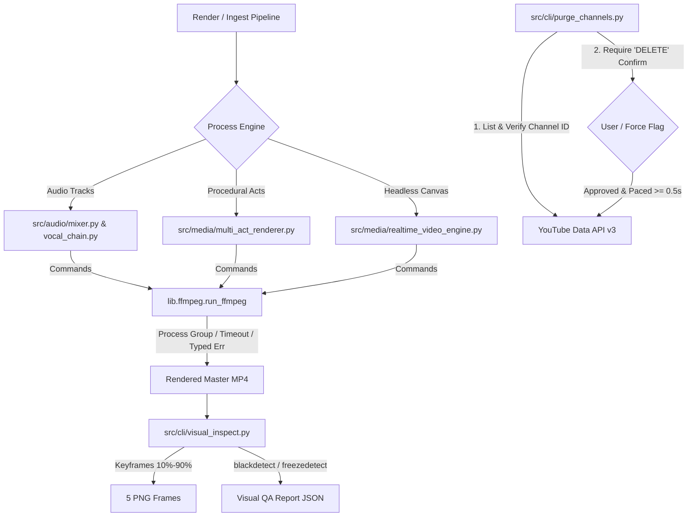

# Technical Design: Audiovisual Pipeline Hardening & Channel Purge

## Technical Approach
Hardens the media generation pipeline by replacing raw unmanaged `subprocess` calls with `lib.ffmpeg.run_ffmpeg`, enforcing vertical safe zones for subtitles ($MarginV \ge 480\text{px}$), implementing interactive channel catalog cleanup with quota protection, creating a 5-point keyframe and artifact QA harness, and eliminating dead shims and mock clutter.

## Architecture Decisions

| Area | Options Considered | Tradeoffs | Decision & Rationale |
| :--- | :--- | :--- | :--- |
| **FFmpeg Execution** | (A) Raw `subprocess.run`/`Popen`<br>(B) Centralized `lib.ffmpeg.run_ffmpeg` | Option B routes all child processes into isolated process groups (`start_new_session=True`) with structured timeouts and typed exceptions. | **Option B**: Prevents orphaned zombie processes and unhandled pipeline crashes across all audio/video engines. |
| **Subtitle Safe Zone** | (A) Hardcoded $MarginV=240$<br>(B) Dynamic $MarginV \ge 480\text{px}$ for 9:16 | Option B adapts vertical offset to $25\%$ canvas height for portrait while scaling to $12\%$ ($\ge 130\text{px}$) for landscape. | **Option B**: Eliminates subtitle truncation behind YouTube Shorts bottom UI controls. |
| **Channel Purge Safety** | (A) Direct unprompted deletion<br>(B) Default dry-run + token prompt + pacing | Option B requires affirmative `"DELETE"` token, verifies channel ownership in `config.py`, and enforces $\ge 0.5\text{s}$ request delays. | **Option B**: Guarantees zero cross-channel accidental deletions and prevents API quota exhaustion (HTTP 429). |
| **Visual QA Inspection** | (A) Manual inspection<br>(B) 5-point keyframe + FFmpeg filters | Option B extracts deterministic keyframes (10%, 30%, 50%, 70%, 90%) and executes `blackdetect`/`freezedetect`. | **Option B**: Fully automated CI/post-render quality gating with structured JSON telemetry. |

## Data Flow



## File Changes

| File Path | Action | Description |
| :--- | :--- | :--- |
| `src/cli/purge_channels.py` | New | Channel video catalog audit, dry-run listing, paced deletion CLI. |
| `src/cli/visual_inspect.py` | New | Automated 5-point keyframe extraction, `blackdetect`, `freezedetect` harness. |
| `tests/helpers/audio.py` | New | Zero-dependency synthetic PCM audio generator for offline tests. |
| `tests/unit/test_subtitle_safe_zone.py` | New | Unit tests verifying ASS $MarginV \ge 480\text{px}$ and cue chunking. |
| `tests/unit/test_purge_channels.py` | New | Unit tests for dry-run, confirmation, ownership, and quota handling. |
| `tests/unit/test_visual_inspect.py` | New | Unit tests for keyframe extraction and artifact detection filters. |
| `src/compositing/subtitles.py` | Modify | Update $MarginV \ge 480\text{px}$ for 1080x1920 and proportional landscape. |
| `src/audio/mixer.py` | Modify | Replace raw `subprocess` with `lib.ffmpeg.run_ffmpeg` and typed errors. |
| `src/audio/vocal_chain.py` | Modify | Route FFmpeg filtergraph execution through `lib.ffmpeg.run_ffmpeg`. |
| `src/media/multi_act_renderer.py` | Modify | Route multi-act compositing through `lib.ffmpeg.run_ffmpeg`. |
| `src/media/realtime_video_engine.py` | Modify | Standardize pipe streaming and error recovery with `lib.ffmpeg`. |
| `src/audio/__init__.py` | Modify | Remove `generate_synthetic_pcm_audio` from public package export. |
| `src/audio.py` | Delete | Remove obsolete re-export shim. |
| `src/video.py` | Delete | Remove obsolete re-export shim. |
| `src/tts.py` | Delete | Remove obsolete re-export shim. |
| `src/subtitles.py` | Delete | Remove obsolete re-export shim. |
| `src/youtube_control.py` | Delete | Remove obsolete re-export shim. |
| `<MagicMock ...>` (26 root files) | Delete | Remove leftover mock files from repository root. |

## Interfaces & Contracts

```python
# src/cli/purge_channels.py
@dataclass
class PurgeItemResult:
    video_id: str
    title: str
    status: str  # 'deleted' | 'skipped' | 'failed' | 'dry_run'
    error: Optional[str] = None

@dataclass
class PurgeReport:
    channel: str
    total_found: int
    deleted_count: int
    skipped_count: int
    failed_count: int
    items: List[PurgeItemResult]

def purge_channel_videos(
    channel: str,
    dry_run: bool = True,
    force: bool = False,
    delay_sec: float = 0.5,
) -> PurgeReport: ...

# src/cli/visual_inspect.py
@dataclass
class VisualQAResult:
    video_path: str
    duration_sec: float
    resolution: Tuple[int, int]
    keyframe_paths: List[str]
    black_intervals: List[Dict[str, float]]
    freeze_intervals: List[Dict[str, float]]
    overall_pass: bool

def inspect_video_media(video_path: Path, output_dir: Path) -> VisualQAResult: ...
```

## Testing Strategy
- **Unit (`tests/unit/`)**: Test ASS styling header margins ($MarginV \ge 480$), purge CLI confirmation tokens and quota error branching, visual inspect parser regex for FFmpeg filters, and `run_ffmpeg` process timeouts.
- **Integration (`tests/integration/`)**: Execute end-to-end audio mixing and multi-act rendering using synthetic PCM audio and loop placeholders, validating generated MP4 container atoms via `lib.ffmpeg.probe_media`.
- **E2E (`tests/e2e/`)**: Execute visual QA harness on synthetic renders verifying keyframe count and zero black/freeze detection violations.

## Threat Matrix

| Threat / Risk | Likelihood | Impact | Mitigation |
| :--- | :--- | :--- | :--- |
| **Command Injection via FFmpeg CLI** | Low | High | Never invoke `shell=True`; pass all arguments as structured string arrays. |
| **Process Hang / Zombie Leak** | Medium | Medium | Wrap child processes in process groups with `start_new_session=True` and terminate via `SIGKILL` on timeout. |
| **Accidental Deletion of Wrong Channel** | Low | Critical | Strict validation comparing video snippet `channelId` to `ChannelSettings.expected_youtube_channel_id` before deletion. |
| **YouTube API Quota Burn (HTTP 429)** | Medium | Low | Paced deletions ($\ge 0.5\text{s}$) with circuit-breaker abort on rate-limit response. |

## Migration & Rollout
1. Relocate synthetic test helpers to `tests/helpers/audio.py` and purge root MagicMock files.
2. Update `src/compositing/subtitles.py` safe-zone calculations.
3. Migrate `src/audio/mixer.py`, `src/audio/vocal_chain.py`, `src/media/multi_act_renderer.py`, and `src/media/realtime_video_engine.py` to `lib.ffmpeg.run_ffmpeg`.
4. Implement `src/cli/purge_channels.py` and `src/cli/visual_inspect.py`.
5. Remove obsolete 3-line root shims and update remaining test import paths.
6. Verify entire test suite with `pytest`.

## Open Questions
- None. Requirements and interfaces are fully bounded by specs.
