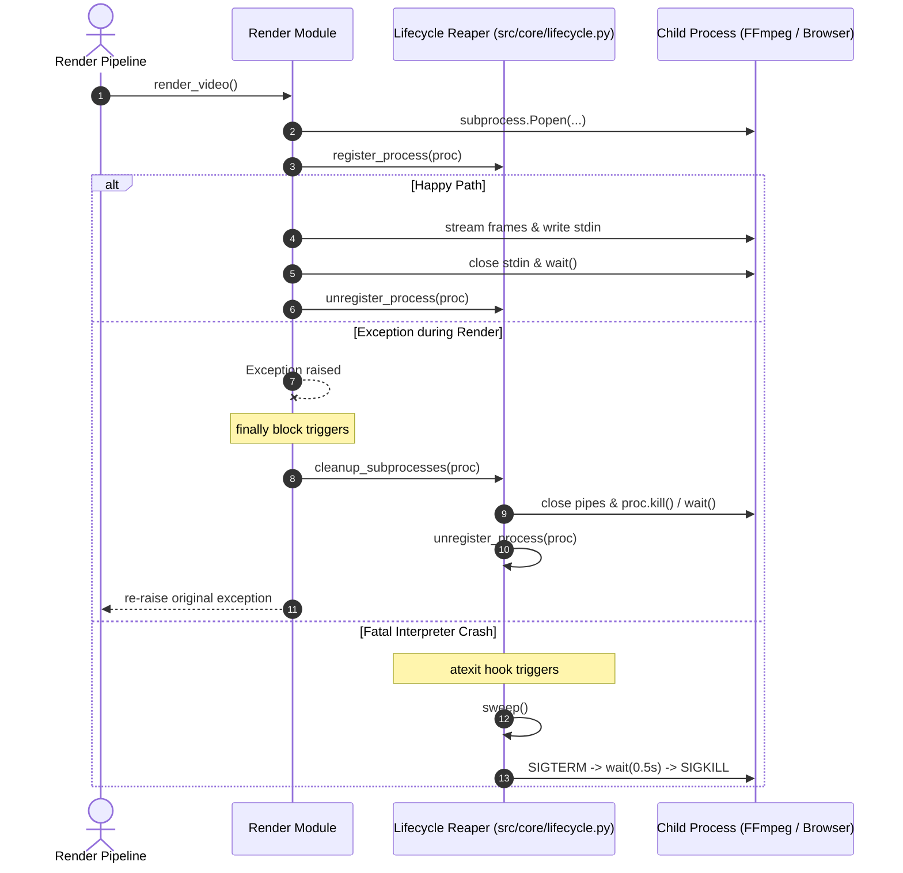

# Technical Design: Resource Leak Prevention

## Context & Architecture Overview

The video rendering pipeline spawns child processes (`ffmpeg`, Playwright Chromium) for frame compositing, subtitle burning, and shader rendering across `proc_engine.py`, `subtitles.py`, `stream_renderer.py`, and `web_renderer.py`. Direct `subprocess.Popen` pipe chains currently lack uniform `try/finally` blocks, risking orphaned processes and leaked OS file descriptors upon pipeline exceptions or fatal crashes.

This design introduces a two-tier defense:
1. **Deterministic Cleanup**: Explicit `try/finally` guards in render modules using a centralized helper.
2. **Safety Net**: A lightweight `atexit`-registered process lifecycle reaper (`src/core/lifecycle.py`) tracking spawned child PIDs and sweeping orphans on interpreter shutdown.



## Architecture Decisions

- **AD-1: Centralized Reaper Module (`src/core/lifecycle.py`)**: Thread-safe registry with `atexit` sweeping guarantees cleanup even during unhandled interpreter termination, avoiding scattered cleanup logic.
- **AD-2: Non-Masking Exception Suppression**: `cleanup_subprocesses()` safely suppresses secondary cleanup errors (`OSError`, `ProcessLookupError`, `BrokenPipeError`) via `contextlib.suppress`, ensuring original application exceptions are preserved.
- **AD-3: Pipe Drain & Escalation Protocol**: Cleanup closes open streams (`stdin`, `stdout`, `stderr`), issues `terminate()` (`SIGTERM`), awaits process exit with a short timeout, and escalates to `kill()` (`SIGKILL`) to prevent pipe buffer deadlocks.

## File Changes & Interface Contracts

| File | Change | Purpose |
|------|--------|---------|
| `src/core/lifecycle.py` | New | Child PID tracking registry, `atexit` sweep, and process cleanup helpers. |
| `src/media/proc_engine.py` | Modify | Wrap dual-Popen subtitle rendering in `try/finally` with `cleanup_subprocesses`. |
| `src/media/subtitles.py` | Modify | Wrap dual-Popen burning loop in `try/finally` with `cleanup_subprocesses`. |
| `src/compositing/stream_renderer.py` | Modify | Wrap Playwright browser and FFmpeg Popen in `try/finally` cleanup. |
| `src/media/web_renderer.py` | Modify | Wrap browser session and FFmpeg encoding in `try/finally` cleanup. |

### Contract: `src/core/lifecycle.py`

```python
def register_process(proc: subprocess.Popen | int) -> int:
    """Registers a child PID in the thread-safe tracker. Returns tracked PID."""

def unregister_process(proc: subprocess.Popen | int) -> None:
    """Removes a child PID from the tracker."""

def cleanup_subprocesses(*procs: Optional[subprocess.Popen], timeout: float = 2.0) -> None:
    """Safely closes pipes, terminates/kills processes, waits, and unregisters."""

def sweep_tracked_processes() -> None:
    """atexit handler: sends SIGTERM/SIGKILL to all remaining registered PIDs."""
```

## Threat Matrix

| Threat | Impact | Mitigation |
|--------|--------|------------|
| **Zombie / Orphan Processes** | Exhausted OS PID table and RAM exhaustion | `try/finally` blocks + `atexit` fallback reaper (`SIGTERM` -> `SIGKILL`). |
| **PID Recycling Collision** | Killing unrelated process on shutdown | Immediate unregister on exit; check PID validity / ownership before signaling. |
| **Deadlock on Pipe Buffers** | Hang during cleanup if buffers full | Close `stdin`/`stdout`/`stderr` before calling `wait(timeout=...)`. |
| **Exception Masking** | Secondary cleanup errors obscuring root crash | Suppress only `OSError`/`ProcessLookupError` within cleanup routines. |

## Testing Strategy

- **Unit Tests (`tests/unit/test_lifecycle.py`)**:
  - Test registration, deregistration, and thread-safety under concurrent threads.
  - Test `cleanup_subprocesses()` with mock `Popen` instances simulating hanging, dead, and normal processes.
  - Test `atexit` sweep suppressing dead PID errors (`ProcessLookupError`).
- **Render Module Tests (`tests/unit/test_media_cleanup.py`)**:
  - Simulate exceptions in `proc_engine`, `subtitles`, `stream_renderer`, and `web_renderer`.
  - Assert `kill()` and `wait()` called on all spawned processes and original exception re-raised.
- **Integration Tests (`tests/integration/test_lifecycle_reaper.py`)**:
  - Spawn real subprocesses and verify cleanup on forced exit.
