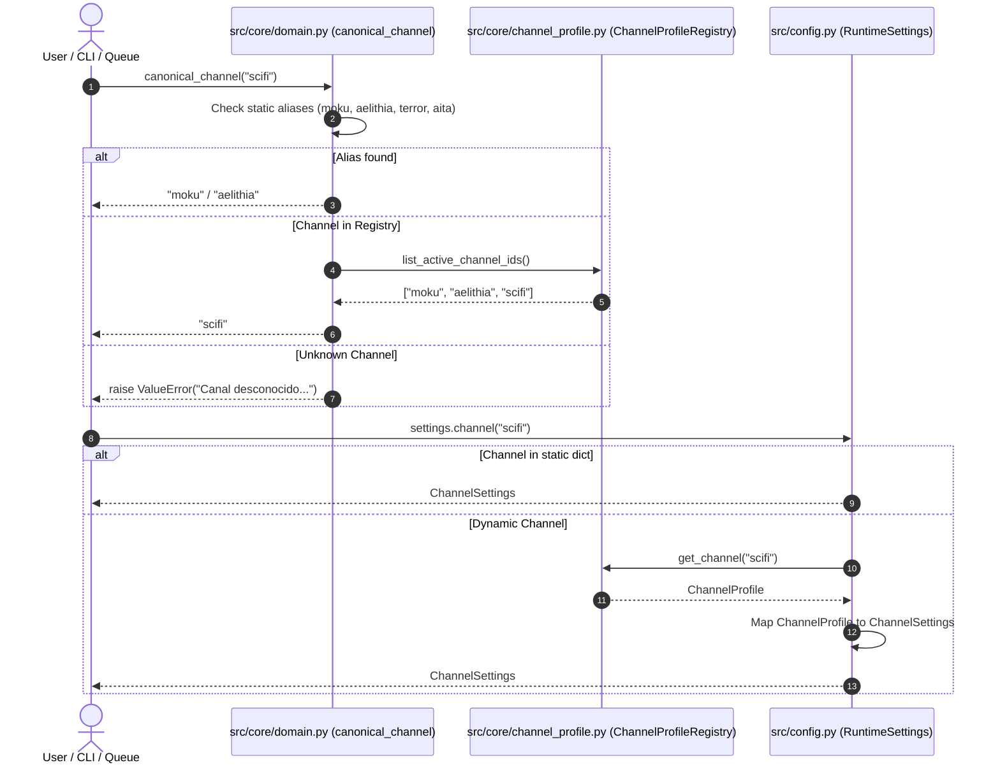

# Technical Design: Dynamic Channel Registry & Path Sanitization

## Context & Architecture Overview

Currently, `yt-auto` has a dual channel architecture:
1. `src/core/domain.py` uses `CanonicalChannel(str, Enum)` with static members `MOKU` and `AELITHIA`.
2. `src/config.py` instantiates static `MOKU` and `AELITHIA` `ChannelSettings` dataclasses.
3. `src/core/channel_profile.py` uses `ChannelProfileRegistry` to dynamically load `config/channels/*.json` (where `scifi.json` is already present).

When passing `--channel scifi` to CLI commands, `canonical_channel()` in `src/core/domain.py` rejects it with `ValueError: Canal desconocido o ausente: 'scifi'` because `scifi` is not in `CHANNEL_ALIASES`.

This design unifies channel resolution so `canonical_channel()` dynamically consults `ChannelProfileRegistry` while preserving string compatibility for `CanonicalChannel.MOKU` and `CanonicalChannel.AELITHIA`.

## Architecture Decisions

- **AD-1: Dynamic Registry Consultation with Lazy Fallback**: `src/core/domain.py` dynamically resolves channel IDs using `ChannelProfileRegistry.list_active_channel_ids()` without breaking static enum type contracts.
- **AD-2: Zero Breaking Changes for Existing Pipelines**: `CanonicalChannel` remains accessible with string values `moku` and `aelithia`. All legacy aliases (`terror`, `scp`, `aita`, `soy_el_malo`) map consistently.
- **AD-3: Hermetic Test Fixtures**: Replace static `/home/Moku/...` paths in `tests/unit/test_audio_quality.py` and `tests/unit/test_media_integrity.py` with pytest `tmp_path` fixtures or synthetic media helpers.

## File Changes & Interface Contracts

| File | Change | Purpose |
|------|--------|---------|
| `src/core/domain.py` | Modify | Extend `canonical_channel()` to dynamically validate against `ChannelProfileRegistry`. |
| `src/config.py` | Modify | Extend `RuntimeSettings.channel()` to dynamically construct `ChannelSettings` from `ChannelProfile` when querying non-hardcoded channels. |
| `tests/unit/test_audio_quality.py` | Modify | Replace hardcoded `/home/Moku/...` string with dynamic fixture. |
| `tests/unit/test_media_integrity.py` | Modify | Replace hardcoded `/home/Moku/...` strings with pytest `tmp_path` and fixtures. |
| `docker-compose.yml` | Modify | Update default `AGY_BINARY_PATH` to `/usr/local/bin/agy`. |

## Threat Matrix

| Threat | Impact | Mitigation |
|--------|--------|------------|
| **Circular Import between domain.py & channel_profile.py** | Import failure at startup | Perform lazy import of `ChannelProfileRegistry` inside `canonical_channel()` or maintain decoupled normalization. |
| **Typo in Channel Name** | Accidental pipeline execution on wrong config | Strict validation: if not in aliases or active channel IDs, fail fast with `ValueError`. |
| **Test Debris / Missing Fixtures** | Flaky or failing tests in clean CI environments | Use `tmp_path` and synthetic media generator fixtures. |

## Testing Strategy

- **Unit Tests (`tests/unit/test_channel_profile_and_thumbnails.py`, `tests/unit/test_branding.py`)**:
  - Verify `canonical_channel("scifi")` returns `"scifi"`.
  - Verify `settings.channel("scifi")` returns populated `ChannelSettings`.
  - Verify legacy aliases (`terror`, `aita`) still resolve correctly.
- **Path Hygiene Tests (`tests/unit/test_docs_integrity.py`)**:
  - Verify no hardcoded developer paths remain across codebase.
