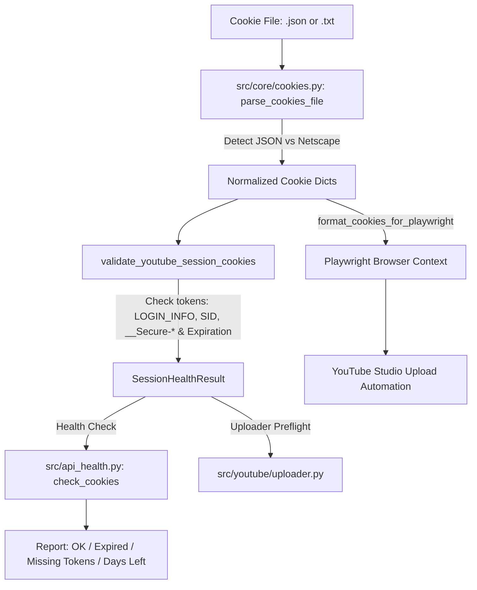

# Technical Design: YouTube Cookie Resilience & Deep Session Health

## Context & Architecture Overview

Currently in `yt-auto`:
1. `src/youtube/uploader.py` and `src/api_health.py` load cookies via `json.load()` assuming a JSON array list of cookie objects.
2. Channel profiles in `config/channels/*.json` point to `secrets/cookies.txt` (Netscape format), causing parser crashes (`JSONDecodeError`) if standard `cookies.txt` files are supplied.
3. `api_health.check_cookies()` only checks file existence and non-empty JSON, giving false-positive "OK" reports even when essential session tokens (`LOGIN_INFO`, `SID`, `__Secure-1PSID`) are missing or have already expired.
4. Playwright creates a clean context (`browser.new_context()`) for every upload without validating session expiration beforehand, leading to delayed browser failures and 2FA anti-bot challenge triggers.

This design introduces `src/core/cookies.py` as a centralized, robust cookie management module, and updates `api_health.py` and `uploader.py` to use it.

## Architecture Decisions

- **AD-1: Centralized Cookie Module (`src/core/cookies.py`)**: All parsing, format auto-detection, normalization, and expiration/token inspection logic lives in `src/core/cookies.py`. No direct `json.load()` on cookie files in uploader or health checks.
- **AD-2: Transparent Format Auto-Detection**:
  - If content parses as JSON array (`[{...}]`), extract fields directly.
  - If content begins with `# Netscape HTTP Cookie File` or contains tab-separated records (domain, flag, path, secure, expiry, name, value), parse using Netscape line parser.
  - Reject malformed or unsupported structures with clear errors.
- **AD-3: Comprehensive Token & Expiry Verification**:
  - Core session tokens tracked: `LOGIN_INFO`, `SID`, `HSID`, `SSID`, `APISID`, `SAPISID`, `__Secure-1PSID`, `__Secure-3PSID`.
  - Session status enum: `HEALTHY` (valid > 48h), `EXPIRING_SOON` (valid <= 48h), `EXPIRED` (expiry < now), `INCOMPLETE` (missing `LOGIN_INFO` or `SID`/`__Secure-1PSID`), `INVALID` (malformed data).
- **AD-4: Zero Secret Leakage**:
  - Status reports and logs NEVER output cookie values (`value`), only token names, domain counts, and validity windows (e.g. `Cookies OK (activas, 14 días restantes)`).

## File Changes & Interface Contracts

| File | Change | Purpose |
|------|--------|---------|
| `src/core/cookies.py` | NEW | `parse_cookies_file()`, `format_cookies_for_playwright()`, `validate_youtube_session_cookies()`, `SessionStatus`, `SessionHealthResult`. |
| `src/api_health.py` | Modify | Update `check_cookies()` to use `src.core.cookies` with deep diagnostics. |
| `src/youtube/uploader.py` | Modify | Use `parse_cookies_file()` and preflight cookie validation before browser launch. |
| `tests/unit/test_cookies.py` | NEW | 100% test coverage for JSON, Netscape, expired, and incomplete cookie files. |
| `tests/unit/test_api_health.py` | Modify | Unit tests verifying new health report format and error handling. |

## Threat Matrix

| Threat | Impact | Mitigation |
|--------|--------|------------|
| **Secret Token Exposure in Logs** | Security compromise | `SessionHealthResult` and diagnostic messages only contain token names and expiry timestamps, never cookie values. |
| **Malformed/Corrupt Cookie File** | Crash during upload | `parse_cookies_file()` validates types, handles invalid dates gracefully, and raises clean typed exceptions. |
| **Silent Upload Failure on Expired Session** | Wasted pipeline runs / locked jobs | Preflight validation in `uploader.py` and `api_health.py` detects expired cookies before browser startup. |

## Testing Strategy

- **Unit Tests (`tests/unit/test_cookies.py`)**:
  - Test parsing valid JSON cookies (exported by Chrome extensions).
  - Test parsing valid Netscape `cookies.txt` (tab-delimited with comments).
  - Test validation of healthy session vs expired session vs missing `LOGIN_INFO`.
  - Test `format_cookies_for_playwright` with various domain and sameSite edge cases.
- **Health Check Tests (`tests/unit/test_api_health.py`)**:
  - Verify `check_cookies` returns `ok: True` with days remaining for healthy cookies.
  - Verify `check_cookies` returns `ok: False` with clear error on expired or missing tokens.
