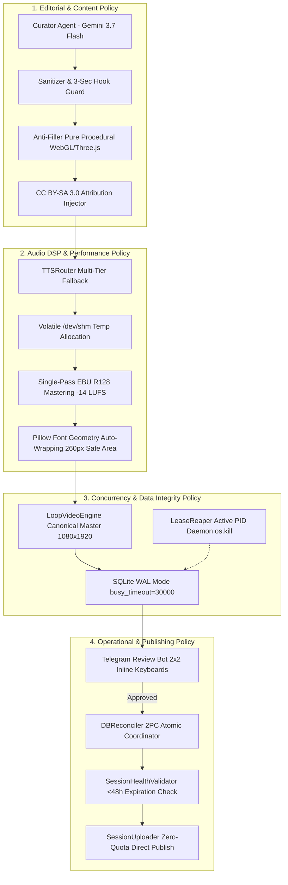

# Design: Unified Architecture & Policy Framework (yt-auto v3.1)

## Architecture Overview

## Architectural Decisions & Tradeoffs

### Decision 1: Direct Session Publication over YouTube Data API v3
- **Rationale**: YouTube Data API v3 enforces a strict daily quota of 10,000 units (~6 video uploads max). Massive production multi-lane automation requires unconstrained publishing capabilities. Authenticated session cookies (Playwright / InnerTube) eliminate this bottleneck.
- **Tradeoff**: Session cookies require monitoring for expiration (`LOGIN_INFO`, `SAPISID`). Handled via proactive `SessionHealthValidator` warning when $<48\text{h}$ remaining.

### Decision 2: 2PC Dual-Database Reconciliation Adapter
- **Rationale**: `shorts_queue.db` (worker production) and `review_state.db` (human editorial) operate as separate SQLite WAL databases. Independent non-transactional writes risk duplicate YouTube uploads or orphan approval states on transient network failure.
- **Tradeoff**: Minimal coordination overhead during the approval phase; resolved through synchronous `BEGIN IMMEDIATE` locks and verified `run_id` idempotency.

### Decision 3: Active PID Lease Reaper over Passive TTL Timeout
- **Rationale**: Workers that crash unexpectedly (OOM, SIGKILL) leave lane leases locked until the 900-second TTL expires, stalling pipeline lanes for 15 minutes.
- **Tradeoff**: Background daemon executes `os.kill(pid, 0)` every 30 seconds, immediately detecting dead worker PIDs and releasing leases in $<35$ seconds with zero CPU churn.
