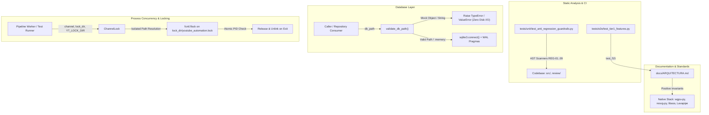
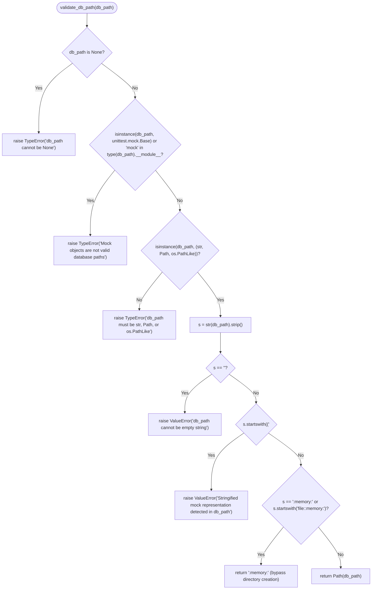
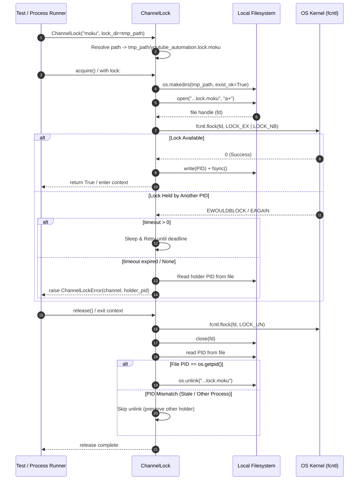

# Technical Design: Architecture Guardrails, Path Validation & Test Isolation Sanitization

## 1. Executive Summary & Context

This technical design establishes three architectural guardrails across `yt-auto`:
1. **Positive Architectural Documentation Invariants**: Replaces negative legacy references in documentation (`docs/ARQUITECTURA.md`) with positive specifications of native WebGPU (`wgpu-py`), Mesa Lavapipe software rendering fallback, `resvg-py` vector overlays, and C-level atomic `libass` subtitles. AST-level anti-regression guardrails (`REG-01` to `REG-09` in `tests/unit/test_anti_regression_guardrails.py`) remain the sole automated gatekeepers against legacy dependencies.
2. **Defensive Database Path Validation & Root Disk Hygiene**: Implements a strict validation gate (`validate_db_path`) across `src/core/repository.py` and `review/db.py` to reject test doubles (`MagicMock`, `Mock`, stringified mock representations) prior to invoking filesystem operations or SQLite connectors, eliminating `<MagicMock...>` file leaks in the repository root.
3. **Configurable ChannelLock Isolation for Concurrent Testing**: Enhances `src/core/lock.py` (`ChannelLock`, `acquire_lock`) with explicit `lock_dir` parameters and `YT_LOCK_DIR` environment fallback, enabling deterministic test isolation (via `tmp_path`) and preventing cross-process flock collisions in concurrent test runners (`pytest -n auto`).

---

## 2. Architecture Decisions & Tradeoffs (ADRs)

### ADR-1: Separation of Positive Architecture Documentation from Static AST Anti-Regression Guardrails

* **Status**: Accepted
* **Context**: `docs/ARQUITECTURA.md` Section 9 previously formulated visual rendering invariants negatively (e.g. naming legacy browser automation tools in prohibition clauses). The documentation synchronization test (`tests/e2e/test_tier1_features.py:test_f15_docs_arquitectura_synchronized`) asserts that legacy browser tokens are strictly absent from documentation. Consequently, mentioning forbidden tools in documentation causes test failures.
* **Decision**: Adopt a strict separation of concerns:
  - **Documentation Layer (`docs/ARQUITECTURA.md`)**: Formulated **positively** around native, GPU-accelerated and compiled dependencies:
    - 100% native WebGPU procedural rendering (`wgpu-py`) with WGSL fragment shaders and Mesa Lavapipe software rasterizer fallback.
    - Vectorized typography and dynamic SVG overlays via `resvg-py`.
    - C-level atomic subtitle rendering via `libass` and single-pass FFmpeg filter complex pipelines.
    - Deterministic memory management using pre-allocated contiguous NumPy array buffers ($\le 140\text{ MB RAM}$).
  - **Verification Layer (`tests/unit/test_anti_regression_guardrails.py`)**: Dedicated AST-based scanners enforce prohibitions (`REG-01` through `REG-09`) against imports, filesystem structures, and code constructs.
* **Tradeoffs & Rationale**:
  - *Alternative Considered*: Adding inline ignore comments/regex bypasses in documentation tests.
  - *Tradeoff*: Ignore markers clutter architectural docs and create brittle regexes. Positive documentation provides clearer engineering guidance for contributors while AST analysis provides authoritative, un-bypassable verification.

---

### ADR-2: Defensive Path Validation Layer in Database Connectors Against Mock Leakage

* **Status**: Accepted
* **Context**: Unit and integration tests that mock configuration objects often pass `MagicMock` instances as `db_path`. In standard Python `pathlib.Path(MagicMock())` evaluates to `PosixPath("<MagicMock name='mock.db_path' id='...'>")`. When passed to `sqlite3.connect()` or `os.makedirs()`, SQLite writes real database files (`<MagicMock...>`, `-wal`, `-shm`) directly into the repository root directory. Over 26 such files accumulated in the workspace.
* **Decision**: Introduce a centralized path validation helper `validate_db_path(db_path)` in database connection entry points:
  1. `src/core/repository.py:connect()`
  2. `src/core/repository.py:wal_checkpoint_passive()`
  3. `review/db.py:init_review_db()`
  4. `review/db.py:get_db_connection()`
  5. `review/db.py:ReviewStateStore.__init__()`
* **Validation Rules**:
  - Reject instances of `unittest.mock.Base` / `unittest.mock.Mock` / `unittest.mock.MagicMock` with `TypeError`.
  - Reject non-path types (`None`, `int`, `list`, `dict`) with `TypeError`.
  - Reject strings matching or containing mock representations (e.g., strings starting with `"<MagicMock"`, `"<Mock"`, or containing `"MagicMock name="`) with `ValueError`.
  - Permit valid filesystem paths (`str`, `pathlib.Path`, `os.PathLike`) and SQLite in-memory identifiers (`":memory:"`, URI memory strings).
  - Validation runs **before** calling `os.makedirs()`, `Path.mkdir()`, or `sqlite3.connect()`.
* **Tradeoffs & Rationale**:
  - *Alternative Considered*: Relying on test writers to fix mock definitions or adding `.gitignore` rules for `<MagicMock*>` files.
  - *Tradeoff*: Relying solely on test discipline is vulnerable to developer error. `.gitignore` hides filesystem pollution and resource leaks. A runtime gate ensures zero invalid files are ever created on disk and yields immediate actionable tracebacks.

---

### ADR-3: Configurable Lock Directory Isolation & Precedence for Parallel Execution

* **Status**: Accepted
* **Context**: `ChannelLock` in `src/core/lock.py` historically defaulted to a fixed path (`scratch/youtube_automation.lock[.<channel>]`). When multiple tests run in parallel (e.g. `pytest -n auto`), concurrent workers contend on the same lock files, leading to flock collisions, `ChannelLockError` exceptions, and test flakiness.
* **Decision**: Parameterize `ChannelLock` and `acquire_lock` with optional `lock_dir` and `lock_file_path` parameters and define a deterministic fallback cascade:
  1. Explicit `lock_file_path` (direct path).
  2. Explicit `lock_dir` (resolves `<lock_dir>/youtube_automation.lock` or `<lock_dir>/youtube_automation.lock.<channel>`).
  3. Environment variable `YT_LOCK_DIR` (resolves `<YT_LOCK_DIR>/youtube_automation.lock[.<channel>]`).
  4. Environment variable `LOCK_FILE_PATH` / default `_get_default_lock_path()`.
* **Lock Lifecycle Guarantees**:
  - Mutual exclusion enforced via `fcntl.flock(fd, LOCK_EX | LOCK_NB)`.
  - In-process reentrancy maintained via `_active_locks` table.
  - Atomic descriptor cleanup: upon release, `fcntl.flock(fd, LOCK_UN)` is called, file descriptor closed, and file unlinked **only** if the recorded PID inside the lock file matches `os.getpid()`.
* **Tradeoffs & Rationale**:
  - *Alternative Considered*: Replacing file-based locks with in-memory thread mutexes for tests.
  - *Tradeoff*: Thread mutexes fail to test multi-process locking behavior. Parameterized directory paths allow test fixtures to pass `tmp_path`, testing real OS flock mechanics in complete isolation.

---

## 3. System Architecture & Component Interaction

### Architectural Boundary Diagram



---

## 4. Component Interface Designs & Validation Signatures

### 4.1 Database Path Validation Helper

The validation logic is standardized across `src/core/repository.py` and `review/db.py`.

```python
def validate_db_path(db_path: Any) -> Path | str:
    """Validate database path argument before executing filesystem or SQLite operations.

    Args:
        db_path: Path-like, string, or in-memory SQLite identifier.

    Returns:
        Path or str: Normalized valid path or ':memory:'.

    Raises:
        TypeError: If db_path is None, a mock object, or not a Path/str/os.PathLike.
        ValueError: If db_path is an empty string or a stringified mock representation.
    """
```

#### Validation Logic Flowchart



#### Database Connector Signatures

```python
# src/core/repository.py
@contextmanager
def connect(
    db_path: str | os.PathLike[str],
    *,
    read_only: bool = False
) -> Iterator[sqlite3.Connection]:
    path_or_str = validate_db_path(db_path)
    if str(path_or_str) == ":memory:":
        conn = sqlite3.connect(":memory:", timeout=BUSY_TIMEOUT_MS / 1000)
    else:
        path = Path(path_or_str)
        if not read_only:
            path.parent.mkdir(parents=True, exist_ok=True)
            conn = sqlite3.connect(str(path), timeout=BUSY_TIMEOUT_MS / 1000)
        else:
            conn = sqlite3.connect(f"file:{path}?mode=ro", uri=True, timeout=BUSY_TIMEOUT_MS / 1000)
    # Configure Pragmas and yield
    ...
```

```python
# review/db.py
def init_review_db(db_path: str | os.PathLike[str]) -> None:
    path_or_str = validate_db_path(db_path)
    if str(path_or_str) != ":memory:":
        parent = os.path.dirname(os.path.abspath(str(path_or_str)))
        if parent:
            os.makedirs(parent, exist_ok=True)
    with sqlite3.connect(str(path_or_str), timeout=30.0) as conn:
        conn.execute("PRAGMA journal_mode=WAL;")
        conn.execute("PRAGMA busy_timeout=15000;")
        conn.execute(REVIEW_SCHEMA)
        conn.commit()
    _migrate_legacy_schema(str(path_or_str))
    _migrate_add_metadata(str(path_or_str))


@contextmanager
def get_db_connection(db_path: str | os.PathLike[str]) -> Iterator[sqlite3.Connection]:
    path_or_str = validate_db_path(db_path)
    conn = sqlite3.connect(str(path_or_str), timeout=30.0)
    conn.row_factory = sqlite3.Row
    conn.execute("PRAGMA journal_mode=WAL;")
    conn.execute("PRAGMA busy_timeout=15000;")
    try:
        yield conn
        conn.commit()
    except Exception:
        conn.rollback()
        raise
    finally:
        conn.close()


class ReviewStateStore:
    def __init__(self, db_path: str | os.PathLike[str] | None = None):
        raw_path = db_path or os.environ.get("VIDEO_REVIEW_DB_PATH") or _default_review_db()
        self.db_path = str(validate_db_path(raw_path))
        init_review_db(self.db_path)
```

---

### 4.2 ChannelLock Interface Design & Path Resolution

```python
class ChannelLock:
    """Context manager for atomic per-channel file locking with optional timeout.
    Uses kernel-managed fcntl.flock to guarantee OS-level multi-process mutual exclusion.
    """

    def __init__(
        self,
        channel_name: str = "global",
        lock_file_path: Optional[str | Path] = None,
        lock_dir: Optional[str | Path] = None,
        timeout: Optional[float] = None,
        poll_interval: float = 0.5,
    ) -> None:
        self.channel_name = channel_name if channel_name else "global"
        self.timeout = timeout
        self.poll_interval = max(0.05, float(poll_interval))
        self._file_handle: Optional[Any] = None
        self._acquired: bool = False
        self._is_reentrant: bool = False

        # Path Resolution Cascade
        if lock_file_path is not None:
            base_lock = str(lock_file_path)
            self.lock_file = base_lock if self.channel_name in ("global", None, "") else f"{base_lock}.{self.channel_name}"
        elif lock_dir is not None:
            dir_path = Path(lock_dir)
            filename = "youtube_automation.lock" if self.channel_name in ("global", None, "") else f"youtube_automation.lock.{self.channel_name}"
            self.lock_file = str(dir_path / filename)
        elif "YT_LOCK_DIR" in os.environ:
            dir_path = Path(os.environ["YT_LOCK_DIR"])
            filename = "youtube_automation.lock" if self.channel_name in ("global", None, "") else f"youtube_automation.lock.{self.channel_name}"
            self.lock_file = str(dir_path / filename)
        else:
            base_lock = _get_default_lock_path()
            self.lock_file = str(base_lock) if self.channel_name in ("global", None, "") else f"{base_lock}.{self.channel_name}"
```

```python
def acquire_lock(
    channel_name: str = "global",
    timeout: Optional[float] = None,
    lock_dir: Optional[str | Path] = None,
    lock_file_path: Optional[str | Path] = None,
) -> None:
    """Legacy compatibility function for acquiring a lock."""
    global _legacy_active_channel
    _legacy_active_channel = channel_name if channel_name else "global"
    lock = ChannelLock(
        channel_name=_legacy_active_channel,
        lock_file_path=lock_file_path,
        lock_dir=lock_dir,
        timeout=timeout,
    )
    try:
        lock.acquire()
        _active_locks[_legacy_active_channel] = lock
    except ChannelLockError as exc:
        print(str(exc))
        sys.exit(1)
```

#### Lock Lifecycle Sequence Diagram



---

## 5. Error Handling & Failure Modes Matrix

| Trigger / Condition | Component | Raised Exception | System Action / Side Effect |
|---|---|---|---|
| `MagicMock` / `Mock` passed as `db_path` | `repository.connect`, `review.db` | `TypeError` ("Invalid db_path: mock objects are not valid database paths") | **Zero file I/O**. Immediate abort; no directory or SQLite file created. |
| Non-path object (`int`, `list`, `dict`) as `db_path` | `repository.connect`, `review.db` | `TypeError` ("Invalid db_path type: expected str, Path, or os.PathLike") | **Zero file I/O**. |
| String starting with `"<MagicMock"` or `"<Mock"` | `repository.connect`, `review.db` | `ValueError` ("Invalid db_path: stringified mock representation detected") | **Zero file I/O**. Prevents `<MagicMock...>` file creation. |
| `":memory:"` or SQLite memory URI | `repository.connect`, `review.db` | *None (Success)* | Connects to in-memory DB without attempting `parent.mkdir()` or filesystem writes. |
| Concurrent acquisition on same channel & lock dir | `src.core.lock:ChannelLock` | `ChannelLockError` ("Another instance... is already running (pid=...)") | Kernel blocks acquisition. File descriptor closed. No stale descriptor leaks. |
| Process crash while holding lock | `src.core.lock:ChannelLock` | *None (Auto-Recovered)* | OS kernel automatically releases `fcntl.flock` when file descriptor is closed on process termination. Next acquisition succeeds and overwrites PID. |
| Lock release when PID in file $\ne$ `os.getpid()` | `src.core.lock:ChannelLock` | *None (Handled)* | Descriptor closed, `fcntl.flock(LOCK_UN)` executed; `os.unlink()` skipped to avoid deleting another process's active lock file. |
| Documentation containing forbidden token `playwright` | CI / Documentation Test | `AssertionError` | `test_f15_docs_arquitectura_synchronized` fails build before deployment. |

---

## 6. Disk Sanitization & Verification Plan

### 6.1 Disk Sanitization Execution
1. Delete all existing `<MagicMock*>` artifacts from the repository root:
   ```bash
   rm -f "<MagicMock"*
   ```
2. Verify with `git status --porcelain` that no untracked mock files remain.

### 6.2 Test Verification Commands

```bash
# 1. Verify positive architecture documentation synchronization
pytest tests/e2e/test_tier1_features.py -k test_f15_docs_arquitectura_synchronized -v

# 2. Verify all 9 AST anti-regression guardrails
pytest tests/unit/test_anti_regression_guardrails.py -v

# 3. Verify ChannelLock isolation and environment overrides
pytest tests/unit/test_channel_lock.py -v

# 4. Verify database path validation and zero mock leakage
pytest tests/unit/test_repository_path_validation.py tests/unit/test_review_db.py -v
```
