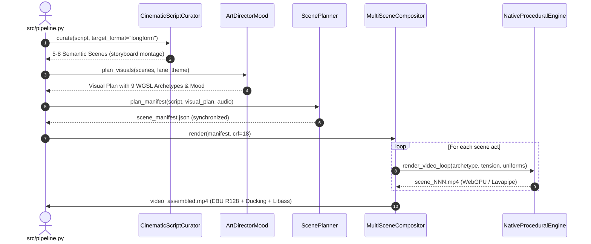

# Design: Cinematic Direction and Narrative Montage Pipeline Evolution

## Technical Approach
Bridge the gap between narrative intent and procedural GPU execution:
1. **Storyboarding in Curator**: `CinematicScriptCuratorAgent` compiles 5–8 semantic acts (60–150s) for longform lanes with causal transition tags, eliminating 11s arithmetic cuts.
2. **Upstream Archetype Assignment**: `ArtDirectorMoodAgent` assigns native WGSL archetypes directly to scenes, eliminating downstream regex keyword matching in `ScenePlannerCompositorAgent`.
3. **WebGPU Uniform Adapter**: `NativeProceduralEngine` maps art direction attributes into the rigid 64-byte uniform buffer without hardware layout changes.
4. **Photometric Floor**: WGSL shaders enforce a 15%–25% minimum luminance floor with sRGB gamma transfer.
5. **Orchestrator Alignment**: `src/pipeline.py` dispatches `visual_pipeline: "director"` to `MultiSceneCompositor` connected to `NativeProceduralEngine`.

## Architecture Decisions

| Decision | Alternatives | Tradeoffs | Rationale |
| :--- | :--- | :--- | :--- |
| **Upstream Archetype Resolution** in ArtDirector | Keep regex keyword matching in ScenePlanner | Regex is fast but context-blind; LLM inside ScenePlanner adds latency | ArtDirector already runs per-scene; assigning native archetypes there provides semantic coherence with zero added latency. |
| **Fixed 64-byte Buffer Translation** | Resize uniform buffer in WGSL shaders | Dynamic buffers require recompiling all 9 shaders; risk alignment errors | Translating art params (tension, Kelvin, accent, speed) into the 16 float32 slots preserves GPU hardware alignment. |
| **Direct WebGPU Delegation** in MultiSceneCompositor | PIL fallback rendering | PIL is easy but CPU-bound and lacks shader visual quality | Native WebGPU (Mesa Lavapipe fallback) yields 30fps acceleration with identical deterministic visual output. |

## Data Flow



## File Changes

| File | Action | Description |
| :--- | :--- | :--- |
| `src/pipeline.py` | Modify | Resolve `visual_pipeline: "director"` and connect `MultiSceneCompositor` to `NativeProceduralEngine`. |
| `src/agents/script_curator.py` | Modify | Implement semantic storyboard scene splitting (5–8 acts, 60–150s) and transition causality. |
| `src/agents/art_director.py` | Modify | Map scenes to canonical WGSL archetypes and Kelvin/palette uniform attributes. |
| `src/agents/scene_planner.py` | Modify | Remove keyword regex matching; accept explicit archetype and skip 11s sub-shot chopping. |
| `src/media/compositor.py` | Modify | Inject `NativeProceduralEngine` as default renderer in `ProceduralVideoEngine`. |
| `src/media/proc_engine.py` | Modify | Adapt `render_scene_segment` to forward uniform parameters to `NativeProceduralEngine`. |
| `src/media/shaders/maritime_lighthouse.wgsl` | Modify | Implement minimum 18% luminance floor and sRGB curve on ambient/nocturnal components. |

## Interfaces / Contracts

```python
# Storyboard Scene Contract (script_curator.py & scene_manifest.py)
class StoryboardScene(BaseModel):
    scene_id: str
    act_number: int
    narrative_role: str
    transition_reason: str
    duration_sec: float
    archetype_id: Literal[
        "arcade_vector_flight", "arctic_desolation", "cosmic_singularity",
        "cozy_hearth", "dark_forest", "maritime_lighthouse",
        "parkour_runner", "synaptic_network", "tactical_chamber"
    ]
    tension_level: int  # 1 to 5
    uniform_params: Dict[str, float]  # speed, distortion, glow, accent_rgb
```

## Testing Strategy

| Layer | What to Test | Approach |
| :--- | :--- | :--- |
| **Unit** | Uniform buffer packing, storyboard duration constraints, archetype resolution | Test `NativeProceduralEngine` struct alignment (64 bytes); test `ScriptCurator` 5–8 scene output. |
| **Integration** | `MultiSceneCompositor` + `NativeProceduralEngine` rendering pipeline | Render a 3-scene test manifest with Lavapipe; verify zero dropped frames and valid MP4. |
| **E2E** | Pipeline execution with `visual_pipeline: "director"` | Run end-to-end dry pipeline run with synthetic audio; verify no fallback to static loop. |

## Threat Matrix

| Threat Domain | Status | Mitigation / Test Plan |
| :--- | :--- | :--- |
| **Subprocess Injection** | Applicable | FFmpeg invocations use explicit argument lists (`list[str]`), never `shell=True`. RED test with special chars in paths. |
| **Process Timeout / Hang** | Applicable | Multi-scene render workers bounded by watchdog thread with `SIGKILL` on timeout ($t \le 180\text{s}$). |
| **BrokenPipe on FFmpeg Stdin** | Applicable | Raw video pipe writes wrapped in `try/except BrokenPipeError` with process cleanup. |
| **VCS / PR Automation** | N/A | No git/PR actions performed in this pipeline change. |
| **Untrusted Executables** | N/A | Only system `ffmpeg` and native Python `wgpu` libraries are executed. |

## Migration / Rollout
No database migration required. Channel configs in `config/lanes.json` with `"visual_pipeline": "director"` will automatically activate native multiscene execution once merged. Fallback to `"loop"` remains configurable per-lane if hardware lacks Vulkan/Lavapipe.

## Open Questions
- None. All architectural components and interfaces are validated against existing codebase.
