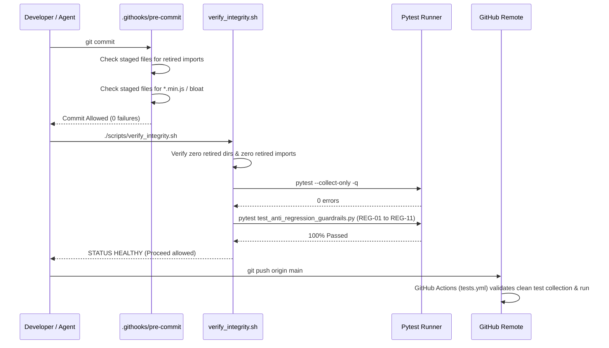

# Design: Legacy Eradication and Cross-Environment Guardrails

## Architecture Decisions (ADRs)

### ADR-01: AST-Based Static Import Enforcement
- **Context**: Retired legacy subsystems (`src/rendering/`, `src/compositing/`, `src/export/`) were deleted, but lingering test files importing them remained undetected because integrity tests only ran a subset of files.
- **Decision**: Implement `REG-10` in `tests/unit/test_anti_regression_guardrails.py` using Python's standard `ast` module to scan every `.py` file across `src/` and `tests/`. Any reference to `src.rendering`, `src.compositing`, or `src.export` raises an immediate assertion error.
- **Consequence**: Broken tests or dead imports fail immediately during test execution.

### ADR-02: Mandatory `pytest --collect-only` in `verify_integrity.sh`
- **Context**: The existing integrity script executed a single targeted test file, missing broken imports in un-executed files.
- **Decision**: Add step 6b to `scripts/verify_integrity.sh` running `$PYTEST_CMD --collect-only -q`. If pytest returns any collection error (exit code != 0), the script increments `FAILURES` and triggers the Mandatory Work Refusal Kill Switch.
- **Consequence**: No developer or agent can proceed with new features if any test file is broken.

### ADR-03: Pre-Commit Hook Staged Import Scanner
- **Context**: Pre-commit hook blocked directory creation (`src/rendering/`), but did not scan imports in staged Python files.
- **Decision**: Add check #5 to `.githooks/pre-commit` using `grep -E` over all staged `.py` files looking for `from src.(rendering|compositing|export)` or `import src.(rendering|compositing|export)`.
- **Consequence**: Git physically blocks `git commit` before changes reach the repository.

### ADR-04: SSOT Tech Stack Realignment
- **Context**: `openspec/config.yaml` listed Playwright and Pillow, causing assistants and human operators to assume browser rendering and PIL subtitle drawing were active.
- **Decision**: Update `openspec/config.yaml` context to state: `Python 3.12/3.13, FFmpeg (Stream-Copy & libass), Edge-TTS, SQLite (WAL), WebGPU (wgpu-py), resvg-py`.
- **Consequence**: Agent memory and system prompts align strictly with the Stream-Copy architecture.

## Sequence / Gate Enforcement Flow

