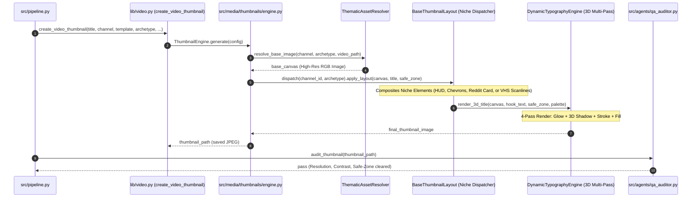

# Design: Impeccable High-CTR Thumbnail Pipeline

## Technical Approach
Replace rudimentary PIL geometric silhouettes and excessive background blur with a modular, niche-tailored thumbnail compositing system. The architecture introduces dedicated niche compositors (`ScpFoundFootageLayout`, `RedditDramaCardLayout`, `AnalogHorrorVhsLayout`), 3D multi-pass typography rendering, a deterministic 3-tier asset sourcing resolver, and automated QA gatekeeper validation for safe-zone and contrast compliance.

## Architecture Decisions

| Decision | Alternatives Considered | Tradeoff & Rationale |
|---|---|---|
| **Modular Layout Strategy Pattern** (`src/media/thumbnails/layouts/`) | Monolithic if/else in `ThumbnailEngine` or external bash scripts | Decouples niche visual rules (SCP HUD vs Reddit Card vs Analog VHS) into clean, testable classes while keeping `ThumbnailEngine` as a clean coordinator. |
| **3D Multi-Pass Typography Pipeline** | Single-pass `draw.text` with basic stroke | Basic stroke lacks depth and separation on complex backgrounds. A 4-pass render (glow -> blurred 3D shadow -> crisp stroke -> foreground fill) guarantees legibility and high CTR. |
| **Deterministic 3-Tier Asset Resolution** | Always extract from video loop OR require remote AI API | Procedural video loops lack narrative subjects when blurred. Tier 1 (explicit path) -> Tier 2 (local curated high-res asset bank) -> Tier 3 (clean climax frame) guarantees 100% offline autonomy and high fidelity. |
| **Eradication of PIL Stick Silhouettes** | Keep `AdaptiveSubjectCompositor` polygon drawing as fallback | Crude PIL stick figures destroy perceived production quality. True production thumbnails rely on authentic backdrops, HUD cards, and directional gradients, never stick-figure vectors. |

## Data Flow & Sequence Diagram



## File Changes

| File | Action | Description |
|------|--------|-------------|
| `src/media/thumbnails/layouts/base.py` | Create | Abstract base class `BaseThumbnailLayout` and layout registry. |
| `src/media/thumbnails/layouts/scp_hud.py` | Create | `ScpFoundFootageLayout` with camera HUD, Foundation bar, hazard stripes, Euclid badge. |
| `src/media/thumbnails/layouts/reddit_card.py` | Create | `RedditDramaCardLayout` with Reddit header card, upvotes, dramatic callout bubble. |
| `src/media/thumbnails/layouts/analog_horror.py` | Create | `AnalogHorrorVhsLayout` with VHS REC HUD, signal tuner, scanlines, classified tape. |
| `src/media/thumbnails/layouts/cinematic.py` | Create | `GeneralCinematicLayout` high-craft editorial fallback. |
| `src/media/thumbnails/asset_resolver.py` | Create | `ThematicAssetResolver` implementing 3-tier local-first asset hierarchy. |
| `assets/thumbnails/templates/` | Create | Seed directory with master reference backdrops for SCP, AITA, and Horror. |
| `src/media/thumbnails/typography.py` | Modify | Implement `draw_text_with_effects` (glow, 3D shadow, stroke, fill) and safe-line splitting. |
| `src/media/thumbnails/subject_extractor.py` | Modify | Purge primitive geometric stick-figure polygons; retain rim-light and grading utilities. |
| `src/media/thumbnails/engine.py` | Modify | Wire layout dispatcher and asset resolver into `ThumbnailEngine.generate`. |
| `lib/video.py` | Modify | Forward enriched story and channel metadata to `ThumbnailConfig`. |
| `src/agents/qa_auditor.py` | Modify | Aspect-ratio aware validation (16:9 vs 9:16), size check (>40 KB), safe-zone check. |
| `lib/qa_gatekeeper.py` | Modify | Incorporate thumbnail validation into QA gatekeeper verdict. |
| `tests/unit/test_channel_profile_and_thumbnails.py` | Modify | Add tests for all niche layouts, 3D typography, safe zones, and QA audit. |

## Interfaces / Contracts

```python
class BaseThumbnailLayout(ABC):
    @abstractmethod
    def apply_layout(
        self,
        canvas: Image.Image,
        title: str,
        channel_id: str,
        safe_zone: SafeZone,
        metadata: Dict[str, Any],
    ) -> Image.Image:
        """Apply niche graphic overlays, gradients, badges and typography to canvas."""
        pass

class ThematicAssetResolver:
    @staticmethod
    def resolve_base_image(
        channel_id: str,
        archetype: str,
        target_size: Tuple[int, int],
        explicit_path: Optional[Union[str, Path]] = None,
        video_path: Optional[Union[str, Path]] = None,
    ) -> Image.Image:
        """Resolves base canvas: explicit -> local asset bank -> climax frame."""
        pass
```

## Testing Strategy

| Layer | What to Test | Approach |
|---|---|---|
| **Unit** | Niche layouts (`scp_hud`, `reddit_card`, `analog_horror`) | Synthetic PIL canvases; assert dimensions, non-zero pixel mutations in expected regions. |
| **Unit** | `draw_text_with_effects` 3D typography | Verify 4-layer composition, text bounding box containment, contrast ratio. |
| **Unit** | `ThematicAssetResolver` hierarchy | Mock filesystem paths; verify fallback sequence from explicit to asset bank to video frame. |
| **Unit** | `src/agents/qa_auditor.py` | Verify passing 16:9 and 9:16 thumbnails, rejection of blank/low-contrast or safe-zone violating images. |
| **Integration** | `lib/video.py: create_video_thumbnail` | End-to-end thumbnail generation for all 3 channels/lanes verifying output JPEG files. |

## Threat Matrix
`N/A — no routing, shell, subprocess, VCS/PR automation, executable-file classification, or process-integration boundary.`

## Migration / Rollout
No database migration or external API dependencies required. The asset bank is pre-seeded with master reference images ensuring immediate offline production readiness. Existing calls to `create_video_thumbnail` preserve their public signatures.

## Open Questions
None. Architecture and requirements are fully bounded.
