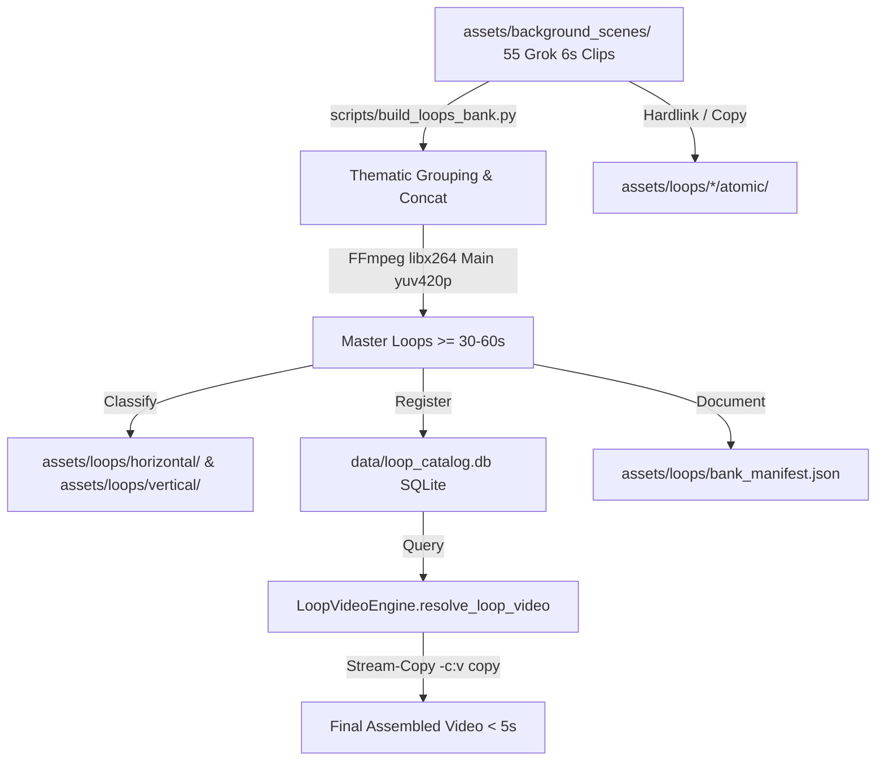

# Design: Grok Master Loops Bank and Classified Asset Repository

## 1. Architectural Overview

## 2. Master Loop Specifications

### Moku Horror (Nicho Terror Analógico)
1. `moku_containment_facility_master_60s.mp4`: 10 clips unidos de instalaciones subterráneas (morgue, asilo, túnel de metro, corredor SCP, celda de contención, puesto militar).
2. `moku_dark_wilderness_master_60s.mp4`: 10 clips unidos de exteriores oscuros (bosque brumoso, cabaña en lago congelado, cementerio con niebla, diner a las 3am, carnaval decaído).
3. `moku_vertical_shorts_master_60s.mp4`: Loops verticales nativos 9:16 extendidos a 60s para YouTube Shorts.

### Aelithia Drama (Nicho Confesiones / Reddit / Romance)
1. `aelithia_cozy_interiors_master_60s.mp4`: 10 clips de interiores cálidos (estudio con biblioteca, cafetería con lluvia, panadería al amanecer, rincón de librería, chimenea).
2. `aelithia_nocturne_city_master_60s.mp4`: 10 clips de melancolía urbana (parabrisas con lluvia en tablero, azotea con guirnaldas, balcón al atardecer, lounge de hotel).
3. `aelithia_vertical_shorts_master_60s.mp4`: Taza de café con vapor y ventana con lluvia vertical extendidos a 60s.

### Singularidad Sci-Fi (Nicho Futurismo / Astronomía)
1. `scifi_deep_space_and_cyber_master_60s.mp4`: 10 clips de espacio profundo y tecnología (estación orbital lunar, núcleo de la Vía Láctea, enjambre Dyson, datacenter cyberpunk, observatorio con láser).
2. `scifi_vertical_shorts_master_60s.mp4`: Campo estelar y nebulosa vertical 9:16 extendido a 60s.

## 3. Storage Hierarchy & Aliasing

- `assets/loops/horizontal/<canonical_category>/`
- `assets/loops/vertical/<canonical_category>/`
- Symlinks / Hardlinks para categorías aliadas (`horror` -> `moku_horror`, `dark_ambient`, `dark_forest`; `drama` -> `aelithia_drama`, `cozy_ambient`; `scifi` -> `singularidad_scifi`, `space_abyss`).
- Subcarpeta `atomic/` para mantener disponibles los clips individuales de 6s para edición con cortes rítmicos.
