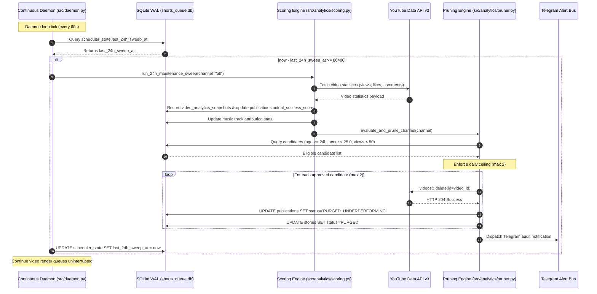

# Design: Automated 24h Performance Scoring and Underperforming Video Pruning Lifecycle

## Technical Approach

The automated 24-hour maintenance lifecycle introduces an autonomous feedback loop into the continuous daemon. It operates in three distinct stages:
1. **Analytics Synchronization & Scoring (`src/analytics/scoring.py`)**: Fetches YouTube Data API v3 statistics, computes a normalized empirical score ($0-100$), attributes scores to background music tracks, and updates the local SQLite database.
2. **Criteria-Based Pruning (`src/analytics/pruner.py`)**: Evaluates published videos against safety invariants (mandatory 24h grace period, minimum performance floor, daily deletion quota ceiling $\le 2$). Eligible candidates are deleted from YouTube and marked `PURGED_UNDERPERFORMING` in SQLite.
3. **Daemon Scheduling (`src/daemon.py` & `src/cli/`)**: The continuous daemon tracks `last_24h_sweep_at` in `scheduler_state`. Every 86,400 seconds, the maintenance sweep executes in an isolated try-except block so external API errors never interrupt ongoing video rendering.

## Architecture Decisions

### Decision: In-Database State Tracking for 24h Cadence
**Choice**: Store `last_24h_sweep_at` directly in SQLite `scheduler_state`.
**Alternatives considered**: System cron jobs (`/etc/cron.d`), external systemd timers, in-memory tick counters.
**Rationale**: In-memory tick counters reset on daemon restarts, causing potential duplicate sweeps. External cron jobs require root or external operational configuration and cannot easily share daemon concurrency locks. Storing state in SQLite `scheduler_state` guarantees persistent, daemon-native, restart-resilient cadence.

### Decision: Empirical Scoring Formula with Channel Baseline Normalization
**Choice**: Normalized multi-component score:
$$\text{Score} = \min\left(100.0, 0.40 \cdot \text{NormViews} + 0.35 \cdot \text{EngagementRatio} \times 100 + 0.25 \cdot \text{RetentionPct}\right)$$
**Alternatives considered**: Pure raw view count, simple Return On Media (ROM).
**Rationale**: Pure view count heavily biases older videos over newer ones and ignores viewer satisfaction. ROM is geared towards production cost return rather than organic viral potential. Our normalized formula rewards high like-to-view ratios, comment density, and audience retention while scaling view velocity logarithmically.

### Decision: Multi-Tiered Safety Bounds for Automated Video Pruning
**Choice**: Mandatory 24h grace period + dual threshold failure ($score < 25.0$ AND $views < 50$) + hard cap ($\le 2$ deletions/channel/day) + kill-switch flag (`AUTO_PRUNE_ENABLED=false`).
**Alternatives considered**: Unbounded threshold deletion, interactive confirmation in daemon.
**Rationale**: The daemon runs headlessly; interactive terminal prompts (`input()`) would freeze the production daemon indefinitely. Conversely, unconstrained automated deletion risks wiping out catalogs during API reporting anomalies. The combination of a 24h grace period, dual threshold failure, and a daily cap of $\le 2$ videos provides mathematically bounded safety.

## Data Flow & Sequence Diagram



## File Changes

| File | Action | Description |
|------|--------|-------------|
| `src/analytics/scoring.py` | Create | Empirical score formula, music track attribution, and sub-millisecond query interface. |
| `src/analytics/pruner.py` | Create | Autonomous criteria-based video pruning with grace period, daily quota ceiling, and kill-switch. |
| `src/analytics/__init__.py` | Modify | Export `calculate_empirical_score`, `sync_and_score_channel`, and `prune_underperforming_videos`. |
| `src/core/repository/migrations.py` | Modify | Migration adding `actual_success_score`, `music_track` indices to `publications`, and `last_24h_sweep_at` to `scheduler_state`. |
| `src/daemon.py` | Modify | Hook `_run_24h_maintenance_sweep` into `start_daemon_lanes` periodic cycle. |
| `src/cli/subparsers.py` | Modify | Register CLI subcommands `sweep-24h` and `prune-underperforming`. |
| `src/cli/handlers/analytics.py` | Create | CLI handler for executing manual or automated 24h maintenance sweeps. |
| `tests/unit/test_analytics_scoring.py` | Create | Unit tests for score normalization, baseline calculations, and song attribution. |
| `tests/unit/test_analytics_pruner.py` | Create | Unit tests for grace period, quota limits, threshold failure, and kill switch. |

## Interfaces / Contracts

```python
# src/analytics/scoring.py
from dataclasses import dataclass
from typing import Any, Dict, List, Optional

@dataclass(slots=True, frozen=True)
class EmpiricalScoreResult:
    video_id: str
    channel: str
    views: int
    likes: int
    comments: int
    retention_rate_pct: float
    age_hours: float
    engagement_rate: float
    actual_success_score: float
    music_track: Optional[str] = None

def calculate_empirical_score(
    views: int,
    likes: int,
    comments: int,
    retention_rate_pct: float = 0.0,
    age_hours: float = 24.0,
) -> float:
    """Calculates normalized empirical success score in [0.0, 100.0]."""
    ...

# src/analytics/pruner.py
@dataclass(slots=True, frozen=True)
class PruneCandidate:
    publication_id: int
    video_id: str
    channel: str
    title: str
    actual_success_score: float
    view_count: int
    age_hours: float
    verified_at: str

@dataclass(slots=True)
class AutonomousPruneReport:
    channel: str
    evaluated_count: int
    pruned_count: int
    skipped_count: int
    failed_count: int
    items: list[dict[str, Any]]
```

## Testing Strategy

| Layer | What to Test | Approach |
|-------|-------------|----------|
| Unit (`tests/unit/test_analytics_scoring.py`) | Mathematical score formula, zero-division resilience, song attribution aggregation | Synthetic parameter sweeps with pure functions (no network/db). |
| Unit (`tests/unit/test_analytics_pruner.py`) | Grace period enforcement ($< 24\text{h}$ never pruned), daily ceiling ($\le 2$), kill switch, and dry-run safety | In-memory SQLite with mocked YouTube API client. |
| Integration (`tests/integration/test_maintenance_sweep.py`) | End-to-end 24h daemon maintenance sweep | Fast local database fixtures verifying `last_24h_sweep_at` updates. |

## Threat Matrix

| Threat Category | Status | Expected Safe / Failure Behavior | Planned RED Test |
|---|---|---|---|
| **Unauthorized Subprocess / Command Execution** | N/A | No subprocesses or shell calls executed. Pure Python & HTTPS. | N/A |
| **API Quota Exhaustion (YouTube Data API v3)** | Applicable | Circuit trip on HTTP 429/quota error; immediately abort pruning without retrying. | `test_pruner_aborts_on_quota_429` |
| **Accidental Deletion of High-Performing Video** | Applicable | Dual-condition guard (`score < 25.0` AND `views < 50`); raises refusal if video exceeds floor. | `test_pruner_never_deletes_above_threshold` |
| **Premature Deletion of Fresh Video** | Applicable | Strict evaluation grace period ($\ge 24\text{h}$); raises refusal if age $< 86,400\text{s}$. | `test_pruner_respects_mandatory_grace_period` |
| **Runaway Deletion Cascade** | Applicable | Hard daily ceiling ($\le 2$ videos deleted/channel/rolling 24h). | `test_pruner_enforces_max_daily_ceiling` |

## Migration / Rollout

1. **Database Migration**:
   - Add `actual_success_score REAL NOT NULL DEFAULT 0.0` to `publications`.
   - Add `music_track TEXT` to `publications`.
   - Add `last_24h_sweep_at INTEGER` to `scheduler_state`.
   - Create indices:
     ```sql
     CREATE INDEX IF NOT EXISTS idx_publications_score ON publications(channel, actual_success_score);
     CREATE INDEX IF NOT EXISTS idx_publications_sha256 ON publications(video_sha256);
     ```
2. **Rollout Configuration**:
   - `AUTO_PRUNE_ENABLED` defaults to `false` in development and `true` in production via `.env`.
   - The CLI supports `--dry-run` to preview pruning candidates without issuing YouTube API mutations.

## Open Questions
- None. Requirements, safety constraints, and contracts are fully specified and decoupled from media rendering.
