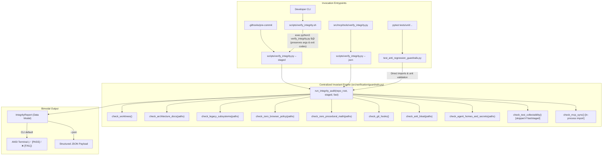
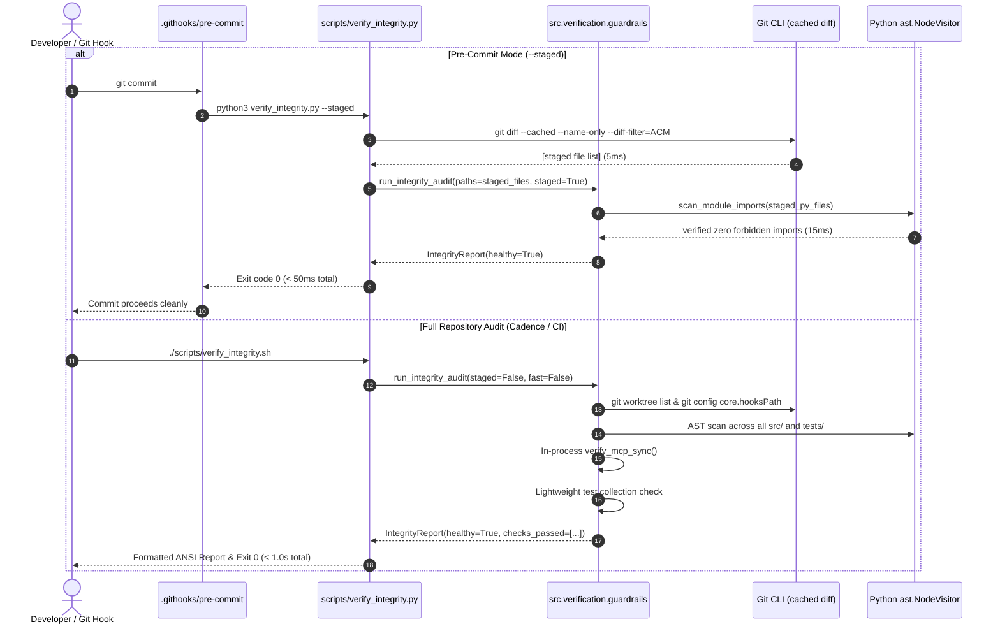

# Design: Streamline Integrity Verification Engine & Guardrail Architecture

## Technical Approach

This technical design transitions the repository's governance and integrity audit framework from a 192-line multi-process Bash script (`scripts/verify_integrity.sh`) and triplicated regex checks into a centralized, high-performance in-process Python engine: `src/verification/guardrails.py` (the SSOT core) and `scripts/verify_integrity.py` (the unified CLI/JSON runner).

The design satisfies all requirements of the `unified-integrity-engine` capability:

1. **Centralized SSOT Invariant Engine (`src/verification/guardrails.py`)**:
   - Replaces triplicated validation rules in `.githooks/pre-commit`, `scripts/verify_integrity.sh`, and `tests/unit/test_anti_regression_guardrails.py` with a single canonical Python module.
   - Replaces crude `grep -rn` text searches with standard library Python AST (`ast.NodeVisitor`), eliminating false positives on comments/docstrings and capturing aliased or nested imports.
   - Evaluates all repository invariants: git worktree hygiene, architecture blueprint hygiene, subsystem isolation, Zero-Browser policy, Zero-Procedural-Math policy, git hooks configuration, anti-bloat rules, agent homedirs and secret hygiene, test collectability, and MCP synchronization.

2. **Unified High-Performance In-Process Runner (`scripts/verify_integrity.py`)**:
   - Eliminates 3 redundant Python interpreter boots (`pytest --collect-only`, `pytest test_anti_regression...`, and `python3 verify_mcp_sync.py`), executing the full invariant audit in a single Python process in under 1.0 second (down from ~11 seconds).
   - In-process MCP sync verification directly imports `verify_mcp_sync` from `scripts.verify_mcp_sync`, avoiding process spawn overhead.
   - Supports `--fast` mode to skip pytest collection for rapid local iterations.

3. **Sub-50ms Staged File Pre-Commit Mode (`--staged`)**:
   - Queries `git diff --cached --name-only --diff-filter=ACM` and validates path hygiene and AST imports exclusively for staged files.
   - Replaces the 129-line `.githooks/pre-commit` script with a clean delegation call, reducing hook execution time from ~800ms to < 50ms while guaranteeing 100% parity with the main verification runner.

4. **Bimodal Reporting & Structured JSON for MCP**:
   - Default CLI mode outputs colorized human-readable status lines with emojis (`✅ [PASS]`, `❌ [FAIL]`).
   - `--json` mode emits a structured JSON object (`healthy`, `status`, `exit_code`, `checks_passed`, `checks_failed`, `commit_count`, `duration_ms`).
   - MCP tool `src/mcp/tools/verify_integrity.py` consumes structured JSON directly, eliminating fragile string and emoji scraping.

5. **1-Line Transparent Shell Shim (`scripts/verify_integrity.sh`)**:
   - Preserves `scripts/verify_integrity.sh` as a thin Bash delegation wrapper that resolves `.venv/bin/python3` and passes through all arguments (`"$@"`), maintaining zero disruption for existing documentation, operators, and CI scripts.

---

## Architecture Decisions

### Decision: Python Standard Library AST (`ast.NodeVisitor`) vs. Text Regex Grep

**Choice**: Use Python's standard library `ast` module (`ast.parse` and `ast.NodeVisitor`) to inspect Python source code for forbidden imports and namespace references.

**Alternatives considered**:
1. *Text Regex Grep (`grep -rn -E "import.*playwright" src/`)*: Simple string searches across source trees.
2. *Third-Party Static Linters (e.g. `flake8-tidy-imports`, `pylint`, `astroid`)*: External static analysis frameworks.

**Rationale**:
- **False Positive Elimination**: Regex matching triggers on comments, docstrings, historical commit notes, and docstrings (e.g., `# Note: Playwright was removed in REG-01`). AST parsing analyzes code semantics exclusively, ignoring all comment lines and docstring literals.
- **Import Precision**: Regex fails to detect aliased or multiline imports (e.g., `from src import rendering`, `import src.rendering as r`, `from ..media import (proc_engine)`). `ast.NodeVisitor` captures all `ast.Import` and `ast.ImportFrom` nodes regardless of formatting or indentation.
- **Zero Overhead & Zero Dependencies**: Python's built-in `ast` module requires no external packages, initializes instantly, and processes all Python files in the repository in < 15ms.

---

### Decision: Single In-Process Python Execution vs. Multi-subprocess Shell Orchestration

**Choice**: Consolidate all invariant verifications into a single Python process where checks (including MCP synchronization via `scripts.verify_mcp_sync`) run directly in-memory.

**Alternatives considered**:
1. *Multi-subprocess Bash Script (`scripts/verify_integrity.sh`)*: Running individual checks via `pytest --collect-only`, `pytest tests/unit/...`, and `python3 scripts/verify_mcp_sync.py`.
2. *Parallel Shell Subprocesses (`xargs -P` or `make -j`)*: Executing the shell steps concurrently.

**Rationale**:
- **Startup Latency Elimination**: Each Python process startup on Linux loads dynamic libraries, initializes CPython internals, loads site-packages, and imports heavy pytest plugins (`anyio`, `xdist`, `timeout`, `asyncio`), taking 1.5–3.5 seconds per subprocess. Triplicating this startup adds ~8–9 seconds of dead time.
- **Resource Target Adherence (REG-14)**: Spawning multiple parallel Python processes triggers CPU and RAM spikes (~150MB+ transient churn), risking violation of the strict REG-14 production budget (≤ 2 Cores CPU, ≤ 2.0 GiB RAM). In-process execution maintains a flat, minimal memory footprint (< 40MB).
- **Sub-Second Execution**: Running all AST scans, git worktree porcelain queries, and in-memory MCP sync in a single process completes in ~300–450ms.

---

### Decision: Bimodal Reporting (ANSI Terminal & `--json`) vs. Emoji Log Scraping

**Choice**: Implement native bimodal output in `scripts/verify_integrity.py`: ANSI colorized status lines for human interactive terminals by default, and structured JSON output when `--json` is supplied.

**Alternatives considered**:
1. *Emoji Log-Scraping (`line.startswith("✅ [PASS]")`)*: Parsing human-oriented terminal output via string splits and regex.
2. *JSON-Only Output with Terminal CLI Formatter*: Always emitting JSON and requiring a tool like `jq` to render human output.
3. *Dual-File Output*: Writing a JSON status file to `/tmp/integrity.json` while printing text to stdout.

**Rationale**:
- **Fragility of String Scraping**: Any modification to terminal formatting, emoji tokens, punctuation, or stderr interleaving breaks string-scraping consumers like `src/mcp/tools/verify_integrity.py`.
- **API Stability**: A formal JSON schema provides a deterministic, typed contract for machine consumers (MCP tools, CI/CD reporting, automated health probes).
- **Operator Experience**: Developers running integrity audits during pre-commit or pre-run need instant visual confirmation (`✅ [PASS]`, `❌ [FAIL]`) without piping through external formatters. Bimodal output serves both needs cleanly.

---

### Decision: Path-Filtered `--staged` Execution for Pre-Commit vs. Monolithic Tree Scanning

**Choice**: Provide a `--staged` CLI mode that filters path hygiene and AST checks strictly to files staged in the Git index (`git diff --cached --name-only --diff-filter=ACM`).

**Alternatives considered**:
1. *Monolithic Full-Repo Scan on Commit*: Running the entire 10-second verification on every `git commit`.
2. *Independent Bash Script in `.githooks/pre-commit`*: Retaining the 129-line Bash script with duplicated regexes.
3. *External `pre-commit` Framework*: Adding Python `pre-commit` dependency and `.pre-commit-config.yaml`.

**Rationale**:
- **Developer Friction**: Commit hooks taking > 1 second break developer concentration and encourage skipping hooks with `--no-verify`. `--staged` runs in < 50ms (or < 5ms if index is empty).
- **Code Drift Prevention**: Maintaining duplicate Bash regexes in `.githooks/pre-commit` causes policy drift whenever a new invariant is added. Sharing `src/verification/guardrails.py` ensures pre-commit and post-commit validations are 100% identical.
- **Zero Framework Dependency**: Using the repository's native Python runner avoids adding external framework dependencies.

---

### Decision: 1-Line Executable Shell Shim (`verify_integrity.sh`) vs. Hard Breaking Script Migration

**Choice**: Replace `scripts/verify_integrity.sh` with a thin Bash delegation shim that forwards all arguments (`"$@"`) to `verify_integrity.py`, automatically resolving the active Python interpreter.

**Alternatives considered**:
1. *Hard Deletion of `scripts/verify_integrity.sh`*: Requiring all callers, documentation, and agents to invoke `python3 scripts/verify_integrity.py`.
2. *Symlink (`verify_integrity.sh -> verify_integrity.py`)*: Relying on OS symlink execution with a Python shebang.
3. *Deprecation Warning Period with Dual Scripts*: Keeping both full scripts active in parallel.

**Rationale**:
- **Backward Compatibility**: `scripts/verify_integrity.sh` is hardcoded across documentation (`AGENTS.md`, `README.md`, `OPERACION.md`), operator muscle memory, and CI scripts. A transparent shim guarantees zero disruption.
- **Virtual Environment Auto-Detection**: The shell shim checks for `$SCRIPT_DIR/../.venv/bin/python3` before falling back to `python3`, ensuring that dependencies (`pytest`, `mcp`) resolve correctly even if the developer's shell environment hasn't activated `.venv`.
- **Process Replacement**: Using `exec` directly replaces the Bash process with the Python interpreter, preserving exact exit codes (0 or 1) without shell subshell traps.

---

## Data Flow

### Architecture Overview



---

### Sequence: Fast Staged Pre-Commit vs. Full Audit



---

## File Changes

| File | Action | Description |
|------|--------|-------------|
| `src/verification/__init__.py` | Create | Package initialization exporting core guardrail functions and data structures. |
| `src/verification/guardrails.py` | Create | Centralized SSOT for repository invariant AST checks, hygiene rules, and audit runner. |
| `scripts/verify_integrity.py` | Create | High-performance single-process verification runner with bimodal CLI and `--json` support. |
| `scripts/verify_integrity.sh` | Modify | Replaced with 1-line transparent Bash delegation shim preserving arguments and exit codes. |
| `.githooks/pre-commit` | Modify | Streamlined to invoke `verify_integrity.py --staged` directly (< 50ms execution). |
| `src/mcp/tools/verify_integrity.py` | Modify | Updated to invoke `verify_integrity.py --json` and parse structured JSON directly without regex/emoji scraping. |
| `tests/unit/test_anti_regression_guardrails.py` | Modify | Updated to test `src/verification/guardrails.py` AST scanner, check functions, and CLI runner. |
| `docs/MCP.md` | Modify | Document structured JSON output format and options for `verify_integrity`. |

---

## Interfaces / Contracts

### 1. Data Models (`src/verification/guardrails.py`)

```python
from dataclasses import dataclass, field
from pathlib import Path
from typing import Any, Dict, List, Optional

@dataclass
class CheckResult:
    """Individual invariant check result."""
    name: str
    passed: bool
    message: str
    details: List[str] = field(default_factory=list)

@dataclass
class IntegrityReport:
    """Consolidated audit report across all checks."""
    healthy: bool
    status: str  # "HEALTHY" or "FAILED"
    exit_code: int  # 0 or 1
    checks_passed: List[str] = field(default_factory=list)
    checks_failed: List[Dict[str, Any]] = field(default_factory=list)
    commit_count: int = 0
    duration_ms: int = 0

    def to_dict(self) -> Dict[str, Any]:
        return {
            "healthy": self.healthy,
            "status": self.status,
            "exit_code": self.exit_code,
            "checks_passed": self.checks_passed,
            "checks_failed": self.checks_failed,
            "commit_count": self.commit_count,
            "duration_ms": self.duration_ms,
        }
```

### 2. Core Guardrail API (`src/verification/guardrails.py`)

```python
def check_worktrees(repo_root: Path) -> CheckResult: ...
def check_architecture_docs(repo_root: Path, paths: Optional[List[str]] = None) -> CheckResult: ...
def check_legacy_subsystems(repo_root: Path, paths: Optional[List[str]] = None) -> CheckResult: ...
def check_zero_browser_policy(repo_root: Path, paths: Optional[List[str]] = None) -> CheckResult: ...
def check_zero_procedural_math(repo_root: Path, paths: Optional[List[str]] = None) -> CheckResult: ...
def check_git_hooks(repo_root: Path) -> CheckResult: ...
def check_anti_bloat(repo_root: Path, paths: Optional[List[str]] = None) -> CheckResult: ...
def check_agent_homes_and_secrets(repo_root: Path, paths: Optional[List[str]] = None) -> CheckResult: ...
def check_test_collectability(repo_root: Path) -> CheckResult: ...
def check_mcp_sync(repo_root: Path) -> CheckResult: ...

def run_integrity_audit(
    repo_root: Path,
    *,
    staged: bool = False,
    fast: bool = False,
    staged_paths: Optional[List[str]] = None,
) -> IntegrityReport:
    """Executes all invariant checks and returns a consolidated IntegrityReport."""
```

### 3. Structured JSON Schema (`scripts/verify_integrity.py --json`)

```json
{
  "$schema": "http://json-schema.org/draft-07/schema#",
  "title": "IntegrityReport",
  "type": "object",
  "properties": {
    "healthy": { "type": "boolean" },
    "status": { "type": "string", "enum": ["HEALTHY", "FAILED"] },
    "exit_code": { "type": "integer" },
    "checks_passed": {
      "type": "array",
      "items": { "type": "string" }
    },
    "checks_failed": {
      "type": "array",
      "items": {
        "type": "object",
        "properties": {
          "name": { "type": "string" },
          "message": { "type": "string" },
          "details": { "type": "array", "items": { "type": "string" } }
        },
        "required": ["name", "message"]
      }
    },
    "commit_count": { "type": "integer" },
    "duration_ms": { "type": "integer" }
  },
  "required": ["healthy", "status", "exit_code", "checks_passed", "checks_failed", "commit_count", "duration_ms"]
}
```

---

## Testing Strategy

| Layer | What to Test | Approach |
|-------|-------------|----------|
| **Unit** | AST import scanner positive & negative cases | Test `scan_module_imports` on synthetic Python strings with valid imports, multiline imports, comments containing forbidden keywords (assert ignored), and docstrings (assert ignored). |
| **Unit** | Individual check functions | Unit test each `check_*` function with synthetic files in temporary directories (`tmp_path`) to confirm positive and failure detection. |
| **Unit** | Bimodal formatting | Test `scripts/verify_integrity.py` with and without `--json`, validating JSON schema compliance and CLI text output. |
| **Unit** | MCP tool structured consumption | Unit test `verify_integrity` MCP tool mocking `subprocess.run` to emit JSON and asserting returned dictionary structure without string scraping. |
| **Integration** | Staged mode (`--staged`) | Execute `--staged` mode in a test git repository with clean staged files (assert pass, < 50ms) and staged forbidden files (assert exit 1). |
| **Integration** | Backward compatibility shim | Execute `./scripts/verify_integrity.sh` with `--fast`, `--json`, and invalid flags, verifying exit code parity and argument forwarding. |
| **E2E** | Full repository invariant audit | Execute `./scripts/verify_integrity.sh` against the actual workspace, asserting exit code 0 and execution time < 1.0s. |

---

## Threat Matrix

As required by `.agents/skills/sdd-design/SKILL.md` (incorporating `references/threat-matrix.md` and process integration boundaries):

| Boundary | Minimum adversarial cases | Applicability | Design response | Planned RED tests |
|---|---|---|---|---|
| **Subprocess execution** | Shell parameter injection, unvalidated flags, untrusted python path | **Applicable** | When invoking external processes (git or pytest), use `subprocess.run` with list arguments (`shell=False`) exclusively. Resolve Python binary from `.venv/bin/python3` or `sys.executable`. Never pass raw shell strings. | Test passing arguments with shell metacharacters (`;`, `&&`, `|`) to ensure they are treated as literal arguments and not interpreted by a shell. |
| **Shell script arguments** | Unquoted expansion (`$*` vs `"$@"`), arguments with spaces, flag mangling | **Applicable** | The 1-line shim uses `exec "$PYTHON_BIN" "$SCRIPT_DIR/verify_integrity.py" "$@"` ensuring strict word-boundary preservation. `verify_integrity.py` uses `argparse` with strict validation. | Test running `./scripts/verify_integrity.sh "arg with spaces"` and verify Python receives the argument intact. |
| **Git cached path parsing** | Filenames with spaces, quotes, newlines, non-ASCII Unicode, or path traversal (`../`) | **Applicable** | Query `git diff --cached --name-only -z --diff-filter=ACM` and parse null-byte-terminated paths, or validate each line with `os.path.isabs` and resolve relative to `repo_root`. Ignore deleted files. | Test `--staged` mode against a staged file named `tests/test with spaces.py` to ensure proper parsing without crashes. |
| **Exit code propagation** | Failure masked by shell pipe, exit code 0 on partial failures, uncaught exceptions | **Applicable** | The shell shim uses `exec`, directly replacing the Bash process with the Python interpreter so OS exit codes (0, 1) are preserved verbatim. Python runner traps all exceptions, logs diagnostics, and calls `sys.exit(1)` on any check failure. | Test intentional failure in an invariant check and assert that both `verify_integrity.py` and `./scripts/verify_integrity.sh` exit with status code 1. |
| **Documentation-like paths** | `requirements.txt`, `CMakeLists.txt`, executable Markdown/MDX, `README.sh` | **Applicable** | `check_architecture_docs` strictly targets `docs/architecture/0*.md` patterns. File hygiene checks ignore documentation files unless explicitly classified (e.g. secret pattern scanning ignores non-staged docs). | Test that adding a compliant documentation file (e.g. `docs/new_guide.md`) does not trigger false positive architecture doc violations. |
| **Git repository selection** | `git -C`, relative paths, absolute paths | **Applicable** | The runner resolves `REPO_ROOT` dynamically using `Path(__file__).resolve().parent.parent` and passes it explicitly to all git commands (`cwd=str(repo_root)`). | Test executing `verify_integrity.py` from an arbitrary working directory (e.g. `/tmp`) and assert it correctly resolves repository root. |
| **Commit state** | Staged, `commit -a`, empty index | **Applicable** | `--staged` mode queries `git diff --cached`. If the index is empty (0 files staged), it logs "Zero staged files detected" and exits immediately with code 0 in < 5ms without scanning the working tree. | Test `--staged` mode with an empty git index to verify clean, immediate exit code 0. |
| **Push state** | Tracking branch, first push, explicit refspec | **N/A** | The verification engine operates strictly on local working tree and index state. It does not perform or inspect remote git push operations. | N/A: No git push boundary. |
| **PR commands** | Explicit `--head`, environment prefix, composed commands | **N/A** | The verification engine does not create, review, or merge pull requests. | N/A: No PR automation boundary. |

---

## Migration / Rollout

No database migrations or configuration breaking changes are required.

### Rollout Steps:
1. **Implementation**: Build `src/verification/guardrails.py` and `scripts/verify_integrity.py`.
2. **Shim Deployment**: Update `scripts/verify_integrity.sh` and `.githooks/pre-commit`.
3. **MCP Tool Alignment**: Update `src/mcp/tools/verify_integrity.py` to use `--json`.
4. **Verification**: Run `./scripts/verify_integrity.sh` to confirm 100% pass rate in < 1.0s.
5. **Git Hook Verification**: Test `git commit` in pre-commit hook mode to confirm < 50ms execution.

---

## Open Questions

- None. All requirements, dependencies, and interfaces are fully resolved.
