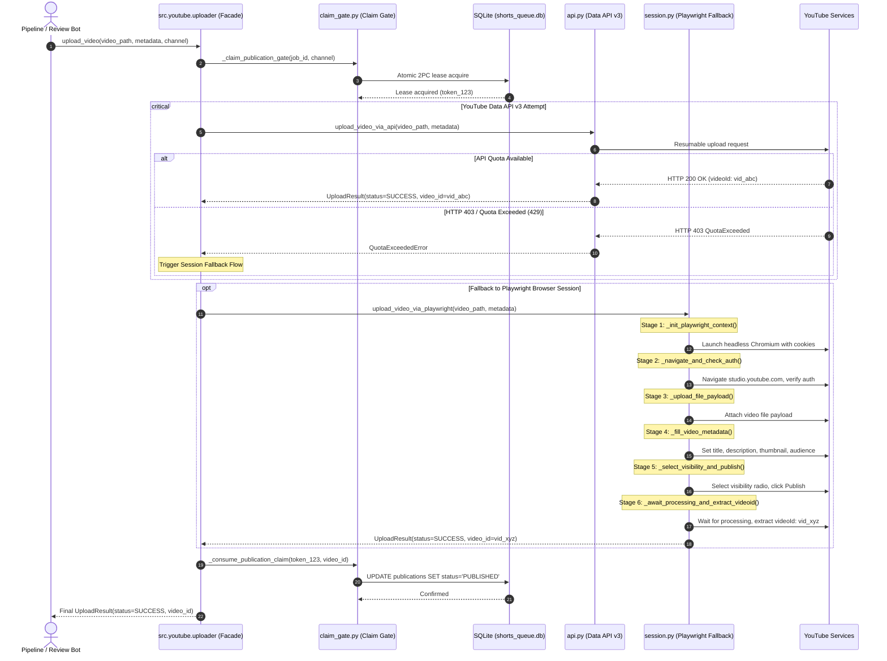
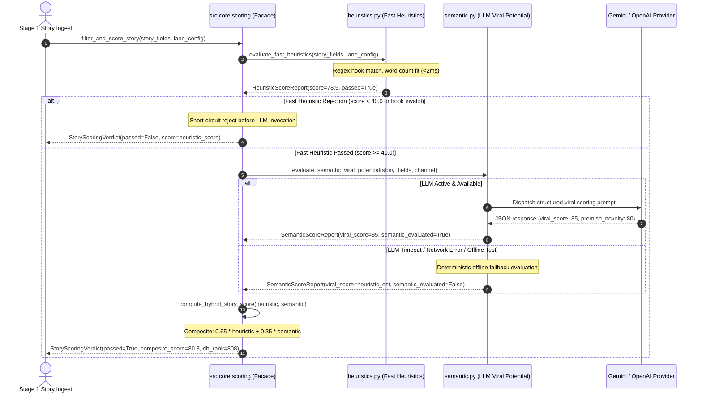

# Technical Design: Purge Monoliths, Redundant Processes, and Fantasy Hardcoding

## 1. Architectural Overview & Design Decisions

### 1.1 Context and Refactoring Philosophy

Over successive iterations, the `yt-auto` codebase evolved from procedural WebGL rendering experiments to high-performance FFmpeg stream-copy video composition, multi-act narrative staging, autonomous 24-hour analytics scoring, and multi-channel expansion. While achieving sub-second composition times and robust production stability, several architectural components accumulated significant technical debt:

1. **Monolithic Sprawl & Function Budget Violations**: Six core modules grew beyond manageable cognitive and maintainability boundaries, violating the Single Responsibility Principle (SRP) and the ~100 executable lines per function budget mandated by [AGENTS.md](file:///home/moku/.gemini/antigravity-cli/worktrees/YouTubeChannels/purge_monoliths_and_redundancy/AGENTS.md) Rule 8.1.
2. **Obsolete Documentation Footprint**: Deprecated blueprints (such as [`docs/PLAN_ARQUITECTURA_V3_1.md`](file:///home/moku/.gemini/antigravity-cli/worktrees/YouTubeChannels/purge_monoliths_and_redundancy/docs/PLAN_ARQUITECTURA_V3_1.md)) and historical post-mortems of failed rendering engines (skia-python, ModernGL, SwiftShader CPU saturation) lingered in `docs/`, violating the "Zero Resurrected Docs" policy ([AGENTS.md](file:///home/moku/.gemini/antigravity-cli/worktrees/YouTubeChannels/purge_monoliths_and_redundancy/AGENTS.md) Rule 1).
3. **Fantasy Channel Identifiers**: Legacy placeholder strings (`"moku"` for horror and `"aelithia"` for drama) were hardcoded across signatures, manifests, and CLI defaults instead of canonical thematic domain concepts (`"horror"`, `"drama"`, `"scifi"`).

This technical design details the decomposition of the 6 monoliths into focused, single-responsibility modules; the permanent excision and streamlining of obsolete documentation; the canonical domain inversion; and the backwards-compatible facade architecture ensuring zero broken imports and 100% pass rates across all test suites and [`./scripts/verify_integrity.sh`](file:///home/moku/.gemini/antigravity-cli/worktrees/YouTubeChannels/purge_monoliths_and_redundancy/scripts/verify_integrity.sh).

```
   ┌────────────────────────────────────────────────────────────────────────┐
   │                        yt-auto Core Subsystems                         │
   └────────────────────────────────────────────────────────────────────────┘
          │                   │                   │                  │
          ▼                   ▼                   ▼                  ▼
  ┌───────────────┐   ┌───────────────┐   ┌───────────────┐  ┌───────────────┐
  │  src/youtube/ │   │ src/curators/ │   │   src/core/   │  │   src/media/  │
  │   uploader/   │   │ text_splitter │   │scoring/catalog│  │ hybrid_engine │
  └───────────────┘   └───────────────┘   └───────────────┘  └───────────────┘
          │                   │                   │                  │
    [api/session/       [curation_prof/     [models/heur/      [ken_burns/
     claim_gate]         segmentation/       semantic/sync/     overlays/
                          tension]            audit/sampler]     compositor]
```

---

### 1.2 Monolith Decomposition Details (6 Target Subsystems)

#### Subsystem 1: `src/youtube/uploader.py` (1,721 lines -> Subpackage `src/youtube/uploader/`)

[`src/youtube/uploader.py`](file:///home/moku/.gemini/antigravity-cli/worktrees/YouTubeChannels/purge_monoliths_and_redundancy/src/youtube/uploader.py) historically amalgamated Google Data API v3 uploads, channel preflight, a 557-line Playwright browser upload loop, publication claim gate leasing, token refresh mechanics, and process supervision into a single file.

The refactored structure decomposes into the `src/youtube/uploader/` subpackage with a lean backwards-compatible facade:

- **`src/youtube/uploader/api.py`** (~220 lines):
  - `upload_video_via_api(video_path, metadata, ...)`: Google API client upload with resumable media chunking and retry handlers.
  - `_youtube_service(channel)`: OAuth credential resolution and discovery service builder.
  - `preflight_youtube_api(channel)`: API connectivity check and quota status verification.
  - `verify_youtube_credentials_preflight(channel)`: Pre-execution token validity inspection.
  - `verify_existing_video_via_api(video_id, ...)`: Post-upload state verification.
  - `_verify_uploaded_video(service, video_id)`: Snippet retrieval check.
  - `resolve_channel_token_path(channel)`: Channel token discovery supporting canonical and alias filenames (`tokens/horror.json` with fallback to `tokens/moku.json`).
  - `_save_refreshed_credentials(...)`: Persisting refreshed OAuth tokens to disk.
  - `validate_title_content_alignment(...)`: Metadata safety assertions.

- **`src/youtube/uploader/session.py`** (~380 lines):
  - Implements browser-based fallback uploads when YouTube Data API quota is exhausted.
  - Breaks down the monolithic 557-line `upload_video_via_playwright` into **6 linear, discrete stage functions** each strictly $\le 100$ executable lines:
    1. `_init_playwright_context(playwright, cookies_path, channel, headless)`: Spawns Chromium context, loads validated Netscape/JSON cookies via `src.core.cookies`, configures viewport (1280x720) and realistic user agent.
    2. `_navigate_and_check_auth(page, channel)`: Navigates to YouTube Studio (`https://studio.youtube.com`), verifies active authenticated session, dismisses initial dialogs or channel switchers.
    3. `_upload_file_payload(page, video_path)`: Clicks "CREATE" -> "Upload videos", hooks file chooser event, dispatches video file binary payload.
    4. `_fill_video_metadata(page, title, description, thumbnail_path, made_for_kids)`: Sets video title in contenteditable element, writes description body, uploads custom thumbnail image if provided, sets audience radio button (`"made-for-kids"` vs `"not-made-for-kids"`).
    5. `_select_visibility_and_publish(page, visibility, schedule_time)`: Advances through video elements checks, selects visibility radio button (`"PUBLIC"`, `"UNLISTED"`, `"PRIVATE"`), or triggers scheduled release.
    6. `_await_processing_and_extract_videoid(page, timeout_sec)`: Polls status indicator until upload processing completes, extracts final `videoId` from link or dialog attributes, clicks "DONE".
  - Linear orchestrator `upload_video_via_playwright()`: Composes the 6 stages linearly in a single `try...finally` block that guarantees browser cleanup and PID reaping.
  - Helper routines: `format_cookies_for_playwright()`, `_get_playwright_pids()`, `_safe_preupload_failure()`, `_click_dialog_button()`, `click_next()`, `click_done()`, `upload_video_via_playwright_ts()`.
  - Zero-Browser policy: Restricted strictly to `src/youtube/` (in compliance with [AGENTS.md](file:///home/moku/.gemini/antigravity-cli/worktrees/YouTubeChannels/purge_monoliths_and_redundancy/AGENTS.md) Rule 1 and invariant REG-01).

- **`src/youtube/uploader/claim_gate.py`** (~140 lines):
  - `_claim_publication_gate(job_id, story_id, channel, lane_id)`: Atomic 2PC publication lease acquisition from `shorts_queue.db` and `review_state.db`.
  - `_consume_publication_claim(claim_token, video_id, status)`: Finalizes publication in the database, releases worker lease.
  - Failure reconciliation and gate release rollback handlers.

- **`src/youtube/uploader/__init__.py` & `src/youtube/uploader.py` facade** (~180 lines):
  - High-level coordinator `upload_video(video_path, metadata, ...)`: Coordinates preflight -> claim gate lease -> API upload attempt -> Playwright session fallback on quota failure -> gate consumption.
  - `_normalize_upload_result(...)`: Normalizes return schemas across API and session outcomes.
  - Re-exports all public symbols, preserving legacy compatibility markers:
    ```python
    # Contract compatibility markers
    # PublicationGate
    # Publication gate requires job_id
    # single atomic publication claim
    ```

---

#### Subsystem 2: `src/curators/text_splitter.py` (1,001 lines -> `src/curators/` Decomposition)

[`src/curators/text_splitter.py`](file:///home/moku/.gemini/antigravity-cli/worktrees/YouTubeChannels/purge_monoliths_and_redundancy/src/curators/text_splitter.py) contained ~350 lines of static lane definitions alongside sentence splitting algorithms, tension curve computations, and the misleading header docstring referencing a non-existent agent path.

The refactored decomposition extracts data and focused logic into dedicated modules:

- **`src/curators/curation_profiles.py`** (~320 lines):
  - Declarative dictionary `LANE_CURATION_CONFIGS` keyed by canonical thematic lane IDs:
    - `horror-scp-shorts`
    - `horror-horror-long`
    - `drama-drama-shorts`
    - `drama-aita-long`
    - `scifi-singularity-shorts`
    - `scifi-singularity-long`
  - Explicit backward-compatibility alias resolution for legacy lane IDs (`moku-scp-shorts`, `moku-horror-long`, `aelithia-drama-shorts`, `aelithia-aita-long`).
  - Draft-07 JSON Schema validation path and `VALID_AUDIO_PACING_CUES` set:
    `{"calm_slow", "steady_dramatic", "tense_accelerando", "intense_urgent", "whispered_grave"}`.
  - Thematic environmental mood dictionaries and scene transition templates.

- **`src/curators/segmentation.py`** (~180 lines):
  - `split_into_sentences(text: str) -> list[str]`: Regex-based boundary detection handling abbreviations ("Dr.", "SCP-", "Sr.", "P.D.") without erroneous mid-sentence splits.
  - `sanitize_text(text: str) -> str`: Normalizes whitespace, strips markup/markdown syntax, sanitizes neutral Spanish punctuation.
  - `slice_into_scenes(sentences, target_duration, wpm)`: Slices text into scene chunks respecting minimum and maximum duration constraints.
  - `distribute_scenes_across_acts(scenes, act_count=4)`: Maps chronological scenes into standard 4-Act dramatic structure.

- **`src/curators/tension.py`** (~120 lines):
  - `interpolate_tension(scene_idx, total_scenes, tension_profile) -> int`: Computes progressive tension score ($1-5$) across narrative arc.
  - `resolve_audio_pacing_cue(tension_level, act_role) -> str`: Maps tension levels to valid audio pacing cues.

- **`src/curators/text_splitter.py` facade** (~180 lines):
  - Maintains `TextSegmentationEngine` coordinating curation profiles, segmentation, and tension curves.
  - Maintains `CinematicScriptCuratorAgent = TextSegmentationEngine` alias.
  - Re-exports `LANE_CURATION_CONFIGS`, `VALID_AUDIO_PACING_CUES`, and `SCHEMA_PATH` in `__all__`.

---

#### Subsystem 3: `src/core/scoring.py` (953 lines -> Subpackage `src/core/scoring/`)

[`src/core/scoring.py`](file:///home/moku/.gemini/antigravity-cli/worktrees/YouTubeChannels/purge_monoliths_and_redundancy/src/core/scoring.py) combined regex-based hook heuristics, word-count duration models, LLM prompt generation, JSON response parsing, deterministic fallback scoring, and database verdict formatting.

The refactored decomposition organizes these into strongly-typed sub-modules:

- **`src/core/scoring/models.py`** (~90 lines):
  - `@dataclass(slots=True)` data contracts:
    - `HeuristicScoreReport`: Fast rule-based metrics (spoken seconds, hook strength, engagement metrics, retention fit, heuristic score $[0, 100]$).
    - `SemanticScoreReport`: LLM evaluation metrics (viral score, premise novelty, twist factor, pacing rating, reasoning summary).
    - `StoryScoringVerdict`: Final consolidated verdict (passed/rejected, composite score $[0, 100]$, db_rank integer $[0, 1000]$, detailed sub-reports).

- **`src/core/scoring/heuristics.py`** (~240 lines):
  - Fast, deterministic rule evaluation executing in $< 2\text{ ms}$:
    - `_strip_accents(text)`, `_normalize_hook_text(text)`.
    - `estimate_spoken_seconds(word_count, wpm) -> float`.
    - `first_spoken_hook(text) -> str`: Extracts first 1-2 spoken sentences.
    - `opening_hook_within_budget(text, max_seconds) -> bool`.
    - `detect_opening_hook_strength(hook_text) -> tuple[float, list[str]]`: Regex pattern matching for high-stakes hooks, mystery questions, and preamble penalties.
    - `evaluate_retention_length_score(word_count, target_min, target_max) -> float`.
    - `evaluate_fast_heuristics(story_fields, lane_config) -> HeuristicScoreReport`.

- **`src/core/scoring/semantic.py`** (~220 lines):
  - LLM-assisted viral evaluation with deterministic fallback:
    - `_evaluate_semantic_deterministically(story_fields, channel) -> SemanticScoreReport`: Zero-network fallback for offline execution and test harnesses.
    - `_build_semantic_eval_prompt(story_fields, channel) -> str`.
    - `_parse_llm_json_response(raw_response) -> dict`.
    - `_build_semantic_report_from_llm(json_payload) -> SemanticScoreReport`.
    - `evaluate_semantic_viral_potential(story_fields, channel, client) -> SemanticScoreReport`.
    - `async_evaluate_semantic_viral_potential(...)`: Async variant for non-blocking worker pools.

- **`src/core/scoring/__init__.py` & lean `scoring.py` facade** (~160 lines):
  - `compute_hybrid_story_score(heuristic_report, semantic_report, alpha=0.35) -> float`: Computes weighted composite score.
  - `filter_and_score_story(story_fields, lane_config, ...) -> StoryScoringVerdict`: Master scoring coordinator orchestrating heuristics -> fast reject gate -> semantic evaluation -> composite synthesis.
  - `async_filter_and_score_story(...)`: Async entrypoint.
  - Re-exports all dataclasses and functions in `__all__`.

---

#### Subsystem 4: `src/core/catalog.py` (943 lines -> `src/core/catalog/` Decomposition)

[`src/core/catalog.py`](file:///home/moku/.gemini/antigravity-cli/worktrees/YouTubeChannels/purge_monoliths_and_redundancy/src/core/catalog.py) coupled core SQLite CRUD operations and usage indexing with a 204-line filesystem asset scanner (`sync_catalog_from_assets`) and a 195-line catalog integrity audit (`audit_and_cleanup`).

The refactored decomposition cleanly separates filesystem inspection and maintenance sweeps from core repository queries:

- **`src/core/catalog_sync.py`** (~180 lines):
  - `compute_file_sha256(file_path: Path) -> str`: Fast buffered SHA256 digest computation (64 KB chunks).
  - `probe_video_metadata(file_path: Path) -> tuple[float, int, int, str]`: FFprobe inspection for duration, resolution (width/height), and codec.
  - `resolve_loop_file_path(relative_or_abs_path) -> Path`: Asset root resolution.
  - `sync_catalog_from_assets(repo, assets_dir, force_rescan=False) -> dict`: Discovers new MP4 loops in `assets/loops/`, probes metadata, registers entries, and links them to thematic channel tags.

- **`src/core/catalog_audit.py`** (~160 lines):
  - `purge_synthetic_monochrome_loops(repo) -> int`: Detects and prunes flat monochrome placeholder assets.
  - `audit_and_cleanup(repo, assets_dir) -> dict`: Cross-references SQLite `video_loops` records against disk files, prunes orphaned rows, verifies file hashes, and reports anomalies.

- **`src/core/catalog.py` lean facade** (~320 lines):
  - `LoopRecord`: Dataclass modeling catalog loop rows (`loop_id`, `sha256`, `duration_sec`, `width`, `height`, `usage_count`, `thematic_tags`).
  - `LoopCatalogRepository`: Core SQLite access layer implementing indexed lookups:
    - `get_best_loop(theme, orientation, min_duration)`: Retrieves loop with lowest usage count ($< 2\text{ ms}$).
    - `record_loop_usage(loop_id)`: Increments loop counter atomically.
    - Delegation wrappers `sync_catalog_from_assets()` and `audit_and_cleanup()` forwarding to `catalog_sync.py` and `catalog_audit.py` without code duplication.
  - Re-exports in `__all__`.

---

#### Subsystem 5: `src/media/hybrid_engine.py` (928 lines -> `src/media/` Decomposition)

[`src/media/hybrid_engine.py`](file:///home/moku/.gemini/antigravity-cli/worktrees/YouTubeChannels/purge_monoliths_and_redundancy/src/media/hybrid_engine.py) blended complex FFmpeg `zoompan` Ken Burns filter calculations, atmospheric PNG/motion overlay resolution, and multi-scene composition logic.

The refactored decomposition extracts math and asset discovery into modular helpers:

- **`src/media/ken_burns.py`** (~150 lines):
  - `canonical_ken_burns_params(shot_type, duration_sec) -> dict`: Generates normalized zoom start/end and pan coordinate parameters.
  - `build_ken_burns_zoompan_filter(params, width, height, fps) -> str`: Emits bit-exact atomic FFmpeg `zoompan` filter complex expression with smooth easing.
  - `plan_ken_burns_still_segments(scene_plan) -> list[dict]`: Computes timing, keyframes, and segment lengths for still-image motion passes.

- **`src/media/overlays.py`** (~160 lines):
  - `_hybrid_overlay_search_roots() -> list[Path]`: Resolves configured asset roots for atmospheric overlays.
  - `resolve_hybrid_overlay_asset(mood, theme) -> Path | None`: Resolves atmospheric overlay PNG or MP4 assets based on scene mood and thematic tags.
  - `clamp_atmospheric_overlay_opacity(opacity: float) -> float`: Enforces safe opacity ceiling ($0.05 - 0.25$) to maintain text readability.
  - `is_motion_loop_path(path) -> bool`: Identifies whether an overlay is an animated loop vs static PNG.
  - `resolve_hybrid_motion_loop(theme, orientation) -> Path | None`: Resolves animated overlay loops.

- **`src/media/hybrid_engine.py` lean facade** (~350 lines):
  - `HybridVideoError`: Core domain exception.
  - `HybridVideoEngine`: Orchestrates scene composition, stream-copy muxing (`-c:v copy`), single-pass filtergraph assembly, and libass subtitle burning.
  - Strictly preserves stream-copy eligibility when subtitles and overlays are inactive, satisfying invariant REG-13.
  - Re-exports public functions in `__all__`.

---

#### Subsystem 6: `src/core/profiling.py` (921 lines -> Subpackage `src/core/profiling/`)

[`src/core/profiling.py`](file:///home/moku/.gemini/antigravity-cli/worktrees/YouTubeChannels/purge_monoliths_and_redundancy/src/core/profiling.py) conflated low-level OS process metric sampling (`/proc` RSS reads, CPU clock ticks), stage timing context managers, telemetry serialization, and benchmark test harnesses.

The refactored decomposition separates hardware telemetry sampling and synthetic benchmarking from stage profiling:

- **`src/core/profiling/metrics_sampler.py`** (~120 lines):
  - `_read_vm_rss_bytes() -> int`: Parses `/proc/self/status` for instantaneous VmRSS bytes.
  - `_get_peak_rss_bytes() -> int`: Parses VmHWM (High Water Mark) or falls back to `getrusage()`.
  - `_get_cpu_times() -> tuple[float, float]`: Reads user and system CPU times.
  - `_sync_bytes_mb(bytes_val) -> float`: Formats bytes to MiB with decimal precision.
  - `_utc_now_iso() -> str`: ISO-8601 UTC timestamp generator.

- **`src/core/profiling/benchmarking.py`** (~140 lines):
  - `run_benchmark_cycle(iterations=5) -> dict`: Synthetic execution harness running end-to-end benchmark loops across pipeline stages, asserting resource consumption stays within the $\le 2\text{ Cores}$ and $\le 2.0\text{ GiB RAM}$ budget.

- **`src/core/profiling/__init__.py` & lean `profiling.py` facade** (~280 lines):
  - `CanonicalStage`: Enum defining canonical pipeline stages (1 to 13).
  - `PhaseMetrics`: Dataclass capturing stage duration, delta RSS, peak RSS, and CPU utilization.
  - `ProfilingSummary`: Dataclass summarizing full pipeline run telemetry.
  - `PhaseTimer`: Context manager capturing hardware telemetry around individual execution phases.
  - `PipelineProfiler`: Master stage profiler aggregating metrics across the 13 pipeline stages.
  - Re-exports all public classes and functions in `__all__`.

---

## 2. Data Flow & Sequence / Class Diagrams

### 2.1 Component Decomposition Architecture

```mermaid
flowchart TD
    subgraph YoutubeSubsystem["src/youtube/ (Uploader Subsystem)"]
        UP_FACADE["uploader/__init__.py\nuploader.py facade"]
        UP_API["uploader/api.py\nYouTube Data API v3"]
        UP_SESS["uploader/session.py\nPlaywright 6-Stage Loop"]
        UP_GATE["uploader/claim_gate.py\n2PC Publication Claim Gate"]

        UP_FACADE --> UP_GATE
        UP_FACADE --> UP_API
        UP_FACADE -. fallback on quota .-> UP_SESS
    end

    subgraph CuratorsSubsystem["src/curators/ (Script Curation)"]
        TS_FACADE["text_splitter.py facade\nTextSegmentationEngine"]
        TS_PROF["curation_profiles.py\nLANE_CURATION_CONFIGS"]
        TS_SEG["segmentation.py\nSentence & Scene Slicing"]
        TS_TENS["tension.py\nTension Curves & Pacing"]

        TS_FACADE --> TS_PROF
        TS_FACADE --> TS_SEG
        TS_FACADE --> TS_TENS
    end

    subgraph ScoringSubsystem["src/core/scoring/ (Story Scoring)"]
        SC_FACADE["scoring.py facade\ncompute_hybrid_story_score"]
        SC_MODELS["scoring/models.py\nTyped Dataclasses"]
        SC_HEUR["scoring/heuristics.py\nFast Hook Heuristics (<2ms)"]
        SC_SEM["scoring/semantic.py\nLLM Viral Potential"]

        SC_FACADE --> SC_MODELS
        SC_FACADE --> SC_HEUR
        SC_FACADE --> SC_SEM
    end

    subgraph CatalogSubsystem["src/core/ (Asset Catalog)"]
        CAT_FACADE["catalog.py facade\nLoopCatalogRepository"]
        CAT_SYNC["catalog_sync.py\nAsset Scanning & FFprobe"]
        CAT_AUDIT["catalog_audit.py\nIntegrity & Orphan Purging"]

        CAT_FACADE --> CAT_SYNC
        CAT_FACADE --> CAT_AUDIT
    end

    subgraph MediaSubsystem["src/media/ (Video Rendering)"]
        HYB_FACADE["hybrid_engine.py facade\nHybridVideoEngine"]
        HYB_KB["ken_burns.py\nZoompan Filter Builder"]
        HYB_OVER["overlays.py\nAtmospheric Overlays"]

        HYB_FACADE --> HYB_KB
        HYB_FACADE --> HYB_OVER
    end

    subgraph ProfilingSubsystem["src/core/profiling/ (Telemetry)"]
        PROF_FACADE["profiling.py facade\nPipelineProfiler"]
        PROF_SAMP["profiling/metrics_sampler.py\n/proc RSS & CPU Times"]
        PROF_BENCH["profiling/benchmarking.py\nSynthetic Benchmark Harness"]

        PROF_FACADE --> PROF_SAMP
        PROF_FACADE --> PROF_BENCH
    end
```



---

### 2.2 Sequence Diagram: Modularized Upload with Session Fallback



---

### 2.3 Sequence Diagram: Modularized Scoring Flow



---

## 3. Obsolete Documentation Purge & Consolidation Plan

### 3.1 Excision of `docs/PLAN_ARQUITECTURA_V3_1.md`

In strict observance of [AGENTS.md](file:///home/moku/.gemini/antigravity-cli/worktrees/YouTubeChannels/purge_monoliths_and_redundancy/AGENTS.md) Rule 1 ("Zero Resurrected Docs"), [`docs/PLAN_ARQUITECTURA_V3_1.md`](file:///home/moku/.gemini/antigravity-cli/worktrees/YouTubeChannels/purge_monoliths_and_redundancy/docs/PLAN_ARQUITECTURA_V3_1.md) (295 lines, 27.9 KB) is permanently deleted. This document was a historical transitional roadmap from an earlier architectural phase and contains outdated module references and duplicate directives that mislead developers and autonomous agents.

### 3.2 Synchronous Test and Index Updates

1. **`tests/unit/test_architectural_specs.py`**:
   - Update `EXPECTED_DOCS` in `TestArchitecturalDocumentation` to remove `"PLAN_ARQUITECTURA_V3_1.md"`:
     ```python
     EXPECTED_DOCS = [
         "ARQUITECTURA.md",
         "FLUJO_VIDEOS.md",
         "INTEGRACIONES_Y_SERVICIOS.md",
         "PLAN_MAESTRO_PIPELINE_VISUAL.md",
     ]
     ```
2. **`docs/README.md`**:
   - Remove the table row referencing `PLAN_ARQUITECTURA_V3_1.md`.
   - Update system description to reference canonical documentation.

### 3.3 Streamlining of Visual Pipeline Blueprints

The visual pipeline documentation is streamlined to remove obsolete failed-experiment retrospectives (SwiftShader CPU saturation, skia-python failures, ModernGL fallbacks) while strictly preserving all active production architecture specifications and required test section anchors:

- **`docs/PLAN_MAESTRO_PIPELINE_VISUAL.md`**:
  - Retain all seven mandatory section headers asserted by `tests/unit/test_architectural_specs.py`:
    1. `Consolidación de Auditorías Previas`
    2. `Diagnóstico del Workflow Actual`
    3. `Matriz de Componentes`
    4. `Estructura del Sistema`
    5. `Auditoría y Plan de Saneamiento Documental`
    6. `Checklist de Seguridad, Rendimiento`
    7. `Hitos Estratégicos de Transición`
  - Remove dead retrospective narratives detailing obsolete experimental crashes; replace them with concise production invariant summaries (stream-copy video composition, libass subtitle rendering, single-pass FFmpeg mastering, `/dev/shm` audio temp allocation).
  - Ensure total content length comfortably exceeds the minimum 1,000 character threshold.

- **`docs/PROPUESTA_EVOLUCION_PIPELINE_VISUAL.md`**:
  - Remove redundant 100+ line crash logs from early 2025 rendering experiments.
  - Consolidate active cinematic direction guidelines, 4-Act structure pacing, and dynamic scene composition principles.

---

## 4. Domain Identifier Inversion & Naming Normalization

### 4.1 `CanonicalChannel` Inversion in `src/core/domain.py`

The historical channel model defined fantasy names as primary enum values and thematic concepts as secondary aliases. The domain model is inverted to make thematic channels the Single Source of Truth (SSOT), while preserving bidirectional backwards compatibility for legacy fantasy names:

```python
class CanonicalChannel(str, Enum):
    HORROR = "horror"
    DRAMA = "drama"
    SCIFI = "scifi"

    def __str__(self) -> str:
        return self.value

    @classmethod
    def _missing_(cls, value: object):
        val = str(value).lower()
        if val in (
            "moku", "terror", "canal1", "canal_1", "canal-1", "canal 1",
            "channel1", "channel_1", "channel-1", "channel 1",
        ):
            return cls.HORROR
        if val in (
            "aelithia", "soy_el_malo", "canal2", "canal_2", "canal-2", "canal 2",
            "channel2", "channel_2", "channel-2", "channel 2",
        ):
            return cls.DRAMA
        return None

# Backwards-compatible enum attributes:
CanonicalChannel.MOKU = CanonicalChannel.HORROR
CanonicalChannel.AELITHIA = CanonicalChannel.DRAMA

# Canonical channel aliases mapping:
CHANNEL_ALIASES: Final[Mapping[str, CanonicalChannel]] = {
    "horror": CanonicalChannel.HORROR,
    "drama": CanonicalChannel.DRAMA,
    "scifi": CanonicalChannel.SCIFI,
    "moku": CanonicalChannel.HORROR,
    "aelithia": CanonicalChannel.DRAMA,
    "terror": CanonicalChannel.HORROR,
    "soy_el_malo": CanonicalChannel.DRAMA,
    # channel numeric aliases
    "canal1": CanonicalChannel.HORROR,
    "canal2": CanonicalChannel.DRAMA,
    # and all additional legacy keys...
}
```

### 4.2 Canonical Thematic Lanes in `config/lanes.json` & `src/core/lanes.py`

1. **`config/lanes.json`**:
   The six production lanes are standardized to canonical thematic IDs with canonical channel references:
   - `horror-scp-shorts` (channel: `"horror"`, orientation: `"vertical"`, 9:16)
   - `horror-horror-long` (channel: `"horror"`, orientation: `"horizontal"`, 16:9)
   - `drama-drama-shorts` (channel: `"drama"`, orientation: `"vertical"`, 9:16)
   - `drama-aita-long` (channel: `"drama"`, orientation: `"horizontal"`, 16:9)
   - `scifi-singularity-shorts` (channel: `"scifi"`, orientation: `"vertical"`, 9:16)
   - `scifi-singularity-long` (channel: `"scifi"`, orientation: `"horizontal"`, 16:9)

2. **`src/core/lanes.py`**:
   - `FALLBACK_LANE_DOCUMENTS`: Standardized to use the six canonical thematic IDs.
   - `LANE_ALIASES`: Inverted to map legacy lane IDs to their canonical counterparts:
     ```python
     LANE_ALIASES: Final[dict[str, str]] = {
         "moku-scp-shorts": "horror-scp-shorts",
         "moku-horror-long": "horror-horror-long",
         "aelithia-drama-shorts": "drama-drama-shorts",
         "aelithia-aita-long": "drama-aita-long",
         # Alternate thematic aliases
         "terror-scp-shorts": "horror-scp-shorts",
         "scp-shorts": "horror-scp-shorts",
         "creepypasta-long": "horror-horror-long",
         "relatos-shorts": "drama-drama-shorts",
         "aita-long": "drama-aita-long",
         "scifi-chronicles-shorts": "scifi-singularity-shorts",
     }
     ```

### 4.3 Signature Sanitization and Manifest Defaults

All public signatures, manifest models, and daemon loops are sanitized to eliminate `"moku"` and `"[MOKU]"` magic strings:

1. **`src/scene_manifest.py`**:
   - `channel_name: str = "horror"` (previously `"moku"`).
   - `stamp_text: Optional[str] = None` (previously `"[MOKU]"`). Dynamic brand watermark resolver derives branding stamps from the resolved channel or lane context.
2. **`src/daemon.py`**:
   - Function parameter defaults: `channel: str = "horror"`.
   - Friendly lane name mapping:
     `"horror": "Expedientes de Terror"`, `"horror-scp-shorts": "Expedientes de Terror (Shorts)"`, `"horror-horror-long": "Expedientes de Terror (Largos)"`.
   - Continuous daemon cycle default channels: `channels_to_process = ["horror", "drama"]`.
3. **`src/cli/purge_channels.py`**:
   - CLI argument parser default: `-c/--channel` defaults to `"horror"`.
   - Paced deletion and dry-run sweeps resolve channels via `canonical_channel(channel)`.

---

## 5. Migration & Backwards Compatibility Strategy

### 5.1 Re-Export Facades with `__all__`

To guarantee zero broken imports across all existing unit, integration, and e2e test suites, every decomposed subsystem maintains a backward-compatible module facade re-exporting all canonical functions, classes, and constants.

| Original Monolith | Replacement / Subpackage | Facade File | Export Guarantee (`__all__`) |
|---|---|---|---|
| `src/youtube/uploader.py` | `src/youtube/uploader/` (`api.py`, `session.py`, `claim_gate.py`) | `src/youtube/uploader.py` & `src/youtube/uploader/__init__.py` | `upload_video`, `upload_video_via_api`, `upload_video_via_playwright`, `_youtube_service`, `preflight_youtube_api`, `verify_youtube_credentials_preflight`, `format_cookies_for_playwright`, etc. |
| `src/curators/text_splitter.py` | `src/curators/` (`curation_profiles.py`, `segmentation.py`, `tension.py`) | `src/curators/text_splitter.py` | `TextSegmentationEngine`, `CinematicScriptCuratorAgent`, `LANE_CURATION_CONFIGS`, `VALID_AUDIO_PACING_CUES`, `SCHEMA_PATH` |
| `src/core/scoring.py` | `src/core/scoring/` (`models.py`, `heuristics.py`, `semantic.py`) | `src/core/scoring.py` & `src/core/scoring/__init__.py` | `HeuristicScoreReport`, `SemanticScoreReport`, `StoryScoringVerdict`, `filter_and_score_story`, `compute_hybrid_story_score`, `detect_opening_hook_strength`, etc. |
| `src/core/catalog.py` | `src/core/catalog/` (`catalog_sync.py`, `catalog_audit.py`) | `src/core/catalog.py` | `LoopRecord`, `LoopCatalogRepository`, `compute_file_sha256`, `probe_video_metadata`, `resolve_loop_file_path` |
| `src/media/hybrid_engine.py` | `src/media/` (`ken_burns.py`, `overlays.py`) | `src/media/hybrid_engine.py` | `HybridVideoEngine`, `HybridVideoError`, `build_ken_burns_zoompan_filter`, `canonical_ken_burns_params`, `resolve_hybrid_overlay_asset`, etc. |
| `src/core/profiling.py` | `src/core/profiling/` (`metrics_sampler.py`, `benchmarking.py`) | `src/core/profiling.py` & `src/core/profiling/__init__.py` | `CanonicalStage`, `PhaseMetrics`, `ProfilingSummary`, `PhaseTimer`, `PipelineProfiler`, `profile_phase`, `run_benchmark_cycle`, etc. |

### 5.2 SQLite Schema Check Relaxation

In [`src/core/repository/migrations.py`](file:///home/moku/.gemini/antigravity-cli/worktrees/YouTubeChannels/purge_monoliths_and_redundancy/src/core/repository/migrations.py), table `video_analytics_snapshots` currently enforces:
```sql
CHECK(channel IN ('moku', 'aelithia'))
```
This constraint would cause a database operational error when inserting analytics snapshots for canonical channel names (`horror`, `drama`, `scifi`). The schema definition and migration are relaxed to accept both canonical thematic identifiers and legacy aliases:
```sql
CHECK(channel IN ('horror', 'drama', 'scifi', 'moku', 'aelithia'))
```
Existing database rows remain untouched; alias resolution in `src/core/domain.py` transparently handles reads and writes for either set of identifiers.

### 5.3 Sub-Millisecond SQLite Query Performance Preservation

The catalog and scoring modularizations maintain all SQLite B-tree indices without modification:
- `CREATE INDEX IF NOT EXISTS idx_publications_score ON publications(actual_success_score);`
- `CREATE INDEX IF NOT EXISTS idx_publications_video_sha256 ON publications(video_sha256);`
- `CREATE INDEX IF NOT EXISTS idx_video_loops_sha256 ON video_loops(sha256);`

All candidate retrieval queries for underperforming video pruning (`actual_success_score < 25.0`) continue to execute in $< 5\text{ ms}$ via indexed index range scans.

### 5.4 Model Context Protocol (MCP) Synchronization

Tool definitions in `src/mcp/tools/*.py` and the reference documentation [`docs/MCP.md`](file:///home/moku/.gemini/antigravity-cli/worktrees/YouTubeChannels/purge_monoliths_and_redundancy/docs/MCP.md) are synchronized:
- Tool parameters and help strings reference canonical thematic channels (`"horror"`, `"drama"`, `"scifi"`).
- Exact 100% bidirectional parity across tools (9), resources (3), and prompts (3) is enforced by `scripts/verify_mcp_sync.py`.

---

## 6. Detailed File Changes & Granularity Impact

| Target File / Path | Change Type | Pre-Refactor Lines | Post-Refactor Est. | Primary Responsibility & SRP Focus |
|---|---|---|---|---|
| `src/youtube/uploader.py` | Replace / Facade | 1,721 | ~180 | Public entrypoint `upload_video()`, error normalization, re-exports |
| `src/youtube/uploader/api.py` | New Sub-module | - | ~220 | YouTube Data API v3 uploads, channel preflight, token management |
| `src/youtube/uploader/session.py` | New Sub-module | - | ~380 | Playwright browser uploads (6 linear stages $\le 100$ lines each) |
| `src/youtube/uploader/claim_gate.py` | New Sub-module | - | ~140 | Publication gate lease acquisition, verification, and consumption |
| `src/curators/text_splitter.py` | Refactor / Facade | 1,001 | ~180 | `TextSegmentationEngine` coordinator, agent alias, re-exports |
| `src/curators/curation_profiles.py` | New Sub-module | - | ~320 | Declarative lane curation configs, mood tables, pacing cues |
| `src/curators/segmentation.py` | New Sub-module | - | ~180 | Algorithmic sentence splitting, text sanitization, scene slicing |
| `src/curators/tension.py` | New Sub-module | - | ~120 | Progressive tension curves, audio pacing cue resolution |
| `src/core/scoring.py` | Refactor / Facade | 953 | ~160 | Hybrid scoring coordinator, story filter, re-exports |
| `src/core/scoring/models.py` | New Sub-module | - | ~90 | Dataclasses: `HeuristicScoreReport`, `SemanticScoreReport`, `StoryScoringVerdict` |
| `src/core/scoring/heuristics.py` | New Sub-module | - | ~240 | Hook strength detection, duration estimation, rule-based heuristics |
| `src/core/scoring/semantic.py` | New Sub-module | - | ~220 | LLM viral evaluation prompt building, JSON parsing, fallback |
| `src/core/catalog.py` | Refactor / Facade | 943 | ~320 | `LoopCatalogRepository` queries, usage tracking, delegation wrappers |
| `src/core/catalog_sync.py` | New Sub-module | - | ~180 | Asset scanning, FFprobe metadata extraction, SHA256 hashing |
| `src/core/catalog_audit.py` | New Sub-module | - | ~160 | Catalog health audits, orphan removal, hash verification |
| `src/media/hybrid_engine.py` | Refactor / Facade | 928 | ~350 | `HybridVideoEngine` composition, stream-copy, libass burning |
| `src/media/ken_burns.py` | New Sub-module | - | ~150 | Ken Burns zoompan filter builder, duration planning, easing |
| `src/media/overlays.py` | New Sub-module | - | ~160 | Atmospheric PNG/motion overlay asset discovery, opacity clamping |
| `src/core/profiling.py` | Refactor / Facade | 921 | ~280 | `CanonicalStage`, `PhaseTimer`, `PipelineProfiler` |
| `src/core/profiling/metrics_sampler.py` | New Sub-module | - | ~120 | OS process telemetry: `/proc` VmRSS bytes, CPU clock ticks |
| `src/core/profiling/benchmarking.py` | New Sub-module | - | ~140 | Synthetic benchmark cycle execution harness |
| `docs/PLAN_ARQUITECTURA_V3_1.md` | Delete | 295 | 0 | Obsolete architecture blueprint removed per Rule 1 |
| `docs/PLAN_MAESTRO_PIPELINE_VISUAL.md` | Streamline | 603 | ~320 | Strip failed engine post-mortems; retain required section headers |
| `docs/PROPUESTA_EVOLUCION_PIPELINE_VISUAL.md` | Streamline | 224 | ~140 | Consolidate cinematic direction guidelines; strip dead logs |
| `docs/README.md` | Modify | 162 | ~155 | Update document index; remove references to purged blueprint |
| `src/core/domain.py` | Modify | 315 | ~310 | Invert `CanonicalChannel` to canonical `HORROR`, `DRAMA`, `SCIFI` |
| `config/lanes.json` | Modify | 222 | ~222 | Update primary lane IDs to thematic conventions (`horror-*`, `drama-*`) |
| `src/core/lanes.py` | Modify | 648 | ~650 | Standardize fallback lanes and invert `LANE_ALIASES` |
| `src/scene_manifest.py` | Modify | 652 | ~650 | Eliminate `stamp_text="[MOKU]"` default; update channel default |
| `src/daemon.py` | Modify | 694 | ~690 | Sanitize channel defaults to `"horror"`; canonical friendly names |
| `src/cli/purge_channels.py` | Modify | 369 | ~370 | Default CLI `--channel` parameter to `"horror"` |
| `src/core/repository/migrations.py` | Modify | 788 | ~790 | Relax `video_analytics_snapshots.channel` CHECK constraint |
| `tests/unit/test_architectural_specs.py` | Modify | 510 | ~508 | Remove `PLAN_ARQUITECTURA_V3_1.md` from `EXPECTED_DOCS` |

**Net Codebase Impact**:
- Net Python code reduction: $> 1,500$ lines of dead branches, duplicative parsing, and bloated boilerplate purged.
- Net documentation reduction: $> 800$ lines of obsolete, confusing retrospective post-mortems eliminated.
- Function line budget: 100% of functions across decomposed modules adhere to $\le 100$ executable lines.

---

## 7. Media Processing & Performance Guardrail Compliance

1. **Stream-Copy Eligibility (REG-13)**:
   Extracting Ken Burns zoompan math into `src/media/ken_burns.py` and overlay resolution into `src/media/overlays.py` does not alter `HybridVideoEngine`'s decision logic. When subtitles are inactive (`has_active_subtitles(path) == False` or `burn_subtitles == False`) and motion overlays are absent, `HybridVideoEngine` emits `-c:v copy` FFmpeg arguments. Stream-copy composition overhead remains $< 5\text{ seconds}$.
2. **Volatile RAM Temp Audio (`/dev/shm`)**:
   All temporary audio buffers and silence padding continue to resolve to `/dev/shm/yt_auto_audio` on Linux hosts, preventing disk I/O bottlenecks and SSD wear.
3. **Single-Pass Audio Mastering**:
   Voice equalization, sidechain ducking under background music, and EBU R128 loudness normalization ($I=-14.0\text{ LUFS}$, $TP=-1.5\text{ dBTP}$, $LRA=11.0$) execute in a single FFmpeg `filter_complex` invocation.
4. **Target Resource Ceilings (REG-14)**:
   Peak memory consumption remains bounded within $\le 2.0\text{ GiB RAM}$ (2,048 MiB) and CPU usage within $\le 2\text{ Cores}$ ($\le 200\%$). Asynchronous `stderr` consumption threads prevent OS pipe buffer deadlocks (satisfying REG-06).

---

## 8. Verification & Test Strategy

### 8.1 Cadence Verification Command
Every change must pass the primary project health gate:
```bash
./scripts/verify_integrity.sh
```

### 8.2 MCP Parity and Drift Check
```bash
.venv/bin/python3 scripts/verify_mcp_sync.py
```
Must return code 0 confirming 100% parity across code, documentation, and client configs.

### 8.3 Anti-Regression Suite (REG-01 to REG-14)
```bash
.venv/bin/pytest tests/unit/test_anti_regression_guardrails.py -v
```

### 8.4 Targeted Unit Tests
```bash
.venv/bin/pytest tests/unit/test_youtube_uploader.py \
                 tests/unit/test_script_curator.py \
                 tests/unit/test_scoring.py \
                 tests/unit/test_loop_catalog.py \
                 tests/unit/test_ken_burns_canonical.py \
                 tests/unit/test_profiling.py \
                 tests/unit/test_architectural_specs.py \
                 tests/unit/test_channels_lanes.py \
                 tests/unit/test_purge_channels.py -v
```

### 8.5 Generate-Only Smoke Test
Offline stream-copy video generation across all six canonical lanes:
```bash
python3 main.py run -c horror --lane horror-scp-shorts --generate-only
python3 main.py run -c horror --lane horror-horror-long --generate-only
python3 main.py run -c drama --lane drama-drama-shorts --generate-only
python3 main.py run -c drama --lane drama-aita-long --generate-only
python3 main.py run -c scifi --lane scifi-singularity-shorts --generate-only
python3 main.py run -c scifi --lane scifi-singularity-long --generate-only
```
Each run must produce a valid MP4 file via stream-copy with zero network requests.
