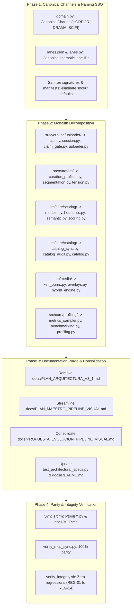

# Proposal: Purge Monoliths, Redundant Processes, and Fantasy Hardcoding

## Intent

Over successive feature iterations and rapid architectural transitions (notably from legacy procedural/WebGL pipelines to stream-copy loops, multi-act renderers, automated 24-hour performance scoring, and multi-channel expansion), several core modules in `yt-auto` have accumulated significant technical debt, cognitive overhead, and maintainability friction:

1. **Monolithic Sprawl & Budget Violations**: Multiple foundational modules violate the Single Responsibility Principle (SRP) and the ~100 executable lines per function budget mandated by [AGENTS.md](file:///home/moku/.gemini/antigravity-cli/worktrees/YouTubeChannels/purge_monoliths_and_redundancy/AGENTS.md) Rule 8.1. Chief among them:
   - [`src/youtube/uploader.py`](file:///home/moku/.gemini/antigravity-cli/worktrees/YouTubeChannels/purge_monoliths_and_redundancy/src/youtube/uploader.py) (1,721 lines): Amalgamates YouTube Data API v3 operations, a sprawling 557-line Playwright session upload function (`upload_video_via_playwright`), publication gate claiming, token refresh mechanics, and process supervision into a single file.
   - [`src/curators/text_splitter.py`](file:///home/moku/.gemini/antigravity-cli/worktrees/YouTubeChannels/purge_monoliths_and_redundancy/src/curators/text_splitter.py) (1,001 lines): Embeds hundreds of lines of static lane definitions and mood dictionaries alongside algorithmic sentence segmentation, tension curve calculations, and misleading file-level docstring aliases.
   - [`src/core/scoring.py`](file:///home/moku/.gemini/antigravity-cli/worktrees/YouTubeChannels/purge_monoliths_and_redundancy/src/core/scoring.py) (953 lines): Couples regex-based hook heuristics, word-count estimations, Gemini LLM semantic viral scoring, and database verdict formatting into one script.
   - [`src/core/catalog.py`](file:///home/moku/.gemini/antigravity-cli/worktrees/YouTubeChannels/purge_monoliths_and_redundancy/src/core/catalog.py) (943 lines): Couples core SQLite repository queries with a 204-line disk asset synchronization routine (`sync_catalog_from_assets`) and a 195-line catalog audit/deduplication sweep (`audit_and_cleanup`).
   - [`src/media/hybrid_engine.py`](file:///home/moku/.gemini/antigravity-cli/worktrees/YouTubeChannels/purge_monoliths_and_redundancy/src/media/hybrid_engine.py) (928 lines): Blends complex FFmpeg `zoompan` Ken Burns filter calculations, atmospheric PNG/motion overlay resolution, and multi-scene composition logic.
   - [`src/core/profiling.py`](file:///home/moku/.gemini/antigravity-cli/worktrees/YouTubeChannels/purge_monoliths_and_redundancy/src/core/profiling.py) (921 lines): Conflates low-level OS process metric sampling (`/proc` RSS reads, CPU clock ticks), stage timing context managers, telemetry serialization, and benchmark test harnesses.

2. **Redundant & Obsolete Documentation**: Documents explicitly marked purged or superseded remain in `docs/` (such as [`docs/PLAN_ARQUITECTURA_V3_1.md`](file:///home/moku/.gemini/antigravity-cli/worktrees/YouTubeChannels/purge_monoliths_and_redundancy/docs/PLAN_ARQUITECTURA_V3_1.md), 27.9 KB), violating the strict "Zero Resurrected Docs" policy ([AGENTS.md](file:///home/moku/.gemini/antigravity-cli/worktrees/YouTubeChannels/purge_monoliths_and_redundancy/AGENTS.md) Rule 1). Furthermore, visual pipeline blueprints ([`docs/PLAN_MAESTRO_PIPELINE_VISUAL.md`](file:///home/moku/.gemini/antigravity-cli/worktrees/YouTubeChannels/purge_monoliths_and_redundancy/docs/PLAN_MAESTRO_PIPELINE_VISUAL.md) [38.3 KB] and [`docs/PROPUESTA_EVOLUCION_PIPELINE_VISUAL.md`](file:///home/moku/.gemini/antigravity-cli/worktrees/YouTubeChannels/purge_monoliths_and_redundancy/docs/PROPUESTA_EVOLUCION_PIPELINE_VISUAL.md) [22.3 KB]) contain hundreds of lines of obsolete dead-end audits from January 2025 (e.g., SwiftShader CPU saturation, skia-python failures, ModernGL incompatibilities) that confuse agents and developers regarding active production standards.

3. **Hardcoding & Fantasy Channel Identifiers**: Historical fantasy channel identifiers (`"moku"` for horror/SCP and `"aelithia"` for drama/moral dilemmas) persist as hardcoded defaults across parameter signatures (`channel: str = "moku"`, `stamp_text="[MOKU]"`) in [`src/daemon.py`](file:///home/moku/.gemini/antigravity-cli/worktrees/YouTubeChannels/purge_monoliths_and_redundancy/src/daemon.py), [`src/scene_manifest.py`](file:///home/moku/.gemini/antigravity-cli/worktrees/YouTubeChannels/purge_monoliths_and_redundancy/src/scene_manifest.py), and configuration files, rather than standardizing canonical thematic channel domains (`"horror"`, `"drama"`, `"scifi"`).

4. **Code Bloat & Redundant Processing**: Dead helper branches, duplicate sanitization passes, and verbose boilerplate increase maintenance risk and cognitive burden without adding production value.

This proposal refactors these overgrown components into modular, single-responsibility modules respecting the ~100-line function budget; eradicates obsolete and historical documentation; canonicalizes channel domain models and defaults; and drives a massive net reduction in codebase lines while maintaining absolute zero regression on all test suites and [`./scripts/verify_integrity.sh`](file:///home/moku/.gemini/antigravity-cli/worktrees/YouTubeChannels/purge_monoliths_and_redundancy/scripts/verify_integrity.sh).

---

## Scope

### In Scope

- **Monolith Decomposition (6 Target Subsystems)**:
  - Decompose [`src/youtube/uploader.py`](file:///home/moku/.gemini/antigravity-cli/worktrees/YouTubeChannels/purge_monoliths_and_redundancy/src/youtube/uploader.py) into a modular sub-package (`src/youtube/uploader/` or focused sub-modules):
    - `api.py`: YouTube Data API v3 uploads, channel preflight, and video verification.
    - `session.py`: Playwright session upload engine, dialog interactions (`click_next`, `click_done`), cookie formatting, and PID lifecycle supervision. Break down `upload_video_via_playwright` (557 lines) into linear, granular stage functions ($\le 100$ lines each).
    - `claim_gate.py`: Publication gate lease claiming, transactional consumption, and database reconciliation.
    - `uploader.py` facade: Backwards-compatible public interface re-exporting canonical functions (`upload_video`, `preflight_youtube_api`, `verify_youtube_credentials_preflight`).
  - Decompose [`src/curators/text_splitter.py`](file:///home/moku/.gemini/antigravity-cli/worktrees/YouTubeChannels/purge_monoliths_and_redundancy/src/curators/text_splitter.py):
    - `curation_profiles.py`: Declarative lane configuration dictionaries and mood tables keyed by canonical thematic lanes.
    - `segmentation.py`: Sentence splitting, text sanitization, and act distribution logic.
    - `tension.py`: Progressive tension curve grading and audio pacing cues.
    - Retain lean `text_splitter.py` coordinating [`TextSegmentationEngine`](file:///home/moku/.gemini/antigravity-cli/worktrees/YouTubeChannels/purge_monoliths_and_redundancy/src/curators/text_splitter.py#L397) and alias [`CinematicScriptCuratorAgent`](file:///home/moku/.gemini/antigravity-cli/worktrees/YouTubeChannels/purge_monoliths_and_redundancy/src/curators/text_splitter.py#L1001).
  - Decompose [`src/core/scoring.py`](file:///home/moku/.gemini/antigravity-cli/worktrees/YouTubeChannels/purge_monoliths_and_redundancy/src/core/scoring.py):
    - `models.py`: Data contracts ([`HeuristicScoreReport`](file:///home/moku/.gemini/antigravity-cli/worktrees/YouTubeChannels/purge_monoliths_and_redundancy/src/core/scoring.py#L54), [`SemanticScoreReport`](file:///home/moku/.gemini/antigravity-cli/worktrees/YouTubeChannels/purge_monoliths_and_redundancy/src/core/scoring.py#L76), [`StoryScoringVerdict`](file:///home/moku/.gemini/antigravity-cli/worktrees/YouTubeChannels/purge_monoliths_and_redundancy/src/core/scoring.py#L104)).
    - `heuristics.py`: Fast rule-based heuristic scoring, spoken seconds estimation, and opening hook strength detection.
    - `semantic.py`: LLM viral potential prompt building, JSON parsing, and deterministic fallback evaluation.
    - Retain lean `scoring.py` orchestrating hybrid score computation and story filtering.
  - Decompose [`src/core/catalog.py`](file:///home/moku/.gemini/antigravity-cli/worktrees/YouTubeChannels/purge_monoliths_and_redundancy/src/core/catalog.py):
    - `catalog_sync.py`: Disk asset scanning, metadata probing via FFprobe, and SHA256 registration.
    - `catalog_audit.py`: Database integrity verification, orphaned loop pruning, and dark/monochrome detection.
    - Retain lean `catalog.py` for [`LoopRecord`](file:///home/moku/.gemini/antigravity-cli/worktrees/YouTubeChannels/purge_monoliths_and_redundancy/src/core/catalog.py#L157) and [`LoopCatalogRepository`](file:///home/moku/.gemini/antigravity-cli/worktrees/YouTubeChannels/purge_monoliths_and_redundancy/src/core/catalog.py#L195) SQL queries and usage tracking.
  - Decompose [`src/media/hybrid_engine.py`](file:///home/moku/.gemini/antigravity-cli/worktrees/YouTubeChannels/purge_monoliths_and_redundancy/src/media/hybrid_engine.py):
    - `ken_burns.py`: Ken Burns zoompan filter builder, still segment duration planning, and easing parameters.
    - `overlays.py`: Static PNG and motion overlay discovery, asset resolution, and alpha opacity clamping.
    - Retain lean `hybrid_engine.py` orchestrating video rendering passes.
  - Decompose [`src/core/profiling.py`](file:///home/moku/.gemini/antigravity-cli/worktrees/YouTubeChannels/purge_monoliths_and_redundancy/src/core/profiling.py):
    - `metrics_sampler.py`: Low-level OS RSS memory reading, CPU time sampling, and formatting helpers.
    - `benchmarking.py`: Synthetic benchmark cycle execution harness (`run_benchmark_cycle`).
    - Retain `profiling.py` for [`CanonicalStage`](file:///home/moku/.gemini/antigravity-cli/worktrees/YouTubeChannels/purge_monoliths_and_redundancy/src/core/profiling.py#L33), [`PhaseTimer`](file:///home/moku/.gemini/antigravity-cli/worktrees/YouTubeChannels/purge_monoliths_and_redundancy/src/core/profiling.py#L437), and [`PipelineProfiler`](file:///home/moku/.gemini/antigravity-cli/worktrees/YouTubeChannels/purge_monoliths_and_redundancy/src/core/profiling.py#L616).
- **Redundant Docs & Blueprint Streamlining**:
  - Permanently remove [`docs/PLAN_ARQUITECTURA_V3_1.md`](file:///home/moku/.gemini/antigravity-cli/worktrees/YouTubeChannels/purge_monoliths_and_redundancy/docs/PLAN_ARQUITECTURA_V3_1.md) (obsolete historical plan).
  - Streamline and consolidate [`docs/PLAN_MAESTRO_PIPELINE_VISUAL.md`](file:///home/moku/.gemini/antigravity-cli/worktrees/YouTubeChannels/purge_monoliths_and_redundancy/docs/PLAN_MAESTRO_PIPELINE_VISUAL.md) and [`docs/PROPUESTA_EVOLUCION_PIPELINE_VISUAL.md`](file:///home/moku/.gemini/antigravity-cli/worktrees/YouTubeChannels/purge_monoliths_and_redundancy/docs/PROPUESTA_EVOLUCION_PIPELINE_VISUAL.md), eliminating dead-end audit history (skia-python, ModernGL, SwiftShader) while preserving the active production architecture specification and required section anchors.
  - Update [`tests/unit/test_architectural_specs.py`](file:///home/moku/.gemini/antigravity-cli/worktrees/YouTubeChannels/purge_monoliths_and_redundancy/tests/unit/test_architectural_specs.py) and [`docs/README.md`](file:///home/moku/.gemini/antigravity-cli/worktrees/YouTubeChannels/purge_monoliths_and_redundancy/docs/README.md) to reflect the purged documents.
- **Hardcoding & Fantasy Name Elimination**:
  - Standardize [`CanonicalChannel`](file:///home/moku/.gemini/antigravity-cli/worktrees/YouTubeChannels/purge_monoliths_and_redundancy/src/core/domain.py#L11) with canonical thematic values `HORROR = "horror"`, `DRAMA = "drama"`, and `SCIFI = "scifi"`, relegating `MOKU` and `AELITHIA` to backwards-compatible aliases.
  - Standardize canonical lane IDs in [`config/lanes.json`](file:///home/moku/.gemini/antigravity-cli/worktrees/YouTubeChannels/purge_monoliths_and_redundancy/config/lanes.json) and [`src/core/lanes.py`](file:///home/moku/.gemini/antigravity-cli/worktrees/YouTubeChannels/purge_monoliths_and_redundancy/src/core/lanes.py) (`horror-scp-shorts`, `horror-horror-long`, `drama-aita-long`, `drama-drama-shorts`).
  - Sanitize hardcoded defaults across parameter signatures: `channel: str = "horror"`, dynamic channel resolution, and elimination of `stamp_text="[MOKU]"` defaults in [`src/scene_manifest.py`](file:///home/moku/.gemini/antigravity-cli/worktrees/YouTubeChannels/purge_monoliths_and_redundancy/src/scene_manifest.py) and [`src/daemon.py`](file:///home/moku/.gemini/antigravity-cli/worktrees/YouTubeChannels/purge_monoliths_and_redundancy/src/daemon.py).
  - Synchronize MCP tool parameter descriptions in `src/mcp/tools/` and [`docs/MCP.md`](file:///home/moku/.gemini/antigravity-cli/worktrees/YouTubeChannels/purge_monoliths_and_redundancy/docs/MCP.md).
- **Mass Line Reduction & Integrity Validation**:
  - Achieve a net reduction of $> 1,500$ lines in Python source code and $> 800$ lines in redundant documentation.
  - Zero regressions across the full pytest suite.
  - Complete compliance with [`./scripts/verify_integrity.sh`](file:///home/moku/.gemini/antigravity-cli/worktrees/YouTubeChannels/purge_monoliths_and_redundancy/scripts/verify_integrity.sh) and `scripts/verify_mcp_sync.py`.

### Out of Scope

- Changing OS user home directory names (e.g., `/home/moku`) or system-level service user definitions.
- Renaming raw video loop assets stored on disk (`assets/loops/moku_*`); asset files remain indexed by SHA256 hashes and thematic tags (`horror`, `drama`).
- Purging or altering historic database rows in `shorts_queue.db` or `review_state.db` that already store `'moku'` or `'aelithia'` strings; backwards-compatible alias resolution handles legacy values transparently.
- Modifying core video mastering or encoding standards (stream-copy `-c:v copy`, EBU R128 mastering at -14 LUFS, libass subtitles).
- Adding new external third-party dependencies or libraries.

---

## Capabilities

### New Capabilities

None. This architectural refactoring focuses on decomposition, maintainability, process streamlining, and governance enforcement without introducing net-new functional subsystems.

### Modified Capabilities

- `legacy-eradication-guardrails`:
  - Enforce the "Zero Resurrected Docs" policy in `docs/` by explicitly prohibiting obsolete blueprints (`PLAN_ARQUITECTURA_V3_1.md`).
  - Enforce the ~100 executable lines per function budget ([AGENTS.md](file:///home/moku/.gemini/antigravity-cli/worktrees/YouTubeChannels/purge_monoliths_and_redundancy/AGENTS.md) Rule 8.1) across core subsystems.
  - Prohibit hardcoded fantasy channel strings in default function signatures and manifest defaults.
- `multi-channel-lanes-and-smoke-test`:
  - Promote thematic identifiers (`horror`, `drama`, `scifi`) to canonical domain models and primary lane IDs (`horror-scp-shorts`, `horror-horror-long`, `drama-aita-long`, `drama-drama-shorts`).
  - Maintain bidirectional backwards-compatible alias resolution for `moku` and `aelithia`.
- `video-performance-scoring`:
  - Modularize empirical and semantic scoring engines into decoupled components without altering scoring formulas, score distributions ($0-100$), or sub-millisecond SQLite query latencies ($< 5\text{ ms}$).
- `channel-purge-control`:
  - Update default target channels and parameters from `'moku'` to canonical `'horror'`, maintaining seamless alias support.
- `media-processing-performance-policy`:
  - Guarantee that modularizing `hybrid_engine.py` and Ken Burns filter builders retains stream-copy `-c:v copy` eligibility, volatile RAM temp audio allocation (`/dev/shm`), and single-pass FFmpeg mastering.

---

## Approach



### Detailed Phasing

1. **Phase 1: Canonical Channels & Naming SSOT**:
   - In [`src/core/domain.py`](file:///home/moku/.gemini/antigravity-cli/worktrees/YouTubeChannels/purge_monoliths_and_redundancy/src/core/domain.py), redefine `CanonicalChannel` with `HORROR = "horror"`, `DRAMA = "drama"`, and `SCIFI = "scifi"` as the canonical enum values. Map `MOKU` to `HORROR` and `AELITHIA` to `DRAMA` in `CHANNEL_ALIASES` and enum attributes.
   - Update canonical lane definitions in [`config/lanes.json`](file:///home/moku/.gemini/antigravity-cli/worktrees/YouTubeChannels/purge_monoliths_and_redundancy/config/lanes.json) and [`src/core/lanes.py`](file:///home/moku/.gemini/antigravity-cli/worktrees/YouTubeChannels/purge_monoliths_and_redundancy/src/core/lanes.py) to `horror-scp-shorts`, `horror-horror-long`, `drama-aita-long`, and `drama-drama-shorts`. Provide explicit entries in `LANE_ALIASES` for all legacy configurations.
   - Replace magic string defaults (`channel: str = "moku"`, `stamp_text="[MOKU]"`) in [`src/scene_manifest.py`](file:///home/moku/.gemini/antigravity-cli/worktrees/YouTubeChannels/purge_monoliths_and_redundancy/src/scene_manifest.py) and [`src/daemon.py`](file:///home/moku/.gemini/antigravity-cli/worktrees/YouTubeChannels/purge_monoliths_and_redundancy/src/daemon.py) with canonical `"horror"` or dynamic channel derivation.

2. **Phase 2: Monolith Decomposition (< 100-line Function Budget)**:
   - **`src/youtube/uploader.py`**:
     - Decompose into `src/youtube/uploader/` sub-package or focused helper modules.
     - Move YouTube Data API v3 operations into `api.py`.
     - Move Playwright session execution into `session.py`. Refactor the 557-line `upload_video_via_playwright` into linear, testable sub-steps: `_init_playwright_context()`, `_navigate_and_check_auth()`, `_upload_file_payload()`, `_fill_video_metadata()`, `_select_visibility()`, and `_await_processing()`.
     - Move publication claiming and reconciliation into `claim_gate.py`.
     - Maintain `uploader.py` as a facade preserving public functions and error classes.
   - **`src/curators/text_splitter.py`**:
     - Extract `LANE_CURATION_CONFIGS` and static mood catalogs into `src/curators/curation_profiles.py`, keyed by canonical lane IDs.
     - Extract text chunking, sentence splitting, and act distribution into `src/curators/segmentation.py`.
     - Extract tension curve interpolation and pacing cues into `src/curators/tension.py`.
     - Re-export `TextSegmentationEngine` and `CinematicScriptCuratorAgent` alias in `src/curators/text_splitter.py`.
   - **`src/core/scoring.py`**:
     - Extract dataclasses into `src/core/scoring/models.py`.
     - Extract regex pattern matching, hook detection, and word-budget logic into `src/core/scoring/heuristics.py`.
     - Extract LLM prompt formatting, JSON parsing, and deterministic fallback scoring into `src/core/scoring/semantic.py`.
     - Maintain public scoring coordinator functions in `src/core/scoring.py`.
   - **`src/core/catalog.py`**:
     - Extract 204-line `sync_catalog_from_assets` and FFprobe inspection into `src/core/catalog_sync.py`.
     - Extract 195-line `audit_and_cleanup` and integrity verification into `src/core/catalog_audit.py`.
     - Keep `LoopRecord` and `LoopCatalogRepository` focused strictly on database querying and usage tracking.
   - **`src/media/hybrid_engine.py`**:
     - Extract Ken Burns zoompan filter builder and segment planning into `src/media/ken_burns.py`.
     - Extract overlay resolution and alpha opacity clamping into `src/media/overlays.py`.
     - Refactor `HybridVideoEngine` to orchestrate composition cleanly without monolithic methods.
   - **`src/core/profiling.py`**:
     - Extract low-level `/proc` memory sampling and CPU timing into `src/core/profiling/metrics_sampler.py`.
     - Extract `run_benchmark_cycle` into `src/core/profiling/benchmarking.py`.
     - Retain `CanonicalStage`, `PhaseTimer`, and `PipelineProfiler` in `src/core/profiling.py`.

3. **Phase 3: Documentation Purge & Blueprint Streamlining**:
   - Delete [`docs/PLAN_ARQUITECTURA_V3_1.md`](file:///home/moku/.gemini/antigravity-cli/worktrees/YouTubeChannels/purge_monoliths_and_redundancy/docs/PLAN_ARQUITECTURA_V3_1.md).
   - Streamline [`docs/PLAN_MAESTRO_PIPELINE_VISUAL.md`](file:///home/moku/.gemini/antigravity-cli/worktrees/YouTubeChannels/purge_monoliths_and_redundancy/docs/PLAN_MAESTRO_PIPELINE_VISUAL.md) and [`docs/PROPUESTA_EVOLUCION_PIPELINE_VISUAL.md`](file:///home/moku/.gemini/antigravity-cli/worktrees/YouTubeChannels/purge_monoliths_and_redundancy/docs/PROPUESTA_EVOLUCION_PIPELINE_VISUAL.md), stripping obsolete failed experiments (skia-python, ModernGL, SwiftShader) while retaining essential technical sections required by [`tests/unit/test_architectural_specs.py`](file:///home/moku/.gemini/antigravity-cli/worktrees/YouTubeChannels/purge_monoliths_and_redundancy/tests/unit/test_architectural_specs.py).
   - Update `EXPECTED_DOCS` in `tests/unit/test_architectural_specs.py` and remove references in [`docs/README.md`](file:///home/moku/.gemini/antigravity-cli/worktrees/YouTubeChannels/purge_monoliths_and_redundancy/docs/README.md).

4. **Phase 4: Parity & Integrity Verification**:
   - Update MCP tool parameters in `src/mcp/tools/*.py` and [`docs/MCP.md`](file:///home/moku/.gemini/antigravity-cli/worktrees/YouTubeChannels/purge_monoliths_and_redundancy/docs/MCP.md).
   - Run `python3 scripts/verify_mcp_sync.py` to confirm 100% bidirectional parity across tools, resources, and prompts.
   - Run unit test suites and [`./scripts/verify_integrity.sh`](file:///home/moku/.gemini/antigravity-cli/worktrees/YouTubeChannels/purge_monoliths_and_redundancy/scripts/verify_integrity.sh) ensuring all 14 anti-regression invariants pass cleanly.

---

## Affected Areas

| Area / File | Impact | Description |
|---|---|---|
| [`src/core/domain.py`](file:///home/moku/.gemini/antigravity-cli/worktrees/YouTubeChannels/purge_monoliths_and_redundancy/src/core/domain.py) | Modified | Invert `CanonicalChannel` to canonical `HORROR`, `DRAMA`, `SCIFI`; maintain `MOKU`/`AELITHIA` aliases. |
| [`config/lanes.json`](file:///home/moku/.gemini/antigravity-cli/worktrees/YouTubeChannels/purge_monoliths_and_redundancy/config/lanes.json) | Modified | Update primary lane IDs to thematic conventions (`horror-*`, `drama-*`). |
| [`src/core/lanes.py`](file:///home/moku/.gemini/antigravity-cli/worktrees/YouTubeChannels/purge_monoliths_and_redundancy/src/core/lanes.py) | Modified | Update lane profiles and register bidirectional `LANE_ALIASES`. |
| [`src/scene_manifest.py`](file:///home/moku/.gemini/antigravity-cli/worktrees/YouTubeChannels/purge_monoliths_and_redundancy/src/scene_manifest.py) | Modified | Remove `stamp_text="[MOKU]"` default; update default `channel_name` to `"horror"`. |
| [`src/daemon.py`](file:///home/moku/.gemini/antigravity-cli/worktrees/YouTubeChannels/purge_monoliths_and_redundancy/src/daemon.py) | Modified | Sanitize default channel arguments (`channel: str = "horror"`) and friendly lane descriptions. |
| [`src/youtube/uploader.py`](file:///home/moku/.gemini/antigravity-cli/worktrees/YouTubeChannels/purge_monoliths_and_redundancy/src/youtube/uploader.py) | Modified | Decompose 1721-line monolith; extract API, session Playwright, and claim gate logic. |
| `src/youtube/uploader/` | Added | Modular sub-package containing `api.py`, `session.py`, and `claim_gate.py`. |
| [`src/curators/text_splitter.py`](file:///home/moku/.gemini/antigravity-cli/worktrees/YouTubeChannels/purge_monoliths_and_redundancy/src/curators/text_splitter.py) | Modified | Decompose 1001-line file; extract static configs, segmentation algorithms, and tension curves. |
| `src/curators/curation_profiles.py` | Added | Declarative lane curation configs and mood tables keyed by canonical thematic lanes. |
| `src/curators/segmentation.py` | Added | Algorithmic text chunking, sentence splitting, and act distribution logic. |
| `src/curators/tension.py` | Added | Progressive tension curve calculations and audio pacing cues. |
| [`src/core/scoring.py`](file:///home/moku/.gemini/antigravity-cli/worktrees/YouTubeChannels/purge_monoliths_and_redundancy/src/core/scoring.py) | Modified | Decompose 953-line file; separate heuristics, semantic evaluation, and score reporting. |
| `src/core/scoring/` | Added | Modular sub-package containing `models.py`, `heuristics.py`, and `semantic.py`. |
| [`src/core/catalog.py`](file:///home/moku/.gemini/antigravity-cli/worktrees/YouTubeChannels/purge_monoliths_and_redundancy/src/core/catalog.py) | Modified | Decompose 943-line file; extract asset disk sync and catalog integrity maintenance. |
| `src/core/catalog_sync.py` | Added | Asset filesystem scanning and FFprobe metadata extraction. |
| `src/core/catalog_audit.py` | Added | Catalog health audits, orphan removal, and SHA256 integrity verification. |
| [`src/media/hybrid_engine.py`](file:///home/moku/.gemini/antigravity-cli/worktrees/YouTubeChannels/purge_monoliths_and_redundancy/src/media/hybrid_engine.py) | Modified | Decompose 928-line file; extract Ken Burns zoompan math and overlay resolution. |
| `src/media/ken_burns.py` | Added | Ken Burns zoompan filter builder and still segment duration planning. |
| `src/media/overlays.py` | Added | Atmospheric PNG/motion overlay asset discovery and alpha opacity clamping. |
| [`src/core/profiling.py`](file:///home/moku/.gemini/antigravity-cli/worktrees/YouTubeChannels/purge_monoliths_and_redundancy/src/core/profiling.py) | Modified | Decompose 921-line file; extract OS process sampling and benchmark cycle harness. |
| `src/core/profiling/` | Added | Modular sub-package containing `metrics_sampler.py` and `benchmarking.py`. |
| [`docs/PLAN_ARQUITECTURA_V3_1.md`](file:///home/moku/.gemini/antigravity-cli/worktrees/YouTubeChannels/purge_monoliths_and_redundancy/docs/PLAN_ARQUITECTURA_V3_1.md) | Removed | Eradicate obsolete superseded blueprint per Zero Resurrected Docs policy. |
| [`docs/PLAN_MAESTRO_PIPELINE_VISUAL.md`](file:///home/moku/.gemini/antigravity-cli/worktrees/YouTubeChannels/purge_monoliths_and_redundancy/docs/PLAN_MAESTRO_PIPELINE_VISUAL.md) | Modified | Strip obsolete historical audit retrospectives while preserving active architecture. |
| [`docs/PROPUESTA_EVOLUCION_PIPELINE_VISUAL.md`](file:///home/moku/.gemini/antigravity-cli/worktrees/YouTubeChannels/purge_monoliths_and_redundancy/docs/PROPUESTA_EVOLUCION_PIPELINE_VISUAL.md) | Modified | Consolidate and eliminate duplicate historical retrospective sections. |
| [`docs/README.md`](file:///home/moku/.gemini/antigravity-cli/worktrees/YouTubeChannels/purge_monoliths_and_redundancy/docs/README.md) | Modified | Remove references to purged `PLAN_ARQUITECTURA_V3_1.md`. |
| [`docs/MCP.md`](file:///home/moku/.gemini/antigravity-cli/worktrees/YouTubeChannels/purge_monoliths_and_redundancy/docs/MCP.md) | Modified | Synchronize tool parameter descriptions with canonical thematic channel names. |
| `src/mcp/tools/*.py` | Modified | Update tool parameter descriptions to canonical channel identifiers (`horror`, `drama`, `scifi`). |
| [`tests/unit/test_architectural_specs.py`](file:///home/moku/.gemini/antigravity-cli/worktrees/YouTubeChannels/purge_monoliths_and_redundancy/tests/unit/test_architectural_specs.py) | Modified | Update `EXPECTED_DOCS` to reflect purged architecture documents. |
| `tests/unit/` | Modified | Update unit tests to validate canonical channels while verifying backwards-compatible aliases. |

---

## Media Processing Performance Impact

- **Zero Re-encoding Overhead**: Modularization of [`src/media/hybrid_engine.py`](file:///home/moku/.gemini/antigravity-cli/worktrees/YouTubeChannels/purge_monoliths_and_redundancy/src/media/hybrid_engine.py) and extraction of Ken Burns zoompan filter builders into `src/media/ken_burns.py` generates bit-exact identical FFmpeg filtergraphs. Stream-copy video composition (`-c:v copy`) and EBU R128 audio mastering remain completely untouched.
- **Resource Target Budget Adherence**: In accordance with [AGENTS.md](file:///home/moku/.gemini/antigravity-cli/worktrees/YouTubeChannels/purge_monoliths_and_redundancy/AGENTS.md) Rule 5 and invariant REG-14, memory usage remains strictly bounded within $\le 2.0$ GiB RAM and CPU load within $\le 2$ Cores. Intermediate audio allocation continues to use volatile `/dev/shm` RAM storage.
- **Sub-Millisecond Query Latencies**: Modularization of [`src/core/catalog.py`](file:///home/moku/.gemini/antigravity-cli/worktrees/YouTubeChannels/purge_monoliths_and_redundancy/src/core/catalog.py) and [`src/core/scoring.py`](file:///home/moku/.gemini/antigravity-cli/worktrees/YouTubeChannels/purge_monoliths_and_redundancy/src/core/scoring.py) preserves all SQLite B-tree indices (`publications(actual_success_score)`, `publications(video_sha256)`, `video_loops(sha256)`), maintaining sub-millisecond query response times ($< 5\text{ ms}$).

---

## Risks

| Risk | Likelihood | Impact | Mitigation |
|---|---|---|---|
| **Broken external imports following module decomposition** | Medium | High | Maintain transparent backwards-compatible facades (`__init__.py` and module-level re-exports) in `src/youtube/uploader.py`, `src/curators/text_splitter.py`, `src/core/scoring.py`, `src/core/catalog.py`, `src/media/hybrid_engine.py`, and `src/core/profiling.py`. |
| **MCP parity drift failure during integrity check** | Medium | High | Update `docs/MCP.md` and `src/mcp/tools/*.py` simultaneously, validating with `scripts/verify_mcp_sync.py` prior to running `./scripts/verify_integrity.sh`. |
| **Architectural documentation test failure on purged docs** | High | High | Synchronously update `EXPECTED_DOCS` in `tests/unit/test_architectural_specs.py` when removing `docs/PLAN_ARQUITECTURA_V3_1.md`. Ensure preserved section anchors in visual plans match test assertions. |
| **Playwright session upload automation regression** | Medium | Medium | Maintain identical DOM selectors, wait states, and timing thresholds while decomposing `upload_video_via_playwright` into granular helper functions. |
| **Database CHECK constraint failure on thematic channel names** | Medium | Medium | Verify that SQLite table definitions in `src/core/repository/migrations.py` allow `'horror'`, `'drama'`, and `'scifi'` without constraint errors. |
| **OAuth token lookup failure** | Low | Low | Resolve tokens using `CHANNEL_ALIASES`, checking for canonical files (`tokens/horror.json`) with automated fallback to legacy filenames (`tokens/moku.json`). |

---

## Rollback Plan

1. **Git Branch Revert**: Because all module decompositions preserve top-level facades and re-export legacy aliases, any unexpected regression can be cleanly rolled back using standard git operations:
   ```bash
   git checkout main -- src/ docs/ config/ tests/
   ```
2. **Database Invariant Safety**: No destructive database schema migrations or column drops are executed. All SQLite tables continue to accept both canonical thematic identifiers and legacy fantasy identifiers through the alias layer, ensuring zero data corruption or unrecoverable state upon rollback.

---

## Dependencies

- **Runtime & Build Tools**: Python 3.12 / 3.13, FFmpeg (`libass`, `scale`, `zoompan`, `ebur128`), SQLite3 WAL.
- **Python Libraries**: `pydantic`, `jsonschema`, `pillow`, `edge-tts`, `pytest`.
- **Zero Third-Party Bloat**: No new packages or external dependencies are introduced.

---

## Success Criteria

- [ ] All 6 overgrown files (`uploader.py`, `text_splitter.py`, `scoring.py`, `catalog.py`, `hybrid_engine.py`, `profiling.py`) are modularized into single-responsibility components with all individual functions strictly respecting the ~100-line budget ([AGENTS.md](file:///home/moku/.gemini/antigravity-cli/worktrees/YouTubeChannels/purge_monoliths_and_redundancy/AGENTS.md) Rule 8.1).
- [ ] Obsolete blueprint [`docs/PLAN_ARQUITECTURA_V3_1.md`](file:///home/moku/.gemini/antigravity-cli/worktrees/YouTubeChannels/purge_monoliths_and_redundancy/docs/PLAN_ARQUITECTURA_V3_1.md) is permanently deleted, and visual pipeline blueprints are streamlined without broken references.
- [ ] `CanonicalChannel` establishes `HORROR = "horror"` and `DRAMA = "drama"` as primary domain models, with backwards-compatible aliases for `MOKU` and `AELITHIA`.
- [ ] Production lane IDs in [`config/lanes.json`](file:///home/moku/.gemini/antigravity-cli/worktrees/YouTubeChannels/purge_monoliths_and_redundancy/config/lanes.json) are standardized to thematic names (`horror-scp-shorts`, `horror-horror-long`, `drama-aita-long`, `drama-drama-shorts`).
- [ ] Zero hardcoded `"moku"` defaults in public signatures and manifests (e.g., `stamp_text="[MOKU]"` eliminated from [`src/scene_manifest.py`](file:///home/moku/.gemini/antigravity-cli/worktrees/YouTubeChannels/purge_monoliths_and_redundancy/src/scene_manifest.py)).
- [ ] Codebase achieves a net reduction of $> 1,500$ lines in Python code and $> 800$ lines in documentation.
- [ ] Pytest test suite maintains 100% collectability and all unit/integration tests pass.
- [ ] `python3 scripts/verify_mcp_sync.py` passes with 100% bidirectional parity.
- [ ] [`./scripts/verify_integrity.sh`](file:///home/moku/.gemini/antigravity-cli/worktrees/YouTubeChannels/purge_monoliths_and_redundancy/scripts/verify_integrity.sh) exits with code 0 and all 14 anti-regression invariants green.
