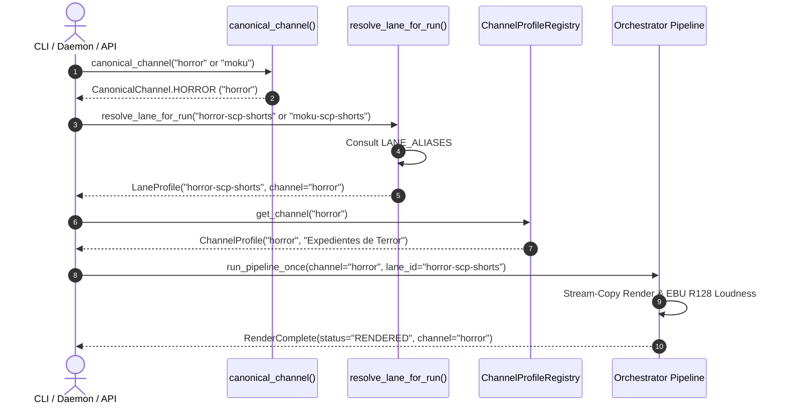

# Technical Design: Replace Nonsensical Channel and Lane Names

## Overview

This technical design outlines the refactoring strategy to invert the internal channel and lane hierarchy from legacy, idiosyncratic names (`moku`, `aelithia`) to canonical thematic identifiers (`horror`, `drama`, `scifi`).

The goal is to establish `horror` and `drama` as first-class citizens across all data structures, functions, configuration documents, and tool definitions, while deploying a transparent backwards-compatibility alias layer so that legacy databases, in-flight queue jobs, session tokens, and CLI invocations continue functioning seamlessly.

## Architecture Decisions (ADR)

### ADR-1: Invert `CanonicalChannel` Enum and Alias Map
- **Context**: Currently, `CanonicalChannel.MOKU = "moku"` and `CanonicalChannel.AELITHIA = "aelithia"`, with `CanonicalChannel.HORROR = CanonicalChannel.MOKU`.
- **Decision**: Define:
  ```python
  class CanonicalChannel(str, Enum):
      HORROR = "horror"
      DRAMA = "drama"
      SCIFI = "scifi"
  ```
  Provide module-level alias properties:
  ```python
  CanonicalChannel.MOKU = CanonicalChannel.HORROR
  CanonicalChannel.AELITHIA = CanonicalChannel.DRAMA
  ```
  In `CHANNEL_ALIASES`, register `"moku": CanonicalChannel.HORROR` and `"aelithia": CanonicalChannel.DRAMA`.
- **Rationale**: Keeps `horror`, `drama`, and `scifi` as the only canonical string values when calling `.value` or `str(channel)`, matching `config/channels/` filenames and `config/channels.json` declarations, while retaining 100% type safety and backward compatibility for code referencing `.MOKU` or `.AELITHIA`.

### ADR-2: Symmetrical Bidirectional Lane Aliasing
- **Context**: `config/lanes.json` currently uses `moku-scp-shorts`, `moku-horror-long`, `aelithia-aita-long`, `aelithia-drama-shorts`.
- **Decision**:
  1. Update `config/lanes.json` with canonical IDs:
     - `horror-scp-shorts` (channel: `"horror"`)
     - `horror-horror-long` (channel: `"horror"`)
     - `drama-aita-long` (channel: `"drama"`)
     - `drama-drama-shorts` (channel: `"drama"`)
     - `scifi-singularity-shorts` (channel: `"scifi"`)
     - `scifi-singularity-long` (channel: `"scifi"`)
  2. In `src/core/lanes.py`, `LANE_ALIASES` will map:
     ```python
     LANE_ALIASES = {
         "moku-scp-shorts": "horror-scp-shorts",
         "moku-horror-long": "horror-horror-long",
         "horror-shorts": "horror-scp-shorts",
         "horror-long": "horror-horror-long",
         "aelithia-drama-shorts": "drama-drama-shorts",
         "aelithia-aita-long": "drama-aita-long",
         "drama-shorts": "drama-drama-shorts",
         "drama-long": "drama-aita-long",
         "aita-long": "drama-aita-long",
         "relatos-shorts": "drama-drama-shorts",
         "relatos-long": "drama-aita-long",
     }
     ```
- **Rationale**: Any tool, operator, or script querying either the new thematic name or the legacy fantasy name reaches the exact same lane profile.

### ADR-3: Standardize Voice Profile Identifiers
- **Context**: `config/voice_profiles.json` has `moku_terror` and `aelithia_reddit`.
- **Decision**: Define `horror_terror` and `drama_reddit` as the canonical keys in `config/voice_profiles.json`, copying/aliasing the profiles so that both the canonical and legacy keys are valid in the catalog. In `src/core/lanes.py`, resolve `horror_terror` and `drama_reddit` by default for horror and drama lanes.
- **Rationale**: Prevents TTS failures if an existing database job references `moku_terror`, while guaranteeing newly generated lanes use `horror_terror`.

### ADR-4: Database Schema Check Constraint Relaxation
- **Context**: `video_analytics_snapshots` in `src/core/repository/migrations.py` has `CHECK(channel IN ('moku', 'aelithia'))`.
- **Decision**: Update the migration table definition to `CHECK(channel IN ('horror', 'drama', 'scifi', 'moku', 'aelithia'))`.
- **Rationale**: Prevents SQLite integrity errors when recording metrics for newly generated videos on canonical channels.

## Sequence Diagram: Channel & Lane Resolution Flow



## Threat Matrix & Failure Modes

| # | Threat / Failure Mode | Planned Safe Behavior (RED Test) |
|---|-----------------------|----------------------------------|
| TM-1 | Caller passes legacy `"moku"` or `"aelithia"` string | Resolves cleanly to `CanonicalChannel.HORROR` or `CanonicalChannel.DRAMA` without raising `ValueError` or `AttributeError`. |
| TM-2 | Job in queue requests legacy `lane_id="moku-horror-long"` | `resolve_lane_for_run` maps through `LANE_ALIASES` to `horror-horror-long` and executes successfully. |
| TM-3 | Caller queries voice profile for `"horror"` | Returns `horror_terror` configuration matching 4800K kelvin and -14 LUFS standards. |
| TM-4 | Analytics snapshot recorded for `"horror"` or `"drama"` | SQLite table accepts the insert without violating `CHECK(channel IN ...)` constraint. |
| TM-5 | MCP server inspected by `scripts/verify_mcp_sync.py` | 100% parity across tool docstrings in `src/mcp/tools/` and `docs/MCP.md`. |

## File Modifications Breakdown

1. `src/core/domain.py`: Invert `CanonicalChannel` enum, update `CHANNEL_ALIASES`.
2. `config/lanes.json`: Rename production lanes to `horror-scp-shorts`, `horror-horror-long`, `drama-drama-shorts`, `drama-aita-long`.
3. `src/core/lanes.py`: Update `FALLBACK_LANE_DOCUMENTS`, `LANE_ALIASES`, and voice profile fallbacks.
4. `config/voice_profiles.json`: Add canonical `horror_terror` and `drama_reddit` keys with backwards aliases.
5. `src/daemon.py`: Update defaults `channel: str = "horror"`, and update `_friendly_name()`.
6. `src/scene_manifest.py`: Sanitize `stamp_text="[CLASSIFIED]"`, default `channel_name="horror"`.
7. `src/templates/narratives.py`: Expose `build_horror_*` and `build_drama_*` as primary functions.
8. `src/templates/longform_stories.py`: Expose `HORROR_STORIES` and `DRAMA_STORIES`.
9. `src/curators/text_splitter.py`: Key `LANE_CURATION_CONFIGS` by canonical lane IDs.
10. `src/core/repository/migrations.py`: Update `video_analytics_snapshots` check constraint.
11. `src/mcp/tools/*.py` & `docs/MCP.md`: Synchronize tool parameter descriptions to `('horror', 'drama', 'scifi')`.
12. `tests/`: Update unit tests in `tests/unit/test_channel_domain_dynamic.py`, `tests/unit/test_channels_lanes.py`, `tests/unit/test_scene_manifest_clean_schema.py`.
