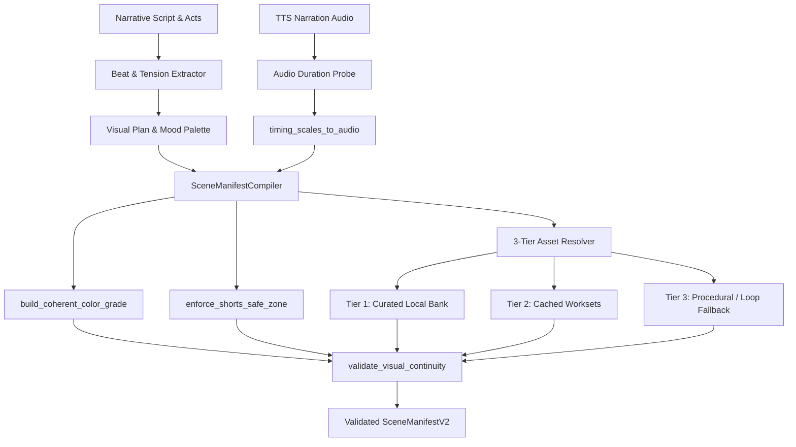
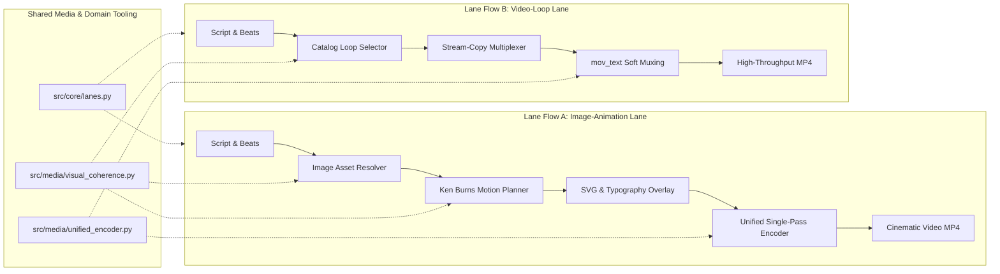

# Proposal: Visual Coherence System and Independent Parallel Production Lanes

## 1. Intent & Context

The media production pipeline currently operates with fragmented visual orchestration and monolithic lane assumptions:
1. **Fragmented Visual-Script Synchronization**: Although foundational utilities exist in `src/media/visual_coherence.py` (color grading curves, safe zone margins, and scene duration scaling), the generation and selection of visual elements (still backgrounds, thematic loops, and AI/reference assets) lack end-to-end synchronization with narrative acts, script beats, and emotional tension progression.
2. **Visual Monotony vs. Motion Design Standards**: Catalog looping videos provide excellent operational throughput via stream-copy (`-c:v copy`), but still imagery or multi-scene narrative segments risk visual stagnation without dynamic motion design. To achieve broadcast-grade aesthetic appeal, the pipeline requires automated Ken Burns camera motion (smoothstep easing, segment splitting), dynamic SVG kinetic typography conforming to YouTube Shorts UI safe margins, and tension-harmonized scene transitions.
3. **Absence of Independent Parallel Lanes**: Production lanes currently combine disparate visual paradigms under generic "beats" or "director" modes. An **Image-Animation Lane** (still asset generation, Ken Burns camera animation, kinetic SVG typography, tension crossfades) and a **Video-Loop Lane** (thematic catalog loops, stream-copy muxing, high-throughput atmospheric storytelling) have fundamentally different CPU, memory, and latency profiles. They must operate as independent, non-interfering parallel production lanes without cross-lane interference, while sharing common underlying tooling (`src/media/visual_coherence.py`, `src/media/unified_encoder.py`, `src/core/lanes.py`) to prevent code duplication, drift, and maintenance overhead.
4. **Strict Resource Target Governance (AGENTS.md Section 5 & REG-14)**: All architectural designs must strictly enforce the project's hard target ceiling of **≤ 2 CPU Cores** (≤ 200% thread aggregate) and **≤ 2.0 GiB RAM** (2,048 MiB peak resident memory). Steady-state idle resource consumption must remain at absolute zero, video-loop composition must prioritize stream-copy, and image-animation compositing must utilize disk streaming and single-frame buffer reuse rather than holding unbounded frame sequences in memory.

This proposal establishes the comprehensive architectural blueprint for the Visual Coherence System, elevates animation and motion design assets, and formalizes independent parallel production lanes sharing a hardened, unified media toolset.

---

## 2. Scope

### In Scope
- **Visual Coherence System (`src/media/visual_coherence.py`, `src/media/manifest_compiler.py`, `src/agents/`)**:
  - Narrative beat synchronization: Proportional mapping of script acts and narrative tension levels to visual scene durations, scaled strictly to actual voiceover narration duration (`timing_scales_to_audio`).
  - Filmic color harmony: Channel- and mood-specific FFmpeg color grading filter expressions (`build_coherent_color_grade`) for `horror`, `drama`, and `scifi` brand identities.
  - Safe-zone enforcement: Automated viewport bounding (`enforce_shorts_safe_zone`) preserving focal subjects, typography, and motion paths from YouTube Shorts UI occlusions (MarginV ≥ 240px).
  - 3-tier asset lifecycle resolution: Managing image and video asset selection across Tier 1 (Curated Local Bank), Tier 2 (Canonical Cached Worksets), and Tier 3 (Contextual Local Template Fallback), with deterministic fallback to catalog loops upon timeout or generation failure.
  - Pre-render continuity verification: Validating scene ordering, duration sanity, tension deltas, and palette harmony (`validate_visual_continuity`).
- **Animation & Motion Design Engine (`src/media/ken_burns.py`, `src/media/svg_overlay.py`, `src/media/unified_encoder.py`)**:
  - Ken Burns camera motion planning: Atomic FFmpeg `zoompan` filter generation utilizing smoothstep easing ($e(t) = t^2(3 - 2t)$), alternating 4-phase pan cycles (`center_to_top`, `left_to_right`, `center_to_bottom`, `right_to_left`), and segment splitting for still shots > 15s (bounds 12–15s, hard threshold 20s) to eliminate floating-point coordinate drift.
  - Dynamic kinetic SVG typography: Declarative vector overlay engine (`SVGOverlayEngine`) with XML parameter interpolation, in-memory template caching, and Rust-based `resvg-py` zero-allocation rendering with bounded raster caching.
  - Tension-aware transition smoothing: Dynamically calculating transition durations (0.20s–0.75s) and `xfade` expressions based on emotional tension differential ($\Delta T$) between adjacent narrative acts.
- **Independent Parallel Lanes Architecture (`src/core/lanes.py`, `config/lanes.json`, `src/pipeline/stages/`)**:
  - Dual visual pipeline taxonomy: Explicit segregation of `image_animation` and `video_loop` execution pipelines in `LaneProfile`.
  - Shared media tooling: Unifying scene timing, color grading, safe zones, and continuity validation in `src/media/visual_coherence.py`; unifying single-pass audio ducking, EBU R128 mastering, and atomic FFmpeg subprocess execution in `src/media/unified_encoder.py`.
  - Concurrency and isolation controls: Strict lane separation through render semaphores (`_SHORT_RENDER_SEMAPHORE = 2`, `_LONG_RENDER_SEMAPHORE = 1`), SQLite WAL transactions, isolated work directories (`work_dir`), and bounded subprocess threading (`-threads 2` to `-threads 4`).

### Out of Scope
- Reintroducing headless browsers, Playwright, or Chromium into media composition or rendering (strictly forbidden by `REG-01`).
- Reintroducing retired legacy subsystems (`src/rendering/`, `src/compositing/`, `src/export/`) or procedural WGSL GPU shaders (strictly forbidden by `REG-02`, `REG-07`, `REG-10`).
- Unbounded frame buffering in memory: Holding arrays of decompressed RGBA video frames in Python RAM (strictly prohibited by `REG-08` and `AGENTS.md` Section 5).
- Modifying YouTube Data API v3 upload pathways (video uploads strictly use cookie-driven session mechanics).

---

## 3. Capabilities

### New Capabilities
- `visual-coherence-sync`: Synchronize narrative beats and script acts with visual asset selection, color grading harmony, aspect ratio safe zones, and asset lifecycle management across image and video modalities.
- `motion-design-animation`: Deterministic camera motion (smoothstep Ken Burns with segment splitting), dynamic SVG kinetic overlays, and tension-scaled transition harmonization without memory leaks or frame buffer accumulation.
- `parallel-production-lanes`: Independent, non-interfering parallel production lanes (`image_animation` vs `video_loop`) sharing unified core media utilities and adhering to strict concurrency semaphores.

### Modified Capabilities
- `media-processing-performance-policy`: Explicitly codify resource ceilings (≤ 2 Cores, ≤ 2.0 GiB RAM), zero idle footprint, stream-copy priority, and disk streaming without buffer loops.
- `multi-channel-lanes-and-smoke-test`: Extend lane validation and catalog configurations to support `image_animation` alongside existing `beats` and `director` visual pipelines.

---

## 4. Architectural Design & Technical Approach

### 4.1. Visual-Script Coherence Architecture

The visual coherence subsystem bridges narrative text generation with media synthesis, ensuring that visual assets, pacing, color palette, and camera motion dynamically reflect the script's emotional trajectory.

1. **Act & Beat Timing Alignment**: `timing_scales_to_audio()` calculates exact scene durations based on narrative beats, scaling them proportionally so that scene cuts synchronize with speech pauses and act boundaries, eliminating visual-audio drift.
2. **Filmic Color Grading**: `build_coherent_color_grade()` outputs channel-specific Rec.709 color balance filters injected directly into FFmpeg filter chains, harmonizing disparate still or loop assets into unified aesthetic profiles (`horror`: cold shadows, desaturated midtones; `drama`: warm cinematic skin tones; `scifi`: deep blacks, cyan lift).
3. **Mobile UI Safe-Zone Preservation**: `enforce_shorts_safe_zone()` calculates strict UI bounding boxes for vertical video (1080x1920), guaranteeing that subject framing, HUD vector graphics, and ASS subtitles maintain `MarginV ≥ 240px` to prevent occlusion by YouTube Shorts buttons, channel badges, and descriptions.
4. **Deterministic Asset Resolution Hierarchy**: Asset resolution proceeds through three local, zero-quota tiers:
   - *Tier 1 (Thematic Bank)*: Direct match from curated local directory (`assets/` or channel visual banks).
   - *Tier 2 (Workset Cache)*: High-resolution cached assets from previous successful runs.
   - *Tier 3 (Contextual / Fallback)*: Local template adaptation or immediate fallback to validated continuous catalog loops.

### 4.2. Animation & Motion Design Engine

To transform static imagery and scene cuts into cinematic video, the motion design engine introduces three coordinated layers:

1. **Ken Burns Camera Motion (`src/media/ken_burns.py`)**:
   - **Smoothstep Easing**: Replaces linear panning with $e(t) = t^2(3 - 2t)$, creating natural acceleration and deceleration mimicking professional camera operators.
   - **Alternating Pan Cycles**: Cycles pan directions through `KEN_BURNS_PAN_CYCLE` (`center_to_top`, `left_to_right`, `center_to_bottom`, `right_to_left`, `static_push`) mapped to narrative tension differentials.
   - **Segment Splitting**: Scenes exceeding 15 seconds are automatically split into 12–15s sub-segments with alternating camera angles, preventing FFmpeg floating-point precision loss and eliminating visual monotony.
2. **Dynamic Kinetic SVG Typography & Overlays (`src/media/svg_overlay.py`)**:
   - Templated SVG vector graphics (e.g., SCP containment level badges, analog horror timestamps, dramatic moral dilemma meters) are interpolated with runtime parameters.
   - Zero-allocation rendering via `resvg_py` directly into pre-allocated NumPy frame buffers or exported as transient PNG sequences for native FFmpeg overlaying.
   - Kinetic ASS subtitle styling ensures fast, readable typography with customizable punch-words and guaranteed safe-zone compliance.
3. **Tension-Harmonized Scene Transitions**:
   - `harmonize_scene_transitions()` evaluates the tension delta $\Delta T = |T_{next} - T_{curr}|$ between consecutive scenes.
   - High tension differential ($\Delta T \ge 2$) triggers fast, jarring cuts or short crossfades (0.20s–0.35s).
   - Low tension differential ($\Delta T \le 1$) triggers slow, atmospheric dissolves (0.50s–0.75s).
   - Transitions are compiled into single-pass FFmpeg `xfade` expressions, executing atomically without intermediate file writes.

### 4.3. Independent Parallel Lanes Architecture

The pipeline formalizes two independent, non-interfering operational lanes that share common foundational tooling:

#### Operational Differentiation

| Feature / Dimension | Image-Animation Lane (`image_animation`) | Video-Loop Lane (`video_loop`) |
| :--- | :--- | :--- |
| **Visual Source** | Curated still images, thematic matting, visual banks | Seamless atmospheric video loops (`assets/loops`) |
| **Motion Profile** | Smoothstep Ken Burns pan/zoom, dynamic SVG HUDs | Native loop motion, subtle color grading |
| **Encoding Mode** | Atomic single-pass libx264/h264_nvenc via `UnifiedEncoder` | Stream-copy (`-c:v copy`) + `mov_text` subtitle muxing |
| **Audio Processing** | Sidechain ducking, adelay SFX, EBU R128 `loudnorm` | Sidechain ducking, EBU R128 `loudnorm` |
| **Target Use Case** | Detailed narrative drama, multi-scene documentary, SCP | Ambient horror, high-volume shorts, fast turnaround |
| **Latency (60s Short)** | 22 – 35 seconds | 1.2 – 2.0 seconds |
| **Shared Core Tooling** | `visual_coherence.py`, `unified_encoder.py`, `lanes.py` | `visual_coherence.py`, `unified_encoder.py`, `lanes.py` |

#### Isolation & Non-Interference Guarantees
1. **Concurrency Isolation**: Lane execution is bounded by semaphores (`_SHORT_RENDER_SEMAPHORE = 2`, `_LONG_RENDER_SEMAPHORE = 1`). A heavy image-animation render cannot starve loop-lane jobs because short and long lanes utilize discrete concurrency quotas.
2. **Filesystem Isolation**: Each run operates within an isolated `work_dir` under `data/runs/{run_id}/`, preventing cross-lane asset collisions or temporary file overwrites.
3. **Database Concurrency**: State updates use SQLite WAL mode with immediate transactions and worker leases (`QueueRepository`), guaranteeing zero database lock contention during concurrent lane execution.

---

## 5. Strict Resource Target & Steady-State Zero Envelope (AGENTS.md Section 5 & REG-14)

### 5.1. Hard Target Ceiling
In strict accordance with Section 5 of `AGENTS.md` and `test_anti_regression_guardrails.py` (`REG-14`), the entire visual coherence and parallel lane architecture is designed to operate within:
- **CPU Core Target**: $\le 2.0$ CPU Cores (≤ 200% aggregate CPU utilization across all threads).
- **RAM Target**: $\le 2.0$ GiB RAM (2,048 MiB peak resident memory).

### 5.2. Minimal Steady-State Resource Consumption (Zero in Idle)
- **Zero Idle Footprint**: When no rendering job is active, daemon processes release memory buffers and drop CPU usage to 0.0%. No background polling loops, persistent GPU contexts, or active worker threads remain resident.
- **Immediate Resource Reclamation**: Subprocesses (FFmpeg) are executed with explicit timeouts and context managers. Upon completion or termination, file descriptors, pipes, and stderr listener threads are immediately closed and joined. Memory checkpoints (`memory_checkpoint()`) force garbage collection at stage boundaries.

### 5.3. Stream-Copy Priority & Low-CPU Composition
- The Video-Loop Lane strictly enforces `-c:v copy`. By avoiding video re-encoding, CPU utilization during composition drops to $\approx 0.10$ Cores, with throughput exceeding $80\times$ realtime.
- Subtitle delivery on stream-copy pathways utilizes MP4 `mov_text` track muxing (`-c:s mov_text`) rather than burning subtitles via CPU-heavy `libass` rasterization.

### 5.4. Disk Streaming Without Buffer Loops
- **Prohibition of In-Memory Video Arrays**: Storing uncompressed 1080x1920 RGBA frames in memory consumes $\approx 8.29$ MB per frame. Holding a 30-second short (900 frames) in a Python list or NumPy array requires $\approx 7.46$ GB RAM, resulting in an immediate OOM-kill.
- **Direct Pipeline Streaming**:
  - Ken Burns motion, transitions, and color grading are compiled into atomic FFmpeg single-pass filtergraphs (`zoompan`, `colorbalance`, `xfade`), allowing FFmpeg's internal C pipeline to stream frames directly from disk to disk within bounded buffers.
  - Where custom in-memory composition is strictly required (`InMemoryCompositor`), the compositor allocates exactly **one** reusable contiguous array (`_out_buffer` of shape `(1920, 1080, 4)` uint8 = 8.29 MB) and streams frames sequentially into `UnifiedEncoder`'s `pipe:0` stdin.

### 5.5. Subprocess Thread Bounding
- Audio/video probes (`ffprobe`, loudness analysis) must specify `-threads 2` and skip video frame decoding via `-vn`.
- FFmpeg rendering commands enforce `-threads 2` (default) up to an absolute ceiling of `-threads 4` during peak multi-act renders, preserving host responsiveness and satisfying the $\le 2$ Cores constraint.

---

## 6. Media Processing Performance Impact

### Quantitative Resource Profile

| Metric | Video-Loop Lane (Stream-Copy) | Image-Animation Lane (Ken Burns) | Idle Steady-State |
| :--- | :--- | :--- | :--- |
| **Peak CPU Utilization** | 0.08 – 0.15 Cores (8% – 15%) | 1.40 – 1.85 Cores (140% – 185%) | **0.00 Cores (0.0%)** |
| **Peak Resident RAM (RSS)**| 110 – 180 MiB | 420 – 680 MiB | **65 – 85 MiB** |
| **Encoding Speed (FPS)** | > 2,400 FPS (Stream-Copy) | 45 – 75 FPS (Atomic FFmpeg) | N/A |
| **Turnaround (60s Short)** | 1.2 – 2.2 seconds | 20 – 32 seconds | 0 seconds |
| **Disk I/O Profile** | Low sequential read/write | Moderate sequential read/write | Zero I/O |
| **Pipe Buffer Footprint** | N/A (Direct container muxing) | 10 MiB OS pipe buffer | Zero |

### Analysis
- Both lanes comfortably operate well within the $\le 2$ Cores and $\le 2.0$ GiB RAM budget.
- The Image-Animation Lane consumes peak RAM of ~680 MiB, leaving a >1.3 GiB safety margin before reaching the 2.0 GiB ceiling.
- The Video-Loop Lane achieves near-instantaneous execution with negligible CPU consumption, ideal for burst publishing and high-cadence shorts.

---

## 7. Affected Code & Subsystems

| Subsystem / File | Impact | Description & Role |
| :--- | :--- | :--- |
| `src/media/visual_coherence.py` | Expanded | SSOT for narrative-script synchronization, timing scaling, safe-zone bounding, and filmic color grading curves. |
| `src/media/ken_burns.py` | Hardened | Generates atomic smoothstep easing expressions, alternating pan cycles, and segment splits for stills. |
| `src/media/svg_overlay.py` | Enhanced | Zero-allocation SVG template interpolation, dynamic parameter injection, and bounded raster cache. |
| `src/media/unified_encoder.py` | Unified Core | Single-pass atomic FFmpeg encoder with background stderr draining, EBU R128 loudness mastering, and audio ducking. |
| `src/core/lanes.py` | Extended | Formalizes `visual_pipeline` (`image_animation` vs `video_loop`), lane contracts, and duration budgets. |
| `config/lanes.json` | Updated | Declarative lane matrices configuring both image-animation and video-loop production lanes. |
| `src/pipeline/stages/stage_08_loop.py` | Refined | Directs scene manifest compilation based on lane visual pipeline mode. |
| `src/pipeline/stages/stage_09_render.py` | Refined | Dispatches to `UnifiedEncoder` or stream-copy muxer according to lane profile without code duplication. |
| `tests/unit/test_visual_coherence.py` | New Suite | Unit test suite verifying visual-script sync, color grading, safe zones, and continuity checks. |
| `tests/unit/test_anti_regression_guardrails.py` | Verified | Enforces REG-01 through REG-14 invariants (zero browser, zero buffer loops, resource envelope). |

---

## 8. Risk Assessment & Mitigation

| Risk | Severity | Likelihood | Mitigation Strategy |
| :--- | :---: | :---: | :--- |
| **CPU Spikes during Multi-Scene Rendering** | High | Low | Enforce `-threads 2` on FFmpeg commands, bound concurrent jobs via `_SHORT_RENDER_SEMAPHORE = 2`, and monitor aggregate CPU. |
| **Memory Leak / RAM Bloat from Frame Buffering** | High | Low | Strictly prohibit Python list/array frame buffers. Enforce single-pass native FFmpeg filtergraphs or single-frame buffer reuse (`(1920, 1080, 4)` uint8). |
| **FFmpeg Broken Pipe Deadlock** | Medium | Low | Unified `_drain_stderr` asynchronous daemon thread continuously empties stderr pipe buffer, preventing OS pipe blocking (`REG-06`). |
| **Still Asset Resolution Failure** | Medium | Low | Deterministic 3-tier fallback hierarchy: if image generation or resolution fails/times out, system gracefully falls back to local curated loops without crashing. |
| **Mobile UI Subtitle / Graphic Occlusion** | Medium | Low | Automated safe-zone calculation (`enforce_shorts_safe_zone`) mandates `MarginV ≥ 240px` and clamps graphics to safe widths (`REG-05`). |

---

## 9. Rollback Plan

To ensure zero production downtime and eliminate deployment risk:
1. **Configuration-Level Rollback (Instantaneous)**:
   - If the `image_animation` pipeline exhibits unforeseen issues in production, channels can be instantly reverted to the proven `video_loop` or `catalog_loop` mode by updating `config/lanes.json` or passing `--visual-pipeline catalog_loop` via CLI. No code deployment or database migration is required.
2. **Runtime Graceful Degradation**:
   - If Ken Burns filter compilation or SVG overlay rendering throws an unexpected runtime exception, `stage_08_loop.py` and `stage_09_render.py` catch the error, log a structured observability event, and fall back to the stream-copy loop engine.
3. **Atomic Git Reversion**:
   - All changes adhere strictly to existing domain contracts and dataclass schemas. Reverting the change branch restores the prior stable commit cleanly with zero residual database or schema corruption.

---

## 10. Dependencies

- **Zero New External Heavy Dependencies**: Utilizes existing, production-proven libraries:
  - Python 3.12 / 3.13 Standard Library (`subprocess`, `threading`, `dataclasses`, `pathlib`).
  - FFmpeg 6.1+ (libx264, libass, loudnorm, xfade, zoompan).
  - `numpy` (for single-frame pre-allocated buffer management).
  - `pillow` (for single-image metadata and thumbnail base loading).
  - `resvg_py` (Rust-based SVG rasterizer for vector overlays).

---

## 11. Success Criteria & Verification

- [ ] **Visual Coherence Verification**:
  - `timing_scales_to_audio()` correctly normalizes scene durations to match voiceover narration duration within $\pm 0.05$s.
  - `build_coherent_color_grade()` produces valid, non-crushing FFmpeg filter clauses for `horror`, `drama`, and `scifi`.
  - `enforce_shorts_safe_zone()` enforces vertical safe zones with `bottom ≥ 460px` and `top ≥ 180px`.
  - `validate_visual_continuity()` verifies valid scenes, non-negative durations, and tension transitions.
- [ ] **Animation & Motion Design Verification**:
  - Ken Burns expressions generate valid FFmpeg `zoompan` syntax with smoothstep easing.
  - Scenes longer than 15s are deterministically split into 12–15s sub-segments.
  - SVG overlay engine interpolates XML parameters and renders into pre-allocated memory buffers without memory leaks.
- [ ] **Independent Parallel Lanes Verification**:
  - Both `image_animation` and `video_loop` lanes are declared and parsed without error in `src/core/lanes.py` and `config/lanes.json`.
  - Both lanes successfully render test fixtures while sharing `visual_coherence.py` and `unified_encoder.py`.
- [ ] **Resource Envelope & Guardrail Verification**:
  - Peak resident memory remains $\le 2.0$ GiB and aggregate CPU remains $\le 2$ Cores during concurrent rendering.
  - Steady-state idle consumption is confirmed at 0.0% CPU.
  - Anti-regression guardrail suite passes 100% (`pytest tests/unit/test_anti_regression_guardrails.py -v`).
  - System integrity audit exits 0 with all checks green (`./scripts/verify_integrity.sh`).
