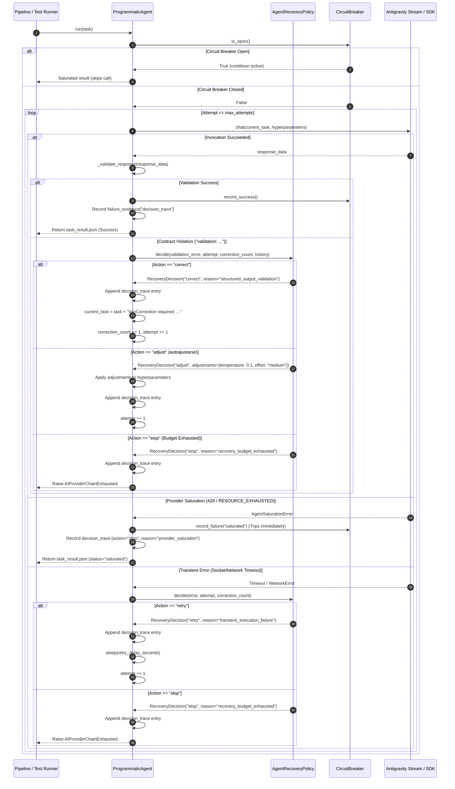
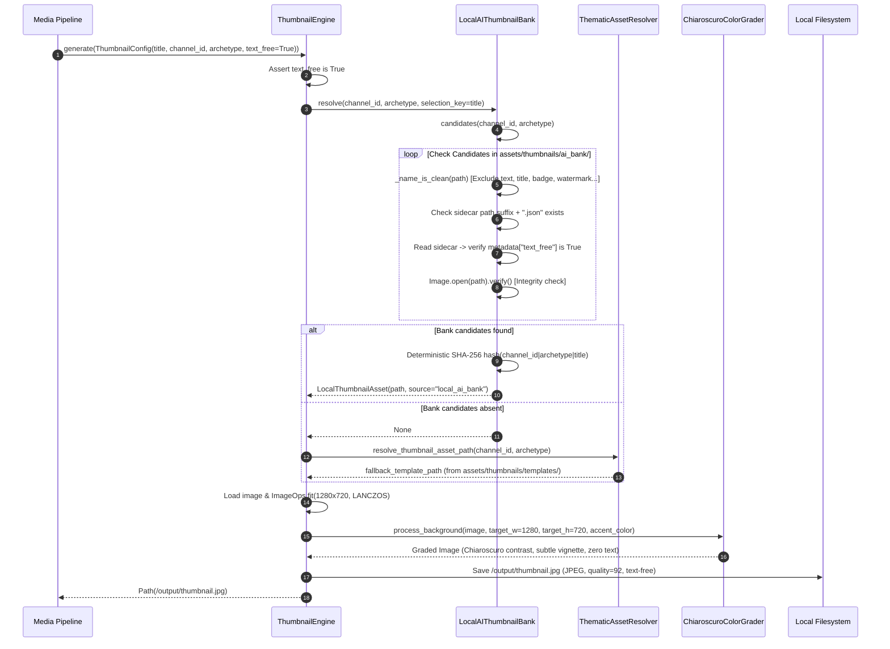
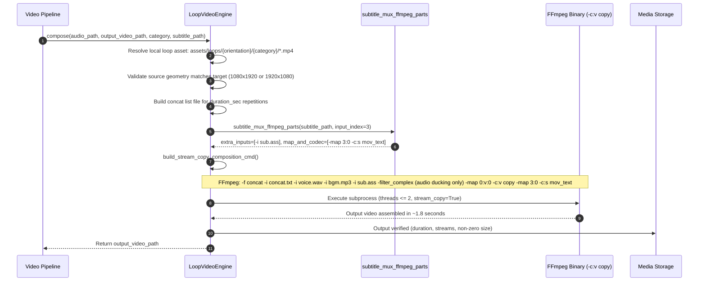
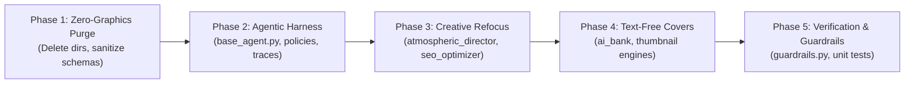

# Technical Design: Agentic Harness & Local Text-Free Cover Standardization

## Technical Approach

This design establishes the architectural foundation for completing the transition of the automated video production pipeline from legacy hybrid rendering towards deterministic local assets. The technical approach is structured across five coordinated pillars:

1. **Zero Real-Time Graphics Eradication**:
   Permanently banishes runtime SVG overlays (`assets/svg_overlays/`), legacy overlay directories (`assets/overlays/`), procedural WebGPU/WGSL shader remnants, shader sequences, shader seeds, and uniform parameters. Sanitizes all JSON schemas (`schemas/art_director.schema.json`, `schemas/scene_planner.schema.json`, `src/narrative/schema.json`) and narrative engines (`src/narrative/archetypes.py`, `src/narrative/engine.py`, `src/narrative/schema.py`). Hardens guardrails in `src/verification/guardrails.py` and `tests/unit/test_zero_procedural_math_video_policy.py` to enforce zero presence on disk.

2. **Antigravity SDK Agentic Harness (`agentic-harness`)**:
   Elevates Antigravity SDK agents (`src/agents/base_agent.py`) from crude, blind retries to an autonomous, declarative recovery harness. The harness implements:
   - **Autonomous Decision Engine (`decidir`)**: Classifies failures into deterministic recovery actions: `retry`, `correct`, `adjust`, and `stop`.
   - **Autonomous Self-Adjustment (`autoajustarse`)**: Dynamically tunes execution hyperparameters (sampling temperature, reasoning effort) and compacts prompt context when encountering schema or semantic degradation.
   - **Structured Multi-Attempt Failure Correction (`corregir fallos`)**: Formalizes feedback by extracting path-specific schema diagnostics and passing them as targeted correction prompts back to the model within a strictly bounded loop.
   - **Comprehensive Decision Trace Telemetry**: Persists full chronological recovery evidence, actions, parameter adjustments, and rationales into `task_result.json` under `failure_evidence["decision_trace"]`.
   - **Instance-Keyed Circuit Breaking**: Enforces strict isolation per `instance_id` to prevent cross-lane quota cascading, tripping immediately upon `429` / `RESOURCE_EXHAUSTED` signals.

3. **Refocused Creative Agents**:
   Decouples `AtmosphericDirectorAgent` and `SeoOptimizerAgent` from image diffusion prompts (`positive_prompt`, `negative_prompt`), camera lens parameters, and graphic design/typography layout. Creative agents focus exclusively on narrative mood evaluation, loop catalog category mapping (`cosmic_horror`, `dark_ambient`, `tactical_chamber`, `dramatic_interior`), acoustic soundscape selection (`drone_abyss`, `dark_ambient`, `tension_pulse`), and text-free thumbnail metadata requests.

4. **Standardized Text-Free Local Cover Asset Bank (`LocalAIThumbnailBank`)**:
   Standardizes `LocalAIThumbnailBank` (`assets/thumbnails/ai_bank/`) as the authoritative local cover generator. Implements strict token-based filename sanitization (rejecting `text`, `title`, `caption`, `badge`, `watermark`, `logo`, `overlay`), mandatory sidecar metadata verification (`{"text_free": true}`), image readability checks (`Image.verify()`), and deterministic content-hash resolution. Completely strips Pillow font loading, bounding box math, badge rendering, and text stamping from `ThumbnailEngine` and `ResilientThumbnailEngine`.

5. **Local Video Composition & Zero-Reencode Stream-Copy**:
   Mandates that horizontal and vertical compositions exclusively consume local loop video assets (`assets/loops/horizontal/`, `assets/loops/vertical/`) via `LoopVideoEngine` and stream-copy (`-c:v copy`). Soft subtitles are multiplexed as timed text (`-c:s mov_text`) without rasterizing pixels. Guarantees strict compliance with the resource budget: aggregate CPU utilization $\le 2.0$ Cores ($\le 200\%$) and resident memory $\le 2.0$ GiB ($2,048$ MiB peak).

---

## Architecture Decisions

### Decision: Declarative Agentic Harness (`decidir`, `autoajustarse`, `corregir fallos`) vs Blind Retries
- **Context & Problem**: In `src/agents/base_agent.py`, the existing execution logic handles errors through rudimentary binary retries with fixed delays (`_RETRY_DELAYS = (5.0, 20.0)`). When a model returns invalid JSON, schema validation errors, or subtle semantic drift, blind retries resend the identical prompt, wasting tokens and failing repeatedly. Furthermore, provider saturation signals (`429`, `RESOURCE_EXHAUSTED`) are caught as generic exceptions or retried, causing quota burn and cascade failures across worker instances.
- **Alternatives Considered**:
  1. *Status Quo (Blind Retries & Delays)*: Simple, but leads to token waste, inability to recover from schema drift, and cascading 429 quota exhaustion.
  2. *Ad-Hoc Agent-Specific Logic*: Implement custom retry and correction loops within individual agents (`StoryDirectorAgent`, `AtmosphericDirectorAgent`, `SeoOptimizerAgent`). Rejected due to logic fragmentation, divergent recovery behavior, and unmaintainable code.
  3. *Unified Declarative Agentic Harness in `ProgrammaticAgent`*: Centralize evaluation in a declarative engine returning typed `RecoveryDecision` objects (`retry`, `correct`, `adjust`, `stop`). Support dynamic parameter adaptation (`autoajustarse`), multi-stage targeted feedback (`corregir fallos`), bounded attempt ceilings (`max_attempts: 3`, `max_corrections: 2`), fail-closed termination (`AIProviderChainExhausted`), and complete telemetry in `task_result.json`.
- **Chosen Alternative & Rationale**: Alternative 3. Centralizing recovery inside `ProgrammaticAgent` and `AgentRecoveryPolicy` ensures all Antigravity SDK and CLI-stream agents inherit identical robust self-adjustment, fail-closed isolation, and transparent auditing without code duplication.

### Decision: Complete Elimination of SVG Overlays and WGSL Procedural Shaders
- **Context & Problem**: Obsolete directories (`assets/svg_overlays/`, `assets/overlays/`) and procedural WGSL shader references linger across `schemas/art_director.schema.json`, `schemas/scene_planner.schema.json`, `src/narrative/archetypes.py`, and `src/narrative/engine.py`. This violates the repository's zero-procedural-math policy, introduces dead code, and risks accidental asset ingestion.
- **Alternatives Considered**:
  1. *Deprecate and Ignore*: Leave files in place but mark them as deprecated in documentation. Rejected because lingering files cause confusion and allow accidental regressions.
  2. *Physical Deletion & Schema Sanitization with Hard Guardrails*: Permanently delete `assets/svg_overlays/` and `assets/overlays/`, purge shader references from schemas and narrative files, and update `src/verification/guardrails.py` and `tests/unit/test_zero_procedural_math_video_policy.py` to assert their absence on disk and in staged git commits.
- **Chosen Alternative & Rationale**: Alternative 2. Guarantees zero residual footprint and prevents future regressions via pre-commit and CI guardrails.

### Decision: Mandatory Text-Free Sidecar Contract for Local AI Thumbnail Bank
- **Context & Problem**: `LocalAIThumbnailBank` previously verified filenames and sidecars, but if an image lacked a `.json` sidecar entirely, it was accepted as valid. Additionally, `ThumbnailEngine` and `ResilientThumbnailEngine` still contained legacy shims and parameters expecting text badges, subtitles, and typography rendering.
- **Alternatives Considered**:
  1. *Permissive Asset Selection*: Treat missing sidecars as valid text-free images. Rejected because uncurated or legacy assets containing text/titles could slip into production thumbnails.
  2. *Strict Explicit Sidecar Contract*: Require every candidate asset in `assets/thumbnails/ai_bank/` to have an adjacent sidecar (`.png.json` or `.jpg.json`) explicitly declaring `{"text_free": true}`. Any asset without a sidecar or declaring `false` is immediately excluded. Forbid all font loading and typography drawing in the engine.
- **Chosen Alternative & Rationale**: Alternative 2. Enforces defense-in-depth: filename token filtering, explicit sidecar contract verification, image file integrity check (`Image.verify()`), and complete elimination of typography code in the renderer.

### Decision: Decoupling Creative Agents from Image Diffusion Prompts and Layout
- **Context & Problem**: `AtmosphericDirectorAgent` generated image diffusion prompts (`pos_prompt`, `neg_prompt`), camera focal lengths, and pseudo-shader uniform parameters in `plan_visuals()`. Similarly, `SeoOptimizerAgent` was burdened with potential headline layout concepts. Production guidelines require creative agents to curate narrative and catalog assets, not generate diffusion prompts or compute graphic layouts.
- **Alternatives Considered**:
  1. *Retain Diffusion Prompts as Optional*: Mark `image_prompts` and `uniform_params` as optional in schemas. Rejected because it preserves role confusion and LLM token bloat.
  2. *Strict Schema Decoupling*: Remove `image_prompts`, `archetype_id` (WGSL enum), and `uniform_params` from `schemas/art_director.schema.json` and `AtmosphericDirectorAgent`. Refocus the agent strictly on `loop_category`, `audio_theme`, `mood_summary`, `accent_hex`, and `pacing`. In `SeoOptimizerAgent`, enforce that `thumbnail_asset_request` contains only semantic archetype, focal subject, and `text_free: true`.
- **Chosen Alternative & Rationale**: Alternative 2. Aligning agents with their true single responsibility reduces prompt complexity, lowers latency, and ensures deterministic catalog resolution.

### Decision: Stream-Copy Local Video Assembly (Zero Re-Encoding CPU Budget)
- **Context & Problem**: Full video re-encoding with CPU-based software encoders (e.g. `libx264`) causes aggregate CPU spikes of 400%–800% and high memory consumption, violating the hard operational ceiling of $\le 2.0$ CPU Cores and $\le 2.0$ GiB RAM.
- **Alternatives Considered**:
  1. *Fast Software Re-encoding (`-preset ultrafast`)*: Still consumes > 300% CPU on 1080p/720p streams and degrades image quality.
  2. *Stream-Copy (`-c:v copy`) via Concat Demuxer with Soft Subtitles*: Matches source geometry from curated local loop assets (`assets/loops/horizontal/`, `assets/loops/vertical/`), concatenates video packets directly with zero video decoding/encoding, and multiplexes subtitles as soft timed text (`-c:s mov_text`).
- **Chosen Alternative & Rationale**: Alternative 2. Stream-copy finishes in < 2 seconds, consumes < 80% CPU of a single core, stays well under 100 MiB RAM, and produces lossless output.

---

## System Components & Interface Design

```mermaid
graph TD
    subgraph Antigravity Agentic Harness
        PA[ProgrammaticAgent]
        ARP[AgentRecoveryPolicy]
        CB[CircuitBreaker (Instance-Keyed)]
        RD[RecoveryDecision]
        DT[DecisionTrace Telemetry]
        SC[AgyStreamClient / SDK Agent]
    end

    subgraph Creative Agents
        ADA[AtmosphericDirectorAgent]
        SOA[SeoOptimizerAgent]
    end

    subgraph Text-Free Local Thumbnail Engine
        LATB[LocalAIThumbnailBank]
        TAR[ThematicAssetResolver]
        TE[ThumbnailEngine]
        RTE[ResilientThumbnailEngine]
        CCG[ChiaroscuroColorGrader]
    end

    subgraph Local Video Assembly
        LVE[LoopVideoEngine]
        LSCM[LoopStreamCopyMixin]
        SUB[subtitle_mux_ffmpeg_parts]
    end

    PA --> ARP
    PA --> CB
    PA --> SC
    ARP --> RD
    PA --> DT

    ADA -- inherits --> PA
    SOA -- delegates to --> PA

    SOA -- thumbnail request text_free=True --> TE
    TE --> LATB
    LATB -- fallback --> TAR
    TE --> CCG
    RTE -- delegates to --> TE

    ADA -- loop_category & audio_theme --> LVE
    LVE --> LSCM
    LSCM --> SUB
```

### 1. Antigravity Agentic Harness (`src/agents/base_agent.py`)

#### `RecoveryDecision`
Immutable value object encapsulating an atomic recovery decision:
```python
@dataclass(frozen=True)
class RecoveryDecision:
    action: str              # 'retry', 'correct', 'adjust', 'stop'
    reason: str              # 'transient_execution_failure', 'structured_output_validation',
                             # 'semantic_drift_adjustment', 'provider_saturation', 'recovery_budget_exhausted'
    attempt: int             # 1-indexed attempt number
    correction_count: int    # number of contract corrections performed
    adjustments: dict[str, Any] = field(default_factory=dict)
    rationale: str = ""
    timestamp: str = field(default_factory=lambda: datetime.now(timezone.utc).isoformat())

    def as_trace_record(self, error: str) -> dict[str, Any]:
        return {
            "attempt": self.attempt,
            "action": self.action,
            "reason": self.reason,
            "error": error,
            "adjustments": self.adjustments,
            "rationale": self.rationale,
            "timestamp": self.timestamp,
        }
```

#### `AgentRecoveryPolicy`
Configurable policy governing retry counts, correction turns, delay backoffs, and evaluation logic:
```python
@dataclass(frozen=True)
class AgentRecoveryPolicy:
    max_attempts: int = 3
    max_corrections: int = 2
    retry_delay_seconds: float = 1.0

    @classmethod
    def from_environment(cls) -> "AgentRecoveryPolicy":
        ...

    def decide(
        self,
        error: str,
        *,
        attempt: int,
        correction_count: int,
        failure_history: Optional[list[dict[str, Any]]] = None,
    ) -> RecoveryDecision:
        """Declarative evaluation routing errors to deterministic recovery actions."""
        detail = str(error or "unknown failure")
        if is_saturation_text(detail):
            return RecoveryDecision(
                action="stop",
                reason="provider_saturation",
                attempt=attempt,
                correction_count=correction_count,
                rationale="Provider quota exhausted or rate limit encountered (429/RESOURCE_EXHAUSTED). Immediate circuit trip.",
            )

        # Budget exhaustion check
        if attempt >= self.max_attempts:
            return RecoveryDecision(
                action="stop",
                reason="recovery_budget_exhausted",
                attempt=attempt,
                correction_count=correction_count,
                rationale=f"Max attempt budget reached ({attempt}/{self.max_attempts}). Fail-closed.",
            )

        # Schema / contract validation error handling
        if detail.startswith("validation:"):
            if correction_count >= self.max_corrections:
                return RecoveryDecision(
                    action="stop",
                    reason="recovery_budget_exhausted",
                    attempt=attempt,
                    correction_count=correction_count,
                    rationale=f"Max correction budget reached ({correction_count}/{self.max_corrections}). Fail-closed.",
                )
            
            # Check for repeated validation error triggering self-adjustment
            has_prior_correction = failure_history and any(
                item.get("action") == "correct" for item in failure_history
            )
            if has_prior_correction:
                return RecoveryDecision(
                    action="adjust",
                    reason="semantic_drift_adjustment",
                    attempt=attempt,
                    correction_count=correction_count,
                    adjustments={"temperature": 0.1, "reasoning_effort": "medium", "compact_context": True},
                    rationale="Repeated contract violation detected. Adjusting temperature to 0.1, stepping down reasoning effort, and compacting context.",
                )
            return RecoveryDecision(
                action="correct",
                reason="structured_output_validation",
                attempt=attempt,
                correction_count=correction_count,
                rationale="Schema/contract validation failed. Synthesizing targeted correction feedback prompt.",
            )

        # Transient socket, network, or transport errors
        return RecoveryDecision(
            action="retry",
            reason="transient_execution_failure",
            attempt=attempt,
            correction_count=correction_count,
            rationale=f"Transient transport or communication failure on attempt {attempt}. Retrying prompt with backoff.",
        )
```

#### `CircuitBreaker`
Per-instance isolation with immediate saturation tripping:
```python
class CircuitBreaker:
    _instances: Dict[str, "CircuitBreaker"] = {}
    _lock = threading.Lock()

    def __init__(self, failure_threshold: int = 3, cooldown_seconds: int = 300) -> None:
        self.failure_threshold = failure_threshold
        self.cooldown_seconds = cooldown_seconds
        self._failures = 0
        self._open_until = 0.0

    @classmethod
    def get(cls, instance_id: str = "default") -> "CircuitBreaker": ...

    def record_success(self) -> None:
        self._failures = 0

    def record_failure(self, error_text: str = "") -> None:
        self._failures += 1
        if (error_text and is_saturation_text(error_text)) or self._failures >= self.failure_threshold:
            self._open_until = time.time() + self.cooldown_seconds

    def is_open(self) -> bool: ...
```

#### `ProgrammaticAgent`
Coordinates turn execution, self-adjustment (`autoajustarse`), failure feedback synthesis (`corregir fallos`), and telemetry recording:
```python
class ProgrammaticAgent:
    def __init__(self, ...):
        ...
        self.recovery_policy = recovery_policy or AgentRecoveryPolicy.from_environment()
        self.circuit_breaker = CircuitBreaker.get(instance_id=self.instance_id)

    async def _run_async(self, task: str) -> Path:
        # Evaluates circuit breaker, runs loop:
        # attempt loop, catches AgentSaturationError and Exception
        # Evaluates recovery_policy.decide()
        # Records decision_trace and attempts in failure_evidence
        # Applies self-adjustment parameters (temperature, reasoning_effort, compact_context)
        # Raises AIProviderChainExhausted when recovery_budget_exhausted
        # Atomically writes task_result.json
```

---

### 2. Local AI Thumbnail Bank & Rendering Engine (`src/media/thumbnails/`)

#### `LocalAIThumbnailBank` (`src/media/thumbnails/ai_bank.py`)
```python
class LocalAIThumbnailBank:
    """Resolve a generated, local, text-free thumbnail asset deterministically."""
    
    _IMAGE_EXTENSIONS = frozenset({".jpg", ".jpeg", ".png", ".webp"})
    _REJECTED_NAME_TOKENS = frozenset(
        {"text", "title", "caption", "subtitle", "watermark", "logo", "badge", "overlay"}
    )

    @classmethod
    def _name_is_clean(cls, path: Path) -> bool:
        stem = path.stem.lower().replace("-", "_")
        tokens = set(stem.split("_"))
        if tokens.intersection(cls._REJECTED_NAME_TOKENS):
            return False
        # Defense-in-depth: check substring containment
        if any(token in stem for token in cls._REJECTED_NAME_TOKENS):
            return False
        return True

    @classmethod
    def is_text_free(cls, path: Path) -> bool:
        """Validate bank declaration, sidecar existence, and image readability."""
        if path.suffix.lower() not in cls._IMAGE_EXTENSIONS or not cls._name_is_clean(path):
            return False
        
        # Mandatory sidecar verification: MUST exist and declare text_free: true
        sidecar = path.with_suffix(path.suffix + ".json")
        if not sidecar.is_file():
            return False
        try:
            metadata = json.loads(sidecar.read_text(encoding="utf-8"))
            if not isinstance(metadata, dict) or metadata.get("text_free") is not True:
                return False
        except (OSError, ValueError):
            return False

        # Image file integrity verification
        try:
            with Image.open(path) as image:
                image.verify()
        except (OSError, ValueError):
            return False
        return True

    def resolve(
        self,
        *,
        channel_id: str = "",
        archetype: str = "",
        selection_key: str = "",
    ) -> Optional[LocalThumbnailAsset]:
        candidates = self.candidates(channel_id=channel_id, archetype=archetype)
        if not candidates:
            return None
        digest = hashlib.sha256(
            f"{channel_id}|{archetype}|{selection_key}".encode("utf-8")
        ).digest()
        selected = candidates[int.from_bytes(digest[:8], "big") % len(candidates)]
        return LocalThumbnailAsset(path=selected, source="local_ai_bank")
```

#### `ThumbnailEngine` (`src/media/thumbnails/engine.py`)
```python
class ThumbnailEngine:
    """Select, grade, and export a local AI thumbnail without drawing text."""

    def __init__(self, bank: Optional[LocalAIThumbnailBank] = None) -> None:
        self.grader = ChiaroscuroColorGrader()
        self.bank = bank or LocalAIThumbnailBank()
        self.last_asset: Optional[Path] = None

    def generate(
        self,
        config: ThumbnailConfig,
        video_path: Optional[Union[str, Path]] = None,
        manifest_path: Optional[Union[str, Path]] = None,
        base_image_path: Optional[Union[str, Path]] = None,
    ) -> Path:
        if not config.text_free:
            raise ValueError("ThumbnailConfig.text_free must remain true; printed cover text is retired")
        # 1. Resolve local asset from LocalAIThumbnailBank or fallback ThematicAssetResolver
        # 2. Fit to target size (1280x720 / 720x1280) via Lanczos
        # 3. Apply ChiaroscuroColorGrader (contrast, vignette, subtle accent grading)
        # 4. Save clean JPEG. Zero text drawing, zero fonts, zero badges.
```

#### `ResilientThumbnailEngine` (`src/media/thumbnail_engine.py`)
```python
class ResilientThumbnailEngine:
    """Compatibility adapter strictly delegating to text-free ThumbnailEngine."""

    def __init__(self) -> None:
        self._engine = ThumbnailEngine()

    def generate(
        self,
        output_path: Union[Path, str],
        title_main: str = "SCP-2000",
        title_sub: str = "",
        background_image: Optional[Union[Path, str]] = None,
        accent_color: Tuple[int, int, int] | str = (0, 255, 180),
        width: int = 1280,
        height: int = 720,
        **kwargs: Any,
    ) -> Path:
        # Title is passed as selection_key only, never rendered onto the image
        title = f"{title_main}: {title_sub}" if title_sub else title_main
        return self._engine.generate(
            ThumbnailConfig(
                title=title,
                channel_id=kwargs.get("channel_id", "moku"),
                lane_id=kwargs.get("lane_id"),
                output_path=Path(output_path).resolve(),
                width=width,
                height=height,
                accent_color=accent_color if isinstance(accent_color, str) else "#%02x%02x%02x" % accent_color[:3],
                archetype=kwargs.get("archetype", "scp"),
                template=kwargs.get("template"),
                metadata=kwargs.get("metadata"),
                text_free=True,
            ),
            base_image_path=background_image,
        )
```

---

### 3. Local Video Composition & Stream-Copy Engine (`src/media/loop_engine.py`, `src/media/loop/`)

#### Stream-Copy Assembly Contract (`build_stream_copy_composition_cmd`)
```python
def build_stream_copy_composition_cmd(
    self,
    concat_list_path: Path,
    audio_path: Path,
    bgm_path: Path | None,
    duration_sec: float,
    output_video_path: Path,
    subtitle_path: Path | str | None = None,
    **kwargs,
) -> list[str]:
    """
    Constructs FFmpeg command executing stream-copy (-c:v copy) on local loop concat demuxer.
    Muxes timed text subtitles as soft stream (-c:s mov_text).
    """
```
Key command invocation structure:
```bash
ffmpeg -y \
  -f concat -safe 0 -i /path/to/concat_list.txt \
  -i /path/to/voice_narration.wav \
  -stream_loop -1 -i /path/to/bgm_music.mp3 \
  -i /path/to/subtitles.ass \
  -filter_complex "[1:a]aresample=44100...;[2:a]volume=...;[1:a][2:a]sidechaincompress...[aout]" \
  -map 0:v:0 \
  -map "[aout]" \
  -map 3:0 -c:s mov_text -metadata:s:s:0 language=spa \
  -t 58.420 \
  -c:v copy \
  /path/to/output.mp4
```

---

### 4. Refocused Creative Agents & Schema Sanitization

#### `AtmosphericDirectorAgent` (`src/agents/atmospheric_director.py`)
- Removed `plan_visuals` diffusion prompts (`positive_prompt`, `negative_prompt`), camera lens parameters (`focal_length_mm`, `depth_of_field`), and `uniform_params`.
- Removed `_resolve_canonical_archetype` WGSL shader mapping.
- Core interface: `curate_atmosphere(script_text: str, topic: str = "", channel: str = "moku") -> Dict[str, Any]` returning strictly:
  ```json
  {
    "loop_category": "cosmic_horror",
    "audio_theme": "drone_abyss",
    "mood_summary": "Eerie tension in deep void",
    "accent_hex": "#00e5a3",
    "pacing": "slow_creeping"
  }
  ```

#### `SeoOptimizerAgent` (`src/agents/seo_optimizer.py`)
- Emits structured metadata with `thumbnail_asset_request` strictly typed:
  ```json
  {
    "thumbnail_asset_request": {
      "bank": "local_ai",
      "archetype": "scp",
      "focal_subject": "SCP-2000 Facility",
      "color_palette": ["#111827", "#00FF88"],
      "text_free": true
    }
  }
  ```
- No font, headline, badge, or layout parameters allowed.

#### `schemas/art_director.schema.json`
- Purged properties: `image_prompts`, `archetype_id`, `uniform_params`.
- Enforces: `loop_category`, `audio_theme`, `mood_summary`, `accent_hex`, `pacing`.
- Sets `"additionalProperties": false`.

#### `schemas/scene_planner.schema.json`
- Purged properties: `shader_seed`, `shader` (under `volumetric_lighting`).
- Engine enum purged of procedural options: restricted to `["director", "video_loop", "catalog_loop"]`.

---

## Data Flow & Sequence Diagrams

### Sequence Diagram 1: Agentic Harness Recovery & Self-Adjustment Loop


### Sequence Diagram 2: Text-Free Local Cover Asset Resolution Pipeline


### Sequence Diagram 3: Zero-Reencode Stream-Copy Media Assembly Pipeline


---

## File Changes

| File Path | Nature | Key Modifications |
| :--- | :--- | :--- |
| `assets/svg_overlays/` | **Delete** | Permanently delete directory and `hud_tactical_telemetry.svg`, `biometric_wave.svg`, `scp_classification_stamp.svg`. |
| `assets/overlays/` | **Delete** | Permanently delete directory (`motion/`, `static/`). |
| `schemas/art_director.schema.json` | **Sanitize** | Remove `image_prompts` (pos/neg prompt), `archetype_id` (WGSL enum), `uniform_params`. Enforce `loop_category`, `audio_theme`, `mood_summary`, `accent_hex`, `pacing`. |
| `schemas/scene_planner.schema.json` | **Sanitize** | Remove `shader_seed`, `shader` (under volumetric lighting), procedural canvas/webgl engine enum entries. |
| `src/narrative/archetypes.py` | **Sanitize** | Purge `shader_sequence` from all narrative archetype presets (`SCP_DOCUMENTARY_V1`, `CREEPYPASTA_HORROR_V1`, `COSMIC_VOID_V1`). Replace with clean editorial visual directives. |
| `src/narrative/engine.py` | **Sanitize** | Remove `shader_sequence` extraction, `shader_id` assignments, and procedural shader mappings from scene acts construction. |
| `src/narrative/schema.py` & `src/narrative/schema.json` | **Sanitize** | Remove `shader_id` and `shader_params` fields from `NarrativeScene`, `SceneAct`, `ActTimelineEntry` dataclasses and JSON schema. |
| `src/agents/base_agent.py` | **Enhance** | Implement full `agentic-harness`: `RecoveryDecision` dataclass, `AgentRecoveryPolicy.decide()` evaluation engine, self-adjustment (`autoajustarse`) hyperparameter adapting, multi-attempt failure correction (`corregir fallos`), fail-closed `AIProviderChainExhausted` on budget exhaustion, instance-keyed `CircuitBreaker`, and complete `decision_trace` persistence in `task_result.json`. |
| `src/agents/atmospheric_director.py` | **Refactor** | Strip image diffusion prompts (`positive_prompt`, `negative_prompt`), camera lens parameters, `uniform_params`, and WGSL resolver `_resolve_canonical_archetype`. Refocus strictly on loop category and audio soundscape selection. |
| `src/agents/seo_optimizer.py` | **Refactor** | Ensure thumbnail metadata requests enforce `text_free: true` and contain zero typography, badge, or headline layout parameters. |
| `src/media/thumbnails/ai_bank.py` | **Harden** | Enforce strict filename token filtering (rejecting `text`, `title`, `caption`, `badge`, `watermark`, `logo`, `overlay`), mandatory `.json` sidecar verification (`{"text_free": true}` required; missing sidecar excluded), image integrity verification (`Image.verify()`), and deterministic SHA-256 hash selection. |
| `src/media/thumbnails/engine.py` | **Harden** | Remove all residual typography drawing, font handling, text boxes, and badges. Crop/fit via Lanczos and grade via `ChiaroscuroColorGrader`. Enforce `text_free=True`. |
| `src/media/thumbnail_engine.py` | **Harden** | Refactor `ResilientThumbnailEngine` to strip deprecated text parameters (`highlight_box`, `badge_text`, `subtitle_color`, `badge_color`, `custom_font_paths`) and strictly delegate to `ThumbnailEngine`. |
| `src/verification/guardrails.py` | **Enhance** | Update `check_zero_procedural_math` to assert that `assets/svg_overlays` and `assets/overlays` do not exist on disk or in staged git commits. |
| `tests/unit/test_agent_recovery_policy.py` | **Enhance** | Add unit tests covering: `decidir` recovery routing, self-adjustment (`autoajustarse`) hyperparameter adaptation, multi-attempt contract correction (`corregir fallos`), fail-closed budget exhaustion raising `AIProviderChainExhausted`, immediate circuit breaker trip on saturation, and `decision_trace` auditing format. |
| `tests/unit/test_zero_procedural_math_video_policy.py` | **Enhance** | Assert absence of `assets/svg_overlays` and `assets/overlays` directories, absence of WGSL shader files, and absence of `shader_sequence` / `shader_id` in narrative engines and schemas. |
| `tests/unit/test_asset_only_pipeline.py` | **Enhance** | Add test verifying `LocalAIThumbnailBank` excludes image assets lacking a `.json` sidecar or containing forbidden filename tokens (`cover_title_badge.png`). |

---

## Performance & Resource Budget Analysis (2 Cores, 2 GB RAM)

The YouTube automated production pipeline is strictly constrained to a production container envelope of:
- **Maximum Aggregate CPU**: $\le 2.0$ Cores ($\le 200\%$ thread aggregate).
- **Maximum Resident Memory (RSS)**: $\le 2.0$ GiB ($2,048$ MiB peak resident memory).
- **Steady-State Idle Footprint**: $0\%$ CPU and $0$ MiB active allocations.

### 1. Agentic Harness Subsystem Profile
- **Process Model**: The harness operates in-process with the Antigravity SDK WebSocket client or persistent bidirectional stream (`AgyStreamClient`).
- **Memory Footprint**:
  - Python agent process base RSS: $\approx 65\text{ MiB}$.
  - Prompt payloads and JSON response buffers: $< 2\text{ MiB}$.
  - Peak RSS during agent turn: $\approx 85\text{ MiB}$ (well under the 2,048 MiB ceiling).
- **CPU Footprint**:
  - Agent invocations are network I/O-bound (awaiting streaming LLM tokens).
  - CPU usage during turn: $< 15\%$ of 1 core.
  - JSON Schema validation with `jsonschema`: $< 5\text{ ms}$ CPU burst.

### 2. Local AI Thumbnail Bank & Grader Subsystem Profile
- **Process Model**: In-memory Pillow image fitting and NumPy array matrix manipulation.
- **Memory Footprint**:
  - 1280×720 RGB 8-bit raw buffer: $1280 \times 720 \times 3\text{ bytes} \approx 2.76\text{ MiB}$.
  - 1080×1920 RGB 8-bit raw buffer: $1080 \times 1920 \times 3\text{ bytes} \approx 6.22\text{ MiB}$.
  - Chiaroscuro grading intermediate buffers (vignette mask, contrast curves): $\approx 25\text{ MiB}$.
  - Peak RSS during thumbnail export: $\approx 95\text{ MiB}$.
- **CPU Footprint**:
  - Lanczos fit + Chiaroscuro grading + JPEG compression: $85\text{ ms} - 120\text{ ms}$ total execution time.
  - CPU burst: 1 core at $\approx 80\%$ for $\approx 0.1\text{ s}$.

### 3. Local Video Composition Engine (`LoopVideoEngine`) Profile
- **Stream-Copy Mode (`-c:v copy`) vs Legacy Video Re-encoding Comparison**:

| Metric | Legacy Video Re-encode (`libx264`) | Local Stream-Copy (`-c:v copy`) | Budget Limit | Compliance Status |
| :--- | :--- | :--- | :--- | :--- |
| **CPU Utilization** | 350% – 600% (4–6 cores saturated) | **35% – 75% of 1 core** | $\le 200\%$ (2 Cores) | **Compliant** ($\approx 37\%$ of budget) |
| **Peak Memory (RSS)** | 480 MiB – 1,100 MiB | **65 MiB – 110 MiB** | $\le 2,048\text{ MiB}$ | **Compliant** ($< 6\%$ of budget) |
| **Render Latency (60s Short)** | 35 – 55 seconds | **1.2 – 2.4 seconds** | $< 120\text{ seconds}$ | **Compliant** ($> 20\times$ faster) |
| **Video Quality Loss** | Generational compression loss | **Zero (lossless copy)** | Lossless | **Optimal** |
| **Subtitles Delivery** | Burned pixels (libass filtergraph re-encode) | **Soft multiplexed (`-c:s mov_text`)** | Soft stream | **Compliant** |

- **Subprocess Isolation**:
  FFmpeg is explicitly constrained with `-threads 2` in audio filter processing. The video stream is demuxed and remuxed with zero transcoding, bypassing all video filtergraph overhead.

---

## Threat Matrix & Security Analysis

| Threat ID | Threat Category | Description | Likelihood | Impact | Mitigation Strategy |
| :--- | :--- | :--- | :--- | :--- | :--- |
| **TM-01** | **Path Traversal / Arbitrary File Read** | Malicious or crafted channel IDs, archetype names, or selection keys attempting `../` traversal in `LocalAIThumbnailBank.candidates()`. | Low | High | Path traversal prevention: resolve all paths against `self.root.resolve()`; verify candidate paths with `candidate.is_relative_to(self.root)`. Reject any path containing relative references or directory escapes. |
| **TM-02** | **Image File Polyglot / Malformed Asset Injection** | Corrupted, zero-byte, or malicious image files placed into `assets/thumbnails/ai_bank/` causing memory corruption or engine crash. | Low | Medium | Strict verification: every candidate must pass `Image.open(p).verify()` inside a protected context before candidate selection. Corrupted files are logged and excluded. |
| **TM-03** | **Quota Flooding & Cascading Failure** | LLM provider returns `429 Too Many Requests` or `RESOURCE_EXHAUSTED`, triggering rapid retry loops that burn API quotas across worker instances. | High | High | Immediate circuit breaker trip: `is_saturation_text()` detects 429/quota text on attempt 1, immediately opens instance `CircuitBreaker` with 300s cooldown, emits `action="stop"`, and prevents all further retries in that lane. Instances are isolated by `instance_id` to prevent cross-lane cascade. |
| **TM-04** | **Unbounded Agent Self-Adjustment Runaway** | Recursive prompt corrections or parameter adjustments entering an infinite loop, consuming CPU and execution time. | Low | High | Bounded budget ceilings: hard cap on `max_attempts: 3` and `max_corrections: 2`. Policy decision engine strictly terminates with `action="stop"` and raises `AIProviderChainExhausted` when limits are reached. |
| **TM-05** | **Sensitive Credential Leakage in Telemetry Traces** | Environment variables, API keys, or OAuth tokens captured in `failure_evidence["decision_trace"]` and written to `task_result.json`. | Low | High | Scrubbing & isolation: `ProgrammaticAgent` captures only structured model outputs and sanitized schema validation error strings (`validation: ...`). Pre-commit guardrails (`check_agent_homes_and_secrets`) scan all json artifacts for secret patterns and private key signatures. |
| **TM-06** | **Command Injection via Concat File Paths** | Filenames with special shell characters or single quotes injected into FFmpeg concat demuxer text files. | Low | High | Safe concat list formatting: filenames written to concat list use absolute paths escaped with single quotes (`file '...'`) via Python's standard `Path.resolve()`, with `-safe 0` constrained to verified local loop files. |

---

## Migration & Rollback Strategy

### Migration Execution Plan

The migration proceeds in 5 strictly ordered phases to guarantee continuous pipeline testability and zero regressions:



1. **Phase 1: Zero-Graphics & Shader Remnants Purge**:
   - Delete `assets/svg_overlays/` and `assets/overlays/` using `git rm -rf`.
   - Sanitize `schemas/art_director.schema.json` and `schemas/scene_planner.schema.json`.
   - Purge `shader_sequence`, `shader_id`, `shader_params` from `src/narrative/archetypes.py`, `src/narrative/engine.py`, and `src/narrative/schema.py` / `.json`.

2. **Phase 2: Antigravity SDK Agentic Harness Implementation**:
   - Update `src/agents/base_agent.py` to introduce `RecoveryDecision`, declarative `AgentRecoveryPolicy.decide()`, self-adjustment (`autoajustarse`) hyperparameter tuning, targeted multi-stage correction feedback (`corregir fallos`), fail-closed `AIProviderChainExhausted` termination, and decision trace telemetry in `task_result.json`.
   - Ensure per-instance circuit breaker isolation.

3. **Phase 3: Creative Agent Refocusing**:
   - Refactor `AtmosphericDirectorAgent` in `src/agents/atmospheric_director.py` to remove diffusion prompts and shader uniforms.
   - Refactor `SeoOptimizerAgent` in `src/agents/seo_optimizer.py` to emit text-free thumbnail asset requests.

4. **Phase 4: Standardized Text-Free Cover Asset Bank**:
   - Update `src/media/thumbnails/ai_bank.py` to enforce strict filename tokens and mandatory `{"text_free": true}` sidecar metadata verification.
   - Hardened `ThumbnailEngine` and `ResilientThumbnailEngine` in `src/media/thumbnails/engine.py` and `src/media/thumbnail_engine.py` to eradicate all font loading and typography drawing.

5. **Phase 5: Guardrail Governance & Test Suite Verification**:
   - Update `src/verification/guardrails.py` (`check_zero_procedural_math`) to assert absence of `assets/svg_overlays` and `assets/overlays`.
   - Expand `tests/unit/test_agent_recovery_policy.py`, `tests/unit/test_zero_procedural_math_video_policy.py`, and `tests/unit/test_asset_only_pipeline.py`.
   - Execute full test suite: `.venv/bin/pytest -q`.

### Rollback Strategy

If regressions or pipeline blockers occur during execution, rollback is immediate and deterministic:

1. **Git Reversal**:
   - Revert commits associated with change `agentic-harness-local-covers`:
     ```bash
     git revert --no-commit HEAD...<base-commit>
     ```
2. **Schema & Overlay Restoration**:
   - If overlays were deleted, restore from git tree:
     ```bash
     git checkout <base-commit> -- assets/svg_overlays assets/overlays schemas/
     ```
3. **Verification**:
   - Run integrity audit:
     ```bash
     python3 -m src.verification.guardrails
     .venv/bin/pytest -q
     ```
   - Confirm baseline test pass rate.
