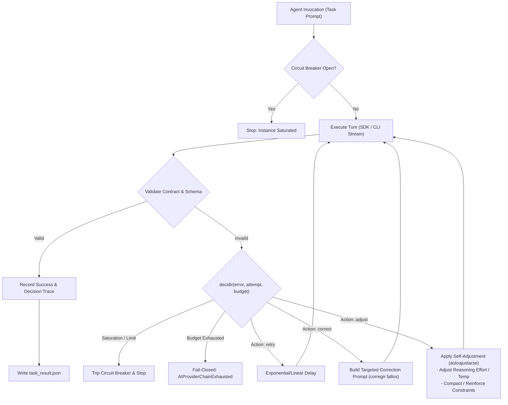

# Proposal: Agentic Harness & Local Text-Free Cover Standardization

## Intent

The media production pipeline has made significant strides in transitioning from experimental hybrid rendering towards deterministic local assets. However, several critical architectural gaps and legacy remnants still introduce fragility, CPU overhead, and role confusion across the system:

1. **Residual Real-Time Graphics & Shader Footprint**:
   - Despite previous cleanups, obsolete real-time graphics directories (`assets/svg_overlays/`, `assets/overlays/`) and procedural WebGPU/WGSL shader remnants remain across schemas (`schemas/art_director.schema.json`, `schemas/scene_planner.schema.json`), agent outputs, and narrative presets (`src/narrative/archetypes.py`, `src/narrative/engine.py`).
   - These remnants violate the project's zero-procedural-math policy, increase maintenance complexity, and risk accidental loading in production lanes.

2. **Primitive Error Recovery in Antigravity SDK Agents**:
   - Current agents in `src/agents/base_agent.py` only possess rudimentary, binary retry logic without true agentic harness capabilities.
   - Agents cannot autonomously self-adjust (`autoajustarse`) execution parameters (such as reasoning effort, prompt framing, temperature, or context compaction) when experiencing degradation.
   - They lack autonomous decision making (`decidir`) to select fallback strategies or alter execution paths, and do not provide structured multi-attempt failure correction (`corregir fallos`) with comprehensive decision trace logging.

3. **Role Confusion & Diffusion Prompts in Creative Agents**:
   - Agents like `AtmosphericDirectorAgent` continue to generate image diffusion prompts (`positive_prompt`, `negative_prompt`), camera lens parameters, and pseudo-shader uniform parameters, confusing atmospheric curation with image generation.
   - Production guidelines strictly forbid agents from attempting graphic design, layout calculations, or typography rendering.

4. **Non-Standardized Local Cover Asset Bank**:
   - While `LocalAIThumbnailBank` exists, thumbnail pipelines still carry compatibility shims expecting text-based badges, headlines, and typography rendering (`ResilientThumbnailEngine`).
   - The repository requires an authoritative, standardized local expert cover bank where all assets are strictly text-free, watermark-free, and unbranded, deterministically resolved by channel and narrative archetype without typography drawing.

5. **Resource Ceilings & Local Video Composition**:
   - Video rendering must strictly rely on local loop assets via `LoopVideoEngine` and stream-copy (`-c:v copy`), strictly guaranteeing compliance with the hard operational ceiling of **≤ 2 CPU Cores** (≤ 200% thread aggregate) and **≤ 2.0 GiB RAM** (2,048 MiB peak resident memory).

This proposal establishes the complete architectural specification to eliminate all remaining real-time graphics assets, elevate Antigravity SDK agents with full agentic harness capabilities, refocus creative agents away from diffusion and typography, standardize the local text-free cover bank, and enforce strict stream-copy video composition.

---

## Scope

### In Scope

- **Zero Real-Time Graphics Eradication**:
  - Permanently delete `assets/svg_overlays/` and `assets/overlays/`.
  - Purge WGSL shader references, shader uniforms, shader sequence keys, and shader seeds from:
    - `src/agents/atmospheric_director.py` (remove `_resolve_canonical_archetype` WGSL naming, uniform params, and diffusion image prompts).
    - `schemas/art_director.schema.json` and `schemas/scene_planner.schema.json`.
    - `src/narrative/archetypes.py`, `src/narrative/engine.py`, and `src/narrative/schema.py`.
  - Update anti-regression guardrails (`src/verification/guardrails.py`, `tests/unit/test_zero_procedural_math_video_policy.py`) to assert zero runtime graphics assets and zero overlay directories.

- **Antigravity SDK Agentic Harness Capabilities (`agentic-harness`)**:
  - Implement full agentic harness functionality in `src/agents/base_agent.py` and supporting agent modules:
    - **Self-Adjustment (`autoajustarse`)**: Dynamic runtime adaptation of prompt constraints, reasoning effort, temperature, and context payload compaction when encountering schema or semantic failures.
    - **Autonomous Decision Making (`decidir`)**: Structured decision engine determining deterministic next steps (`retry`, `correct`, `adjust`, `failover`, `trip_breaker`) based on error classification, remaining attempt budgets, and saturation signals.
    - **Structured Multi-Attempt Failure Correction (`corregir fallos`)**: Formalized feedback mechanism delivering specific contract and validation failure diagnostics into subsequent turns to guide prompt self-correction.
    - **Decision Trace Logging**: Comprehensive auditing recorded in `task_result.json` under `failure_evidence["decision_trace"]` capturing every evaluation, adjustment, rationale, and attempt.

- **Agent Refocusing & Elimination of Diffusion/Typography**:
  - Strip all image diffusion prompts (`positive_prompt`, `negative_prompt`) from `AtmosphericDirectorAgent`. Refocus the agent strictly on narrative mood extraction, loop catalog category mapping (`cosmic_horror`, `dark_ambient`, `tactical_chamber`, `dramatic_interior`), and acoustic soundscape selection.
  - Audit `SeoOptimizerAgent` and downstream consumers to enforce that thumbnail requests specify only semantic archetype and subject identifiers with `text_free=True`, forbidding headline design, typography, or badge specifications.
  - Eliminate font rendering, text box layout calculations, and subtitle stamping from `src/media/thumbnails/` (`ThumbnailEngine`, `ResilientThumbnailEngine`).

- **Expert Local Cover Bank Standardization (`LocalAIThumbnailBank`)**:
  - Standardize `LocalAIThumbnailBank` as the single source of truth for cover generation.
  - Enforce strict validation: verify image readability, exclude files containing forbidden tokens (`text`, `badge`, `watermark`, `title`, `logo`), and require sidecar JSON metadata declaring `{"text_free": true}`.
  - Deterministic selection via content-hash keys derived from channel identifier, narrative archetype, and topic.
  - Provide fallback to clean, text-free local backdrop templates in `assets/thumbnails/templates/` when specific bank images are absent.

- **Strict Local Resource Composition & Stream-Copy**:
  - Guarantee that horizontal (16:9) and vertical (9:16) video compositions exclusively consume local video loop assets (`assets/loops/horizontal/`, `assets/loops/vertical/`) via `LoopVideoEngine`.
  - Mandate stream-copy (`-c:v copy`) whenever source geometry matches target specifications, eliminating video re-encoding CPU overhead and staying well within the ≤ 2 CPU cores and ≤ 2.0 GiB RAM operational envelope.

### Out of Scope

- Integrating remote generative image APIs (Midjourney, DALL-E, remote Stable Diffusion); covers are strictly served from the local pre-generated expert AI bank.
- Modifying speech synthesis (TTS) models or subtitle audio-sync algorithms (`Whisper` / `Faster-Whisper`).
- Redesigning the YouTube Data API v3 upload session handlers in `src/youtube/`.
- Changing SQLite database schemas outside of agent run metadata and trace persistence.

---

## Capabilities

### New Capabilities

- `agentic-harness`: Autonomous self-adjustment, decision trace logging, and multi-stage failure recovery for Antigravity SDK agents.
  - **Autonomous Self-Adjustment (`autoajustarse`)**: When a response violates contract schema or shows semantic drift, the harness dynamically refines prompt constraints, adjusts model parameters (e.g. reasoning effort, temperature), or strips extraneous context before re-invocation.
  - **Autonomous Decision Engine (`decidir`)**: Replaces hardcoded retries with a declarative evaluation engine that analyzes provider status, rate limit/saturation indicators, contract validation errors, and remaining budget to produce explicit `RecoveryDecision` actions (`retry`, `correct`, `adjust`, `stop`).
  - **Structured Failure Correction (`corregir fallos`)**: Passes actionable error feedback (schema validation paths, contract violations) back into the conversation, allowing the model to repair its output in a bounded multi-turn correction loop.
  - **Decision Trace Telemetry**: Persists complete trajectory traces in `task_result.json`, including attempt history, actions taken, diagnostic rationales, and self-adjustment parameters.

### Modified Capabilities

- `local-asset-production`: Enforce zero runtime graphics assets, text-free local AI thumbnail bank, and strict local loop video composition.
  - **Zero Runtime Graphics**: Permanently bans SVG overlays, runtime kinetic typography, HUD renderers, and procedural/shader remnants from production paths, source code, and schemas.
  - **Text-Free Local Cover Bank**: Mandates that all video covers are resolved exclusively from `LocalAIThumbnailBank` with verified text-free sidecars; forbids typography stamping, badge generation, or text overlays on thumbnails.
  - **Strict Local Loop Video Composition**: All video generation must run through `LoopVideoEngine` using local video loops and stream-copy (`-c:v copy`), enforcing the ≤ 2 CPU cores and ≤ 2.0 GiB RAM envelope.
  - **Refocused Agent Contracts**: Purges diffusion image prompts and shader uniform parameters from director agents, ensuring agents focus purely on narrative and catalog curation.

---

## Approach

### 1. Agentic Harness Architecture

The agentic harness wraps both native `google.antigravity` SDK and CLI stream clients with an autonomous evaluation and self-adjustment loop:

#### Key Components:
- **`DecisionTrace` & `RecoveryDecision`**:
  - Represents an atomic recovery action: `action` (`retry`, `correct`, `adjust`, `stop`), `reason`, `attempt`, `correction_count`, `adjustments` (dict of modified parameters), and `rationale`.
- **`AgentHarness` / `AgentRecoveryPolicy`**:
  - Configurable attempt budgets (`max_attempts: 3`, `max_corrections: 2`).
  - Differentiates between:
    1. *Saturation/Rate Limits* (`429`, `RESOURCE_EXHAUSTED`): immediate circuit breaker trip.
    2. *Schema/Contract Violations*: triggers `correct` with path-specific error diagnostic.
    3. *Semantic Drift / Truncation*: triggers `adjust` to alter reasoning effort, reduce prompt complexity, or tighten instructions.
    4. *Transient Network / Socket Errors*: triggers `retry` with bounded delay.
- **Decision Trace Persistence**:
  - `task_result.json` records the full chronological sequence of decisions, error diagnostics, and parameter adjustments under `failure_evidence`.

### 2. Eradication of Real-Time Graphics & Shader Footprint

1. **Filesystem Deletion**:
   - Remove `assets/svg_overlays/` (`biometric_wave.svg`, `hud_tactical_telemetry.svg`, `scp_classification_stamp.svg`).
   - Remove `assets/overlays/` (`motion/`, `static/`).
2. **Schema Sanitization**:
   - `schemas/art_director.schema.json`: Remove `image_prompts`, `archetype_id` (WGSL names), and `uniform_params`. Ensure the schema enforces catalog `loop_category`, `audio_theme`, `mood_summary`, and `accent_hex`.
   - `schemas/scene_planner.schema.json`: Remove `shader_seed`, `shader`, and procedural canvas directives.
3. **Agent & Narrative Cleaning**:
   - `src/agents/atmospheric_director.py`: Remove `plan_visuals` diffusion prompts (`pos_prompt`, `neg_prompt`), remove WGSL archetype mappings (`_resolve_canonical_archetype`), and remove shader `uniform_params`.
   - `src/narrative/archetypes.py` & `src/narrative/engine.py`: Remove lingering `shader_sequence` and `shader_id` assignments, ensuring narrative scenes produce clean editorial act structures.
4. **Guardrail Governance**:
   - Update `src/verification/guardrails.py` and `tests/unit/test_zero_procedural_math_video_policy.py` to add explicit checks asserting `assets/svg_overlays` and `assets/overlays` do not exist on disk.

### 3. Text-Free Local Cover Bank Standardization

1. **`LocalAIThumbnailBank` Governance**:
   - Bank directory: `assets/thumbnails/ai_bank/`.
   - Validation rules:
     - Filename sanitization: reject any asset containing tokens such as `text`, `title`, `caption`, `subtitle`, `badge`, `watermark`, `logo`, or `overlay`.
     - Sidecar validation: verify that adjacent JSON metadata contains `"text_free": true` and `"generator": "local_ai"`.
     - Deterministic selection: hash `channel_id`, `archetype`, and `selection_key` to pick a candidate predictably.
2. **Elimination of Text Rendering**:
   - Refactor `src/media/thumbnails/engine.py` and `src/media/thumbnail_engine.py`:
     - Delete any residual Pillow font loading, `ImageDraw.text`, bounding box calculations, and badge rendering.
     - The engine solely performs asset loading, cropping/fitting to target canvas (1280×720 or 720×1280), and cinematic color grading (`ChiaroscuroColorGrader`).
   - `SeoOptimizerAgent`: Enforce that the output schema for thumbnail asset requests allows only `archetype`, `focal_subject`, and `text_free=True`, without typography layout parameters.

### 4. Local Video Rendering & Stream-Copy Performance

1. **Local Assets Exclusivity**:
   - Horizontal videos consume `assets/loops/horizontal/*.mp4` or local act videos.
   - Vertical videos consume `assets/loops/vertical/*.mp4`.
   - Zero remote asset fetching and zero procedural frame generation during composition.
2. **Stream-Copy Assembly**:
   - `LoopVideoEngine` and `src/media/loop/stream_copy.py` assemble local video loops using `-c:v copy`.
   - Soft subtitles are multiplexed using ASS subtitle stream mapping without video re-encoding.
   - Conforms strictly to the operational resource envelope:
     - CPU: ≤ 2 cores (≤ 200% aggregate).
     - RAM: ≤ 2.0 GiB peak resident memory.
     - Idle footprint: 0 MiB / 0% CPU.

---

## Affected Areas

| Area / File | Nature of Change | Details |
| :--- | :--- | :--- |
| `assets/svg_overlays/` | **Removal** | Delete directory and residual SVG templates. |
| `assets/overlays/` | **Removal** | Delete directory (`motion/`, `static/`). |
| `schemas/art_director.schema.json` | **Sanitization** | Remove `image_prompts`, `archetype_id` WGSL enum, and `uniform_params`. |
| `schemas/scene_planner.schema.json` | **Sanitization** | Remove `shader_seed`, `shader`, and procedural canvas directives. |
| `src/agents/base_agent.py` | **Enhancement** | Implement `agentic-harness`: autonomous decision engine (`decidir`), self-adjustment (`autoajustarse`), multi-stage correction (`corregir fallos`), and decision trace logging. |
| `src/agents/atmospheric_director.py` | **Refactoring** | Strip image diffusion prompts, WGSL archetypes, and shader uniform parameters; focus purely on loop and audio curation. |
| `src/agents/seo_optimizer.py` | **Refactoring** | Ensure thumbnail metadata requests enforce `text_free: true` and contain zero typography/badge fields. |
| `src/narrative/archetypes.py` | **Sanitization** | Purge `shader_sequence` from all narrative presets. |
| `src/narrative/engine.py` | **Sanitization** | Remove shader mapping and procedural parameters from scene construction. |
| `src/narrative/schema.py` & `.json` | **Sanitization** | Remove `shader_id` and `shader_params` fields from scene definitions. |
| `src/media/thumbnails/ai_bank.py` | **Standardization** | Enforce strict text-free sidecar validation, token exclusions, and deterministic hash selection. |
| `src/media/thumbnails/engine.py` | **Hardening** | Ensure zero text drawing, zero fonts, zero badges; purely select, fit, and grade text-free AI assets. |
| `src/media/thumbnail_engine.py` | **Hardening** | Enforce text-free delegation to `ThumbnailEngine` and strip deprecated text parameters. |
| `src/verification/guardrails.py` | **Enhancement** | Add assertions banning `assets/svg_overlays` and `assets/overlays` from the repository. |
| `tests/unit/test_agent_recovery_policy.py` | **Enhancement** | Add tests for agentic self-adjustment, autonomous decision making, and structured failure evidence. |
| `tests/unit/test_zero_procedural_math_video_policy.py` | **Enhancement** | Assert removal of SVG overlay directories and shader remnants. |

---

## Risks

| Risk | Likelihood | Impact | Mitigation |
| :--- | :--- | :--- | :--- |
| **Downstream Caller Drift**: Code or tests expecting `image_prompts` in atmospheric director output might fail. | Medium | Medium | Audit all callers (`stage_04_mood.py`, test mocks) and update fixtures to reflect pure loop and audio attributes. |
| **Agentic Loop Runaway**: Recursive self-adjustments or corrections could consume excessive tokens or time. | Low | High | Enforce strict hard ceilings (`max_attempts: 3`, `max_corrections: 2`, per-task timeout) and fail-closed with `AIProviderChainExhausted`. |
| **Missing AI Bank Assets**: Clean test environments might lack pre-generated AI thumbnails in `assets/thumbnails/ai_bank/`. | Medium | Medium | Provide deterministic local fallback backdrops in `assets/thumbnails/templates/` that are verified text-free and unbranded. |
| **Overlay Deletion Breakage**: Legacy scripts or tests might attempt to read `assets/svg_overlays/`. | Low | Medium | Audit repository imports and update guardrail tests to assert absence rather than presence. |

---

## Rollback Plan

1. Revert git commits introducing the change `agentic-harness-local-covers`.
2. Restore sanitized schema definitions (`schemas/art_director.schema.json`, `schemas/scene_planner.schema.json`) from git history.
3. If necessary, restore backup templates from `assets/thumbnails/templates/` if backdrops were altered.
4. Run full test suite (`pytest -q`) to verify baseline stability.

---

## Dependencies

- **Python Runtime**: Python 3.12+ (existing workspace runtime).
- **Core Libraries**: `Pillow` (image verification and fitting), `jsonschema` (contract validation), `pydantic` / `dataclasses`.
- **Media Engine**: FFmpeg 6.0+ with stream-copy (`-c:v copy`) and libass soft subtitle multiplexing.
- **Agent Backend**: Antigravity Pro CLI binary (`agy`) and `google.antigravity` SDK with session OAuth token.
- **Local Asset Repositories**:
  - `assets/loops/` (curated local video loops).
  - `assets/thumbnails/ai_bank/` and `assets/thumbnails/templates/` (curated text-free cover imagery).

---

## Success Criteria

1. **Zero Runtime Graphics Assets**:
   - `assets/svg_overlays/` and `assets/overlays/` are completely deleted.
   - All tests in `test_zero_procedural_math_video_policy.py` and `guardrails.py` pass cleanly.
   - Zero WGSL shader names, shader seeds, or shader uniform parameters in active schemas or agent outputs.

2. **Agentic Harness Operational**:
   - Antigravity SDK agents implement autonomous self-adjustment (`autoajustarse`), autonomous decision making (`decidir`), and structured multi-attempt failure correction (`corregir fallos`).
   - Every agent execution records a complete decision trace in `task_result.json` detailing attempts, actions, adjustments, and rationales.
   - Unit tests verify bounded retry, contract correction, self-adjustment parameter updates, and circuit breaker tripping on saturation.

3. **Agents Refocused**:
   - `AtmosphericDirectorAgent` contains zero diffusion prompts (`positive_prompt`, `negative_prompt`) and zero shader archetypes, producing purely catalog loop and soundscape selections.
   - `SeoOptimizerAgent` requests text-free thumbnail assets without typography, badges, or headlines.

4. **Standardized Text-Free Cover Bank**:
   - `LocalAIThumbnailBank` deterministically resolves text-free covers from local assets.
   - All resolved covers have verified sidecar metadata (`"text_free": true`) and clean filenames.
   - Zero font rendering or text drawing performed by thumbnail engines.

5. **Local Video Rendering & Stream-Copy**:
   - 100% of pipeline lanes render through `LoopVideoEngine` using local loops and stream-copy (`-c:v copy`).
   - Pipeline operates strictly within operational limits: ≤ 2 CPU cores and ≤ 2.0 GiB RAM.

6. **Test Suite Integrity**:
   - Full test suite passes (`pytest -q`) with zero regressions.
