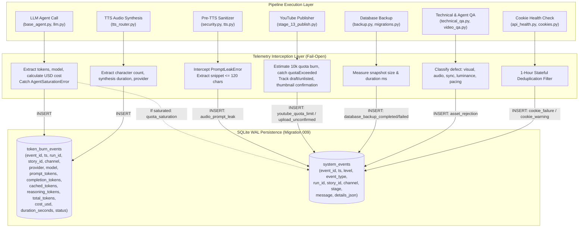
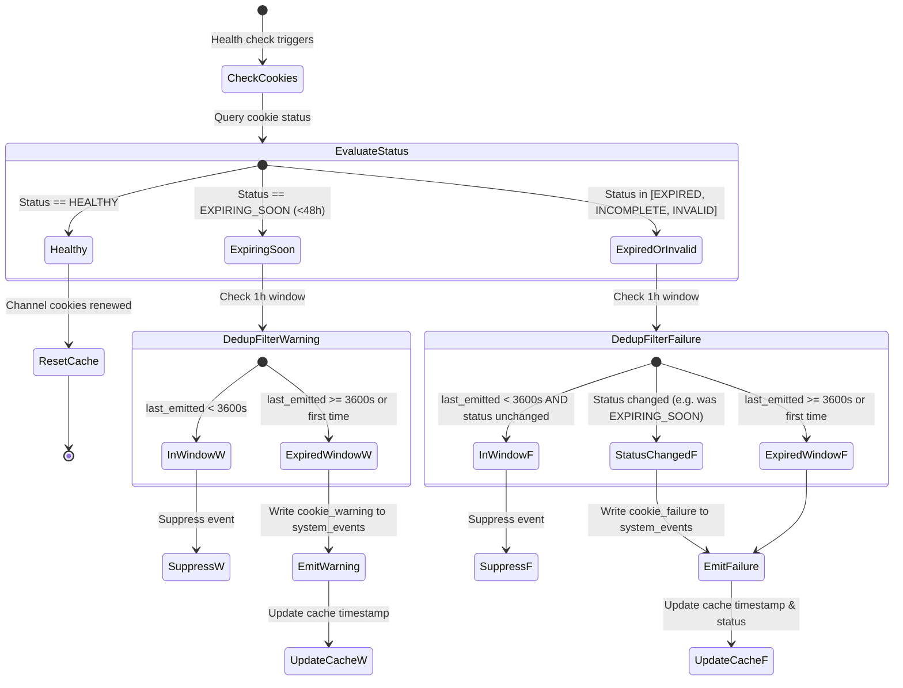

# Technical Design: Comprehensive Pipeline Telemetry & Observability Hub ('El Tubo')

## 1. Executive Summary & Architecture Context

This technical design establishes **"El Tubo"** (`antigravity-quota-monitor-tube`), a unified, high-speed, zero-overhead operational observability and telemetry hub for the `yt-auto` autonomous media production pipeline.

### 1.1 Problem Context
Prior to this architecture, operational telemetry within `yt-auto` was fragmented across ephemeral files (`task_result.json`), unindexed log lines, or isolated check routines:
1. **System Resources & Stoppages**: While host resource budgets are strictly constrained to $\le 2.0$ CPU cores and $\le 2.0$ GiB RAM ([`REG-14`](file:///home/moku/.gemini/antigravity-cli/worktrees/YouTubeChannels/antigravity_quota_monitor_tube/openspec/config.yaml)), real-time CPU/RAM headroom, daemon heartbeat liveness, active worker locks in [`leases`](file:///home/moku/.gemini/antigravity-cli/worktrees/YouTubeChannels/antigravity_quota_monitor_tube/src/core/repository/leases.py), paused channel controls in [`channel_controls`](file:///home/moku/.gemini/antigravity-cli/worktrees/YouTubeChannels/antigravity_quota_monitor_tube/src/core/repository/queue.py), and external API circuit breaker states in [`CircuitBreaker`](file:///home/moku/.gemini/antigravity-cli/worktrees/YouTubeChannels/antigravity_quota_monitor_tube/src/agents/base_agent.py) lacked centralized aggregation.
2. **Multi-Provider Token Burn & Quotas**: Token and character consumption across AI providers—Antigravity Pro ([`ProgrammaticAgent`](file:///home/moku/.gemini/antigravity-cli/worktrees/YouTubeChannels/antigravity_quota_monitor_tube/src/agents/base_agent.py)), Gemini REST ([`src/llm.py`](file:///home/moku/.gemini/antigravity-cli/worktrees/YouTubeChannels/antigravity_quota_monitor_tube/src/llm.py)), Grok, and TTS narration engines ([`src/audio/tts_router.py`](file:///home/moku/.gemini/antigravity-cli/worktrees/YouTubeChannels/antigravity_quota_monitor_tube/src/audio/tts_router.py))—were not persisted into SQLite tables, making aggregate cost, token burn rate analysis, and saturation backoffs ([`JobStatus.WAITING_LLM_QUOTA`](file:///home/moku/.gemini/antigravity-cli/worktrees/YouTubeChannels/antigravity_quota_monitor_tube/src/core/domain.py), [`JobStatus.WAITING_IMAGE_QUOTA`](file:///home/moku/.gemini/antigravity-cli/worktrees/YouTubeChannels/antigravity_quota_monitor_tube/src/core/domain.py)) impossible to inspect systematically.
3. **YouTube Limits & Staged Publishing**: YouTube Data API v3 daily 10,000 quota units, channel upload rate limits ([`JobStatus.WAITING_YOUTUBE_LIMIT`](file:///home/moku/.gemini/antigravity-cli/worktrees/YouTubeChannels/antigravity_quota_monitor_tube/src/core/domain.py)), staged draft/unlisted publication tracking, custom thumbnail confirmation, and ambiguous network dropouts ([`JobStatus.UPLOAD_UNCONFIRMED`](file:///home/moku/.gemini/antigravity-cli/worktrees/YouTubeChannels/antigravity_quota_monitor_tube/src/core/domain.py)) operated without unified visibility.
4. **Failure & Incident Registration**: Worker crashes, orphaned lease recoveries, and session decay (expired or expiring cookies $< 48\text{h}$ in [`src/core/cookies.py`](file:///home/moku/.gemini/antigravity-cli/worktrees/YouTubeChannels/antigravity_quota_monitor_tube/src/core/cookies.py)) did not emit structured, deduplicated operational incidents.
5. **MCP Server Self-Health**: Model Context Protocol (MCP) clients had no way to detect whether the server was broken or if Single-Source-of-Truth (SSOT) drift existed against [`scripts/verify_mcp_sync.py`](file:///home/moku/.gemini/antigravity-cli/worktrees/YouTubeChannels/antigravity_quota_monitor_tube/scripts/verify_mcp_sync.py).
6. **Audio Prompt-Leak Detection**: Narrations containing leaked system prompt fragments or director cues caught by [`src/sanitizer/security.py`](file:///home/moku/.gemini/antigravity-cli/worktrees/YouTubeChannels/antigravity_quota_monitor_tube/src/sanitizer/security.py) and [`src/sanitizer/tts.py`](file:///home/moku/.gemini/antigravity-cli/worktrees/YouTubeChannels/antigravity_quota_monitor_tube/src/sanitizer/tts.py) ([`PromptLeakError`](file:///home/moku/.gemini/antigravity-cli/worktrees/YouTubeChannels/antigravity_quota_monitor_tube/src/sanitizer/security.py)) were raised as raw exceptions without being indexed into an observability stream.
7. **Database Backup & SQLite Health**: Database snapshot operations ([`backup_database()`](file:///home/moku/.gemini/antigravity-cli/worktrees/YouTubeChannels/antigravity_quota_monitor_tube/src/core/repository/migrations.py), [`manage.py backup`](file:///home/moku/.gemini/antigravity-cli/worktrees/YouTubeChannels/antigravity_quota_monitor_tube/src/cli/handlers/backup.py)), snapshot file sizes, WAL file growth, migration version parity, and `PRAGMA integrity_check` lacked automated tracking.
8. **Asset Rejection Analytics**: Video and image rejections across automated QA gates ([`src/verification/technical_qa.py`](file:///home/moku/.gemini/antigravity-cli/worktrees/YouTubeChannels/antigravity_quota_monitor_tube/src/verification/technical_qa.py), [`src/agents/video_qa.py`](file:///home/moku/.gemini/antigravity-cli/worktrees/YouTubeChannels/antigravity_quota_monitor_tube/src/agents/video_qa.py)) and human Telegram reviewer rejections (`review_jobs.status = 'REJECTED'`) lacked category classification and defect counting.

### 1.2 Proposed System
"El Tubo" addresses these gaps through an in-process, zero-overhead SQLite WAL observability hub. It introduces Migration 009 (`token_burn_events`), repository aggregations, proactive incident interceptors, an MCP self-health checker, and a unified `TubeSnapshot` surfaced across CLI (`main.py tube`, `status --tube`), MCP resources (`system://tube`, `system://quotas`, enriched `system://health`), MCP tool (`get_tube_status`), and throttled Telegram operational alerts.

---

## 2. Technical Approach & Design Principles

### 2.1 In-Process SQLite WAL Telemetry Hub ("El Tubo")
Rather than running external monitoring daemons or scraping HTTP endpoints, El Tubo operates completely in-process within the existing Python runtime:
- **Storage Substrate**: SQLite 3 with Write-Ahead Logging (WAL) and `PRAGMA busy_timeout = 15000` ([`src/core/repository/migrations.py`](file:///home/moku/.gemini/antigravity-cli/worktrees/YouTubeChannels/antigravity_quota_monitor_tube/src/core/repository/migrations.py)).
- **Telemetry Ingestion**: Interceptors at natural stage boundaries write rows into `token_burn_events` and `system_events` via short-lived transactions.
- **Collector Architecture**: `TubeCollector` in [`src/observability/tube.py`](file:///home/moku/.gemini/antigravity-cli/worktrees/YouTubeChannels/antigravity_quota_monitor_tube/src/observability/tube.py) compiles all metrics into an immutable, strongly-typed `TubeSnapshot` in $< 10\text{ ms}$.

### 2.2 Non-Blocking Fail-Open Telemetry Writes
Telemetry must never compromise production pipeline reliability:
- All telemetry write operations (`record_token_burn`, `record_incident`, `emit_prompt_leak`) are wrapped in non-blocking `try/except Exception as exc: logger.debug(...)` blocks.
- If SQLite encounters transient lock contention or a disk error during telemetry persistence, the production pipeline (script generation, audio synthesis, video rendering, YouTube publishing) proceeds unaffected without raising exceptions.
- Telemetry reads execute in read-only mode (`connect(..., read_only=True)`), preventing read locks from interfering with active pipeline writes.

### 2.3 Strict Resource Budget Enforcement ($\le 2.0$ CPU Cores, $\le 2.0$ GiB RAM)
Per project policy [`REG-14`](file:///home/moku/.gemini/antigravity-cli/worktrees/YouTubeChannels/antigravity_quota_monitor_tube/openspec/config.yaml):
- **CPU Sampling**: Telemetry collection samples CPU percentage using `/proc/stat` or lightweight `psutil.cpu_percent(interval=None)` without blocking delays (execution time $< 2\text{ ms}$).
- **RAM Sampling**: Process RSS memory is read from `/proc/self/status` (`VmRSS`) or `psutil.Process().memory_info().rss` in $< 1\text{ ms}$. If process RSS exceeds $2048\text{ MiB}$ ($2.0\text{ GiB}$), the hub flags `ram_status = 'CRITICAL'`.
- **Disk Headroom**: Free storage is queried via `os.statvfs()` on the workspace partition. If free storage drops below $2.0\text{ GiB}$, the hub flags `disk_status = 'CRITICAL'`.
- **Zero External Footprint**: Zero external background daemon processes (Prometheus, Grafana, Vector, Datadog) and zero Docker monitoring containers are spawned.

### 2.4 Zero Media Processing Performance Impact
In accordance with `media-processing-performance-policy`:
- **Audio DSP Single-Pass Mastering**: Untouched. No intermediate audio buffering or real-time stream analysis is added during synthesis.
- **FFmpeg Stream-Copy Concatenation**: Untouched. Multi-act longform stream-copy turnaround ($\le 45\text{s}$) is completely preserved.
- **Zero Transcoding Overhead**: No video frames are decoded, captured, or held in memory buffers by the observability collector.

---

## 3. Architecture Decisions (ADRs)

### ADR-01: In-Process SQLite WAL + Additive Migration 009 vs External Monitoring Daemons
- **Context**: The pipeline requires persistent, searchable observability across multi-provider token burn, API quotas, and operational incidents. Traditional telemetry stacks (Prometheus, StatsD, Grafana, Vector) require long-running background daemon containers and HTTP scraping.
- **Decision**: Persist telemetry directly into the primary SQLite database (`shorts_queue.db`) using WAL mode. Provision Migration 009 (`009_pipeline_telemetry_and_token_burn`) to create `token_burn_events` and associated read indices.
- **Alternatives Considered**:
  - *Alternative A: Prometheus Exporter + Node Exporter*: Run an HTTP daemon exposing metrics. *Rejected*: Consumes 150–300 MiB RAM and continuous CPU cycles, violating the $\le 2.0$ CPU cores and $\le 2.0$ GiB RAM budget.
  - *Alternative B: File-based JSONL logs*: Append to `logs/telemetry.jsonl`. *Rejected*: Lacks relational indexing, atomic multi-process coordination, and efficient window aggregations (`WHERE ts >= ?`).
- **Rationale**: SQLite WAL provides zero-cost ACID persistence, instant sub-5ms queries, and reuses the existing transactional infrastructure with zero external operational dependencies.

### ADR-02: Unified `TubeSnapshot` Dataclass vs Fragmented Endpoint Scraping
- **Context**: Operational status must be presented across human CLI dashboards (`python main.py tube`), MCP resources (`system://tube`, `system://quotas`, `system://health`), MCP tools (`get_tube_status`), and Telegram alerting bots.
- **Decision**: Define a single canonical dataclass `TubeSnapshot` in [`src/observability/tube.py`](file:///home/moku/.gemini/antigravity-cli/worktrees/YouTubeChannels/antigravity_quota_monitor_tube/src/observability/tube.py) containing strongly-typed sub-metrics (`HostResourceMetrics`, `DaemonStoppageMetrics`, `TokenBurnSummary`, `YouTubeQuotaMetrics`, `CookieIncidentMetrics`, `PromptLeakMetrics`, `DatabaseHealthMetrics`, `MCPHealthMetrics`, `AssetRejectionSummary`). All presentation surfaces consume this single snapshot or a filtered projection thereof.
- **Alternatives Considered**:
  - *Alternative A: Individual ad-hoc queries per CLI flag / MCP resource*: *Rejected*: Leads to code duplication, inconsistent timestamp baselines, and redundant database connections.
- **Rationale**: A single dataclass provides a single source of truth (SSOT) for all operational surfaces, guarantees atomic point-in-time consistency, and simplifies automated testing.

### ADR-03: Stateful 1-Hour Deduplication Window for Cookie Incident Lifecycle
- **Context**: Daemon schedulers and preflight checks evaluate channel cookie health frequently (e.g., every 30s or during lane runs). When a channel cookie enters `EXPIRING_SOON` (<48h) or `EXPIRED`, repeated checks would insert thousands of duplicate incident rows into `system_events`, bloating WAL files and spamming alert channels.
- **Decision**: Implement a stateful in-memory deduplication registry in [`src/observability/tube.py`](file:///home/moku/.gemini/antigravity-cli/worktrees/YouTubeChannels/antigravity_quota_monitor_tube/src/observability/tube.py) / [`src/api_health.py`](file:///home/moku/.gemini/antigravity-cli/worktrees/YouTubeChannels/antigravity_quota_monitor_tube/src/api_health.py) keyed by `(channel, event_type, status)`:
  - If identical `(channel, event_type, status)` was recorded $< 3,600\text{s}$ (1 hour) ago, incident emission is suppressed.
  - If session status degrades (e.g. `EXPIRING_SOON` $\to$ `EXPIRED`) or recovers (`EXPIRED` $\to$ `HEALTHY`), the deduplication window is bypassed immediately, emitting the transition event without delay.
- **Alternatives Considered**:
  - *Alternative A: SQL query checking the last event on every check*: *Rejected*: Adds unnecessary SQLite read queries on high-frequency checks.
- **Rationale**: In-memory timestamp cache provides $O(1)$ lookups with negligible memory footprint (<1 KB) while guaranteeing zero duplicate spam in `system_events`.

### ADR-04: Pre-TTS Exception Barrier Hooking for Audio Prompt-Leak Telemetry
- **Context**: When an LLM leaks instructions, director notes, or taboo phrases ("como modelo de lenguaje", "aquí tienes tu guion"), pre-TTS validators in [`src/sanitizer/security.py`](file:///home/moku/.gemini/antigravity-cli/worktrees/YouTubeChannels/antigravity_quota_monitor_tube/src/sanitizer/security.py) and [`src/sanitizer/tts.py`](file:///home/moku/.gemini/antigravity-cli/worktrees/YouTubeChannels/antigravity_quota_monitor_tube/src/sanitizer/tts.py) raise [`PromptLeakError`](file:///home/moku/.gemini/antigravity-cli/worktrees/YouTubeChannels/antigravity_quota_monitor_tube/src/sanitizer/security.py). Previously, these exceptions aborted execution without structured telemetry, obscuring prompt drift patterns.
- **Decision**: Hook pre-TTS validation barriers:
  1. Catch `PromptLeakError` before re-raising.
  2. Extract matched pattern name, truncated leak snippet ($\le 120$ characters), AI model, provider, and channel context.
  3. Emit an `audio_prompt_leak` event to `system_events` via fail-open write.
  4. If $> 3$ prompt leaks occur within a 30-minute window for a model/channel, escalate an operational alert via `send_operational_alert`.
  5. Re-raise `PromptLeakError` so poisoned text is never passed to audio synthesis engines.
- **Alternatives Considered**:
  - *Alternative A: Let stage 4 catch the error and log*: *Rejected*: Pre-TTS sanitization also runs during stage 2 (script generation) and standalone test tools; barrier-level hooking ensures 100% coverage regardless of caller.
- **Rationale**: Preserves an inviolable security boundary while generating rich forensic telemetry for model prompt degradation.

### ADR-05: Tri-State MCP Server Self-Health Validation and Automated SSOT Drift Check
- **Context**: AI agents interacting with `yt-auto` via MCP have no mechanism to detect if the MCP server has broken dependencies, missing tool registrations, or documentation drift against [`scripts/verify_mcp_sync.py`](file:///home/moku/.gemini/antigravity-cli/worktrees/YouTubeChannels/antigravity_quota_monitor_tube/scripts/verify_mcp_sync.py).
- **Decision**: Create `MCPHealthChecker` in [`src/observability/mcp_health.py`](file:///home/moku/.gemini/antigravity-cli/worktrees/YouTubeChannels/antigravity_quota_monitor_tube/src/observability/mcp_health.py) evaluating:
  1. Factory Importability: Asserts `create_mcp_server()` instantiates cleanly without exceptions.
  2. Runtime Tool Crash Rate: Computes failure percentage from `system_events` where `event_type = 'mcp_tool_failure'`.
  3. Programmatic SSOT Drift Check: Invokes `verify_mcp_sync(repo_root)` in-process to compare runtime registrations against `CANONICAL_TOOLS`, `CANONICAL_RESOURCES`, and `docs/MCP.md`.
  4. Consolidated Tri-State Resolution:
     - `BROKEN`: Import errors, server instantiation exceptions, or database inaccessible.
     - `DEGRADED`: SSOT drift detected or tool error rate $> 20\%$.
     - `HEALTHY`: 100% parity, clean import, nominal error rate.
- **Alternatives Considered**:
  - *Alternative A: Shelling out to `python scripts/verify_mcp_sync.py`*: *Rejected*: Spawns external Python processes, which is slow and adds subprocess overhead.
- **Rationale**: Programmatic in-process inspection provides instant tri-state health classification with zero process spawn overhead.

---

## 4. Data Flow & System Interaction Diagrams

### 4.1 Telemetry Ingestion Flow


### 4.2 Aggregation and Surface Presentation Flow
```mermaid
flowchart TD
    subgraph StorageSources["Database & Runtime Sources"]
        TB_DATA[("token_burn_events")]
        SE_DATA[("system_events")]
        LEASES_DATA[("leases & lane_leases")]
        CONTROLS_DATA[("channel_controls")]
        SCHED_DATA[("daemon_liveness")]
        PROC_DATA["/proc/stat & /proc/self/status\n(Host CPU & RAM RSS)"]
        DISK_DATA["os.statvfs\n(Disk Headroom)"]
        MCP_DATA["MCP Server Factory\n& verify_mcp_sync SSOT"]
    end

    subgraph CollectorHub["Observability Hub (src/observability/)"]
        QM["QuotaMonitor (quota.py)\nMulti-provider burn & 10k quota"]
        MH["MCPHealthChecker (mcp_health.py)\nImport, tool error rate, SSOT drift"]
        TC["TubeCollector (tube.py)\nConsolidates all metrics into TubeSnapshot"]
    end

    subgraph Presentation["Operational Surfaces"]
        CLI_TUBE["CLI: python main.py tube\n(Rich ANSI Dashboard & Gauges)"]
        CLI_JSON["CLI: python main.py status --tube --json\n(Structured JSON Output)"]
        MCP_RES["MCP Resources:\n• system://tube\n• system://quotas\n• system://health (enriched)"]
        MCP_TOOL["MCP Tool:\nget_tube_status(channel, window_hours, ...)"]
        ALERT_TG["Telegram Alerts:\nOperational alert on saturation, stale daemon,\nprompt leak clusters, or cookie expiration"]
    end

    TB_DATA --> QM
    PROC_DATA --> TC
    DISK_DATA --> TC
    LEASES_DATA --> TC
    CONTROLS_DATA --> TC
    SCHED_DATA --> TC
    SE_DATA --> TC
    QM --> TC
    MCP_DATA --> MH --> TC

    TC -->|TubeSnapshot| CLI_TUBE
    TC -->|TubeSnapshot.to_dict()| CLI_JSON
    TC -->|TubeSnapshot.to_dict()| MCP_RES
    TC -->|Filtered projection| MCP_TOOL
    TC -.->|Critical triggers| ALERT_TG
```

### 4.3 Incident Deduplication & Alert Escalation State Machine


---

## 5. Concrete File Changes Table

| File Path | Status | Primary Responsibilities |
|:---|:---|:---|
| [`src/observability/__init__.py`](file:///home/moku/.gemini/antigravity-cli/worktrees/YouTubeChannels/antigravity_quota_monitor_tube/src/observability/__init__.py) | **New** | Package exports for `TubeCollector`, `TubeSnapshot`, `QuotaMonitor`, `MCPHealthChecker`. |
| [`src/observability/tube.py`](file:///home/moku/.gemini/antigravity-cli/worktrees/YouTubeChannels/antigravity_quota_monitor_tube/src/observability/tube.py) | **New** | Core collector compiling `TubeSnapshot`: host resources (/proc), stoppages, locks, WAL health, prompt leaks, incidents. |
| [`src/observability/quota.py`](file:///home/moku/.gemini/antigravity-cli/worktrees/YouTubeChannels/antigravity_quota_monitor_tube/src/observability/quota.py) | **New** | Multi-provider token tracking, USD costs, YouTube 10k quota daily burn, saturation states, backoff advice. |
| [`src/observability/mcp_health.py`](file:///home/moku/.gemini/antigravity-cli/worktrees/YouTubeChannels/antigravity_quota_monitor_tube/src/observability/mcp_health.py) | **New** | MCP server self-diagnostic health checks: import check, tool error rate, in-process SSOT parity check against `verify_mcp_sync.py`. |
| [`src/mcp/tools/get_tube_status.py`](file:///home/moku/.gemini/antigravity-cli/worktrees/YouTubeChannels/antigravity_quota_monitor_tube/src/mcp/tools/get_tube_status.py) | **New** | Canonical MCP tool exposing filtered tube telemetry (resources, quotas, incidents, stoppages) to AI agents. |
| [`tests/unit/test_tube_telemetry.py`](file:///home/moku/.gemini/antigravity-cli/worktrees/YouTubeChannels/antigravity_quota_monitor_tube/tests/unit/test_tube_telemetry.py) | **New** | Unit tests for tube collector, host metrics sampling, channel stoppage aggregation, and CLI formatting. |
| [`tests/unit/test_token_burn_tracking.py`](file:///home/moku/.gemini/antigravity-cli/worktrees/YouTubeChannels/antigravity_quota_monitor_tube/tests/unit/test_token_burn_tracking.py) | **New** | Unit tests for migration 009, `record_token_burn()`, `query_token_burn_summary()`, and 30-day retention pruning. |
| [`tests/unit/test_mcp_tube.py`](file:///home/moku/.gemini/antigravity-cli/worktrees/YouTubeChannels/antigravity_quota_monitor_tube/tests/unit/test_mcp_tube.py) | **New** | Unit tests for MCP resources `system://tube`, `system://quotas`, enriched `system://health`, and `get_tube_status`. |
| [`tests/unit/test_prompt_leak_telemetry.py`](file:///home/moku/.gemini/antigravity-cli/worktrees/YouTubeChannels/antigravity_quota_monitor_tube/tests/unit/test_prompt_leak_telemetry.py) | **New** | Unit tests verifying pre-TTS `PromptLeakError` interception, snippet truncation, and cluster alert triggers. |
| [`src/core/repository/migrations.py`](file:///home/moku/.gemini/antigravity-cli/worktrees/YouTubeChannels/antigravity_quota_monitor_tube/src/core/repository/migrations.py) | **Modified** | Add Migration 009 (`token_burn_events` table and indices, `system_events` performance index); bump `EXPECTED_MIGRATION_VERSION = 9`. |
| [`src/core/repository/queue.py`](file:///home/moku/.gemini/antigravity-cli/worktrees/YouTubeChannels/antigravity_quota_monitor_tube/src/core/repository/queue.py) | **Modified** | Add repository methods: `record_token_burn()`, `query_token_burn_summary()`, `query_asset_rejection_counts()`, `query_tube_incidents()`, `query_channel_stoppages()`, `prune_token_burn_events()`. |
| [`src/core/repository/__init__.py`](file:///home/moku/.gemini/antigravity-cli/worktrees/YouTubeChannels/antigravity_quota_monitor_tube/src/core/repository/__init__.py) | **Modified** | Re-export new repository methods and migration 009 definitions. |
| [`src/agents/base_agent.py`](file:///home/moku/.gemini/antigravity-cli/worktrees/YouTubeChannels/antigravity_quota_monitor_tube/src/agents/base_agent.py) | **Modified** | Persist Antigravity Pro token burn and USD cost to `token_burn_events`; on `AgentSaturationError`, record saturation and emit `quota_saturation`. |
| [`src/llm.py`](file:///home/moku/.gemini/antigravity-cli/worktrees/YouTubeChannels/antigravity_quota_monitor_tube/src/llm.py) | **Modified** | Hook `_curate_with_gemini` to extract usage metadata and persist to `token_burn_events` with `provider = 'gemini_rest'`. |
| [`src/audio/tts_router.py`](file:///home/moku/.gemini/antigravity-cli/worktrees/YouTubeChannels/antigravity_quota_monitor_tube/src/audio/tts_router.py) | **Modified** | Record TTS duration, character count, provider, and estimated USD cost to `token_burn_events`. |
| [`src/sanitizer/security.py`](file:///home/moku/.gemini/antigravity-cli/worktrees/YouTubeChannels/antigravity_quota_monitor_tube/src/sanitizer/security.py) | **Modified** | Wrap taboo barrier validation to intercept `PromptLeakError` and emit `audio_prompt_leak` event into `system_events`. |
| [`src/sanitizer/tts.py`](file:///home/moku/.gemini/antigravity-cli/worktrees/YouTubeChannels/antigravity_quota_monitor_tube/src/sanitizer/tts.py) | **Modified** | Wrap pre-TTS validation to intercept `PromptLeakError` and emit `audio_prompt_leak` event into `system_events`. |
| [`src/pipeline/stages/stage_13_publish.py`](file:///home/moku/.gemini/antigravity-cli/worktrees/YouTubeChannels/antigravity_quota_monitor_tube/src/pipeline/stages/stage_13_publish.py) | **Modified** | Track YouTube 10k quota burn, catch `YouTubeQuotaExceededError`/`YouTubeUploadLimitError`, handle drafts/unlisted, thumbnail confirmation, `UPLOAD_UNCONFIRMED`. |
| [`src/core/cookies.py`](file:///home/moku/.gemini/antigravity-cli/worktrees/YouTubeChannels/antigravity_quota_monitor_tube/src/core/cookies.py) | **Modified** | Hook validation routines to emit `cookie_failure` and `cookie_warning` with stateful 1-hour deduplication. |
| [`src/api_health.py`](file:///home/moku/.gemini/antigravity-cli/worktrees/YouTubeChannels/antigravity_quota_monitor_tube/src/api_health.py) | **Modified** | Emit structured cookie incident events during `check_cookies()` with stateful 1-hour deduplication. |
| [`src/youtube/session_uploader.py`](file:///home/moku/.gemini/antigravity-cli/worktrees/YouTubeChannels/antigravity_quota_monitor_tube/src/youtube/session_uploader.py) | **Modified** | Emit structured `cookie_failure` events on upload session failures and authentication rejections. |
| [`src/cli/handlers/backup.py`](file:///home/moku/.gemini/antigravity-cli/worktrees/YouTubeChannels/antigravity_quota_monitor_tube/src/cli/handlers/backup.py) | **Modified** | Emit `database_backup_completed` or `database_backup_failed` events with snapshot size in bytes and duration ms. |
| [`src/verification/technical_qa.py`](file:///home/moku/.gemini/antigravity-cli/worktrees/YouTubeChannels/antigravity_quota_monitor_tube/src/verification/technical_qa.py) | **Modified** | Emit structured `asset_rejection` events with defect category (`visual`, `audio`, `sync`, `luminance`) and asset identifier. |
| [`src/agents/video_qa.py`](file:///home/moku/.gemini/antigravity-cli/worktrees/YouTubeChannels/antigravity_quota_monitor_tube/src/agents/video_qa.py) | **Modified** | Emit structured `asset_rejection` events upon scene/shot visual rejection. |
| [`src/cli/subparsers.py`](file:///home/moku/.gemini/antigravity-cli/worktrees/YouTubeChannels/antigravity_quota_monitor_tube/src/cli/subparsers.py) | **Modified** | Register `tube` subcommand and `--tube` flag under `status`. |
| [`src/cli/handlers/status.py`](file:///home/moku/.gemini/antigravity-cli/worktrees/YouTubeChannels/antigravity_quota_monitor_tube/src/cli/handlers/status.py) | **Modified** | Implement `cli_tube()` and `print_tube()` for rich terminal dashboard and JSON output. |
| [`src/mcp/resources.py`](file:///home/moku/.gemini/antigravity-cli/worktrees/YouTubeChannels/antigravity_quota_monitor_tube/src/mcp/resources.py) | **Modified** | Register `system://tube` and `system://quotas`; enrich `system://health` with daemon heartbeat, MCP health, cookie decay, WAL. |
| [`src/mcp/tools/__init__.py`](file:///home/moku/.gemini/antigravity-cli/worktrees/YouTubeChannels/antigravity_quota_monitor_tube/src/mcp/tools/__init__.py) | **Modified** | Export `get_tube_status` tool. |
| [`src/mcp/server.py`](file:///home/moku/.gemini/antigravity-cli/worktrees/YouTubeChannels/antigravity_quota_monitor_tube/src/mcp/server.py) | **Modified** | Register `get_tube_status` tool in `create_mcp_server()`. |
| [`scripts/verify_mcp_sync.py`](file:///home/moku/.gemini/antigravity-cli/worktrees/YouTubeChannels/antigravity_quota_monitor_tube/scripts/verify_mcp_sync.py) | **Modified** | Add `"get_tube_status"` to `CANONICAL_TOOLS` and `"system://tube"`, `"system://quotas"` to `CANONICAL_RESOURCES`. |
| [`docs/MCP.md`](file:///home/moku/.gemini/antigravity-cli/worktrees/YouTubeChannels/antigravity_quota_monitor_tube/docs/MCP.md) | **Modified** | Document `get_tube_status`, `system://tube`, and `system://quotas` schemas, parameters, and return payloads. |

---

## 6. Interfaces & Contracts

### 6.1 Strongly-Typed Telemetry Dataclasses

```python
"""src/observability/tube.py - Strongly-typed contracts for El Tubo telemetry."""
from __future__ import annotations

from dataclasses import asdict, dataclass, field
from typing import Any, Dict, List, Optional, Tuple


@dataclass(frozen=True)
class HostResourceMetrics:
    cpu_percent: float
    ram_rss_mib: float
    ram_rss_gib: float
    ram_status: str  # "OK" | "DEGRADED" | "CRITICAL"
    disk_free_gib: float
    disk_status: str  # "OK" | "DEGRADED" | "CRITICAL"
    overall_status: str  # "OK" | "DEGRADED" | "CRITICAL"
    sampling_duration_ms: float

    def to_dict(self) -> Dict[str, Any]:
        return asdict(self)


@dataclass(frozen=True)
class DaemonStoppageMetrics:
    heartbeat_age_seconds: Optional[int]
    daemon_liveness_status: str  # "HEALTHY" | "DEGRADED" | "STALE" | "STOPPED"
    paused_channels: List[Dict[str, Any]]
    active_locks: List[Dict[str, Any]]
    expired_locks_count: int
    circuit_breakers: Dict[str, Dict[str, Any]]
    tripped_breakers_count: int

    def to_dict(self) -> Dict[str, Any]:
        return asdict(self)


@dataclass(frozen=True)
class TokenBurnSummary:
    window_hours: int
    total_prompt_tokens: int
    total_completion_tokens: int
    total_cached_tokens: int
    total_reasoning_tokens: int
    total_tokens: int
    total_cost_usd: float
    total_calls: int
    total_saturations: int
    provider_breakdown: Dict[str, Dict[str, Any]]
    model_breakdown: Dict[str, Dict[str, Any]]

    def to_dict(self) -> Dict[str, Any]:
        return asdict(self)


@dataclass(frozen=True)
class YouTubeQuotaMetrics:
    daily_budget_units: int  # 10,000
    estimated_consumed_units: int
    remaining_quota_units: int
    estimated_remaining_uploads: int
    quota_cycle_reset_utc: str
    channel_daily_uploads: Dict[str, int]
    staged_drafts_count: int
    staged_unlisted_count: int
    unconfirmed_uploads_count: int
    quota_status: str  # "OK" | "WARNING" | "EXHAUSTED"

    def to_dict(self) -> Dict[str, Any]:
        return asdict(self)


@dataclass(frozen=True)
class CookieIncidentMetrics:
    channel_statuses: Dict[str, str]  # {"horror": "HEALTHY", "drama": "EXPIRING_SOON"}
    recent_warnings_count: int
    recent_failures_count: int
    degraded_channels: List[str]

    def to_dict(self) -> Dict[str, Any]:
        return asdict(self)


@dataclass(frozen=True)
class PromptLeakMetrics:
    window_hours: int
    total_leaks: int
    leaks_by_model: Dict[str, int]
    leaks_by_channel: Dict[str, int]
    recent_leaks: List[Dict[str, Any]]
    alert_cluster_active: bool

    def to_dict(self) -> Dict[str, Any]:
        return asdict(self)


@dataclass(frozen=True)
class DatabaseHealthMetrics:
    db_size_bytes: int
    db_size_mib: float
    wal_size_bytes: int
    wal_size_mib: float
    wal_status: str  # "OK" | "GROWTH_WARNING" | "CRITICAL_WAL_BLOAT"
    wal_checkpoint_info: Tuple[int, int, int]
    applied_migration_version: int
    expected_migration_version: int  # 9
    migration_parity: bool
    migration_status: str  # "SYNCED" | "PENDING_MIGRATIONS" | "FUTURE_VERSION_DRIFT"
    last_backup_timestamp: Optional[str]
    last_backup_age_hours: Optional[float]
    last_backup_size_bytes: Optional[int]
    backup_status: str  # "HEALTHY" | "BACKUP_STALE_WARNING" | "NO_BACKUP"
    integrity_check_result: str  # "ok" -> "HEALTHY" | "CORRUPTED"

    def to_dict(self) -> Dict[str, Any]:
        return asdict(self)


@dataclass(frozen=True)
class MCPHealthMetrics:
    overall_status: str  # "HEALTHY" | "DEGRADED" | "BROKEN"
    import_ok: bool
    registered_tools_count: int
    registered_resources_count: int
    registered_prompts_count: int
    parity_ok: bool
    drift_errors: List[str]
    recent_tool_failure_rate: float
    status_reason: str

    def to_dict(self) -> Dict[str, Any]:
        return asdict(self)


@dataclass(frozen=True)
class AssetRejectionSummary:
    window_hours: int
    total_automated_rejections: int
    total_human_rejections: int
    total_rejections: int
    category_breakdown: Dict[str, int]  # {"visual": 2, "sync": 1, ...}
    channel_breakdown: Dict[str, int]
    top_offending_assets: List[Dict[str, Any]]

    def to_dict(self) -> Dict[str, Any]:
        return asdict(self)


@dataclass(frozen=True)
class TubeSnapshot:
    timestamp: str  # ISO-8601 UTC
    system_status: str  # "HEALTHY" | "DEGRADED" | "CRITICAL"
    host_resources: HostResourceMetrics
    daemon_stoppages: DaemonStoppageMetrics
    token_burn: TokenBurnSummary
    youtube_quotas: YouTubeQuotaMetrics
    cookie_health: CookieIncidentMetrics
    prompt_leaks: PromptLeakMetrics
    database_health: DatabaseHealthMetrics
    mcp_health: MCPHealthMetrics
    asset_rejections: AssetRejectionSummary
    recent_incidents: List[Dict[str, Any]]

    def to_dict(self) -> Dict[str, Any]:
        return {
            "timestamp": self.timestamp,
            "system_status": self.system_status,
            "host_resources": self.host_resources.to_dict(),
            "daemon_stoppages": self.daemon_stoppages.to_dict(),
            "token_burn": self.token_burn.to_dict(),
            "youtube_quotas": self.youtube_quotas.to_dict(),
            "cookie_health": self.cookie_health.to_dict(),
            "prompt_leaks": self.prompt_leaks.to_dict(),
            "database_health": self.database_health.to_dict(),
            "mcp_health": self.mcp_health.to_dict(),
            "asset_rejections": self.asset_rejections.to_dict(),
            "recent_incidents": self.recent_incidents,
        }
```

### 6.2 SQL Schema DDL (Migration 009)

```sql
-- Migration 009: Pipeline Telemetry, Multi-Provider Token Burn & Indexing
CREATE TABLE IF NOT EXISTS token_burn_events (
    event_id TEXT PRIMARY KEY,
    ts TEXT NOT NULL,
    run_id TEXT,
    story_id TEXT,
    channel TEXT,
    provider TEXT NOT NULL,
    model TEXT NOT NULL,
    prompt_tokens INTEGER NOT NULL DEFAULT 0,
    completion_tokens INTEGER NOT NULL DEFAULT 0,
    cached_tokens INTEGER NOT NULL DEFAULT 0,
    reasoning_tokens INTEGER NOT NULL DEFAULT 0,
    total_tokens INTEGER NOT NULL DEFAULT 0,
    cost_usd REAL NOT NULL DEFAULT 0.0,
    duration_seconds REAL NOT NULL DEFAULT 0.0,
    status TEXT NOT NULL DEFAULT 'success' CHECK(status IN ('success', 'failed', 'saturated')),
    created_at TEXT NOT NULL DEFAULT (strftime('%Y-%m-%dT%H:%M:%SZ', 'now'))
);

CREATE INDEX IF NOT EXISTS idx_token_burn_ts ON token_burn_events(ts);
CREATE INDEX IF NOT EXISTS idx_token_burn_run ON token_burn_events(run_id);
CREATE INDEX IF NOT EXISTS idx_token_burn_provider_model ON token_burn_events(provider, model);
CREATE INDEX IF NOT EXISTS idx_token_burn_channel ON token_burn_events(channel);
CREATE INDEX IF NOT EXISTS idx_events_type_ts ON system_events(event_type, ts);
```

### 6.3 Repository Aggregation Contracts (`QueueOperationsMixin`)

```python
# Methods added to QueueOperationsMixin in src/core/repository/queue.py:

def record_token_burn(
    self,
    *,
    event_id: Optional[str] = None,
    run_id: Optional[str] = None,
    story_id: Optional[str] = None,
    channel: Optional[str] = None,
    provider: str,
    model: str,
    prompt_tokens: int = 0,
    completion_tokens: int = 0,
    cached_tokens: int = 0,
    reasoning_tokens: int = 0,
    total_tokens: int = 0,
    cost_usd: float = 0.0,
    duration_seconds: float = 0.0,
    status: str = "success",
) -> str:
    """Non-blocking persistence of LLM / TTS token and USD consumption."""
    ...

def query_token_burn_summary(
    self,
    window_hours: int = 24,
    channel: Optional[str] = None,
    provider: Optional[str] = None,
) -> TokenBurnSummary:
    """Aggregate token burn and USD costs grouped by provider and model."""
    ...

def query_asset_rejection_counts(
    self,
    window_hours: int = 24,
    channel: Optional[str] = None,
) -> AssetRejectionSummary:
    """Aggregate automated QA failures and human review rejections."""
    ...

def query_tube_incidents(
    self,
    window_hours: int = 24,
    event_types: Optional[Sequence[str]] = None,
    limit: int = 50,
) -> List[Dict[str, Any]]:
    """Retrieve chronologically descending operational incidents from system_events."""
    ...

def query_channel_stoppages(self) -> DaemonStoppageMetrics:
    """Aggregate channel pauses, active worker locks, and circuit breaker states."""
    ...

def prune_token_burn_events(self, retention_days: int = 30) -> int:
    """Purge token burn events older than retention threshold during 24h sweep."""
    ...
```

### 6.4 MCP Tool and Resource Contracts

#### Canonical Resources (`src/mcp/resources.py`)
1. **`system://tube`**:
   - Description: Complete operational telemetry snapshot ("El Tubo").
   - MIME Type: `application/json`
   - Content: Full serialized `TubeSnapshot` dictionary.
2. **`system://quotas`**:
   - Description: Multi-provider token burn, USD costs, and YouTube API quota status.
   - MIME Type: `application/json`
   - Content: Serialized `{"token_burn": TokenBurnSummary.to_dict(), "youtube_quotas": YouTubeQuotaMetrics.to_dict()}`.
3. **Enriched `system://health`**:
   - MIME Type: `application/json`
   - Extends existing health payload with keys: `daemon_liveness_status`, `heartbeat_age_seconds`, `mcp_health`, `cookie_health`, `wal_status`.

#### Canonical Tool (`src/mcp/tools/get_tube_status.py`)
- Tool Name: `get_tube_status`
- Description: "Inspect comprehensive pipeline operational telemetry ('El Tubo') including host CPU/RAM headroom, multi-provider token burn, YouTube quota limits, channel stoppages, and recent incidents."
- Arguments:
  - `channel` (optional string): Canonical channel filter (`horror`, `drama`, `scifi`).
  - `window_hours` (optional integer, default `24`): Observation window in hours.
  - `include_incidents` (optional boolean, default `True`): Include recent incident list.
  - `include_burn` (optional boolean, default `True`): Include token burn and USD calculations.
- Return: JSON string formatted content block.

### 6.5 CLI Interface Contracts

1. **Subcommand `main.py tube`**:
   - Flags:
     - `-j`, `--json`: Output raw structured JSON (`TubeSnapshot.to_dict()`).
     - `-c`, `--channel`: Filter metrics to a single canonical channel.
     - `-w`, `--window`: Window in hours (default 24).
     - `--prune`: Manually trigger 30-day token burn retention pruning.
   - ANSI Terminal Output:
     - Section 1: System Gauges (Host CPU %, Process RSS RAM MiB / 2048 MiB budget, Disk Free GiB / 2.0 GiB minimum).
     - Section 2: Daemon & Concurrency (Heartbeat age, active lane leases, paused channels).
     - Section 3: Multi-Provider Token Burn & USD Costs (Breakdown by provider: Antigravity Pro, Gemini REST, Grok, TTS).
     - Section 4: YouTube Data API Quotas (10k daily units used/remaining, staged drafts, thumbnail confirmations).
     - Section 5: Security & Health (Pre-TTS prompt leaks, cookie decay status, WAL file size & checkpoint info, MCP health).
     - Section 6: Recent Incidents Timeline (Last 5–10 operational events).
2. **Flag `main.py status --tube`**:
   - Renders the El Tubo dashboard alongside standard queue status.

---

## 7. Testing Strategy

### 7.1 Unit Tests

1. **`tests/unit/test_tube_telemetry.py`**:
   - Host Metrics Sampling: Assert CPU percentage, process RSS memory in MiB/GiB, and disk free space evaluate in $< 2\text{ ms}$ without spawning subprocesses.
   - Headroom Status Evaluation: Assert RSS $> 2048\text{ MiB}$ returns `ram_status = 'CRITICAL'`; disk free $< 2.0\text{ GiB}$ returns `disk_status = 'CRITICAL'`.
   - Daemon Heartbeat Ages: Assert $\le 60\text{s} \to \text{HEALTHY}$, $61\text{s}–120\text{s} \to \text{DEGRADED}$, $> 120\text{s} \to \text{STALE}$, $0/\text{absent} \to \text{STOPPED}$.
   - Stoppage & Lock Aggregation: Mock `channel_controls` and `leases`/`lane_leases`; verify active locks, paused reasons, and expired locks are correctly compiled.
   - ANSI and JSON Formatting: Assert `print_tube()` produces valid ANSI color output and `--json` produces valid parseable JSON adhering to `TubeSnapshot`.

2. **`tests/unit/test_token_burn_tracking.py`**:
   - Migration 009 Schema: Assert `apply_migrations()` provisions `token_burn_events` with 16 columns and 4 read indices.
   - Persistence & Cost Calculation: Verify `record_token_burn()` correctly inserts prompt, completion, cached, and reasoning tokens with calculated USD cost.
   - Summary Aggregations: Verify `query_token_burn_summary()` aggregates tokens and costs across multiple providers and models accurately.
   - Quota Saturation Handling: Simulate `AgentSaturationError` / HTTP 429; verify row is recorded with `status = 'saturated'` and `quota_saturation` is emitted to `system_events`.
   - Retention Pruning: Insert records older than 30 days and records from 5 days ago; assert `prune_token_burn_events(retention_days=30)` deletes only stale records and returns the deleted row count.

3. **`tests/unit/test_mcp_tube.py`**:
   - Resource `system://tube`: Verify reading returns HTTP 200 with full `TubeSnapshot` JSON structure.
   - Resource `system://quotas`: Verify reading returns token burn breakdown and YouTube 10k quota metrics.
   - Enriched Resource `system://health`: Verify response includes daemon liveness, cookie status, WAL status, and MCP health.
   - Tool `get_tube_status`: Verify invocation with and without channel filters; assert execution duration is $< 50\text{ ms}$.
   - Tri-State MCP Health: Verify `check_mcp_import_and_registration()` correctly detects clean state (`HEALTHY`), SSOT drift (`DEGRADED`), and syntax/import errors (`BROKEN`).

4. **`tests/unit/test_prompt_leak_telemetry.py`**:
   - Semantic Barrier Interception: Pass text matching `TABOO_BARRIER_PATTERNS` or `PROMPT_LEAK_PATTERNS` to `validate_pre_tts_script()`; assert `PromptLeakError` is raised.
   - Structured Incident Emission: Assert an `audio_prompt_leak` event is inserted into `system_events` with truncated snippet ($\le 120$ chars) and pattern name.
   - Cluster Escalation: Simulate 4 prompt leaks within 15 minutes; assert `send_operational_alert()` is triggered on the 4th occurrence.

5. **`tests/unit/test_cookie_lifecycle.py`**:
   - Proactive Incident Emission: Assert `SessionStatus.EXPIRED` emits `cookie_failure` (level ERROR); `SessionStatus.EXPIRING_SOON` emits `cookie_warning` (level WARNING).
   - 1-Hour Deduplication: Assert multiple checks within 1 hour for the same channel with identical status emit only 1 event.
   - Status Transition Bypass: Assert changing status from `EXPIRING_SOON` to `EXPIRED` immediately emits a new event, bypassing the 1-hour window.

### 7.2 Integration Tests
- **Database Backup & WAL Telemetry**: Execute `backup_database()`; assert `database_backup_completed` is written to `system_events` with file size and duration. Assert `PRAGMA wal_checkpoint(PASSIVE)` reports checkpointed frames.
- **Publishing Stage Limits & Drafts**: Simulate Stage 13 publication catching `YouTubeQuotaExceededError`; assert job transitions to `JobStatus.WAITING_YOUTUBE_LIMIT`, lease is released, and `youtube_quota_limit` is logged.

### 7.3 SSOT Verification & Parity Gate
- Execute `scripts/verify_mcp_sync.py`: Must exit with code 0, verifying 100% bidirectional parity across runtime registrations, `CANONICAL_TOOLS`, `CANONICAL_RESOURCES`, and `docs/MCP.md`.

---

## 8. Applicability-Driven Threat Matrix

| Risk / Threat Vector | Severity | Applicability | Architectural Mitigation |
|:---|:---|:---|:---|
| **SQLite WAL Lock Contention** | Medium | High-frequency telemetry writes could conflict with video composition and queue claims. | Non-blocking fail-open writes wrapped in `try/except`. Telemetry writes use short-lived transactions. Telemetry reads use read-only SQLite connections (`connect(..., read_only=True)`). |
| **Command Injection in CLI / Subprocesses** | High | CLI commands (`main.py tube`, `status --tube`) and process checking could execute arbitrary shell commands. | Shell execution is completely avoided (`shell=False`). Process inspection uses static token lists (`["pgrep", "-f", ...]`). Channel and parameter inputs are sanitized via `canonical_channel()` and `ChannelProfileRegistry`. |
| **Path Traversal in Backup / Cookie Telemetry** | High | Reporting database backup paths or cookie filenames could expose sensitive directory paths or traverse filesystem roots. | Paths are validated through `validate_db_path()` and resolved strictly against `BASE_DIR` or configured secrets paths. Cookie file contents/tokens are never logged. |
| **Sensitive Data Leakage in Prompt-Leak Logs** | Medium | Leaked prompt snippets could inadvertently log confidential system prompts or user inputs. | Snippets are strictly truncated to $\le 120$ characters. API keys, secrets, and environment tokens are scrubbed using existing regex sanitizer filters before database insertion. |
| **Alert Storm / Notification Spamming** | Medium | Rapid failure cascades (e.g. repeated 429 quota exhaustion or cookie decay) could flood Telegram alerting channels. | Stateful 1-hour deduplication window per channel for cookie incidents. Throttling and cluster thresholding (>3 events / 30 min) for prompt leaks and saturation alerts. |
| **Database Bloat from High-Frequency Telemetry** | Low | Continuous recording of token burn events could accumulate unbounded rows. | Automated 30-day retention pruning (`prune_token_burn_events()`) integrated into the daily 24-hour maintenance sweep loop. |
| **Resource Budget Breach ($\le 2.0$ CPU Cores, $\le 2.0$ GiB RAM)** | High | Monitoring routines could spawn background daemons or accumulate memory buffers. | Zero external daemons or Docker containers. Host sampling uses `/proc` or `psutil` in $< 2\text{ ms}$. Point-in-time snapshots with zero time-series memory retention in RAM. |

---

## 9. Migration, Rollout & Rollback Plan

### 9.1 Additive Database Migration 009
Migration 009 is purely additive and non-destructive:
1. `CREATE TABLE IF NOT EXISTS token_burn_events (...)`: Provisions the new telemetry table.
2. Read Performance Indices: Creates `idx_token_burn_ts`, `idx_token_burn_run`, `idx_token_burn_provider_model`, `idx_token_burn_channel`, and `idx_events_type_ts`.
3. Version Bump: Registers version 9 in `schema_migrations`.
4. Backward Compatibility: Existing tables (`stories`, `system_events`, `leases`, `lane_leases`, `publications`, `runs`) remain completely untouched. Older code continues to run seamlessly.

### 9.2 Rollout Sequence
1. **Step 1 - Persistence Layer**: Apply Migration 009 and verify schema integrity using `PRAGMA quick_check`.
2. **Step 2 - Telemetry Interceptors**: Deploy updated interceptors in `base_agent.py`, `llm.py`, `tts_router.py`, `security.py`, `tts.py`, and `stage_13_publish.py`.
3. **Step 3 - Observability Hub**: Deploy `src/observability/tube.py`, `quota.py`, and `mcp_health.py`.
4. **Step 4 - Operational Surfaces**: Register CLI commands (`main.py tube`, `status --tube`) and MCP endpoints (`system://tube`, `system://quotas`, `get_tube_status`). Update `CANONICAL_TOOLS`, `CANONICAL_RESOURCES`, and `docs/MCP.md`.
5. **Step 5 - Parity Gate Verification**: Execute `scripts/verify_mcp_sync.py` to confirm 100% SSOT parity.

### 9.3 Rollback Plan
1. **Code Reversion**: Revert commits associated with `antigravity-quota-monitor-tube`.
2. **Database Rollback**: Migration 009 is safe to leave in place as it is purely additive. If desired, executing `DROP TABLE IF EXISTS token_burn_events` completely restores previous schema state without table locking or data loss in core production tables.
3. **Runtime Isolation**: In the event of any unexpected error in the telemetry hub, all callers operate behind fail-open guards, ensuring media composition and publishing are never interrupted.
