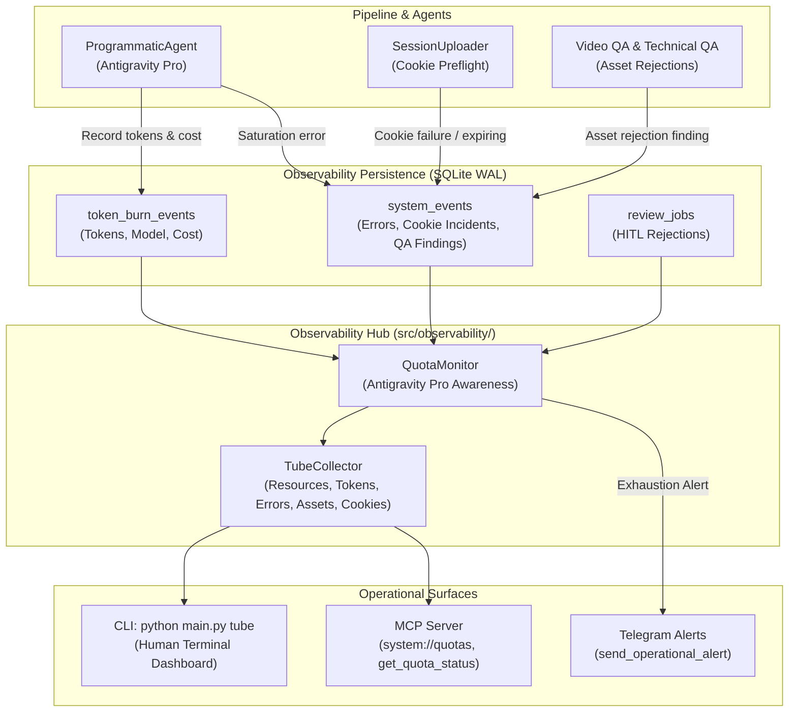

# Exploration: Antigravity Pro Quota, Resource & Token Burn Pipeline Monitor ("Tubo de Observabilidad")

## 1. Context & Objectives

The user requires a unified operational pipeline monitor ("tubo") that tracks and surfaces:
1. **System Resources**: Real-time CPU usage, RAM footprint (strictly adhering to $\le$ 2 CPU cores and $\le$ 2.0 GiB RAM), storage headroom, and daemon heartbeat.
2. **Token Burning**: Token consumption metrics (prompt/input tokens, output/completion tokens, cached tokens, reasoning tokens, and financial cost) across LLM providers, specifically tracking the **Antigravity Pro account**.
3. **Failures and Stoppages**: Structured tracking of errors, pipeline aborts, circuit breaker triggers, and stopped states.
4. **Antigravity Pro Quota Awareness**: Deep system and MCP awareness of Antigravity Pro account quotas, rate limits, saturation states, and backoff transitions (`JobStatus.WAITING_LLM_QUOTA`).
5. **Asset Reporting & QA Rejection Tracking**: Counters and audit logs for how many times an image, thumbnail, or video has been reported or rejected across automated QA gates and Telegram review.
6. **Cookie & Authentication Incident Registration**: Proactive recording of cookie validation failures, expiration warnings (<48h), and session upload errors into the system event stream.

---

## 2. Current State & Gap Analysis

### 2.1 Observability, System Events, and Telemetry
- **Current Machinery**:
  - `system_events` table (SQLite, Migration 004): columns `event_id`, `ts`, `level`, `event_type`, `run_id`, `story_id`, `channel`, `component`, `stage`, `error_code`, `message`, `details_json`.
  - `src/observability/events.py`: `emit_event()` and `emit_error()` write to `system_events` and append to `logs/events.jsonl` with thread safety and rotation.
  - `src/observability/alerts.py`: `send_operational_alert()` dispatches throttled/deduplicated Telegram alerts.
  - `src/observability/bundle.py`: `build_review_bundle()` packages run diagnostics, frame sheets, and provider attempts into `output/agent_review/<run_id>/`.
  - `src/cli/handlers/status.py`: Line 251 displays `--- Eventos del tubo ---` via `cli_errors()`.
- **Gaps**:
  - `production_metrics` only stores audio duration, render time, video size, and LUFS. It does **not** record token consumption or cost breakdown.
  - Token consumption generated by `ProgrammaticAgent` in `src/agents/base_agent.py` is written to ephemeral `task_result.json` files but never indexed or persisted into SQLite.
  - There is no central aggregator for token burn rates (hourly, daily, per channel, per provider).

### 2.2 MCP Architecture & Awareness
- **Current Machinery**:
  - `src/mcp/server.py`: Runs stdio or SSE transports for MCP clients (Antigravity, OpenCode, Claude Desktop).
  - `src/mcp/resources.py`: Exposes `channels://{channel_name}/config`, `lanes://catalog`, and `system://health`.
  - `src/mcp/tools/`: Exposes 9 tools (`get_system_status`, `system_preflight`, `list_lanes`, `get_lane_info`, `query_loop_catalog`, `audit_loop_catalog`, `run_pipeline_dry_run`, `manage_queue`, `verify_integrity`).
- **Gaps**:
  - **Zero Quota Awareness in MCP**: No MCP resource or tool reports current Antigravity Pro quota levels, burned tokens, or remaining budget.
  - **No Asset Rejection Tooling**: Agents connecting via MCP cannot query how many times an image or video was rejected in QA.
  - `system://health` lacks token burn statistics and cookie session health details.

### 2.3 API Health and Cookie Session Validation
- **Current Machinery**:
  - `src/api_health.py`: `check_youtube_api()`, `check_drive_api()`, `check_cookies()`, and `check_all()`.
  - `src/core/cookies.py`: `SessionHealthValidator` evaluates Netscape/JSON cookies for tokens (`LOGIN_INFO`, `SID`, `__Secure-1PSID`, etc.) and returns `SessionStatus` (`HEALTHY`, `EXPIRING_SOON`, `EXPIRED`, `INCOMPLETE`, `INVALID`).
  - `src/youtube/session_uploader.py`: Zero-quota publishing via InnerTube HTTP and Playwright Stealth. Raises `SessionUploadError`.
- **Gaps**:
  - When cookies expire, are incomplete, or fail during preflight/upload, **no structured event is emitted to `system_events`**.
  - As a result, `main.py status --errors` ("Eventos del tubo") remains unaware of cookie decay until an unhandled exception halts a run.
  - There is no proactive registration of cookie expiration events in the telemetry pipe.

### 2.4 Quota Handling & Provider Circuit Breakers
- **Current Machinery**:
  - `src/core/domain.py`: Defines `JobStatus.WAITING_LLM_QUOTA`, `JobStatus.WAITING_IMAGE_QUOTA`, `JobStatus.WAITING_YOUTUBE_LIMIT`, `ProviderKind.AGY`, and typed exceptions (`QuotaError`, `AIProviderChainExhausted`, `YouTubeQuotaExceededError`).
  - `src/core/providers.py`: `CircuitBreaker` manages failure thresholds, cooldowns, and state (`CLOSED`, `OPEN`, `HALF_OPEN`).
  - `src/agents/base_agent.py`: `ProgrammaticAgent` uses Antigravity local CLI (`agy`) or native SDK (`google.antigravity`), calculates usage and cost via `CostCalculator`, and isolates breakers by `instance_id`.
  - `src/pipeline/executor.py`: Catches `QuotaError` and transitions jobs to `JobStatus.WAITING_LLM_QUOTA` or `JobStatus.WAITING_IMAGE_QUOTA`.
- **Gaps**:
  - Quota state is reactive rather than proactive: the system only learns it hit a limit when an API fails with 429/saturation.
  - Antigravity Pro account saturation is caught as `AgentSaturationError` in `base_agent.py`, but does not notify the rest of the system or update a shared telemetry state.
  - The pipeline does not track token budgets or alert before hitting hard account caps.

### 2.5 Asset Quality Assurance & Rejection Reporting
- **Current Machinery**:
  - `src/pipeline/stages/stage_10_qa.py`: Executes prepublication validation and multimodal vision QA (`enforce_multimodal_qa_gate`).
  - `src/agents/video_qa.py`: Uses vision models to evaluate contact sheets and keyframes, emitting `agent_finding` events to `system_events`.
  - `src/verification/technical_qa.py`: Validates broadcast standards (LUFS, peak dBTP, resolution, luminance, black screen duration, AV sync drift).
  - `review/telegram_bot.py` & `review/review_manager.py`: Allows operators to reject videos via Telegram (`action_reject`), updating `review_jobs` to `ReviewStatus.REJECTED`.
- **Gaps**:
  - No unified query or model tracks how many times an asset (image, thumbnail, loop, or video) has been reported or rejected.
  - Operators and agents have no visibility into recurring defects (e.g. "loop X was rejected 4 times due to low luminance").

### 2.6 Channel & Lane Architecture
- Channels configured in `config/channels.json` (`horror`, `drama`, `scifi`).
- Lanes configured in `config/lanes.json` (`horror-scp-shorts`, `horror-horror-long`, `drama-aita-long`, etc.).
- Editorial profiles governed by `src/core/channel_profile.py` and `src/core/lanes.py`.
- The monitoring system must respect channel isolation and provide both per-channel and global visibility.

---

## 3. Comparison of Architectural Approaches

### Approach A: Ad-Hoc Log Scraping & Fragmented Telemetry
*Scrape logs/events.jsonl and task_result.json files dynamically on demand.*

- **Mechanism**:
  - Scan `output/**/task_result.json` on disk to compute token totals.
  - Search `logs/events.jsonl` using regex whenever status is requested.
- **Pros**:
  - No database migration required.
- **Cons**:
  - High disk I/O and CPU spikes when reading thousands of files (violates $\le$ 2 CPU cores / 2 GB RAM envelope).
  - Unstructured and prone to missing records when directories are cleaned by `clean_run_intermediates()`.
  - Slow response times for MCP resources and CLI commands.
- **Verdict**: **REJECTED.**

---

### Approach B: Unified Telemetry Architecture (SQLite WAL + Central Quota & Telemetry Hub)
*Introduce structured SQLite persistence for token burning, automatic event hooking for cookies and asset QA, an Antigravity Pro quota monitor, enhanced MCP resources/tools, and a dedicated `tube` CLI interface.*

- **Mechanism**:
  1. **Schema Migration**:
     - Create `token_burn_events` table (or expand `system_events`) to record token metrics per LLM/TTS call: `run_id`, `story_id`, `channel`, `provider`, `model`, `input_tokens`, `output_tokens`, `cached_tokens`, `cost_usd`, `characters`, `created_at`.
  2. **Core Observability Service (`src/observability/quota.py` & `src/observability/tube.py`)**:
     - Aggregates token burn (hourly, daily, per channel/model) and computes current Antigravity Pro quota burn vs. configurable threshold.
     - Aggregates asset rejection counts from `system_events` (`agent_finding`, `technical_qa_rejection`) and `review_jobs` (`status = 'REJECTED'`).
     - Detects circuit breaker states and stalled/failed runs.
  3. **Event Hooking**:
     - Hook `src/core/cookies.py` and `src/youtube/session_uploader.py`: Emit structured `cookie_status` / `cookie_failure` events whenever session validation fails or expires within 48h.
     - Hook `src/agents/base_agent.py`: Record token consumption directly into `token_burn_events` upon task completion.
     - Hook `src/verification/technical_qa.py` and `src/agents/video_qa.py`: Record structured asset rejection events.
  4. **MCP Awareness**:
     - Add Resource `system://quotas`: Exposes Antigravity Pro quota usage, token burn metrics, and asset rejection totals.
     - Add Tool `get_quota_status`: Enables querying token usage, remaining quota, and asset failure statistics.
     - Enhance `system://health` to include quota and cookie health summaries.
  5. **CLI Tubo (`main.py tube` / `status --tube`)**:
     - Terminal dashboard displaying resources, token burn, Antigravity Pro quota, failures, asset rejection counts, and recent tube events.
- **Pros**:
  - High performance: instantaneous queries via indexed SQLite WAL (< 5ms).
  - Low resource footprint: zero extra daemons, zero external dependencies, perfectly within $\le$ 2 cores / 2 GB RAM.
  - Seamlessly integrates with existing `QueueRepository`, `system_events`, and MCP infrastructure.
  - Complete satisfaction of user requirements.
- **Verdict**: **RECOMMENDED (Optimal).**

---

### Approach C: External Monitoring Stack (Prometheus + Grafana + Vector)
*Deploy an external monitoring stack with time-series databases and dashboard daemons.*

- **Mechanism**:
  - Run Prometheus exporter daemon and Grafana container on the VPS.
- **Pros**:
  - Rich web dashboards and graphing out of the box.
- **Cons**:
  - Massive resource overhead: running Docker/Prometheus/Grafana exceeds the project's inviolable 2-core / 2 GB RAM budget.
  - High operational complexity and external maintenance.
  - Incompatible with offline/test mock requirements.
- **Verdict**: **REJECTED.**

---

## 4. Affected Areas & Files

| Component / File | Purpose of Modification |
| :--- | :--- |
| `src/core/repository/migrations.py` | Add Migration (e.g. `MIGRATION_013`) creating `token_burn_events` table and indices for efficient quota/token aggregation. |
| `src/core/repository/queue.py` | Add repository methods: `record_token_burn()`, `query_token_burn_summary()`, `query_asset_rejection_counts()`, `query_cookie_incidents()`. |
| `src/agents/base_agent.py` | Hook agent execution to persist token usage (`usage`, `cost_info`) into repository upon task completion and emit `quota_saturation` on `AgentSaturationError`. |
| `src/core/cookies.py` & `src/api_health.py` | Emit `cookie_failure` and `cookie_expiring` events to `system_events` during health validation. |
| `src/youtube/session_uploader.py` | Emit `cookie_failure` event upon session upload errors or preflight rejections. |
| `src/verification/technical_qa.py` & `src/agents/video_qa.py` | Ensure asset-level rejection reasons and asset identifiers are emitted to `system_events` with indexed tags. |
| `src/observability/quota.py` *(New)* | Domain module managing Antigravity Pro quota thresholds, burn calculations, budget alerting, and asset rejection aggregation. |
| `src/observability/tube.py` *(New)* | Core collector for "El Tubo": consolidates resources (CPU/RAM/Disk), tokens, errors, quota, asset reports, and cookie health into a single unified telemetry payload. |
| `src/cli/handlers/status.py` | Integrate tube dashboard: implement `cli_tube()` and `print_tube()` accessible via `python main.py tube` or `status --tube`. |
| `src/cli/subparsers.py` | Register `tube` subcommand and `--tube` flag under `status`. |
| `src/mcp/resources.py` | Register `system://quotas` resource providing real-time quota, token burn, and asset rejection metrics. Update `system://health`. |
| `src/mcp/tools/` & `src/mcp/tools/__init__.py` | Add new MCP tool `get_quota_status` (or `get_tube_status`) and register it on `MCPServer`. |
| `tests/unit/` | Unit and integration tests for token recording, quota calculation, cookie incident emission, MCP resources/tools, and tube CLI. |

---

## 5. Architectural Specification: "El Tubo"



### 5.1 Token Burn & Quota Telemetry Schema
```sql
CREATE TABLE IF NOT EXISTS token_burn_events (
    event_id INTEGER PRIMARY KEY AUTOINCREMENT,
    ts TEXT NOT NULL,
    run_id TEXT,
    story_id TEXT,
    channel TEXT NOT NULL,
    provider TEXT NOT NULL,          -- 'antigravity_pro', 'gemini_rest', 'edge_tts'
    model TEXT NOT NULL,
    prompt_tokens INTEGER DEFAULT 0,
    completion_tokens INTEGER DEFAULT 0,
    cached_tokens INTEGER DEFAULT 0,
    reasoning_tokens INTEGER DEFAULT 0,
    total_tokens INTEGER DEFAULT 0,
    cost_usd REAL DEFAULT 0.0,
    duration_seconds REAL,
    status TEXT NOT NULL,            -- 'ok', 'saturated', 'error'
    created_at TEXT NOT NULL
);

CREATE INDEX IF NOT EXISTS idx_token_burn_ts ON token_burn_events(ts);
CREATE INDEX IF NOT EXISTS idx_token_burn_run ON token_burn_events(run_id);
CREATE INDEX IF NOT EXISTS idx_token_burn_provider ON token_burn_events(provider, model);
```

### 5.2 Antigravity Pro Quota Awareness
- **Configurable Budgets**: Config in `config/channels.json` or `config/quota.json`:
  - `antigravity_pro_daily_token_budget`: e.g. 5,000,000 tokens / day.
  - `antigravity_pro_hourly_token_budget`: e.g. 1,000,000 tokens / hour.
  - `saturation_cooldown_seconds`: 180s.
- **Proactive Throttle**:
  - If current burn rate approaches 90% of budget, log warning in tube.
  - If 100% exceeded or circuit breaker trips with saturation, mark story as `JobStatus.WAITING_LLM_QUOTA` and delay execution without crashing the daemon.
- **Cost Calculation**:
  - Leverages existing `google.antigravity.cost.CostCalculator` already wired in `base_agent.py` to record exact USD costs.

### 5.3 Asset Rejection Counter Engine
- Aggregates findings from:
  1. `system_events` where `event_type = 'agent_finding'` and `json_extract(details_json, '$.overall_pass') = 0`.
  2. `system_events` where `event_type = 'technical_qa_rejection'`.
  3. `review_jobs` where `status = 'REJECTED'`.
- Returns metrics:
  - Total rejections in last 24h / 7d.
  - Rejection count per asset URL / file path / story ID.
  - Rejection breakdown by category (`visual`, `subtitles`, `audio`, `pacing`, `luminance`, `glare`, `av_sync`).

### 5.4 Cookie Incident Engine
- Proactive event emission:
  - `SessionStatus.EXPIRED` $\to$ `emit_event("cookie_failure", level="ERROR", message="Cookies expiradas para canal X")`
  - `SessionStatus.INCOMPLETE` / `INVALID` $\to$ `emit_event("cookie_failure", level="ERROR", message="Cookies inválidas o faltan tokens")`
  - `SessionStatus.EXPIRING_SOON` (<48h) $\to$ `emit_event("cookie_warning", level="WARNING", message="Cookies próximas a expirar en N horas")`
- Surfaced immediately in the Tube stream and MCP `system://quotas`.

---

## 6. Recommendations & Implementation Strategy

1. **Adopt Approach B (Unified SQLite Telemetry + Observability Hub)**.
2. **Execute in 4 Progressive Phases**:
   - **Phase 1: Persistence & Data Layer**: Database migration for `token_burn_events`, repository query methods, and hook in `base_agent.py`.
   - **Phase 2: Cookie & Asset QA Event Integration**: Add structured event emissions to `cookies.py`, `session_uploader.py`, `technical_qa.py`, and `video_qa.py`.
   - **Phase 3: Quota Monitor & Tube Service**: Build `src/observability/quota.py` and `src/observability/tube.py` with resource tracking, Antigravity Pro budget logic, and asset rejection counters.
   - **Phase 4: CLI & MCP Surfaces**:
     - Register `tube` subcommand (`main.py tube` and `status --tube`).
     - Register MCP resource `system://quotas` and tool `get_quota_status`.
     - Update MCP resource `system://health`.
3. **Strict Adherence to Performance Envelope**:
   - Keep queries indexed, fast, and read-only with SQLite `WAL` mode.
   - Cap telemetry queries to max 50-100 rows.
   - No external background daemons or RAM-heavy libraries.

---

## 7. Risks & Mitigation

| Risk | Impact | Mitigation Strategy |
| :--- | :--- | :--- |
| **Telemetry Write Lock Contention** | Concurrency with pipeline operations could cause database locks. | Use SQLite WAL mode with `BEGIN IMMEDIATE` and timeout in `QueueRepository`. Telemetry writes must be best-effort and never crash the pipeline (`try/except` guard). |
| **Antigravity SDK / CLI Usage Format Divergence** | Token usage data might differ between SDK and CLI fallback modes. | Normalize `usage` dictionary (`prompt_tokens`, `completion_tokens`, `cached_tokens`, `total_tokens`) with standard fallback defaults in `base_agent.py`. |
| **Storage Growth from Event Logging** | Accumulation of token burn events over months could inflate DB. | Add automatic retention pruning in `QueueRepository.prune_system_events()` and `prune_token_burn_events()` (default 30 days retention). |
| **Cookie Event Noise** | Checking cookies repeatedly in daemon loop could spam `system_events`. | Implement event deduplication / throttling window (e.g. emit cookie status event at most once per hour per channel unless state changes). |

---

## 8. Ready for Proposal

**Status: READY FOR PROPOSAL.**
The exploration confirms the feasibility and architecture of the Quota Monitor Tube. All requirements (system resources, token burning, Antigravity Pro quota awareness, asset rejection counts, and cookie incident registration) are fully addressable through lightweight, native extensions to the repository's existing observability and MCP stack.
