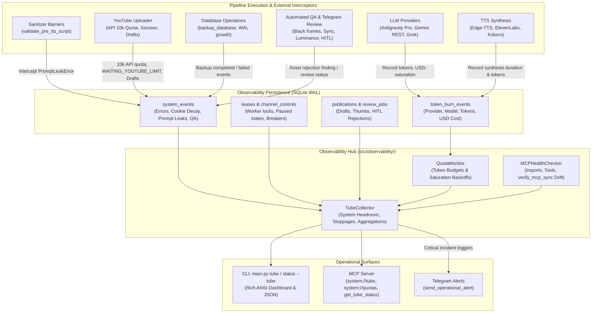

# Proposal: Comprehensive Pipeline Telemetry & Observability Hub ('El Tubo') - Resources, Token Burn, Errors, YouTube Limits, Drafts, MCP Health, Audio Prompt Leaks & Database Backups

## Intent

The `yt-auto` autonomous pipeline requires a unified, comprehensive operational observability and telemetry hub ("El Tubo"). Operational telemetry in the system was previously fragmented across ephemeral files (`task_result.json`), unindexed log lines, or isolated check routines. As a result, critical operational states remained obscured or difficult to inspect for human operators and AI agents:
1. **System Resources & Pipeline Stoppages**: While host resource budgets are strictly constrained to $\le 2.0$ CPU cores and $\le 2.0$ GiB RAM ([`REG-14`](file:///home/moku/.gemini/antigravity-cli/worktrees/YouTubeChannels/antigravity_quota_monitor_tube/openspec/config.yaml)), real-time CPU/RAM headroom, daemon liveness heartbeat age, active worker/channel locks ([`leases`](file:///home/moku/.gemini/antigravity-cli/worktrees/YouTubeChannels/antigravity_quota_monitor_tube/src/core/repository/leases.py)), paused channel controls ([`channel_controls`](file:///home/moku/.gemini/antigravity-cli/worktrees/YouTubeChannels/antigravity_quota_monitor_tube/src/core/repository/queue.py)), and provider circuit breaker trips ([`CircuitBreaker`](file:///home/moku/.gemini/antigravity-cli/worktrees/YouTubeChannels/antigravity_quota_monitor_tube/src/core/providers.py)) lack unified real-time aggregation.
2. **Multi-Provider Token Burn & Quotas**: Token consumption and USD costs generated across multiple AI providers—Antigravity Pro ([`ProgrammaticAgent`](file:///home/moku/.gemini/antigravity-cli/worktrees/YouTubeChannels/antigravity_quota_monitor_tube/src/agents/base_agent.py)), Gemini REST ([`src/llm.py`](file:///home/moku/.gemini/antigravity-cli/worktrees/YouTubeChannels/antigravity_quota_monitor_tube/src/llm.py)), Grok, and TTS narration synthesis ([`src/audio/tts_router.py`](file:///home/moku/.gemini/antigravity-cli/worktrees/YouTubeChannels/antigravity_quota_monitor_tube/src/audio/tts_router.py))—are not indexed in SQLite, making aggregate cost, token burn rate analysis, and saturation backoffs ([`JobStatus.WAITING_LLM_QUOTA`](file:///home/moku/.gemini/antigravity-cli/worktrees/YouTubeChannels/antigravity_quota_monitor_tube/src/core/domain.py), [`JobStatus.WAITING_IMAGE_QUOTA`](file:///home/moku/.gemini/antigravity-cli/worktrees/YouTubeChannels/antigravity_quota_monitor_tube/src/core/domain.py)) impossible to monitor systematically.
3. **YouTube Limits & Draft Publishing**: The YouTube Data API v3 enforces a 10,000 daily quota limit (~6 uploads/day at 1,600 units/upload) and strict channel daily upload caps ([`JobStatus.WAITING_YOUTUBE_LIMIT`](file:///home/moku/.gemini/antigravity-cli/worktrees/YouTubeChannels/antigravity_quota_monitor_tube/src/core/domain.py)). Additionally, staging videos as drafts/unlisted, custom thumbnail upload confirmation, and ambiguous uploads ([`JobStatus.UPLOAD_UNCONFIRMED`](file:///home/moku/.gemini/antigravity-cli/worktrees/YouTubeChannels/antigravity_quota_monitor_tube/src/core/domain.py)) are managed ad-hoc without unified visibility.
4. **Failure & Incident Registration**: Pipeline stage crashes, worker orphan leases, and session decay (expired or expiring Netscape/JSON cookies within 48h in [`src/core/cookies.py`](file:///home/moku/.gemini/antigravity-cli/worktrees/YouTubeChannels/antigravity_quota_monitor_tube/src/core/cookies.py) and [`src/api_health.py`](file:///home/moku/.gemini/antigravity-cli/worktrees/YouTubeChannels/antigravity_quota_monitor_tube/src/api_health.py)) do not emit structured, deduplicated operational incident events into [`system_events`](file:///home/moku/.gemini/antigravity-cli/worktrees/YouTubeChannels/antigravity_quota_monitor_tube/src/core/repository/migrations.py).
5. **MCP Server Self-Health & Broken Detection**: Model Context Protocol (MCP) clients have no way to detect whether the MCP server is broken (due to import errors, runtime tool failures, or Single-Source-of-Truth drift verified by [`scripts/verify_mcp_sync.py`](file:///home/moku/.gemini/antigravity-cli/worktrees/YouTubeChannels/antigravity_quota_monitor_tube/scripts/verify_mcp_sync.py)).
6. **Audio Prompt-Leak Detection**: Narrations with leaked system prompt fragments, taboo instructions, or director cues intercepted by [`src/sanitizer/security.py`](file:///home/moku/.gemini/antigravity-cli/worktrees/YouTubeChannels/antigravity_quota_monitor_tube/src/sanitizer/security.py) and [`src/sanitizer/tts.py`](file:///home/moku/.gemini/antigravity-cli/worktrees/YouTubeChannels/antigravity_quota_monitor_tube/src/sanitizer/tts.py) ([`PromptLeakError`](file:///home/moku/.gemini/antigravity-cli/worktrees/YouTubeChannels/antigravity_quota_monitor_tube/src/sanitizer/security.py)) raise exceptions but are not indexed into an observability stream to identify prompt degradation patterns.
7. **Database Backup & SQLite Health**: Database snapshot operations ([`manage.py backup`](file:///home/moku/.gemini/antigravity-cli/worktrees/YouTubeChannels/antigravity_quota_monitor_tube/src/cli/handlers/backup.py), [`backup_database()`](file:///home/moku/.gemini/antigravity-cli/worktrees/YouTubeChannels/antigravity_quota_monitor_tube/src/core/repository/migrations.py)), snapshot sizes/timestamps, WAL file size growth, schema migration version parity, and `PRAGMA integrity_check` results lack automated tracking.
8. **Asset Rejection Analytics**: Image, loop, and video rejections across automated QA gates (black frames, luminance anomalies, A/V sync drift in [`src/verification/technical_qa.py`](file:///home/moku/.gemini/antigravity-cli/worktrees/YouTubeChannels/antigravity_quota_monitor_tube/src/verification/technical_qa.py) and [`src/agents/video_qa.py`](file:///home/moku/.gemini/antigravity-cli/worktrees/YouTubeChannels/antigravity_quota_monitor_tube/src/agents/video_qa.py)) and human Telegram reviewer rejections (`review_jobs.status = 'REJECTED'`) are not aggregated into actionable defect counters.

This proposal establishes **"El Tubo"**—a centralized, high-speed, zero-overhead pipeline observability hub implemented with native SQLite WAL persistence, exposing real-time metrics across human CLI dashboards (`python main.py tube`, `status --tube`), MCP server interfaces (`system://tube`, `system://quotas`, `system://health`, `get_tube_status`), and deduplicated Telegram operational alerts.

---

## Scope

### In Scope

1. **System Resources & Stoppages**:
   - Host CPU aggregate usage (%) and process RSS RAM (MiB/GiB), asserting compliance with $\le 2.0$ CPU cores and $\le 2.0$ GiB RAM budget.
   - Filesystem storage headroom (verifying $\ge 2.0$ GiB free on working volumes).
   - Daemon liveness heartbeat monitoring via [`read_daemon_heartbeat()`](file:///home/moku/.gemini/antigravity-cli/worktrees/YouTubeChannels/antigravity_quota_monitor_tube/src/core/repository/leases.py), flagging heartbeats older than 60s (degraded) or 120s (stale/halted).
   - Inspection of active worker locks in `leases` and `lane_leases`, identifying running worker owners, run IDs, and acquisition times.
   - Real-time reporting of channel paused/stopped states from `channel_controls` (`paused=1`, `reason`, `updated_at`).
   - Circuit breaker tracking across all external APIs (Antigravity Pro, Gemini REST, Grok, TTS, YouTube) with state (`CLOSED`, `OPEN`, `HALF_OPEN`) and cooldown `retry_after()` counters.

2. **Multi-Provider Token Burn & Quotas**:
   - Migration `009_pipeline_telemetry_and_token_burn`: Create `token_burn_events` table in SQLite with columns: `event_id`, `ts`, `run_id`, `story_id`, `channel`, `provider`, `model`, `prompt_tokens`, `completion_tokens`, `cached_tokens`, `reasoning_tokens`, `total_tokens`, `cost_usd`, `duration_seconds`, `status`, `created_at`.
   - Indexing on `(ts)`, `(run_id)`, `(provider, model)`, and `(channel)`.
   - Instrumentation of LLM and TTS callers:
     - Antigravity Pro in [`src/agents/base_agent.py`](file:///home/moku/.gemini/antigravity-cli/worktrees/YouTubeChannels/antigravity_quota_monitor_tube/src/agents/base_agent.py) (`ProgrammaticAgent`).
     - Gemini REST in [`src/llm.py`](file:///home/moku/.gemini/antigravity-cli/worktrees/YouTubeChannels/antigravity_quota_monitor_tube/src/llm.py) (`_curate_with_gemini`).
     - Grok / alternative model integrations.
     - Narration synthesis in [`src/audio/tts_router.py`](file:///home/moku/.gemini/antigravity-cli/worktrees/YouTubeChannels/antigravity_quota_monitor_tube/src/audio/tts_router.py).
   - Cost calculation via [`CostCalculator`](file:///home/moku/.gemini/antigravity-cli/worktrees/YouTubeChannels/antigravity_quota_monitor_tube/src/agents/base_agent.py) persisted directly per call.
   - Quota exhaustion & saturation tracking: Catch `AgentSaturationError` / HTTP 429, persist `status = 'saturated'` in `token_burn_events`, emit `quota_saturation` to `system_events`, and support backoff transitions (`JobStatus.WAITING_LLM_QUOTA`, `JobStatus.WAITING_IMAGE_QUOTA`).
   - Automated retention pruning (`prune_token_burn_events()`, 30-day default retention) during periodic maintenance sweeps.

3. **YouTube Limits & Draft Publishing**:
   - YouTube Data API v3 10,000 daily quota tracking (resets at 00:00 PST / 08:00 UTC).
   - Catching `YouTubeQuotaExceededError` and `YouTubeUploadLimitError`, recording quota burn and transitioning jobs to `JobStatus.WAITING_YOUTUBE_LIMIT`.
   - Staging/draft publication telemetry: Tracking privacy state (`draft`, `unlisted`, `public`) in `publications` and `stories`.
   - Custom thumbnail upload confirmation status: Verifying Studio response before marking publication complete.
   - Ambiguous/unconfirmed upload tracking: Indexing and alerting on `JobStatus.UPLOAD_UNCONFIRMED` to prevent duplicate uploads during network timeouts.

4. **Failure & Incident Registration**:
   - Stage error aggregation across Stages 1–13 from `system_events` (level `ERROR` or `CRITICAL`).
   - Worker crash diagnostics enriched with [`format_error_diagnostics()`](file:///home/moku/.gemini/antigravity-cli/worktrees/YouTubeChannels/antigravity_quota_monitor_tube/src/core/errors.py).
   - Orphaned lease recovery tracking: Recording lease expirations and automated reclamation by [`recover_expired_leases()`](file:///home/moku/.gemini/antigravity-cli/worktrees/YouTubeChannels/antigravity_quota_monitor_tube/src/core/repository/leases.py).
   - Proactive cookie decay & session health monitoring: Hooking [`src/core/cookies.py`](file:///home/moku/.gemini/antigravity-cli/worktrees/YouTubeChannels/antigravity_quota_monitor_tube/src/core/cookies.py), [`src/api_health.py`](file:///home/moku/.gemini/antigravity-cli/worktrees/YouTubeChannels/antigravity_quota_monitor_tube/src/api_health.py), and [`src/youtube/session_uploader.py`](file:///home/moku/.gemini/antigravity-cli/worktrees/YouTubeChannels/antigravity_quota_monitor_tube/src/youtube/session_uploader.py) to emit `cookie_failure` on `EXPIRED`/`INCOMPLETE`/`INVALID` and `cookie_warning` on `EXPIRING_SOON` (< 48h) with stateful 1-hour deduplication.

5. **MCP Server Self-Health & Broken Detection**:
   - Self-diagnostic health checker [`src/observability/mcp_health.py`](file:///home/moku/.gemini/antigravity-cli/worktrees/YouTubeChannels/antigravity_quota_monitor_tube/src/observability/mcp_health.py): Validating MCP server factory importability (`create_mcp_server`), tool registration completeness, and runtime tool invocation failures.
   - Bidirectional SSOT parity validation: Integrating gate checks from [`scripts/verify_mcp_sync.py`](file:///home/moku/.gemini/antigravity-cli/worktrees/YouTubeChannels/antigravity_quota_monitor_tube/scripts/verify_mcp_sync.py) into health diagnostics, detecting code vs documentation vs configuration drift.
   - Exposing MCP server health (`HEALTHY`, `DEGRADED`, `BROKEN`) in `system://health` and `system://tube`.

6. **Audio Prompt-Leak Detection**:
   - Hooking pre-TTS semantic barriers in [`src/sanitizer/security.py`](file:///home/moku/.gemini/antigravity-cli/worktrees/YouTubeChannels/antigravity_quota_monitor_tube/src/sanitizer/security.py) and [`src/sanitizer/tts.py`](file:///home/moku/.gemini/antigravity-cli/worktrees/YouTubeChannels/antigravity_quota_monitor_tube/src/sanitizer/tts.py) ([`validate_pre_tts_script()`](file:///home/moku/.gemini/antigravity-cli/worktrees/YouTubeChannels/antigravity_quota_monitor_tube/src/sanitizer/tts.py), [`validate_semantic_barrier()`](file:///home/moku/.gemini/antigravity-cli/worktrees/YouTubeChannels/antigravity_quota_monitor_tube/src/sanitizer/security.py)).
   - When [`PromptLeakError`](file:///home/moku/.gemini/antigravity-cli/worktrees/YouTubeChannels/antigravity_quota_monitor_tube/src/sanitizer/security.py) is raised, proactively emit a structured `audio_prompt_leak` incident event into `system_events` capturing matched leak pattern, snippet, model, and story/channel context.
   - Querying and aggregating prompt-leak incident frequency per provider, model, and channel.

7. **Database Backup & SQLite Health**:
   - Tracking SQLite database backup operations from [`backup_database()`](file:///home/moku/.gemini/antigravity-cli/worktrees/YouTubeChannels/antigravity_quota_monitor_tube/src/core/repository/migrations.py) and [`main.py backup`](file:///home/moku/.gemini/antigravity-cli/worktrees/YouTubeChannels/antigravity_quota_monitor_tube/src/cli/handlers/backup.py) / [`manage.py backup`](file:///home/moku/.gemini/antigravity-cli/worktrees/YouTubeChannels/antigravity_quota_monitor_tube/manage.py).
   - Recording backup execution events (`database_backup_completed`, `database_backup_failed`) with snapshot path, size in bytes, and execution duration.
   - Inspecting SQLite WAL file size (`.sqlite-wal`) and checkpoint status (`PRAGMA wal_checkpoint(PASSIVE)`).
   - Checking migration version parity against code expectations and running `PRAGMA integrity_check(1)` during periodic health checks.

8. **Asset Rejection Analytics**:
   - Automated QA gate rejections: Standardizing event logging from [`src/verification/technical_qa.py`](file:///home/moku/.gemini/antigravity-cli/worktrees/YouTubeChannels/antigravity_quota_monitor_tube/src/verification/technical_qa.py) and [`src/agents/video_qa.py`](file:///home/moku/.gemini/antigravity-cli/worktrees/YouTubeChannels/antigravity_quota_monitor_tube/src/agents/video_qa.py) (black frames, low/high luminance, clipping, A/V sync drift).
   - Human review rejections: Aggregating rejected jobs in `review_jobs` (`status = 'REJECTED'`) from Telegram human reviews.
   - Defect categorization: Grouping rejections by defect class (`visual`, `audio`, `sync`, `luminance`, `pacing`, `editorial`) and asset identifier.

9. **Operational Surfaces**:
   - **CLI**: Implement `python main.py tube` subcommand and `--tube` flag under `python main.py status` in [`src/cli/handlers/status.py`](file:///home/moku/.gemini/antigravity-cli/worktrees/YouTubeChannels/antigravity_quota_monitor_tube/src/cli/handlers/status.py) with rich ANSI terminal UI and JSON output mode (`--json`).
   - **MCP Resources**:
     - `system://tube`: Unified comprehensive snapshot of host resources, quotas, stoppages, errors, backups, and QA rejections.
     - `system://quotas`: Dedicated multi-provider token burn, USD costs, and quota saturation indicators.
     - `system://health`: Enriched with tube liveness, MCP self-health, cookie decay, and WAL status.
   - **MCP Tool**: Register canonical tool `get_tube_status` in [`src/mcp/tools/`](file:///home/moku/.gemini/antigravity-cli/worktrees/YouTubeChannels/antigravity_quota_monitor_tube/src/mcp/tools/) with filtering parameters (`channel`, `window_hours`, `include_incidents`, `include_burn`).
   - **Telegram Alerts**: Dispatch throttled operational notifications via [`src/observability/alerts.py`](file:///home/moku/.gemini/antigravity-cli/worktrees/YouTubeChannels/antigravity_quota_monitor_tube/src/observability/alerts.py) for critical conditions (quota saturation, stale heartbeat >120s, cookie expiration <48h, audio prompt leaks, backup failure).

### Out of Scope

- Running external monitoring servers (Prometheus, Grafana, Datadog, Vector) or Docker monitoring daemon containers, violating the $\le 2.0$ CPU cores and $\le 2.0$ GiB RAM budget.
- Modifying core video FFmpeg stream-copy concatenation or audio DSP mastering algorithms.
- Automatic billing modifications, payment processing, or programmatic credit card purchasing for cloud APIs.
- Developing browser WebGUIs or Electron desktop apps; interfaces remain strictly high-performance terminal CLI and MCP JSON-RPC.

---

## Capabilities

### New Capabilities

- `pipeline-telemetry-hub`: Centralized collection, snapshotting, and presentation of comprehensive pipeline metrics across host resources, daemon liveness, channel locks, and stopped states.
- `multi-provider-token-tracking`: Structured SQLite persistence (`token_burn_events`) for Antigravity Pro, Gemini REST, Grok, and TTS providers, calculating prompt, completion, cached, reasoning tokens, and USD costs, with quota backoff awareness.
- `youtube-quota-and-draft-tracking`: Telemetry for YouTube 10k daily API quota burn, daily upload limits (`WAITING_YOUTUBE_LIMIT`), draft/unlisted visibility, thumbnail upload verification, and unconfirmed uploads (`UPLOAD_UNCONFIRMED`).
- `incident-and-cookie-lifecycle`: Incident recording for worker crashes, expired lease recoveries, and proactive cookie failure/expiration (<48h) warnings with hourly deduplication.
- `mcp-server-health-monitoring`: Self-diagnostic health tracking for the MCP server, detecting import failures, runtime tool errors, and schema/SSOT drift via [`scripts/verify_mcp_sync.py`](file:///home/moku/.gemini/antigravity-cli/worktrees/YouTubeChannels/antigravity_quota_monitor_tube/scripts/verify_mcp_sync.py).
- `audio-prompt-leak-telemetry`: Active recording and indexing of prompt leak attempts, taboo phrases, and instruction echoes caught before TTS synthesis into `system_events`.
- `database-backup-and-wal-observability`: Tracking SQLite backup operations (`manage.py backup`), snapshot timestamps and file sizes, WAL growth, migration version parity, and integrity check diagnostics.
- `asset-rejection-analytics`: Multi-stage counter and defect categorizer for automated QA rejections (black frames, luminance, audio sync) and human Telegram review rejections.
- `mcp-tube-and-quota-interfaces`: Canonical MCP resources (`system://tube`, `system://quotas`, `system://health`) and tool `get_tube_status` for AI agent operational inspection.

### Modified Capabilities

- `service-health`: Enriched diagnostic routines in [`src/api_health.py`](file:///home/moku/.gemini/antigravity-cli/worktrees/YouTubeChannels/antigravity_quota_monitor_tube/src/api_health.py) and [`src/core/cookies.py`](file:///home/moku/.gemini/antigravity-cli/worktrees/YouTubeChannels/antigravity_quota_monitor_tube/src/core/cookies.py) to emit structured incident events upon cookie decay or upload errors.
- `cli-operational-dashboard`: Added `tube` command and `--tube` flag under `status` for instant terminal status display.

---

## Approach

The implementation builds a modular, zero-overhead observability hub in `src/observability/tube.py` backed by SQLite WAL:

### Phased Implementation Strategy

#### Phase 1: Database Migration & Persistence Layer
1. **Migration 009 (`009_pipeline_telemetry_and_token_burn`)**:
   - Create `token_burn_events` table and indices (`ts`, `run_id`, `(provider, model)`, `channel`).
   - Create additional performance index on `system_events(event_type, ts)` to optimize incident window queries.
   - Update [`src/core/repository/migrations.py`](file:///home/moku/.gemini/antigravity-cli/worktrees/YouTubeChannels/antigravity_quota_monitor_tube/src/core/repository/migrations.py) to register and verify migration version 9.
2. **Repository Aggregations in [`src/core/repository/queue.py`](file:///home/moku/.gemini/antigravity-cli/worktrees/YouTubeChannels/antigravity_quota_monitor_tube/src/core/repository/queue.py)**:
   - `record_token_burn(...)`: Insert token consumption and USD costs.
   - `query_token_burn_summary(window_hours, channel, provider)`: Compute prompt, completion, cached, reasoning, total tokens, and total USD cost.
   - `query_asset_rejection_counts(window_hours, channel)`: Aggregate automated QA failures and human Telegram review rejections by category and asset ID.
   - `query_tube_incidents(window_hours, event_types, limit)`: Query operational incidents (prompt leaks, cookie decay, worker crashes, YouTube limit events).
   - `query_channel_stoppages()`: Fetch paused channels from `channel_controls` and active locks from `leases` / `lane_leases`.
   - `prune_token_burn_events(retention_days)`: Purge records older than retention threshold.

#### Phase 2: Pipeline Interceptors & Incident Emission
1. **Multi-Provider Token Burn & Quotas**:
   - In [`src/agents/base_agent.py`](file:///home/moku/.gemini/antigravity-cli/worktrees/YouTubeChannels/antigravity_quota_monitor_tube/src/agents/base_agent.py): Normalize token usage dictionaries (`prompt_tokens`, `completion_tokens`, `cached_tokens`, `reasoning_tokens`), compute USD cost with [`CostCalculator`](file:///home/moku/.gemini/antigravity-cli/worktrees/YouTubeChannels/antigravity_quota_monitor_tube/src/agents/base_agent.py), and persist record. On `AgentSaturationError`, record `status = 'saturated'` and emit `quota_saturation` to `system_events`.
   - In [`src/llm.py`](file:///home/moku/.gemini/antigravity-cli/worktrees/YouTubeChannels/antigravity_quota_monitor_tube/src/llm.py): Hook `_curate_with_gemini` to extract usage metadata and persist to `token_burn_events` with `provider = 'gemini_rest'`.
   - In [`src/audio/tts_router.py`](file:///home/moku/.gemini/antigravity-cli/worktrees/YouTubeChannels/antigravity_quota_monitor_tube/src/audio/tts_router.py): Persist synthesis execution time, character count, and provider (`edge-tts`, `elevenlabs`, `kokoro`).
2. **Audio Prompt-Leak Interception**:
   - In [`src/sanitizer/tts.py`](file:///home/moku/.gemini/antigravity-cli/worktrees/YouTubeChannels/antigravity_quota_monitor_tube/src/sanitizer/tts.py) and [`src/sanitizer/security.py`](file:///home/moku/.gemini/antigravity-cli/worktrees/YouTubeChannels/antigravity_quota_monitor_tube/src/sanitizer/security.py): Wrap pre-TTS validation. Upon [`PromptLeakError`](file:///home/moku/.gemini/antigravity-cli/worktrees/YouTubeChannels/antigravity_quota_monitor_tube/src/sanitizer/security.py), emit a structured event `audio_prompt_leak` into `system_events` with leak snippet, matched regex, model, and story/channel context before propagating the error.
3. **YouTube Limits, Drafts & Confirmations**:
   - In [`src/pipeline/stages/stage_13_publish.py`](file:///home/moku/.gemini/antigravity-cli/worktrees/YouTubeChannels/antigravity_quota_monitor_tube/src/pipeline/stages/stage_13_publish.py) and [`src/youtube/uploader/`](file:///home/moku/.gemini/antigravity-cli/worktrees/YouTubeChannels/antigravity_quota_monitor_tube/src/youtube/uploader/):
     - Catch `YouTubeQuotaExceededError` (10k units exhausted) or `YouTubeUploadLimitError` and emit `youtube_quota_limit` with estimated quota units.
     - Track publication privacy status (`draft` / `unlisted` / `public`) and thumbnail confirmation in publication metadata.
     - Record `upload_unconfirmed` events when uploads complete without verifiable public video IDs.
4. **Cookie Decay & Authentication Incidents**:
   - In [`src/core/cookies.py`](file:///home/moku/.gemini/antigravity-cli/worktrees/YouTubeChannels/antigravity_quota_monitor_tube/src/core/cookies.py) and [`src/api_health.py`](file:///home/moku/.gemini/antigravity-cli/worktrees/YouTubeChannels/antigravity_quota_monitor_tube/src/api_health.py): Proactively emit `cookie_failure` on `EXPIRED`/`INCOMPLETE`/`INVALID` and `cookie_warning` on `EXPIRING_SOON` (< 48h) with stateful 1-hour deduplication per channel.
5. **Database Backups & SQLite Health**:
   - In [`src/cli/handlers/backup.py`](file:///home/moku/.gemini/antigravity-cli/worktrees/YouTubeChannels/antigravity_quota_monitor_tube/src/cli/handlers/backup.py) and [`src/core/repository/migrations.py`](file:///home/moku/.gemini/antigravity-cli/worktrees/YouTubeChannels/antigravity_quota_monitor_tube/src/core/repository/migrations.py): Emit `database_backup_completed` or `database_backup_failed` with snapshot file path, size, and duration.
6. **Asset Rejections**:
   - In [`src/verification/technical_qa.py`](file:///home/moku/.gemini/antigravity-cli/worktrees/YouTubeChannels/antigravity_quota_monitor_tube/src/verification/technical_qa.py) and [`src/agents/video_qa.py`](file:///home/moku/.gemini/antigravity-cli/worktrees/YouTubeChannels/antigravity_quota_monitor_tube/src/agents/video_qa.py): Emit `asset_rejection` event detailing failed check, metric value, threshold, and asset ID.

#### Phase 3: Observability Hub & Collector Modules
1. **Quota Domain Module ([`src/observability/quota.py`](file:///home/moku/.gemini/antigravity-cli/worktrees/YouTubeChannels/antigravity_quota_monitor_tube/src/observability/quota.py))**:
   - Encapsulates token burn tracking, daily/hourly budgets, saturation detection, and backoff recommendations (`WAITING_LLM_QUOTA`, `WAITING_IMAGE_QUOTA`).
2. **MCP Health Checker ([`src/observability/mcp_health.py`](file:///home/moku/.gemini/antigravity-cli/worktrees/YouTubeChannels/antigravity_quota_monitor_tube/src/observability/mcp_health.py))**:
   - Asserts importability of `create_mcp_server`, checks tool execution errors, and executes programmatic parity check mirroring [`scripts/verify_mcp_sync.py`](file:///home/moku/.gemini/antigravity-cli/worktrees/YouTubeChannels/antigravity_quota_monitor_tube/scripts/verify_mcp_sync.py).
3. **Tube Collector ([`src/observability/tube.py`](file:///home/moku/.gemini/antigravity-cli/worktrees/YouTubeChannels/antigravity_quota_monitor_tube/src/observability/tube.py))**:
   - Consolidates host resources (CPU/RAM/disk), daemon liveness age, active channel controls/locks, multi-provider token burn, YouTube quota/limits, audio prompt leaks, database backup metrics, WAL growth, MCP health status, asset rejection tallies, and recent incidents into a single structured snapshot dataclass (`TubeSnapshot`).

#### Phase 4: Operational Surfaces (CLI, MCP & Alerts)
1. **CLI Commands ([`src/cli/handlers/status.py`](file:///home/moku/.gemini/antigravity-cli/worktrees/YouTubeChannels/antigravity_quota_monitor_tube/src/cli/handlers/status.py) & [`src/cli/subparsers.py`](file:///home/moku/.gemini/antigravity-cli/worktrees/YouTubeChannels/antigravity_quota_monitor_tube/src/cli/subparsers.py))**:
   - Register `main.py tube` and `status --tube`.
   - Implement fast ANSI rendering displaying system gauges, token burn breakdown, YouTube quotas, draft counts, prompt leak alerts, backup age, and recent incident logs. Support structured JSON output (`--json`).
2. **MCP Resources & Tools ([`src/mcp/resources.py`](file:///home/moku/.gemini/antigravity-cli/worktrees/YouTubeChannels/antigravity_quota_monitor_tube/src/mcp/resources.py), [`src/mcp/tools/`](file:///home/moku/.gemini/antigravity-cli/worktrees/YouTubeChannels/antigravity_quota_monitor_tube/src/mcp/tools/))**:
   - Register `system://tube` (comprehensive telemetry snapshot).
   - Register `system://quotas` (token burn, budgets, saturation).
   - Enrich `system://health` (daemon heartbeat, MCP self-health, cookie decay, SQLite WAL).
   - Implement and register canonical MCP tool `get_tube_status`.
   - Update [`scripts/verify_mcp_sync.py`](file:///home/moku/.gemini/antigravity-cli/worktrees/YouTubeChannels/antigravity_quota_monitor_tube/scripts/verify_mcp_sync.py) canonical sets (`CANONICAL_TOOLS`, `CANONICAL_RESOURCES`) and [`docs/MCP.md`](file:///home/moku/.gemini/antigravity-cli/worktrees/YouTubeChannels/antigravity_quota_monitor_tube/docs/MCP.md) to guarantee 100% bidirectional parity.
3. **Telegram Operational Alerting**:
   - Wire critical conditions to [`src/observability/alerts.py`](file:///home/moku/.gemini/antigravity-cli/worktrees/YouTubeChannels/antigravity_quota_monitor_tube/src/observability/alerts.py) (`send_operational_alert`) with throttling: quota saturation, daemon stoppage (>120s), cookie expiration (<48h), audio prompt leaks, and backup failures.

---

## Media Processing Performance Impact

> [!NOTE]
> Complies strictly with rule 2 of `openspec/config.yaml` and `media-processing-performance-policy`.

1. **CPU & RAM Governance**:
   - The monitoring subsystem strictly adheres to the inviolable ceiling of $\le 2.0$ CPU Cores and $\le 2.0$ GiB RAM ([`REG-14`](file:///home/moku/.gemini/antigravity-cli/worktrees/YouTubeChannels/antigravity_quota_monitor_tube/openspec/config.yaml)).
   - Sampling CPU and memory reads `/proc/stat` and `/proc/meminfo` or lightweight `psutil` APIs in $< 2\text{ ms}$, spawning zero external processes or daemon containers.
   - All telemetry queries run against indexed SQLite tables in WAL mode, returning in $< 5\text{ ms}$ wall-clock time.
2. **Zero Media Pipeline Latency**:
   - Telemetry event logging executes at natural stage boundaries (agent completion, pre-TTS verification, upload preflight, backup completion) and adds $\le 1\text{ ms}$ of non-blocking SQLite execution time.
   - All persistence calls are wrapped in non-blocking `try/except` guards; telemetry failures never halt or degrade media composition, rendering, or publishing.
3. **Zero Transcoding Overhead**:
   - The monitor introduces no frame decoding, image array buffering, or video processing.
   - Multi-act longform stream-copy concatenation turnaround ($\le 45\text{s}$) and audio DSP single-pass mastering remain completely unaffected.

---

## Affected Areas

| Area / File | Impact | Description |
|:---|:---|:---|
| [`src/core/repository/migrations.py`](file:///home/moku/.gemini/antigravity-cli/worktrees/YouTubeChannels/antigravity_quota_monitor_tube/src/core/repository/migrations.py) | Modified | Add Migration 009 creating `token_burn_events` table and indices (`ts`, `run_id`, `provider, model`, `channel`). |
| [`src/core/repository/queue.py`](file:///home/moku/.gemini/antigravity-cli/worktrees/YouTubeChannels/antigravity_quota_monitor_tube/src/core/repository/queue.py) | Modified | Add repository methods: `record_token_burn()`, `query_token_burn_summary()`, `query_asset_rejection_counts()`, `query_tube_incidents()`, `query_channel_stoppages()`, `prune_token_burn_events()`. |
| [`src/agents/base_agent.py`](file:///home/moku/.gemini/antigravity-cli/worktrees/YouTubeChannels/antigravity_quota_monitor_tube/src/agents/base_agent.py) | Modified | Record token usage and USD costs to `token_burn_events`; catch `AgentSaturationError` and emit `quota_saturation` incident. |
| [`src/llm.py`](file:///home/moku/.gemini/antigravity-cli/worktrees/YouTubeChannels/antigravity_quota_monitor_tube/src/llm.py) | Modified | Hook Gemini REST calls (`_curate_with_gemini`) to persist usage metrics and errors to `token_burn_events`. |
| [`src/audio/tts_router.py`](file:///home/moku/.gemini/antigravity-cli/worktrees/YouTubeChannels/antigravity_quota_monitor_tube/src/audio/tts_router.py) | Modified | Record TTS synthesis duration, character count, and provider to `token_burn_events`. |
| [`src/sanitizer/security.py`](file:///home/moku/.gemini/antigravity-cli/worktrees/YouTubeChannels/antigravity_quota_monitor_tube/src/sanitizer/security.py) & [`src/sanitizer/tts.py`](file:///home/moku/.gemini/antigravity-cli/worktrees/YouTubeChannels/antigravity_quota_monitor_tube/src/sanitizer/tts.py) | Modified | On `PromptLeakError`, emit structured `audio_prompt_leak` incident event into `system_events`. |
| [`src/pipeline/stages/stage_13_publish.py`](file:///home/moku/.gemini/antigravity-cli/worktrees/YouTubeChannels/antigravity_quota_monitor_tube/src/pipeline/stages/stage_13_publish.py) | Modified | Track YouTube 10k daily quota burn, `WAITING_YOUTUBE_LIMIT`, draft/unlisted status, thumbnail upload confirmation, and `UPLOAD_UNCONFIRMED`. |
| [`src/core/cookies.py`](file:///home/moku/.gemini/antigravity-cli/worktrees/YouTubeChannels/antigravity_quota_monitor_tube/src/core/cookies.py) & [`src/api_health.py`](file:///home/moku/.gemini/antigravity-cli/worktrees/YouTubeChannels/antigravity_quota_monitor_tube/src/api_health.py) | Modified | Proactively emit structured `cookie_failure` and `cookie_warning` events during health checks with hourly deduplication. |
| [`src/youtube/session_uploader.py`](file:///home/moku/.gemini/antigravity-cli/worktrees/YouTubeChannels/antigravity_quota_monitor_tube/src/youtube/session_uploader.py) | Modified | Emit structured `cookie_failure` events on upload errors and preflight session validation failures. |
| [`src/cli/handlers/backup.py`](file:///home/moku/.gemini/antigravity-cli/worktrees/YouTubeChannels/antigravity_quota_monitor_tube/src/cli/handlers/backup.py) | Modified | Emit `database_backup_completed` or `database_backup_failed` events with snapshot file size and duration. |
| [`src/verification/technical_qa.py`](file:///home/moku/.gemini/antigravity-cli/worktrees/YouTubeChannels/antigravity_quota_monitor_tube/src/verification/technical_qa.py) & [`src/agents/video_qa.py`](file:///home/moku/.gemini/antigravity-cli/worktrees/YouTubeChannels/antigravity_quota_monitor_tube/src/agents/video_qa.py) | Modified | Emit structured `asset_rejection` events with defect category and asset identifier. |
| [`src/observability/quota.py`](file:///home/moku/.gemini/antigravity-cli/worktrees/YouTubeChannels/antigravity_quota_monitor_tube/src/observability/quota.py) | New | Multi-provider quota thresholds, token budgets, burn aggregation, and saturation states. |
| [`src/observability/mcp_health.py`](file:///home/moku/.gemini/antigravity-cli/worktrees/YouTubeChannels/antigravity_quota_monitor_tube/src/observability/mcp_health.py) | New | MCP server self-diagnostic health checks, import verification, and drift detection. |
| [`src/observability/tube.py`](file:///home/moku/.gemini/antigravity-cli/worktrees/YouTubeChannels/antigravity_quota_monitor_tube/src/observability/tube.py) | New | Unified collector aggregating host resources, stoppages, token burn, YouTube limits, prompt leaks, backups, MCP health, and QA rejections. |
| [`src/cli/subparsers.py`](file:///home/moku/.gemini/antigravity-cli/worktrees/YouTubeChannels/antigravity_quota_monitor_tube/src/cli/subparsers.py) | Modified | Register `tube` subcommand and `--tube` flag under `status`. |
| [`src/cli/handlers/status.py`](file:///home/moku/.gemini/antigravity-cli/worktrees/YouTubeChannels/antigravity_quota_monitor_tube/src/cli/handlers/status.py) | Modified | Implement `cli_tube()` and `print_tube()` for rich terminal dashboard and JSON rendering. |
| [`src/mcp/resources.py`](file:///home/moku/.gemini/antigravity-cli/worktrees/YouTubeChannels/antigravity_quota_monitor_tube/src/mcp/resources.py) | Modified | Register `system://tube` and `system://quotas` resources; enrich `system://health`. |
| [`src/mcp/tools/get_tube_status.py`](file:///home/moku/.gemini/antigravity-cli/worktrees/YouTubeChannels/antigravity_quota_monitor_tube/src/mcp/tools/get_tube_status.py) | New | MCP tool exposing filtered tube telemetry (resources, quotas, incidents, stoppages). |
| [`src/mcp/tools/__init__.py`](file:///home/moku/.gemini/antigravity-cli/worktrees/YouTubeChannels/antigravity_quota_monitor_tube/src/mcp/tools/__init__.py) & [`src/mcp/server.py`](file:///home/moku/.gemini/antigravity-cli/worktrees/YouTubeChannels/antigravity_quota_monitor_tube/src/mcp/server.py) | Modified | Export and register `get_tube_status` tool on `MCPServer`. |
| [`scripts/verify_mcp_sync.py`](file:///home/moku/.gemini/antigravity-cli/worktrees/YouTubeChannels/antigravity_quota_monitor_tube/scripts/verify_mcp_sync.py) | Modified | Update `CANONICAL_TOOLS` and `CANONICAL_RESOURCES` sets to maintain 100% SSOT parity. |
| [`docs/MCP.md`](file:///home/moku/.gemini/antigravity-cli/worktrees/YouTubeChannels/antigravity_quota_monitor_tube/docs/MCP.md) | Modified | Document `system://tube`, `system://quotas`, and `get_tube_status` tool. |
| [`tests/unit/test_tube_telemetry.py`](file:///home/moku/.gemini/antigravity-cli/worktrees/YouTubeChannels/antigravity_quota_monitor_tube/tests/unit/test_tube_telemetry.py) | New | Unit tests for tube collector, multi-provider token burn, stoppages, and CLI formatting. |
| [`tests/unit/test_mcp_tube.py`](file:///home/moku/.gemini/antigravity-cli/worktrees/YouTubeChannels/antigravity_quota_monitor_tube/tests/unit/test_mcp_tube.py) | New | Unit tests for MCP `system://tube`, `system://quotas`, and `get_tube_status` tool. |
| [`tests/unit/test_prompt_leak_telemetry.py`](file:///home/moku/.gemini/antigravity-cli/worktrees/YouTubeChannels/antigravity_quota_monitor_tube/tests/unit/test_prompt_leak_telemetry.py) | New | Unit tests verifying prompt-leak incident emission upon `PromptLeakError`. |

---

## Risks

| Risk | Likelihood | Mitigation |
|:---|:---|:---|
| **SQLite WAL Lock Contention** | Low | Telemetry writes use short-lived transactions with `BEGIN IMMEDIATE` and timeout in `QueueRepository`. All telemetry persistence is wrapped in non-blocking `try/except` guards so write delays never crash the production pipeline. |
| **Telemetry Event Volume & Database Bloat** | Medium | Implement automated retention pruning (`prune_token_burn_events()` with 30-day default) integrated into the 24-hour maintenance sweep loop. |
| **Cookie Incident Event Noise** | Medium | Implement an in-memory/stateful 1-hour deduplication window per channel so repeated daemon health checks do not flood `system_events` unless health status changes. |
| **Audio Prompt Leak False Positives** | Low | Interceptor only triggers when [`PromptLeakError`](file:///home/moku/.gemini/antigravity-cli/worktrees/YouTubeChannels/antigravity_quota_monitor_tube/src/sanitizer/security.py) is raised by existing validated regex patterns in `security.py` and `tts.py`, avoiding new false alarms. |
| **Host Resource Sampling Overhead** | Low | Resource sampling reads `/proc/stat` and `/proc/meminfo` directly; no historical high-frequency time series are stored in RAM (retrievals are instantaneous point-in-time snapshots $< 2\text{ ms}$). |
| **MCP SSOT Parity Drift** | Low | Enforce parity gate via [`scripts/verify_mcp_sync.py`](file:///home/moku/.gemini/antigravity-cli/worktrees/YouTubeChannels/antigravity_quota_monitor_tube/scripts/verify_mcp_sync.py), updating code, docs, and canonical definitions atomically. |

---

## Rollback Plan

1. **Code Reversion**:
   - Revert Git commits associated with `antigravity-quota-monitor-tube`.
2. **Database Backward Compatibility**:
   - Migration 009 is purely additive: it creates the `token_burn_events` table and performance read indices. Existing tables (`stories`, `system_events`, `review_jobs`, `leases`, `lane_leases`, `publications`) and schemas are not altered.
   - Dropping the `token_burn_events` table or leaving it idle restores the previous schema state with zero data loss or table locks.
3. **Runtime Fail-Open Isolation**:
   - Telemetry calls are isolated behind `try/except` guards. If the telemetry collector or MCP tool encounters an unhandled issue at runtime, core media generation, rendering, and publishing proceed with zero interruption.

---

## Dependencies

- **Internal**: SQLite 3 with WAL mode, existing `QueueRepository`, `system_events` table, and `CostCalculator`.
- **Python Libraries**: Standard library (`sqlite3`, `dataclasses`, `datetime`, `json`, `os`, `sys`, `pathlib`). `psutil` (already present in the environment) with `/proc` fallback for system metrics.
- **Zero External Infrastructure**: Operates entirely in-process without Docker containers, daemon agents, or external databases.

---

## Success Criteria

- [ ] SQLite Migration 009 executes cleanly, creating `token_burn_events` and read indices.
- [ ] Real-time host resources (CPU %, process RSS GiB, storage free) and stoppages (daemon heartbeat age, `channel_controls.paused`, active locks, circuit breakers) are accurately gathered within $\le 2.0$ CPU cores and $\le 2.0$ GiB RAM budget.
- [ ] Every completed LLM or TTS agent invocation in `base_agent.py`, `llm.py`, and `tts_router.py` persists prompt, completion, cached, reasoning tokens, and USD cost into `token_burn_events`.
- [ ] Account saturation (`AgentSaturationError` / budget exhaustion) is recorded as `status = 'saturated'` in `token_burn_events` and emits a structured `quota_saturation` event to `system_events`.
- [ ] YouTube 10k daily API quota burn, `JobStatus.WAITING_YOUTUBE_LIMIT`, draft/unlisted publication tracking, thumbnail upload confirmation, and `JobStatus.UPLOAD_UNCONFIRMED` are tracked and queryable.
- [ ] Expired, incomplete, or soon-to-expire (< 48h) cookies proactively emit structured `cookie_failure` and `cookie_warning` events to `system_events` with hourly deduplication.
- [ ] Pre-TTS prompt leak exceptions (`PromptLeakError`) in `sanitizer/tts.py` and `sanitizer/security.py` emit structured `audio_prompt_leak` events to `system_events` with leak snippets.
- [ ] Database backup runs (`backup_database`) emit `database_backup_completed` or `database_backup_failed` with snapshot file sizes, timestamps, and WAL growth tracking.
- [ ] MCP server self-health checks detect import errors, tool failures, and drift against `scripts/verify_mcp_sync.py`, surfacing health status.
- [ ] Automated QA gate failures and human Telegram review rejections are indexed and queryable with counts broken down by asset, channel, and defect category.
- [ ] `python main.py tube` and `python main.py status --tube` render a rich ANSI terminal dashboard and support `--json` output in $< 100\text{ ms}$.
- [ ] MCP resources `system://tube`, `system://quotas`, and enriched `system://health` return valid structured JSON.
- [ ] MCP tool `get_tube_status` allows AI agents to query filtered telemetry snapshots.
- [ ] `scripts/verify_mcp_sync.py` passes with exit code 0, confirming 100% bidirectional parity.
- [ ] All unit and integration tests pass with 100% success and 0 regressions.
- [ ] System resource utilization remains strictly within the $\le 2.0$ CPU Cores and $\le 2.0$ GiB RAM budget with zero added video encoding or memory frame buffering.
