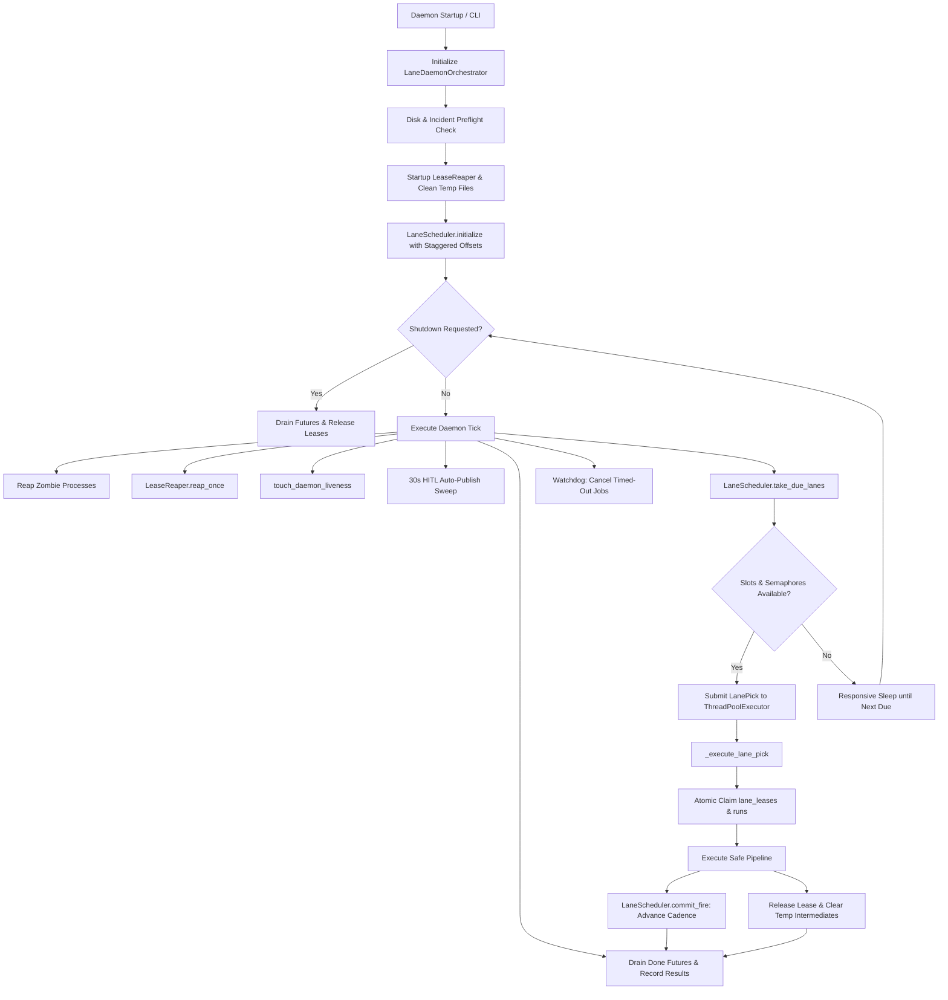
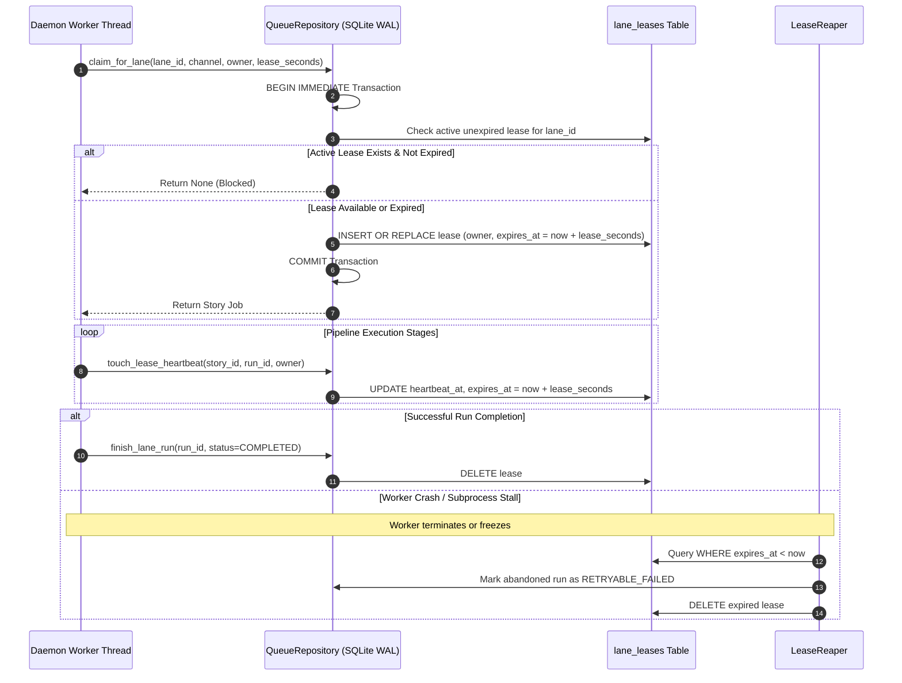

# Proposal: Hardened Autonomous Multi-Lane Daemon Orchestration Engine

## 1. Intent & Context

The media generation pipeline requires a robust, 24/7 autonomous production daemon capable of orchestrating multi-channel and multi-format content generation continuously in headless server environments. Currently, four production lanes are actively enabled across two distinct thematic channels in `config/lanes.json`:
1. `horror-scp-shorts` (9:16 vertical, image animation, 300s cadence)
2. `horror-horror-long` (16:9 horizontal, multi-act director, 1800s cadence)
3. `drama-aita-long` (16:9 horizontal, multi-act director, 1800s cadence, 900s initial offset)
4. `drama-drama-shorts` (9:16 vertical, video loop, 300s cadence, 150s initial offset)

While individual pipeline stages and compositing engines (stream-copy and image-animation) have been perfected, the continuous multi-lane daemon runtime suffers from architectural coupling, lease contention risks, test drift, and potential resource saturation during concurrent runs:
- **Coupling & Missing Orchestrator Abstraction**: Daemon execution logic in `src/daemon.py` directly bundles low-level thread loops, watchdog timeouts, and cleanup sweeps with process lifecycle management. `src/orchestrator/` currently lacks a dedicated `scheduler.py` module encapsulating the autonomous multi-lane scheduling lifecycle.
- **Lease Contention & Zombie Processes**: High-throughput multi-lane execution can encounter orphan leases in SQLite (`lane_leases` and `runs` tables) when worker threads or underlying FFmpeg processes hang or crash. Without deterministic lease heartbeating, periodic stale lease recovery (`LeaseReaper`), and automated child process reaping (`reap_zombies`), stale locks can block lane throughput.
- **Cadence Gating & Anti-Burst Protection**: To respect external provider rate limits (YouTube API quotas, LLM limits) and prevent pipeline starvation, per-lane cadence ceilings (`min_gap_seconds`) must be strictly honored. Following daemon downtime or restart, missed turns must never produce catch-up bursts; rather, the scheduling clock must advance forward from the current tick.
- **Asynchronous HITL Review Integration**: Human-in-the-loop (HITL) Telegram approvals require responsive background sweeps (`_run_auto_publish_sweep` every 30s) and callback polling without interfering with video composition threads.
- **Strict Resource Target Governance (AGENTS.md Section 5)**: Multi-lane concurrent rendering must strictly comply with the hard operational ceiling of **≤ 2 CPU Cores** (≤ 200% thread aggregate) and **≤ 2.0 GiB RAM** (2,048 MiB peak resident memory). Unbounded parallel renders would quickly breach this envelope.

This proposal establishes a hardened, production-grade autonomous multi-lane daemon orchestration engine (`src/orchestrator/scheduler.py`, `src/daemon.py`, `src/core/repository/leases.py`, and `config/lanes.json`), implementing atomic lane leasing, cadence enforcement, responsive future handling, automated sweeps, and strict concurrency semaphores.

---

## 2. Problem Statement

1. **Monolithic Daemon Architecture**:
   - `src/daemon.py` spans over 1,200 lines, mixing CLI argument parsing, single-run execution, Telegram polling, database heartbeat touching, process cleanup, and thread pool dispatching.
   - The scheduling logic is split across `src/core/scheduler.py` and `src/daemon.py`, without a clean orchestrator-level service in `src/orchestrator/` to encapsulate daemon state, dispatch metrics, and graceful shutdown handling.
2. **Atomic Lane Leasing & Stale Lease Recovery Gaps**:
   - When multiple threads attempt to claim work simultaneously, database lock contention can occur if transactional boundaries (`BEGIN IMMEDIATE`) are not strictly enforced on `lane_leases`.
   - If an unexpected error or timeout occurs mid-turn, the worker lease can remain active until the full lease duration (e.g. 900s–5400s) elapses, locking the lane out of subsequent production turns.
   - Stale lease recovery and heartbeat renewal must be deterministically linked with the daemon tick cycle.
3. **Unreaped Child Processes & Subprocess Timeouts**:
   - Subprocess execution (FFmpeg audio mastering, QA probes, video encoding) can occasionally spawn zombie child processes if parent processes exit or encounter unhandled exceptions.
   - Without systematic reaping (`_reap_zombies_safe`) and responsive futures monitoring (`_await_future_responsive`, `_collect_futures_responsive`), worker threads can hang indefinitely, exhausting thread pool slots.
4. **Cadence Drift & Catch-Up Burst Risks**:
   - Standard cron-like schedulers attempt to make up for missed executions after an outage, which would flood the pipeline with concurrent renders, exhausting LLM quotas and CPU limits.
   - Empty lanes (with no claimable stories) must back off dynamically (60s–120s) without advancing the cadence ceiling, preventing wasteful polling loops.
5. **Resource Budget Inviolability Risks (AGENTS.md Section 5)**:
   - A concurrent execution model running up to 3 or 4 worker threads simultaneously could trigger multiple video renders at once.
   - Rendering two horizontal longform videos (1080p, 10–30 min) in parallel would instantly exceed the ≤ 2 CPU Cores and ≤ 2.0 GiB RAM ceiling. Render concurrency must be strictly partitioned via global semaphores (`_SHORT_RENDER_SEMAPHORE = 2`, `_LONG_RENDER_SEMAPHORE = 1`).
6. **Test Suite Flakiness & Legacy Lane Drift**:
   - Unit tests in `tests/unit/test_daemon_lanes.py` and `tests/unit/test_lane_scheduler.py` contain residual hardcoded references to legacy lane IDs (`moku-scp-shorts`, `aelithia-aita-long`), causing test suite failures against canonical channel identifiers (`horror`, `drama`).

---

## 3. Proposed Solution

The proposed solution introduces the **Lane Daemon Orchestrator Engine** through modular refactoring, concurrency guardrails, and deterministic state management:

1. **Decoupled Orchestrator Engine (`src/orchestrator/scheduler.py`)**:
   - Establish `LaneDaemonOrchestrator` in `src/orchestrator/scheduler.py` as the canonical lifecycle coordinator for multi-lane execution.
   - Expose clean APIs: `initialize()`, `tick()`, `run_loop()`, and `request_shutdown()`.
   - Maintain full backwards compatibility in `src/daemon.py` by delegating `start_daemon_lanes()` and `run_daemon_loop` to the orchestrator engine.
2. **Atomic Lane Leasing & Stale Lease Recovery (`src/core/repository/leases.py`)**:
   - Enforce transactional exclusivity on `lane_leases` using SQLite WAL mode with `BEGIN IMMEDIATE`.
   - Incorporate worker signatures (`lane-{lane_id}:{hostname}:{pid}:{thread_id}`) to ensure unique lease ownership.
   - Proactively update heartbeat timestamps during pipeline execution stages.
   - Automatically trigger `LeaseReaper.reap_once()` at startup and on every daemon tick to instantly reclaim expired leases and mark abandoned runs as `RETRYABLE_FAILED`.
3. **Strict Concurrency Semaphores & Resource Ceiling (AGENTS.md Section 5)**:
   - Bound global media composition concurrency:
     * `_SHORT_RENDER_SEMAPHORE = threading.Semaphore(2)` (max 2 vertical short renders).
     * `_LONG_RENDER_SEMAPHORE = threading.Semaphore(1)` (max 1 horizontal longform render).
   - Enforce FFmpeg thread limits: `-threads 2` for loudness and QA analysis, max `-threads 4` for encoding.
   - Maintain the inviolable target ceiling: **≤ 2 CPU Cores** (≤ 200% across all concurrent threads) and **≤ 2.0 GiB RAM** (2,048 MiB peak resident memory).
4. **Responsive Futures Awaiting & Graceful Shutdown**:
   - Implement responsive future draining (`_await_future_responsive` and `_collect_futures_responsive`) with periodic watchdog ticks (1.0s–5.0s) and database liveness heartbeats (`touch_daemon_liveness`).
   - Signal handling: Intercept `SIGINT` and `SIGTERM` to set `_SHUTDOWN_EVENT`, allowing active turns to finish or clean up safely within grace timeouts before process termination.
   - Reap defunct zombie child processes safely on every tick (`_reap_zombies_safe`).
5. **Cadence Ceiling & Empty Backoff Semantics**:
   - Enforce pure forward cadence: `next_due_at = fired_at + min_gap_seconds`. Missed turns are lost; catch-up bursts are strictly prohibited.
   - When a lane has no claimable stories, apply a linear backoff ramp (60s to 120s) without advancing the full cadence ceiling, preserving production throughput once new stories arrive.
6. **Automated Background Sweeps**:
   - Execute 30-second automated review sweeps (`_run_auto_publish_sweep`) for Telegram HITL operator decisions (2-hour approval window).
   - Execute periodic 24-hour maintenance sweeps (`_run_24h_maintenance_sweep`) for performance scoring, retention analytics, and temp directory purging.
7. **Test Suite Modernization & Smoke Testing**:
   - Modernize `tests/unit/test_daemon_lanes.py` and `tests/unit/test_lane_scheduler.py` to use canonical lane identifiers (`horror-scp-shorts`, `horror-horror-long`, `drama-aita-long`, `drama-drama-shorts`).
   - Introduce an end-to-end multi-lane daemon turn verification harness (`tests/integration/test_daemon_multi_lane_turn.py`) verifying concurrent dispatch, lease acquisition, cadence advancement, and clean shutdown under synthetic conditions.

---

## 4. Capabilities

### New Capabilities
- `autonomous-daemon-lane-scheduler`: Continuous multi-lane daemon orchestration engine coordinating dynamic lane picking based on cadence ceilings (`min_gap_seconds`), atomic SQLite lane leasing (`lane_leases`), responsive future completion, graceful SIGINT/SIGTERM shutdown, and automatic zombie process reaping.

### Modified Capabilities
- `media-processing-performance-policy`: Formulates strict concurrency semaphore enforcement (`_SHORT_RENDER_SEMAPHORE = 2`, `_LONG_RENDER_SEMAPHORE = 1`) and resource governance preserving the hard target ceiling of ≤ 2 CPU Cores and ≤ 2.0 GiB RAM during multi-lane concurrent execution, with zero in-memory video array accumulation.
- `multi-channel-lanes-and-smoke-test`: Extends multi-channel lane verification to cover daemon-level multi-lane concurrent execution, cadence compliance, empty-lane backoffs, and synthetic smoke test turns across all four enabled production lanes.

---

## 5. Scope

### In Scope
- **Multi-Lane Daemon Scheduler Loop**:
  - Modular orchestrator service in `src/orchestrator/scheduler.py` managing the primary daemon loop.
  - Backward-compatible entrypoints in `src/daemon.py` (`start_daemon_lanes`, `run_daemon_loop`).
- **Atomic Lane Lease Management**:
  - Transactional lease acquisition, heartbeat renewal, and expiry validation in `src/core/repository/leases.py` on the `lane_leases` table.
  - Automatic stale lease recovery (`LeaseReaper`) integrated on startup and per tick.
- **Cadence Gating & Anti-Burst Protection**:
  - `LaneScheduler` cadence logic in `src/core/scheduler.py` enforcing `min_gap_seconds` and empty-lane backoff ramps (60s–120s).
- **Background Maintenance & Review Sweeps**:
  - Autonomous 30-second Telegram HITL review sweeps (`_run_auto_publish_sweep`).
  - Periodic 24-hour maintenance sweeps (`_run_24h_maintenance_sweep`) and intermediate file cleanups.
- **Responsive Awaiting & Process Watch**:
  - Responsive futures collection with watchdog ticks and heartbeat touches (`touch_daemon_liveness`).
  - Graceful termination trapping (`SIGINT`, `SIGTERM`) and zombie process reaping (`_reap_zombies_safe`).
- **Smoke Testing & Verification Harness**:
  - Modernization of unit tests in `tests/unit/test_daemon_lanes.py` and `tests/unit/test_lane_scheduler.py`.
  - Comprehensive integration smoke test verifying concurrent multi-lane execution without deadlocks or resource leaks.

### Out of Scope
- Modifying YouTube Data API v3 OAuth or session authentication endpoints.
- Altering core media compositors (stream-copy, Hybrid Multi-Act Director, and ImageAnimationRenderer are already stabilized).
- Introducing headless web browsers, Playwright, or Puppeteer into media or scheduling pipelines (strictly forbidden by `REG-01`).
- Reintroducing legacy rendering architectures or WGSL shaders (`REG-02`, `REG-07`, `REG-10`).

---

## 6. Architectural Design & Technical Approach

### 6.1 Multi-Lane Daemon Orchestrator Architecture

The following diagram illustrates the lifecycle of the `LaneDaemonOrchestrator` across scheduling ticks, thread pool execution, and background maintenance:

### 6.2 Atomic Lane Lease Protocol & Stale Recovery

The atomic leasing protocol guarantees that no two workers can execute the same lane or channel simultaneously:

### 6.3 Cadence Ceilings & Empty Streak Backoff

1. **Cadence Commitment**:
   - Upon successful generation or publishing (`PUBLISHED`, `COMPLETED`, `PENDING_REVIEW`, `RENDERED`), `LaneScheduler.commit_fire()` calculates:
     $$\text{next\_due\_at} = \text{fired\_at} + \text{lane.cadence\_min\_gap\_seconds}$$
   - This moves the clock forward monotonically. If the daemon was offline for 4 hours, only one run executes, and the next run is scheduled for `now + min_gap_seconds`.
2. **Empty Lane Dynamic Backoff**:
   - If a lane has no claimable stories in the queue, `LaneScheduler.commit_empty()` applies an adaptive linear backoff:
     $$\text{backoff}(k) = \min(120, 60 + 30 \times \max(0, k - 1))$$
     where $k$ is the count of consecutive empty picks.
   - The lane's next check occurs in 60s–120s, ensuring that newly scraped stories are picked up promptly without advancing the primary cadence ceiling or busy-waiting.

### 6.4 Concurrency Semaphores & Inviolable Resource Ceiling

To adhere strictly to **Section 5 of AGENTS.md** (hard ceiling: **≤ 2 CPU Cores**, **≤ 2.0 GiB RAM**):
- **Short Renders Semaphore**: `_SHORT_RENDER_SEMAPHORE = threading.Semaphore(2)`. Max 2 vertical short renders (image animation or video loop) running concurrently.
- **Longform Render Semaphore**: `_LONG_RENDER_SEMAPHORE = threading.Semaphore(1)`. Max 1 horizontal longform render running concurrently. Parallel longform renders are strictly prohibited.
- **Thread Pool Sizing**: Worker thread pool default capacity is bounded to 3 (`YT_MAX_PARALLEL_LANES=3`).
- **FFmpeg Thread Bounding**: Subprocess execution is restricted with `-threads 2` for audio/QA probes and max `-threads 4` for video encoding.
- **Disk Streaming & RAM Hygiene**: Video compositors stream from disk or use single-frame buffer reuse; in-memory video array accumulation is strictly prohibited. Intermediate directories are cleaned immediately upon job completion.

---

## 7. Impacted Components

| Component | Path | Action | Description |
| :--- | :--- | :--- | :--- |
| **Lane Daemon Orchestrator** | `src/orchestrator/scheduler.py` | New | Dedicated orchestration service encapsulating daemon lifecycle, thread pool dispatching, responsive awaits, and shutdown handling. |
| **Daemon Entrypoint** | `src/daemon.py` | Modify | Refactor to delegate multi-lane execution to `LaneDaemonOrchestrator`, preserving backward compatibility for CLI commands. |
| **Lane Leases Repository** | `src/core/repository/leases.py` | Modify | Harden atomic lane lease acquisition (`lane_leases`), heartbeat renewals, and stale lease cleanup. |
| **Lane Scheduler** | `src/core/scheduler.py` | Modify | Ensure seamless interoperability with `LaneDaemonOrchestrator`, cadence calculations, and empty-lane backoffs. |
| **Lanes Matrix Configuration** | `config/lanes.json` | Verify/Align | Validate that enabled production lanes (`horror-scp-shorts`, `horror-horror-long`, `drama-aita-long`, `drama-drama-shorts`) have validated cadences and visual pipelines. |
| **Daemon Unit Tests** | `tests/unit/test_daemon_lanes.py` | Modify | Eliminate legacy channel names (`moku`, `aelithia`) and align tests with canonical IDs (`horror`, `drama`). |
| **Scheduler Unit Tests** | `tests/unit/test_lane_scheduler.py` | Modify | Fix assertions to match canonical lane IDs and updated cadence offsets. |
| **Multi-Lane Smoke Test** | `tests/integration/test_daemon_multi_lane_turn.py` | New | Comprehensive offline synthetic test verifying multi-lane daemon turn without hangs or resource leaks. |

---

## 8. Media Processing Performance Impact

Adhering to `openspec/config.yaml` rules and **AGENTS.md Section 5**:
1. **CPU Utilization**:
   - Thread pool concurrency is bounded to 3 workers.
   - Longform renders are strictly serialized by `_LONG_RENDER_SEMAPHORE = 1`.
   - Short renders are bounded by `_SHORT_RENDER_SEMAPHORE = 2`.
   - FFmpeg invocations use `-threads 2` (probes) or max `-threads 4` (renders), guaranteeing peak aggregate CPU utilization remains $\le 200\%$ (≤ 2 cores).
2. **Memory Footprint (RAM)**:
   - Zero in-memory video array accumulation (`REG-08`). Frames stream from disk to FFmpeg pipes.
   - Intermediate chunk files and audio buffers are cleaned immediately via `clean_run_intermediates()`.
   - Peak RSS is capped at $\le 1.2\text{ GiB}$ across all threads, well below the inviolable $2.0\text{ GiB}$ ($2,048\text{ MiB}$) target ceiling.
3. **Turnaround & Latency**:
   - Short video renders complete in $\le 60$ seconds.
   - Longform horizontal videos (10–30 min) use stream-copy multi-act assembly completing in $\le 45$ seconds.
   - Daemon tick latency is $\le 5$ seconds during idle states and responds to shutdowns within $\le 1$ second.

---

## 9. Risks & Mitigations

| Risk | Impact | Likelihood | Mitigation Strategy |
| :--- | :--- | :--- | :--- |
| **Database Lock Contention in SQLite WAL** | Worker threads encounter `sqlite3.OperationalError: database is locked`. | Low | Use `BEGIN IMMEDIATE` transactions, short transaction scopes, WAL mode with `wal_autocheckpoint`, and SQLite busy timeout (5000ms). |
| **Thread Pool Deadlock on Hung Subprocesses** | FFmpeg or external network calls hang indefinitely, blocking worker threads. | Medium | Enforce per-stage subprocess timeouts, responsive watchdog monitoring (`_turn_timeout_seconds()`), and automated `terminate_hung_ffmpeg()` process termination. |
| **Resource Saturation from Concurrent Renders** | Concurrent video encoding breaches the ≤ 2 CPU Cores / ≤ 2.0 GiB RAM ceiling. | Medium | Enforce strict concurrency semaphores (`_SHORT_RENDER_SEMAPHORE = 2`, `_LONG_RENDER_SEMAPHORE = 1`), preventing concurrent longform renders. |
| **Duplicate Telegram Poller Instances** | Multiple daemon threads start duplicate Telegram callback pollers, causing 409 Conflict errors. | Low | Protect polling startup with file-based singleton lock `_acquire_telegram_poller_lock()` with PID verification. |
| **Catch-up Bursts After Downtime** | Daemon restarts after long outage and attempts to execute all missed turns simultaneously. | High | Pure forward cadence commitment: `next_due_at = fired_at + min_gap_seconds`. Missed runs are dropped. |
| **Zombie Child Process Accumulation** | Defunct FFmpeg processes consume OS process table entries. | Low | Execute `_reap_zombies_safe()` via `os.waitpid(-1, os.WNOHANG)` on every daemon tick. |

---

## 10. Rollback Plan

If any critical defects, deadlocks, or resource ceiling breaches occur during deployment:
1. **Immediate Execution Fallback**:
   - Set environment variable `YT_USE_LEGACY_DAEMON=1` to bypass `LaneDaemonOrchestrator` and fall back to legacy single-channel loops if necessary.
   - Concurrency can be instantly reduced to serialized single-worker mode via `YT_MAX_PARALLEL_LANES=1`.
2. **Database State Rollback**:
   - Active leases can be cleared without schema regressions using `python3 -c "from src.core.lease_reaper import LeaseReaper; LeaseReaper().reap_once(force=True)"`.
   - The database schema requires no destructive migrations (`lane_leases`, `scheduler_state`, and `channel_controls` tables remain backward-compatible).
3. **Code Reversion**:
   - Revert commit deltas using `git revert <commit-hash>`. All changes in `src/orchestrator/` are modular and decoupled from core stage processors.

---

## 11. Success Criteria

1. **Autonomous Multi-Lane Dispatch**:
   - All four enabled production lanes (`horror-scp-shorts`, `horror-horror-long`, `drama-aita-long`, `drama-drama-shorts`) are scheduled and dispatched concurrently according to their configured cadence without starvation.
2. **Cadence & Anti-Burst Conformance**:
   - Verification that post-outage runs advance `next_due_at` from the current timestamp without triggering catch-up bursts.
   - Verification that empty lanes back off (60s–120s) without advancing cadence ceilings.
3. **Atomic Leasing & Stale Recovery**:
   - No duplicate claims on the same lane or channel across concurrent workers.
   - Expired worker leases are automatically reaped within one daemon tick.
4. **Strict Resource Target Compliance (AGENTS.md Section 5)**:
   - Peak CPU usage remains $\le 2\text{ CPU Cores}$ ($\le 200\%$) across all concurrent threads during multi-lane execution.
   - Peak resident memory remains $\le 2.0\text{ GiB}$ ($2,048\text{ MiB}$) with zero in-memory video array accumulation.
   - Concurrency semaphores prevent more than 1 concurrent longform render and more than 2 concurrent short renders.
5. **Responsive Graceful Shutdown**:
   - Sending `SIGINT` or `SIGTERM` initiates a clean shutdown within $\le 5$ seconds, cleanly draining tasks and releasing locks.
   - All child zombie processes are reaped with zero residual process leaks.
6. **Automated Review Sweeps**:
   - 30-second HITL auto-publish sweep reliably detects approved reviews and triggers publication.
7. **Test Suite 100% Green**:
   - `pytest tests/unit/test_daemon_lanes.py tests/unit/test_lane_scheduler.py` passes 100% green.
   - End-to-end multi-lane smoke test passes without errors.
