# Technical Design: Documentation Coherence, Accuracy, and Compact Optimization

## 1. Executive Summary & Architecture Context

This technical design formalizes the architecture, compaction strategy, and verification model for **Documentation Coherence, Accuracy, and Compact Optimization** (`docs_coherence_and_optimization`) in the `yt-auto` media production system.

### 1.1 Problem Context
Over successive iterations of high-velocity architectural evolution (migrating from procedural rendering to a 100% asset-based stream-copy engine, implementing the Hybrid Multi-Act Director, establishing multi-channel production across horror, drama, and scifi, and enforcing strict anti-regression governance), the repository's documentation drifted from codebase realities:
1. **Obsolete Agent Manifests**: [`docs/AGENTES_IA_Y_POLITICA.md`](file:///home/moku/.gemini/antigravity-cli/worktrees/YouTubeChannels/video_graphics_new_designs/docs/AGENTES_IA_Y_POLITICA.md) documented six obsolete agent files (`script_curator.py`, `art_director.py`, `scene_planner.py`, `qa_auditor.py`, `image_auditor.py`, `investigator.py`), whereas [`src/agents/`](file:///home/moku/.gemini/antigravity-cli/worktrees/YouTubeChannels/video_graphics_new_designs/src/agents/) contains the canonical consolidated modules (`base_agent.py`, `story_director.py`, `atmospheric_director.py`, `seo_optimizer.py`, `video_qa.py`, `translator.py`).
2. **Lane Catalog & Governance Drift**: [`docs/ARQUITECTURA.md`](file:///home/moku/.gemini/antigravity-cli/worktrees/YouTubeChannels/video_graphics_new_designs/docs/ARQUITECTURA.md) and [`README.md`](file:///home/moku/.gemini/antigravity-cli/worktrees/YouTubeChannels/video_graphics_new_designs/README.md) referenced deprecated lane identifiers (`horror-long`, `drama-shorts`), omitted pre-configured SciFi lanes (`scifi-singularity-shorts`, `scifi-singularity-long`), and capped guardrails at REG-13 instead of REG-01 to REG-14.
3. **Out-of-Order Execution Stages**: [`docs/FLUJO_VIDEOS.md`](file:///home/moku/.gemini/antigravity-cli/worktrees/YouTubeChannels/video_graphics_new_designs/docs/FLUJO_VIDEOS.md) listed stages out of numerical and execution order (1, 2, 3, 5, 6, 7, 4, 8, 9, 11, 12, 10, 13), directly conflicting with linear stages 01 through 13 in [`src/pipeline/stages/`](file:///home/moku/.gemini/antigravity-cli/worktrees/YouTubeChannels/video_graphics_new_designs/src/pipeline/stages/).
4. **Governance Invariant Discrepancies**: [`docs/POLITICA_GOBERNANZA_ANTI_REGRESION.md`](file:///home/moku/.gemini/antigravity-cli/worktrees/YouTubeChannels/video_graphics_new_designs/docs/POLITICA_GOBERNANZA_ANTI_REGRESION.md) cited "Los 5 Invariantes" in Section 2 while enumerating six rules, and cited a non-existent "REG-01 a REG-30" range when tests span REG-01 through REG-14.
5. **Inaccurate Longform Description**: [`docs/MULTICHANNEL_PIPELINE.md`](file:///home/moku/.gemini/antigravity-cli/worktrees/YouTubeChannels/video_graphics_new_designs/docs/MULTICHANNEL_PIPELINE.md) described longform horizontal rendering as a single 30s loop repetition, neglecting the active Hybrid Multi-Act Director architecture implemented in `src/media/director_assembly.py` and specified in [`docs/DIRECTOR_SINGLE_PASS.md`](file:///home/moku/.gemini/antigravity-cli/worktrees/YouTubeChannels/video_graphics_new_designs/docs/DIRECTOR_SINGLE_PASS.md).
6. **Incomplete Central Index**: [`docs/README.md`](file:///home/moku/.gemini/antigravity-cli/worktrees/YouTubeChannels/video_graphics_new_designs/docs/README.md) indexed only 12 of the 19 active technical markdown documents in `docs/`.
7. **Redundant Historical Narratives**: Historical plans retained verbose retrospectives and dead directory tree listings.
8. **Stale Branch and PR References**: [`docs/FFMPEG_LOW_CPU.md`](file:///home/moku/.gemini/antigravity-cli/worktrees/YouTubeChannels/video_graphics_new_designs/docs/FFMPEG_LOW_CPU.md) contained transient references to PR #11 and feature branches.
9. **Stale Project Milestone Status**: [`PROJECT.md`](file:///home/moku/.gemini/antigravity-cli/worktrees/YouTubeChannels/video_graphics_new_designs/PROJECT.md) retained `IN_PROGRESS` and `PENDING` states on completed production features.
10. **Line Budget Ceiling Proximity**: Consolidated lines across `ACTIVE_DOCS` totaled **994 lines**, leaving only a 6-line margin before breaching the 1000-line budget ceiling enforced by [`tests/unit/test_docs_integrity.py`](file:///home/moku/.gemini/antigravity-cli/worktrees/YouTubeChannels/video_graphics_new_designs/tests/unit/test_docs_integrity.py).

---

## 2. Technical Approach & Architecture Decisions (ADRs)

### ADR-01 (D1): Active Docs Compaction & Line Budget Management (<= 850 Lines)
- **Context**: [`tests/unit/test_docs_integrity.py:test_total_lines_budget_under_1000`](file:///home/moku/.gemini/antigravity-cli/worktrees/YouTubeChannels/video_graphics_new_designs/tests/unit/test_docs_integrity.py#L79-L83) enforces that total lines across the 12 files in `ACTIVE_DOCS` cannot exceed 1000 lines. The current count of 994 lines provides an unacceptably thin safety margin (6 lines).
- **Decision**: Systematically compact all 12 documents in `ACTIVE_DOCS` to bring the aggregate line count down from 994 lines to $\le 850$ lines (target $\approx 800$ lines), creating a durable safety buffer of $\ge 150$ lines.
  - Compaction techniques:
    1. Eliminate conversational prose and redundant preambles across headers.
    2. Format tables tightly without blank wrapping lines.
    3. Consolidate repetitive multi-line command explanations into concise code blocks with inline comments.
    4. Maintain all technical semantics, parameters, env vars, and operational instructions.
- **Alternatives Considered**:
  - *Alternative A: Minimalistic edits retaining ~990 lines*: Rejected because any subsequent doc adjustment would break CI.
  - *Alternative B: Radical truncation (< 500 lines)*: Rejected because stripping operational and architectural depth hurts maintainability.
- **Rationale**: A target of $\le 850$ lines provides ample breathing room under the 1000-line ceiling while fully preserving technical substance.

### ADR-02 (D2): Agent Subsystem Representation Parity (`src/agents/`)
- **Context**: [`docs/AGENTES_IA_Y_POLITICA.md`](file:///home/moku/.gemini/antigravity-cli/worktrees/YouTubeChannels/video_graphics_new_designs/docs/AGENTES_IA_Y_POLITICA.md) references dead filenames (`script_curator.py`, `art_director.py`, `scene_planner.py`, `qa_auditor.py`, `image_auditor.py`, `investigator.py`).
- **Decision**: Update `docs/AGENTES_IA_Y_POLITICA.md` to map strictly to the 6 canonical modules in [`src/agents/`](file:///home/moku/.gemini/antigravity-cli/worktrees/YouTubeChannels/video_graphics_new_designs/src/agents/):
  1. [`src/agents/base_agent.py`](file:///home/moku/.gemini/antigravity-cli/worktrees/YouTubeChannels/video_graphics_new_designs/src/agents/base_agent.py): `ProgrammaticAgent`, `CircuitBreaker`, `AgyStreamClient`, `AgentSaturationError`
  2. [`src/agents/story_director.py`](file:///home/moku/.gemini/antigravity-cli/worktrees/YouTubeChannels/video_graphics_new_designs/src/agents/story_director.py): `StoryDirectorAgent`, `StoryInvestigatorAgent`
  3. [`src/agents/atmospheric_director.py`](file:///home/moku/.gemini/antigravity-cli/worktrees/YouTubeChannels/video_graphics_new_designs/src/agents/atmospheric_director.py): `AtmosphericDirectorAgent`
  4. [`src/agents/seo_optimizer.py`](file:///home/moku/.gemini/antigravity-cli/worktrees/YouTubeChannels/video_graphics_new_designs/src/agents/seo_optimizer.py): `SeoOptimizerAgent`
  5. [`src/agents/video_qa.py`](file:///home/moku/.gemini/antigravity-cli/worktrees/YouTubeChannels/video_graphics_new_designs/src/agents/video_qa.py): `VideoQAAgent`
  6. [`src/agents/translator.py`](file:///home/moku/.gemini/antigravity-cli/worktrees/YouTubeChannels/video_graphics_new_designs/src/agents/translator.py): `TranslatorAgent`
- **Alternatives Considered**:
  - *Alternative A: Retain legacy filenames as aliases*: Rejected because dead filenames cause confusion and violate SSOT hygiene.
- **Rationale**: Aligns architecture docs directly with the Python AST and runtime imports.

### ADR-03 (D3): Lane Catalog SSOT Reconciliation (`config/lanes.json`)
- **Context**: [`docs/ARQUITECTURA.md`](file:///home/moku/.gemini/antigravity-cli/worktrees/YouTubeChannels/video_graphics_new_designs/docs/ARQUITECTURA.md) and [`README.md`](file:///home/moku/.gemini/antigravity-cli/worktrees/YouTubeChannels/video_graphics_new_designs/README.md) use outdated lane keys (`horror-long`, `drama-shorts`) and omit SciFi lanes configured in [`config/lanes.json`](file:///home/moku/.gemini/antigravity-cli/worktrees/YouTubeChannels/video_graphics_new_designs/config/lanes.json).
- **Decision**: Catalog all 6 lanes in `docs/ARQUITECTURA.md` and `README.md` with canonical identifiers:
  1. `horror-scp-shorts`: Channel `horror`, vertical 9:16 (`1080x1920`), story type `scp`, enabled `true`.
  2. `horror-horror-long`: Channel `horror`, horizontal 16:9 (`1920x1080`), story type `horror`, enabled `true`.
  3. `drama-drama-shorts`: Channel `drama`, vertical 9:16 (`1080x1920`), story type `reddit_aita`, enabled `true`.
  4. `drama-aita-long`: Channel `drama`, horizontal 16:9 (`1920x1080`), story type `reddit_aita`, enabled `true`.
  5. `scifi-singularity-shorts`: Channel `scifi`, vertical 9:16 (`1080x1920`), story type `scifi`, enabled `false` (pre-configured).
  6. `scifi-singularity-long`: Channel `scifi`, horizontal 16:9 (`1920x1080`), story type `scifi`, enabled `false` (pre-configured).
  Update Section 9 in `docs/ARQUITECTURA.md` to reference the full anti-regression range: `"REG-01 a REG-14"`.
- **Alternatives Considered**:
  - *Alternative A: Omit disabled SciFi lanes*: Rejected because `config/lanes.json` is the configuration SSOT and contains all 6 lanes.
- **Rationale**: Ensures complete bidirectional parity between documentation, configuration, and runtime lane resolvers.

### ADR-04 (D4): Sequential Pipeline Stage Ordering (Stages 01–13)
- **Context**: [`docs/FLUJO_VIDEOS.md`](file:///home/moku/.gemini/antigravity-cli/worktrees/YouTubeChannels/video_graphics_new_designs/docs/FLUJO_VIDEOS.md) lists stages in a disjointed order (1, 2, 3, 5, 6, 7, 4, 8, 9, 11, 12, 10, 13).
- **Decision**: Reorganize both the Mermaid diagram and the descriptive table in `docs/FLUJO_VIDEOS.md` to follow the exact sequential numbering of [`src/pipeline/stages/`](file:///home/moku/.gemini/antigravity-cli/worktrees/YouTubeChannels/video_graphics_new_designs/src/pipeline/stages/):
  - Stage 01: Adjudicación y Lease (`stage_01_lease.py`)
  - Stage 02: Ingesta y Curación (`stage_02_ingest.py`)
  - Stage 03: Sanitización Editorial (`stage_03_editorial.py`)
  - Stage 04: Configuración Visual & Categoría de Loop (`stage_04_mood.py`)
  - Stage 05: Síntesis TTS y Audio (`stage_05_tts.py`)
  - Stage 06: Alineación de Duración (`stage_06_alignment.py`)
  - Stage 07: Subtítulos Karaoke ASS (`stage_07_subtitles.py`)
  - Stage 08: Resolución de Loop de Catálogo (`stage_08_loop.py`)
  - Stage 09: Composición Lineal & Render Stream-Copy (`stage_09_render.py`)
  - Stage 10: Compuerta QA Integral Pre-publicación (`stage_10_qa.py`)
  - Stage 11: Miniatura Local Determinista & Metadatos (`stage_11_metadata.py`)
  - Stage 12: Deduplicación Criptográfica & SimHash (`stage_12_simhash.py`)
  - Stage 13: Veredicto Técnico & Publicación YouTube (`stage_13_publish.py`)
- **Alternatives Considered**:
  - *Alternative A: Keep non-sequential thematic order*: Rejected because pipeline developers rely on `docs/FLUJO_VIDEOS.md` to understand chronological execution flow.
- **Rationale**: Eliminates confusion and provides a 1:1 mental map to `src/pipeline/stages/stage_*.py`.

### ADR-05 (D5): Anti-Regression Governance Scope Reconciliation
- **Context**: [`docs/POLITICA_GOBERNANZA_ANTI_REGRESION.md`](file:///home/moku/.gemini/antigravity-cli/worktrees/YouTubeChannels/video_graphics_new_designs/docs/POLITICA_GOBERNANZA_ANTI_REGRESION.md) has an internal arithmetic mismatch (Section 2 heading says "Los 5 Invariantes", but lists 6 items) and states "REG-01 a REG-30" instead of "REG-01 a REG-14".
- **Decision**:
  1. Rename Section 2 to `"## 2. Los 6 Invariantes Innegociables de Calidad"`.
  2. Update Section 1 text to cite "los 6 invariantes del sistema".
  3. Update Rule 5 to cite `"REG-01 a REG-14"` in parity with [`tests/unit/test_anti_regression_guardrails.py`](file:///home/moku/.gemini/antigravity-cli/worktrees/YouTubeChannels/video_graphics_new_designs/tests/unit/test_anti_regression_guardrails.py).
  4. Formally catalog the 6 quality invariants:
     - Invariant 1: Aislamiento Absoluto de Medios (Zero-Browser Policy)
     - Invariant 2: Higiene de Árbol Git (Single SSOT)
     - Invariant 3: Candado Pre-Commit Activo (`.githooks/pre-commit`)
     - Invariant 4: Cero Documentos Resucitados (`docs/architecture/0*.md`, retired directories)
     - Invariant 5: Certificación de Suite de Anti-Regresión (REG-01 a REG-14)
     - Invariant 6: Cero Vías Procedurales o Matemáticas de Video (100% Asset-Based Pipeline)
- **Alternatives Considered**:
  - *Alternative A: Merge two invariants into 5*: Rejected because Invariant 6 (Zero Procedural) is a distinct, non-negotiable architectural invariant.
- **Rationale**: Restores factual integrity and unifies governance text with automated test suites.

### ADR-06 (D6): Longform Visual Pipeline Architecture (Hybrid Multi-Act Director)
- **Context**: [`docs/MULTICHANNEL_PIPELINE.md`](file:///home/moku/.gemini/antigravity-cli/worktrees/YouTubeChannels/video_graphics_new_designs/docs/MULTICHANNEL_PIPELINE.md) describes longform rendering as repeating a single 30s clip, neglecting the active Hybrid Multi-Act Director architecture implemented in `src/media/director_assembly.py`.
- **Decision**: Update `docs/MULTICHANNEL_PIPELINE.md` to specify:
  1. Longform horizontal (16:9) rendering uses the Hybrid Multi-Act Director architecture.
  2. Multi-act narrative curation spanning 4 to 8 distinct acts per story with tension-curve pacing.
  3. Thematic loop matching from the certified video bank (`assets/loops/`) with deterministic modulo fallback.
  4. Stream-copy concat demuxer assembly (`-c:v copy`) for homogeneous loop segments sharing geometry, codec, pixel format, and time base.
  5. Strict compliance with the production turnaround ceiling of $\le 45$s under the governance budget of $\le 2$ CPU Cores and $\le 2.0$ GiB RAM.
  6. Preserved YouTube Shorts (9:16) rendering via `LoopVideoEngine` (10s seamless loops, sub-2s stream-copy, soft subtitle muxing `mov_text` with `MarginV >= 240`).
- **Alternatives Considered**:
  - *Alternative A: Describe longform as full re-encoding*: Rejected because REG-13 and REG-14 mandate stream-copy and forbid re-encoding or burning subtitles on longform.
- **Rationale**: Aligns pipeline documentation with the production code in `src/media/director_assembly.py` and `docs/DIRECTOR_SINGLE_PASS.md`.

### ADR-07 (D7): Central Navigation Completeness (All 19 Documents)
- **Context**: [`docs/README.md`](file:///home/moku/.gemini/antigravity-cli/worktrees/YouTubeChannels/video_graphics_new_designs/docs/README.md) only indexes 12 of the 19 active technical markdown files in `docs/`.
- **Decision**: Expand `docs/README.md` to index all 19 technical documents, organized by functional area:
  1. **Arquitectura y Pipeline Central**: `ARQUITECTURA.md`, `FLUJO_VIDEOS.md`, `MULTICHANNEL_PIPELINE.md`, `DIRECTOR_SINGLE_PASS.md`, `FFMPEG_LOW_CPU.md`, `CANALES.md`.
  2. **Operación e Infraestructura**: `OPERACION.md`, `CONFIGURACION_SECRETOS.md`, `INTEGRACIONES_Y_SERVICIOS.md`, `MCP.md`.
  3. **Inteligencia Artificial y Agentes**: `AGENTES_IA_Y_POLITICA.md`.
  4. **Planes Maestros y Evolución Visual**: `PLAN_MAESTRO_PIPELINE_VISUAL.md`, `PROPUESTA_EVOLUCION_PIPELINE_VISUAL.md`.
  5. **Políticas y Gobernanza de Calidad**: `POLITICA_GOBERNANZA_ANTI_REGRESION.md`, `POLITICA_CATALOGO_CI.md`, `visual-assets-policy.md`.
  6. **Diagnóstico y Referencias**: `TROUBLESHOOTING.md`, `REFERENCIAS_Y_VERSIONES.md`, `README.md`.
- **Alternatives Considered**:
  - *Alternative A: Keep a 12-file summary table*: Rejected because omitting technical blueprints leaves developers without navigation paths to critical files like `FFMPEG_LOW_CPU.md` or `DIRECTOR_SINGLE_PASS.md`.
- **Rationale**: Establishes a true central navigation hub without leaving orphaned documents.

### ADR-08 (D8): Preserving Section Anchors in Historical Plans
- **Context**: [`docs/PLAN_MAESTRO_PIPELINE_VISUAL.md`](file:///home/moku/.gemini/antigravity-cli/worktrees/YouTubeChannels/video_graphics_new_designs/docs/PLAN_MAESTRO_PIPELINE_VISUAL.md) is tested by [`tests/unit/test_architectural_specs.py:test_plan_maestro_pipeline_visual_sections`](file:///home/moku/.gemini/antigravity-cli/worktrees/YouTubeChannels/video_graphics_new_designs/tests/unit/test_architectural_specs.py#L62-L78), which asserts the presence of 7 mandatory section headings. The file currently contains outdated directory trees referencing non-existent agent files.
- **Decision**:
  1. Preserve all 7 mandatory section headings verbatim:
     - `Consolidación de Auditorías Previas`
     - `Diagnóstico del Workflow Actual`
     - `Matriz de Componentes`
     - `Estructura del Sistema`
     - `Auditoría y Plan de Saneamiento Documental`
     - `Checklist de Seguridad, Rendimiento`
     - `Hitos Estratégicos de Transición`
  2. Compact redundant retrospectives and streamline text.
  3. Update Section 4's directory tree to reflect canonical files in `src/agents/`.
  4. Ensure total character length remains $> 1000$ chars (asserted by `test_architecture_doc_exists_and_non_empty`).
  5. In [`docs/PROPUESTA_EVOLUCION_PIPELINE_VISUAL.md`](file:///home/moku/.gemini/antigravity-cli/worktrees/YouTubeChannels/video_graphics_new_designs/docs/PROPUESTA_EVOLUCION_PIPELINE_VISUAL.md), streamline the 4-act narrative structure and align agent class names.
- **Alternatives Considered**:
  - *Alternative A: Leave legacy agent trees intact*: Rejected because having dead agent references anywhere in `docs/` creates technical debt.
- **Rationale**: Eliminates dead references while ensuring 100% pass on architectural unit tests.

### ADR-09: Verbatim Preservation of Anti-Regression Invariant Strings
- **Context**: [`tests/unit/test_anti_regression_guardrails.py:TestResourceTargetGovernanceGuardrails`](file:///home/moku/.gemini/antigravity-cli/worktrees/YouTubeChannels/video_graphics_new_designs/tests/unit/test_anti_regression_guardrails.py#L566-L609) asserts exact verbatim strings across `AGENTS.md` and `docs/FFMPEG_LOW_CPU.md`.
- **Decision**:
  1. In [`docs/FFMPEG_LOW_CPU.md`](file:///home/moku/.gemini/antigravity-cli/worktrees/YouTubeChannels/video_graphics_new_designs/docs/FFMPEG_LOW_CPU.md), replace transient PR #11 / feature branch references with permanent architectural statements referencing `director_assembly.py` and `LoopVideoEngine`.
  2. Strictly preserve all mandatory invariant strings:
     - `"Target Resource Envelope (≤ 2 Cores CPU, ≤ 2.0 GiB RAM)"`
     - `"turnaround ceiling of ≤ 45s"`
     - `"≤ 2 Cores CPU"` or `"≤ 2 CPU Cores"`
     - `"≤ 2.0 GiB RAM"`
  3. In [`AGENTS.md`](file:///home/moku/.gemini/antigravity-cli/worktrees/YouTubeChannels/video_graphics_new_designs/AGENTS.md), ensure the following strings remain untouched:
     - `"Strict Resource Target & Performance Budget (2 Cores, 2 GB RAM)"`
     - `"≤ 2 CPU Cores"`
     - `"≤ 2.0 GiB RAM"`
     - `"Resource Work Refusal"`
     - `"turnaround ceiling of ≤ 45s"`
- **Rationale**: Prevents accidental test breakage in REG-14 guardrails.

### ADR-10: Milestone State Modernization in `PROJECT.md`
- **Context**: [`PROJECT.md`](file:///home/moku/.gemini/antigravity-cli/worktrees/YouTubeChannels/video_graphics_new_designs/PROJECT.md) lists Milestones M1 through M4 as `IN_PROGRESS` or `PENDING`, even though features F01 through F16 are verified and active in production.
- **Decision**:
  1. Update milestone statuses to `COMPLETED` for M1 through M4.
  2. Strictly preserve all 16 feature tokens (`F01` to `F16`) asserted by `test_root_project_and_test_infra_docs_exist`.
  3. Maintain concise interface contracts.
- **Rationale**: Reflects true system status while satisfying architectural test constraints.

---

## 3. Data Flow & Documentation SSOT Mapping

The following diagram illustrates how documentation files map to codebase components and automated verification gates:

```mermaid
flowchart TD
    subgraph SSOT["Documentation Single Source of Truth (docs/ & Root MD)"]
        D_AGENT["docs/AGENTES_IA_Y_POLITICA.md"]
        D_ARCH["docs/ARQUITECTURA.md"]
        D_FLOW["docs/FLUJO_VIDEOS.md"]
        D_GOV["docs/POLITICA_GOBERNANZA_ANTI_REGRESION.md"]
        D_MULTI["docs/MULTICHANNEL_PIPELINE.md"]
        D_FFMPEG["docs/FFMPEG_LOW_CPU.md"]
        D_DIR["docs/DIRECTOR_SINGLE_PASS.md"]
        D_MAESTRO["docs/PLAN_MAESTRO_PIPELINE_VISUAL.md"]
        D_ROOT["README.md & docs/README.md"]
        D_PROJ["PROJECT.md"]
        D_MCP["docs/MCP.md"]
    end

    subgraph CODE["Codebase Implementation & Configurations"]
        C_AGENTS["src/agents/ (6 canonical modules)"]
        C_LANES["config/lanes.json (6 production lanes)"]
        C_STAGES["src/pipeline/stages/ (stages 01 to 13)"]
        C_DIRECTOR["src/media/director_assembly.py & loop_engine.py"]
        C_MCP["src/mcp/server.py (9 tools, 3 resources, 3 prompts)"]
        C_GOV_HOOK[".githooks/pre-commit & scripts/verify_integrity.sh"]
    end

    subgraph GATES["Automated Verification Suites"]
        G_INTEG["test_docs_integrity.py<br/>(budget <= 1000 lines, links, tags)"]
        G_REG["test_anti_regression_guardrails.py<br/>(REG-01 to REG-14, invariant strings)"]
        G_ARCH["test_architectural_specs.py<br/>(7 sections, F01-F16, schemas)"]
        G_MCP["scripts/verify_mcp_sync.py<br/>(100% bidirectional parity)"]
        G_SCRIPT["./scripts/verify_integrity.sh<br/>(STATUS: HEALTHY, exit 0)"]
    end

    D_AGENT -.->|Maps to| C_AGENTS
    D_ARCH -.->|Maps to| C_LANES
    D_FLOW -.->|Maps to| C_STAGES
    D_MULTI -.->|Maps to| C_DIRECTOR
    D_FFMPEG -.->|Maps to| C_DIRECTOR
    D_DIR -.->|Maps to| C_DIRECTOR
    D_MCP -.->|Maps to| C_MCP
    D_GOV -.->|Maps to| C_GOV_HOOK

    D_ROOT & D_PROJ & D_AGENT & D_ARCH & D_FLOW & D_MULTI --> G_INTEG
    D_FFMPEG & D_GOV & D_MULTI --> G_REG
    D_MAESTRO & D_PROJ & D_ARCH & D_FLOW --> G_ARCH
    D_MCP --> G_MCP
    SSOT & CODE --> G_SCRIPT
```



---

## 4. Detailed File Changes & Line Budget Allocations

The following table details all documentation files to be modified, compacted, or reconciled, showing current line counts, target budgets, and specific architectural edits:

| File Path | In `ACTIVE_DOCS`? | Current Lines | Target Lines | Delta | Specific Architectural Changes |
|---|:---:|:---:|:---:|:---:|---|
| [`README.md`](file:///home/moku/.gemini/antigravity-cli/worktrees/YouTubeChannels/video_graphics_new_designs/README.md) | Yes | 124 | 92 | -32 | Update lane table to all 6 canonical lanes; update agent summary to 6 active modules; compact CLI examples. |
| [`PROJECT.md`](file:///home/moku/.gemini/antigravity-cli/worktrees/YouTubeChannels/video_graphics_new_designs/PROJECT.md) | Yes | 78 | 72 | -6 | Update M1–M4 milestones to `COMPLETED`; strictly preserve all 16 feature tokens (`F01`–`F16`). |
| [`docs/README.md`](file:///home/moku/.gemini/antigravity-cli/worktrees/YouTubeChannels/video_graphics_new_designs/docs/README.md) | Yes | 52 | 52 | 0 | Expand catalog from 12 to all 19 active technical docs; compact table columns and role navigation to keep net zero lines. |
| [`docs/ARQUITECTURA.md`](file:///home/moku/.gemini/antigravity-cli/worktrees/YouTubeChannels/video_graphics_new_designs/docs/ARQUITECTURA.md) | Yes | 118 | 92 | -26 | Reconcile lane catalog to all 6 lanes in `config/lanes.json`; update Section 5 to 6 active agents; cite "REG-01 a REG-14" in Section 9. |
| [`docs/FLUJO_VIDEOS.md`](file:///home/moku/.gemini/antigravity-cli/worktrees/YouTubeChannels/video_graphics_new_designs/docs/FLUJO_VIDEOS.md) | Yes | 57 | 52 | -5 | Reorder stages 01 through 13 in strictly ascending numerical order in both Mermaid flowchart and table. |
| [`docs/MULTICHANNEL_PIPELINE.md`](file:///home/moku/.gemini/antigravity-cli/worktrees/YouTubeChannels/video_graphics_new_designs/docs/MULTICHANNEL_PIPELINE.md) | Yes | 51 | 46 | -5 | Document Hybrid Multi-Act Director for longform (4-8 acts, stream-copy, turnaround $\le 45$s, $\le 2$ cores, $\le 2.0$ GiB RAM). |
| [`docs/OPERACION.md`](file:///home/moku/.gemini/antigravity-cli/worktrees/YouTubeChannels/video_graphics_new_designs/docs/OPERACION.md) | Yes | 155 | 110 | -45 | Compact command tables and checklists; replace user home paths with `<repo_root>` for path hygiene. |
| [`docs/CONFIGURACION_SECRETOS.md`](file:///home/moku/.gemini/antigravity-cli/worktrees/YouTubeChannels/video_graphics_new_designs/docs/CONFIGURACION_SECRETOS.md) | Yes | 132 | 95 | -37 | Compact environment variable tables; streamline redundant narrative while preserving all security invariants. |
| [`docs/INTEGRACIONES_Y_SERVICIOS.md`](file:///home/moku/.gemini/antigravity-cli/worktrees/YouTubeChannels/video_graphics_new_designs/docs/INTEGRACIONES_Y_SERVICIOS.md) | Yes | 78 | 65 | -13 | Compact API contracts for Telegram, YouTube Data API v3, Drive, and FFmpeg; eliminate dead notes. |
| [`docs/AGENTES_IA_Y_POLITICA.md`](file:///home/moku/.gemini/antigravity-cli/worktrees/YouTubeChannels/video_graphics_new_designs/docs/AGENTES_IA_Y_POLITICA.md) | Yes | 86 | 65 | -21 | Map tree to canonical 6 files in `src/agents/`; describe active classes; eradicate dead filenames. |
| [`docs/TROUBLESHOOTING.md`](file:///home/moku/.gemini/antigravity-cli/worktrees/YouTubeChannels/video_graphics_new_designs/docs/TROUBLESHOOTING.md) | Yes | 39 | 35 | -4 | Compact error diagnostic table rows; keep all failure modes and mitigation commands. |
| [`docs/REFERENCIAS_Y_VERSIONES.md`](file:///home/moku/.gemini/antigravity-cli/worktrees/YouTubeChannels/video_graphics_new_designs/docs/REFERENCIAS_Y_VERSIONES.md) | Yes | 33 | 30 | -3 | Compact pinned runtime versions and external reference links. |
| **SUBTOTAL (`ACTIVE_DOCS`)** | - | **994** | **806** | **-188** | **Budget: $\le 1000$ lines. Result: 806 lines ($\sim 194$-line safety buffer).** |
| [`docs/POLITICA_GOBERNANZA_ANTI_REGRESION.md`](file:///home/moku/.gemini/antigravity-cli/worktrees/YouTubeChannels/video_graphics_new_designs/docs/POLITICA_GOBERNANZA_ANTI_REGRESION.md) | No | 80 | 78 | -2 | Retitle Section 2 to "Los 6 Invariantes"; align guardrail range to "REG-01 a REG-14". |
| [`docs/FFMPEG_LOW_CPU.md`](file:///home/moku/.gemini/antigravity-cli/worktrees/YouTubeChannels/video_graphics_new_designs/docs/FFMPEG_LOW_CPU.md) | No | 36 | 36 | 0 | Modernize PR #11 / feature branch references; preserve all mandatory invariant strings verbatim. |
| [`docs/PLAN_MAESTRO_PIPELINE_VISUAL.md`](file:///home/moku/.gemini/antigravity-cli/worktrees/YouTubeChannels/video_graphics_new_designs/docs/PLAN_MAESTRO_PIPELINE_VISUAL.md) | No | 373 | 240 | -133 | Preserve all 7 mandatory section titles; update Section 4 tree to canonical 6 agent files; compact prose. |
| [`docs/PROPUESTA_EVOLUCION_PIPELINE_VISUAL.md`](file:///home/moku/.gemini/antigravity-cli/worktrees/YouTubeChannels/video_graphics_new_designs/docs/PROPUESTA_EVOLUCION_PIPELINE_VISUAL.md) | No | 150 | 110 | -40 | Streamline 4-act narrative guidelines; align agent class names with `src/agents/`. |

---

## 5. Testing & Verification Strategy

All changes must be validated against automated test suites and validation scripts:

### 5.1 Verification Commands

```bash
# 1. Documentation Integrity & Line Budget Verification (ACTIVE_DOCS <= 1000 lines)
.venv/bin/pytest tests/unit/test_docs_integrity.py -v

# 2. Anti-Regression Guardrail Suite (REG-01 through REG-14 invariant strings)
.venv/bin/pytest tests/unit/test_anti_regression_guardrails.py -v

# 3. Architectural Specifications & JSON Schemas (7 mandatory sections, F01-F16 tokens)
.venv/bin/pytest tests/unit/test_architectural_specs.py -v

# 4. Bidirectional MCP Server Parity (100% parity across tools, resources, prompts)
.venv/bin/python scripts/verify_mcp_sync.py

# 5. Full Repository Governance & Invariant Audit (STATUS: HEALTHY, exit 0)
./scripts/verify_integrity.sh
```

### 5.2 Line Budget Sanity One-Liner

```bash
python3 -c "
from pathlib import Path
REPO_ROOT = Path('.')
DOCS_DIR = REPO_ROOT / 'docs'
ACTIVE_DOCS = [
    REPO_ROOT / 'README.md',
    REPO_ROOT / 'PROJECT.md',
    DOCS_DIR / 'README.md',
    DOCS_DIR / 'ARQUITECTURA.md',
    DOCS_DIR / 'FLUJO_VIDEOS.md',
    DOCS_DIR / 'MULTICHANNEL_PIPELINE.md',
    DOCS_DIR / 'OPERACION.md',
    DOCS_DIR / 'CONFIGURACION_SECRETOS.md',
    DOCS_DIR / 'INTEGRACIONES_Y_SERVICIOS.md',
    DOCS_DIR / 'AGENTES_IA_Y_POLITICA.md',
    DOCS_DIR / 'TROUBLESHOOTING.md',
    DOCS_DIR / 'REFERENCIAS_Y_VERSIONES.md',
]
total = sum(len(d.read_text(encoding='utf-8').splitlines()) for d in ACTIVE_DOCS)
print(f'Total ACTIVE_DOCS lines: {total} (Budget <= 1000, Target <= 850)')
assert total <= 1000, f'Line budget exceeded: {total} > 1000'
assert total <= 850, f'Safety margin not met: {total} > 850'
"
```

---

## 6. Threat Matrix & Security Analysis

| Threat ID | Threat Vector | Likelihood | Impact | Mitigation / Status |
|---|---|:---:|:---:|---|
| **TM-01** | Unauthorized Privilege Escalation | N/A | N/A | **N/A**: This change modifies markdown documentation and project tracking metadata exclusively. Zero executable code, binaries, or privilege management mechanisms are introduced or modified. |
| **TM-02** | Credential Leakage / Hardcoded Secrets | N/A | N/A | **N/A**: No secrets or credential strings are added to any documentation files. Path hygiene rules strictly prevent foreign paths or local usernames. |
| **TM-03** | Injection / Untrusted Input Parsing | N/A | N/A | **N/A**: No input parsers, network handlers, or evaluation endpoints are altered. |
| **TM-04** | Denial of Service / Resource Exhaustion | Low | Low | **Mitigated**: Preserving strict resource envelope statements ($\le 2$ Cores CPU, $\le 2.0$ GiB RAM, turnaround $\le 45$s) reinforces governance against resource bloat. Line budget compaction prevents repository bloat. |

---

## 7. Migration & Rollback Strategy

1. **Rollback Plan**:
   Since all edits are strictly limited to documentation markdowns and `PROJECT.md`, rollback is instantaneous and carries zero blast radius:
   ```bash
   git checkout origin/main -- docs/ README.md PROJECT.md openspec/changes/docs_coherence_and_optimization/
   ```
2. **Zero Runtime Impact**:
   Production services (Docker daemons, SQLite databases, FFmpeg workers, Telegram bots) are entirely decoupled from markdown documentation content and will experience zero interruptions or configuration changes.
