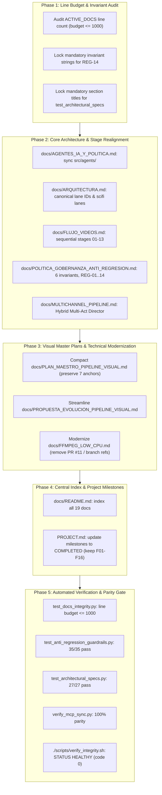

# Proposal: Documentation Coherence, Accuracy, and Compact Optimization

## Intent

Over successive iterations of high-velocity feature development and architectural transitions (including migration to an asset-based stream-copy pipeline, hybrid multi-act director rendering, multi-channel thematic expansion across horror, drama, and scifi, and strict anti-regression governance), several foundational documentation files in `docs/` and root markdowns have drifted from the codebase reality:

1. **Obsolete Agent Manifests**: [`docs/AGENTES_IA_Y_POLITICA.md`](file:///home/moku/.gemini/antigravity-cli/worktrees/YouTubeChannels/video_graphics_new_designs/docs/AGENTES_IA_Y_POLITICA.md) documents obsolete agent files (`script_curator.py`, `art_director.py`, `scene_planner.py`, `qa_auditor.py`, `image_auditor.py`, `investigator.py`), whereas [`src/agents/`](file:///home/moku/.gemini/antigravity-cli/worktrees/YouTubeChannels/video_graphics_new_designs/src/agents/) contains the consolidated canonical agents (`atmospheric_director.py`, `base_agent.py`, `seo_optimizer.py`, `story_director.py`, `translator.py`, `video_qa.py`).
2. **Obsolete Lane Identifiers & Missing Channels**: [`docs/ARQUITECTURA.md`](file:///home/moku/.gemini/antigravity-cli/worktrees/YouTubeChannels/video_graphics_new_designs/docs/ARQUITECTURA.md) references legacy lane IDs (`horror-long` instead of `horror-horror-long`, `drama-shorts` instead of `drama-drama-shorts`), omits the SciFi lanes (`scifi-singularity-shorts`, `scifi-singularity-long`) configured in [`config/lanes.json`](file:///home/moku/.gemini/antigravity-cli/worktrees/YouTubeChannels/video_graphics_new_designs/config/lanes.json), and caps guardrails at REG-13 instead of the full REG-01 to REG-14 suite.
3. **Out-of-Order Execution Stages**: [`docs/FLUJO_VIDEOS.md`](file:///home/moku/.gemini/antigravity-cli/worktrees/YouTubeChannels/video_graphics_new_designs/docs/FLUJO_VIDEOS.md) lists the 13 canonical stages out of numerical and logical order (1, 2, 3, 5, 6, 7, 4, 8, 9, 11, 12, 10, 13), directly conflicting with the actual linear pipeline implementation in [`src/pipeline/stages/`](file:///home/moku/.gemini/antigravity-cli/worktrees/YouTubeChannels/video_graphics_new_designs/src/pipeline/stages/) (stages 01 to 13).
4. **Governance Count and Guardrail Range Discrepancies**: [`docs/POLITICA_GOBERNANZA_ANTI_REGRESION.md`](file:///home/moku/.gemini/antigravity-cli/worktrees/YouTubeChannels/video_graphics_new_designs/docs/POLITICA_GOBERNANZA_ANTI_REGRESION.md) claims "Los 5 Invariantes" in its headers while enumerating 6 distinct rules, and refers to a non-existent "REG-01 a REG-30" range when the test suite in [`tests/unit/test_anti_regression_guardrails.py`](file:///home/moku/.gemini/antigravity-cli/worktrees/YouTubeChannels/video_graphics_new_designs/tests/unit/test_anti_regression_guardrails.py) spans REG-01 through REG-14.
5. **Inaccurate Longform Description**: [`docs/MULTICHANNEL_PIPELINE.md`](file:///home/moku/.gemini/antigravity-cli/worktrees/YouTubeChannels/video_graphics_new_designs/docs/MULTICHANNEL_PIPELINE.md) describes longform video composition as an overly simplistic single-loop repeat, neglecting the active Hybrid Multi-Act Director architecture documented in [`docs/DIRECTOR_SINGLE_PASS.md`](file:///home/moku/.gemini/antigravity-cli/worktrees/YouTubeChannels/video_graphics_new_designs/docs/DIRECTOR_SINGLE_PASS.md) and implemented in [`src/media/director_assembly.py`](file:///home/moku/.gemini/antigravity-cli/worktrees/YouTubeChannels/video_graphics_new_designs/src/media/director_assembly.py).
6. **Incomplete Central Index**: [`docs/README.md`](file:///home/moku/.gemini/antigravity-cli/worktrees/YouTubeChannels/video_graphics_new_designs/docs/README.md) indexes only 12 of the 19 active technical markdown documents, leaving 7 essential technical specifications unreferenced.
7. **Redundant Historical Narratives**: [`docs/PLAN_MAESTRO_PIPELINE_VISUAL.md`](file:///home/moku/.gemini/antigravity-cli/worktrees/YouTubeChannels/video_graphics_new_designs/docs/PLAN_MAESTRO_PIPELINE_VISUAL.md) (24 KB) and [`docs/PROPUESTA_EVOLUCION_PIPELINE_VISUAL.md`](file:///home/moku/.gemini/antigravity-cli/worktrees/YouTubeChannels/video_graphics_new_designs/docs/PROPUESTA_EVOLUCION_PIPELINE_VISUAL.md) (10 KB) retain verbose historical retrospectives and obsolete directory tree representations that bloat repository size.
8. **Stale Branch and PR References**: [`docs/FFMPEG_LOW_CPU.md`](file:///home/moku/.gemini/antigravity-cli/worktrees/YouTubeChannels/video_graphics_new_designs/docs/FFMPEG_LOW_CPU.md) references old development branches and PR #11 that require modernization into permanent architectural statements.
9. **Stale Root Project Milestones**: [`PROJECT.md`](file:///home/moku/.gemini/antigravity-cli/worktrees/YouTubeChannels/video_graphics_new_designs/PROJECT.md) still marks verified and operational features (F01–F16) as `IN_PROGRESS` or `PENDING`.
10. **Strict Line Budget Invariant**: [`tests/unit/test_docs_integrity.py`](file:///home/moku/.gemini/antigravity-cli/worktrees/YouTubeChannels/video_graphics_new_designs/tests/unit/test_docs_integrity.py) enforces a total ceiling of $\le 1000$ lines across `ACTIVE_DOCS` (currently sitting at 994 lines, leaving only a 6-line buffer). Any uncontrolled additions will break the automated test suite.

This proposal modernizes, aligns, and compacts the documentation across `docs/` and root markdown files to establish an accurate Single Source of Truth (SSOT), eliminate cognitive debt, respect line budget ceilings, and guarantee a 100% pass across all anti-regression and integrity test suites.

---

## Scope

### In Scope

- **Agent Inventory Synchronization**:
  - Update [`docs/AGENTES_IA_Y_POLITICA.md`](file:///home/moku/.gemini/antigravity-cli/worktrees/YouTubeChannels/video_graphics_new_designs/docs/AGENTES_IA_Y_POLITICA.md) to accurately map the 6 active agent modules in `src/agents/`: [`base_agent.py`](file:///home/moku/.gemini/antigravity-cli/worktrees/YouTubeChannels/video_graphics_new_designs/src/agents/base_agent.py), [`story_director.py`](file:///home/moku/.gemini/antigravity-cli/worktrees/YouTubeChannels/video_graphics_new_designs/src/agents/story_director.py), [`atmospheric_director.py`](file:///home/moku/.gemini/antigravity-cli/worktrees/YouTubeChannels/video_graphics_new_designs/src/agents/atmospheric_director.py), [`seo_optimizer.py`](file:///home/moku/.gemini/antigravity-cli/worktrees/YouTubeChannels/video_graphics_new_designs/src/agents/seo_optimizer.py), [`video_qa.py`](file:///home/moku/.gemini/antigravity-cli/worktrees/YouTubeChannels/video_graphics_new_designs/src/agents/video_qa.py), and [`translator.py`](file:///home/moku/.gemini/antigravity-cli/worktrees/YouTubeChannels/video_graphics_new_designs/src/agents/translator.py).
  - Clarify the agent classes and programmatic roles (`ProgrammaticAgent`, `StoryDirectorAgent`, `StoryInvestigatorAgent`, `AtmosphericDirectorAgent`, `ArtDirectorMoodAgent`, `SeoOptimizerAgent`, `ViralPackagingAgent`, `VideoQAAgent`, `MultimodalReviewAgent`, `TranslatorAgent`).
- **Lane and Architectural Alignment**:
  - Update [`docs/ARQUITECTURA.md`](file:///home/moku/.gemini/antigravity-cli/worktrees/YouTubeChannels/video_graphics_new_designs/docs/ARQUITECTURA.md) to list canonical lane IDs (`horror-scp-shorts`, `horror-horror-long`, `drama-drama-shorts`, `drama-aita-long`, `scifi-singularity-shorts`, `scifi-singularity-long`) in parity with [`config/lanes.json`](file:///home/moku/.gemini/antigravity-cli/worktrees/YouTubeChannels/video_graphics_new_designs/config/lanes.json).
  - Update Section 9 of `docs/ARQUITECTURA.md` to reference the complete anti-regression range (REG-01 to REG-14).
- **Sequential Stage Ordering in Flujo de Videos**:
  - Reorder [`docs/FLUJO_VIDEOS.md`](file:///home/moku/.gemini/antigravity-cli/worktrees/YouTubeChannels/video_graphics_new_designs/docs/FLUJO_VIDEOS.md) to follow the strict sequence of stages 01 to 13 matching `src/pipeline/stages/` (01: Lease, 02: Ingest, 03: Editorial, 04: Mood/Category, 05: TTS, 06: Alignment, 07: Subtitles, 08: Loop, 09: Render, 10: QA, 11: Metadata & Thumbnails, 12: SimHash Deduplication, 13: Publish).
  - Synchronize both the Mermaid diagram and the descriptive table.
- **Anti-Regression Governance Coherence**:
  - Update [`docs/POLITICA_GOBERNANZA_ANTI_REGRESION.md`](file:///home/moku/.gemini/antigravity-cli/worktrees/YouTubeChannels/video_graphics_new_designs/docs/POLITICA_GOBERNANZA_ANTI_REGRESION.md) to title Section 2 as "Los 6 Invariantes Innegociables de Calidad" (reconciling the header with the 6 items).
  - Correct the test suite scope reference to "REG-01 a REG-14" in line with [`tests/unit/test_anti_regression_guardrails.py`](file:///home/moku/.gemini/antigravity-cli/worktrees/YouTubeChannels/video_graphics_new_designs/tests/unit/test_anti_regression_guardrails.py).
- **Multi-Channel Pipeline & Hybrid Director Architecture**:
  - Modernize [`docs/MULTICHANNEL_PIPELINE.md`](file:///home/moku/.gemini/antigravity-cli/worktrees/YouTubeChannels/video_graphics_new_designs/docs/MULTICHANNEL_PIPELINE.md) to describe longform rendering via the Hybrid Multi-Act Director architecture, detailing multi-scene pacing, narrative acts, and stream-copy turnaround ceiling of $\le 45$s.
- **Master Documentation Index Expansion**:
  - Expand [`docs/README.md`](file:///home/moku/.gemini/antigravity-cli/worktrees/YouTubeChannels/video_graphics_new_designs/docs/README.md) to catalog all 19 active documentation files with clear categorization and navigation links.
- **Streamlining & Deduplication of Visual Plans**:
  - Compact [`docs/PLAN_MAESTRO_PIPELINE_VISUAL.md`](file:///home/moku/.gemini/antigravity-cli/worktrees/YouTubeChannels/video_graphics_new_designs/docs/PLAN_MAESTRO_PIPELINE_VISUAL.md) and [`docs/PROPUESTA_EVOLUCION_PIPELINE_VISUAL.md`](file:///home/moku/.gemini/antigravity-cli/worktrees/YouTubeChannels/video_graphics_new_designs/docs/PROPUESTA_EVOLUCION_PIPELINE_VISUAL.md), eliminating redundant historical narratives while strictly preserving all 7 mandatory section anchors tested by [`tests/unit/test_architectural_specs.py`](file:///home/moku/.gemini/antigravity-cli/worktrees/YouTubeChannels/video_graphics_new_designs/tests/unit/test_architectural_specs.py):
    1. "Consolidación de Auditorías Previas"
    2. "Diagnóstico del Workflow Actual"
    3. "Matriz de Componentes"
    4. "Estructura del Sistema"
    5. "Auditoría y Plan de Saneamiento Documental"
    6. "Checklist de Seguridad, Rendimiento"
    7. "Hitos Estratégicos de Transición"
  - Update the embedded file tree in `PLAN_MAESTRO_PIPELINE_VISUAL.md` to reflect actual active files in `src/agents/`.
- **FFmpeg Low CPU Modernization**:
  - Modernize [`docs/FFMPEG_LOW_CPU.md`](file:///home/moku/.gemini/antigravity-cli/worktrees/YouTubeChannels/video_graphics_new_designs/docs/FFMPEG_LOW_CPU.md), removing references to old PR #11 / feature branches while strictly preserving mandatory invariant strings:
    - `"Strict Resource Target & Performance Budget (2 Cores, 2 GB RAM)"`
    - `"≤ 2 CPU Cores"`
    - `"≤ 2.0 GiB RAM"`
    - `"Resource Work Refusal"`
    - `"Target Resource Envelope (≤ 2 Cores CPU, ≤ 2.0 GiB RAM)"`
    - `"turnaround ceiling of ≤ 45s"`
- **Root Project Tracking Synchronization**:
  - Update [`PROJECT.md`](file:///home/moku/.gemini/antigravity-cli/worktrees/YouTubeChannels/video_graphics_new_designs/PROJECT.md) milestone table, changing statuses from `IN_PROGRESS` / `PENDING` to `COMPLETED` / `ACTIVE`, while preserving all feature tags (`F01` to `F16`) required by `test_architectural_specs.py`.
- **Line Budget Enforcement**:
  - Maintain the consolidated total lines of `ACTIVE_DOCS` strictly below the 1000-line budget ceiling enforced by [`tests/unit/test_docs_integrity.py`](file:///home/moku/.gemini/antigravity-cli/worktrees/YouTubeChannels/video_graphics_new_designs/tests/unit/test_docs_integrity.py).

### Out of Scope

- Modifying functional application code in `src/` or changing media processing algorithms.
- Modifying Draft-07 JSON schemas in `schemas/`.
- Creating any files under `docs/architecture/0*.md` (strictly prohibited by Zero Resurrected Docs policy).
- Altering MCP server registrations in `src/mcp/` or modifying `mcp_config.json`.
- Modifying test assertion logic in `tests/unit/test_anti_regression_guardrails.py` or `tests/unit/test_architectural_specs.py`.

---

## Capabilities

### New Capabilities

- `documentation-coherence-and-verification`: Rules, structural specifications, and automated verification procedures ensuring unified documentation SSOT, strict factual alignment between documentation and Python codebase implementations, complete document indexing, and continuous enforcement of line budgets and anti-regression invariant strings.

### Modified Capabilities

None

---

## Approach



### Detailed Phasing

1. **Phase 1: Line Budget Allocation & Invariant Locking**:
   - Establish line budget allocations for all 12 files in `ACTIVE_DOCS` (`README.md`, `PROJECT.md`, `docs/README.md`, `docs/ARQUITECTURA.md`, `docs/FLUJO_VIDEOS.md`, `docs/MULTICHANNEL_PIPELINE.md`, `docs/OPERACION.md`, `docs/CONFIGURACION_SECRETOS.md`, `docs/INTEGRACIONES_Y_SERVICIOS.md`, `docs/AGENTES_IA_Y_POLITICA.md`, `docs/TROUBLESHOOTING.md`, `docs/REFERENCIAS_Y_VERSIONES.md`) to guarantee a comfortable safety margin ($\le 950$ lines aggregate, well below the 1000-line ceiling).
   - Ensure `docs/MCP.md` remains outside `ACTIVE_DOCS` as intended.
   - Lock invariant strings verified by `test_anti_regression_guardrails.py` in `AGENTS.md` and `docs/FFMPEG_LOW_CPU.md`.

2. **Phase 2: Core Architecture & Stage Realignment**:
   - In [`docs/AGENTES_IA_Y_POLITICA.md`](file:///home/moku/.gemini/antigravity-cli/worktrees/YouTubeChannels/video_graphics_new_designs/docs/AGENTES_IA_Y_POLITICA.md), replace the obsolete agent tree with the active modules in `src/agents/`. Compact agent descriptions into concise, high-density bullet points.
   - In [`docs/ARQUITECTURA.md`](file:///home/moku/.gemini/antigravity-cli/worktrees/YouTubeChannels/video_graphics_new_designs/docs/ARQUITECTURA.md), update the lanes table to include all 6 lanes from `config/lanes.json` with their canonical identifiers (`horror-scp-shorts`, `horror-horror-long`, `drama-drama-shorts`, `drama-aita-long`, `scifi-singularity-shorts`, `scifi-singularity-long`). Update Section 9 to cite "REG-01 a REG-14".
   - In [`docs/FLUJO_VIDEOS.md`](file:///home/moku/.gemini/antigravity-cli/worktrees/YouTubeChannels/video_graphics_new_designs/docs/FLUJO_VIDEOS.md), order stages 01 through 13 sequentially:
     - 1. Adjudicación y Lease (`stage_01_lease.py`)
     - 2. Ingesta y Curación (`stage_02_ingest.py`)
     - 3. Sanitización Editorial (`stage_03_editorial.py`)
     - 4. Configuración Visual & Categoría de Loop (`stage_04_mood.py`)
     - 5. Síntesis TTS y Audio (`stage_05_tts.py`)
     - 6. Alineación de Duración (`stage_06_alignment.py`)
     - 7. Subtítulos Karaoke ASS (`stage_07_subtitles.py`)
     - 8. Resolución de Loop de Catálogo (`stage_08_loop.py`)
     - 9. Composición Lineal & Render Stream-Copy (`stage_09_render.py`)
     - 10. Compuerta QA Integral Pre-publicación (`stage_10_qa.py`)
     - 11. Miniatura Local Determinista & Metadatos (`stage_11_metadata.py`)
     - 12. Deduplicación Criptográfica & SimHash (`stage_12_simhash.py`)
     - 13. Veredicto Técnico & Publicación YouTube (`stage_13_publish.py`)
   - In [`docs/POLITICA_GOBERNANZA_ANTI_REGRESION.md`](file:///home/moku/.gemini/antigravity-cli/worktrees/YouTubeChannels/video_graphics_new_designs/docs/POLITICA_GOBERNANZA_ANTI_REGRESION.md), correct heading to "Los 6 Invariantes Innegociables de Calidad" and update test scope to REG-01 a REG-14.
   - In [`docs/MULTICHANNEL_PIPELINE.md`](file:///home/moku/.gemini/antigravity-cli/worktrees/YouTubeChannels/video_graphics_new_designs/docs/MULTICHANNEL_PIPELINE.md), incorporate the Hybrid Multi-Act Director architecture for longform horizontal lanes (`horror-horror-long`, `drama-aita-long`, `scifi-singularity-long`).

3. **Phase 3: Visual Master Plans & Technical Modernization**:
   - In [`docs/PLAN_MAESTRO_PIPELINE_VISUAL.md`](file:///home/moku/.gemini/antigravity-cli/worktrees/YouTubeChannels/video_graphics_new_designs/docs/PLAN_MAESTRO_PIPELINE_VISUAL.md), streamline the historical narrative and update the embedded repository tree while preserving all 7 required section titles:
     - `Consolidación de Auditorías Previas`
     - `Diagnóstico del Workflow Actual`
     - `Matriz de Componentes`
     - `Estructura del Sistema`
     - `Auditoría y Plan de Saneamiento Documental`
     - `Checklist de Seguridad, Rendimiento`
     - `Hitos Estratégicos de Transición`
   - In [`docs/PROPUESTA_EVOLUCION_PIPELINE_VISUAL.md`](file:///home/moku/.gemini/antigravity-cli/worktrees/YouTubeChannels/video_graphics_new_designs/docs/PROPUESTA_EVOLUCION_PIPELINE_VISUAL.md), compact repetitive descriptions of the 4 acts and align agent names with `src/agents/`.
   - In [`docs/FFMPEG_LOW_CPU.md`](file:///home/moku/.gemini/antigravity-cli/worktrees/YouTubeChannels/video_graphics_new_designs/docs/FFMPEG_LOW_CPU.md), replace "Coordination with director single-pass (PR #11)" with "Single-Pass Multi-Scene Architecture" referencing stable production modules (`director_assembly.py`, `LoopVideoEngine`), preserving all mandatory invariant strings intact.

4. **Phase 4: Central Index & Project Milestones**:
   - In [`docs/README.md`](file:///home/moku/.gemini/antigravity-cli/worktrees/YouTubeChannels/video_graphics_new_designs/docs/README.md), update the active documentation table to cover all 19 documents:
     1. `ARQUITECTURA.md`
     2. `FLUJO_VIDEOS.md`
     3. `MULTICHANNEL_PIPELINE.md`
     4. `DIRECTOR_SINGLE_PASS.md`
     5. `FFMPEG_LOW_CPU.md`
     6. `CANALES.md`
     7. `OPERACION.md`
     8. `CONFIGURACION_SECRETOS.md`
     9. `INTEGRACIONES_Y_SERVICIOS.md`
     10. `AGENTES_IA_Y_POLITICA.md`
     11. `MCP.md`
     12. `PLAN_MAESTRO_PIPELINE_VISUAL.md`
     13. `PROPUESTA_EVOLUCION_PIPELINE_VISUAL.md`
     14. `POLITICA_CATALOGO_CI.md`
     15. `visual-assets-policy.md`
     16. `POLITICA_GOBERNANZA_ANTI_REGRESION.md`
     17. `TROUBLESHOOTING.md`
     18. `REFERENCIAS_Y_VERSIONES.md`
     19. `README.md`
   - In [`PROJECT.md`](file:///home/moku/.gemini/antigravity-cli/worktrees/YouTubeChannels/video_graphics_new_designs/PROJECT.md), update milestone status column to `COMPLETED` for all milestones (M1–M4), keeping all feature descriptions F01 through F16 intact.

5. **Phase 5: Automated Verification & Parity Gate**:
   - Execute `test_docs_integrity.py` to assert that all relative links resolve, code blocks have language tags, and aggregate lines remain $\le 1000$.
   - Execute `test_anti_regression_guardrails.py` to assert that all 35 tests (REG-01 through REG-14) pass cleanly.
   - Execute `test_architectural_specs.py` to assert that all 27 tests pass cleanly.
   - Execute `scripts/verify_mcp_sync.py` to confirm 100% bidirectional MCP parity.
   - Execute `./scripts/verify_integrity.sh` to confirm zero violations and clean exit code 0.

---

## Affected Areas

| Area / File | Impact | Description |
|---|---|---|
| [`docs/AGENTES_IA_Y_POLITICA.md`](file:///home/moku/.gemini/antigravity-cli/worktrees/YouTubeChannels/video_graphics_new_designs/docs/AGENTES_IA_Y_POLITICA.md) | Modified | Synchronize agent tree and roles with active modules in `src/agents/`. Compact content to fit line budget. |
| [`docs/ARQUITECTURA.md`](file:///home/moku/.gemini/antigravity-cli/worktrees/YouTubeChannels/video_graphics_new_designs/docs/ARQUITECTURA.md) | Modified | Update lane table with 6 canonical lane IDs (including SciFi); cite guardrails REG-01 to REG-14. |
| [`docs/FLUJO_VIDEOS.md`](file:///home/moku/.gemini/antigravity-cli/worktrees/YouTubeChannels/video_graphics_new_designs/docs/FLUJO_VIDEOS.md) | Modified | Reorder 13 stages sequentially (01 to 13) in both Mermaid diagram and descriptive table. |
| [`docs/POLITICA_GOBERNANZA_ANTI_REGRESION.md`](file:///home/moku/.gemini/antigravity-cli/worktrees/YouTubeChannels/video_graphics_new_designs/docs/POLITICA_GOBERNANZA_ANTI_REGRESION.md) | Modified | Reconcile invariant count to 6 and align guardrail suite scope to REG-01 through REG-14. |
| [`docs/MULTICHANNEL_PIPELINE.md`](file:///home/moku/.gemini/antigravity-cli/worktrees/YouTubeChannels/video_graphics_new_designs/docs/MULTICHANNEL_PIPELINE.md) | Modified | Document Hybrid Multi-Act Director architecture, multi-act pacing, and turnaround ceiling ($\le 45$s). |
| [`docs/README.md`](file:///home/moku/.gemini/antigravity-cli/worktrees/YouTubeChannels/video_graphics_new_designs/docs/README.md) | Modified | Expand central index from 12 to 19 active technical documents with categorized roles. |
| [`docs/PLAN_MAESTRO_PIPELINE_VISUAL.md`](file:///home/moku/.gemini/antigravity-cli/worktrees/YouTubeChannels/video_graphics_new_designs/docs/PLAN_MAESTRO_PIPELINE_VISUAL.md) | Modified | Compact redundant retrospectives, modernize agent tree, and preserve all 7 mandatory section titles. |
| [`docs/PROPUESTA_EVOLUCION_PIPELINE_VISUAL.md`](file:///home/moku/.gemini/antigravity-cli/worktrees/YouTubeChannels/video_graphics_new_designs/docs/PROPUESTA_EVOLUCION_PIPELINE_VISUAL.md) | Modified | Streamline and compact 4-act narrative guidelines and align agent class references. |
| [`docs/FFMPEG_LOW_CPU.md`](file:///home/moku/.gemini/antigravity-cli/worktrees/YouTubeChannels/video_graphics_new_designs/docs/FFMPEG_LOW_CPU.md) | Modified | Modernize section on director single-pass; preserve mandatory invariant strings. |
| [`PROJECT.md`](file:///home/moku/.gemini/antigravity-cli/worktrees/YouTubeChannels/video_graphics_new_designs/PROJECT.md) | Modified | Update milestone status from IN_PROGRESS / PENDING to COMPLETED while preserving F01–F16. |
| `openspec/changes/docs_coherence_and_optimization/` | Added | OpenSpec proposal, specification, and implementation task tracking. |

---

## Risks

| Risk | Likelihood | Impact | Mitigation |
|---|---|---|---|
| **Active Docs Line Budget Overflow** | Medium | High | `test_total_lines_budget_under_1000` enforces $\le 1000$ lines across `ACTIVE_DOCS`. Mitigate by compacting prose, using tight table formatting, removing repetitive intro blocks, and keeping total lines $\le 950$. |
| **Accidental Invariant String Alteration** | Low | High | `test_anti_regression_guardrails.py` strictly checks exact invariant strings (`"Strict Resource Target & Performance Budget (2 Cores, 2 GB RAM)"`, `"≤ 2 CPU Cores"`, `"≤ 2.0 GiB RAM"`, `"Resource Work Refusal"`, `"Target Resource Envelope (≤ 2 Cores CPU, ≤ 2.0 GiB RAM)"`, `"turnaround ceiling of ≤ 45s"`). Mitigate by locking these strings and verifying them in test before commit. |
| **Missing Mandatory Section in Plan Maestro** | Low | High | `test_plan_maestro_pipeline_visual_sections` asserts the presence of 7 exact section strings. Mitigate by preserving exact markdown headers for those 7 sections. |
| **Missing Feature Inventory in PROJECT.md** | Low | High | `test_root_project_and_test_infra_docs_exist` checks for tokens `F01` to `F16`. Mitigate by keeping the feature inventory table intact and only updating milestone status columns. |
| **MCP Documentation Parity Drift** | Low | High | `verify_mcp_sync.py` checks bidirectional parity between code, config, and `docs/MCP.md`. Mitigate by leaving `docs/MCP.md` canonical tables unchanged, only cross-referencing it in `docs/README.md`. |

---

## Rollback Plan

1. **Git Checkout Reversion**: Because all proposed changes are strictly confined to markdown documentation and project tracking files without database schema modifications or binary asset alterations, rollback can be executed instantly via Git:
   ```bash
   git checkout origin/main -- docs/ PROJECT.md openspec/changes/docs_coherence_and_optimization/
   ```
2. **Zero Blast Radius on Runtime**: The production daemon, media encoders, SQLite databases, and YouTube publication pipelines remain completely unaffected during or after rollback.

---

## Dependencies

- **Testing Infrastructure**: Python 3.12 / 3.13 venv (`.venv/bin/pytest`), `pytest-asyncio`, `pytest-xdist`.
- **Integrity Validation Scripts**:
  - [`./scripts/verify_integrity.sh`](file:///home/moku/.gemini/antigravity-cli/worktrees/YouTubeChannels/video_graphics_new_designs/scripts/verify_integrity.sh)
  - [`scripts/verify_mcp_sync.py`](file:///home/moku/.gemini/antigravity-cli/worktrees/YouTubeChannels/video_graphics_new_designs/scripts/verify_mcp_sync.py)

---

## Success Criteria

- [ ] [`docs/AGENTES_IA_Y_POLITICA.md`](file:///home/moku/.gemini/antigravity-cli/worktrees/YouTubeChannels/video_graphics_new_designs/docs/AGENTES_IA_Y_POLITICA.md) accurately reflects the active agent modules in `src/agents/` and their respective programmatic responsibilities.
- [ ] [`docs/ARQUITECTURA.md`](file:///home/moku/.gemini/antigravity-cli/worktrees/YouTubeChannels/video_graphics_new_designs/docs/ARQUITECTURA.md) accurately specifies all 6 lanes from `config/lanes.json` with canonical IDs (`horror-scp-shorts`, `horror-horror-long`, `drama-drama-shorts`, `drama-aita-long`, `scifi-singularity-shorts`, `scifi-singularity-long`) and cites REG-01 to REG-14.
- [ ] [`docs/FLUJO_VIDEOS.md`](file:///home/moku/.gemini/antigravity-cli/worktrees/YouTubeChannels/video_graphics_new_designs/docs/FLUJO_VIDEOS.md) presents the 13 canonical production stages in exact sequential numerical order (01 through 13) matching `src/pipeline/stages/`.
- [ ] [`docs/POLITICA_GOBERNANZA_ANTI_REGRESION.md`](file:///home/moku/.gemini/antigravity-cli/worktrees/YouTubeChannels/video_graphics_new_designs/docs/POLITICA_GOBERNANZA_ANTI_REGRESION.md) correctly titles "Los 6 Invariantes Innegociables de Calidad" and references test range REG-01 to REG-14.
- [ ] [`docs/MULTICHANNEL_PIPELINE.md`](file:///home/moku/.gemini/antigravity-cli/worktrees/YouTubeChannels/video_graphics_new_designs/docs/MULTICHANNEL_PIPELINE.md) documents the Hybrid Multi-Act Director architecture, multi-act pacing, and stream-copy turnaround ceiling ($\le 45$s).
- [ ] [`docs/README.md`](file:///home/moku/.gemini/antigravity-cli/worktrees/YouTubeChannels/video_graphics_new_designs/docs/README.md) provides a comprehensive index of all 19 active technical documentation files.
- [ ] [`docs/PLAN_MAESTRO_PIPELINE_VISUAL.md`](file:///home/moku/.gemini/antigravity-cli/worktrees/YouTubeChannels/video_graphics_new_designs/docs/PLAN_MAESTRO_PIPELINE_VISUAL.md) and [`docs/PROPUESTA_EVOLUCION_PIPELINE_VISUAL.md`](file:///home/moku/.gemini/antigravity-cli/worktrees/YouTubeChannels/video_graphics_new_designs/docs/PROPUESTA_EVOLUCION_PIPELINE_VISUAL.md) are compacted and modernized while retaining all 7 mandatory section titles.
- [ ] [`docs/FFMPEG_LOW_CPU.md`](file:///home/moku/.gemini/antigravity-cli/worktrees/YouTubeChannels/video_graphics_new_designs/docs/FFMPEG_LOW_CPU.md) modernizes references while preserving all 6 mandatory invariant strings.
- [ ] [`PROJECT.md`](file:///home/moku/.gemini/antigravity-cli/worktrees/YouTubeChannels/video_graphics_new_designs/PROJECT.md) reflects milestone statuses as `COMPLETED` / `ACTIVE` while retaining feature tokens `F01` to `F16`.
- [ ] Total lines across `ACTIVE_DOCS` strictly satisfies `total_lines <= 1000` in [`tests/unit/test_docs_integrity.py`](file:///home/moku/.gemini/antigravity-cli/worktrees/YouTubeChannels/video_graphics_new_designs/tests/unit/test_docs_integrity.py).
- [ ] All relative markdown links resolve and code fences contain syntax tags across active documentation.
- [ ] `tests/unit/test_anti_regression_guardrails.py` passes 100% (35/35 tests).
- [ ] `tests/unit/test_architectural_specs.py` passes 100% (27/27 tests).
- [ ] `python3 scripts/verify_mcp_sync.py` verifies 100% bidirectional parity.
- [ ] `./scripts/verify_integrity.sh` passes cleanly with exit code 0 (`STATUS: HEALTHY`).
