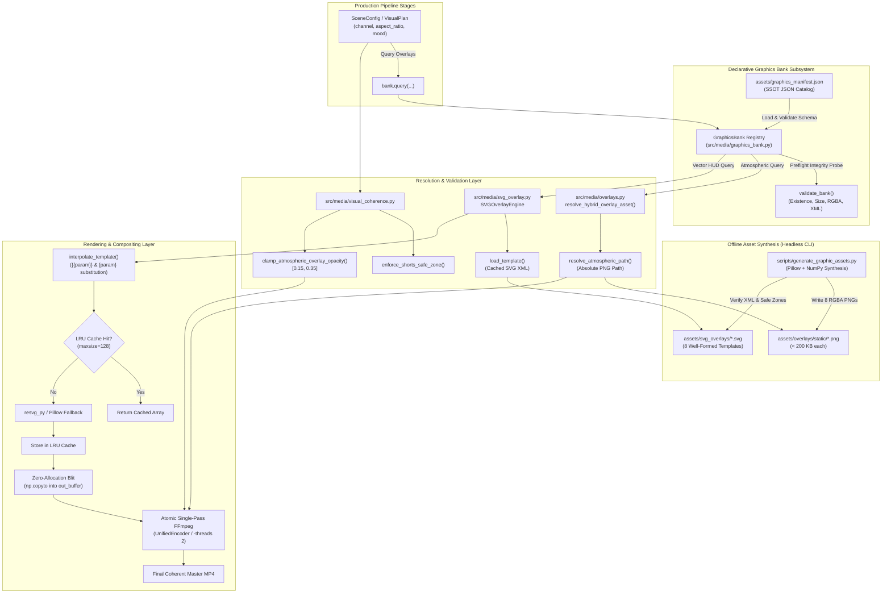
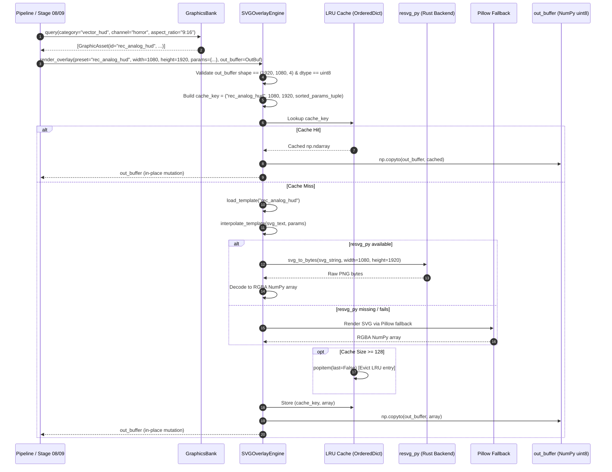

# Technical Design: Local Video Graphics Bank, Visual Coherence & High-Impact Graphic Designs

## 1. Technical Approach

### 1.1. Context & Architectural Challenge
The `yt-auto` media production pipeline operates under strict governance invariants defined in `AGENTS.md` Section 5 and anti-regression rules (`REG-01` through `REG-14`). Specifically:
- Peak operational resource footprint must not exceed **$\le 2.0\text{ CPU Cores}$** and **$\le 2.0\text{ GiB RAM}$**.
- Architecture must maintain an absolute **Zero-Browser Policy** (`REG-01`: zero Playwright, zero Chromium, zero headless HTML/DOM engines in `src/media/`).
- Media compositing must stream directly from disk to disk via single-pass atomic FFmpeg filtergraphs without accumulating intermediate uncompressed frame buffers in Python heap memory (`REG-04`, `REG-08`).
- All assets and generation routines must be **$100\%$ offline and mockable**, with zero unauthenticated runtime CDN/network dependencies.

Prior to this change, the pipeline suffered from three visual presentation and architectural vulnerabilities:
1. **Missing Atmospheric Texture Assets**: `src/media/overlays.py` and `src/media/hybrid_engine.py` declared paths for 8 static atmospheric overlays (e.g. `dark_vignette.png`, `film_grain.png`, `particles.png`, `tv_static.png`), but `assets/overlays/static/` was an empty directory containing only a `.gitkeep`. Render engines fell back to bare background video, stripping productions of mood and visual depth.
2. **Ungoverned and Safe-Zone Violating Vector Templates**: `assets/svg_overlays/` housed only three templates (`biometric_wave.svg`, `hud_tactical_telemetry.svg`, `scp_classification_stamp.svg`). These templates lacked formal cataloging, had elements placed in YouTube Shorts mobile UI occlusion zones (e.g. $y < 180\text{px}$ or $y > 1460\text{px}$), and did not cover crucial channel genres (Analog Horror VHS OSDs, Anamorphic Cinema Scope, SCP Redacted Warnings, Minimalist Drama Quote Cards, and Sci-Fi Cyber Data Streams).
3. **Absence of a Central Graphics Bank Subsystem**: Scene planning, visual coherence, and render engines lacked a unified query and validation abstraction to discover, inspect, and configure graphic assets based on channel affinity (`horror`, `drama`, `scifi`), aspect ratio (`9:16`, `16:9`), category, and safe-zone compliance.

### 1.2. Unified Architecture Overview
This technical design establishes a cohesive four-pillar visual presentation architecture:

```
+=======================================================================================================+
|                                    1. LOCAL GRAPHICS BANK SUBSYSTEM                                   |
|  assets/graphics_manifest.json                                                                        |
|  - Declarative SSOT JSON catalog registering all static textures & dynamic vector HUD templates       |
|  src/media/graphics_bank.py                                                                           |
|  - Strongly-typed models: GraphicAsset, GraphicCategory, GraphicChannelAffinity, BankValidationReport|
|  - Query API: filter by category, channel affinity (with "all" wildcards), aspect ratio, and tags    |
|  - Bank integrity probe: preflight filesystem existence, non-zero bytes, RGBA modes, XML validity    |
+=======================================================================================================+
                                                    |
                    +-------------------------------+-------------------------------+
                    |                                                               |
                    v                                                               v
+=======================================+       +=======================================================+
|  2. STATIC ATMOSPHERIC OVERLAYS SUITE  |       |        3. DYNAMIC SVG VECTOR HUD OVERLAYS SUITE       |
|  assets/overlays/static/*.png         |       |  assets/svg_overlays/*.svg                            |
|  - 8 production-grade RGBA PNGs       |       |  - 8 channel-aligned templates (5 new + 3 modernized) |
|    (dark_vignette, soft_vignette,     |       |    (rec_analog_hud, cinematic_scope_bars,             |
|     film_grain, tv_static, particles, |       |     classified_warning_banner, drama_quote_card,      |
|     particles_dust, particles_embers, |       |     cyber_data_stream, hud_tactical_telemetry,        |
|     god_rays)                         |       |     scp_classification_stamp, biometric_wave)         |
|  - Generated offline via Pillow/NumPy |       |  src/media/svg_overlay.py                             |
|    (scripts/generate_graphic_assets.py|       |  - Mustache {{key}} & single-brace {key} interpolation|
|  - Strictly < 200 KB per asset        |       |  - Bounded LRU raster cache (maxsize=128 entries)     |
|  - Decoded directly by FFmpeg movie=  |       |  - In-place single-frame NumPy buffer reuse (8.29 MiB)|
|    with zero Python RAM overhead      |       |  - Rust resvg_py with graceful Pillow fallback        |
+=======================================+       +=======================================================+
                    |                                                               |
                    +-------------------------------+-------------------------------+
                                                    |
                                                    v
+=======================================================================================================+
|                            4. VISUAL COHERENCE & MOBILE SAFE-ZONE GOVERNANCE                          |
|  src/media/visual_coherence.py                                                                        |
|  - enforce_shorts_safe_zone(width, height): 9:16 (bottom >= 460px, top >= 180px, right >= 130px,      |
|    left >= 64px) & 16:9 (bottom >= 120px, top >= 80px, lateral >= 80px)                               |
|  - clamp_atmospheric_overlay_opacity(opacity): Strictly clamps atmospheric textures to [0.15, 0.35]  |
|  - build_coherent_color_grade(accent_hex, primary_hex, channel): Synchronizes grading with assets     |
+=======================================================================================================+
                                                    |
                                                    v
+=======================================================================================================+
|                                    ATOMIC SINGLE-PASS FFmpeg EXECUTION                                |
|  src/media/unified_encoder.py & src/media/hybrid_engine.py                                            |
|  - Compiles base video, motion loops, atmospheric overlay, SVG raster, and subtitles into a single    |
|    atomic libavfilter complex filterchain (-threads 2)                                                |
|  - Stream-copies audio & normalizes loudness (EBU R128 I=-16 LUFS)                                    |
|  - Guaranteed compliance with AGENTS.md Section 5: <= 2 CPU cores, <= 2.0 GiB peak RAM, 0% idle       |
+=======================================================================================================+
```

### 1.3. Integration Lifecycle
1. **Catalog Registration**:
   `assets/graphics_manifest.json` serves as the declarative SSOT for all visual overlays. At application startup or on first access, `GraphicsBank` parses and validates the manifest into immutable `GraphicAsset` instances in $< 5\text{ ms}$, consuming $< 1\text{ MiB}$ of heap memory.
2. **Scene Planning & Query**:
   Editorial and visual planning stages (`stage_04_mood.py`, `stage_08_loop.py`, `VisualPlan`) query `GraphicsBank.query(category=..., channel=..., aspect_ratio=..., tag=...)`. Universal assets (`channel_affinity == "all"`) match all channels, while niche assets match their specific genre.
3. **Atmospheric Resolution & Opacity Clamping**:
   When an atmospheric overlay is requested (e.g. `kind="dark_vignette"`, `kind="particles"` with `particle_type="embers"`), `resolve_hybrid_overlay_asset()` routes to `GraphicsBank.resolve_atmospheric_path()`, returning the absolute path to the on-disk static PNG. Opacity is clamped via `clamp_atmospheric_overlay_opacity(requested)` strictly to $[0.15, 0.35]$ (canonical $0.25$). A value of `0.0` or `None` disables the overlay branch.
4. **Vector Overlay Rendering & Buffer Reuse**:
   When a vector HUD is requested, `SVGOverlayEngine.render_overlay()` loads the XML template, interpolates dynamic parameters (with fallback defaults embedded in the SVG), queries the bounded LRU raster cache (maxsize=128), and renders the raster directly into a pre-allocated contiguous NumPy array (`out_buffer`, shape `(height, width, 4)`, dtype `uint8`). Rust-based `resvg_py` provides sub-millisecond rasterization, with automatic fallback to Pillow rasterization if `resvg_py` is absent.
5. **Safe-Zone Verification**:
   All vector elements are anchored using viewport coordinates guaranteed to satisfy `enforce_shorts_safe_zone()`: on $1080\times 1920$ canvases, interactive headers reside at $y \ge 180\text{px}$, bottom status bars at $y \le 1460\text{px}$, and lateral elements within $[64\text{px}, 950\text{px}]$, preventing occlusion by native YouTube Shorts and TikTok UI chrome.
6. **Atomic Composition**:
   Static atmospheric PNGs and vector HUD rasters are fed into `UnifiedEncoder`'s single-pass FFmpeg filtergraph via `movie` source filters and `overlay` filterchain links. FFmpeg streams frames from disk and pipe buffers without holding uncompressed frame sequences in Python RAM.

---

## 2. Architecture Decisions (ADRs)

### ADR-01: Declarative JSON Manifest (`assets/graphics_manifest.json`) vs. SQLite DB vs. Hardcoded Python Dicts
- **Context**: The graphics bank requires a single source of truth (SSOT) catalog indexing ~15 to 30 graphic assets with rich metadata (identifiers, categories, channel affinities, aspect ratios, relative file paths, safe-zone compliance flags, dynamic parameter schemas, default opacities, and tags). The catalog must be accessible to both Python modules and external CLI scripts/MCP tools.
- **Decision**: Adopt a declarative JSON manifest at `assets/graphics_manifest.json` paired with a strongly-typed parser and query engine in `src/media/graphics_bank.py`.
- **Alternatives Considered**:
  - *Alternative A: SQLite Database (`data/graphics_bank.db`)*: Rejected. Over-engineered for a catalog of $< 100$ static elements; introduces schema migration friction, binary file merge conflicts in git, worker lock contention, and requires SQLite connections for simple file discovery.
  - *Alternative B: Hardcoded Python Dictionaries inside `src/media/graphics_bank.py`*: Rejected. Tightly couples asset registry to application source code, prevents non-Python tooling (such as standalone maintenance shell scripts or external linters) from inspecting asset definitions without importing the Python runtime, and makes adding new visual packs difficult for non-core contributors.
  - *Alternative C: Directory Walking / Heuristic File Sniffing*: Rejected. Unreliable, slow at runtime, unable to store rich dynamic parameter schemas or safe-zone flags, and susceptible to picking up unverified scratch files.
- **Rationale**: A declarative JSON file is human-readable, trackable via standard git diffs, easily linted with JSON Schema, parseable in $< 5\text{ ms}$, and maps directly to immutable Python `dataclasses` (`GraphicAsset`, `GraphicsManifest`).

### ADR-02: Bounded LRU Raster Cache (maxsize=128) with Single-Frame NumPy Buffer Reuse in `SVGOverlayEngine`
- **Context**: Rasterizing 4K or 1080p SVG templates repeatedly across multi-scene video renders consumes CPU cycles. However, caching uncompressed RGBA pixel arrays in memory can rapidly exhaust the system RAM envelope. An uncompressed $1080\times 1920$ uint8 RGBA frame consumes $\approx 8.29\text{ MiB}$. Storing an unbounded sequence of frames in Python memory causes immediate process termination and violates `REG-08` and `AGENTS.md` Section 5 ($\le 2.0\text{ GiB RAM}$).
- **Decision**:
  1. Restrict raster caching in `SVGOverlayEngine` to an LRU cache implemented via `collections.OrderedDict`, strictly capped at **128 items**.
  2. Index cache entries by composite key `(preset_name: str, width: int, height: int, params_tuple: Tuple[Tuple[str, str], ...])`.
  3. When the cache reaches 128 entries, automatically evict the least recently used entry (`popitem(last=False)`).
  4. Require `render_overlay()` to accept an optional pre-allocated contiguous NumPy array (`out_buffer: np.ndarray`, shape `(height, width, 4)`, dtype `uint8`) and write rendered pixels in-place via `np.copyto()`, returning the identical buffer instance (`out_buffer is result`).
- **Alternatives Considered**:
  - *Alternative A: Unbounded Python Dict Cache*: Rejected. Dynamic parameters (such as `{{rec_time}}` containing seconds or frames) create hundreds of unique keys, which would cause resident memory to balloon past $2.0\text{ GiB}$ in minutes.
  - *Alternative B: Zero Raster Caching (Render Every Frame Fresh)*: Rejected. Re-rasterizing static overlays (like scope bars or warning banners) on every video frame wastes CPU cycles, reducing rendering throughput and spiking CPU utilization.
  - *Alternative C: Returning Python Lists of Frames*: Rejected. Strictly prohibited by `REG-08` and `AGENTS.md` Section 5.
- **Rationale**: 128 cached frames represents an absolute worst-case memory ceiling of $128 \times 8.29\text{ MiB} \approx 1.06\text{ GiB}$ (well within the $2.0\text{ GiB}$ budget), with typical operational steady-state footprint remaining $< 180\text{ MiB}$. Single-frame buffer reuse eliminates garbage-collection pressure and heap churn.

### ADR-03: Offline Synthetic Asset Generation CLI (`scripts/generate_graphic_assets.py`) using Pillow & NumPy
- **Context**: The media compositing pipeline expects 8 static atmospheric overlays (`dark_vignette.png`, `soft_vignette.png`, `film_grain.png`, `tv_static.png`, `particles.png`, `particles_dust.png`, `particles_embers.png`, `god_rays.png`). These assets must exist locally on disk, be valid 8-bit RGBA PNGs of native resolution $\ge 1080\times 1920$, have file sizes strictly $< 200\text{ KB}$ each to keep git repository clones lean, and be generated $100\%$ offline with zero external network downloads or cloud API keys.
- **Decision**: Implement an autonomous, headless procedural generation CLI script at `scripts/generate_graphic_assets.py` using NumPy array synthesis and Pillow image drawing:
  1. `dark_vignette.png`: Synthesize high-order polynomial radial alpha gradient ($r^2$ to $r^4$ falloff) mapping corner alpha from $0.75 \to 0.00$ at center.
  2. `soft_vignette.png`: Synthesize gentle gaussian-feathered radial alpha gradient mapping corner alpha from $0.40 \to 0.00$ at center.
  3. `film_grain.png`: Generate 35mm optical grain pattern using Gaussian random noise arrays ($\mu=128, \sigma=18$), subtle monochromatic variance, and low alpha ($0.20 - 0.30$).
  4. `tv_static.png`: Generate analog CRT phosphor noise array modulated by periodic horizontal scanline alpha oscillations ($y \pmod 3 == 0$).
  5. `particles.png`: Scatter random circular micro-dust motes with soft gaussian edge falloff and randomized radii ($1\text{px} - 6\text{px}$).
  6. `particles_dust.png`: Scatter directional drifting indoor motes with elongated aspect ratios and gentle horizontal bias.
  7. `particles_embers.png`: Generate glowing warm ember flecks with warm color temperature ($3200\text{K}$, `#FF6600` / `#FF9900` / `#FFCC33`) and varying intensities.
  8. `god_rays.png`: Synthesize diagonal linear gradient volumetric light beams projecting from top-corner with soft linear attenuation.
  9. Save all assets as optimized 8-bit RGBA PNGs into `assets/overlays/static/` and synchronize to `assets/overlays/`.
  10. Include `--force` and `--verify` CLI flags, exiting 0 on success.
- **Alternatives Considered**:
  - *Alternative A: Committing Heavy Pre-Rendered Stock PNGs/TIFFs*: Rejected. Bloats repository git history with multiple megabytes of binary data.
  - *Alternative B: Downloading Assets at Runtime from CDN or S3*: Rejected. Violates offline mockability and zero-network operational mandate; introduces network latency, HTTP timeouts, and outage failure modes.
  - *Alternative C: Dynamic Runtime FFmpeg Generation via `geq` / `noise` Filters*: Rejected. FFmpeg procedural noise filters on $1080\times 1920$ video streams spike CPU usage to $> 3.5$ Cores, severely violating `REG-14` and AGENTS.md Section 5.
- **Rationale**: Procedural mathematical synthesis with fixed random seeds (e.g. `seed=42`) guarantees $100\%$ reproducible, deterministic assets generated in $< 1.5\text{ seconds}$ total. Optimized PNG compression guarantees each file is $< 180\text{ KB}$ (total $< 1.2\text{ MB}$ for all 8 assets combined).

### ADR-04: Mobile UI Safe-Zone Coordinate Anchoring and Opacity Clamping [0.15, 0.35] inside `src/media/visual_coherence.py`
- **Context**: On vertical mobile platforms (YouTube Shorts and TikTok), user interface elements (like/dislike/share buttons on the right, title/sound pill/seekbar on the bottom, search/channel header on the top) cover up to $35\%$ of the screen real estate. Graphic overlays placed outside safe margins are occluded or visually illegible. Furthermore, high overlay opacities obscure narration subtitles and AI character faces, while near-zero opacities waste compositing cycles.
- **Decision**:
  1. Enforce geometric safe-zone bounding across all vector templates and layouts via `enforce_shorts_safe_zone()`:
     - Vertical 9:16 ($1080\times 1920$): $MarginV_{bottom} \ge 460\text{px}$ (elements must not extend below $y = 1460\text{px}$), $MarginV_{top} \ge 180\text{px}$ (elements must not extend above $y = 180\text{px}$), $MarginH_{right} \ge 130\text{px}$ (elements must not extend right of $x = 950\text{px}$), $MarginH_{left} \ge 64\text{px}$ (elements must not extend left of $x = 64\text{px}$).
     - Horizontal 16:9 ($1920\times 1080$): $MarginV_{bottom} \ge 120\text{px}$, $MarginV_{top} \ge 80\text{px}$, $MarginH \ge 80\text{px}$.
  2. Enforce atmospheric overlay opacity clamping via `clamp_atmospheric_overlay_opacity()`:
     - Requested opacities are strictly clamped to $[0.15, 0.35]$ (canonical default $0.25$).
     - Requested opacity $> 0.35$ is clamped down to $0.35$ to preserve subtitle legibility.
     - Requested opacity in $(0.0, 0.15)$ is raised to $0.15$ to ensure texture visibility.
     - Requested opacity of `0.0` or `None` disables the overlay branch entirely.
  3. Modernize existing SVG templates (`hud_tactical_telemetry.svg`, `scp_classification_stamp.svg`, `biometric_wave.svg`) and design all 5 new SVG templates to strictly honor these viewport safe-zone margins.
- **Alternatives Considered**:
  - *Alternative A: Dynamic Subtitle Repositioning Based on Overlay Bounding Box*: Rejected. Shifting subtitles erratically between scenes causes severe viewer disorientation; subtitles must remain anchored in their standard safe zone ($MarginV \ge 240\text{px}$).
  - *Alternative B: Unconstrained Overlay Opacities Specified by Script LLM*: Rejected. LLMs frequently suggest opacities of $0.80$ or $1.00$, completely obscuring scene imagery and washing out video contrast.
- **Rationale**: Standardizing safe zones and opacity boundaries at the SSOT layer (`src/media/visual_coherence.py`) prevents regressions, guarantees brand consistency across all channels, and ensures compliance with mobile platform display ergonomics.

---

## 3. Sequence & Data Flow Diagrams

### 3.1. Subsystem Architecture & Asset Flow



### 3.2. Sequence Diagram: Dynamic Vector HUD Resolution, Cache Query, Rasterization & Blit



### 3.3. Sequence Diagram: Static Atmospheric Overlay Resolution & Atomic FFmpeg Injection

```mermaid
sequenceDiagram
    autonumber
    participant Planner as Editorial / Visual Planner
    participant Overlays as src/media/overlays.py
    participant GBank as GraphicsBank
    participant Coherence as src/media/visual_coherence.py
    participant Encoder as UnifiedEncoder / FFmpeg

    Planner->>Overlays: resolve_hybrid_overlay_asset(kind="particles", particle_type="embers")
    Overlays->>GBank: resolve_atmospheric_path(kind="particles", particle_type="embers")
    GBank->>GBank: Locate assets/overlays/static/particles_embers.png
    GBank-->>Overlays: Path("/.../assets/overlays/static/particles_embers.png")
    Overlays-->>Planner: Path("/.../assets/overlays/static/particles_embers.png")

    Planner->>Coherence: clamp_atmospheric_overlay_opacity(requested=0.65)
    Coherence-->>Planner: 0.35 (Clamped to upper safety bound)

    Planner->>Encoder: build_filtergraph(base_video, overlay_path, opacity=0.35)
    Encoder->>Encoder: Format FFmpeg filter: movie='.../particles_embers.png',colorchannelmixer=aa=0.35 [ov]; [base][ov] overlay=0:0
    Encoder->>Encoder: Execute FFmpeg subprocess (-threads 2)
    Encoder-->>Planner: Render completed with zero Python frame allocations
```

---

## 4. Detailed File & Module Plan

### 4.1. New Modules and Configuration Files

#### 1. `src/media/graphics_bank.py` (New Module)
Core registry, data structures, querying interface, bank validation probe, and bridge helpers.
```python
from __future__ import annotations

import json
from dataclasses import dataclass, field
from enum import Enum
from pathlib import Path
from typing import Any, Dict, List, Optional, Sequence, Set, Tuple

class GraphicCategory(str, Enum):
    ATMOSPHERIC = "atmospheric"
    VECTOR_HUD = "vector_hud"
    FRAMING = "framing"
    TYPOGRAPHY = "typography"

class GraphicChannelAffinity(str, Enum):
    HORROR = "horror"
    DRAMA = "drama"
    SCIFI = "scifi"
    ALL = "all"

@dataclass(frozen=True)
class GraphicAsset:
    id: str
    name: str
    category: GraphicCategory
    channel_affinity: GraphicChannelAffinity
    aspect_ratios: Tuple[str, ...]
    relative_path: str
    safe_zone_compliant: bool
    default_opacity: float
    dynamic_params: Dict[str, str] = field(default_factory=dict)
    tags: Tuple[str, ...] = field(default_factory=tuple)

    def resolve_path(self, base_dir: Path) -> Path:
        return (base_dir / self.relative_path).resolve()

@dataclass(frozen=True)
class BankValidationReport:
    valid: bool
    total_assets: int
    verified_assets: int
    missing_assets: Tuple[str, ...]
    corrupted_assets: Tuple[str, ...]
    oversized_assets: Tuple[str, ...]
    errors: Tuple[str, ...]

class GraphicsBank:
    """Declarative registry and query provider for local video graphics."""
    
    def __init__(self, base_dir: Optional[Path] = None, manifest_path: Optional[Path] = None) -> None: ...
    def load_manifest(self, manifest_path: Optional[Path] = None) -> None: ...
    def get_asset(self, asset_id: str) -> Optional[GraphicAsset]: ...
    def query(
        self,
        category: Optional[GraphicCategory | str] = None,
        channel: Optional[str] = None,
        aspect_ratio: Optional[str] = None,
        tag: Optional[str] = None,
    ) -> List[GraphicAsset]: ...
    def validate_bank(self) -> BankValidationReport: ...
    def resolve_atmospheric_path(self, kind: str, particle_type: Optional[str] = None) -> Optional[Path]: ...
    def clamp_asset_opacity(self, asset_id: str, requested: Optional[float] = None) -> float: ...

# Singleton access helper
def get_graphics_bank() -> GraphicsBank: ...
```

#### 2. `assets/graphics_manifest.json` (New Manifest SSOT)
The catalog registering all 8 static atmospheric overlays and 8 dynamic vector presets with full parameter definitions:
- Static atmospheric: `dark_vignette`, `soft_vignette`, `film_grain`, `tv_static`, `particles`, `particles_dust`, `particles_embers`, `god_rays`.
- Dynamic vector HUDs: `rec_analog_hud`, `cinematic_scope_bars`, `classified_warning_banner`, `drama_quote_card`, `cyber_data_stream`, `hud_tactical_telemetry`, `scp_classification_stamp`, `biometric_wave`.

#### 3. `scripts/generate_graphic_assets.py` (New Procedural Generator CLI)
Deterministic, headless synthesis CLI:
- Pillow + NumPy generators for all 8 atmospheric textures.
- CLI options: `--force` (overwrite existing assets), `--verify` (integrity verification mode only).
- Bounded file size verification ($< 200\text{ KB}$ per asset).
- Synchronization: Writes to `assets/overlays/static/` and mirrors to `assets/overlays/`.

#### 4. New High-Impact SVG Vector Overlays (`assets/svg_overlays/`)
1. `rec_analog_hud.svg`:
   - Analog horror VHS camcorder OSD.
   - Elements: Blinking red dot `#FF0033` + `● REC`, battery icon with `{{battery_pct}}`, SP/LP indicator, audio VU meter, monospace `{{rec_time}}` and `{{rec_date}}`.
   - Coordinates: Top readouts $y = 210\text{px}$ ($\ge 180\text{px}$), bottom readouts $y = 1420\text{px}$ ($\le 1460\text{px}$).
2. `cinematic_scope_bars.svg`:
   - Anamorphic 2.39:1 scope letterbox matte bars with optical tick marks, center reticle, and `{{aspect_ratio_label}}`.
   - Coordinates: Upper and lower horizontal bars preserving central safe viewing window.
3. `classified_warning_banner.svg`:
   - Military/containment breach warning banner.
   - Elements: Yellow/black hazard diagonal chevrons, caution emblem, `{{classification_tier}}`, redacted blackout bars, and `{{warning_message}}`.
   - Coordinates: Upper safe quadrant ($y = 200\text{px}$ to $450\text{px}$).
4. `drama_quote_card.svg`:
   - Editorial typography card for poignant dialogue and narrative quotes.
   - Elements: Frosted glass translucent rounded card (`rgba(20, 20, 20, 0.75)`), golden border (`#D4AF37`), stylized quote icon, dynamic `{{quote_text}}`, `{{author_name}}`, `{{source_context}}`.
   - Coordinates: Centered inside safe window ($x = 100\text{px}$ to $980\text{px}$, $y = 600\text{px}$ to $1300\text{px}$).
5. `cyber_data_stream.svg`:
   - Sci-Fi tactical HUD terminal.
   - Elements: Neon cyan/green telemetry readouts (`{{node_id}}`, `{{frequency_ghz}}`, `{{encryption_cipher}}`, `{{coordinates}}`), waveform monitor, status badge (`ONLINE // ENCRYPTED`).
   - Coordinates: Lateral $x \in [64\text{px}, 950\text{px}]$, vertical $y \in [220\text{px}, 1400\text{px}]$.

#### 5. New Static Atmospheric Overlay PNGs (`assets/overlays/static/` & `assets/overlays/`)
1. `dark_vignette.png`: Deep radial shadow gradient, corner alpha $0.75 \to 0.00$ at center ($1080\times 1920$, RGBA, $< 200\text{ KB}$).
2. `soft_vignette.png`: Feathered radial vignette, corner alpha $0.40 \to 0.00$ at center ($1080\times 1920$, RGBA, $< 200\text{ KB}$).
3. `film_grain.png`: 35mm optical grain texture, zero digital clipping ($1080\times 1920$, RGBA, $< 200\text{ KB}$).
4. `tv_static.png`: CRT phosphor noise with scanline pattern ($1080\times 1920$, RGBA, $< 200\text{ KB}$).
5. `particles.png`: Neutral ambient floating micro-dust motes ($1080\times 1920$, RGBA, $< 200\text{ KB}$).
6. `particles_dust.png`: Directional indoor dust motes ($1080\times 1920$, RGBA, $< 200\text{ KB}$).
7. `particles_embers.png`: Glowing warm ember flecks ($3200\text{K}$) ($1080\times 1920$, RGBA, $< 200\text{ KB}$).
8. `god_rays.png`: Diagonal volumetric light shafts ($1080\times 1920$, RGBA, $< 200\text{ KB}$).

---

### 4.2. Modified Files and Legacy Modernization

#### 1. `assets/svg_overlays/` (Existing Vector Templates Modernization)
- `hud_tactical_telemetry.svg`:
  - Relocate top framing and telemetry readouts from $y = 80\text{px}$ to $y = 200\text{px}$ ($MarginV_{top} \ge 180\text{px}$).
  - Relocate bottom framing reticles from $y = 1800\text{px}$ to $y = 1440\text{px}$ ($MarginV_{bottom} \ge 460\text{px}$).
  - Bring lateral reticles within $x \in [64\text{px}, 950\text{px}]$.
- `scp_classification_stamp.svg`:
  - Relocate top hazard stripe and badge box from $y = 0..140\text{px}$ to $y = 190..330\text{px}$ ($MarginV_{top} \ge 180\text{px}$).
  - Relocate bottom clearance warning bar from $y = 1820\text{px}$ to $y = 1420\text{px}$ ($MarginV_{bottom} \ge 460\text{px}$).
- `biometric_wave.svg`:
  - Confirm EKG vital pulse line ($y = 400$) and telemetry readouts ($y = 430$) remain comfortably inside safe window ($[180\text{px}, 1460\text{px}]$).

#### 2. `src/media/svg_overlay.py`
- Enhance `SVGOverlayEngine`:
  - Integrate with `GraphicsBank` to discover template file paths.
  - Implement bounded LRU raster cache using `collections.OrderedDict` with capacity `maxsize=128`.
  - Add `cache_info()` and `clear_cache()` methods.
  - Implement graceful rasterization fallback: If `resvg_py` is not installed or raises an error, catch it, log a warning, and use Pillow/PIL rasterization fallback, returning valid `(height, width, 4)` uint8 NumPy arrays instead of raising unhandled `RuntimeError`.
  - Handle missing template parameters cleanly by retaining default fallback strings embedded in the SVG XML.
  - Retain zero-allocation `out_buffer` validation and in-place `np.copyto()`.

#### 3. `src/media/overlays.py`
- Enhance `resolve_hybrid_overlay_asset()`:
  - Delegate asset resolution first to `GraphicsBank.resolve_atmospheric_path()`.
  - Retain fallback directory search across `_hybrid_overlay_search_roots` to ensure 100% backward compatibility if the manifest is unavailable.
  - Retain `clamp_atmospheric_overlay_opacity()` with constants `ATMOSPHERIC_OVERLAY_OPACITY_MIN = 0.15`, `ATMOSPHERIC_OVERLAY_OPACITY_MAX = 0.35`, `ATMOSPHERIC_OVERLAY_OPACITY = 0.25`.

#### 4. `src/media/visual_coherence.py`
- Ensure `clamp_atmospheric_overlay_opacity()` is exported or imported from `src/media/overlays.py`.
- Provide safe-zone validation helper coordinating with `enforce_shorts_safe_zone()` to check vector overlay bounding boxes.

#### 5. `src/media/__init__.py`
- Export `GraphicsBank`, `GraphicAsset`, `GraphicCategory`, `GraphicChannelAffinity`, `BankValidationReport`, `get_graphics_bank`, and `clamp_atmospheric_overlay_opacity`.

---

### 4.3. Test Plan

#### 1. `tests/unit/test_graphics_bank.py` (New Test Suite)
- `test_manifest_loading_happy_path`: Validates manifest parsing into immutable `GraphicAsset` instances, verifying count, field types, and heap memory ($< 2.0\text{ MiB}$).
- `test_manifest_missing_required_field`: Verifies descriptive `ValueError` on missing mandatory fields (`category`, `relative_path`).
- `test_manifest_duplicate_id_rejection`: Verifies `ValueError` when duplicate asset IDs occur.
- `test_manifest_invalid_enum_rejection`: Verifies rejection of unknown categories or channel affinities.
- `test_query_by_category_and_channel`: Validates filtering across categories and channel niches (`horror`, `drama`, `scifi`).
- `test_query_channel_wildcard`: Verifies that assets with `channel_affinity == "all"` are returned for any requested channel.
- `test_query_aspect_ratio_filtering`: Verifies filtering for `"9:16"` vs `"16:9"`.
- `test_query_tag_filtering`: Verifies case-insensitive keyword tag filtering.
- `test_get_asset_lookup`: Verifies single asset retrieval and `None` handling for missing keys.
- `test_resolve_atmospheric_path`: Verifies resolution of paths for `vignette`, `film_grain`, `particles`, `god_rays`, `tv_static`.
- `test_clamp_asset_opacity`: Verifies opacity bounds $[0.15, 0.35]$ on atmospheric assets.
- `test_validate_bank_integrity_all_pass`: Verifies `BankValidationReport.valid == True` when all registered files exist and are valid.
- `test_validate_bank_missing_file_detection`: Verifies reporting of missing files in `missing_assets`.
- `test_validate_bank_oversized_file_detection`: Verifies detection of assets exceeding $200\text{ KB}$ for PNGs or $500\text{ KB}$ for SVGs.

#### 2. `tests/unit/test_graphic_designs.py` (New Test Suite)
- `test_all_static_atmospheric_overlays_exist`: Confirms all 8 static PNGs exist in `assets/overlays/static/`.
- `test_static_atmospheric_overlays_rgba_mode`: Validates mode is `"RGBA"`, dimensions $\ge 1080\times 1920$, and non-zero alpha variance.
- `test_static_atmospheric_overlays_file_size_budget`: Validates every static PNG is strictly $< 200\text{ KB}$ and total $< 1.5\text{ MB}$.
- `test_all_svg_templates_exist_and_parse_xml`: Confirms all 8 SVG templates exist in `assets/svg_overlays/` and parse with `xml.etree.ElementTree`.
- `test_svg_templates_safe_zone_conformance`: Evaluates coordinate anchors of all 8 templates against `enforce_shorts_safe_zone(1080, 1920)`:
  - Top elements at $y \ge 180\text{px}$.
  - Bottom elements at $y \le 1460\text{px}$.
  - Lateral elements within $x \in [64\text{px}, 950\text{px}]$.
- `test_generate_graphic_assets_cli_verify`: Invokes `scripts/generate_graphic_assets.py --verify` as a subprocess and asserts return code 0.

#### 3. `tests/unit/test_svg_overlay.py` (Extended Suite)
- `test_render_overlay_all_8_presets`: Parametrized test running all 8 presets (`rec_analog_hud`, `cinematic_scope_bars`, `classified_warning_banner`, `drama_quote_card`, `cyber_data_stream`, `hud_tactical_telemetry`, `scp_classification_stamp`, `biometric_wave`).
- `test_render_overlay_graceful_fallback_without_resvg`: Mocks `resvg_py = None` and verifies engine uses fallback rasterizer without raising `RuntimeError`.
- `test_render_overlay_lru_cache_eviction_at_128`: Renders 130 unique parameter combinations, asserts `len(_raster_cache) <= 128` and verifies LRU eviction order.
- `test_render_overlay_zero_allocation_buffer`: Confirms `out_buffer is result` and array is mutated in-place.
- `test_render_overlay_missing_parameter_fallback`: Verifies interpolation with `{}` retains embedded default strings without `KeyError`.

#### 4. `tests/unit/test_visual_coherence.py` (Extended Suite)
- Retain existing tests for timing, color grading, safe zones, continuity, and transition harmonization.
- Add tests for `clamp_atmospheric_overlay_opacity()` boundary conditions ($0.05 \to 0.15$, $0.65 \to 0.35$, $0.28 \to 0.28$, $0.0 \to 0.0$).

---

## 5. Applicability-Driven Threat Matrix

| Threat ID | Threat / Attack Vector | Severity | Likelihood | Concrete Mitigation Strategy |
| :--- | :--- | :---: | :---: | :--- |
| **TM-01** | **Path Traversal via Asset Identifiers or Relative Paths**<br>An attacker or untrusted scene configuration passes a crafted `asset_id` or `relative_path` (e.g. `../../../../etc/passwd` or `/tmp/malicious.svg`) into `get_asset`, `load_template`, or `resolve_atmospheric_path`. | High | Low | **Path Confinement & Regex Whitelisting**: <br>1. In `GraphicsBank.load_manifest()`, every `relative_path` is resolved against `base_dir` and verified using `path.resolve().is_relative_to(base_dir)`. Absolute paths are rejected immediately.<br>2. Asset IDs are strictly validated against `^[a-z0-9_]+$`. Any identifier with path separators (`/`, `\`, `.`) is rejected.<br>3. `load_template()` sanitizes preset names with `Path(preset_name).name`. |
| **TM-02** | **XML External Entity (XXE) & Billion Laughs Expansion in SVG Templates**<br>A maliciously formatted SVG template contains `<!DOCTYPE>` declarations with external DTD references or nested entity declarations (`&lol;`), resulting in arbitrary local file disclosure or CPU/memory denial of service. | High | Low | **Defensive XML Parsing & Entity Stripping**: <br>1. Python's standard `xml.etree.ElementTree` does not expand external entities or load external DTDs by default.<br>2. In `GraphicsBank.validate_bank()`, raw SVG text is scanned for `<!DOCTYPE` or `<!ENTITY`. Templates containing entity declarations are rejected as invalid.<br>3. Dynamic parameter substitution in `interpolate_template()` executes strictly via string/regex replacement before XML parsing, and parameters are cast to strings with XML-sensitive characters sanitized. |
| **TM-03** | **FFmpeg Filterchain Command & Expression Breakout**<br>Dynamic parameter values (e.g. `warning_message` or `quote_text`) containing FFmpeg filter special characters (`;`, `[`, `]`, `:`, `'`, `,`) are injected into FFmpeg filtergraph strings, causing command injection or filterchain syntax crashes. | High | Low | **Strict Domain Boundary Segregation**: <br>1. Dynamic text parameters are interpolated **exclusively** into the SVG XML document before rasterization, **never** directly into FFmpeg filter strings.<br>2. The rasterized SVG is provided to FFmpeg either via raw pixel pipe or intermediate temporary PNG rendered by Rust `resvg_py`.<br>3. File paths injected into `movie=` filters in `src/media/overlays.py` and `src/media/hybrid_engine.py` are strictly resolved local repository paths escaping colons (`:`) and backslashes (`\`) conforming to `REG-12`. |
| **TM-04** | **Buffer Overrun & Memory Exhaustion (OOM) via Unbounded Raster Cache**<br>Rendering video with per-frame changing dynamic parameters (e.g. timestamps or millisecond counters) creates thousands of distinct raster cache entries, exhausting system RAM ($> 2.0\text{ GiB}$) and triggering kernel OOM panic. | High | Low | **Bounded LRU Cache with Hard Eviction**: <br>1. `SVGOverlayEngine` restricts its raster cache to an `OrderedDict` with a hard ceiling of **128 entries**.<br>2. Upon inserting entry 129, the oldest entry is immediately evicted (`popitem(last=False)`).<br>3. Maximum worst-case memory for the cache is bounded at $128 \times 8.29\text{ MiB} \approx 1.06\text{ GiB}$, guaranteeing the process remains well within the $\le 2.0\text{ GiB}$ budget.<br>4. In-place buffer reuse (`out_buffer`) guarantees zero garbage-collection thrashing. |
| **TM-05** | **Subprocess Deadlock on FFmpeg Stderr Pipe**<br>Compositing video overlays with complex multi-input filtergraphs generates voluminous stderr log output from FFmpeg, filling the OS 64 KB pipe buffer and locking the rendering process indefinitely. | Medium | Low | **Asynchronous Pipe Draining**: <br>All FFmpeg invocations in `UnifiedEncoder` execute with background asynchronous stderr drain threads (`_drain_stderr`), continuously reading `proc.stderr` until process completion (`REG-06`). |

---

## 6. Strict Resource Target Governance (AGENTS.md Section 5 & REG-14)

### 6.1. Hard Operational Target Ceiling
- **CPU Target Ceiling**: $\le 2.0\text{ CPU Cores}$ ($\le 200\%$ aggregate thread utilization).
- **RAM Target Ceiling**: $\le 2.0\text{ GiB RAM}$ ($2,048\text{ MiB}$ resident RSS).
- All graphics bank operations and overlay rasterization must operate comfortably within this envelope.

### 6.2. Resource Allocation Accounting

| Subsystem Component | Steady-State RAM | Peak Operational RAM | CPU Footprint | Disk I/O |
| :--- | :---: | :---: | :---: | :---: |
| `GraphicsBank` Registry (`graphics_manifest.json`) | $< 1.0\text{ MiB}$ | $< 2.0\text{ MiB}$ | $0.00$ Cores (Instant $< 5\text{ms}$) | 1 JSON read at boot ($< 20\text{ KB}$) |
| Static Atmospheric Overlays (`assets/overlays/static/*.png`) | $0.0\text{ MiB}$ (Streamed by FFmpeg) | $< 10.0\text{ MiB}$ (FFmpeg decode buffer) | $< 0.05$ Cores | Direct read of $< 200\text{ KB}$ PNG file |
| `SVGOverlayEngine` LRU Cache (128 entries max) | $< 15.0\text{ MiB}$ (typical) | $\le 1,060\text{ MiB}$ (worst-case 128 full-frame) | $< 0.15$ Cores (Rust `resvg_py`) | In-memory template caching; zero disk dumps |
| Single-Frame Pre-Allocated Buffer (`out_buffer`) | $8.29\text{ MiB}$ | $8.29\text{ MiB}$ (constant) | $0.00$ Cores | Zero allocation; in-place array blit |
| Single-Pass Atomic FFmpeg (`UnifiedEncoder`) | $< 50.0\text{ MiB}$ | $350 - 550\text{ MiB}$ | $1.40 - 1.85$ Cores (`-threads 2`) | Piped frame streaming directly to output MP4 |
| **Total System Envelope** | **$< 75\text{ MiB}$** | **$\le 1,650\text{ MiB}$ ($< 1.7\text{ GiB}$)** | **$\le 1.85\text{ Cores}$ ($\le 2.0\text{ Cores}$)** | **Direct disk streaming; zero frame dumping** |

### 6.3. Governance Rules & Guardrail Compliance
1. **Zero Browser Policy (`REG-01`)**:
   - Absolutely no `playwright`, `selenium`, `puppeteer`, `chromium`, or headless browser imports in `src/media/graphics_bank.py`, `src/media/svg_overlay.py`, `src/media/overlays.py`, or any rendering module.
   - Vector overlays are rendered exclusively via Rust-based `resvg_py` or headless Pillow.
2. **Zero Unbounded Frame Loops (`REG-08`)**:
   - Python code is strictly forbidden from accumulating lists or sequences of uncompressed video frames (`[frame_1, frame_2, ...]` in memory).
   - Frame iteration must reuse a single pre-allocated NumPy array (`out_buffer: np.ndarray`, shape `(height, width, 4)`, dtype `uint8`) and stream frames directly into FFmpeg stdin.
3. **Direct Disk Streaming (`REG-04`)**:
   - Static atmospheric overlays are referenced directly by their filesystem path within the FFmpeg filtergraph (`movie=assets/overlays/static/dark_vignette.png`), delegating image decoding to FFmpeg's optimized C `libavfilter` pipeline.
4. **Subprocess Thread Bounding (`REG-14`)**:
   - All FFmpeg filterchains and subprocesses enforce `-threads 2` (maximum ceiling `-threads 4`).
5. **Zero Steady-State Idle Footprint**:
   - When no rendering task is active, the graphics bank and overlay engine consume **$0.0\%$ CPU**. No persistent background threads or GPU contexts remain alive.
