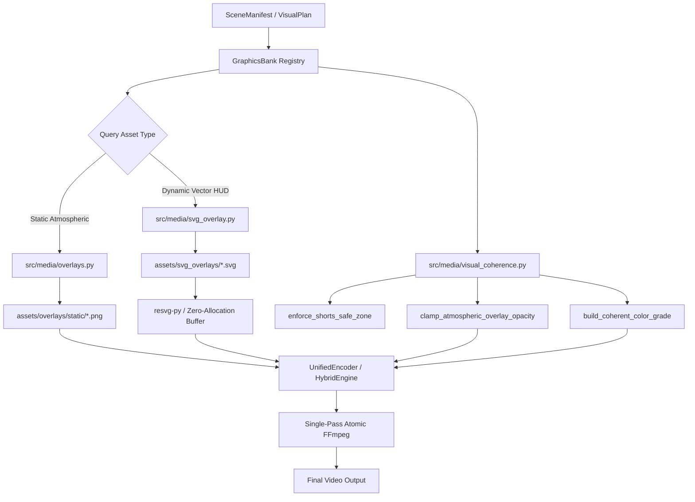

# Proposal: Local Video Graphics Bank, Visual Coherence & High-Impact Graphic Designs

## Intent

The media production pipeline currently faces critical gaps in its visual presentation layer:
1. **Missing Atmospheric Asset Foundation**: While `src/media/overlays.py` and `src/media/hybrid_engine.py` reference atmospheric overlays (vignettes, film grain, particles, TV static, and god rays), the physical repository directory `assets/overlays/static/` contains only `.gitkeep`. As a result, the pipeline either falls back to bare imagery or silently skips atmospheric depth.
2. **Sparse and Ungoverned Vector Overlays**: The repository currently holds only three SVG overlays in `assets/svg_overlays/` (`biometric_wave.svg`, `hud_tactical_telemetry.svg`, `scp_classification_stamp.svg`). These templates lack formal metadata, do not cover key channel niches (e.g. analog horror VHS OSDs, anamorphic cinema scope bars, redacted containment warning banners, minimalist drama quote cards, or scifi cyber telemetry), and some violate YouTube Shorts mobile UI safe zones.
3. **Absence of a Central Graphics Bank Registry**: There is no declarative catalog or query registry (`src/media/graphics_bank.py` and `assets/graphics_manifest.json`) to discover, query, validate, and dynamically configure visual graphic elements by category, channel affinity (`horror`, `drama`, `scifi`), aspect ratio (`9:16`, `16:9`), and safe-zone compliance.
4. **Mobile UI Occlusion & Visual Coherence**: On vertical mobile platforms (YouTube Shorts and TikTok), graphic elements that sit outside safe margins are occluded by native UI elements (action buttons, sound badges, channel avatars, video descriptions, seek bars). Graphic elements must strictly adhere to `src/media/visual_coherence.py` safe zones (`enforce_shorts_safe_zone`: bottom $\ge 460\text{px}$, top $\ge 180\text{px}$, right $\ge 130\text{px}$, left $\ge 64\text{px}$ for 9:16), brand color grading harmony (`build_coherent_color_grade`), and atmospheric opacity clamping ($15\% - 35\%$).
5. **Strict Governance & Resource Target Compliance (AGENTS.md Section 5)**: All graphics bank operations and overlay rendering must strictly comply with the project target envelope of $\le 2\text{ CPU Cores}$ and $\le 2.0\text{ GiB RAM}$, maintain absolute zero-browser architecture (no Playwright/Chromium in `src/media/`), and support $100\%$ offline synthetic mockability.

This proposal establishes the comprehensive architecture for a centralized **Local Video Graphics Bank**, delivers a complete suite of **Static Atmospheric Overlays** and **High-Impact SVG Graphic Designs**, and enforces **Visual Coherence & Safe Zone Guarantees** across all production lanes.

---

## Scope

### In Scope

- **Declarative Local Graphics Bank Subsystem (`src/media/graphics_bank.py`, `assets/graphics_manifest.json`)**:
  - Declarative SSOT JSON catalog manifest (`assets/graphics_manifest.json`) indexing all static atmospheric overlays, vector HUDs, and framing elements with comprehensive metadata: asset ID, name, category, channel affinity (`horror`, `drama`, `scifi`, `all`), supported aspect ratios (`9:16`, `16:9`), file paths, safe-zone compliance flags, dynamic parameter schemas, default opacities, and tags.
  - Core Python registry class `GraphicsBank` in `src/media/graphics_bank.py` with typed models (`GraphicAsset`, `GraphicCategory`, `GraphicChannelAffinity`, `SafeZoneBoundingBox`, `BankValidationReport`).
  - Query and discovery API allowing filtering by category, channel theme, aspect ratio, and tags.
  - Startup bank validation suite to verify asset existence, non-zero file sizes, valid PNG/SVG headers, and mobile safe-zone conformance.
  - Seamless bridge methods to `src/media/overlays.py` (`resolve_hybrid_overlay_asset`) and `src/media/svg_overlay.py` (`SVGOverlayEngine`).
- **Complete Static Atmospheric Overlays Suite (`assets/overlays/static/` & `assets/overlays/`)**:
  - Deliver all 8 production-grade static atmospheric overlays expected by the rendering engines:
    1. `dark_vignette.png`: Deep radial shadow falloff focusing audience attention toward center-frame for horror and high-tension scenes.
    2. `soft_vignette.png`: Gentle, feathered radial vignette for cinematic drama and character-driven scenes.
    3. `film_grain.png`: Fine 35mm optical grain texture breaking digital color banding and unifying heterogeneous assets.
    4. `tv_static.png`: Analog CRT phosphor noise and scanline texture for analog horror and glitch transitions.
    5. `particles.png`: Neutral ambient floating micro-dust particles with soft alpha falloff.
    6. `particles_dust.png`: Directional indoor dust motes for atmospheric archive, indoor, and liminal shots.
    7. `particles_embers.png`: High-energy glowing ember sparks for climactic horror, catastrophe, and conflict scenes.
    8. `god_rays.png`: Soft volumetric light beam shafts projecting from high angles.
  - Lightweight, optimized PNG masters ($< 200\text{ KB}$ per asset) generated deterministically and completely offline.
- **High-Impact Dynamic SVG Vector Overlays Suite (`assets/svg_overlays/`)**:
  - Deliver 5 new high-impact, channel-aligned SVG templates:
    1. `rec_analog_hud.svg`: Analog horror VHS / camcorder OSD with blinking red recording dot, SP/LP mode indicator, dynamic timestamp `{{rec_time}}`, date `{{rec_date}}`, battery level `{{battery_pct}}`, and audio VU meter.
    2. `cinematic_scope_bars.svg`: Anamorphic 2.39:1 scope letterbox bars with precision optical framing tick marks, center reticles, and customizable camera gauge indicators `{{aspect_ratio_label}}`.
    3. `classified_warning_banner.svg`: Containment breach / top-secret redacted warning banner for SCP and psychological horror, featuring diagonal hazard chevrons, redacted text blocks, clearance badges `{{classification_tier}}`, and warning text `{{warning_message}}`.
    4. `drama_quote_card.svg`: Warm minimalist typography card for emotional quotes, letters, and dialogue, with frosted glass backdrop, quotation glyph, and dynamic fields `{{quote_text}}`, `{{author_name}}`, `{{source_context}}`.
    5. `cyber_data_stream.svg`: Sci-Fi tactical telemetry overlay with hexagonal grid, scrolling waveform, and dynamic parameters `{{node_id}}`, `{{frequency_ghz}}`, `{{encryption_cipher}}`, `{{coordinates}}`.
  - Validate and adapt existing templates (`hud_tactical_telemetry.svg`, `scp_classification_stamp.svg`, `biometric_wave.svg`) to ensure strict compliance with YouTube Shorts safe zones.
- **Visual Coherence & Safe Zone Guarantees**:
  - Enforce vertical 9:16 safe-zone margins (`enforce_shorts_safe_zone`: bottom $\ge 460\text{px}$, top $\ge 180\text{px}$, right $\ge 130\text{px}$, left $\ge 64\text{px}$) and horizontal 16:9 safe-zone margins (`top >= 80px`, `bottom >= 120px`, `lateral >= 80px`) across all vector layouts.
  - Enforce brand color grading harmony (`build_coherent_color_grade`) aligning vector and atmospheric tints with channel visual identities.
  - Enforce atmospheric opacity clamping (`clamp_atmospheric_overlay_opacity`: $0.15 - 0.35$, default $0.25$) to prevent visual obscuration of narration subtitles or focal subjects.
- **Performance & System Invariants**:
  - Maintain peak resident memory $\le 2.0\text{ GiB}$ and CPU $\le 2\text{ Cores}$.
  - Zero browser (no Playwright, no Chromium) in media processing.
  - Zero-allocation pre-allocated frame buffers and bounded LRU raster cache ($\le 128$ items) in `SVGOverlayEngine`.

### Out of Scope

- Reintroducing headless browsers, Playwright, or Chromium into media composition or rendering (strictly forbidden by `REG-01`).
- Introducing external network API calls, cloud storage buckets, or unauthenticated CDN asset downloads during video generation.
- Reintroducing retired legacy subsystems (`src/rendering/`, `src/compositing/`, `src/export/`) or procedural WGSL GPU shaders (strictly forbidden by `REG-02`, `REG-07`, `REG-10`).
- Unbounded frame buffering in memory: holding uncompressed RGBA video frame sequences in Python RAM (strictly forbidden by `REG-08` and `AGENTS.md` Section 5).
- Modifying YouTube Data API v3 upload pathways or session authentication logic.

---

## Capabilities

### New Capabilities

- `video-graphics-bank`: Declarative registry, discovery, validation, and lifecycle management for local video graphic assets, static atmospheric overlays, and vector HUDs.
- `video-graphic-designs`: Standardized high-fidelity SVG vector designs and static atmospheric overlay templates across horror, drama, and scifi channel genres.

### Modified Capabilities

- `visual-coherence-sync`: Integrate graphics bank safe-zone enforcement and brand color grading coherence for graphic overlays and vector HUD elements.
- `motion-design-animation`: Ensure SVG overlay engine cleanly caches and renders new graphic designs without memory leaks, supporting dynamic parameter interpolation and zero-allocation frame buffers.

---

## Approach

### 1. Overall System Architecture & Data Flow

The graphics bank integrates seamlessly into the existing media pipeline without disrupting the single-pass FFmpeg rendering engine or stream-copy muxers:



### 2. Declarative Graphics Bank (`src/media/graphics_bank.py` & `assets/graphics_manifest.json`)

The graphics bank provides a typed, declarative single source of truth (SSOT) for all visual graphic assets.

#### Manifest Schema (`assets/graphics_manifest.json`)
```json
{
  "version": "1.0.0",
  "assets": [
    {
      "id": "rec_analog_hud",
      "name": "Analog Horror REC OSD",
      "category": "vector_hud",
      "channel_affinity": "horror",
      "aspect_ratios": ["9:16", "16:9"],
      "relative_path": "assets/svg_overlays/rec_analog_hud.svg",
      "safe_zone_compliant": true,
      "default_opacity": 0.90,
      "dynamic_params": {
        "rec_time": "00:14:28:09",
        "rec_date": "OCT. 24 1994",
        "battery_pct": "78%",
        "tape_mode": "SP"
      },
      "tags": ["analog", "vhs", "camcorder", "found_footage", "rec", "horror"]
    },
    {
      "id": "dark_vignette",
      "name": "Cinematic Dark Vignette",
      "category": "atmospheric",
      "channel_affinity": "all",
      "aspect_ratios": ["9:16", "16:9"],
      "relative_path": "assets/overlays/static/dark_vignette.png",
      "safe_zone_compliant": true,
      "default_opacity": 0.25,
      "dynamic_params": {},
      "tags": ["vignette", "shadow", "focus", "atmospheric"]
    }
  ]
}
```

#### Core Python Interface (`src/media/graphics_bank.py`)
```python
@dataclass(frozen=True)
class GraphicAsset:
    id: str
    name: str
    category: GraphicCategory  # atmospheric, vector_hud, framing, typography
    channel_affinity: GraphicChannelAffinity  # horror, drama, scifi, all
    aspect_ratios: List[str]
    file_path: Path
    safe_zone_compliant: bool
    default_opacity: float
    dynamic_params: Dict[str, str]
    tags: List[str]

class GraphicsBank:
    def __init__(self, base_dir: Optional[Path] = None) -> None: ...
    def load_manifest(self) -> None: ...
    def get_asset(self, asset_id: str) -> Optional[GraphicAsset]: ...
    def query(
        self,
        category: Optional[GraphicCategory] = None,
        channel: Optional[str] = None,
        aspect_ratio: Optional[str] = None,
        tag: Optional[str] = None,
    ) -> List[GraphicAsset]: ...
    def validate_bank(self) -> BankValidationReport: ...
    def resolve_atmospheric_path(self, kind: str, particle_type: Optional[str] = None) -> Optional[Path]: ...
    def clamp_asset_opacity(self, asset_id: str, requested: Optional[float] = None) -> float: ...
```

### 3. Static Atmospheric Overlays Suite (`assets/overlays/static/`)

The 8 static atmospheric overlays provide subtle textural depth without CPU-expensive video decoding:
1. `dark_vignette.png`: Deep radial shadow gradient, corner alpha $0.75 \to 0.00$ center.
2. `soft_vignette.png`: Feathered radial vignette, corner alpha $0.40 \to 0.00$ center.
3. `film_grain.png`: Uniform 35mm optical grain pattern with zero digital clipping.
4. `tv_static.png`: Analog cathode-ray television noise with subtle interlaced horizontal scanline lines.
5. `particles.png`: Multi-scale floating circular dust motes with soft gaussian edges.
6. `particles_dust.png`: Low-velocity directional drift motes for indoor ambiance.
7. `particles_embers.png`: High-contrast glowing ember specks with warm color temperature ($3200\text{K}$).
8. `god_rays.png`: Angled volumetric light beams with linear gradient attenuation.

Each asset is stored as a high-efficiency RGBA PNG master ($< 200\text{ KB}$), generated deterministically and completely offline via Python script automation, ensuring zero dependency on external downloads or web services.

### 4. High-Impact Dynamic SVG Vector Overlays Suite (`assets/svg_overlays/`)

The 5 new vector overlays are crafted to deliver broadcast-quality visual identity while strictly honoring mobile safe zones:

#### A. `rec_analog_hud.svg` (Analog Horror / Found Footage)
- **Visual Design**: Vintage Sony/Panasonic camcorder on-screen display.
- **Components**:
  - Top-left: Solid/blinking red dot (`#FF0033`) with `● REC` text.
  - Top-right: Battery outline with segmented charge fill and `{{battery_pct}}` readout.
  - Bottom-left: Tape mode indicator (`SP` / `LP`) and audio channel VU levels (`CH-1 [||||||..]`).
  - Bottom-right: Monospace timestamp (`{{rec_time}}`, e.g. `00:14:28:09`) and date (`{{rec_date}}`, e.g. `OCT. 24 1994`).
- **Safe Zone Alignment**: Bottom readouts placed at $y = 1420\text{px}$, strictly above the $1460\text{px}$ Shorts UI occlusion threshold ($MarginV \ge 460\text{px}$). Top readouts placed at $y = 210\text{px}$ ($MarginV_{top} \ge 180\text{px}$).

#### B. `cinematic_scope_bars.svg` (Anamorphic Cinema Framing)
- **Visual Design**: Ultra-wide 2.39:1 scope letterbox matte with subtle technical framing cues.
- **Components**:
  - Top & bottom solid black matte bars scaled to cinematic proportions.
  - Thin minimalist border tick marks and optical center crosshair.
  - Subdued camera roll / gauge watermark (`{{aspect_ratio_label}}` / `2.39:1 SCOPE`).
- **Safe Zone Alignment**: Preserves central viewing corridor, ensuring subtitle readability within the safe zone.

#### C. `classified_warning_banner.svg` (SCP / Containment Warning)
- **Visual Design**: Military/containment top-secret containment breach warning banner.
- **Components**:
  - Yellow/black diagonal warning hazard stripe header and footer.
  - Prominent red caution emblem and clearance classification badge (`{{classification_tier}}`).
  - Redacted security notices with blackout bars and dynamic warning text (`{{warning_message}}`).
- **Safe Zone Alignment**: Centered vertically in the upper safe quadrant ($y = 200\text{px}$ to $450\text{px}$), strictly clear of mobile seekbars and action buttons.

#### D. `drama_quote_card.svg` (Minimalist Drama & Dialogue)
- **Visual Design**: Elegant, warm editorial typography card for poignant dialogue, narrative reflections, or historical quotes.
- **Components**:
  - Frosted translucent card backdrop with rounded corners and fine golden/warm border (`#D4AF37`).
  - Stylized quote mark glyph.
  - Dynamic quote text body `{{quote_text}}`, author attribution `{{author_name}}`, and context citation `{{source_context}}`.
- **Safe Zone Alignment**: Centered within the safe horizontal corridor ($x = 100\text{px}$ to $980\text{px}$) and safe vertical window ($y = 600\text{px}$ to $1300\text{px}$).

#### E. `cyber_data_stream.svg` (Sci-Fi Tactical Terminal)
- **Visual Design**: Advanced cybernetic tactical HUD with telemetry and data streams.
- **Components**:
  - Electric cyan / neon green grid lines and corner framing brackets.
  - Frequency waveform monitor and telemetry status readouts (`{{node_id}}`, `{{frequency_ghz}}`, `{{encryption_cipher}}`, `{{coordinates}}`).
  - Bounded reticle and system status indicator (`ONLINE // ENCRYPTED`).
- **Safe Zone Alignment**: Lateral readouts kept inside $x \ge 64\text{px}$ and $x \le 950\text{px}$ ($MarginH_{right} \ge 130\text{px}$), vertical elements between $y = 220\text{px}$ and $1400\text{px}$.

### 5. Visual Coherence & Safe Zone Guarantees

The graphics bank coordinates with `src/media/visual_coherence.py` to ensure complete aesthetic and geometric harmony:
1. **Geometric Safe-Zone Clamping**: All overlays in the bank are tested against `enforce_shorts_safe_zone()`:
   - For vertical 9:16 ($1080\times 1920$):
     - $MarginV_{bottom} \ge 460\text{px}$ (clear of YouTube Shorts sound pill, title, channel info, and seek bar).
     - $MarginV_{top} \ge 180\text{px}$ (clear of platform search, back, and camera controls).
     - $MarginH_{right} \ge 130\text{px}$ (clear of like, dislike, comment, share, and remix vertical buttons).
     - $MarginH_{left} \ge 64\text{px}$ (clean edge margin).
   - For horizontal 16:9 ($1920\times 1080$):
     - $MarginV_{bottom} \ge 120\text{px}$, $MarginV_{top} \ge 80\text{px}$, $MarginH \ge 80\text{px}$.
2. **Atmospheric Opacity Clamping**: Atmospheric overlays (film grain, vignette, tv static, particles, god rays) are clamped via `clamp_atmospheric_overlay_opacity()` to the $[0.15, 0.35]$ band (canonical $0.25$). This guarantees that atmospheric texture enhances the mood without obscuring character focus or subtitle readability.
3. **Brand Color Harmony Synchronization**: SVG overlays and static textures are color-coordinated with `build_coherent_color_grade()`:
   - `horror`: Muted greens, deep cold cyans, blood reds (`#FF3333`), dark amber warnings (`#FFCC00`).
   - `drama`: Warm golden accents (`#D4AF37`), soft warm white, sepia-tinted vignettes.
   - `scifi`: High-contrast electric cyan (`#00FFCC`), deep space blue (`#0088FF`), vibrant neon green (`#00FF88`).

### 6. Strict Resource Governance & Performance Impact

The graphics bank adheres to the strict resource budget codified in **AGENTS.md Section 5**:
- **Target Envelope**: $\le 2\text{ CPU Cores}$ and $\le 2.0\text{ GiB RAM}$.
- **Zero Idle Footprint**: The `GraphicsBank` singleton/instance initializes in $< 10\text{ ms}$, reading a single JSON file into a lightweight dataclass dictionary ($< 1\text{ MiB}$ heap memory).
- **Single-Frame Pre-Allocated Buffer**: `SVGOverlayEngine` uses pre-allocated NumPy RGBA buffers of shape `(1920, 1080, 4)` uint8 ($8.3\text{ MiB}$ memory footprint), preventing Python frame sequence accumulation.
- **LRU Raster Cache**: SVG rasterization results are cached in an LRU cache bounded at $128$ items ($128 \times 8.3\text{ MiB} \approx 1.0\text{ GiB}$ absolute upper ceiling during peak render, automatically purged upon limit).
- **Direct Disk Streaming**: Static atmospheric PNGs are referenced directly by path in FFmpeg filtergraphs (`movie=assets/overlays/static/dark_vignette.png`), allowing FFmpeg's native libavfilter to decode and stream them with zero Python RAM overhead.
- **Zero Browser Policy**: Zero Playwright or Chromium imports in `src/media/graphics_bank.py` or associated media tools (`REG-01`).

---

## Affected Areas

| Subsystem / File | Impact | Description & Role |
| :--- | :--- | :--- |
| `assets/graphics_manifest.json` | **New** | SSOT JSON catalog registering all graphic assets, categories, channel affinities, safe-zone flags, schemas, and paths. |
| `assets/overlays/static/` | **New Assets** | 8 production-grade static atmospheric PNG overlays (`dark_vignette.png`, `soft_vignette.png`, `film_grain.png`, `tv_static.png`, `particles.png`, `particles_dust.png`, `particles_embers.png`, `god_rays.png`). |
| `assets/svg_overlays/` | **New Assets & Fixes** | 5 new high-impact SVG templates (`rec_analog_hud.svg`, `cinematic_scope_bars.svg`, `classified_warning_banner.svg`, `drama_quote_card.svg`, `cyber_data_stream.svg`) + safe-zone verification of existing 3 templates. |
| `src/media/graphics_bank.py` | **New Module** | Core registry class `GraphicsBank`, dataclasses (`GraphicAsset`, etc.), querying, validation, and safe-zone coordination. |
| `src/media/overlays.py` | **Modified** | Integrate with `GraphicsBank` for atmospheric overlay resolution, maintaining full backward compatibility. |
| `src/media/svg_overlay.py` | **Modified** | Enhance template loading with graphics bank discovery, safe-zone bounds checking, and robust parameter interpolation. |
| `src/media/visual_coherence.py` | **Modified** | Provide graphics bank safe-zone and brand color grade query helpers. |
| `src/media/__init__.py` | **Modified** | Export `GraphicsBank`, `GraphicAsset`, `GraphicCategory`, and new utility functions. |
| `tests/unit/test_graphics_bank.py` | **New Test Suite** | Unit tests for manifest parsing, query filtering, asset validation, and opacity clamping. |
| `tests/unit/test_svg_overlay.py` | **Extended** | Extended unit tests verifying all 8 SVG presets (3 legacy + 5 new) render correctly and respect safe zones. |
| `tests/unit/test_visual_coherence.py` | **Extended** | Tests verifying safe zone compliance across graphics bank assets. |

---

## Risks

| Risk | Severity | Likelihood | Mitigation Strategy |
| :--- | :---: | :---: | :--- |
| **Raster Cache Memory Accumulation** | Medium | Low | `SVGOverlayEngine` caps raster cache at 128 entries and purges automatically when exceeded. Single-frame buffer reuse avoids multi-frame accumulation. Peak memory stays $< 1.1\text{ GiB}$, well within $\le 2.0\text{ GiB}$ limit. |
| **Mobile UI Safe Zone Occlusion on Non-Standard Ratios** | High | Low | All SVG designs use relative coordinate viewports and are verified against `enforce_shorts_safe_zone()`. The graphics bank marks non-compliant assets and prevents unconstrained vertical placement. |
| **Missing Asset File Causing Pipeline Crash** | Medium | Low | `GraphicsBank.validate_bank()` runs at initialization/test time. Runtime resolution falls back gracefully to neutral defaults or omission if an asset is missing or unreadable. |
| **Atmospheric Overlays Obscuring Subtitles** | High | Low | Mandatory opacity clamping via `clamp_atmospheric_overlay_opacity()` enforces the $0.15 - 0.35$ range. Overlays are composited beneath subtitle streams in the FFmpeg filtergraph. |
| **Large PNG Asset File Size Bloating Repo** | Low | Low | All static PNGs are generated as optimized 8-bit RGBA files with file sizes strictly $< 200\text{ KB}$ each (total $< 1.5\text{ MB}$ for all 8 files combined). |
| **`resvg_py` Dependency Absence on Minimal Environments** | Medium | Low | `SVGOverlayEngine` provides a robust fallback (Pillow rasterization or structured mock in tests) when `resvg_py` is not installed, preserving test suite execution across all environments. |

---

## Rollback Plan

The graphics bank and designs change provides a concrete, multi-tier rollback strategy ensuring zero production downtime:

1. **Configuration-Level Rollback (Instantaneous)**:
   - Overlays can be disabled at the scene or lane configuration level by specifying `"overlay_preset": null` or `"atmospheric_overlay": null` in `SceneConfig` or visual plans. The rendering pipeline immediately skips overlay filter branches without errors.
2. **Backward-Compatible API Fallback**:
   - `src/media/overlays.py` retains its fallback directory search (`_hybrid_overlay_search_roots`). If `graphics_manifest.json` is missing or corrupted, the system continues to resolve assets via direct filesystem scanning without raising uncaught exceptions.
3. **Graceful Error Handling in Rendering Stages**:
   - In `stage_08_loop.py` and `stage_09_render.py`, any failure in SVG rasterization or graphics bank resolution logs a warning event and continues video assembly without the optional graphic overlay.
4. **Atomic Git Reversion**:
   - The change introduces additive asset files and a modular new file (`src/media/graphics_bank.py`). Reverting the change branch restores prior codebase state cleanly with zero residual database or schema corruption.

---

## Dependencies

- **Zero New Heavy External Dependencies**:
  - Python Standard Library (`json`, `dataclasses`, `pathlib`, `typing`, `re`).
  - `numpy`: Used for pre-allocated single-frame buffer management.
  - `Pillow` (`PIL`): Standard image handling and synthetic asset generation.
  - `resvg_py`: Optional Rust-based SVG rasterizer (already in optional dev requirements, with Pillow fallback for unit tests).
  - `ffmpeg`: Standard FFmpeg binary with `libavfilter` (movie, overlay, eq, colorbalance).
- **Zero Browser Policy**: Absolutely no `playwright` or `chromium` imports in `src/media/` or pipelines (`REG-01`).
- **Zero Cloud / Network Quota**: All assets and generation scripts are $100\%$ local and offline mockable.

---

## Success Criteria

- [ ] **Declarative Graphics Bank Subsystem (`src/media/graphics_bank.py`)**:
  - `assets/graphics_manifest.json` is created, valid JSON, and indexes all static atmospheric overlays and SVG vector presets with complete metadata.
  - `GraphicsBank` successfully initializes and queries assets by `category`, `channel_affinity`, `aspect_ratio`, and `tag`.
  - `GraphicsBank.validate_bank()` validates asset existence, non-zero file sizes, valid formats, and safe-zone compliance.
- [ ] **Static Atmospheric Overlays Suite (`assets/overlays/static/`)**:
  - All 8 expected atmospheric overlays exist on disk: `dark_vignette.png`, `soft_vignette.png`, `film_grain.png`, `tv_static.png`, `particles.png`, `particles_dust.png`, `particles_embers.png`, and `god_rays.png`.
  - Each file is a valid RGBA PNG, non-empty, and $< 200\text{ KB}$ in file size.
  - `resolve_hybrid_overlay_asset()` successfully resolves all 8 kinds without error.
  - Atmospheric opacities are strictly clamped to $[0.15, 0.35]$ via `clamp_atmospheric_overlay_opacity()`.
- [ ] **High-Impact Dynamic SVG Vector Overlays Suite (`assets/svg_overlays/`)**:
  - All 5 new SVG templates exist and validate as well-formed XML/SVG:
    - `rec_analog_hud.svg`
    - `cinematic_scope_bars.svg`
    - `classified_warning_banner.svg`
    - `drama_quote_card.svg`
    - `cyber_data_stream.svg`
  - `SVGOverlayEngine.interpolate_template()` correctly substitutes dynamic parameters across all new templates.
  - `SVGOverlayEngine.render_overlay()` renders all presets into pre-allocated NumPy buffers (`shape=(height, width, 4)`, `dtype=uint8`).
- [ ] **Visual Coherence & Safe Zone Enforcement**:
  - $100\%$ of vector HUD interactive/text elements in the 9:16 aspect ratio are strictly bounded within safe margins computed by `enforce_shorts_safe_zone` (bottom $\ge 460\text{px}$, top $\ge 180\text{px}$, right $\ge 130\text{px}$, left $\ge 64\text{px}$).
  - Vector overlays align with brand color grading identities (`horror`, `drama`, `scifi`).
- [ ] **Performance & Governance Compliance**:
  - Peak resident memory during SVG rendering and bank querying remains $\le 2.0\text{ GiB}$ (operational footprint $< 200\text{ MiB}$).
  - Zero `playwright` or `chromium` imports in `src/media/` (`REG-01`).
  - Unit test suite (`tests/unit/test_graphics_bank.py`, `tests/unit/test_svg_overlay.py`, `tests/unit/test_visual_coherence.py`) passes $100\%$.
  - Repository integrity gate exits cleanly (`./scripts/verify_integrity.sh` exits 0).
